# COMET PlantUML Templates

Use this reference only when producing executable PlantUML blocks.

## Table of Contents

- Requirements Templates
  - Use Case Diagram
  - Activity Diagram
- Analysis Templates
  - Communication Diagram
  - Sequence Diagram
  - State Machine
- Design Templates
  - Integrated Communication Diagram
  - Simple Modular Monolith Subsystem Diagram
  - Simple Modular Monolith Component Diagram
  - Simple Modular Monolith Deployment Diagram
  - Distributed Subsystem Diagram
  - Distributed Component Diagram
  - Distributed Deployment Diagram
  - Wrapper Class Diagram

## Requirements Templates

### Use Case Diagram

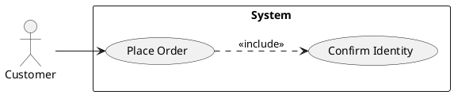

### Activity Diagram

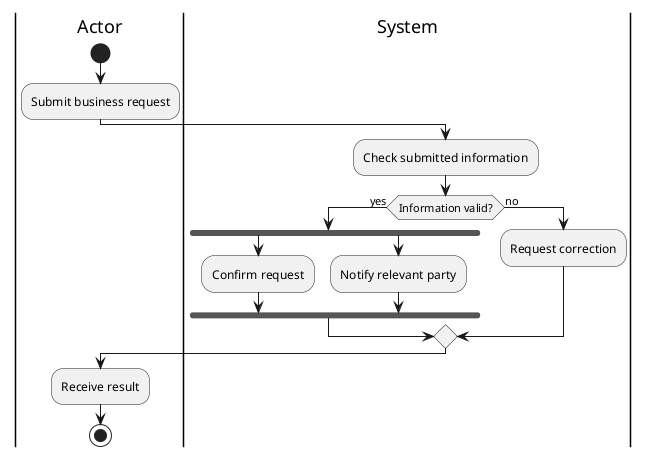

## Analysis Templates

### Communication Diagram

Use this as the default interaction diagram for ordinary COMET use cases.

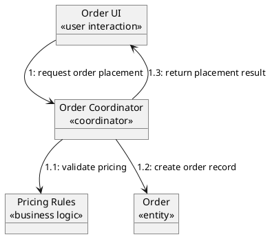

### Sequence Diagram

Use this only for very long, deeply conditional, or loop-heavy interactions.

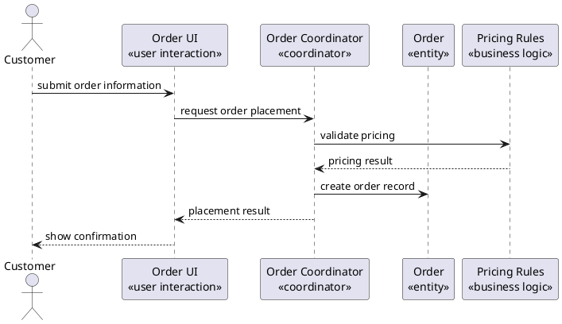

### State Machine

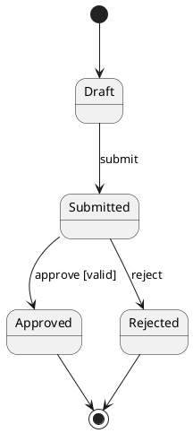

## Design Templates

Use the simple modular templates first unless the Requirements, NFRs, topology, or deployment constraints justify distributed services, API Gateway, independent databases, or container orchestration.

### Integrated Communication Diagram

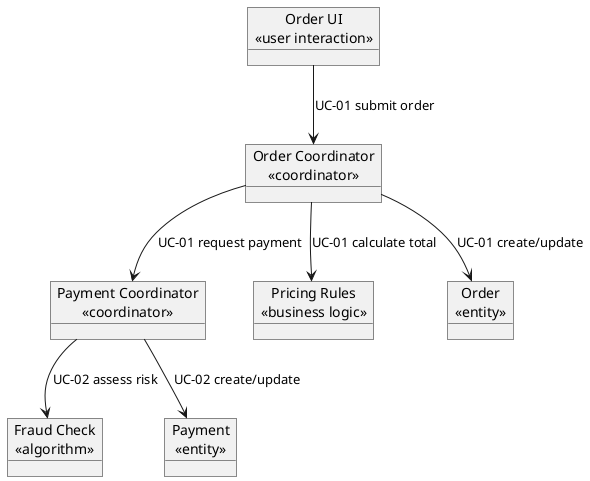

### Simple Modular Monolith Subsystem Diagram

Use this when the system can be deployed as one application while preserving clear internal module boundaries.

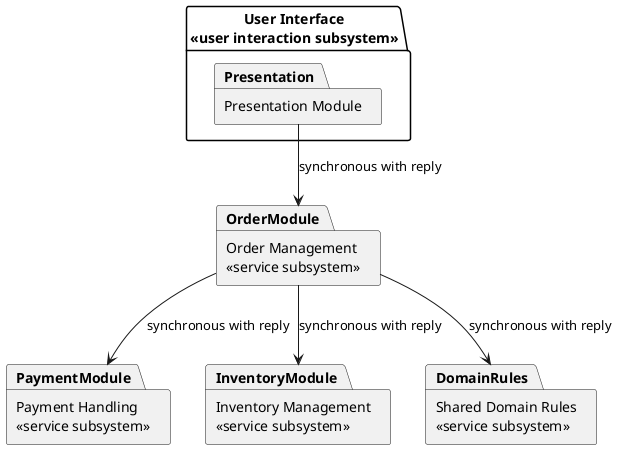

### Simple Modular Monolith Component Diagram

Use this for a component view of one deployable application. Keep protocols out unless crossing a process or network boundary.

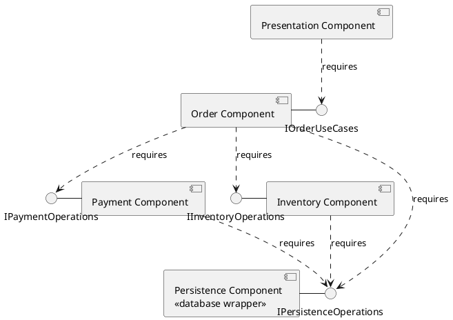

### Simple Modular Monolith Deployment Diagram

Use this when the system is one deployable application with one owned persistence boundary.

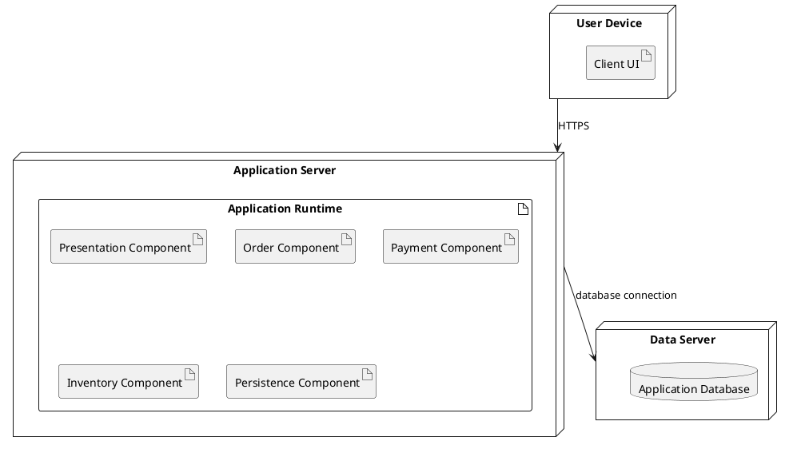

### Distributed Subsystem Diagram

Use this only when separate deployability, scale, reliability, ownership, or topology justifies distribution.

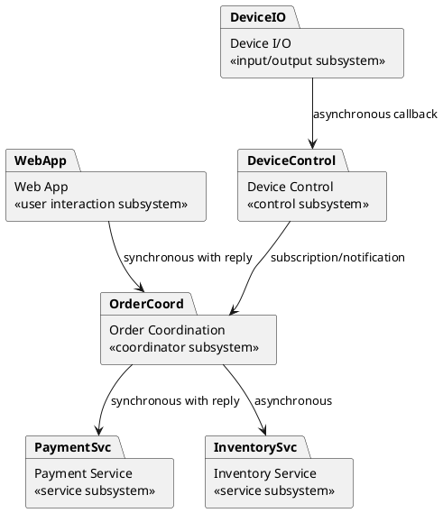

### Distributed Component Diagram

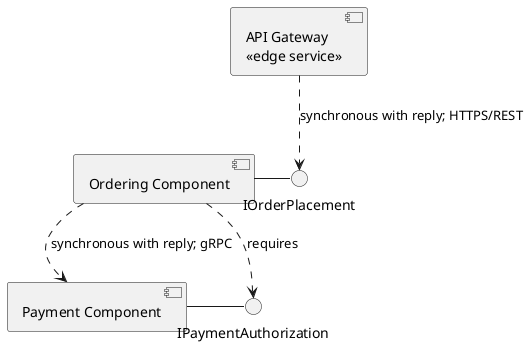

### Distributed Deployment Diagram

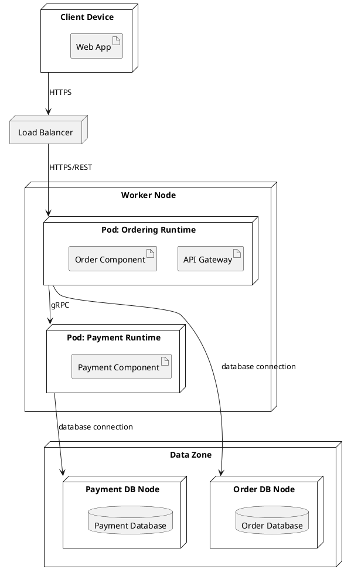

### Wrapper Class Diagram

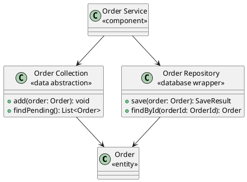
