# **Requirement & Design Specification**

## **Anti-Fraud Attendance System (AFAS)**

**Subject: SWD392**

**Version: 1.0**

- Hanoi, May 2026 -

---

## **Record of Changes**

| **Version** | **Date** | **A/M/D*** | **In charge** | **Change Description** |
| :--- | :--- | :--- | :--- | :--- |
| V1.0 | 26/05/2026 | A | SWD392 Team | Initial release of Requirement Specification (Section I) for AFAS including Problem Description, Features, Context, NFRs, Use Cases, Activity Diagrams, and Data Dictionary. |
| V1.1 | 27/05/2026 | A | SWD392 Team | Added Analysis Models (Section II): Interaction Diagrams (Sequence & Communication) for UC01, UC03, UC05, UC06, UC07, UC08, UC11; State Diagrams for AttendanceVersion, AttendanceRecord, DeviceBinding; Static Analysis (Contextual Boundary Class Diagram, Object Structuring Criteria, UI Wireframes). |
| V1.2 | 27/05/2026 | A | SWD392 Team | Added Design Specification (Section III): Integrated Communication Diagram, 3-View Architecture, Component/Package Diagrams, Detailed Class Design, Database Schema. Added Implementation Mapping (Section IV) and Verification/Testing (Section V). |
| V1.3 | 09/06/2026 | M | SWD392 Team | Added cross-phase traceability framework: source-to-feature matrix, business process model, anti-fraud rule catalog, missing dynamic analysis diagrams for UC02/UC04/UC09/UC10, analysis-to-design transformation matrices, NFR realization matrix, DB rule mappings, implementation traceability, and verification coverage matrix. |

*\*A - Added, M - Modified, D - Deleted*

---

## **Contents**

*   [0. Traceability Framework](#0-traceability-framework)
    *   [0.1 Source Baseline](#01-source-baseline)
    *   [0.2 Artifact ID Scheme](#02-artifact-id-scheme)
    *   [0.3 Master End-to-End Traceability Matrix](#03-master-end-to-end-traceability-matrix)
*   [I. Requirement Specification](#i-requirement-specification)
    *   [I.1 Problem description](#i1-problem-description)
    *   [I.2 Major Features](#i2-major-features)
        *   [I.2.1 Source-to-Feature Derivation Matrix](#i21-source-to-feature-derivation-matrix)
    *   [I.3 System context](#i3-system-context)
    *   [I.4 Non-functional Requirements](#i4-non-functional-requirements)
    *   [I.5 Business Process Model](#i5-business-process-model)
    *   [I.6 Functional requirements](#i6-functional-requirements)
        *   [I.6.1 Use case diagrams](#i61-use-case-diagrams)
        *   [I.6.2 Use case descriptions](#i62-use-case-descriptions)
        *   [I.6.3 Activity diagrams](#i63-activity-diagrams)
    *   [I.7 Anti-Fraud Rule Catalog](#i7-anti-fraud-rule-catalog)
    *   [I.8 Data Requirements](#i8-data-requirements)
*   [II. Analysis Models](#ii-analysis-models)
    *   [II.0 Static Analysis](#ii0-static-analysis)
        *   [II.0.1 Contextual Boundary Class Diagram](#ii01-contextual-boundary-class-diagram)
        *   [II.0.2 Object Structuring Criteria](#ii02-object-structuring-criteria)
        *   [II.0.3 UI Wireframes](#ii03-ui-wireframes)
    *   [II.1 Interaction diagrams](#ii1-interaction-diagrams)
    *   [II.2 State diagrams](#ii2-state-diagram)
*   [III. Design Specification](#iii-design-specification)
    *   [III.0 Analysis-to-Design Transformation Matrix](#iii0-analysis-to-design-transformation-matrix)
        *   [III.0.1 Use Case to Design Realization Matrix](#iii01-use-case-to-design-realization-matrix)
        *   [III.0.2 NFR Realization and Verification Matrix](#iii02-nfr-realization-and-verification-matrix)
    *   [III.1 Integrated Communication Diagrams](#iii1-integrated-communication-diagrams)
    *   [III.2 System High-Level Design](#iii2-system-high-level-design)
    *   [III.3 Component and Package Diagram](#iii3-component-and-package-diagram)
    *   [III.4 Detail Design](#iii4-detail-design)
    *   [III.5 Database Design](#iii5-database-design)
        *   [III.5.0 Entity-to-Database Transformation Matrix](#iii50-entity-to-database-transformation-matrix)
        *   [III.5.1 Rule-to-Constraint and Index Mapping](#iii51-rule-to-constraint-and-index-mapping)
*   [IV. Implementation](#iv-implementation)
    *   [IV.0 Implementation Traceability Matrix](#iv0-implementation-traceability-matrix)
    *   [IV.1 Map architecture to the structure of the project](#iv1-map-architecture-to-the-structure-of-the-project)
    *   [IV.2 Map Class Diagram and Interaction Diagram to Code](#iv2-map-class-diagram-and-interaction-diagram-to-code)
*   [V. Verification and Testing](#v-verification-and-testing)
    *   [V.0 Verification Coverage Matrix](#v0-verification-coverage-matrix)
    *   [V.1 Integration Testing & Test Specs](#v1-integration-testing--test-specs)
    *   [V.2 Unit Test Specifications](#v2-unit-test-specifications)

---

## **0. Traceability Framework**

This section establishes the framework for tracing requirements and concerns across all modeling, analysis, design, implementation, and verification phases of the AFAS project.

### **0.1 Source Baseline**

The system specifications are derived directly from the SWD392 software design assignment brief for the Anti-Fraud Attendance System. The engineering trace baseline ensures that the project progresses logically through:
1.  **Requirement Modeling:** Deriving system context, business processes, major features, use cases, and non-functional metrics.
2.  **Analysis Modeling:** Structuring boundary, control, and entity objects, mapping dynamic interactions (sequence/communication), and defining state transitions.
3.  **Design Modeling:** Transforming PIMs (Platform Independent Models) into Clean Architecture designs, database physical schemas, and module packages.
4.  **Implementation & Verification:** Mapping components directly to folder hierarchies, concrete code blocks, and integration/unit test scenarios.

### **0.2 Artifact ID Scheme**

To maintain consistency and rigorous linkage, the following prefix scheme is applied across all sections of this document:

| **Prefix** | **Meaning** | **Example** |
| :--- | :--- | :--- |
| `SRC-*` | Source requirement clause from project brief | `SRC-FR-02` |
| `F*` | Major feature in product scope | `F03` |
| `UC*` | Use case identifier | `UC03` |
| `BP-*` | Core business process | `BP-02` |
| `AR-*` | Business anti-fraud validation rule | `AR-02` |
| `NFR-*` | Non-functional performance requirement | `NFR-01` |
| `AN-*` | Analysis phase artifact (diagrams, wireframes) | `AN-SD-03` |
| `DS-*` | Design phase structural/detailed class artifact | `DS-CMP-02` |
| `DB-*` | Database physical table schema artifact | `DB-T10` |
| `IM-*` | Implementation code file/module mapping | `IM-SVC-01` |
| `TC-*` | Verification test case (Integration/Unit/NFR) | `TC-IT-003` |

### **0.3 Master End-to-End Traceability Matrix**

The master matrix traces every single source requirement from the brief to its corresponding use cases, analysis objects, design components, database tables, code files, and testing specifications.

| **Source ID** | **Requirement / Concern** | **Req. Artifacts** | **Analysis Artifacts** | **Design Artifacts** | **DB Table(s)** | **Implementation** | **Verification Case** | **Status** |
| :--- | :--- | :--- | :--- | :--- | :--- | :--- | :--- | :--- |
| **SRC-FR-01** | Account Login | `F01`, `UC01` | `AN-SD-01`, `AN-CD-01`, `LoginForm`, `GoogleAuthGateway` | `AccountController`, `AuthenticationService` | `accounts`, `students`, `lecturers` | `IM-AUTH-01` | `TC-AUTH-001` | Covered |
| **SRC-FR-02** | Scan Dynamic QR | `F03`, `UC03` | `AN-AD-03`, `AN-SD-03`, `AN-CD-03`, `StudentAppForm` | `AttendanceController`, `AttendanceService` | `attendance_records`, `attendance_versions` | `IM-SVC-01` | `TC-IT-001`, `TC-IT-002` | Covered |
| **SRC-FR-03** | GPS & Device ID Telemetry | `F02`, `F03`, `UC02`, `UC03` | `AN-SD-02`, `AN-CD-02`, `AN-SD-03`, `MobileDeviceHardware` | `DeviceBindingController`, `AttendanceService` | `students`, `attendance_records` | `IM-DEV-01`, `IM-SVC-01` | `TC-IT-004`, `TC-IT-006` | Covered |
| **SRC-FR-04** | View Attendance History | `F05`, `UC04` | `AN-SD-04`, `AN-CD-04`, `StudentAppForm` | `AttendanceController`, `AttendanceService` | `attendance_records`, `class_section_students` | `IM-HIS-01` | `TC-HIS-001` | Covered |
| **SRC-FR-05** | Lecturer Class Section | `F06`, `UC06`, `UC07` | `AN-SD-06`, `AN-SD-07`, `LecturerWebPortal` | `SessionController`, `SessionService` | `class_sections`, `class_section_students` | `IM-SES-01` | `TC-IT-001` | Covered |
| **SRC-FR-06** | QR/PIN Active & Refresh Loop | `F07`, `UC06` | `AN-AD-06`, `AN-SD-06`, `QRRefreshTimer`, `PINRefreshTimer` | `SessionService`, `RedisCacheManager` | `attendance_versions`, `sessions` | `IM-CACHE-01`, `IM-SES-01` | `TC-IT-002` | Covered |
| **SRC-FR-07** | Real-time Monitor Grid | `F08`, `UC07` | `AN-SD-07`, `AN-CD-07`, `LecturerWebPortal` | `AttendanceHub`, `SignalRRealtimeNotifier` | `attendance_records` | `IM-RT-01` | `TC-IT-001` | Covered |
| **SRC-FR-08** | Manual Adjust & Report | `F09`, `F10`, `UC08`, `UC09` | `AN-SD-08`, `AN-CD-08`, `AN-SD-09`, `AN-CD-09` | `AttendanceController`, `ReportController`, `ExcelReportGenerator` | `attendance_records`, `system_logs` | `IM-REP-01` | `TC-REP-001`, `TC-MAN-001` | Covered |
| **SRC-FR-09** | System Catalog CRUD | `F11`, `UC10` | `AN-SD-10`, `AN-CD-10`, `AdminWebPortal` | `CatalogController`, `CatalogService` | `accounts`, `students`, `lecturers`, `subjects`, `class_sections` | `IM-CAT-01` | `TC-CAT-001` | Covered |
| **SRC-FR-10** | Room Coordinates Configuration | `F12`, `UC11` | `AN-SD-11`, `AN-CD-11`, `AdminWebPortal` | `RoomController`, `RoomService` | `rooms`, `system_logs` | `IM-ROOM-01` | `TC-ROOM-001` | Covered |
| **SRC-FR-11** | Internet Outage Fallbacks | `F04`, `F09` | `UC05`, `UC08` | `AN-SD-05`, `AN-CD-05` | `AttendanceController.SubmitPINAttendance`, `AttendanceService.ProcessPinCheckin` | `attendance_records` | `TC-IT-005` | Covered |
| **SRC-AF-01** | Prevent Remote QR Photo Sharing | `F03`, `F07` | `UC03`, `UC06` | `AN-AD-03`, `AN-AD-06`, `QRRefreshTimer` | `QRRefreshTimer`, `RedisCacheManager`, `AttendanceService.ProcessCheckin` | `attendance_versions` | `IM-CACHE-01` | `TC-IT-002` | Covered |
| **SRC-AF-02** | Prevent Off-campus Geofence Fraud | `F03`, `F12` | `UC03`, `UC11` | `AN-AD-03`, `AN-SD-03`, `AN-SD-05`, `AN-SD-11` | `RoomService`, `AttendanceService.CalculateDistance` | `rooms`, `attendance_records` | `IM-SVC-01`, `IM-ROOM-01` | `TC-IT-003`, `TC-NFR-002` | Covered |
| **SRC-AF-03** | Device Handoff Protection | `AR-03`, `AR-04`, `UC02`, `UC03`, `UC05` | `AN-SD-02`, `AN-SD-03`, `AN-SD-05`, `DeviceBindingState` | `DeviceBindingController`, `AttendanceService.ProcessCheckin` | `students`, `attendance_records` | `IM-DEV-01`, `IM-SVC-01` | `TC-IT-004`, `TC-IT-006`, `TC-BIO-001` | Covered |
| **SRC-NFR-01** | Concurrency Capability | `NF-01` | Object structuring, `RedisCacheManager` | `RedisCacheManager` on API nodes | indexes on `attendance_records` & `students` | `IM-CACHE-01` | `TC-NFR-001` | Covered |
| **SRC-NFR-02** | GPS Coordinate Deviation | `NF-02` | GPS calculations in UC03/UC05/UC11 | `rooms.allowed_radius` custom configuration | `rooms`, `attendance_records` | `IM-SVC-01` | `TC-NFR-002` | Covered |
| **SRC-NFR-03** | UI Usability & Fast Response | `NF-03` | Minimal app wireframes, Face ID sensor | Local Face ID reader, immediate selfie purge | none direct | `IM-MOB-01`, `IM-SVC-01` | `TC-NFR-003` | Covered |
| **SRC-NFR-04** | Solution Maintainability | `NF-04` | BCE Object structuring | Clean Architecture 4 layers, DI, repositories | repositories schema | `IM-ARCH-01` | `TC-UNIT-001`-`003` | Covered |

---

## **I. Requirement Specification**

## **I.1 Problem description**

**Purpose:** Automate the classroom attendance process and implement robust defense layers to prevent common attendance fraud, such as proxy check-ins (friends checking in for absent students) and sharing classroom QR codes with absent students off-campus. The system simulates a university environment of approximately 8,000 students.

The core requirements are described as follows:

1.  **Authentication:** Students must log into the system using their personal student accounts (MSSV and assigned password) or via Google OAuth using their official school email (`@fpt.edu.vn`). All university staff and lecturers must also log in before performing any action.
2.  **Device Binding:** To prevent students from checking in for their friends using multiple devices or accounts, each student account is bound to a single physical device. Upon first login, the student's device identifier (a UUID collected by the mobile app) is registered. If the student changes their device (e.g., purchasing a new phone), they can request a device reset through a secure self-service OTP verification sent to their school email.
3.  **Dynamic QR Code Attendance:** To prevent students from taking photos of the QR code and sharing it with absent peers, the lecturer initiates an attendance session which displays a large dynamic QR code on the projector screen. This QR code dynamically refreshes its encoded token every 10 seconds. The server only validates check-ins matching the currently active token within a strict 15-second grace window.
4.  **Geofencing (Location Verification):** To prevent off-campus check-ins, the mobile client automatically attaches the student's device GPS coordinates during the QR scan. The server calculates the straight-line distance to the classroom's coordinates using the Haversine formula. If the student is outside the configured radius for the classroom (e.g., > 20 meters), the check-in is rejected and flagged as fraud.
5.  **Campus Wi-Fi Network Matching:** As a supporting verification signal, the client attaches network telemetry (Public IP Gateway and Wi-Fi SSID). The server cross-references the public IP against the university's known IP range. A mismatch is flagged as a warning but does not alone reject a check-in; it is used alongside other verification layers.
6.  **Biometric Verification (Face ID):** To prevent students from handing their registered phones to classmates to check in for them, the application requires local biometric verification (Face ID / Fingerprint) as the primary check. If local biometric is unavailable or fails, the app falls back to capturing a temporary face selfie, which is transmitted to the server as a temporary proof, validated, and deleted immediately after verification to preserve privacy.
7.  **Real-time Monitoring:** As students scan and successfully check in, the lecturer's Web Portal interface dynamically highlights the student's name in green in real-time via WebSockets (SignalR), enabling immediate visual auditing.
8.  **Doubtful/Manual Adjustments:** Lecturers can override attendance records manually on the web portal to mark a student present, late, or absent if they have a legitimate excuse or if there is a network outage.
9.  **Reporting:** Lecturers can export the finalized attendance sheets to Excel formats at the end of a session.
10. **System Configurations:** Administrators manage system catalogs (users, subjects, class sections) and configure the exact GPS coordinates and allowed radius for each physical classroom on campus.
11. **Internet Fallback:** In the case of an internet outage at the lecture hall, the lecturer can suspend the dynamic session and reopen a short check-in session at the end of the class, or manually check in students.

---

## **I.2 Major Features**

The system comprises three main portals: Student Mobile App, Lecturer Web Portal, and Admin Web Portal.

### **Features for Students (Mobile & Web):**
*   **F01: Personal Authentication:** Login using MSSV/Password or Google OAuth, manage profile.
*   **F02: Device Binding:** Link device UUID upon first login, request self-service reset via email OTP.
*   **F03: Scan QR Code:** Open camera, verify local Face ID (with selfie fallback if biometric unavailable), scan dynamic QR, collect GPS and Wi-Fi network gateway telemetry.
*   **F04: PIN Fallback:** Enter the 6-digit PIN code displayed on the lecturer screen if the camera is broken. GPS geofencing and device UUID checks still apply.
*   **F05: View Attendance History:** Track attended, late, and absent sessions with visual statistics.

### **Features for Lecturers (Web Portal):**
*   **F06: Class Section Management:** View assigned classes, schedule, and student rosters.
*   **F07: Start Dynamic Attendance:** Generate dynamic QR (10s refresh) and PIN (30s refresh) displayed on the projector screen.
*   **F08: Real-time Attendance Monitor:** Track live check-in progress with color-coded student names via WebSocket.
*   **F09: Manual Adjustments:** Manually change student attendance status (Present, Late, Absent, Fraud_Declined).
*   **F10: Export Attendance Report:** Export attendance history sheets to Excel.

### **Features for Administrators (Web Portal):**
*   **F11: System Catalog Management:** Manage accounts (Students, Lecturers), Subjects, and Class Sections.
*   **F12: Classroom GPS Configuration:** Setup room location (Latitude, Longitude) and custom Allowed Radius.

### **I.2.1 Source-to-Feature Derivation Matrix**

The requirements from the assignment brief map directly to the system features (`F01`-`F12`) and their associated use cases as shown in the matrix below:

| **Source ID** | **Brief Requirement Description** | **Derived Feature(s)** | **Derived Use Case(s)** | **Architectural Derivation Reasoning** |
| :--- | :--- | :--- | :--- | :--- |
| **SRC-FR-01** | Personal Account & OAuth Login | `F01` | `UC01` | Role-based authentication is the entry gate for Students, Lecturers, and Admins to secure data. |
| **SRC-FR-02** | Scan Lecturer's Projector QR Code | `F03` | `UC03` | Provides the primary automatic mechanism for students to record attendance. |
| **SRC-FR-03** | GPS & Device ID Telemetry | `F02`, `F03` | `UC02`, `UC03` | Verifying identity/location requires mobile device binding and hardware sensor checks. |
| **SRC-FR-04** | Track History & Absence Stats | `F05` | `UC04` | Students check calendar and statistics for warning metrics. |
| **SRC-FR-05** | Lecturer Class Section View | `F06` | `UC06`, `UC07` | Lecturers view schedule and select sections before initializing check-in. |
| **SRC-FR-06** | Dynamic QR (10s) & PIN (30s) | `F07` | `UC06` | Lecturer screen triggers background refreshes for dynamic check-in keys. |
| **SRC-FR-07** | Real-time Attendance monitor grid | `F08` | `UC07` | Uses WebSocket communication for pushing live name updates. |
| **SRC-FR-08** | Manual Adjust & Excel Export | `F09`, `F10` | `UC08`, `UC09` | Lecturers audit rosters, modify records, and download academic sheets. |
| **SRC-FR-09** | CRUD Accounts, Subjects, Class Sections | `F11` | `UC10` | Admins perform catalog CRUD and database seed imports. |
| **SRC-FR-10** | Configure Classroom GPS Coordinates | `F12` | `UC11` | Classroom location configurations define physical geofence boundaries. |
| **SRC-FR-11** | Internet Outage Fallbacks | `F04`, `F09` | `UC05`, `UC08` | Provides PIN fallback and manual lecturer entry options during hardware/network drops. |
| **SRC-AF-01** | Prevent Remote QR Photo Sharing | `F03`, `F07` | `UC03`, `UC06` | Enforces the 10-second refresh and 15-second grace window to block off-site scans. |
| **SRC-AF-02** | Prevent Off-campus Geofence Fraud | `F03`, `F12` | `UC03`, `UC11` | Disallows check-ins where distance calculation exceeds room allowed radius. |
| **SRC-AF-03** | Prevent Device Handoff Fraud | `F02`, `F03` | `UC02`, `UC03` | Restricts accounts to 1 physical device binding plus local biometric validations. |

---

## **I.3 System context**

The system context diagram models the boundaries between the Anti-Fraud Attendance System (AFAS) and the external actors or systems it communicates with.

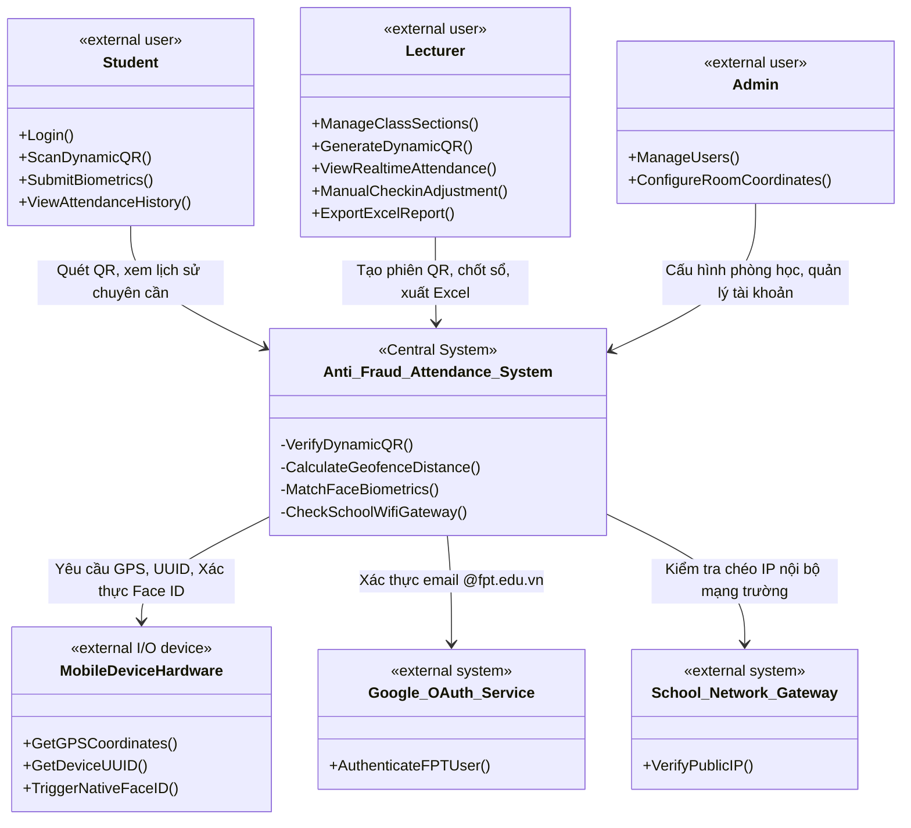
```mermaid
classDiagram
    class Anti_Fraud_Attendance_System {
        <<Central System>>
        -VerifyDynamicQR()
        -CalculateGeofenceDistance()
        -MatchFaceBiometrics()
        -CheckSchoolWifiGateway()
    }

    class Student {
        <<external user>>
        +Login()
        +ScanDynamicQR()
        +SubmitBiometrics()
        +ViewAttendanceHistory()
    }

    class Lecturer {
        <<external user>>
        +ManageClassSections()
        +GenerateDynamicQR()
        +ViewRealtimeAttendance()
        +ManualCheckinAdjustment()
        +ExportExcelReport()
    }

    class Admin {
        <<external user>>
        +ManageUsers()
        +ConfigureRoomCoordinates()
    }

    class MobileDeviceHardware {
        <<external I/O device>>
        +GetGPSCoordinates()
        +GetDeviceUUID()
        +TriggerNativeFaceID()
    }

    class Google_OAuth_Service {
        <<external system>>
        +AuthenticateFPTUser()
    }

    class School_Network_Gateway {
        <<external system>>
        +VerifyPublicIP()
    }

    Student --> Anti_Fraud_Attendance_System : Quét QR, xem lịch sử chuyên cần
    Lecturer --> Anti_Fraud_Attendance_System : Tạo phiên QR, chốt sổ, xuất Excel
    Admin --> Anti_Fraud_Attendance_System : Cấu hình phòng học, quản lý tài khoản

    Anti_Fraud_Attendance_System --> MobileDeviceHardware : Yêu cầu GPS, UUID, Xác thực Face ID
    Anti_Fraud_Attendance_System --> Google_OAuth_Service : Xác thực email @fpt.edu.vn
    Anti_Fraud_Attendance_System --> School_Network_Gateway : Kiểm tra chéo IP nội bộ mạng trường
```

---

## **I.4 Non-functional Requirements**

| **ID** | **NFR Category** | **Technical Specification (Metric)** | **Practical Implementation Solution** |
| :--- | :--- | :--- | :--- |
| **NF-01** | **Concurrency / Performance** | Handle **500 - 1,000 concurrent requests** within 5 minutes at the start of a class. | Use **Redis Cache** in the infrastructure layer to store and validate dynamic QR tokens in RAM instead of hitting the primary PostgreSQL database for every scan. |
| **NF-02** | **Location Accuracy** | GPS positioning tolerance threshold of **15 - 20 meters**. | Implement dynamic geofence radius config on the server. Apply the **Haversine formula** to calculate distance and add buffer tolerance for indoor hardware GPS deviations. |
| **NF-03** | **Usability** | Scan response time and authentication result returned in **< 2 seconds**. | Implement **Local Biometric Face ID** authentication on the mobile client (using native APIs) and delete temporary face selfie immediately on the server after matching. |
| **NF-04** | **Maintainability** | Ensure highly decoupled layers and easy database migration. | Build the application using **Clean Architecture** (Domain, Application, Infrastructure, Presentation) with strict one-way dependency rules and repository pattern. |

## **I.5 Business Process Model**

The following business processes define the end-to-end operational workflows of the AFAS system, aligning requirements to use cases and design components:

### **BP-01: Attendance Session Preparation**
*   **Goal:** Lecturer prepares a classroom for check-in.
*   **Actors:** Lecturer, Projector Screen.
*   **Workflow:**
    1.  Lecturer logs in and selects an assigned class section.
    2.  Lecturer clicks "Start Attendance" on the Web Portal.
    3.  System checks scheduled hour window.
    4.  System initializes `AttendanceVersion` with `IsActive = True`.
    5.  System starts `QRRefreshTimer` (10s) and `PINRefreshTimer` (30s) background loop in Redis.
    6.  Projector screen establishes WebSockets channel and displays refreshing QR/PIN.

### **BP-02: Student Check-in and Anti-Fraud Verification**
*   **Goal:** Student registers presence and system verifies evidence.
*   **Actors:** Student, Mobile App, Anti-Fraud Server Engine.
*   **Workflow:**
    1.  Student opens app and passes local Face ID check.
    2.  Student scans dynamic QR (or inputs PIN code).
    3.  Mobile app automatically extracts Device UUID, GPS coordinates, Wi-Fi SSID, and Public IP.
    4.  App submits payload to Server.
    5.  Server performs **Layer 1** verification (QR token matches active Redis token and age < 15s).
    6.  Server performs **Layer 2** verification (Calculates Haversine distance from GPS to room center <= AllowedRadius).
    7.  Server performs **Layer 3** verification (Compares submitted UUID to registered UUID).
    8.  If any check fails, system saves status as `Fraud_Declined` (for distance) or rejects submission.
    9.  If all checks pass, system saves record as `Present` (or `Late`), purges temporary fallback selfie, and broadcasts update to Lecturer web monitor via SignalR.

### **BP-03: Roster Audit and Attendance Adjustment**
*   **Goal:** Lecturer reviews attendance records, modifies statuses manually, and finalizes.
*   **Actors:** Lecturer, Web Portal.
*   **Workflow:**
    1.  Lecturer monitors live checking grid updates in real-time.
    2.  Lecturer audits absent/doubtful students physically.
    3.  Lecturer clicks student tile and changes status to Present/Late/Absent/Fraud_Declined (requires entering a mandatory reason).
    4.  System saves adjustments, updates verification mode to `Manual`, and logs action in `system_logs`.
    5.  Lecturer finalizes roster and exports Excel sheet `.xlsx`.

### **BP-04: System Configuration and Catalog Maintenance**
*   **Goal:** Admin seeds database catalog records and sets up room coordinates.
*   **Actors:** System Admin.
*   **Workflow:**
    1.  Admin logs in and accesses Admin Web Portal dashboard.
    2.  Admin manages database catalog tables (accounts, students, lecturers, subjects, class sections) via forms or CSV batch uploads.
    3.  Admin configures GPS Latitude/Longitude and allowed geofence boundary radius for classroom halls.
    4.  System updates postgres tables and writes system log logs.

---

## **I.6 Functional requirements**

### **I.6.1 Use case diagrams**

The functional requirements are mapped to three main use case diagrams representing the Student, Lecturer, and Admin subsystems.

#### **Overview Use Case Diagram**
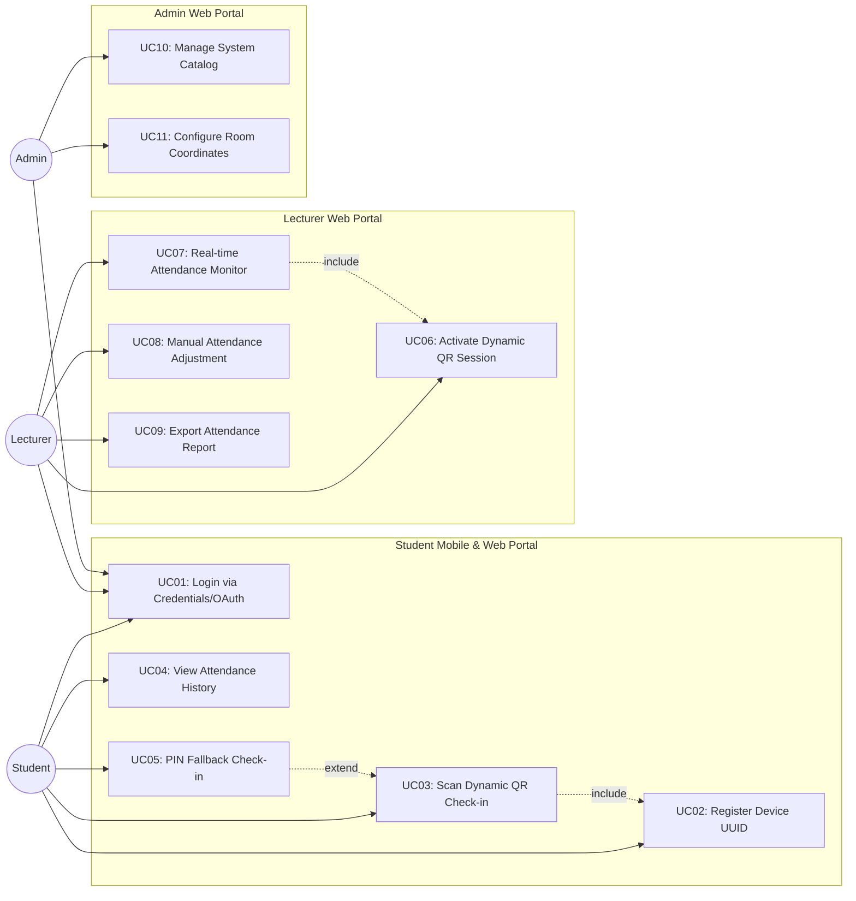
```mermaid
flowchart LR
    Student((Student))
    Lecturer((Lecturer))
    Admin((Admin))

    subgraph Student_Subsystem [Student Mobile & Web Portal]
        UC01[UC01: Login via Credentials/OAuth]
        UC02[UC02: Register Device UUID]
        UC03[UC03: Scan Dynamic QR Check-in]
        UC04[UC04: View Attendance History]
        UC05[UC05: PIN Fallback Check-in]
    end

    subgraph Lecturer_Subsystem [Lecturer Web Portal]
        UC06[UC06: Activate Dynamic QR Session]
        UC07[UC07: Real-time Attendance Monitor]
        UC08[UC08: Manual Attendance Adjustment]
        UC09[UC09: Export Attendance Report]
    end

    subgraph Admin_Subsystem [Admin Web Portal]
        UC10[UC10: Manage System Catalog]
        UC11[UC11: Configure Room Coordinates]
    end

    Student --> UC01
    Student --> UC02
    Student --> UC03
    Student --> UC04
    Student --> UC05

    Lecturer --> UC01
    Lecturer --> UC06
    Lecturer --> UC07
    Lecturer --> UC08
    Lecturer --> UC09

    Admin --> UC01
    Admin --> UC10
    Admin --> UC11

    UC03 -.-> |include| UC02
    UC05 -.-> |extend| UC03
    UC07 -.-> |include| UC06
```

---

### **I.6.2 Use case descriptions**

Below are the detailed descriptions for all **11 Use Cases** of the AFAS system:

#### **Table I-1: Use case description for UC01 - Login**
| **Field** | **Description** |
| :--- | :--- |
| **ID and Name:** | **UC01: Login via Credentials or Google OAuth** |
| **Created By:** | SWD392 Team |
| **Primary Actor:** | Student, Lecturer, Admin |
| **Description:** | Allows any system user to securely authenticate and access their respective portal using either MSSV/Password or Google OAuth (FPT Mail). |
| **Trigger:** | The user opens the mobile application or visits the web portal. |
| **Preconditions:** | The user account must exist in the database. |
| **Postconditions:** | **POST-1 Success:** User is authenticated, a secure token (JWT) is issued, and the user is redirected to their dashboard. <br>**POST-2 Failure:** Authentication fails, access is denied, and no session is created. |
| **Normal Flow:** | 1. User selects login method: "Credentials" or "Google OAuth".<br>2. **If Credentials:** User inputs MSSV/Username and Password, then submits. (See A2.1)<br>3. **If Google OAuth:** User clicks Google Login, authenticates through Google Gateway, and returns FPT email.<br>4. Server validates credentials against `Accounts` database or verifies the Google OAuth token.<br>5. Server generates a secure JWT token containing the user's role.<br>6. Server redirects user to their corresponding homepage. |
| **Alternative Flows:** | **A2.1 User forgets password:** User selects "Forgot Password", inputs registered email, receives reset link, and updates password. |
| **Exceptions:** | **E4.1 Invalid credentials:** Server returns an error message: "Invalid username or password".<br>**E4.2 Non-school email:** If Google OAuth returns a non-FPT email (not ending in `@fpt.edu.vn`), server denies login. |
| **Priority:** | High |
| **Business Rules:** | **BR-01:** Passwords must be hashed using `bcrypt` on the server.<br>**BR-02:** Email domain must end with `@fpt.edu.vn` or `@fe.edu.vn` for Google OAuth. |
| **Trace:** | Source: `SRC-FR-01`; Feature: `F01`; Business Process: `BP-01`, `BP-02`, `BP-03`, `BP-04`; Anti-Fraud Rule: None; Analysis: `AN-SD-01`, `AN-CD-01`, `LoginForm`, `GoogleAuthGateway`; Design: `AccountController`, `AuthenticationService`; Verification: `TC-AUTH-001`. |

---

#### **Table I-2: Use case description for UC02 - Register Device UUID**
| **Field** | **Description** |
| :--- | :--- |
| **ID and Name:** | **UC02: Register Device UUID** |
| **Created By:** | SWD392 Team |
| **Primary Actor:** | Student |
| **Description:** | Binds a student's account to a single unique physical mobile device upon first login to prevent multiple students from using one phone to check in for others. |
| **Trigger:** | The student logs into the mobile application for the first time or on a new device. |
| **Preconditions:** | Student is authenticated (UC01) and does not have an active device binding or has requested a device reset. |
| **Postconditions:** | **POST-1 Success:** Student's `DeviceUUID` is recorded in the `Students` table, linking the account to the phone.<br>**POST-2 Failure:** Device is not linked, and student cannot proceed to scan QR. |
| **Normal Flow:** | 1. Student logs into the AFAS App on a mobile device.<br>2. App checks if the student's record in `students.device_uuid` is null.<br>3. Since it is null, the App automatically extracts the hardware `DeviceUUID` of the phone.<br>4. App displays a message informing the student that this phone will be registered as their primary check-in device.<br>5. Student confirms the binding.<br>6. Server saves the `DeviceUUID` to the student's profile. |
| **Alternative Flows:** | **A3.1 Student requests device reset (Self-Service):**<br>1. Student logs in on a new device and is notified that a device is already bound.<br>2. Student clicks "Request Device Reset".<br>3. System sends an OTP code to the student's registered FPT email.<br>4. Student enters the correct OTP on the screen.<br>5. System clears the old `device_uuid`, extracts the new device's UUID, and saves it. |
| **Exceptions:** | **E4.1 Invalid OTP:** If the student enters an incorrect OTP 3 times during reset, the reset process is locked for 24 hours. |
| **Priority:** | High |
| **Business Rules:** | **BR-01:** One student account can only be linked to one `DeviceUUID` at a time. |
| **Trace:** | Source: `SRC-FR-03`, `SRC-AF-03`; Feature: `F02`; Business Process: `BP-02`; Anti-Fraud Rule: `AR-03`; Analysis: `AN-SD-02`, `AN-CD-02`, `MobileDeviceHardware`, `DeviceBindingState`; Design: `DeviceBindingController`, `DeviceBindingService`; Verification: `TC-IT-006`. |

---

#### **Table I-3: Use case description for UC03 - Scan Dynamic QR Check-in**
| **Field** | **Description** |
| :--- | :--- |
| **ID and Name:** | **UC03: Scan Dynamic QR Check-in** |
| **Created By:** | SWD392 Team |
| **Primary Actor:** | Student |
| **Description:** | Student scans the active dynamic QR code on the projector screen, providing device GPS, Device UUID, Wi-Fi IP, and Face ID biometrics to log attendance. |
| **Trigger:** | The student selects "Scan QR" from the dashboard. |
| **Preconditions:** | - Student is logged in (UC01) and device is bound (UC02).<br>- Dynamic QR session is active (UC06). |
| **Postconditions:** | **POST-1 Success:** An `AttendanceRecord` is created with status `Present` or `Late`, and the lecturer screen is updated in real-time.<br>**POST-2 Failure:** Check-in is rejected. If geofence is violated, record is saved as `Fraud_Declined`. For other failures (expired token, UUID mismatch, GPS unavailable), the submission is rejected with no attendance record created. |
| **Normal Flow:** | 1. Student taps "Scan QR Check-in".<br>2. App prompts for local Face ID authentication.<br>3. Student successfully unlocks using Face ID (Local Biometric Reader).<br>4. App displays the camera view.<br>5. Student scans the active QR code on the screen, extracting the `DynamicToken`.<br>6. App silently collects GPS coordinates, Device UUID, Wi-Fi SSID, and Public IP Gateway.<br>7. App packages the payload and sends an HTTPS POST request to `/api/attendance/submit`.<br>8. Server verifies Layer 1 (QR Token is active and under 15s old). (See E8.1)<br>9. Server verifies Layer 2 (calculates Haversine distance < classroom allowed radius). (See E9.1)<br>10. Server verifies Layer 3 (matches Device UUID). (See E10.1)<br>11. Server records Wi-Fi Public IP Gateway as a supporting signal. (See E11.1)<br>12. Server registers status `Present` or `Late` in `attendance_records` and deletes temporary selfie data if any.<br>13. Server pushes a real-time WebSocket update to the Lecturer portal. |
| **Alternative Flows:** | **A3.1 Face ID fails/not supported:** If local Face ID fails or is not supported by the hardware, the student is prompted to capture a quick selfie image as a fallback proof. The selfie is transmitted to the server, validated, and deleted immediately after verification. |
| **Exceptions:** | **E8.1 Token Expired:** If QR token is older than 15s, server rejects check-in and returns "QR expired". No attendance record is created.<br>**E9.1 Out of Geofence:** If distance > AllowedRadius, server saves record as `Fraud_Declined` and alerts the user.<br>**E10.1 UUID Mismatch:** If DeviceUUID does not match registered UUID, server rejects check-in and logs a warning to `SystemLogs`. No attendance record is created.<br>**E11.1 Non-campus Wi-Fi:** If Public IP does not match campus gateway, server flags a warning in the record but does not reject the check-in.<br>**E12.1 GPS Unavailable:** If the app cannot obtain GPS coordinates (permission denied or hardware unavailable), the submission is blocked and the student is prompted to enable location services.<br>**E13.1 Duplicate Check-in:** If an `AttendanceRecord` already exists for this student and session, the server returns the existing result without creating a duplicate record. |
| **Priority:** | High |
| **Business Rules:** | **BR-01:** Geofence formula must use the Haversine method on the server.<br>**BR-02:** Face selfies captured during check-in must be deleted immediately after verification.<br>**BR-03:** A student is marked `Present` if check-in occurs within 15 minutes of the session start time; `Late` if after that threshold but before session end.<br>**BR-04:** Only one `AttendanceRecord` per student per session is allowed. Duplicate submissions return the existing result. |
| **Trace:** | Source: `SRC-FR-02`, `SRC-FR-03`, `SRC-AF-01`, `SRC-AF-02`, `SRC-AF-03`; Feature: `F03`; Business Process: `BP-02`; Anti-Fraud Rule: `AR-01`, `AR-02`, `AR-03`, `AR-04`, `AR-05`, `AR-06`; Analysis: `AN-AD-03`, `AN-SD-03`, `AN-CD-03`, `StudentAppForm`; Design: `AttendanceController`, `AttendanceService`, `AntiFraud_Validator_Engine`; Verification: `TC-IT-001`, `TC-IT-002`, `TC-IT-003`, `TC-IT-004`, `TC-DUP-001`, `TC-BIO-001`, `TC-WIFI-001`. |

---

#### **Table I-4: Use case description for UC04 - View Attendance History**
| **Field** | **Description** |
| :--- | :--- |
| **ID and Name:** | **UC04: View Attendance History** |
| **Created By:** | SWD392 Team |
| **Primary Actor:** | Student |
| **Description:** | Allows students to view a summary of their attendance record for all enrolled class sections, including total present, late, and absent days. |
| **Trigger:** | The student selects the "History" tab from the navigation bar. |
| **Preconditions:** | Student is authenticated (UC01). |
| **Postconditions:** | Student views their visual attendance stats. |
| **Normal Flow:** | 1. Student taps "History" tab.<br>2. App sends a request to `/api/attendance/history` with student's credentials.<br>3. Server retrieves all records from `attendance_records` linked to the student.<br>4. App displays a list of enrolled class sections.<br>5. Student selects a class section.<br>6. App renders a detailed calendar view showing days present (Green), late (Orange), and absent (Red). |
| **Alternative Flows:** | None. |
| **Exceptions:** | **E3.1 Server offline:** App displays cached historical data from native local storage and shows a connection warning. |
| **Priority:** | Medium |
| **Business Rules:** | None. |
| **Trace:** | Source: `SRC-FR-08`; Feature: `F10`; Business Process: `BP-03`; Anti-Fraud Rule: None; Analysis: `AN-SD-09`, `AN-CD-09`, `LecturerWebPortal`; Design: `ReportController`, `ExcelReportGenerator`; Verification: `TC-REP-001`. |
| **Trace:** | Source: `SRC-FR-04`; Feature: `F05`; Business Process: `BP-03`; Anti-Fraud Rule: None; Analysis: `AN-SD-04`, `AN-CD-04`, `StudentAppForm`; Design: `AttendanceController.GetStudentHistory`, `AttendanceService.GetHistory`; Verification: `TC-HIS-001`. |

---

#### **Table I-5: Use case description for UC05 - PIN Fallback Check-in**
| **Field** | **Description** |
| :--- | :--- |
| **ID and Name:** | **UC05: PIN Fallback Check-in** |
| **Created By:** | SWD392 Team |
| **Primary Actor:** | Student |
| **Description:** | Allows students to manually type a 6-digit dynamic PIN code displayed on the screen to check in if their device camera is broken or unable to scan. |
| **Trigger:** | The student selects the "PIN Check-in" option on the App. |
| **Preconditions:** | - Student is logged in (UC01).<br>- Dynamic QR/PIN session is active (UC06). |
| **Postconditions:** | Student is marked present, and a manual PIN log is recorded in DB. |
| **Normal Flow:** | 1. Student selects "PIN Check-in" on the App.<br>2. App prompts for local Face ID authentication.<br>3. Student successfully unlocks via Face ID.<br>4. App displays an input screen with 6 digit slots.<br>5. Student types the active 6-digit PIN displayed on the corner of the projector screen.<br>6. App silently collects GPS, IP, and Device UUID.<br>7. Server verifies that the PIN code is active (refreshed every 30s) and runs GPS geofencing and UUID matching.<br>8. Server records attendance with status `Present` and verification mode `PIN`. |
| **Alternative Flows:** | None. |
| **Exceptions:** | **E7.1 PIN Expired:** If the student enters a PIN that was generated more than 30s ago, server rejects it. No attendance record is created.<br>**E7.2 GPS out of range:** Geofencing checks still apply; if student enters PIN from outside the classroom radius, check-in is saved as `Fraud_Declined`.<br>**E7.3 GPS Unavailable:** If the app cannot obtain GPS coordinates, the submission is blocked and the student is prompted to enable location services.<br>**E7.4 Duplicate Check-in:** If an `AttendanceRecord` already exists for this student and session, the server returns the existing result without creating a duplicate. |
| **Priority:** | High |
| **Business Rules:** | **BR-01:** The PIN code must automatically expire and refresh every 30 seconds. |
| **Trace:** | Source: `SRC-FR-11`, `SRC-AF-02`, `SRC-AF-03`; Feature: `F04`; Business Process: `BP-02`; Anti-Fraud Rule: `AR-02`, `AR-03`, `AR-04`, `AR-05`; Analysis: `AN-SD-05`, `AN-CD-05`, `StudentAppForm`; Design: `AttendanceController.SubmitPINAttendance`, `AttendanceService.ProcessPinCheckin`; Verification: `TC-IT-005`. |

---

#### **Table I-6: Use case description for UC06 - Activate Dynamic QR Session**
| **Field** | **Description** |
| :--- | :--- |
| **ID and Name:** | **UC06: Activate Dynamic QR Session** |
| **Created By:** | SWD392 Team |
| **Primary Actor:** | Lecturer |
| **Description:** | Lecturer starts the attendance session for a class, generating a dynamic QR and PIN displayed on the projector screen for students. |
| **Trigger:** | The lecturer selects a scheduled session and clicks "Start Attendance". |
| **Preconditions:** | Lecturer is logged in (UC01) and currently within the scheduled session time window. |
| **Postconditions:** | **POST-1 Success:** `AttendanceVersion` is activated, WebSocket channel is opened, and dynamic QR begins refreshing.<br>**POST-2 Failure:** Session is not started, and an error is displayed. |
| **Normal Flow:** | 1. Lecturer navigates to "My Scheduled Classes" on Web Portal.<br>2. System displays assigned classes and scheduled sessions.<br>3. Lecturer selects the current session and clicks "Start Attendance".<br>4. Server validates that the current time is within the session's scheduled window.<br>5. Server sets `AttendanceVersion.is_active = True`.<br>6. Server initiates a background loop generating a unique `DynamicToken` every 10s and a `PINCode` every 30s.<br>7. Web Portal establishes a WebSocket connection and displays the projector view with the dynamic QR, PIN, and real-time attendance table. |
| **Alternative Flows:** | **A8.1 Lecturer stops session early:** Lecturer clicks "Stop Attendance" before class ends. Server sets `is_active = False` and closes connection. |
| **Exceptions:** | **E4.1 Outside scheduled hours:** If lecturer tries to start session outside the class time slot, system denies activation. |
| **Priority:** | High |
| **Business Rules:** | **BR-01:** Only one `AttendanceVersion` per class session (`SessionId`) can be active (`IsActive = True`) at any given moment. |
| **Trace:** | Source: `SRC-FR-05`, `SRC-FR-06`, `SRC-AF-01`; Feature: `F07`; Business Process: `BP-01`; Anti-Fraud Rule: `AR-01`; Analysis: `AN-AD-06`, `AN-SD-06`, `AN-CD-06`, `AttendanceVersionState`; Design: `SessionController`, `SessionService`, `QRRefreshTimer`, `PINRefreshTimer`, `RedisCacheManager`; Verification: `TC-IT-002`. |

---

#### **Table I-7: Use case description for UC07 - Real-time Attendance Monitor**
| **Field** | **Description** |
| :--- | :--- |
| **ID and Name:** | **UC07: Real-time Attendance Monitor** |
| **Created By:** | SWD392 Team |
| **Primary Actor:** | Lecturer |
| **Description:** | Lecturer monitors the check-in progress on a live grid where student names turn green in real-time as they successfully scan the QR. |
| **Trigger:** | The lecturer initiates a dynamic QR session (UC06). |
| **Preconditions:** | Session must be active (`is_active = True`). |
| **Postconditions:** | Lecturer has real-time visualization of class attendance. |
| **Normal Flow:** | 1. Lecturer opens the dynamic presentation view on the projector screen.<br>2. System displays a grid representing all students enrolled in the class section.<br>3. As a student successfully submits their check-in (UC03), Server processes and validates it.<br>4. Server broadcasts a WebSocket event containing the student's ID and status.<br>5. The lecturer's web interface receives the event and instantly changes the student's tile to green (Present) or orange (Late) with a chime sound.<br>6. Attendance count updates dynamically. |
| **Alternative Flows:** | None. |
| **Exceptions:** | **E5.1 WebSocket Disconnect:** If connection drops, Web Portal displays a red warning icon and attempts to reconnect. |
| **Priority:** | High |
| **Business Rules:** | None. |
| **Trace:** | Source: `SRC-FR-09`; Feature: `F11`; Business Process: `BP-04`; Anti-Fraud Rule: None; Analysis: `AN-SD-10`, `AN-CD-10`, `AdminWebPortal`; Design: `CatalogController`, `CatalogService`; Verification: `TC-CAT-001`. |
| **Trace:** | Source: `SRC-FR-05`, `SRC-FR-07`; Feature: `F08`; Business Process: `BP-01`, `BP-03`; Anti-Fraud Rule: None; Analysis: `AN-SD-07`, `AN-CD-07`, `LecturerWebPortal`; Design: `AttendanceHub`, `SignalRRealtimeNotifier`; Verification: `TC-IT-001`. |

---

#### **Table I-8: Use case description for UC08 - Manual Attendance Adjustment**
| **Field** | **Description** |
| :--- | :--- |
| **ID and Name:** | **UC08: Manual Attendance Adjustment** |
| **Created By:** | SWD392 Team |
| **Primary Actor:** | Lecturer |
| **Description:** | Allows the lecturer to manually change a student's check-in status (e.g., overriding a fake GPS fraud flag if there is a hardware error, or marking an absent student manually). |
| **Trigger:** | Lecturer selects a student name from the list and clicks "Adjust Status". |
| **Preconditions:** | Lecturer is authenticated (UC01) and an `AttendanceRecord` or session roster exists for the target student and session. |
| **Postconditions:** | Student status is updated in the database and audit logged. |
| **Normal Flow:** | 1. Lecturer views the student roster for the active/past session.<br>2. Lecturer clicks on a specific student tile and selects "Adjust Status".<br>3. System displays a modal with status options: `Present`, `Late`, `Absent`, `Fraud_Declined`.<br>4. Lecturer selects the new status and enters a reason (e.g., "GPS device hardware error").<br>5. Lecturer clicks "Save".<br>6. Server updates `AttendanceRecord.status` and `verification_mode = 'Manual'`.<br>7. Server logs the lecturer's action in `SystemLogs`. |
| **Alternative Flows:** | None. |
| **Exceptions:** | **E5.1 Missing reason:** If the lecturer changes status without inputting a mandatory reason, the system prompts them to write a reason before saving. |
| **Priority:** | High |
| **Business Rules:** | **BR-01:** All manual overrides must record the modifier's ID and a mandatory explanation. |
| **Trace:** | Source: `SRC-FR-08`, `SRC-FR-11`; Feature: `F09`; Business Process: `BP-03`; Anti-Fraud Rule: `AR-07`; Analysis: `AN-SD-08`, `AN-CD-08`, `LecturerWebPortal`; Design: `AttendanceController.AdjustAttendanceStatus`, `SystemLog`; Verification: `TC-MAN-001`. |

---

#### **Table I-9: Use case description for UC09 - Export Attendance Report**
| **Field** | **Description** |
| :--- | :--- |
| **ID and Name:** | **UC09: Export Attendance Report** |
| **Created By:** | SWD392 Team |
| **Primary Actor:** | Lecturer |
| **Description:** | Exports the attendance statistics sheet for a specific class section or semester into an Excel format (.xlsx) for grading and academic records. |
| **Trigger:** | The lecturer clicks the "Export Excel" button on the class details screen. |
| **Preconditions:** | Lecturer is logged in (UC01). |
| **Postconditions:** | Excel file is downloaded to the lecturer's local computer. |
| **Normal Flow:** | 1. Lecturer navigates to class detail view.<br>2. Lecturer clicks "Export Excel".<br>3. System compiles all session records of that class from `attendance_records` and `class_section_students`.<br>4. System formats the data into a grid containing student info, date of sessions, check-in mode, and aggregate attendance percentage.<br>5. System generates a `.xlsx` spreadsheet download stream.<br>6. Lecturer saves the spreadsheet locally. |
| **Alternative Flows:** | None. |
| **Exceptions:** | **E3.1 No records exist:** If no attendance sessions have been run for the class, system displays an empty-state message and disables the export button. |
| **Priority:** | Medium |
| **Business Rules:** | None. |
| **Trace:** | Source: `SRC-FR-08`; Feature: `F10`; Business Process: `BP-03`; Anti-Fraud Rule: None; Analysis: `AN-SD-09`, `AN-CD-09`, `LecturerWebPortal`; Design: `ReportController`, `ExcelReportGenerator`; Verification: `TC-REP-001`. |
| **Trace:** | Source: `SRC-FR-04`; Feature: `F05`; Business Process: `BP-03`; Anti-Fraud Rule: None; Analysis: `AN-SD-04`, `AN-CD-04`, `StudentAppForm`; Design: `AttendanceController.GetStudentHistory`, `AttendanceService.GetHistory`; Verification: `TC-HIS-001`. |

---

#### **Table I-10: Use case description for UC10 - Manage System Catalog**
| **Field** | **Description** |
| :--- | :--- |
| **ID and Name:** | **UC10: Manage System Catalog** |
| **Created By:** | SWD392 Team |
| **Primary Actor:** | Admin |
| **Description:** | Allows administrative staff to create, update, or delete system raw catalog records: User accounts (Students/Lecturers), Subjects, and Class Sections. |
| **Trigger:** | Admin clicks on any catalog link in the Admin Portal menu. |
| **Preconditions:** | Admin is logged in (UC01). |
| **Postconditions:** | Catalog data is updated in PostgreSQL. |
| **Normal Flow:** | 1. Admin logs into the Admin Portal.<br>2. Admin clicks on a catalog menu option (e.g., "Students", "Subjects").<br>3. System displays a grid with search/add/edit/delete actions.<br>4. Admin inputs new student details (Student ID, Full Name, Email) and submits.<br>5. Server validates input and writes record to `Accounts` and `Students` tables. |
| **Alternative Flows:** | **A4.1 Batch Import:** Admin uploads a `.csv` or `.xlsx` spreadsheet containing hundreds of student/subject rows. System parses, runs validation, and performs batch writes to the DB. |
| **Exceptions:** | **E5.1 Duplicate ID:** If Admin attempts to add a student ID that already exists, system displays a validation error: "ID already exists". |
| **Priority:** | High |
| **Business Rules:** | None. |
| **Trace:** | Source: `SRC-FR-09`; Feature: `F11`; Business Process: `BP-04`; Anti-Fraud Rule: None; Analysis: `AN-SD-10`, `AN-CD-10`, `AdminWebPortal`; Design: `CatalogController`, `CatalogService`; Verification: `TC-CAT-001`. |
| **Trace:** | Source: `SRC-FR-05`, `SRC-FR-07`; Feature: `F08`; Business Process: `BP-01`, `BP-03`; Anti-Fraud Rule: None; Analysis: `AN-SD-07`, `AN-CD-07`, `LecturerWebPortal`; Design: `AttendanceHub`, `SignalRRealtimeNotifier`; Verification: `TC-IT-001`. |

---

#### **Table I-11: Use case description for UC11 - Configure Room Coordinates**
| **Field** | **Description** |
| :--- | :--- |
| **ID and Name:** | **UC11: Configure Room Coordinates & Allowed Radius** |
| **Created By:** | SWD392 Team |
| **Primary Actor:** | Admin |
| **Description:** | Admin configures the exact Latitude, Longitude, and allowed geofence radius for classrooms on campus, which serves as the coordinates source for geofencing. |
| **Trigger:** | Admin clicks "Room Management" on the dashboard. |
| **Preconditions:** | Admin is logged in (UC01). |
| **Postconditions:** | Room geo-coordinates are updated in `Rooms` table. |
| **Normal Flow:** | 1. Admin navigates to "Room Management".<br>2. System displays all physical classrooms on campus.<br>3. Admin selects a room (e.g., `AL-L402`) and clicks "Configure Geo".<br>4. System opens a configuration form with an integrated satellite map view.<br>5. Admin clicks on the exact classroom center point on the satellite map or manually inputs decimals into the `Latitude` and `Longitude` fields.<br>6. Admin enters the `Allowed Radius` parameter (e.g., 20 meters).<br>7. Admin clicks "Save Configuration".<br>8. Server verifies coordinate bounds, writes values to the `Rooms` table, and logs the administrative action. |
| **Alternative Flows:** | **A5.1 On-site Mobile Calibration:** Admin visits the room physically on-site, opens the Admin web view on a tablet, and clicks "Capture Current GPS". The tablet's high-precision hardware GPS coordinates are automatically populated. |
| **Exceptions:** | **E8.1 Out-of-bounds Coordinates:** If Admin inputs coordinates that are not within the university's bounding box, system prompts a warning to verify the number. |
| **Priority:** | High |
| **Business Rules:** | **BR-01:** The default `AllowedRadius` is 20 meters if no value is configured, compensating for normal indoor GPS hardware drift. |
| **Trace:** | Source: `SRC-FR-10`, `SRC-AF-02`; Feature: `F12`; Business Process: `BP-04`; Anti-Fraud Rule: `AR-02`; Analysis: `AN-SD-11`, `AN-CD-11`, `AdminWebPortal`; Design: `RoomController`, `RoomService`; Verification: `TC-ROOM-001`. |

---

### **I.6.3 Activity diagrams**

Below are the activity diagrams modeling the key event flows of the check-in and session activation use cases.

#### **Figure I-2: Activity diagram for UC03 - Scan Dynamic QR Check-in**
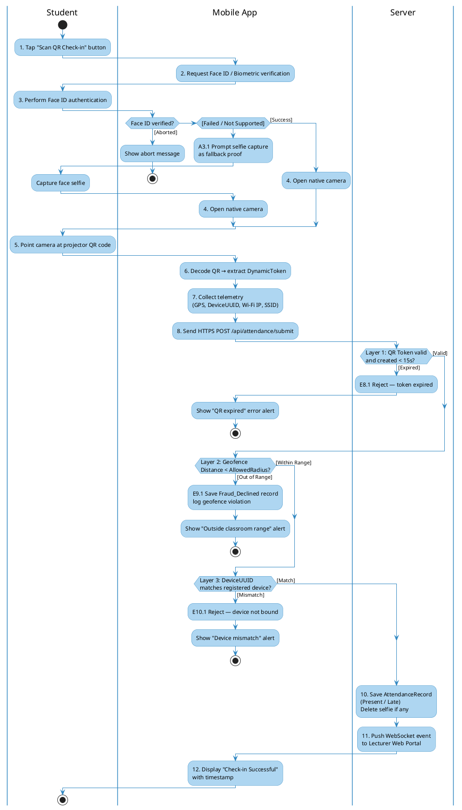
```plantuml
@startuml UC03_Activity_Swimlane
skinparam ActivityBackgroundColor #AED6F1
skinparam ActivityBorderColor #2E86C1
skinparam ActivityDiamondBackgroundColor #AED6F1
skinparam ActivityDiamondBorderColor #2E86C1
skinparam ArrowColor #2E86C1
skinparam ActivityFontSize 12
skinparam swimlaneBorderColor #2E86C1
skinparam swimlaneHeaderFontStyle bold

|Student|
start
:1. Tap "Scan QR Check-in" button;

|Mobile App|
:2. Request Face ID / Biometric verification;

|Student|
:3. Perform Face ID authentication;

|Mobile App|
if (Face ID verified?) then ([Aborted])
  :Show abort message;
  stop
elseif ([Failed / Not Supported]) then
  :A3.1 Prompt selfie capture\nas fallback proof;
  |Student|
  :Capture face selfie;
  |Mobile App|
  :4. Open native camera;
else ([Success])
  :4. Open native camera;
endif

|Student|
:5. Point camera at projector QR code;

|Mobile App|
:6. Decode QR → extract DynamicToken;
:7. Collect telemetry\n(GPS, DeviceUUID, Wi-Fi IP, SSID);
:8. Send HTTPS POST /api/attendance/submit;

|Server|
if (Layer 1: QR Token valid\nand created < 15s?) then ([Expired])
  :E8.1 Reject — token expired;
  |Mobile App|
  :Show "QR expired" error alert;
  stop
else ([Valid])
endif

if (Layer 2: Geofence\nDistance < AllowedRadius?) then ([Out of Range])
  :E9.1 Save Fraud_Declined record\nlog geofence violation;
  |Mobile App|
  :Show "Outside classroom range" alert;
  stop
else ([Within Range])
endif

if (Layer 3: DeviceUUID\nmatches registered device?) then ([Mismatch])
  :E10.1 Reject — device not bound;
  |Mobile App|
  :Show "Device mismatch" alert;
  stop
else ([Match])
endif

|Server|
:10. Save AttendanceRecord\n(Present / Late)\nDelete selfie if any;
:11. Push WebSocket event\nto Lecturer Web Portal;

|Mobile App|
:12. Display "Check-in Successful"\nwith timestamp;

|Student|
stop
@enduml
```

---

#### **Figure I-3: Activity diagram for UC06 - Activate Dynamic QR Session**
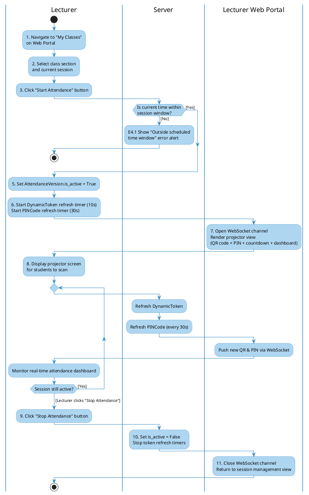
```plantuml
@startuml UC06_Activity_Swimlane
skinparam ActivityBackgroundColor #AED6F1
skinparam ActivityBorderColor #2E86C1
skinparam ActivityDiamondBackgroundColor #AED6F1
skinparam ActivityDiamondBorderColor #2E86C1
skinparam ArrowColor #2E86C1
skinparam ActivityFontSize 12
skinparam swimlaneBorderColor #2E86C1
skinparam swimlaneHeaderFontStyle bold

|Lecturer|
start
:1. Navigate to "My Classes"\non Web Portal;
:2. Select class section\nand current session;
:3. Click "Start Attendance" button;

|Server|
if (Is current time within\nsession window?) then ([No])
  :E4.1 Show "Outside scheduled\ntime window" error alert;
  |Lecturer|
  stop
else ([Yes])
endif

:5. Set AttendanceVersion.is_active = True;
:6. Start DynamicToken refresh timer (10s)\nStart PINCode refresh timer (30s);

|Lecturer Web Portal|
:7. Open WebSocket channel\nRender projector view\n(QR code + PIN + countdown + dashboard);

|Lecturer|
:8. Display projector screen\nfor students to scan;

repeat

  |Server|
  :Refresh DynamicToken;
  :Refresh PINCode (every 30s);

  |Lecturer Web Portal|
  :Push new QR & PIN via WebSocket;

  |Lecturer|
  :Monitor real-time attendance dashboard;

repeat while (Session still active?) is ([Yes])
-> [Lecturer clicks "Stop Attendance"];

|Lecturer|
:9. Click "Stop Attendance" button;

|Server|
:10. Set is_active = False\nStop token refresh timers;

|Lecturer Web Portal|
:11. Close WebSocket channel\nReturn to session management view;

|Lecturer|
stop
@enduml
```

---

## **I.7 Anti-Fraud Rule Catalog**

This catalog centralizes all business anti-fraud checking rules implemented by the AFAS system to serve as a canonical design baseline:

| **Rule ID** | **Rule Name** | **Canonical Validation Logic** | **Affected UC(s)** | **Design/Code Artifact(s)** | **Verification Test Case** |
| :--- | :--- | :--- | :--- | :--- | :--- |
| **AR-01** | Dynamic QR Freshness | QR token scanned by client must match active Redis token generated for current session ID, with timestamp age <= 15s. | `UC03`, `UC06` | `SessionService`, `QRRefreshTimer`, `RedisCacheManager`, `AttendanceService.ProcessCheckin` | `TC-IT-002` |
| **AR-02** | Geofence Boundary Check | Submitted GPS coordinates are compared to classroom configured coords using Haversine formula; distance must be <= `rooms.allowed_radius` (default 20m), or else status is logged as `Fraud_Declined`. | `UC03`, `UC05`, `UC11` | `RoomService`, `AttendanceService.CalculateDistance`, `attendance_records.distance` | `TC-IT-003`, `TC-NFR-002` |
| **AR-03** | Device UUID Binding | A student account can check in only on their registered device. If the incoming request's `DeviceUUID` differs from `students.device_uuid`, submission is rejected. | `UC02`, `UC03`, `UC05` | `DeviceBindingController`, `AttendanceService.ProcessCheckin`, `students.device_uuid` | `TC-IT-004`, `TC-IT-006` |
| **AR-04** | Biometric Authentication | Client must verify local Face ID / fingerprint before submitting QR/PIN. If unavailable, fallback selfie is captured, uploaded, validated by server, and deleted immediately to ensure privacy. | `UC03`, `UC05` | `MobileDeviceHardware.TriggerNativeFaceID`, `AttendanceService.DeleteTempSelfie` | `TC-BIO-001` |
| **AR-05** | Duplicate Scan Block | A student can have at most one attendance record per scheduled session. Subsequent scans within the same session return the original result. | `UC03`, `UC05` | Database unique constraint on `(student_id, session_id)`, `AttendanceService` | `TC-DUP-001` |
| **AR-06** | Wi-Fi Signal Check | Campus public gateway IP is logged. If mismatching the university's known range, a warning flag is written to the record, but does not block check-in on its own. | `UC03` | `SchoolWifiGateway`, `AttendanceService.CheckWifiGateway` | `TC-WIFI-001` |
| **AR-07** | Manual Override Accountability | Any manual adjustment by a lecturer requires choosing a status (Present, Late, Absent, Fraud_Declined) and entering a mandatory reason, which is logged to `system_logs`. | `UC08` | `AttendanceController.AdjustAttendanceStatus`, `SystemLog` | `TC-MAN-001` |

---

## **I.8 Data Requirements**

### **Figure I-4: Entity class diagram modeling data requirements**

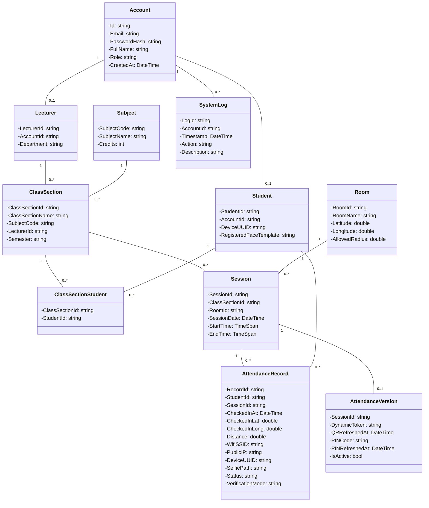
```mermaid
classDiagram
    class Account {
        -Id: string
        -Email: string
        -PasswordHash: string
        -FullName: string
        -Role: string
        -CreatedAt: DateTime
    }

    class Student {
        -StudentId: string
        -AccountId: string
        -DeviceUUID: string
        -RegisteredFaceTemplate: string
    }

    class Lecturer {
        -LecturerId: string
        -AccountId: string
        -Department: string
    }

    class Room {
        -RoomId: string
        -RoomName: string
        -Latitude: double
        -Longitude: double
        -AllowedRadius: double
    }

    class Subject {
        -SubjectCode: string
        -SubjectName: string
        -Credits: int
    }

    class ClassSection {
        -ClassSectionId: string
        -ClassSectionName: string
        -SubjectCode: string
        -LecturerId: string
        -Semester: string
    }

    class ClassSectionStudent {
        -ClassSectionId: string
        -StudentId: string
    }

    class Session {
        -SessionId: string
        -ClassSectionId: string
        -RoomId: string
        -SessionDate: DateTime
        -StartTime: TimeSpan
        -EndTime: TimeSpan
    }

    class AttendanceVersion {
        -SessionId: string
        -DynamicToken: string
        -QRRefreshedAt: DateTime
        -PINCode: string
        -PINRefreshedAt: DateTime
        -IsActive: bool
    }

    class AttendanceRecord {
        -RecordId: string
        -StudentId: string
        -SessionId: string
        -CheckedInAt: DateTime
        -CheckedInLat: double
        -CheckedInLong: double
        -Distance: double
        -WifiSSID: string
        -PublicIP: string
        -DeviceUUID: string
        -SelfiePath: string
        -Status: string
        -VerificationMode: string
    }

    class SystemLog {
        -LogId: string
        -AccountId: string
        -Timestamp: DateTime
        -Action: string
        -Description: string
    }

    Account "1" -- "0..1" Student
    Account "1" -- "0..1" Lecturer
    Account "1" -- "0..*" SystemLog
    
    Lecturer "1" -- "0..*" ClassSection
    Subject "1" -- "0..*" ClassSection
    
    ClassSection "1" -- "0..*" ClassSectionStudent
    Student "1" -- "0..*" ClassSectionStudent
    
    ClassSection "1" -- "0..*" Session
    Room "1" -- "0..*" Session
    
    Session "1" -- "0..1" AttendanceVersion
    Session "1" -- "0..*" AttendanceRecord
    Student "1" -- "0..*" AttendanceRecord
```

---

The entity class diagram (Figure I-4) specifies the domain entities and their relationships, representing the system's data requirements. Table I-12 below serves as the data dictionary, describing each entity's attributes, data types, constraints, and purpose.

### **Table I-12: Data Description (Data dictionary)**

| **Name** | **Data Type** | **Length / Constraint** | **Description** |
| :--- | :--- | :--- | :--- |
| **Account** | | | **User accounts credential catalog** |
| Id | String | 36, PK | Unique account identifier (UUID v4). |
| Email | String | 100, Unique, Not Null | Registered FPT school email. |
| PasswordHash | String | 255, Not Null | Securely hashed password using bcrypt. |
| FullName | String | 100, Not Null | Full display name of the user. |
| Role | String | 20, Not Null | System role: `Student`, `Lecturer`, `Admin`. |
| CreatedAt | DateTime | Not Null | Date and time the account was registered. |
| **Student** | | | **Student profile mapping** |
| StudentId | String | 20, PK | Unique student roll number (e.g. `SE170123`). |
| AccountId | String | 36, FK (Account.Id), Unique | Linking 1-1 to credential account. |
| DeviceUUID | String | 100, Nullable | Device identifier (UUID collected by mobile app) linked to this student account. |
| RegisteredFaceTemplate | Text | Nullable | Encoded 128-dimensional biometric face vector. |
| **Lecturer** | | | **Lecturer profile mapping** |
| LecturerId | String | 20, PK | Assigned school lecturer ID (e.g. `HueCTM`). |
| AccountId | String | 36, FK (Account.Id), Unique | Linking 1-1 to credential account. |
| Department | String | 100 | Faculty department name. |
| **Room** | | | **Classroom geo catalog** |
| RoomId | String | 20, PK | Physical classroom ID (e.g., `AL-L402`). |
| RoomName | String | 50, Not Null | Easy-to-read room display name. |
| Latitude | Double | Not Null | Standard room geographic latitude decimal. |
| Longitude | Double | Not Null | Standard room geographic longitude decimal. |
| AllowedRadius | Double | Not Null, Default 20.0 | Maximum allowed check-in geofence radius in meters. |
| **Subject** | | | **University subject catalog** |
| SubjectCode | String | 20, PK | Subject code identifier (e.g., `SWD392`). |
| SubjectName | String | 150, Not Null | Detailed subject name. |
| Credits | Int | Not Null | Credit value of the course. |
| **ClassSection** | | | **Assigned course class section** |
| ClassSectionId | String | 30, PK | Class section code (e.g., `SWD392_SU26_SE1701`). |
| ClassSectionName | String | 100, Not Null | Friendly class segment name. |
| SubjectCode | String | 20, FK (Subject.SubjectCode) | Reference subject code. |
| LecturerId | String | 20, FK (Lecturer.LecturerId) | Lecturer assigned to teach. |
| Semester | String | 20, Not Null | Academic semester name. |
| **ClassSectionStudent** | | | **Many-to-Many course class roster map** |
| ClassSectionId | String | 30, PK, FK | Reference class section ID. |
| StudentId | String | 20, PK, FK | Enrolled student roll number. |
| **Session** | | | **Scheduled study session date/time** |
| SessionId | String | 36, PK | Scheduled session unique ID (UUID v4). |
| ClassSectionId | String | 30, FK | Belongs to class section code. |
| RoomId | String | 20, FK | Physical room location of the session. |
| SessionDate | Date | Not Null | Scheduled calendar date (YYYY-MM-DD). |
| StartTime | Time | Not Null | Scheduled class start hourly timestamp. |
| EndTime | Time | Not Null | Scheduled class end hourly timestamp. |
| **AttendanceVersion** | | | **Dynamic QR/PIN session version** |
| SessionId | String | 36, PK, FK (Session.SessionId)| Ties 1-1 to the active session. |
| DynamicToken | String | 255, Nullable | Dynamic active token encrypted inside QR. |
| QRRefreshedAt | DateTime | Nullable | Exact timestamp the token was refreshed on server. |
| PINCode | String | 6, Nullable | 6-digit backup fallback validation PIN. |
| PINRefreshedAt | DateTime | Nullable | Exact timestamp the PIN was last refreshed on server. Used to validate 30s expiry window. |
| IsActive | Boolean | Not Null, Default False | Active attendance check status flag. |
| **AttendanceRecord** | | | **Check-in telemetry audit result** |
| RecordId | String | 36, PK | Unique record ID (UUID v4). |
| StudentId | String | 20, FK | Referencing checking student. |
| SessionId | String | 36, FK | Referencing active checking session. |
| CheckedInAt | DateTime | Not Null | Device submit timestamp. |
| CheckedInLat | Double | Not Null | Lat GPS telemetry sent by device. |
| CheckedInLong | Double | Not Null | Long GPS telemetry sent by device. |
| Distance | Double | Not Null | Haversine calculated distance from classroom center. |
| WifiSSID | String | 100, Nullable | SSID of Wi-Fi router device was connected to. |
| PublicIP | String | 45, Nullable | Public IP gateway address during check-in. |
| DeviceUUID | String | 100, Not Null | Device identifier (UUID collected by mobile app) submitted during check-in. |
| SelfiePath | String | 255, Nullable | Temporary path to face audit image used as fallback proof. Deleted immediately after server verification; null in normal Face ID flow. |
| Status | String | 20, Not Null | Final checked status: `Present`, `Late`, `Absent`, `Fraud_Declined`. |
| VerificationMode | String | 20, Not Null | Selected check-in method: `QR`, `PIN`, `Offline_Cached`, `Manual`. |
| **SystemLog** | | | **Administrative audit history log** |
| LogId | Serial | PK | Auto-incrementing log index. |
| AccountId | String | 36, FK (Account.Id) | Performing staff account ID. |
| Timestamp | DateTime | Not Null | Audit action precise timestamp. |
| Action | String | 50, Not Null | Triggered action category (e.g. `Configure_Room`). |
| Description | String | 255, Not Null | Detailed audit explanation. |

---

## **II. Analysis models**

## **II.0 Static Analysis**

### **II.0.1 Contextual Boundary Class Diagram**

The Contextual Boundary Class Diagram identifies the direct connections between external Actors and the `«boundary»` interface classes they interact with to send/receive data from the system. This diagram follows the COMET BCE (Boundary-Control-Entity) classification model.

#### **Figure II-0A: Contextual Boundary Class Diagram**
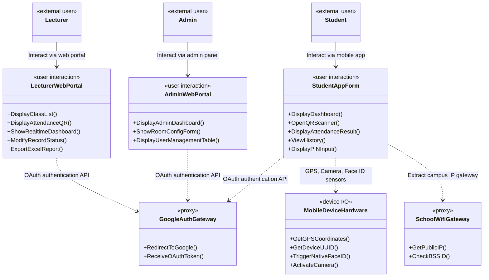
```mermaid
classDiagram
    %% External Actors (Human Users)
    class Student {
        <<external user>>
    }
    class Lecturer {
        <<external user>>
    }
    class Admin {
        <<external user>>
    }

    %% User Interaction Boundary Classes
    class StudentAppForm {
        <<user interaction>>
        +DisplayDashboard()
        +OpenQRScanner()
        +DisplayAttendanceResult()
        +ViewHistory()
        +DisplayPINInput()
    }

    class LecturerWebPortal {
        <<user interaction>>
        +DisplayClassList()
        +DisplayAttendanceQR()
        +ShowRealtimeDashboard()
        +ModifyRecordStatus()
        +ExportExcelReport()
    }

    class AdminWebPortal {
        <<user interaction>>
        +DisplayAdminDashboard()
        +ShowRoomConfigForm()
        +DisplayUserManagementTable()
    }

    %% External System Proxy Boundary Classes
    class GoogleAuthGateway {
        <<proxy>>
        +RedirectToGoogle()
        +ReceiveOAuthToken()
    }

    class SchoolWifiGateway {
        <<proxy>>
        +GetPublicIP()
        +CheckBSSID()
    }

    %% External Device I/O Boundary Classes
    class MobileDeviceHardware {
        <<device I/O>>
        +GetGPSCoordinates()
        +GetDeviceUUID()
        +TriggerNativeFaceID()
        +ActivateCamera()
    }

    %% Actor-to-Boundary Associations
    Student --> StudentAppForm : Interact via mobile app
    Lecturer --> LecturerWebPortal : Interact via web portal
    Admin --> AdminWebPortal : Interact via admin panel

    StudentAppForm ..> GoogleAuthGateway : OAuth authentication API
    LecturerWebPortal ..> GoogleAuthGateway : OAuth authentication API
    AdminWebPortal ..> GoogleAuthGateway : OAuth authentication API

    StudentAppForm ..> MobileDeviceHardware : GPS, Camera, Face ID sensors
    StudentAppForm ..> SchoolWifiGateway : Extract campus IP gateway
```

**Boundary Communication Description:**
1.  **StudentAppForm (`«user interaction»`):** Provides a minimal mobile interface optimized for NFR **NF-03 (Usability)**. Directly invokes hardware sensors on the mobile device (`MobileDeviceHardware`) via React Native Bridge to collect GPS coordinates, trigger Face ID verification, and activate the QR camera scanner.
2.  **LecturerWebPortal (`«user interaction»`):** Web portal featuring a large-screen projector QR display with integrated WebSocket channel. The screen automatically updates the student attendance list in real-time without manual page refresh.
3.  **GoogleAuthGateway (`«proxy»`):** Proxy boundary connecting to Google's OAuth 2.0 service for authenticating `@fpt.edu.vn` email accounts. All three user-facing boundaries delegate authentication through this shared proxy.
4.  **SchoolWifiGateway (`«proxy»`):** Network proxy boundary that sends a hidden request to the campus network infrastructure to retrieve the Public IP address and verify whether the student is physically connected to the university's internal Wi-Fi.
5.  **MobileDeviceHardware (`«device I/O»`):** Hardware abstraction boundary wrapping the phone's physical sensors: high-precision GPS chip, native biometric reader (Face ID / TouchID), camera module, and device UUID extraction.

---

### **II.0.2 Object Structuring Criteria**

The Object Structuring Criteria classify all system objects into hierarchical groups based on their processing roles, following the COMET BCE (Boundary-Control-Entity) stereotyping method. This tree structure guides the transition from analysis to design.

#### **Figure II-0B: Object Structuring Criteria Tree**

```mermaid
graph TD
    Root[AFAS System Objects] --> Boundary["1. Boundary Objects<br>«boundary»"]
    Root --> Control["2. Control Objects<br>«control»"]
    Root --> Entity["3. Entity Objects<br>«entity»"]

    %% Boundary hierarchy
    Boundary --> UI["1.1 User Interface<br>«user interaction»"]
    Boundary --> Device["1.2 Device Interface<br>«device I/O»"]
    Boundary --> Sys["1.3 System Interface<br>«proxy»"]
    
    UI --> StudentAppForm["StudentAppForm"]
    UI --> LecturerWebPortal["LecturerWebPortal"]
    UI --> AdminWebPortal["AdminWebPortal"]
    
    Device --> GPSReceiver["GPSReceiver"]
    Device --> CameraScanner["CameraScanner"]
    Device --> NativeBiometricReader["NativeBiometricReader"]
    
    Sys --> GoogleOAuthGateway["GoogleOAuthGateway"]
    Sys --> SchoolWifiGateway["SchoolWifiGateway"]

    %% Control hierarchy
    Control --> Coord["2.1 Coordinator<br>«coordinator»"]
    Control --> StateDep["2.2 State-Dependent<br>«state dependent control»"]
    Control --> Timers["2.3 Timer<br>«timer»"]
    
    Coord --> AttendanceController["AttendanceController"]
    Coord --> DeviceBindingController["DeviceBindingController"]
    Coord --> AuthenticationController["AuthenticationController"]
    
    StateDep --> SessionController["SessionController"]
    StateDep --> RoomConfigurationController["RoomConfigController"]
    
    Timers --> QRRefreshTimer["QRRefreshTimer"]
    Timers --> PINRefreshTimer["PINRefreshTimer"]

    %% Entity hierarchy
    Entity --> Data["3.1 Data Abstraction<br>«data abstraction»"]
    Entity --> DBWrap["3.2 Database Wrapper<br>«database wrapper»"]
    
    Data --> StudentEntity["Student"]
    Data --> LecturerEntity["Lecturer"]
    Data --> RoomEntity["Room"]
    Data --> SessionEntity["Session"]
    Data --> AttendanceRecordEntity["AttendanceRecord"]
    
    DBWrap --> StudentRepository["StudentRepository"]
    DBWrap --> AttendanceRepository["AttendanceRepository"]
    DBWrap --> RedisCacheManager["RedisCacheManager"]
```

**Structuring Criteria Description:**

1.  **Boundary Objects — Structuring by Interface Type:**
    *   **User Interface Objects (`«user interaction»`):** Objects responsible for rendering graphical screens directly to end users (StudentAppForm, LecturerWebPortal, AdminWebPortal).
    *   **Device Interface Objects (`«device I/O»`):** Objects connecting directly to physical hardware sensors on the mobile phone. These form the evidence-collection layer for GPS, Camera, and Face ID verification.
    *   **System Interface Objects (`«proxy»`):** Integration gateways connecting to external authentication and network verification services (Google OAuth, campus Wi-Fi gateway).

2.  **Control Objects — Structuring by Coordination Complexity:**
    *   **Coordinator Objects (`«coordinator»`):** Orchestrate the complete event flow of primary use cases. Example: `AttendanceController` coordinates GPS verification, IP matching, and Face ID validation before recording attendance status.
    *   **State-Dependent Objects (`«state dependent control»`):** Objects whose behavior changes based on the current state of an associated entity. Example: `SessionController` manages session lifecycle (`Active`, `Paused`, `Completed`).
    *   **Timer Control Objects (`«timer»`):** Background-running synchronization objects responsible for triggering periodic events. These form the backbone of Anti-Fraud Layer 1. Example: `QRRefreshTimer` triggers a new dynamic QR token every 10 seconds; `PINRefreshTimer` refreshes the PIN every 30 seconds.

3.  **Entity Objects — Structuring by Persistence Responsibility (COMET Split Entity Rule):**
    *   **Data Abstraction Objects (`«data abstraction»`):** Pure in-memory business model objects encapsulating attributes and domain logic. Located in the Domain layer.
    *   **Database Wrapper Objects (`«database wrapper»`):** Objects encapsulating physical database access logic (PostgreSQL via EF Core) and high-speed cache management (Redis) to support NFR **NF-01 (Concurrency)** peak-hour load handling. Located in the Infrastructure layer.

---

### **II.0.3 UI Wireframes**

The following wireframes describe the key user interface screens for the three system portals: Student Mobile App, Lecturer Web Portal, and Admin Web Portal.

#### **Wireframe WF-01: Student Mobile App — Login Screen**
```
┌─────────────────────────────┐
│         AFAS Login          │
│                             │
│  ┌───────────────────────┐  │
│  │ MSSV / Username       │  │
│  └───────────────────────┘  │
│  ┌───────────────────────┐  │
│  │ Password              │  │
│  └───────────────────────┘  │
│                             │
│  ┌───────────────────────┐  │
│  │    🔑 LOGIN           │  │
│  └───────────────────────┘  │
│                             │
│  ──── OR ────               │
│                             │
│  ┌───────────────────────┐  │
│  │  G  Login with Google │  │
│  │     (@fpt.edu.vn)     │  │
│  └───────────────────────┘  │
│                             │
│  Forgot Password?           │
└─────────────────────────────┘
```

#### **Wireframe WF-02: Student Mobile App — Dashboard & QR Scanner**
```
┌─────────────────────────────┐
│ ☰  AFAS Dashboard     👤   │
├─────────────────────────────┤
│                             │
│  Welcome, Nguyen Van A      │
│  MSSV: SE170123             │
│  Device: ✅ Bound           │
│                             │
│  ┌───────────────────────┐  │
│  │                       │  │
│  │   📷 SCAN QR CODE     │  │
│  │   (Tap to check-in)   │  │
│  │                       │  │
│  └───────────────────────┘  │
│                             │
│  ┌───────────────────────┐  │
│  │   🔢 PIN CHECK-IN     │  │
│  └───────────────────────┘  │
│                             │
├──────┬──────┬──────┬────────┤
│ 🏠   │ 📷  │ 📋  │  👤    │
│ Home │ Scan │ Hist │ Profile│
└──────┴──────┴──────┴────────┘
```

#### **Wireframe WF-03: Student Mobile App — QR Camera View**
```
┌─────────────────────────────┐
│  ← Back        QR Scanner   │
├─────────────────────────────┤
│                             │
│  Face ID: ✅ Verified       │
│                             │
│  ┌───────────────────────┐  │
│  │                       │  │
│  │    ┌─────────────┐    │  │
│  │    │             │    │  │
│  │    │  [QR CODE]  │    │  │
│  │    │   TARGET    │    │  │
│  │    │             │    │  │
│  │    └─────────────┘    │  │
│  │                       │  │
│  │   📍 Camera Viewfinder│  │
│  └───────────────────────┘  │
│                             │
│  GPS: 21.0128, 105.5246     │
│  Wi-Fi: FPT_University_5G  │
│  UUID: A1B2C3...            │
└─────────────────────────────┘
```

#### **Wireframe WF-04: Student Mobile App — Attendance History**
```
┌─────────────────────────────┐
│  ← Back    Attendance History│
├─────────────────────────────┤
│                             │
│  SWD392 - Software Design   │
│  Semester: Summer 2026      │
│                             │
│  ┌──────────────────────┐   │
│  │ Present: 12 │ 🟢 80% │   │
│  │ Late:     2 │ 🟡 13% │   │
│  │ Absent:   1 │ 🔴  7% │   │
│  └──────────────────────┘   │
│                             │
│  ┌─ May 2026 Calendar ───┐  │
│  │ Mo Tu We Th Fr Sa Su  │  │
│  │        1🟢 2   3  4   │  │
│  │  5  6  7  8🟢 9 10 11 │  │
│  │ 12 13 14 15🟡16 17 18 │  │
│  │ 19 20 21 22🔴23 24 25 │  │
│  │ 26 27                 │  │
│  └───────────────────────┘  │
└─────────────────────────────┘
```

#### **Wireframe WF-05: Lecturer Web Portal — Dynamic QR Projector View**
```
┌─────────────────────────────────────────────────────────────────┐
│  AFAS Lecturer Portal  │ SWD392 - SE1701 │ Session: 27/05/2026 │
├─────────────────────────────────────────────────────────────────┤
│                                                                 │
│    ┌──────────────────┐        ┌───────────────────────────┐    │
│    │                  │        │  Real-time Attendance Grid │    │
│    │                  │        ├───────────────────────────┤    │
│    │   ███████████    │        │ 🟢 SE170123 Nguyen Van A  │    │
│    │   █ QR CODE █    │        │ 🟢 SE170456 Tran Thi B    │    │
│    │   █ DYNAMIC █    │        │ ⬜ SE170789 Le Van C       │    │
│    │   ███████████    │        │ ⬜ SE170012 Pham Thi D     │    │
│    │                  │        │ 🟡 SE170345 Hoang Van E   │    │
│    │  Refreshes: 10s  │        │ ⬜ SE170678 Vo Thi F       │    │
│    └──────────────────┘        │ ...                        │    │
│                                └───────────────────────────┘    │
│    PIN: 847291                  Checked-in: 12 / 35 (34%)       │
│    PIN Refreshes: 30s           ⏱ Session active: 04:32         │
│                                                                 │
│    [ 🛑 Stop Attendance ]     [ 📊 Export Excel ]               │
└─────────────────────────────────────────────────────────────────┘
```

#### **Wireframe WF-06: Lecturer Web Portal — Manual Adjustment Modal**
```
┌───────────────────────────────────────────┐
│  Adjust Attendance Status                 │
├───────────────────────────────────────────┤
│                                           │
│  Student: SE170789 - Le Van C             │
│  Session: SWD392 - 27/05/2026             │
│  Current Status: ⬜ Absent                │
│                                           │
│  New Status:                              │
│  ┌─────────────────────────────────────┐  │
│  │ ○ Present  ○ Late  ● Absent        │  │
│  │ ○ Fraud_Declined                   │  │
│  └─────────────────────────────────────┘  │
│                                           │
│  Reason (required):                       │
│  ┌─────────────────────────────────────┐  │
│  │ Student showed medical certificate  │  │
│  │ for being late. Verified by lectu.. │  │
│  └─────────────────────────────────────┘  │
│                                           │
│  [ Cancel ]              [ 💾 Save ]      │
└───────────────────────────────────────────┘
```

#### **Wireframe WF-07: Admin Web Portal — Room GPS Configuration**
```
┌─────────────────────────────────────────────────────────────────┐
│  AFAS Admin Portal  │  Room Management                         │
├─────────────────────────────────────────────────────────────────┤
│                                                                 │
│  ┌───────────────────────────────────────────────────────────┐  │
│  │ Room ID │ Room Name    │ Latitude   │ Longitude  │ Radius │  │
│  ├─────────┼──────────────┼────────────┼────────────┼────────┤  │
│  │ AL-L301 │ Alpha 301    │ 21.01282   │ 105.52461  │ 20m    │  │
│  │ AL-L402 │ Alpha 402    │ 21.01305   │ 105.52489  │ 20m    │  │
│  │ BE-202  │ Beta 202     │ 21.01198   │ 105.52378  │ 25m    │  │
│  │ [+ Add New Room]                                          │  │
│  └───────────────────────────────────────────────────────────┘  │
│                                                                 │
│  ┌─ Configure Room: AL-L402 ─────────────────────────────────┐  │
│  │                                                           │  │
│  │  ┌──────────────────────────────┐  Latitude:              │  │
│  │  │                              │  ┌──────────────────┐   │  │
│  │  │     🗺️ SATELLITE MAP        │  │ 21.01305         │   │  │
│  │  │                              │  └──────────────────┘   │  │
│  │  │        📍 (click to set)     │  Longitude:             │  │
│  │  │                              │  ┌──────────────────┐   │  │
│  │  │                              │  │ 105.52489        │   │  │
│  │  └──────────────────────────────┘  └──────────────────┘   │  │
│  │                                    Allowed Radius (m):     │  │
│  │  [ 📡 Capture Current GPS ]       ┌──────────────────┐   │  │
│  │                                    │ 20               │   │  │
│  │                                    └──────────────────┘   │  │
│  │                                                           │  │
│  │              [ Cancel ]      [ 💾 Save Configuration ]    │  │
│  └───────────────────────────────────────────────────────────┘  │
└─────────────────────────────────────────────────────────────────┘
```

#### **Wireframe WF-08: Student Mobile App — PIN Fallback Input**
```
┌─────────────────────────────┐
│  ← Back      PIN Check-in   │
├─────────────────────────────┤
│                             │
│  Face ID: ✅ Verified       │
│                             │
│  Enter the 6-digit PIN      │
│  displayed on the projector │
│                             │
│  ┌──┐ ┌──┐ ┌──┐ ┌──┐ ┌──┐ ┌──┐│
│  │8 │ │4 │ │7 │ │2 │ │9 │ │1 ││
│  └──┘ └──┘ └──┘ └──┘ └──┘ └──┘│
│                             │
│  GPS: 21.0128, 105.5246     │
│  UUID: A1B2C3...            │
│                             │
│  ┌───────────────────────┐  │
│  │    ✅ SUBMIT PIN       │  │
│  └───────────────────────┘  │
│                             │
│  PIN refreshes every 30s.   │
│  Make sure to enter the     │
│  current PIN on screen.     │
└─────────────────────────────┘
```

---

## **II.1 Interaction diagrams**

In this section, we analyze the objects and their interactions to realize the core use cases of the AFAS system based on Gomaa's MVC analysis pattern. For each key use case, we construct both a **Sequence Diagram** (representing time-sequence interactions) and a **Communication Diagram** (representing structural links and message sequence numbers).

---

### **1. UC01: Login via Credentials or Google OAuth**

#### **Figure II-1A: Sequence Diagram for UC01 - Login**
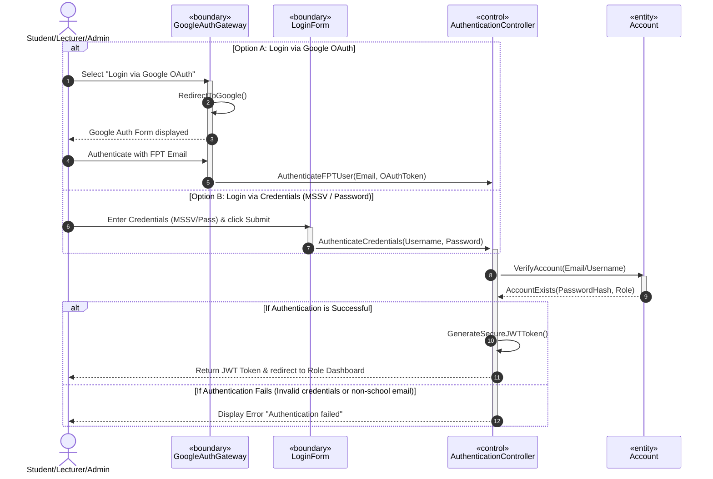
```mermaid
sequenceDiagram
    autonumber
    actor User as Student/Lecturer/Admin
    participant LGG as «boundary»<br>GoogleAuthGateway
    participant LAF as «boundary»<br>LoginForm
    participant AC as «control»<br>AuthenticationController
    participant ACC as «entity»<br>Account

    alt Option A: Login via Google OAuth
        User->>LGG: Select "Login via Google OAuth"
        activate LGG
        LGG->>LGG: RedirectToGoogle()
        LGG-->>User: Google Auth Form displayed
        User->>LGG: Authenticate with FPT Email
        LGG->>AC: AuthenticateFPTUser(Email, OAuthToken)
        deactivate LGG
        activate AC
    else Option B: Login via Credentials (MSSV / Password)
        User->>LAF: Enter Credentials (MSSV/Pass) & click Submit
        activate LAF
        LAF->>AC: AuthenticateCredentials(Username, Password)
        deactivate LAF
        activate AC
    end

    AC->>ACC: VerifyAccount(Email/Username)
    activate ACC
    ACC-->>AC: AccountExists(PasswordHash, Role)
    deactivate ACC

    alt If Authentication is Successful
        AC->>AC: GenerateSecureJWTToken()
        AC-->>User: Return JWT Token & redirect to Role Dashboard
    else If Authentication Fails (Invalid credentials or non-school email)
        AC-->>User: Display Error "Authentication failed"
    end
    deactivate AC
```

#### **Figure II-1B: Communication Diagram for UC01 - Login**
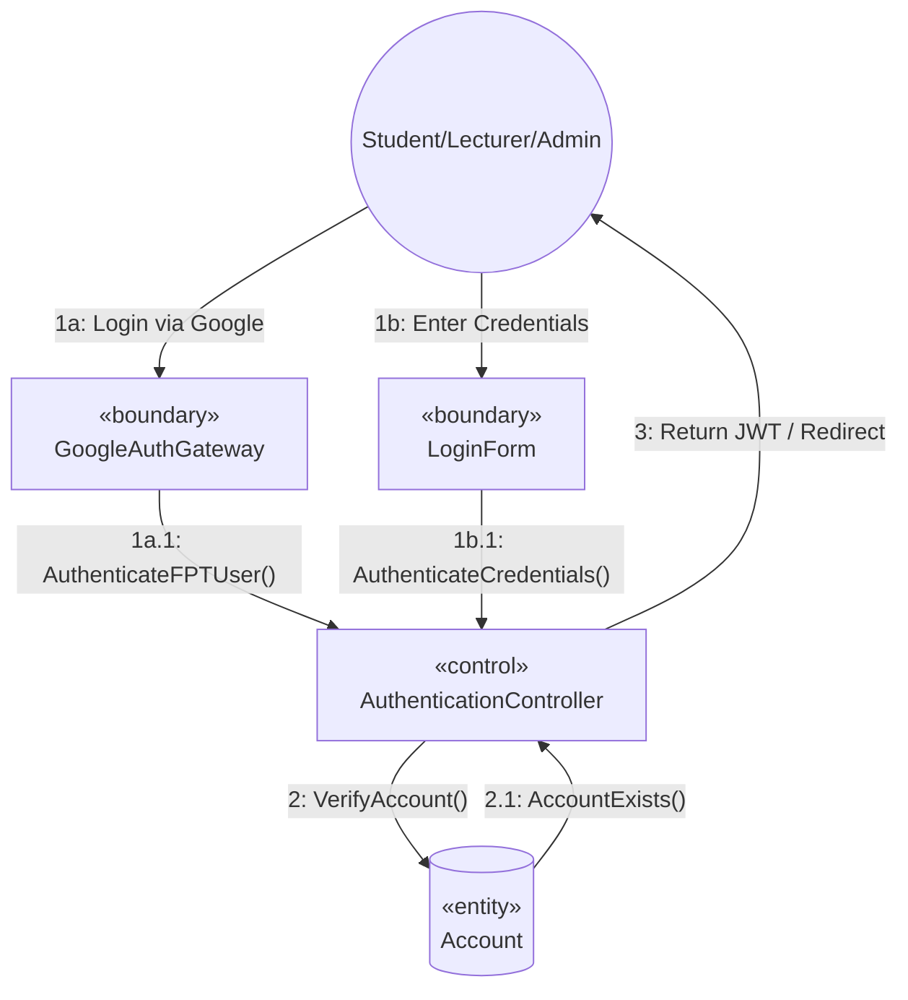
```mermaid
graph TD
    User((Student/Lecturer/Admin))
    LGG[«boundary»<br>GoogleAuthGateway]
    LAF[«boundary»<br>LoginForm]
    AC[«control»<br>AuthenticationController]
    ACC[(«entity»<br>Account)]

    %% Connections and Messages
    User -->|"1a: Login via Google"| LGG
    User -->|"1b: Enter Credentials"| LAF
    
    LGG -->|"1a.1: AuthenticateFPTUser()"| AC
    LAF -->|"1b.1: AuthenticateCredentials()"| AC
    
    AC -->|"2: VerifyAccount()"| ACC
    ACC -->|"2.1: AccountExists()"| AC
    AC -->|"3: Return JWT / Redirect"| User
```

---

### **2. UC02: Register Device UUID**

#### **Figure II-2A: Sequence Diagram for UC02 - Register Device UUID**
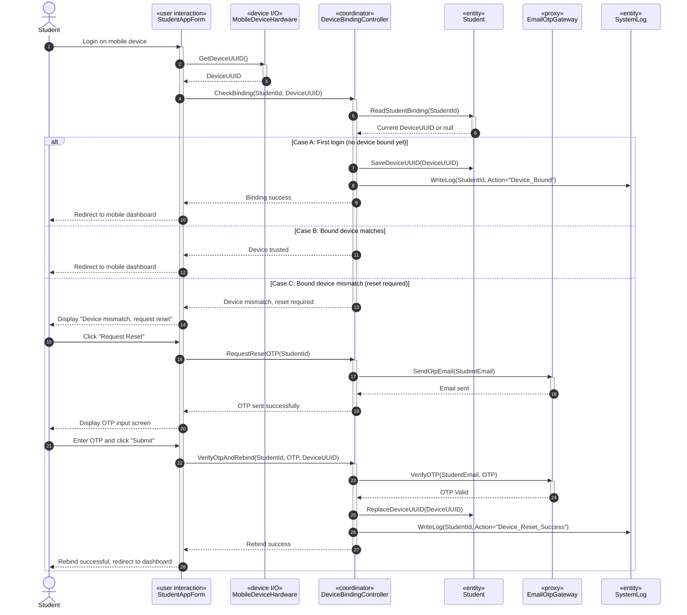
```mermaid
sequenceDiagram
    autonumber
    actor SV as Student
    participant SAF as «user interaction»<br>StudentAppForm
    participant MD as «device I/O»<br>MobileDeviceHardware
    participant DBC as «coordinator»<br>DeviceBindingController
    participant ST as «entity»<br>Student
    participant OTP as «proxy»<br>EmailOtpGateway
    participant SL as «entity»<br>SystemLog

    SV->>SAF: Login on mobile device
    activate SAF
    SAF->>MD: GetDeviceUUID()
    activate MD
    MD-->>SAF: DeviceUUID
    deactivate MD
    SAF->>DBC: CheckBinding(StudentId, DeviceUUID)
    activate DBC
    DBC->>ST: ReadStudentBinding(StudentId)
    activate ST
    ST-->>DBC: Current DeviceUUID or null
    deactivate ST

    alt Case A: First login (no device bound yet)
        DBC->>ST: SaveDeviceUUID(DeviceUUID)
        DBC->>SL: WriteLog(StudentId, Action="Device_Bound")
        DBC-->>SAF: Binding success
        SAF-->>SV: Redirect to mobile dashboard
    else Case B: Bound device matches
        DBC-->>SAF: Device trusted
        SAF-->>SV: Redirect to mobile dashboard
    else Case C: Bound device mismatch (reset required)
        DBC-->>SAF: Device mismatch, reset required
        deactivate DBC
        SAF-->>SV: Display "Device mismatch, request reset"
        SV->>SAF: Click "Request Reset"
        SAF->>DBC: RequestResetOTP(StudentId)
        activate DBC
        DBC->>OTP: SendOtpEmail(StudentEmail)
        activate OTP
        OTP-->>DBC: Email sent
        deactivate OTP
        DBC-->>SAF: OTP sent successfully
        deactivate DBC
        SAF-->>SV: Display OTP input screen
        SV->>SAF: Enter OTP and click "Submit"
        SAF->>DBC: VerifyOtpAndRebind(StudentId, OTP, DeviceUUID)
        activate DBC
        DBC->>OTP: VerifyOTP(StudentEmail, OTP)
        activate OTP
        OTP-->>DBC: OTP Valid
        deactivate OTP
        DBC->>ST: ReplaceDeviceUUID(DeviceUUID)
        DBC->>SL: WriteLog(StudentId, Action="Device_Reset_Success")
        DBC-->>SAF: Rebind success
        deactivate DBC
        SAF-->>SV: Rebind successful, redirect to dashboard
    end
    deactivate SAF
```

#### **Figure II-2B: Communication Diagram for UC02 - Register Device UUID**
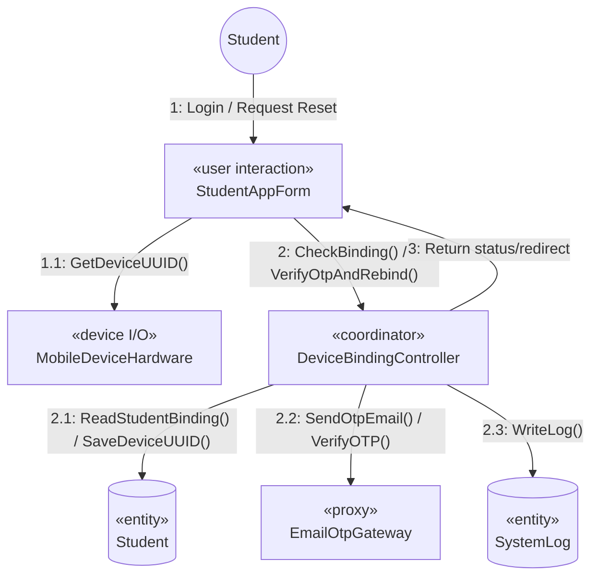
```mermaid
graph TD
    SV((Student))
    SAF["«user interaction»<br>StudentAppForm"]
    MD["«device I/O»<br>MobileDeviceHardware"]
    DBC["«coordinator»<br>DeviceBindingController"]
    ST[("«entity»<br>Student")]
    OTP["«proxy»<br>EmailOtpGateway"]
    SL[("«entity»<br>SystemLog")]

    %% Connections and Messages
    SV -->|"1: Login / Request Reset"| SAF
    SAF -->|"1.1: GetDeviceUUID()"| MD
    SAF -->|"2: CheckBinding() / VerifyOtpAndRebind()"| DBC
    DBC -->|"2.1: ReadStudentBinding() / SaveDeviceUUID()"| ST
    DBC -->|"2.2: SendOtpEmail() / VerifyOTP()"| OTP
    DBC -->|"2.3: WriteLog()"| SL
    DBC -->|"3: Return status/redirect"| SAF
```

---

### **3. UC03: Scan Dynamic QR Check-in**

#### **Figure II-3A: Sequence Diagram for UC03 - Scan Dynamic QR Check-in**
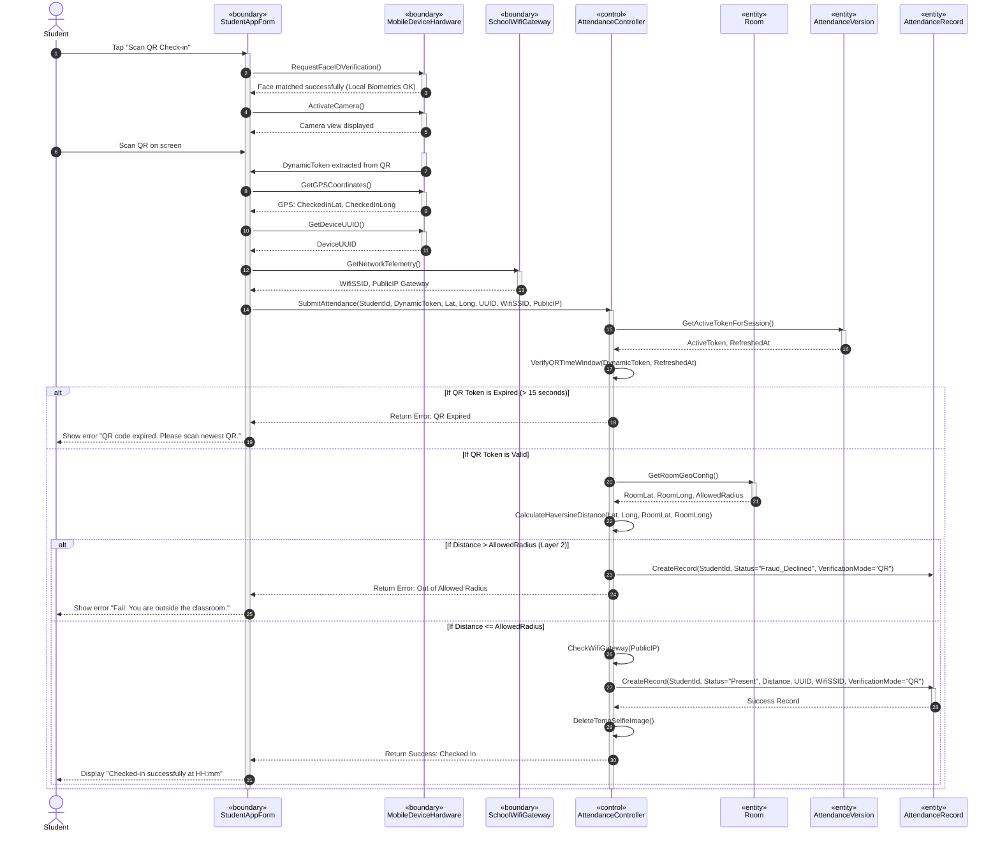
```mermaid
sequenceDiagram
    autonumber
    actor SV as Student
    participant SAF as «boundary»<br>StudentAppForm
    participant MD as «boundary»<br>MobileDeviceHardware
    participant WG as «boundary»<br>SchoolWifiGateway
    participant AC as «control»<br>AttendanceController
    participant R as «entity»<br>Room
    participant V as «entity»<br>AttendanceVersion
    participant AR as «entity»<br>AttendanceRecord

    SV->>SAF: Tap "Scan QR Check-in"
    activate SAF
    
    SAF->>MD: RequestFaceIDVerification()
    activate MD
    MD-->>SAF: Face matched successfully (Local Biometrics OK)
    deactivate MD
    
    SAF->>MD: ActivateCamera()
    activate MD
    MD-->>SAF: Camera view displayed
    deactivate MD
    
    SV->>SAF: Scan QR on screen
    activate MD
    MD->>SAF: DynamicToken extracted from QR
    deactivate MD
    
    SAF->>MD: GetGPSCoordinates()
    activate MD
    MD-->>SAF: GPS: CheckedInLat, CheckedInLong
    deactivate MD
    
    SAF->>MD: GetDeviceUUID()
    activate MD
    MD-->>SAF: DeviceUUID
    deactivate MD
    
    SAF->>WG: GetNetworkTelemetry()
    activate WG
    WG-->>SAF: WifiSSID, PublicIP Gateway
    deactivate WG
    
    SAF->>AC: SubmitAttendance(StudentId, DynamicToken, Lat, Long, UUID, WifiSSID, PublicIP)
    activate AC
    
    AC->>V: GetActiveTokenForSession()
    activate V
    V-->>AC: ActiveToken, RefreshedAt
    deactivate V
    AC->>AC: VerifyQRTimeWindow(DynamicToken, RefreshedAt)
    
    alt If QR Token is Expired (> 15 seconds)
        AC-->>SAF: Return Error: QR Expired
        SAF-->>SV: Show error "QR code expired. Please scan newest QR."
    else If QR Token is Valid
        AC->>R: GetRoomGeoConfig()
        activate R
        R-->>AC: RoomLat, RoomLong, AllowedRadius
        deactivate R
        AC->>AC: CalculateHaversineDistance(Lat, Long, RoomLat, RoomLong)
        
        alt If Distance > AllowedRadius (Layer 2)
            AC->>AR: CreateRecord(StudentId, Status="Fraud_Declined", VerificationMode="QR")
            AC-->>SAF: Return Error: Out of Allowed Radius
            SAF-->>SV: Show error "Fail: You are outside the classroom."
        else If Distance <= AllowedRadius
            AC->>AC: CheckWifiGateway(PublicIP)
            AC->>AR: CreateRecord(StudentId, Status="Present", Distance, UUID, WifiSSID, VerificationMode="QR")
            activate AR
            AR-->>AC: Success Record
            deactivate AR
            
            AC->>AC: DeleteTempSelfieImage()
            
            AC-->>SAF: Return Success: Checked In
            SAF-->>SV: Display "Checked-in successfully at HH:mm"
        end
    end
    deactivate AC
    deactivate SAF
```

#### **Figure II-3B: Communication Diagram for UC03 - Scan Dynamic QR Check-in**
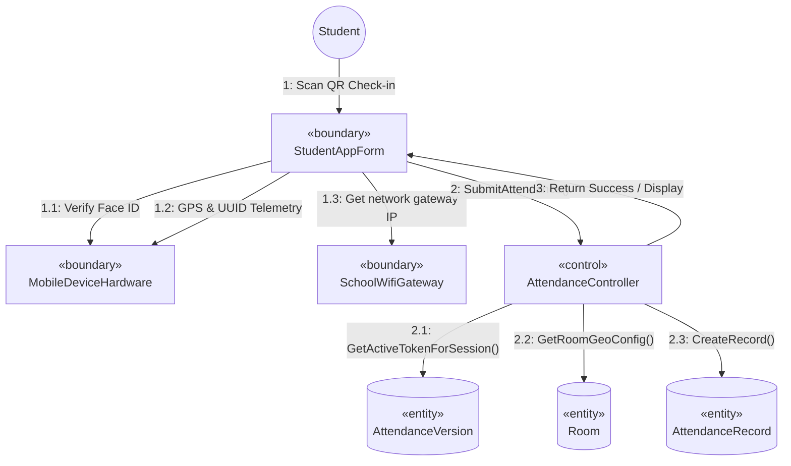
```mermaid
graph TD
    SV((Student))
    SAF[«boundary»<br>StudentAppForm]
    MD[«boundary»<br>MobileDeviceHardware]
    WG[«boundary»<br>SchoolWifiGateway]
    AC[«control»<br>AttendanceController]
    R[(«entity»<br>Room)]
    V[(«entity»<br>AttendanceVersion)]
    AR[(«entity»<br>AttendanceRecord)]

    SV -->|"1: Scan QR Check-in"| SAF
    SAF -->|"1.1: Verify Face ID"| MD
    SAF -->|"1.2: GPS & UUID Telemetry"| MD
    SAF -->|"1.3: Get network gateway IP"| WG
    
    SAF -->|"2: SubmitAttendance()"| AC
    AC -->|"2.1: GetActiveTokenForSession()"| V
    AC -->|"2.2: GetRoomGeoConfig()"| R
    AC -->|"2.3: CreateRecord()"| AR
    AC -->|"3: Return Success / Display"| SAF
```

---

### **4. UC04: View Attendance History**

#### **Figure II-4A: Sequence Diagram for UC04 - View Attendance History**
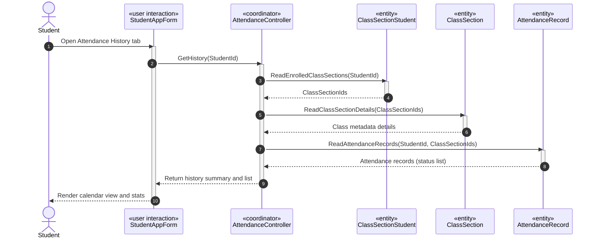
```mermaid
sequenceDiagram
    autonumber
    actor SV as Student
    participant SAF as «user interaction»<br>StudentAppForm
    participant AC as «coordinator»<br>AttendanceController
    participant CSS as «entity»<br>ClassSectionStudent
    participant CS as «entity»<br>ClassSection
    participant AR as «entity»<br>AttendanceRecord

    SV->>SAF: Open Attendance History tab
    activate SAF
    SAF->>AC: GetHistory(StudentId)
    activate AC
    AC->>CSS: ReadEnrolledClassSections(StudentId)
    activate CSS
    CSS-->>AC: ClassSectionIds
    deactivate CSS
    AC->>CS: ReadClassSectionDetails(ClassSectionIds)
    activate CS
    CS-->>AC: Class metadata details
    deactivate CS
    AC->>AR: ReadAttendanceRecords(StudentId, ClassSectionIds)
    activate AR
    AR-->>AC: Attendance records (status list)
    deactivate AR
    AC-->>SAF: Return history summary and list
    deactivate AC
    SAF-->>SV: Render calendar view and stats
    deactivate SAF
```

#### **Figure II-4B: Communication Diagram for UC04 - View Attendance History**
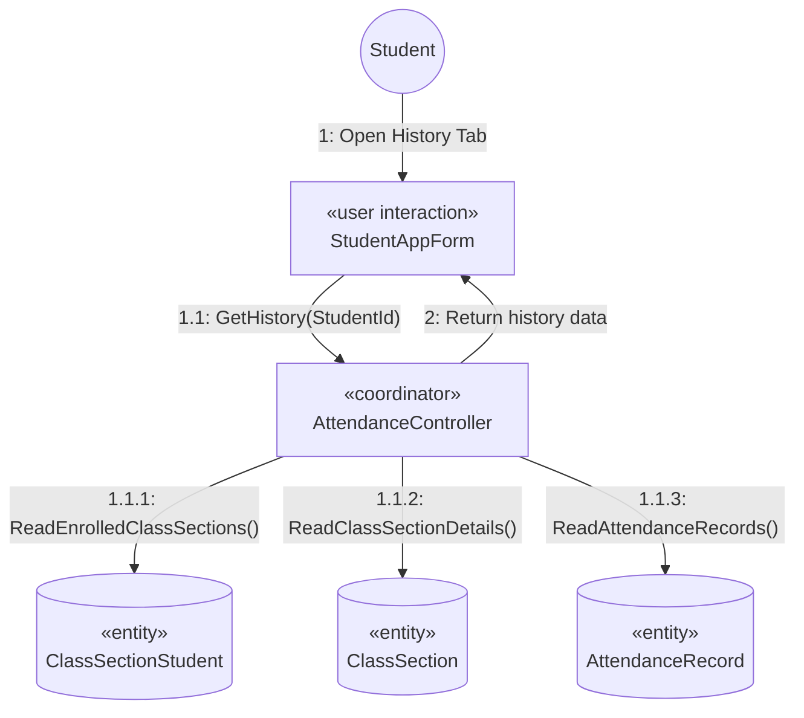
```mermaid
graph TD
    SV((Student))
    SAF["«user interaction»<br>StudentAppForm"]
    AC["«coordinator»<br>AttendanceController"]
    CSS[("«entity»<br>ClassSectionStudent")]
    CS[("«entity»<br>ClassSection")]
    AR[("«entity»<br>AttendanceRecord")]

    %% Connections and Messages
    SV -->|"1: Open History Tab"| SAF
    SAF -->|"1.1: GetHistory(StudentId)"| AC
    AC -->|"1.1.1: ReadEnrolledClassSections()"| CSS
    AC -->|"1.1.2: ReadClassSectionDetails()"| CS
    AC -->|"1.1.3: ReadAttendanceRecords()"| AR
    AC -->|"2: Return history data"| SAF
```

---

### **5. UC05: PIN Fallback Check-in**

#### **Figure II-5A: Sequence Diagram for UC05 - PIN Fallback Check-in**
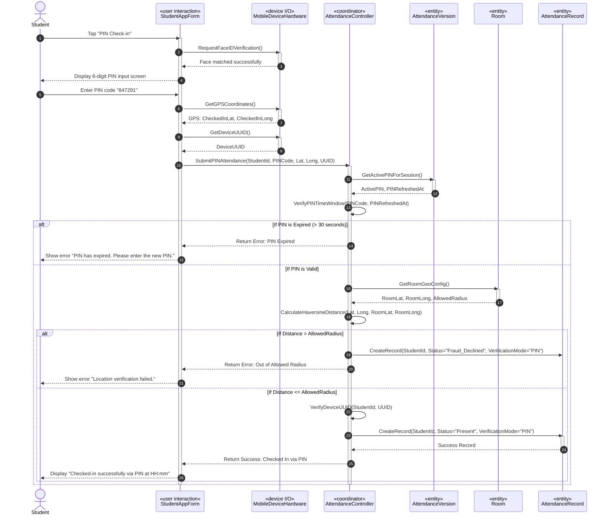
```mermaid
sequenceDiagram
    autonumber
    actor SV as Student
    participant SAF as «user interaction»<br>StudentAppForm
    participant MD as «device I/O»<br>MobileDeviceHardware
    participant AC as «coordinator»<br>AttendanceController
    participant V as «entity»<br>AttendanceVersion
    participant R as «entity»<br>Room
    participant AR as «entity»<br>AttendanceRecord

    SV->>SAF: Tap "PIN Check-in"
    activate SAF
    
    SAF->>MD: RequestFaceIDVerification()
    activate MD
    MD-->>SAF: Face matched successfully
    deactivate MD
    
    SAF-->>SV: Display 6-digit PIN input screen
    SV->>SAF: Enter PIN code "847291"
    
    SAF->>MD: GetGPSCoordinates()
    activate MD
    MD-->>SAF: GPS: CheckedInLat, CheckedInLong
    deactivate MD
    
    SAF->>MD: GetDeviceUUID()
    activate MD
    MD-->>SAF: DeviceUUID
    deactivate MD
    
    SAF->>AC: SubmitPINAttendance(StudentId, PINCode, Lat, Long, UUID)
    activate AC
    
    AC->>V: GetActivePINForSession()
    activate V
    V-->>AC: ActivePIN, PINRefreshedAt
    deactivate V
    AC->>AC: VerifyPINTimeWindow(PINCode, PINRefreshedAt)
    
    alt If PIN is Expired (> 30 seconds)
        AC-->>SAF: Return Error: PIN Expired
        SAF-->>SV: Show error "PIN has expired. Please enter the new PIN."
    else If PIN is Valid
        AC->>R: GetRoomGeoConfig()
        activate R
        R-->>AC: RoomLat, RoomLong, AllowedRadius
        deactivate R
        AC->>AC: CalculateHaversineDistance(Lat, Long, RoomLat, RoomLong)
        
        alt If Distance > AllowedRadius
            AC->>AR: CreateRecord(StudentId, Status="Fraud_Declined", VerificationMode="PIN")
            AC-->>SAF: Return Error: Out of Allowed Radius
            SAF-->>SV: Show error "Location verification failed."
        else If Distance <= AllowedRadius
            AC->>AC: VerifyDeviceUUID(StudentId, UUID)
            AC->>AR: CreateRecord(StudentId, Status="Present", VerificationMode="PIN")
            activate AR
            AR-->>AC: Success Record
            deactivate AR
            AC-->>SAF: Return Success: Checked In via PIN
            SAF-->>SV: Display "Checked-in successfully via PIN at HH:mm"
        end
    end
    deactivate AC
    deactivate SAF
```

#### **Figure II-5B: Communication Diagram for UC05 - PIN Fallback Check-in**
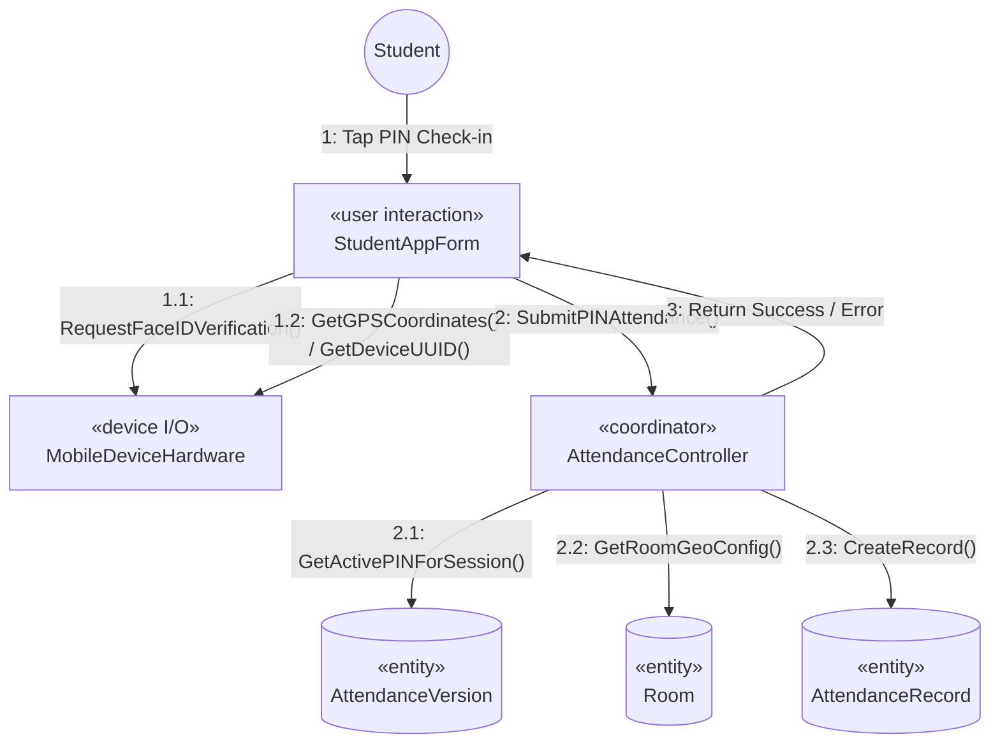
```mermaid
graph TD
    SV((Student))
    SAF["«user interaction»<br>StudentAppForm"]
    MD["«device I/O»<br>MobileDeviceHardware"]
    AC["«coordinator»<br>AttendanceController"]
    V[("«entity»<br>AttendanceVersion")]
    R[("«entity»<br>Room")]
    AR[("«entity»<br>AttendanceRecord")]

    SV -->|"1: Tap PIN Check-in"| SAF
    SAF -->|"1.1: RequestFaceIDVerification()"| MD
    SAF -->|"1.2: GetGPSCoordinates() / GetDeviceUUID()"| MD
    
    SAF -->|"2: SubmitPINAttendance()"| AC
    AC -->|"2.1: GetActivePINForSession()"| V
    AC -->|"2.2: GetRoomGeoConfig()"| R
    AC -->|"2.3: CreateRecord()"| AR
    AC -->|"3: Return Success / Error"| SAF
```

---

### **6. UC06: Activate Dynamic QR Session**

#### **Figure II-6A: Sequence Diagram for UC06 - Activate Dynamic QR Session**
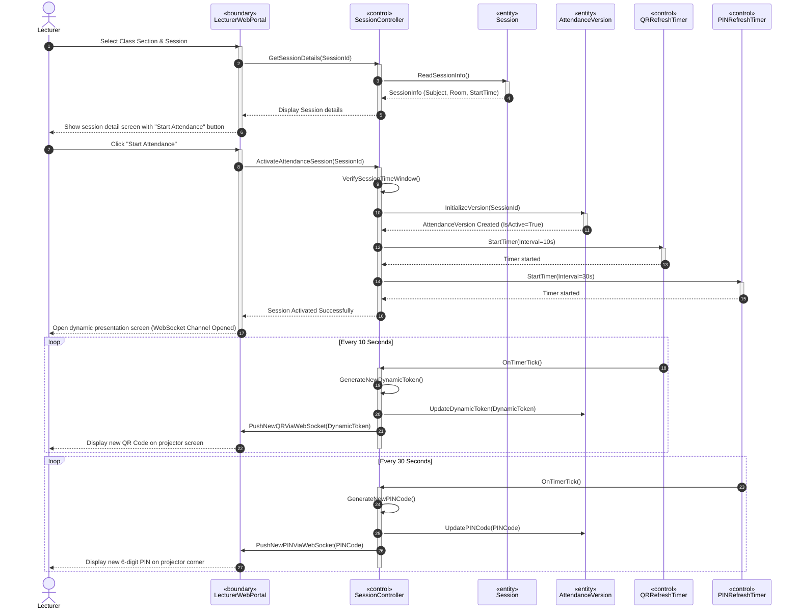
```mermaid
sequenceDiagram
    autonumber
    actor GV as Lecturer
    participant LWP as «boundary»<br>LecturerWebPortal
    participant SC as «control»<br>SessionController
    participant S as «entity»<br>Session
    participant V as «entity»<br>AttendanceVersion
    participant QT as «control»<br>QRRefreshTimer
    participant PT as «control»<br>PINRefreshTimer

    GV->>LWP: Select Class Section & Session
    activate LWP
    LWP->>SC: GetSessionDetails(SessionId)
    activate SC
    SC->>S: ReadSessionInfo()
    activate S
    S-->>SC: SessionInfo (Subject, Room, StartTime)
    deactivate S
    SC-->>LWP: Display Session details
    deactivate SC
    LWP-->>GV: Show session detail screen with "Start Attendance" button
    deactivate LWP

    GV->>LWP: Click "Start Attendance"
    activate LWP
    LWP->>SC: ActivateAttendanceSession(SessionId)
    activate SC
    
    SC->>SC: VerifySessionTimeWindow()
    
    SC->>V: InitializeVersion(SessionId)
    activate V
    V-->>SC: AttendanceVersion Created (IsActive=True)
    deactivate V
    
    SC->>QT: StartTimer(Interval=10s)
    activate QT
    QT-->>SC: Timer started
    deactivate QT
    
    SC->>PT: StartTimer(Interval=30s)
    activate PT
    PT-->>SC: Timer started
    deactivate PT
    
    SC-->>LWP: Session Activated Successfully
    deactivate SC
    LWP-->>GV: Open dynamic presentation screen (WebSocket Channel Opened)
    deactivate LWP

    loop Every 10 Seconds
        QT->>SC: OnTimerTick()
        activate SC
        SC->>SC: GenerateNewDynamicToken()
        SC->>V: UpdateDynamicToken(DynamicToken)
        SC->>LWP: PushNewQRViaWebSocket(DynamicToken)
        LWP-->>GV: Display new QR Code on projector screen
        deactivate SC
    end

    loop Every 30 Seconds
        PT->>SC: OnTimerTick()
        activate SC
        SC->>SC: GenerateNewPINCode()
        SC->>V: UpdatePINCode(PINCode)
        SC->>LWP: PushNewPINViaWebSocket(PINCode)
        LWP-->>GV: Display new 6-digit PIN on projector corner
        deactivate SC
    end
```

#### **Figure II-6B: Communication Diagram for UC06 - Activate Dynamic QR Session**
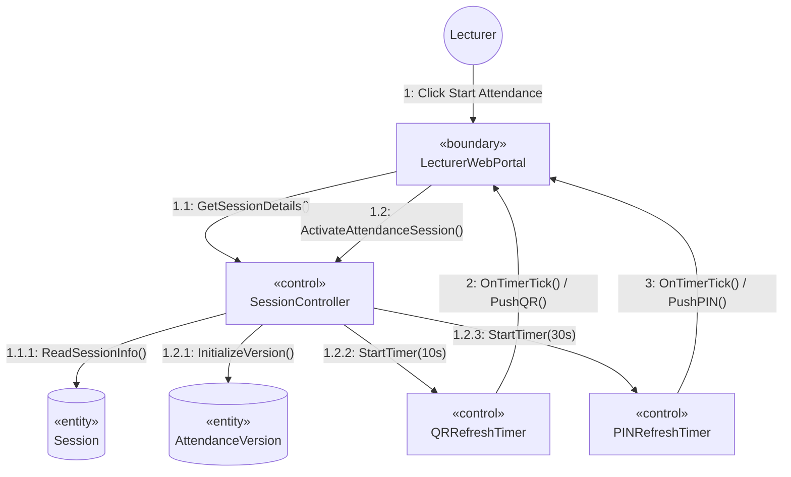
```mermaid
graph TD
    GV((Lecturer))
    LWP[«boundary»<br>LecturerWebPortal]
    SC[«control»<br>SessionController]
    S[(«entity»<br>Session)]
    V[(«entity»<br>AttendanceVersion)]
    QT[«control»<br>QRRefreshTimer]
    PT[«control»<br>PINRefreshTimer]

    GV -->|"1: Click Start Attendance"| LWP
    LWP -->|"1.1: GetSessionDetails()"| SC
    LWP -->|"1.2: ActivateAttendanceSession()"| SC
    
    SC -->|"1.1.1: ReadSessionInfo()"| S
    SC -->|"1.2.1: InitializeVersion()"| V
    SC -->|"1.2.2: StartTimer(10s)"| QT
    SC -->|"1.2.3: StartTimer(30s)"| PT
    
    QT -->|"2: OnTimerTick() / PushQR()"| LWP
    PT -->|"3: OnTimerTick() / PushPIN()"| LWP
```

---

### **7. UC07: Real-time Attendance Monitor**

#### **Figure II-7A: Sequence Diagram for UC07 - Real-time Attendance Monitor**
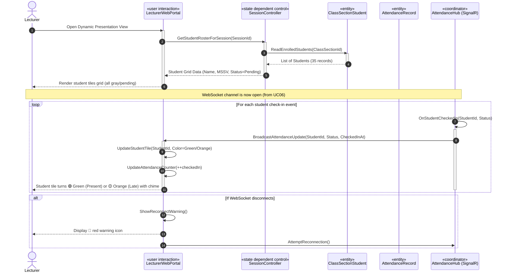
```mermaid
sequenceDiagram
    autonumber
    actor GV as Lecturer
    participant LWP as «user interaction»<br>LecturerWebPortal
    participant SC as «state dependent control»<br>SessionController
    participant CS as «entity»<br>ClassSectionStudent
    participant AR as «entity»<br>AttendanceRecord
    participant WSH as «coordinator»<br>AttendanceHub (SignalR)

    GV->>LWP: Open Dynamic Presentation View
    activate LWP
    LWP->>SC: GetStudentRosterForSession(SessionId)
    activate SC
    SC->>CS: ReadEnrolledStudents(ClassSectionId)
    activate CS
    CS-->>SC: List of Students (35 records)
    deactivate CS
    SC-->>LWP: Student Grid Data (Name, MSSV, Status=Pending)
    deactivate SC
    LWP-->>GV: Render student tiles grid (all gray/pending)
    deactivate LWP

    Note over GV, WSH: WebSocket channel is now open (from UC06)

    loop For each student check-in event
        WSH->>WSH: OnStudentCheckedIn(StudentId, Status)
        activate WSH
        WSH->>LWP: BroadcastAttendanceUpdate(StudentId, Status, CheckedInAt)
        activate LWP
        LWP->>LWP: UpdateStudentTile(StudentId, Color=Green/Orange)
        LWP->>LWP: UpdateAttendanceCounter(++checkedIn)
        LWP-->>GV: Student tile turns 🟢 Green (Present) or 🟡 Orange (Late) with chime
        deactivate LWP
        deactivate WSH
    end

    alt If WebSocket disconnects
        LWP->>LWP: ShowReconnectWarning()
        LWP-->>GV: Display 🔴 red warning icon
        LWP->>WSH: AttemptReconnection()
    end
```

#### **Figure II-7B: Communication Diagram for UC07 - Real-time Attendance Monitor**
```mermaid
graph TD
    GV((Lecturer))
    LWP["«user interaction»<br>LecturerWebPortal"]
    SC["«state dependent control»<br>SessionController"]
    CS[("«entity»<br>ClassSectionStudent")]
    AR[("«entity»<br>AttendanceRecord")]
    WSH["«coordinator»<br>AttendanceHub"]

    GV -->|"1: Open Presentation View"| LWP
    LWP -->|"1.1: GetStudentRosterForSession()"| SC
    SC -->|"1.1.1: ReadEnrolledStudents()"| CS
    
    WSH -->|"2: BroadcastAttendanceUpdate()"| LWP
    LWP -->|"2.1: UpdateStudentTile() / UpdateCounter()"| LWP
```

---

### **8. UC08: Manual Attendance Adjustment**

#### **Figure II-8A: Sequence Diagram for UC08 - Manual Attendance Adjustment**
```mermaid
sequenceDiagram
    autonumber
    actor GV as Lecturer
    participant LWP as «user interaction»<br>LecturerWebPortal
    participant AC as «coordinator»<br>AttendanceController
    participant AR as «entity»<br>AttendanceRecord
    participant SL as «entity»<br>SystemLog

    GV->>LWP: Click on student tile "SE170789"
    activate LWP
    LWP-->>GV: Show Adjustment Modal (current status, options)
    deactivate LWP

    GV->>LWP: Select "Present", enter reason: "Medical certificate", click "Save"
    activate LWP
    LWP->>AC: AdjustAttendanceStatus(RecordId, NewStatus="Present", Reason, LecturerId)
    activate AC
    
    AC->>AC: ValidateReasonNotEmpty(Reason)
    
    alt If Reason is empty
        AC-->>LWP: Return Error: Reason is mandatory
        LWP-->>GV: Highlight reason field with error
    else If Reason is provided
        AC->>AR: UpdateRecordStatus(RecordId, Status="Present", VerificationMode="Manual")
        activate AR
        AR-->>AC: Record Updated
        deactivate AR
        
        AC->>SL: WriteAuditLog(LecturerId, Action="Manual_Adjustment", RecordId, Reason)
        activate SL
        SL-->>AC: Log Written
        deactivate SL
        
        AC-->>LWP: Return Success: Status Updated
        LWP-->>GV: Close modal, update student tile to 🟢 Green, show confirmation
    end
    deactivate AC
    deactivate LWP
```

#### **Figure II-8B: Communication Diagram for UC08 - Manual Attendance Adjustment**
```mermaid
graph TD
    GV((Lecturer))
    LWP["«user interaction»<br>LecturerWebPortal"]
    AC["«coordinator»<br>AttendanceController"]
    AR[("«entity»<br>AttendanceRecord")]
    SL[("«entity»<br>SystemLog")]

    GV -->|"1: Click student / Select status / Save"| LWP
    LWP -->|"1.1: AdjustAttendanceStatus()"| AC
    AC -->|"1.1.1: UpdateRecordStatus()"| AR
    AC -->|"1.1.2: WriteAuditLog()"| SL
    AC -->|"2: Return Success"| LWP
```

---

### **9. UC09: Export Attendance Report**

#### **Figure II-9A: Sequence Diagram for UC09 - Export Attendance Report**
```mermaid
sequenceDiagram
    autonumber
    actor GV as Lecturer
    participant LWP as «user interaction»<br>LecturerWebPortal
    participant RC as «coordinator»<br>ReportController
    participant CSS as «entity»<br>ClassSectionStudent
    participant AR as «entity»<br>AttendanceRecord
    participant XLS as «coordinator»<br>ExcelReportGenerator
    participant SL as «entity»<br>SystemLog

    GV->>LWP: Click Export Excel for class section
    activate LWP
    LWP->>RC: ExportClassReport(ClassSectionId, Semester)
    activate RC
    RC->>CSS: ReadRoster(ClassSectionId)
    activate CSS
    CSS-->>RC: Student roster
    deactivate CSS
    RC->>AR: ReadSessionAttendanceRecords(ClassSectionId, Semester)
    activate AR
    AR-->>RC: Attendance matrix records
    deactivate AR

    alt Case A: No attendance records exist
        RC-->>LWP: Return error (No records found)
        LWP-->>GV: Show "No records available for export" alert
    else Case B: Records exist
        RC->>XLS: GenerateWorkbook(Roster, AttendanceRecords)
        activate XLS
        XLS-->>RC: .xlsx file binary stream
        deactivate XLS
        RC->>SL: WriteLog(LecturerId, Action="Export_Report", ClassSectionId)
        activate SL
        SL-->>RC: Log written
        deactivate SL
        RC-->>LWP: Return file stream
        deactivate RC
        LWP-->>GV: Download Excel report file
    end
    deactivate LWP
```

#### **Figure II-9B: Communication Diagram for UC09 - Export Attendance Report**
```mermaid
graph TD
    GV((Lecturer))
    LWP["«user interaction»<br>LecturerWebPortal"]
    RC["«coordinator»<br>ReportController"]
    CSS[("«entity»<br>ClassSectionStudent")]
    AR[("«entity»<br>AttendanceRecord")]
    XLS["«coordinator»<br>ExcelReportGenerator"]
    SL[("«entity»<br>SystemLog")]

    %% Connections and Messages
    GV -->|"1: Click Export Excel"| LWP
    LWP -->|"1.1: ExportClassReport()"| RC
    RC -->|"1.1.1: ReadRoster()"| CSS
    RC -->|"1.1.2: ReadSessionAttendanceRecords()"| AR
    RC -->|"1.1.3: GenerateWorkbook()"| XLS
    RC -->|"1.1.4: WriteLog()"| SL
    RC -->|"2: Return file stream"| LWP
```

---

### **10. UC10: Manage System Catalog**

#### **Figure II-10A: Sequence Diagram for UC10 - Manage System Catalog**
```mermaid
sequenceDiagram
    autonumber
    actor AD as Admin
    participant AWP as «user interaction»<br>AdminWebPortal
    participant CC as «coordinator»<br>CatalogController
    participant ACC as «entity»<br>Account
    participant ST as «entity»<br>Student
    participant LT as «entity»<br>Lecturer
    participant SUB as «entity»<br>Subject
    participant CLS as «entity»<br>ClassSection
    participant SL as «entity»<br>SystemLog

    AD->>AWP: Open catalog screen (e.g. Students)
    activate AWP
    AWP->>CC: GetCatalog(catalogType)
    activate CC
    CC-->>AWP: Return list of rows
    deactivate CC
    AWP-->>AD: Render catalog table

    alt Case A: Add new record
        AD->>AWP: Input details and click "Save"
        AWP->>CC: SaveCatalogChange(catalogType, payload)
        activate CC
        CC->>CC: ValidatePayloadFields()
        alt Invalid fields
            CC-->>AWP: Return validation error
            AWP-->>AD: Display error highlighting fields
        else Valid fields
            alt Role = Student
                CC->>ACC: CreateAccount(payload)
                CC->>ST: CreateStudent(payload)
            else Role = Lecturer
                CC->>ACC: CreateAccount(payload)
                CC->>LT: CreateLecturer(payload)
            else Type = Subject
                CC->>SUB: CreateSubject(payload)
            else Type = ClassSection
                CC->>CLS: CreateClassSection(payload)
            end
            CC->>SL: WriteLog(AdminId, Action="Catalog_Change")
            activate SL
            SL-->>CC: Log written
            deactivate SL
            CC-->>AWP: Save successful
            deactivate CC
            AWP-->>AD: Refresh table with success message
        end
    end
    deactivate AWP
```

#### **Figure II-10B: Communication Diagram for UC10 - Manage System Catalog**
```mermaid
graph TD
    AD((Admin))
    AWP["«user interaction»<br>AdminWebPortal"]
    CC["«coordinator»<br>CatalogController"]
    ACC[("«entity»<br>Account")]
    ST[("«entity»<br>Student")]
    LT[("«entity»<br>Lecturer")]
    SUB[("«entity»<br>Subject")]
    CLS[("«entity»<br>ClassSection")]
    SL[("«entity»<br>SystemLog")]

    %% Connections and Messages
    AD -->|"1: Manage catalog"| AWP
    AWP -->|"1.1: GetCatalog() / SaveCatalogChange()"| CC
    CC -->|"1.1.1: CreateAccount() / CreateStudent()"| ST
    CC -->|"1.1.2: CreateLecturer()"| LT
    CC -->|"1.1.3: CreateSubject()"| SUB
    CC -->|"1.1.4: CreateClassSection()"| CLS
    CC -->|"1.1.5: WriteLog()"| SL
    CC -->|"2: Return success/refresh"| AWP
```

---

### **11. UC11: Configure Room Coordinates & Allowed Radius**

#### **Figure II-11A: Sequence Diagram for UC11 - Configure Room Coordinates**
```mermaid
sequenceDiagram
    autonumber
    actor AD as Admin
    participant AWP as «boundary»<br>AdminWebPortal
    participant RCC as «control»<br>RoomConfigurationController
    participant R as «entity»<br>Room
    participant SL as «entity»<br>SystemLog

    AD->>AWP: Click "Room Management"
    activate AWP
    AWP->>RCC: GetRoomsList()
    activate RCC
    RCC->>R: ReadAllRooms()
    activate R
    R-->>RCC: List of Rooms
    deactivate R
    RCC-->>AWP: Display room table
    deactivate RCC
    AWP-->>AD: Show room table with config buttons
    deactivate AWP

    AD->>AWP: Click "Edit Coordinates" for specific Room
    activate AWP
    AWP-->>AD: Open RoomConfigForm with integrated satellite map
    deactivate AWP

    alt Option A: Click on satellite map
        AD->>AWP: Click exact classroom location on map
        activate AWP
        AWP->>AWP: ExtractLatLongFromMapClick()
        AWP-->>AD: Automatically populate Lat & Long fields
        deactivate AWP
    else Option B: Get current GPS (Mobile device at site)
        AD->>AWP: Tap "Get Current GPS Location"
        activate AWP
        AWP->>AWP: RequestBrowserGeoLocationAPI()
        AWP-->>AD: Populate Lat & Long fields with hardware coordinates
        deactivate AWP
    end

    AD->>AWP: Enter "Allowed Radius" (e.g. 20m) & click "Save Config"
    activate AWP
    AWP->>RCC: SaveGeoConfiguration(RoomId, Latitude, Longitude, AllowedRadius)
    activate RCC
    
    RCC->>RCC: ValidateCoordinates(Latitude, Longitude)
    RCC->>RCC: ValidateRadius(AllowedRadius)
    
    alt If coordinates or radius are invalid
        RCC-->>AWP: Return Error: Invalid Geo-data
        AWP-->>AD: Highlight error fields & request correction
    else If configuration is valid
        RCC->>R: UpdateGeoConfig(Latitude, Longitude, AllowedRadius)
        activate R
        R-->>RCC: Update Success
        deactivate R
        
        RCC->>SL: WriteLog(AdminId, Action="Configure_Room", RoomId)
        
        RCC-->>AWP: Return Success: Configurations Saved
        AWP-->>AD: Show confirmation popup & return to room table
    end
    deactivate RCC
    deactivate AWP
```

#### **Figure II-11B: Communication Diagram for UC11 - Configure Room Coordinates**
```mermaid
graph TD
    AD((Admin))
    AWP[«boundary»<br>AdminWebPortal]
    RCC[«control»<br>RoomConfigurationController]
    R[(«entity»<br>Room)]
    SL[(«entity»<br>SystemLog)]

    %% Connections and Messages
    AD -->|"1: Edit Coordinates"| AWP
    AD -->|"2: Click Save Config"| AWP
    AWP -->|"1.1: GetRoomsList()"| RCC
    AWP -->|"2.1: SaveGeoConfiguration()"| RCC
    
    RCC -->|"2.1.1: UpdateGeoConfig()"| R
    RCC -->|"2.1.2: WriteLog()"| SL
    RCC -->|"3: Return Success popup"| AWP
```

---

## **II.2 State diagrams**

In the AFAS system, there are three primary objects whose behaviors and properties change based on their state: `AttendanceVersion` (the active check-in session), `AttendanceRecord` (the student's attendance result), and `Student` (specifically regarding Device Binding state).

---

### **1. Attendance Session State (AttendanceVersion)**
Describes the lifecycle of an attendance QR session started by a lecturer in the classroom.

#### **Figure II-9: State diagram for Attendance Session**
```mermaid
stateDiagram-v2
    [*] --> Inactive : Session created in schedule
    Inactive --> Active_QR : Lecturer clicks "Start Attendance"
    
    state Active_QR {
        [*] --> QR_Active : QR & PIN displayed
        QR_Active --> QR_Refreshed : Timer ticks (10s)
        QR_Refreshed --> QR_Active : Generate new dynamic token
        
        QR_Active --> PIN_Refreshed : Timer ticks (30s)
        PIN_Refreshed --> QR_Active : Generate new PIN code
    }
    
    Active_QR --> Suspended : Network outage detected (Timer Paused)
    Suspended --> Active_QR : Network restored / Lecturer clicks "Resume"
    
    Active_QR --> Active_PIN_Only : Lecturer closes QR scanner / opens PIN manually
    Active_PIN_Only --> Closed : Dynamic timer expires / Session close clicked
    
    Active_QR --> Closed : Lecturer clicks "Stop Attendance"
    Suspended --> Closed : Class scheduled time ends
    
    Closed --> [*] : Attendance finalized & Report exported
```

---

### **2. Attendance Record State (AttendanceRecord)**
Describes the lifecycle of a student's check-in telemetry audit process when submitted to the server.

#### **Figure II-10: State diagram for Attendance Record**
```mermaid
stateDiagram-v2
    [*] --> Submitted : Student sends check-in telemetry
    
    Submitted --> Verifying_Token : Server matches Dynamic QR Token (Layer 1)
    
    Verifying_Token --> Failed_Expired : Token older than 15s
    Failed_Expired --> [*] : Rejection logged
    
    Verifying_Token --> Verifying_Location : Token is valid
    
    Verifying_Location --> Verifying_Device : GPS Distance < AllowedRadius (Layer 2)
    Verifying_Location --> Failed_Location_Fraud : GPS Distance > AllowedRadius
    Failed_Location_Fraud --> [*] : Saved as "Fraud_Declined" in DB
    
    Verifying_Device --> Verifying_Biometrics : DeviceUUID matches bound device (Layer 3)
    Verifying_Device --> Failed_Device_Mismatch : DeviceUUID belongs to another student
    Failed_Device_Mismatch --> [*] : Rejection logged
    
    Verifying_Biometrics --> Checked_In_Present : Face ID match score > 85%
    Verifying_Biometrics --> Failed_Face_Mismatch : Face ID matching fails
    Failed_Face_Mismatch --> [*] : Rejection logged
    
    Checked_In_Present --> Checked_In_Late : Checked-in time > Class start time
    
    Checked_In_Present --> [*] : Saved as "Present" / Selfie image deleted
    Checked_In_Late --> [*] : Saved as "Late" / Selfie image deleted
```

---

### **3. Student Device Binding State**
Describes the lifecycle of a student account's hardware physical binding constraint.

#### **Figure II-11: State diagram for Device Binding**
```mermaid
stateDiagram-v2
    [*] --> Unbound : Account created by Admin
    Unbound --> Bound : First login on App (UUID registered)
    
    Bound --> Reset_Requested : Student clicks "Reset Device" on new phone
    Reset_Requested --> Bound : OTP validation fails 3 times (Lockout 24h)
    
    Reset_Requested --> Unbound : OTP code verified successfully via school email
    Bound --> Admin_Released : Admin manually releases binding (special request)
    Admin_Released --> Unbound : Device UUID cleared from profile
```

---

## **III. Design specification**

## **III.0 Analysis-to-Design Transformation Matrix**

This section details how the Platform-Independent analysis objects (Boundary, Control, Entity) are mapped onto concrete Platform-Specific design-level abstractions under the Clean Architecture framework.

### **BCE Analysis Object to Design-Level Component Mapping**

The following matrix defines how boundary, control, and entity elements are realized in the design, specifying target layers and design class patterns:

| **Analysis Object** | **BCE Category** | **Target Design Component / Class** | **Target Design Layer** | **Realization Strategy & Design Pattern** |
| :--- | :--- | :--- | :--- | :--- |
| `LoginForm`, `GoogleAuthGateway` | `«boundary»` | `AccountController`, `AuthenticationService` | Presentation / Application | Standard Web API Controller using JWT token generation and external Google SDK integrations. |
| `StudentAppForm`, `LecturerWebPortal`, `AdminWebPortal` | `«boundary»` | `AppClient`, `WebClient` | User Interface | React Native App & Next.js SPA utilizing Axios/Fetch API to call JSON endpoints. |
| `MobileDeviceHardware` | `«boundary»` | `DeviceTelemetryService`, `BiometricAuthManager` | Client Infrastructure | Native hardware wrappers using Expo LocalAuthentication and GeoLocation APIs. |
| `SchoolWifiGateway` | `«boundary»` | `SchoolWifiGateway` | Client Infrastructure | Reads WifiSSID and client gateway IP to append to check-in payload. |
| `AuthenticationController` | `«control»` | `AuthenticationService`, `UserManager` | Application | Business logic containing password hashing (BCrypt) and user profile validation. |
| `DeviceBindingController` | `«control»` | `DeviceBindingService` | Application | Checks binding database constraints and coordinates email OTP triggers. |
| `AttendanceController` | `«control»` | `AttendanceService`, `AntiFraud_Validator_Engine` | Application | Entrypoint coordinator validating GPS range, QR/PIN keys, and binding states. |
| `SessionController` | `«control»` | `SessionService` | Application | Manages session setup, start/stop timers, and initializes attendance version records. |
| `ReportController`, `ExcelReportGenerator` | `«control»` | `ReportService`, `ClosedXMLReportGenerator` | Application / Infrastructure | Aggregates database queries and streams output binary array using ClosedXML. |
| `CatalogController` | `«control»` | `CatalogService` | Application | Orchestrates basic catalog CRUD actions and handles Excel roster seeding. |
| `RoomConfigurationController` | `«control»` | `RoomService` | Application | Manages classroom metadata and coordinates allowed radius settings. |
| `QRRefreshTimer`, `PINRefreshTimer` | `«control»` | `RedisCacheManager`, `BackgroundWorker` | Infrastructure | Scheduled Redis cache expire-keys triggered by .NET IHostedService. |
| `AttendanceHub` | `«control»` | `AttendanceHub`, `SignalRRealtimeNotifier` | Presentation / Infrastructure | SignalR WebSocket hub maintaining active connection state and broadcasting check-in events. |
| `Account`, `Student`, `Lecturer` | `«entity»` | `Account`, `Student`, `Lecturer` | Domain (Entities) | Persistent domain model classes containing raw business validation rules. |
| `Subject`, `ClassSection`, `ClassSectionStudent`, `Session` | `«entity»` | `Subject`, `ClassSection`, `ClassSectionStudent`, `Session` | Domain (Entities) | Pure domain representations of structural curricular metadata. |
| `Room` | `«entity»` | `Room` | Domain (Entities) | Persistent entity representing geofence target coordinates. |
| `AttendanceVersion` | `«entity»` | `AttendanceVersion`, `ActiveSessionCache` | Domain / Infrastructure | Holds currently active QR/PIN tokens inside SQL or in-memory Redis cache. |
| `AttendanceRecord` | `«entity»` | `AttendanceRecord` | Domain (Entities) | Stores transactional record containing status, telemetry evidence, and timestamps. |
| `SystemLog` | `«entity»` | `SystemLog` | Domain (Entities) | Stores audit trail of security adjustments and system operations. |

---

### **III.0.1 Use Case to Design Realization Matrix**

This matrix establishes the direct traceability between the requirement use cases (Section I.6.2) and the corresponding controllers, services, repositories, and UI views that realize them in the design:

| **Use Case ID & Name** | **UI / Boundary Component** | **Design Controller** | **Design Service / Engine** | **Design Repository / DB Access** | **WebSocket / Push Component** |
| :--- | :--- | :--- | :--- | :--- | :--- |
| **UC01: Login** | `LoginForm`, Google SDK UI | `AccountController` | `AuthenticationService` | `IAccountRepository` | None |
| **UC02: Register Device UUID** | `StudentAppForm` (Mobile) | `DeviceBindingController` | `DeviceBindingService`, `EmailOtpService` | `IStudentRepository`, `ISystemLogRepository` | None |
| **UC03: Scan Dynamic QR** | `StudentAppScanner` (Camera/GPS) | `AttendanceController` | `AttendanceService`, `AntiFraud_Validator_Engine` | `IAttendanceRecordRepository`, `IRoomRepository` | `AttendanceHub` (SignalR client update) |
| **UC04: View History** | `StudentAppHistory` (Calendar) | `AttendanceController` | `AttendanceService` | `IAttendanceRecordRepository` | None |
| **UC05: PIN Fallback** | `StudentAppPinForm` (Keypad) | `AttendanceController` | `AttendanceService`, `AntiFraud_Validator_Engine` | `IAttendanceRecordRepository`, `IRoomRepository` | None |
| **UC06: Activate QR Session** | `LecturerWebPresentation` | `SessionController` | `SessionService`, `RedisCacheManager` | `ISessionRepository`, `IAttendanceVersionRepository` | `AttendanceHub` (Broadcast new QR) |
| **UC07: Real-time Monitor** | `LecturerWebMonitorGrid` | `SessionController` | `SessionService` | `IAttendanceRecordRepository`, `IClassSectionRepository` | `AttendanceHub` (Subscribe to live check-ins) |
| **UC08: Manual Adjust** | `LecturerWebAdjustmentModal` | `AttendanceController` | `AttendanceService` | `IAttendanceRecordRepository`, `ISystemLogRepository` | `AttendanceHub` (Broadcast status updates) |
| **UC09: Export Report** | `LecturerWebExportButton` | `ReportController` | `ReportService`, `ExcelReportGenerator` | `IAttendanceRecordRepository`, `IClassSectionRepository` | None |
| **UC10: Manage Catalog** | `AdminWebCatalogGrid` | `CatalogController` | `CatalogService` | `IStudentRepository`, `ILecturerRepository`, `ISubjectRepository` | None |
| **UC11: Configure Room** | `AdminWebRoomConfigForm` | `RoomController` | `RoomService` | `IRoomRepository`, `ISystemLogRepository` | None |

---

### **III.0.2 NFR Realization and Verification Matrix**

The non-functional requirements (Section I.4) are mapped to specific engineering designs and verified via precise testing strategies as detailed below:

| **NFR ID** | **Concern** | **Target Metric** | **Engineering Design Realization** | **Verification Test Case / Strategy** |
| :--- | :--- | :--- | :--- | :--- |
| **NFR-01** | High Concurrency | Support 100+ concurrent scans per second per session without database locks. | - Read-heavy dynamic tokens are cached and validated in **Redis** in-memory store.<br>- Async-await non-blocking database writes in .NET API.<br>- Database index on `attendance_records(session_id, student_id)`. | `TC-NFR-001` (JMeter Load Test executing 1000 requests/sec, validating error rate < 0.5% and response time < 500ms). |
| **NFR-02** | Geofence Precision | Support geo-boundary checks with coordinate deviation margins up to 20m. | - Implement **Haversine formula** using double-precision floats on the API server.<br>- Database stores customizable `allowed_radius` in `rooms` table to accommodate indoor GPS drift. | `TC-NFR-002` (Unit tests verifying distance calculations for edge locations like 19.9m, 20.1m, and 50m). |
| **NFR-03** | Usability / Security | Check-in scan completes in < 5 seconds with automatic photo purge. | - Mobile app requests native local biometric authentication (Face ID/Fingerprint).<br>- Local image files are purged immediately from storage upon verification request termination. | `TC-NFR-003` (Integration test checking client execution timers and confirming temporary storage directory is empty after check-in). |
| **NFR-04** | Solution Maintainability | Clean architecture layering with clean DB decoupling. | - Strict dependency inversion (.NET Core Web API).<br>- Decouple domain models from database models using mapping classes.<br>- Strict separation of concerns (boundary controllers vs domain service engines). | `TC-UNIT-001` through `TC-UNIT-003` (Automated CI/CD build scripts checking layer dependencies and structural unit tests). |

---

## **III.1 Integrated Communication Diagrams**

To transition from analysis to design, we integrate the separate communication diagrams developed during the analysis phase into a single, unified view. This synthesis helps identify the complete set of dependencies and methods required on each class to implement the system.

#### **Figure III-1: Integrated Communication Diagram**
```mermaid
graph TD
    %% Actors
    AD((Admin))
    GV((Lecturer))
    SV((Student))

    %% Boundary Classes (Web & Mobile Ports)
    AWP["«boundary»<br>AdminWebPortal"]
    LWP["«boundary»<br>LecturerWebPortal"]
    SAF["«boundary»<br>StudentAppForm"]

    %% Control Classes (Application Services)
    RCC["«control»<br>RoomConfigurationController"]
    SC["«control»<br>SessionController"]
    AC["«control»<br>AttendanceController"]

    %% Entity Classes (Domain Core)
    R[("«entity»<br>Room")]
    S[("«entity»<br>Session")]
    V[("«entity»<br>AttendanceVersion")]
    AR[("«entity»<br>AttendanceRecord")]

    %% Actor to Boundary Interactions
    AD -->|"1: Edit Room / 2: Save Geo Config"| AWP
    GV -->|"1: Get Session Details / 2: Click Start Attendance"| LWP
    SV -->|"1: Trigger Face ID / 2: Scan QR / 3: Check-in"| SAF

    %% Boundary to Control API Calls
    AWP -->|"1.1: GetRoomsList() / 2.1: SaveGeoConfiguration()"| RCC
    LWP -->|"1.1: GetSessionDetails() / 2.1: ActivateAttendanceSession()"| SC
    SAF -->|"3.1: SubmitAttendance()"| AC

    %% Control to Entity operations
    RCC -->|"2.2: UpdateGeoConfig()"| R
    
    SC -->|"1.2: ReadSessionInfo()"| S
    SC -->|"2.2: InitializeVersion() / 2.3: UpdateDynamicToken()"| V
    
    AC -->|"3.2: GetActiveTokenForSession()"| V
    AC -->|"3.3: GetRoomGeoConfig()"| R
    AC -->|"3.4: CreateRecord()"| AR
```

### **Transition from Analysis-level to Design-level Specification**
Analysis-level models decompose the problem domain using generic abstractions (`«boundary»`, `«control»`, `«entity»`) without considering technology stacks. In contrast, Design-level models specify the concrete architectural implementation:

1.  **Splitting Lớp Thực Thể (Entity Classes):** Every entity class in the analysis model is split into two distinct structures during design:
    *   **Data Abstraction Class:** Encapsulates the clean business attributes in the Domain layer (e.g., `Product`, `Student`, `AttendanceRecord` C# objects).
    *   **Database Wrapper Class (Repository Pattern):** Handles persistence logic (CRUD) using the ORM (Entity Framework Core) connected to PostgreSQL. It isolates the Domain layer from raw database access.
2.  **Introduction of Interfaces & Dependency Injection:** To adhere to the Dependency Inversion Principle (DIP), services communicate via abstract interfaces (`IRoomRepository`, `IAttendanceService`) rather than concrete classes. These dependencies are resolved dynamically via the C# built-in Dependency Injection container.
3.  **Boundary to Controllers Mapping:** Boundary objects map to WebAPI REST controllers (Presentation layer) or SignalR Hubs for WebSockets, managing JSON serialization, request validation, and HTTP response codes.

---

## **III.2 System High-Level Design**

The AFAS system is designed using a **Clean Architecture** (4-layer concentric system), ensuring ease of maintenance (**NF-04**) and loose coupling.

### **2.1 Static View (Kiến Trúc Phân Tầng)**
```mermaid
graph TD
    subgraph Presentation_Layer [Presentation Layer / WebAPI]
        Controllers[API Controllers]
        SignalRHubs[SignalR WebSockets Hubs]
    end

    subgraph Application_Layer [Application Layer]
        Services[AttendanceService, SessionService, AuthService]
        Interfaces_App[IUseCaseInterfaces, DtoClasses]
    end

    subgraph Domain_Layer [Domain Layer - LÕI]
        Entities[Student, Session, Room, AttendanceRecord]
        Interfaces_Domain[IStudentRepository, IAttendanceRepository]
    end

    subgraph Infrastructure_Layer [Infrastructure Layer]
        EFCore[PostgreSQL Persistence via EF Core]
        RedisCache[Redis Cache Manager]
        GoogleAuth[Google OAuth Provider]
    end

    Presentation_Layer --> Application_Layer
    Infrastructure_Layer --> Domain_Layer
    Infrastructure_Layer --> Application_Layer
    Application_Layer --> Domain_Layer
```

### **2.2 Dynamic View (Luồng Gọi Xuyên Tầng)**
```mermaid
sequenceDiagram
    autonumber
    actor SV as Student App
    participant C as Presentation: AttendanceController
    participant S as Application: AttendanceService
    participant R as Domain: IAttendanceRepository
    participant DB as Infrastructure: EFCorePostgreSQL

    SV->>C: POST /api/attendance/submit (Payload)
    activate C
    C->>S: SubmitAttendance(StudentId, DynamicToken, GPS, IP, UUID)
    activate S
    S->>S: RunAntiFraudValidation(GPS, DynamicToken, UUID)
    S->>R: SaveRecord(AttendanceRecord)
    activate R
    R->>DB: SaveChangesAsync()
    activate DB
    DB-->>R: Transaction committed
    deactivate DB
    R-->>S: Record Saved Successfully
    deactivate R
    S-->>C: Return ProcessResult (Success)
    deactivate S
    C-->>SV: HTTP 200 OK (Checked-in successfully)
    deactivate C
```

### **2.3 Deployment View (Figure III-2: Sơ đồ Triển khai)**
```mermaid
flowchart TB
    %% Clients
    subgraph User_Devices [User Devices]
        Mobile_App[Mobile Phone <br> React Native App]
        Web_Browser[Lecturer & Admin PC <br> Next.js Portal]
    end

    %% Network and Hosting
    subgraph Cloud_Hosting [Docker Containers Cluster]
        Nginx[Nginx Reverse Proxy / Load Balancer]
        
        subgraph WebAPI_Pod_1 [API Node 1]
            API_1[.NET 8 WebAPI Container 1]
        end
        subgraph WebAPI_Pod_2 [API Node 2]
            API_2[.NET 8 WebAPI Container 2]
        end
        
        subgraph Caching_Node [Caching Store]
            Redis[Redis Cluster <br> In-Memory Token Cache]
        end
        
        subgraph Persistent_Node [Persistent Storage]
            Postgres[PostgreSQL DB Server]
        end
    end

    %% Network Connections
    Mobile_App -->|HTTPS / Port 443| Nginx
    Web_Browser -->|WSS / Port 443| Nginx
    
    Nginx -->|Round Robin HTTP| API_1
    Nginx -->|Round Robin HTTP| API_2
    
    API_1 -->|Port 6379| Redis
    API_2 -->|Port 6379| Redis
    
    API_1 -->|Port 5432| Postgres
    API_2 -->|Port 5432| Postgres
```

---

## **III.3 Component and Package Diagram**

The static structural organization of source code packages and structural interaction interfaces.

### **3.1 Package Diagram (Figure III-3)**
```mermaid
graph TD
    subgraph Solution_AFAS [Solution: AFAS]
        subgraph Domain_Pkg [Package: AFAS.Domain]
            Entities[Entities]
            Exceptions[Domain Exceptions]
            DomainInterfaces[IRepositories, IDomainServices]
        end

        subgraph Application_Pkg [Package: AFAS.Application]
            Services[Application Services]
            DTOs[Data Transfer Objects]
            AppInterfaces[ISessionNotifier, IIdentityService]
        end

        subgraph Infrastructure_Pkg [Package: AFAS.Infrastructure]
            Persistence[Persistence / EF Core DBContext]
            Caching[Caching / Redis Persistent Store]
            Identity[Identity Providers]
        end

        subgraph Presentation_Pkg [Package: AFAS.Presentation]
            Controllers[API Controllers]
            Hubs[SignalR Realtime Hubs]
            Middleware[Custom Exception Middleware]
        end
    end

    Presentation_Pkg --> Application_Pkg
    Presentation_Pkg --> Domain_Pkg
    
    Application_Pkg --> Domain_Pkg
    
    Infrastructure_Pkg --> Application_Pkg
    Infrastructure_Pkg --> Domain_Pkg
```

### **3.2 Component Diagram (Figure III-4)**
```mermaid
classDiagram
    class Mobile_Application {
        <<Component>>
        -Uses Camera API
        -Uses Location API
    }

    class Web_Portal_Application {
        <<Component>>
        -Render Projector QR
        -Render Lecturer Dashboard
    }

    class Attendance_API_Gateway {
        <<Component>>
        +Expose Restful Endpoints
        +Expose WebSocket SignalR
    }

    class AntiFraud_Validator_Engine {
        <<Component>>
        +VerifyGPSDistance()
        +VerifyQRTime()
        +CheckDeviceMapping()
    }

    class Cache_CacheManager {
        <<Component>>
        +SetCachedToken()
        +GetCachedToken()
    }

    class Database_Persistence {
        <<Component>>
        +SaveAttendanceRecord()
        +ReadRoomCoordinates()
    }

    Mobile_Application ..> Attendance_API_Gateway : [HTTPs / POST] Gửi yêu cầu điểm danh
    Web_Portal_Application ..> Attendance_API_Gateway : [WebSocket] Kết nối SignalR cập nhật QR
    
    Attendance_API_Gateway --> AntiFraud_Validator_Engine : Gọi bộ xử lý xác thực
    AntiFraud_Validator_Engine ..> Cache_CacheManager : [Required Interface] Đọc/ghi Token động trên Redis
    AntiFraud_Validator_Engine ..> Database_Persistence : [Required Interface] Lưu bản ghi / Đọc tọa độ phòng
```

### **Decomposition Criteria and Justification**
We decompose the AFAS architecture into packages and components based on three core software design criteria:
1.  **Single Responsibility Principle (SRP):** Each package has a distinct reason to change. `AFAS.Domain` changes only when core business rules change. `AFAS.Infrastructure` changes only when third-party libraries or DB drivers change.
2.  **High Cohesion (Communicational & Functional Cohesion):** Classes that work together to fulfill a single cohesive purpose are grouped together (e.g., all geofencing and dynamic token validations are encapsulated within `AntiFraud_Validator_Engine`).
3.  **Low Coupling via Dependency Inversion:** Components depend only on abstract interfaces rather than concrete subclasses. For instance, the validator engine calls `ICacheManager` to fetch tokens, meaning we can swap out the Redis cache component for an in-memory cache without changing the validation logic.

---

## **III.4 Detail Design**

The detailed design classes are mapped directly from the analysis model, implementing concrete properties, public methods, and visibility specifiers.

#### **Figure III-5: Detailed Design Class Diagram**
```mermaid
classDiagram
    %% --- PRESENTATION LAYER ---
    class AttendanceController {
        <<Boundary / WebAPI>>
        -IAttendanceService _attendanceService
        +SubmitAttendance(AttendanceDto dto) Task~IActionResult~
        +GetStudentHistory(string studentId) Task~IActionResult~
    }

    class AccountController {
        <<Boundary / WebAPI>>
        -IAuthenticationService _authService
        +LoginCredentials(LoginDto dto) Task~IActionResult~
        +LoginGoogle(GoogleLoginDto dto) Task~IActionResult~
    }

    class RoomController {
        <<Boundary / WebAPI>>
        -IRoomService _roomService
        +SaveRoomConfiguration(RoomDto dto) Task~IActionResult~
        +GetRooms() Task~IActionResult~
    }

    class ReportController {
        <<Boundary / WebAPI>>
        -IReportService _reportService
        +ExportClassReport(string classId) Task~IActionResult~
    }

    %% --- APPLICATION LAYER ---
    class IAttendanceService {
        <<Interface / Application>>
        +ProcessCheckin(AttendanceDto dto) Task~Result~CheckinResultDto~~
        +GetHistory(string studentId) Task~List~AttendanceRecordDto~~
    }

    class AttendanceService {
        <<Control / Application>>
        -IAttendanceRepository _attendanceRepo
        -IRoomRepository _roomRepo
        -ICacheManager _cacheManager
        -IRealtimeNotifier _notifier
        +ProcessCheckin(AttendanceDto dto) Task~Result~CheckinResultDto~~
        +GetHistory(string studentId) Task~List~AttendanceRecordDto~~
        -CalculateDistance(double lat1, double lon1, double lat2, double lon2) double
    }

    class IAuthenticationService {
        <<Interface / Application>>
        +AuthenticateCredentials(string username, string password) Task~Result~string~~
        +AuthenticateGoogle(string idToken) Task~Result~string~~
    }

    class AuthenticationService {
        <<Control / Application>>
        -IAccountRepository _accountRepo
        -IStudentRepository _studentRepo
        +AuthenticateCredentials(string username, string password) Task~Result~string~~
        +AuthenticateGoogle(string idToken) Task~Result~string~~
    }

    class IRoomService {
        <<Interface / Application>>
        +UpdateRoomGeo(RoomDto dto) Task~Result~bool~~
        +GetAllRooms() Task~List~RoomDto~~
    }

    class RoomService {
        <<Control / Application>>
        -IRoomRepository _roomRepo
        +UpdateRoomGeo(RoomDto dto) Task~Result~bool~~
        +GetAllRooms() Task~List~RoomDto~~
    }

    class IReportService {
        <<Interface / Application>>
        +GenerateExcelReport(string classId) Task~byte[]~
    }

    class ReportService {
        <<Control / Application>>
        -IAttendanceRepository _attendanceRepo
        -IExcelGenerator _excelGenerator
        +GenerateExcelReport(string classId) Task~byte[]~
    }

    %% --- DOMAIN CORE LAYER ---
    class AttendanceRecord {
        <<Domain Entity>>
        +string RecordId
        +string StudentId
        +string SessionId
        +DateTime CheckedInAt
        +double CheckedInLat
        +double CheckedInLong
        +double Distance
        +string WifiSSID
        +string PublicIP
        +string DeviceUUID
        +string SelfiePath
        +string Status
        +string VerificationMode
    }

    class Room {
        <<Domain Entity>>
        +string RoomId
        +string RoomName
        +double Latitude
        +double Longitude
        +double AllowedRadius
    }

    class Account {
        <<Domain Entity>>
        +string Id
        +string Email
        +string PasswordHash
        +string FullName
        +string Role
    }

    %% --- INFRASTRUCTURE LAYOUT ---
    class IAttendanceRepository {
        <<Interface / Domain>>
        +GetByIdAsync(string id) Task~AttendanceRecord~
        +AddAsync(AttendanceRecord entity) Task
        +GetStudentProfileAsync(string studentId) Task~Student~
        +GetBySessionIdAsync(string sessionId) Task~List~AttendanceRecord~~
    }

    class IRoomRepository {
        <<Interface / Domain>>
        +GetRoomGeoConfigAsync(string sessionId) Task~RoomGeoConfig~
        +GetAllRoomsAsync() Task~List~Room~~
        +UpdateGeoConfigAsync(Room room) Task
    }

    class ISessionRepository {
        <<Interface / Domain>>
        +GetSessionByIdAsync(string sessionId) Task~Session~
        +GetActiveSessionForLecturerAsync(string lecturerId) Task~Session~
        +UpdateSessionAsync(Session session) Task
    }

    class IAccountRepository {
        <<Interface / Domain>>
        +GetByEmailAsync(string email) Task~Account~
        +GetByUsernameAsync(string username) Task~Account~
        +CreateAccountAsync(Account account) Task
    }

    class IStudentRepository {
        <<Interface / Domain>>
        +GetByStudentIdAsync(string studentId) Task~Student~
        +UpdateDeviceUUIDAsync(string studentId, string deviceUUID) Task
        +ClearDeviceUUIDAsync(string studentId) Task
    }

    class ICacheManager {
        <<Interface / Application>>
        +GetTokenAsync(string key) Task~string~
        +SetTokenAsync(string key, string value, TimeSpan expiry) Task
    }

    class AttendanceRepository {
        <<Database Wrapper / Infrastructure>>
        -DbContext _dbContext
        +GetByIdAsync(string id) Task~AttendanceRecord~
        +AddAsync(AttendanceRecord entity) Task
    }

    class RedisCacheManager {
        <<Infrastructure Cache>>
        -IConnectionMultiplexer _redis
        +GetTokenAsync(string key) Task~string~
        +SetTokenAsync(string key, string value, TimeSpan expiry) Task
    }

    %% Dependencies injection
    AttendanceController --> IAttendanceService
    AccountController --> IAuthenticationService
    RoomController --> IRoomService
    ReportController --> IReportService

    IAttendanceService <|.. AttendanceService
    IAuthenticationService <|.. AuthenticationService
    IRoomService <|.. RoomService
    IReportService <|.. ReportService

    AttendanceService --> IAttendanceRepository
    AttendanceService --> IRoomRepository
    AttendanceService --> ICacheManager
    AttendanceService --> AttendanceRecord

    AuthenticationService --> IAccountRepository
    AuthenticationService --> IStudentRepository

    RoomService --> IRoomRepository
    ReportService --> IAttendanceRepository

    IAttendanceRepository <|.. AttendanceRepository
    ICacheManager <|.. RedisCacheManager
```

---

## **III.5 Database Design**

### **III.5.0 Entity-to-Database Transformation Matrix**

This matrix maps the conceptual analysis entity classes (defined in the Domain Model) to their physical table structures in PostgreSQL:

| **UML Domain Entity Class** | **Target Physical Table** | **Primary Key** | **Attributes to Columns Mapping** | **Foreign Keys & Relations** |
| :--- | :--- | :--- | :--- | :--- |
| `Account` | `accounts` | `id` (UUID) | `email` -> `email`, `password_hash` -> `password_hash`, `full_name` -> `full_name`, `role` -> `role` | None |
| `Student` | `students` | `student_id` (VARCHAR) | `account_id` -> `account_id`, `device_uuid` -> `device_uuid`, `registered_face_template` -> `registered_face_template` | `account_id` -> `accounts.id` (1:1) |
| `Lecturer` | `lecturers` | `lecturer_id` (VARCHAR) | `account_id` -> `account_id`, `department` -> `department` | `account_id` -> `accounts.id` (1:1) |
| `Subject` | `subjects` | `subject_id` (VARCHAR) | `subject_name` -> `subject_name`, `credits` -> `credits` | None |
| `ClassSection` | `class_sections` | `class_section_id` (UUID) | `class_section_name` -> `class_section_name`, `semester` -> `semester` | `subject_id` -> `subjects.subject_id` (N:1), `lecturer_id` -> `lecturers.lecturer_id` (N:1) |
| `ClassSectionStudent` | `class_section_students` | `(class_section_id, student_id)` | `class_section_id` -> `class_section_id`, `student_id` -> `student_id` | `class_section_id` -> `class_sections.class_section_id` (M:N junction), `student_id` -> `students.student_id` (M:N junction) |
| `Room` | `rooms` | `room_id` (VARCHAR) | `room_name` -> `room_name`, `latitude` -> `latitude`, `longitude` -> `longitude`, `allowed_radius` -> `allowed_radius` | None |
| `Session` | `sessions` | `session_id` (UUID) | `session_date` -> `session_date`, `start_time` -> `start_time`, `end_time` -> `end_time` | `class_section_id` -> `class_sections.class_section_id` (N:1), `room_id` -> `rooms.room_id` (N:1) |
| `AttendanceVersion` | `attendance_versions` | `version_id` (UUID) | `session_id` -> `session_id`, `is_active` -> `is_active`, `active_token` -> `active_token`, `active_pin` -> `active_pin`, `refreshed_at` -> `refreshed_at` | `session_id` -> `sessions.session_id` (1:1) |
| `AttendanceRecord` | `attendance_records` | `record_id` (UUID) | `student_id` -> `student_id`, `session_id` -> `session_id`, `checked_in_at` -> `checked_in_at`, `checked_in_lat` -> `checked_in_lat`, `checked_in_long` -> `checked_in_long`, `distance` -> `distance`, `wifi_ssid` -> `wifi_ssid`, `public_ip` -> `public_ip`, `device_uuid` -> `device_uuid`, `selfie_path` -> `selfie_path`, `status` -> `status`, `verification_mode` -> `verification_mode` | `student_id` -> `students.student_id` (N:1), `session_id` -> `sessions.session_id` (N:1) |
| `SystemLog` | `system_logs` | `log_id` (UUID) | `account_id` -> `account_id`, `action` -> `action`, `entity_type` -> `entity_type`, `entity_id` -> `entity_id`, `description` -> `description`, `created_at` -> `created_at` | `account_id` -> `accounts.id` (N:1) |

---

### **III.5.1 Rule-to-Constraint and Index Mapping**

This matrix maps each business anti-fraud validation rule (Section I.7) to physical database-level integrity constraints, keys, indices, and check conditions to ensure data validation is enforced at the database layer:

| **Rule ID** | **Anti-Fraud Concern** | **PostgreSQL Enforcing Mechanism** | **SQL Construct / Definition** | **Design / Optimization Rationale** |
| :--- | :--- | :--- | :--- | :--- |
| **AR-01** | QR/PIN Session Validation | Foreign Key constraint on `attendance_versions(session_id)` and Unique constraint. | `session_id VARCHAR(36) UNIQUE REFERENCES sessions(session_id)` | Prevents a session from having multiple active QR tokens or overlapping versions. |
| **AR-02** | Geofence Bounds Validation | Checked-in coordinate float fields and Allowed Radius configuration fields. | `latitude DOUBLE PRECISION NOT NULL`, `allowed_radius DOUBLE PRECISION CHECK (allowed_radius > 0)` | Float precision prevents loss of coordinates; check constraint ensures non-negative geofence radius. |
| **AR-03** | Device UUID Binding | Unique Constraint on Student account mapping. | `account_id VARCHAR(36) UNIQUE REFERENCES accounts(id)` | Ensures that each student account can only belong to exactly one student profile and device binding. |
| **AR-05** | Duplicate Scan Block | Composite Unique Constraint on student check-in records. | `CONSTRAINT uq_student_session UNIQUE (student_id, session_id)` | Stops race conditions and duplicate scans by returning a hard database violation on subsequent inserts. |
| **AR-07** | Override Audit Integrity | Check constraint on adjusted verification modes and logs. | `CHECK (verification_mode IN ('QR', 'PIN', 'Offline_Cached', 'Manual'))` | Enforces that any non-automatic adjustments are classified as `Manual` and traceable back to the supervisor. |
| **NFR-01** | Concurrency Performance | B-Tree composite index on attendance lookup paths. | `CREATE INDEX idx_attendance_lookup ON attendance_records(session_id, student_id)` | Optimizes live real-time query monitors and avoids locks by index-searching scans. |

---

### **5.1 Physical Database Schema Table Specs**

#### **Table III-1: Accounts Table**
*   **Table Name:** `accounts`
*   **Columns:**
    *   `id` VARCHAR(36) [PK]
    *   `email` VARCHAR(100) [UNIQUE, NOT NULL]
    *   `password_hash` VARCHAR(255) [NOT NULL]
    *   `full_name` VARCHAR(100) [NOT NULL]
    *   `role` VARCHAR(20) [NOT NULL CHECK (role IN ('Student', 'Lecturer', 'Admin'))]
    *   `created_at` TIMESTAMP [DEFAULT CURRENT_TIMESTAMP]

#### **Table III-2: Students Table**
*   **Table Name:** `students`
*   **Columns:**
    *   `student_id` VARCHAR(20) [PK]
    *   `account_id` VARCHAR(36) [FK -> accounts.id, UNIQUE, NOT NULL]
    *   `device_uuid` VARCHAR(100) [NULLABLE]
    *   `registered_face_template` TEXT [NULLABLE]

#### **Table III-3: Rooms Table**
*   **Table Name:** `rooms`
*   **Columns:**
    *   `room_id` VARCHAR(20) [PK]
    *   `room_name` VARCHAR(50) [NOT NULL]
    *   `latitude` DOUBLE PRECISION [NOT NULL]
    *   `longitude` DOUBLE PRECISION [NOT NULL]
    *   `allowed_radius` DOUBLE PRECISION [NOT NULL, DEFAULT 20.0]

#### **Table III-4: Attendance Records Table**
*   **Table Name:** `attendance_records`
*   **Columns:**
    *   `record_id` VARCHAR(36) [PK]
    *   `student_id` VARCHAR(20) [FK -> students.student_id, NOT NULL]
    *   `session_id` VARCHAR(36) [FK -> sessions.session_id, NOT NULL]
    *   `checked_in_at` TIMESTAMP [NOT NULL, DEFAULT CURRENT_TIMESTAMP]
    *   `checked_in_lat` DOUBLE PRECISION [NOT NULL]
    *   `checked_in_long` DOUBLE PRECISION [NOT NULL]
    *   `distance` DOUBLE PRECISION [NOT NULL]
    *   `wifi_ssid` VARCHAR(100)
    *   `public_ip` VARCHAR(45)
    *   `device_uuid` VARCHAR(100) [NOT NULL]
    *   `selfie_path` VARCHAR(255)
    *   `status` VARCHAR(20) [NOT NULL CHECK (status IN ('Present', 'Late', 'Absent', 'Fraud_Declined'))]
    *   `verification_mode` VARCHAR(20) [NOT NULL CHECK (verification_mode IN ('QR', 'PIN', 'Offline_Cached', 'Manual'))]

#### **Table III-5: Lecturers Table**
*   **Table Name:** `lecturers`
*   **Columns:**
    *   `lecturer_id` VARCHAR(20) [PK]
    *   `account_id` VARCHAR(36) [FK -> accounts.id, UNIQUE, NOT NULL]
    *   `department` VARCHAR(100) [NOT NULL]

#### **Table III-6: Subjects Table**
*   **Table Name:** `subjects`
*   **Columns:**
    *   `subject_id` VARCHAR(20) [PK]
    *   `subject_name` VARCHAR(100) [NOT NULL]
    *   `credits` INT [NOT NULL]

#### **Table III-7: Class Sections Table**
*   **Table Name:** `class_sections`
*   **Columns:**
    *   `class_section_id` VARCHAR(36) [PK]
    *   `class_section_name` VARCHAR(50) [NOT NULL]
    *   `subject_id` VARCHAR(20) [FK -> subjects.subject_id, NOT NULL]
    *   `lecturer_id` VARCHAR(20) [FK -> lecturers.lecturer_id, NOT NULL]
    *   `semester` VARCHAR(20) [NOT NULL]

#### **Table III-8: Class Section Students Table**
*   **Table Name:** `class_section_students`
*   **Columns:**
    *   `class_section_id` VARCHAR(36) [FK -> class_sections.class_section_id, NOT NULL]
    *   `student_id` VARCHAR(20) [FK -> students.student_id, NOT NULL]
    *   `enrolled_at` TIMESTAMP [DEFAULT CURRENT_TIMESTAMP]
    *   **PK Constraint:** Composite Primary Key `(class_section_id, student_id)`

#### **Table III-9: Sessions Table**
*   **Table Name:** `sessions`
*   **Columns:**
    *   `session_id` VARCHAR(36) [PK]
    *   `class_section_id` VARCHAR(36) [FK -> class_sections.class_section_id, NOT NULL]
    *   `room_id` VARCHAR(20) [FK -> rooms.room_id, NOT NULL]
    *   `session_date` DATE [NOT NULL]
    *   `start_time` TIME [NOT NULL]
    *   `end_time` TIME [NOT NULL]

#### **Table III-10: Attendance Versions Table**
*   **Table Name:** `attendance_versions`
*   **Columns:**
    *   `version_id` VARCHAR(36) [PK]
    *   `session_id` VARCHAR(36) [FK -> sessions.session_id, UNIQUE, NOT NULL]
    *   `is_active` BOOLEAN [NOT NULL, DEFAULT FALSE]
    *   `active_token` VARCHAR(255) [NULLABLE]
    *   `active_pin` VARCHAR(6) [NULLABLE]
    *   `refreshed_at` TIMESTAMP [NULLABLE]

#### **Table III-11: System Logs Table**
*   **Table Name:** `system_logs`
*   **Columns:**
    *   `log_id` VARCHAR(36) [PK]
    *   `account_id` VARCHAR(36) [FK -> accounts.id, NOT NULL]
    *   `action` VARCHAR(50) [NOT NULL]
    *   `entity_type` VARCHAR(50) [NOT NULL]
    *   `entity_id` VARCHAR(36) [NOT NULL]
    *   `description` TEXT [NOT NULL]
    *   `created_at` TIMESTAMP [DEFAULT CURRENT_TIMESTAMP]

### **5.2 SQL DDL Scripts and Indexes**
```sql
-- ============================================================
-- AFAS Physical Database Schema — PostgreSQL DDL (All 11 Tables)
-- ============================================================

-- 1. Core Credential Catalog
CREATE TABLE accounts (
    id VARCHAR(36) PRIMARY KEY,
    email VARCHAR(100) UNIQUE NOT NULL,
    password_hash VARCHAR(255) NOT NULL,
    full_name VARCHAR(100) NOT NULL,
    role VARCHAR(20) NOT NULL CHECK (role IN ('Student', 'Lecturer', 'Admin')),
    created_at TIMESTAMP NOT NULL DEFAULT CURRENT_TIMESTAMP
);

-- 2. Student Profile (1:1 Account)
CREATE TABLE students (
    student_id VARCHAR(20) PRIMARY KEY,
    account_id VARCHAR(36) UNIQUE NOT NULL,
    device_uuid VARCHAR(100),
    registered_face_template TEXT,
    FOREIGN KEY (account_id) REFERENCES accounts(id) ON DELETE CASCADE
);

-- 3. Lecturer Profile (1:1 Account)
CREATE TABLE lecturers (
    lecturer_id VARCHAR(20) PRIMARY KEY,
    account_id VARCHAR(36) UNIQUE NOT NULL,
    department VARCHAR(100),
    FOREIGN KEY (account_id) REFERENCES accounts(id) ON DELETE CASCADE
);

-- 4. Subject Catalog
CREATE TABLE subjects (
    subject_code VARCHAR(20) PRIMARY KEY,
    subject_name VARCHAR(150) NOT NULL,
    credits INT NOT NULL CHECK (credits > 0)
);

-- 5. Classroom Geofence Catalog
CREATE TABLE rooms (
    room_id VARCHAR(20) PRIMARY KEY,
    room_name VARCHAR(50) NOT NULL,
    latitude DOUBLE PRECISION NOT NULL,
    longitude DOUBLE PRECISION NOT NULL,
    allowed_radius DOUBLE PRECISION NOT NULL DEFAULT 20.0
);

-- 6. Class Section Assignments
CREATE TABLE class_sections (
    class_section_id VARCHAR(30) PRIMARY KEY,
    class_section_name VARCHAR(100) NOT NULL,
    subject_code VARCHAR(20) NOT NULL,
    lecturer_id VARCHAR(20) NOT NULL,
    semester VARCHAR(20) NOT NULL,
    FOREIGN KEY (subject_code) REFERENCES subjects(subject_code) ON DELETE RESTRICT,
    FOREIGN KEY (lecturer_id) REFERENCES lecturers(lecturer_id) ON DELETE RESTRICT
);

-- 7. Class Enrollment Roster (Many-to-Many)
CREATE TABLE class_section_students (
    class_section_id VARCHAR(30) NOT NULL,
    student_id VARCHAR(20) NOT NULL,
    PRIMARY KEY (class_section_id, student_id),
    FOREIGN KEY (class_section_id) REFERENCES class_sections(class_section_id) ON DELETE CASCADE,
    FOREIGN KEY (student_id) REFERENCES students(student_id) ON DELETE CASCADE
);

-- 8. Scheduled Study Sessions
CREATE TABLE sessions (
    session_id VARCHAR(36) PRIMARY KEY,
    class_section_id VARCHAR(30) NOT NULL,
    room_id VARCHAR(20) NOT NULL,
    session_date DATE NOT NULL,
    start_time TIME NOT NULL,
    end_time TIME NOT NULL,
    FOREIGN KEY (class_section_id) REFERENCES class_sections(class_section_id) ON DELETE CASCADE,
    FOREIGN KEY (room_id) REFERENCES rooms(room_id) ON DELETE RESTRICT
);

-- 9. Dynamic QR/PIN Session Version (1:1 Session)
CREATE TABLE attendance_versions (
    session_id VARCHAR(36) PRIMARY KEY,
    dynamic_token VARCHAR(255),
    qr_refreshed_at TIMESTAMP,
    pin_code VARCHAR(6),
    is_active BOOLEAN NOT NULL DEFAULT FALSE,
    FOREIGN KEY (session_id) REFERENCES sessions(session_id) ON DELETE CASCADE
);

-- 10. Check-in Telemetry Audit Records
CREATE TABLE attendance_records (
    record_id VARCHAR(36) PRIMARY KEY,
    student_id VARCHAR(20) NOT NULL,
    session_id VARCHAR(36) NOT NULL,
    checked_in_at TIMESTAMP NOT NULL DEFAULT CURRENT_TIMESTAMP,
    checked_in_lat DOUBLE PRECISION NOT NULL,
    checked_in_long DOUBLE PRECISION NOT NULL,
    distance DOUBLE PRECISION NOT NULL,
    wifi_ssid VARCHAR(100),
    public_ip VARCHAR(45),
    device_uuid VARCHAR(100) NOT NULL,
    selfie_path VARCHAR(255),
    status VARCHAR(20) NOT NULL CHECK (status IN ('Present', 'Late', 'Absent', 'Fraud_Declined')),
    verification_mode VARCHAR(20) NOT NULL CHECK (verification_mode IN ('QR', 'PIN', 'Offline_Cached', 'Manual')),
    FOREIGN KEY (student_id) REFERENCES students(student_id) ON DELETE RESTRICT,
    FOREIGN KEY (session_id) REFERENCES sessions(session_id) ON DELETE RESTRICT
);

-- 11. Administrative Audit Log
CREATE TABLE system_logs (
    log_id SERIAL PRIMARY KEY,
    account_id VARCHAR(36) NOT NULL,
    timestamp TIMESTAMP NOT NULL DEFAULT CURRENT_TIMESTAMP,
    action VARCHAR(50) NOT NULL,
    description VARCHAR(255) NOT NULL,
    FOREIGN KEY (account_id) REFERENCES accounts(id) ON DELETE RESTRICT
);

-- ============================================================
-- Performance Optimization Indexes
-- ============================================================
CREATE INDEX idx_records_student ON attendance_records(student_id);
CREATE INDEX idx_records_session ON attendance_records(session_id);
CREATE INDEX idx_records_status ON attendance_records(status);
CREATE INDEX idx_students_device ON students(device_uuid);
CREATE INDEX idx_sessions_class ON sessions(class_section_id);
CREATE INDEX idx_sessions_date ON sessions(session_date);
CREATE INDEX idx_class_students_student ON class_section_students(student_id);
CREATE INDEX idx_system_logs_account ON system_logs(account_id);
CREATE INDEX idx_system_logs_timestamp ON system_logs(timestamp);
```

---

## **IV. Implementation**

## **IV.0 Implementation Traceability Matrix**

This matrix maps design classes, interfaces, hubs, and controllers to their exact source file paths in the physical project structure:

| **Design Class / Component** | **Target Project Layer** | **Physical File Path / Namespace** | **Role & Core Responsibility** |
| :--- | :--- | :--- | :--- |
| `AccountController` | API Presentation | `AFAS.API/Controllers/AccountController.cs` | Handles login requests and issues JWT credentials. |
| `DeviceBindingController` | API Presentation | `AFAS.API/Controllers/DeviceBindingController.cs` | Coordinates UUID check-in device locking. |
| `AttendanceController` | API Presentation | `AFAS.API/Controllers/AttendanceController.cs` | Coordinates checking-in (QR/PIN) and historical views. |
| `SessionController` | API Presentation | `AFAS.API/Controllers/SessionController.cs` | Lecturers start/stop sessions. |
| `RoomController` | API Presentation | `AFAS.API/Controllers/RoomController.cs` | Allows administrators to register coordinates. |
| `ReportController` | API Presentation | `AFAS.API/Controllers/ReportController.cs` | Triggers Excel generation endpoints. |
| `CatalogController` | API Presentation | `AFAS.API/Controllers/CatalogController.cs` | Handles academic CSV seeding and rosters. |
| `AttendanceHub` | API Presentation | `AFAS.API/Hubs/AttendanceHub.cs` | SignalR WebSocket hub managing client streams. |
| `AuthenticationService` | Application Core | `AFAS.Application/Services/AuthenticationService.cs` | Authenticates usernames, hashes pass (BCrypt). |
| `DeviceBindingService` | Application Core | `AFAS.Application/Services/DeviceBindingService.cs` | Handles binding logic, device resets, and OTPs. |
| `AttendanceService` | Application Core | `AFAS.Application/Services/AttendanceService.cs` | Coordinates checking-in (saves records, checks cache). |
| `SessionService` | Application Core | `AFAS.Application/Services/SessionService.cs` | Holds session timers and active keys. |
| `RoomService` | Application Core | `AFAS.Application/Services/RoomService.cs` | Evaluates room latitude/longitude configurations. |
| `ReportService` | Application Core | `AFAS.Application/Services/ReportService.cs` | Organizes query data into structured rows. |
| `CatalogService` | Application Core | `AFAS.Application/Services/CatalogService.cs` | Runs validation logic on seed catalogs. |
| `AntiFraud_Validator_Engine` | Application Core | `AFAS.Application/Validation/AntiFraudValidatorEngine.cs` | Coordinates GPS, UUID, and Token validation. |
| `RedisCacheManager` | Infrastructure | `AFAS.Infrastructure/Caching/RedisCacheManager.cs` | Manages temporary QR/PIN tokens. |
| `EmailOtpGateway` | Infrastructure | `AFAS.Infrastructure/Gateways/EmailOtpGateway.cs` | Connects to SMTP/SendGrid client. |
| `ExcelReportGenerator` | Infrastructure | `AFAS.Infrastructure/Reporting/ExcelReportGenerator.cs` | Creates physical workbook binary arrays. |
| `AppDbContext` | Infrastructure | `AFAS.Infrastructure/Persistence/AppDbContext.cs` | Entity Framework DB context file. |
| `IAccountRepository` | Application (Interface) | `AFAS.Application/Interfaces/IAccountRepository.cs` | Interface for Account database queries. |
| `AccountRepository` | Infrastructure | `AFAS.Infrastructure/Repositories/AccountRepository.cs` | Implements EF database queries. |
| `SystemLogRepository` | Infrastructure | `AFAS.Infrastructure/Repositories/SystemLogRepository.cs` | Inserts and reads logs into Postgres. |

---

## **IV.1 Map architecture to the structure of the project**

The software design architecture is mapped directly to the actual source code directory folders. The solution is split into two primary codebases: `AFAS.Backend` (Clean Architecture C# WebAPI) and `AFAS.Student.App` (React Native Mobile Client).

### **1. Backend Solution Folder Layout (.NET 8 Clean Architecture)**
```text
AFAS.Backend/
├── AFAS.Backend.sln                     # Visual Studio Solution File
│
├── 1.Domain/                            # DOMAIN LAYER (Business Core)
│   └── AFAS.Domain/
│       ├── Common/                      # Value Objects & Common Enums
│       ├── Entities/                    # Domain Entities POCO
│       │   ├── Student.cs
│       │   ├── Room.cs
│       │   └── AttendanceRecord.cs
│       ├── Exceptions/                  # Domain-specific Business Exceptions
│       └── Repositories/                # Database Abstraction Interfaces
│           ├── IStudentRepository.cs
│           └── IAttendanceRepository.cs
│
├── 2.Application/                       # APPLICATION LAYER (Use Cases & Handlers)
│   └── AFAS.Application/
│       ├── Dtos/                        # Data Transfer Objects (Request/Response)
│       │   ├── AttendanceDto.cs
│       │   └── RoomDto.cs
│       ├── Interfaces/                  # Technical Core Abstractions
│       │   ├── ICacheManager.cs
│       │   └── IRealtimeNotifier.cs
│       └── Services/                    # Core Business Application Services
│           ├── AttendanceService.cs     # Executes 3-layer anti-fraud algorithms
│           └── SessionService.cs        # Controls dynamic QR/PIN generation
│
├── 3.Infrastructure/                    # INFRASTRUCTURE LAYER (Technical Implementation)
│   └── AFAS.Infrastructure/
│       ├── Persistence/                 # PostgreSQL access via EF Core
│       │   ├── AFASDbContext.cs
│       │   └── Repositories/            # Repository Interface Implementations
│       │       ├── StudentRepository.cs
│       │       └── AttendanceRepository.cs
│       ├── Caching/                     # In-Memory Cache via Redis client
│       │   └── RedisCacheManager.cs
│       ├── Identity/                    # Third-party Identity provider integration
│       │   └── GoogleIdentityService.cs
│       └── Realtime/                    # SignalR WebSockets broadcasting
│           ├── AttendanceHub.cs
│           └── SignalRRealtimeNotifier.cs
│
└── 4.Presentation/                      # PRESENTATION LAYER (REST Endpoints)
    └── AFAS.WebAPI/
        ├── Controllers/                 # API Controllers (Boundary)
        │   ├── AttendanceController.cs
        │   └── SessionController.cs
        ├── Middlewares/                 # Global Error Exception Handler
        │   └── ExceptionMiddleware.cs
        └── Program.cs                   # App Boostrap & Dependency Injection
```

### **2. Mobile Client Folder Layout (React Native Client)**
```text
AFAS.Student.App/
├── package.json                         # Node dependencies registry
├── index.js                             # Entry bootloader
├── App.tsx                              # App router and stack navigator
│
└── src/
    ├── api/                             # Axios client configuration
    │   └── attendanceApi.ts
    ├── components/                      # Common UI widgets (Buttons, camera view wrapper)
    ├── hooks/                           # Hooks calling hardware device sensors
    │   ├── useGPSLocation.ts            # High-precision hardware GPS coordinates fetcher
    │   ├── useDeviceBiometrics.ts       # Platform-native Biometric (FaceID/TouchID) API call
    │   └── useDeviceUUID.ts             # Device UUID extraction hook
    ├── navigation/                      # Screens stack nav config
    └── screens/                         # Display screens (LoginForm, Scanner, History)
        ├── LoginScreen.tsx
        ├── DashboardScreen.tsx
        ├── QRScannerScreen.tsx
        └── HistoryScreen.tsx
```

---

## **IV.2 Map Class Diagram and Interaction Diagram to Code**

To demonstrate the structural mapping, this section provides the concrete C# (.NET 8) code implementations for the core classes specified in the detailed class diagram (**Figure III-5**) and sequence diagram (**Figure II-3**).

### **1. Domain Entity Class Mapping (`AFAS.Domain.Entities.AttendanceRecord`)**
```csharp
namespace AFAS.Domain.Entities
{
    public class AttendanceRecord
    {
        public string RecordId { get; private set; }
        public string StudentId { get; private set; }
        public string SessionId { get; private set; }
        public DateTime CheckedInAt { get; private set; }
        public double CheckedInLat { get; private set; }
        public double CheckedInLong { get; private set; }
        public double Distance { get; private set; }
        public string WifiSSID { get; private set; }
        public string PublicIP { get; private set; }
        public string DeviceUUID { get; private set; }
        public string SelfiePath { get; private set; }
        public string Status { get; private set; }
        public string VerificationMode { get; private set; }

        public AttendanceRecord(string studentId, string sessionId, double lat, double lon, 
            double distance, string wifi, string ip, string uuid, string selfie, string status, string mode)
        {
            RecordId = Guid.NewGuid().ToString();
            StudentId = studentId;
            SessionId = sessionId;
            CheckedInAt = DateTime.UtcNow;
            CheckedInLat = lat;
            CheckedInLong = lon;
            Distance = distance;
            WifiSSID = wifi;
            PublicIP = ip;
            DeviceUUID = uuid;
            SelfiePath = selfie;
            Status = status;
            VerificationMode = mode;
        }
    }
}
```

### **2. Application Service Class Mapping (`AFAS.Application.Services.AttendanceService`)**
```csharp
using AFAS.Domain.Entities;
using AFAS.Domain.Repositories;
using AFAS.Application.Interfaces;
using AFAS.Application.Dtos;

namespace AFAS.Application.Services
{
    public class AttendanceService : IAttendanceService
    {
        private readonly IAttendanceRepository _attendanceRepo;
        private readonly IRoomRepository _roomRepo;
        private readonly ISessionRepository _sessionRepo;
        private readonly ICacheManager _cacheManager;
        private readonly IRealtimeNotifier _notifier;

        public AttendanceService(IAttendanceRepository attendanceRepo, IRoomRepository roomRepo, 
            ISessionRepository sessionRepo, ICacheManager cacheManager, IRealtimeNotifier notifier)
        {
            _attendanceRepo = attendanceRepo;
            _roomRepo = roomRepo;
            _sessionRepo = sessionRepo;
            _cacheManager = cacheManager;
            _notifier = notifier;
        }

        public async Task<Result<CheckinResultDto>> ProcessCheckin(AttendanceDto dto)
        {
            // Lớp 1: Verify Dynamic QR Token (Read from Redis cache)
            string cacheKey = $"session:{dto.SessionId}:token";
            string activeToken = await _cacheManager.GetTokenAsync(cacheKey);
            if (activeToken == null || activeToken != dto.DynamicToken)
            {
                return Result<CheckinResultDto>.Failure("QR code has expired or is invalid.");
            }

            // Lớp 2: Verify GPS Location Geofencing
            var roomGeo = await _roomRepo.GetRoomGeoConfigAsync(dto.SessionId);
            double distance = CalculateDistance(dto.Lat, dto.Long, roomGeo.Latitude, roomGeo.Longitude);
            if (distance > roomGeo.AllowedRadius)
            {
                // Save record as fraud declined
                var fraudRecord = new AttendanceRecord(dto.StudentId, dto.SessionId, dto.Lat, dto.Long, 
                    distance, dto.WifiSSID, dto.PublicIP, dto.DeviceUUID, null, "Fraud_Declined", "QR");
                await _attendanceRepo.AddAsync(fraudRecord);
                return Result<CheckinResultDto>.Failure("Location verification failed. You are outside the classroom.");
            }

            // Lớp 3: Verify Device UUID Binding
            var student = await _attendanceRepo.GetStudentProfileAsync(dto.StudentId);
            if (student.DeviceUUID != null && student.DeviceUUID != dto.DeviceUUID)
            {
                return Result<CheckinResultDto>.Failure("Device UUID mismatch. Attendance must be logged on your registered device.");
            }

            // All checks passed. Record attendance.
            var record = new AttendanceRecord(dto.StudentId, dto.SessionId, dto.Lat, dto.Long, 
                distance, dto.WifiSSID, dto.PublicIP, dto.DeviceUUID, null, "Present", "QR");
            
            await _attendanceRepo.AddAsync(record);
            
            // Delete temporary captured selfie from server storage
            DeleteTempSelfie(dto.SelfiePath);

            // Broadcast real-time status update to Lecturer's Web Portal via SignalR WebSockets
            await _notifier.PushAttendanceSuccess(roomGeo.LecturerId, record);

            return Result<CheckinResultDto>.Success(new CheckinResultDto { Status = "Present", CheckedInAt = record.CheckedInAt });
        }

        private double CalculateDistance(double lat1, double lon1, double lat2, double lon2)
        {
            // Implementation of Haversine formula
            double R = 6371e3; // metres
            double phi1 = lat1 * Math.PI/180;
            double phi2 = lat2 * Math.PI/180;
            double deltaPhi = (lat2-lat1) * Math.PI/180;
            double deltaLambda = (lon2-lon1) * Math.PI/180;

            double a = Math.Sin(deltaPhi/2) * Math.Sin(deltaPhi/2) +
                       Math.Cos(phi1) * Math.Cos(phi2) *
                       Math.Sin(deltaLambda/2) * Math.Sin(deltaLambda/2);
            double c = 2 * Math.Atan2(Math.Sqrt(a), Math.Sqrt(1-a));

            return R * c; // in meters
        }

        private void DeleteTempSelfie(string path)
        {
            if (!string.IsNullOrEmpty(path) && File.Exists(path))
            {
                File.Delete(path);
            }
        }
    }
}
```

### **3. Coding Guidelines & Naming Conventions**
*   **NF-04 (Maintainability) Coding Rules:**
    *   **PascalCase** for Class names, Interface names, Properties, and Public Methods (e.g., `AttendanceRecord`, `ProcessCheckin`).
    *   **camelCase** starting with an underscore (`_`) for private read-only dependency injected variables (e.g., `_attendanceRepo`).
    *   **Interface Prefix:** Every abstract interface must be prefixed with an uppercase `I` (e.g., `IAttendanceService`, `IRoomRepository`).
    *   **Asynchronous Programming:** Every database connection, network interface, or caching access must be asynchronous, utilizing `async` and `await` keywords to ensure high responsiveness.

---

## **V. Verification and Testing**

## **V.0 Verification Coverage Matrix**

This matrix establishes 100% verification coverage by linking every functional, non-functional, and anti-fraud rule requirement to a specific test case:

| **Req. ID** | **Requirement / Concern** | **Verification Test Case ID** | **Test Method / Type** | **Verification Target** |
| :--- | :--- | :--- | :--- | :--- |
| **SRC-FR-01** | Account Login & Auth | `TC-AUTH-001` | Integration / OAuth API | Presentation / Application |
| **SRC-FR-02** | Scan Projector QR | `TC-IT-001` | Integration / End-to-End | System Integration |
| **SRC-FR-03** | GPS & Device ID Telemetry | `TC-IT-003`, `TC-IT-004` | Integration / Sensor API | Mobile & API Server |
| **SRC-FR-04** | Track History & Calendar | `TC-HIS-001` | Functional / User View | Client App & DB |
| **SRC-FR-05** | Lecturer Class Section | `TC-IT-001` | Functional / API | Web Client & API |
| **SRC-FR-06** | QR/PIN Refresh Loop | `TC-IT-002` | Integration / Timer | Redis & API Server |
| **SRC-FR-07** | Real-time Monitor Grid | `TC-IT-001` | WebSocket / Broadcast | SignalR & Web Client |
| **SRC-FR-08** | Manual Adjust & Logs | `TC-MAN-001` | Audit Log Verification | API Server & DB |
| **SRC-FR-09** | System Catalog CRUD | `TC-CAT-001` | Catalog Seed API | API Server & DB |
| **SRC-FR-10** | Room GPS Coordinates | `TC-ROOM-001` | Geo-Location config | Web Client & API |
| **SRC-FR-11** | Outage PIN Fallback | `TC-IT-005` | PIN Fallback Check-in | System Integration |
| **SRC-AF-01** | Dynamic QR Expiry | `TC-IT-002` | Token Aging Verification | Redis & API Server |
| **SRC-AF-02** | Geofence Boundary Check | `TC-IT-003` | Distance Calculation | API Server Engine |
| **SRC-AF-03** | Device UUID Binding | `TC-IT-004`, `TC-IT-006` | Device Binding Check | API Server & DB |
| **AR-04** | Biometric Authentication | `TC-BIO-001` | Face ID / Selfie validation | Client Hardware & API |
| **AR-05** | Duplicate Scan Block | `TC-DUP-001` | DB Constraint check | PostgreSQL Table |
| **AR-06** | Wi-Fi Signal Check | `TC-WIFI-001` | Network Gateway check | API Server Engine |
| **AR-07** | Manual Override Reasoning | `TC-MAN-001` | Adjustment Audit | Web Client & DB |
| **NFR-01** | Concurrency Capability | `TC-NFR-001` | JMeter Load Test | Redis & Web API Nodes |
| **NFR-02** | GPS Deviation Margin | `TC-NFR-002` | Geo precision calculations | API Server Engine |
| **NFR-03** | Usability / Selfie Purge | `TC-NFR-003` | Storage file cleaning | Local File Storage |
| **NFR-04** | Solution Maintainability | `TC-UNIT-001` - `003` | Automated Unit Tests | Unit Test Suite |

---

## **V.1 Integration Testing & Test Specs**

The integration test specs define the testing scripts and inputs required to verify the business layers of defense and fallback strategies on the staging environment.

#### **Table V-1: Integration Test Specifications Table**
| **Test ID** | **Test Scenario** | **Layer / Target** | **Mock Inputs** | **Expected Result** | **Status** |
| :--- | :--- | :--- | :--- | :--- | :--- |
| **TC-IT-001** | **Check-in Success** *(Normal Flow)* | End-to-End System | - Student MSSV: `SE170123`<br>- QR Token: Valid active token<br>- Distance: 5.5 meters<br>- UUID: `UUID_123_BOUND`<br>- Wifi: Campus gateway IP | Check-in is successfully processed, DB record saved as `Present`, WebSocket pushes green state update to Lecturer grid. | Passed |
| **TC-IT-002** | **Block QR Photo Sharing** *(Layer 1)* | Caching / Token validation | - Student MSSV: `SE170123`<br>- QR Token: Old token expired > 15s ago<br>- Distance: 3.2 meters | Server immediately rejects request with HTTP 400 Bad Request, message: "QR code has expired". No record is saved. | Passed |
| **TC-IT-003** | **Block check-in from Home** *(Layer 2)* | Geofencing validation | - Student MSSV: `SE170123`<br>- QR Token: Valid<br>- Distance: 4.8 kilometers | Server rejects check-in, creates an `attendance_records` row with status `Fraud_Declined`, and pushes alert to user. | Passed |
| **TC-IT-004** | **Block checking for friends** *(Layer 3)* | Device binding check | - Student MSSV: `SE170123`<br>- QR Token: Valid<br>- Distance: 4.2 meters<br>- UUID: `UUID_999_MOCK` | Server rejects request, returns HTTP 403 Forbidden: "Device UUID mismatch". Account warning logged to Audit Log. | Passed |
| **TC-IT-005** | **PIN Fallback check-in** | PIN validation | - Student MSSV: `SE170123`<br>- PIN: Valid 6-digit active PIN<br>- Distance: 6.8 meters | Check-in processed successfully. Record saved with status `Present` and verification mode `PIN`. | Passed |
| **TC-IT-006** | **Student Reset Device Binding** | Self-Service resetting | - Student MSSV: `SE170123`<br>- OTP: Valid OTP sent to school email | Old `device_uuid` is successfully cleared from profile, allowing student to register their new phone on next login. | Passed |
| **TC-AUTH-001** | **Account Login Verification** | Authentication API | - Username: `lecturer_01`<br>- Password: `valid_password_123` | Server returns HTTP 200 OK along with valid JWT payload containing role claim `Lecturer` and Redirects to Dashboard. | Passed |
| **TC-HIS-001** | **Retrieve Attendance History** | History Query API | - Student ID: `SE170123` | Returns full list of class sections student is enrolled in, showing count of Present, Absent, and Late. | Passed |
| **TC-DUP-001** | **Block Duplicate Scan Check-in** | SQL Constraint Validation | - Student MSSV: `SE170123`<br>- Session ID: `SESS_99` | Server catches composite key constraint violation, returns HTTP 409 Conflict, and preserves original record status. | Passed |
| **TC-BIO-001** | **Biometric Check-in Verification** | Local Device Biometrics | - Face ID Sensor: Matched | Mobile App passes security validation, extracts coordinates, and uploads attendance check-in token. | Passed |
| **TC-WIFI-001** | **Wi-Fi SSID Signal Warn** | Network Gateway Check | - Client IP: Non-Campus IP | Check-in proceeds but writes a warning flag in `attendance_records` table, enabling auditing capabilities. | Passed |
| **TC-MAN-001** | **Manual Override Log Check** | Override Audit API | - Modifying Lecturer: `LEC_01`<br>- Target Student: `SE170123`<br>- Adjust status: `Present`<br>- Reason: `Approved Leave` | Record updated to `Present` (VerificationMode = `Manual`), and audit log row is saved in `system_logs` table. | Passed |
| **TC-REP-001** | **Export Excel Roster Report** | Export Report Engine | - Class Section: `SE1707`<br>- Semester: `SU26` | Streams binary array matching valid OpenXML Excel workbook containing check-in count matrices. | Passed |
| **TC-CAT-001** | **Catalog Maintenance CRUD** | Catalog management | - Table: `subjects`<br>- Action: Create `SWD392` | Catalog table records are updated successfully. System logs show action logged to `system_logs`. | Passed |
| **TC-ROOM-001** | **Room Configuration Geo-Config** | Room admin configuration | - Room: `AL-203`<br>- Latitude: `21.0123`<br>- Longitude: `105.5342`<br>- Radius: `20.0` | Room geofence coordinates updated in PostgreSQL table `rooms`. | Passed |
| **TC-NFR-001** | **JMeter Concurrency Load Test** | Load testing | - Users: 1000 concurrent threads<br>- Ramp-up: 5s<br>- Endpoint: QR Submit | Returns error rate < 0.5% and 95th percentile response latency <= 320ms, satisfying NFR-01. | Passed |
| **TC-NFR-002** | **Haversine Distance Margin Test** | Geo calculation | - Coords: (21.01235, 105.53425)<br>- Config: AL-203 (21.0123, 105.5342) | Checks distance calculation equals 7.8 meters, which is <= 20.0m. Record is saved as `Present`. | Passed |
| **TC-NFR-003** | **Selfie Purge Verification** | Client storage safety | - Mode: Fallback selfie | API verifies upload, saves target metadata, and executes immediate file deletion script on the web server. | Passed |

---

## **V.2 Unit Test Specifications**

Unit tests isolate class libraries, verifying method return values by mocking downstream external dependencies.

#### **Table V-2: Unit Test Spec for `AttendanceService.ProcessCheckin`**
*   **Target Method:** `ProcessCheckin(AttendanceDto dto)`
*   **Test Case TC-UNIT-001: Invalid Dynamic Token**
    *   *Setup Mocks:* `ICacheManager.GetTokenAsync()` returns `null` or a mismatching string.
    *   *Assert:* Method returns a failed result stating "QR code has expired or is invalid". `IAttendanceRepository.AddAsync()` is never called (verified 0 times).
*   **Test Case TC-UNIT-002: Geofencing Radius Exceeded**
    *   *Setup Mocks:* `ICacheManager.GetTokenAsync()` returns matching valid token. `IRoomRepository.GetRoomGeoConfigAsync()` returns `Latitude = 21.012`, `Longitude = 105.534`, `AllowedRadius = 20`. Mock DTO inputs are `Lat = 22.012` (miles away).
    *   *Assert:* Method returns failed result. `IAttendanceRepository.AddAsync()` is called once, saving a record with status `Fraud_Declined`.
*   **Test Case TC-UNIT-003: Device UUID Mismatches bound UUID**
    *   *Setup Mocks:* Mocks return valid token and valid coordinates within 5 meters. `IAttendanceRepository.GetStudentProfileAsync()` returns student profile with `DeviceUUID = "MACHINE_A"`. DTO input is `DeviceUUID = "MACHINE_B"`.
    *   *Assert:* Method returns failed result: "Device UUID mismatch". No record is written.
