## **II. Analysis models**

## **II.0 Static Analysis**

### **II.0.1 Contextual Boundary Class Diagram**

The Contextual Boundary Class Diagram identifies the direct connections between external Actors and the `«boundary»` interface classes they interact with to send/receive data from the system. This diagram follows the COMET BCE (Boundary-Control-Entity) classification model.

#### **Figure II-0A: Contextual Boundary Class Diagram**
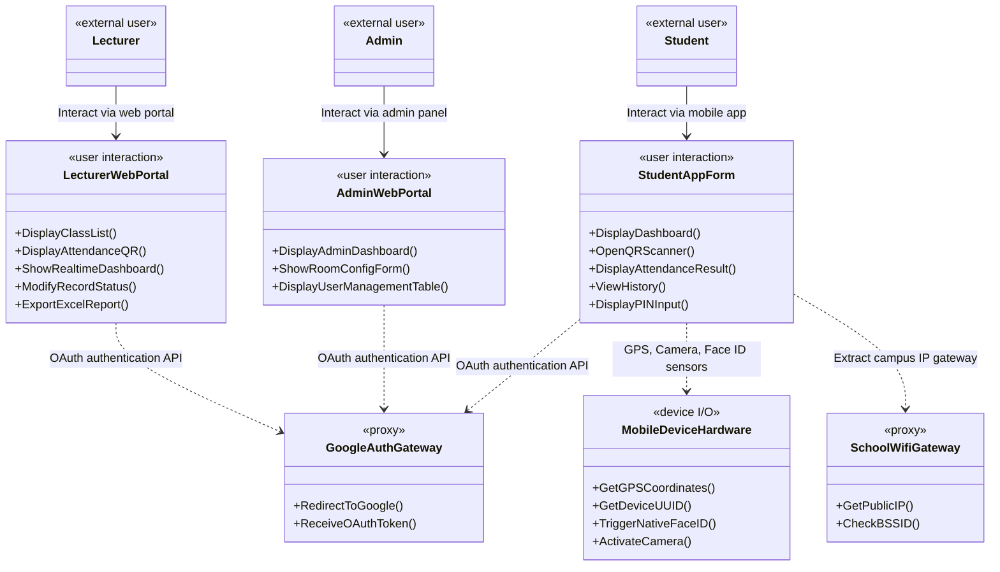
```mermaid
classDiagram
    %% External Actors (Human Users)
    class Student {
        <<external user>>
    }
    class Lecturer {
        <<external user>>
    }
    class Admin {
        <<external user>>
    }

    %% User Interaction Boundary Classes
    class StudentAppForm {
        <<user interaction>>
        +DisplayDashboard()
        +OpenQRScanner()
        +DisplayAttendanceResult()
        +ViewHistory()
        +DisplayPINInput()
    }

    class LecturerWebPortal {
        <<user interaction>>
        +DisplayClassList()
        +DisplayAttendanceQR()
        +ShowRealtimeDashboard()
        +ModifyRecordStatus()
        +ExportExcelReport()
    }

    class AdminWebPortal {
        <<user interaction>>
        +DisplayAdminDashboard()
        +ShowRoomConfigForm()
        +DisplayUserManagementTable()
    }

    %% External System Proxy Boundary Classes
    class GoogleAuthGateway {
        <<proxy>>
        +RedirectToGoogle()
        +ReceiveOAuthToken()
    }

    class SchoolWifiGateway {
        <<proxy>>
        +GetPublicIP()
        +CheckBSSID()
    }

    %% External Device I/O Boundary Classes
    class MobileDeviceHardware {
        <<device I/O>>
        +GetGPSCoordinates()
        +GetDeviceUUID()
        +TriggerNativeFaceID()
        +ActivateCamera()
    }

    %% Actor-to-Boundary Associations
    Student --> StudentAppForm : Interact via mobile app
    Lecturer --> LecturerWebPortal : Interact via web portal
    Admin --> AdminWebPortal : Interact via admin panel

    StudentAppForm ..> GoogleAuthGateway : OAuth authentication API
    LecturerWebPortal ..> GoogleAuthGateway : OAuth authentication API
    AdminWebPortal ..> GoogleAuthGateway : OAuth authentication API

    StudentAppForm ..> MobileDeviceHardware : GPS, Camera, Face ID sensors
    StudentAppForm ..> SchoolWifiGateway : Extract campus IP gateway
```

**Boundary Communication Description:**
1.  **StudentAppForm (`«user interaction»`):** Provides a minimal mobile interface optimized for NFR **NF-03 (Usability)**. Directly invokes hardware sensors on the mobile device (`MobileDeviceHardware`) via platform-native bridging to collect coordinates, trigger biometric verification, and activate the camera scanner.
2.  **LecturerWebPortal (`«user interaction»`):** Web portal featuring a large-screen projector display showing validation tokens. The screen automatically updates the student attendance list in real-time.
3.  **GoogleAuthGateway (`«proxy»`):** Proxy boundary connecting to the school's external email authentication service. All three user-facing boundaries delegate authentication through this shared proxy.
4.  **SchoolWifiGateway (`«proxy»`):** Network proxy boundary that checks internal network parameters to verify whether the student is connected to the university's internal network.
5.  **MobileDeviceHardware (`«device I/O»`):** Hardware abstraction boundary wrapping the phone's physical sensors: location tracking, biometric reader, camera module, and unique device identifier extraction.

---

### **II.0.2 Object Structuring Criteria**

The Object Structuring Criteria classify all system objects into hierarchical groups based on their processing roles, following the COMET BCE (Boundary-Control-Entity) stereotyping method. This tree structure guides the transition from analysis to design.

#### **Figure II-0B: Object Structuring Criteria Tree**

```mermaid
graph TD
    Root[AFAS System Objects] --> Boundary["1. Boundary Objects<br>«boundary»"]
    Root --> Control["2. Control Objects<br>«control»"]
    Root --> Entity["3. Entity Objects<br>«entity»"]

    %% Boundary hierarchy
    Boundary --> UI["1.1 User Interface<br>«user interaction»"]
    Boundary --> Device["1.2 Device Interface<br>«device I/O»"]
    Boundary --> Sys["1.3 System Interface<br>«proxy»"]
    
    UI --> StudentAppForm["StudentAppForm"]
    UI --> LecturerWebPortal["LecturerWebPortal"]
    UI --> AdminWebPortal["AdminWebPortal"]
    
    Device --> GPSReceiver["GPSReceiver"]
    Device --> CameraScanner["CameraScanner"]
    Device --> NativeBiometricReader["NativeBiometricReader"]
    
    Sys --> GoogleOAuthGateway["GoogleOAuthGateway"]
    Sys --> SchoolWifiGateway["SchoolWifiGateway"]

    %% Control hierarchy
    Control --> Coord["2.1 Coordinator<br>«coordinator»"]
    Control --> StateDep["2.2 State-Dependent<br>«state dependent control»"]
    Control --> Timers["2.3 Timer<br>«timer»"]
    
    Coord --> AttendanceController["AttendanceController"]
    Coord --> DeviceBindingController["DeviceBindingController"]
    Coord --> AuthenticationController["AuthenticationController"]
    
    StateDep --> SessionController["SessionController"]
    StateDep --> RoomConfigurationController["RoomConfigController"]
    
    Timers --> QRRefreshTimer["QRRefreshTimer"]
    Timers --> PINRefreshTimer["PINRefreshTimer"]

    %% Entity hierarchy
    Entity --> StudentEntity["Student"]
    Entity --> LecturerEntity["Lecturer"]
    Entity --> RoomEntity["Room"]
    Entity --> SessionEntity["Session"]
    Entity --> SubjectEntity["Subject"]
    Entity --> ClassSectionEntity["ClassSection"]
    Entity --> ClassSectionStudentEntity["ClassSectionStudent"]
    Entity --> AttendanceVersionEntity["AttendanceVersion"]
    Entity --> AttendanceRecordEntity["AttendanceRecord"]
    Entity --> SystemLogEntity["SystemLog"]
```

**Structuring Criteria Description:**

1.  **Boundary Objects — Structuring by Interface Type:**
    *   **User Interface Objects (`«user interaction»`):** Objects responsible for rendering graphical screens directly to end users (StudentAppForm, LecturerWebPortal, AdminWebPortal).
    *   **Device Interface Objects (`«device I/O»`):** Objects connecting directly to physical hardware sensors on the mobile phone. These form the evidence-collection layer for GPS, Camera, and Face ID verification.
    *   **System Interface Objects (`«proxy»`):** Integration gateways connecting to external authentication and network verification services (Google OAuth, campus Wi-Fi gateway).

2.  **Control Objects — Structuring by Coordination Complexity:**
    *   **Coordinator Objects (`«coordinator»`):** Orchestrate the complete event flow of primary use cases. Example: `AttendanceController` coordinates GPS verification, IP matching, and Face ID validation before recording attendance status.
    *   **State-Dependent Objects (`«state dependent control»`):** Objects whose behavior changes based on the current state of an associated entity. Example: `SessionController` manages session lifecycle (`Active`, `Paused`, `Completed`).
    *   **Timer Control Objects (`«timer»`):** Background-running synchronization objects responsible for triggering periodic events. These form the backbone of Anti-Fraud Layer 1. Example: `QRRefreshTimer` triggers a new dynamic QR token every 10 seconds; `PINRefreshTimer` refreshes the PIN every 30 seconds.

3.  **Entity Objects — Classifying Core Logical Data Entities:**
    *   Entity objects encapsulate long-term, persistent domain data and associated business rules. In this phase, they represent logical concepts of the problem domain (e.g., Student, Lecturer, Room, Subject, ClassSection, Session, AttendanceVersion, AttendanceRecord, SystemLog) without specifying data-access libraries, physical tables, or caching technologies.

---

### **II.0.3 UI Wireframes**

The following wireframes describe the key user interface screens for the three system portals: Student Mobile App, Lecturer Web Portal, and Admin Web Portal.

#### **Wireframe WF-01: Student Mobile App — Login Screen**
```
┌─────────────────────────────┐
│         AFAS Login          │
│                             │
│  ┌───────────────────────┐  │
│  │ MSSV / Username       │  │
│  └───────────────────────┘  │
│  ┌───────────────────────┐  │
│  │ Password              │  │
│  └───────────────────────┘  │
│                             │
│  ┌───────────────────────┐  │
│  │    🔑 LOGIN           │  │
│  └───────────────────────┘  │
│                             │
│  ──── OR ────               │
│                             │
│  ┌───────────────────────┐  │
│  │  G  Login with Google │  │
│  │     (@fpt.edu.vn)     │  │
│  └───────────────────────┘  │
│                             │
│  Forgot Password?           │
└─────────────────────────────┘
```

#### **Wireframe WF-02: Student Mobile App — Dashboard & QR Scanner**
```
┌─────────────────────────────┐
│ ☰  AFAS Dashboard     👤   │
├─────────────────────────────┤
│                             │
│  Welcome, Nguyen Van A      │
│  MSSV: SE170123             │
│  Device: ✅ Bound           │
│                             │
│  ┌───────────────────────┐  │
│  │                       │  │
│  │   📷 SCAN QR CODE     │  │
│  │   (Tap to check-in)   │  │
│  │                       │  │
│  └───────────────────────┘  │
│                             │
│  ┌───────────────────────┐  │
│  │   🔢 PIN CHECK-IN     │  │
│  └───────────────────────┘  │
│                             │
├──────┬──────┬──────┬────────┤
│ 🏠   │ 📷  │ 📋  │  👤    │
│ Home │ Scan │ Hist │ Profile│
└──────┴──────┴──────┴────────┘
```

#### **Wireframe WF-03: Student Mobile App — QR Camera View**
```
┌─────────────────────────────┐
│  ← Back        QR Scanner   │
├─────────────────────────────┤
│                             │
│  Face ID: ✅ Verified       │
│                             │
│  ┌───────────────────────┐  │
│  │                       │  │
│  │    ┌─────────────┐    │  │
│  │    │             │    │  │
│  │    │  [QR CODE]  │    │  │
│  │    │   TARGET    │    │  │
│  │    │             │    │  │
│  │    └─────────────┘    │  │
│  │                       │  │
│  │   📍 Camera Viewfinder│  │
│  └───────────────────────┘  │
│                             │
│  GPS: 21.0128, 105.5246     │
│  Wi-Fi: FPT_University_5G  │
│  UUID: A1B2C3...            │
└─────────────────────────────┘
```

#### **Wireframe WF-04: Student Mobile App — Attendance History**
```
┌─────────────────────────────┐
│  ← Back    Attendance History│
├─────────────────────────────┤
│                             │
│  SWD392 - Software Design   │
│  Semester: Summer 2026      │
│                             │
│  ┌──────────────────────┐   │
│  │ Present: 12 │ 🟢 80% │   │
│  │ Late:     2 │ 🟡 13% │   │
│  │ Absent:   1 │ 🔴  7% │   │
│  └──────────────────────┘   │
│                             │
│  ┌─ May 2026 Calendar ───┐  │
│  │ Mo Tu We Th Fr Sa Su  │  │
│  │        1🟢 2   3  4   │  │
│  │  5  6  7  8🟢 9 10 11 │  │
│  │ 12 13 14 15🟡16 17 18 │  │
│  │ 19 20 21 22🔴23 24 25 │  │
│  │ 26 27                 │  │
│  └───────────────────────┘  │
└─────────────────────────────┘
```

#### **Wireframe WF-05: Lecturer Web Portal — Dynamic QR Projector View**
```
┌─────────────────────────────────────────────────────────────────┐
│  AFAS Lecturer Portal  │ SWD392 - SE1701 │ Session: 27/05/2026 │
├─────────────────────────────────────────────────────────────────┤
│                                                                 │
│    ┌──────────────────┐        ┌───────────────────────────┐    │
│    │                  │        │  Real-time Attendance Grid │    │
│    │                  │        ├───────────────────────────┤    │
│    │   ███████████    │        │ 🟢 SE170123 Nguyen Van A  │    │
│    │   █ QR CODE █    │        │ 🟢 SE170456 Tran Thi B    │    │
│    │   █ DYNAMIC █    │        │ ⬜ SE170789 Le Van C       │    │
│    │   ███████████    │        │ ⬜ SE170012 Pham Thi D     │    │
│    │                  │        │ 🟡 SE170345 Hoang Van E   │    │
│    │  Refreshes: 10s  │        │ ⬜ SE170678 Vo Thi F       │    │
│    └──────────────────┘        │ ...                        │    │
│                                └───────────────────────────┘    │
│    PIN: 847291                  Checked-in: 12 / 35 (34%)       │
│    PIN Refreshes: 30s           ⏱ Session active: 04:32         │
│                                                                 │
│    [ 🛑 Stop Attendance ]     [ 📊 Export Excel ]               │
└─────────────────────────────────────────────────────────────────┘
```

#### **Wireframe WF-06: Lecturer Web Portal — Manual Adjustment Modal**
```
┌───────────────────────────────────────────┐
│  Adjust Attendance Status                 │
├───────────────────────────────────────────┤
│                                           │
│  Student: SE170789 - Le Van C             │
│  Session: SWD392 - 27/05/2026             │
│  Current Status: ⬜ Absent                │
│                                           │
│  New Status:                              │
│  ┌─────────────────────────────────────┐  │
│  │ ○ Present  ○ Late  ● Absent        │  │
│  │ ○ Fraud_Declined                   │  │
│  └─────────────────────────────────────┘  │
│                                           │
│  Reason (required):                       │
│  ┌─────────────────────────────────────┐  │
│  │ Student showed medical certificate  │  │
│  │ for being late. Verified by lectu.. │  │
│  └─────────────────────────────────────┘  │
│                                           │
│  [ Cancel ]              [ 💾 Save ]      │
└───────────────────────────────────────────┘
```

#### **Wireframe WF-07: Admin Web Portal — Room GPS Configuration**
```
┌─────────────────────────────────────────────────────────────────┐
│  AFAS Admin Portal  │  Room Management                         │
├─────────────────────────────────────────────────────────────────┤
│                                                                 │
│  ┌───────────────────────────────────────────────────────────┐  │
│  │ Room ID │ Room Name    │ Latitude   │ Longitude  │ Radius │  │
│  ├─────────┼──────────────┼────────────┼────────────┼────────┤  │
│  │ AL-L301 │ Alpha 301    │ 21.01282   │ 105.52461  │ 20m    │  │
│  │ AL-L402 │ Alpha 402    │ 21.01305   │ 105.52489  │ 20m    │  │
│  │ BE-202  │ Beta 202     │ 21.01198   │ 105.52378  │ 25m    │  │
│  │ [+ Add New Room]                                          │  │
│  └───────────────────────────────────────────────────────────┘  │
│                                                                 │
│  ┌─ Configure Room: AL-L402 ─────────────────────────────────┐  │
│  │                                                           │  │
│  │  ┌──────────────────────────────┐  Latitude:              │  │
│  │  │                              │  ┌──────────────────┐   │  │
│  │  │     🗺️ SATELLITE MAP        │  │ 21.01305         │   │  │
│  │  │                              │  └──────────────────┘   │  │
│  │  │        📍 (click to set)     │  Longitude:             │  │
│  │  │                              │  ┌──────────────────┐   │  │
│  │  │                              │  │ 105.52489        │   │  │
│  │  └──────────────────────────────┘  └──────────────────┘   │  │
│  │                                    Allowed Radius (m):     │  │
│  │  [ 📡 Capture Current GPS ]       ┌──────────────────┐   │  │
│  │                                    │ 20               │   │  │
│  │                                    └──────────────────┘   │  │
│  │                                                           │  │
│  │              [ Cancel ]      [ 💾 Save Configuration ]    │  │
│  └───────────────────────────────────────────────────────────┘  │
└─────────────────────────────────────────────────────────────────┘
```

#### **Wireframe WF-08: Student Mobile App — PIN Fallback Input**
```
┌─────────────────────────────┐
│  ← Back      PIN Check-in   │
├─────────────────────────────┤
│                             │
│  Face ID: ✅ Verified       │
│                             │
│  Enter the 6-digit PIN      │
│  displayed on the projector │
│                             │
│  ┌──┐ ┌──┐ ┌──┐ ┌──┐ ┌──┐ ┌──┐│
│  │8 │ │4 │ │7 │ │2 │ │9 │ │1 ││
│  └──┘ └──┘ └──┘ └──┘ └──┘ └──┘│
│                             │
│  GPS: 21.0128, 105.5246     │
│  UUID: A1B2C3...            │
│                             │
│  ┌───────────────────────┐  │
│  │    ✅ SUBMIT PIN       │  │
│  └───────────────────────┘  │
│                             │
│  PIN refreshes every 30s.   │
│  Make sure to enter the     │
│  current PIN on screen.     │
└─────────────────────────────┘
```

---

## **II.1 Interaction diagrams**

In this section, we analyze the objects and their interactions to realize the core use cases of the AFAS system based on Gomaa's MVC analysis pattern. For each key use case, we construct both a **Sequence Diagram** (representing time-sequence interactions) and a **Communication Diagram** (representing structural links and message sequence numbers).

---

### **1. UC01: Login via Credentials or Google OAuth**

#### **Figure II-1A: Sequence Diagram for UC01 - Login**
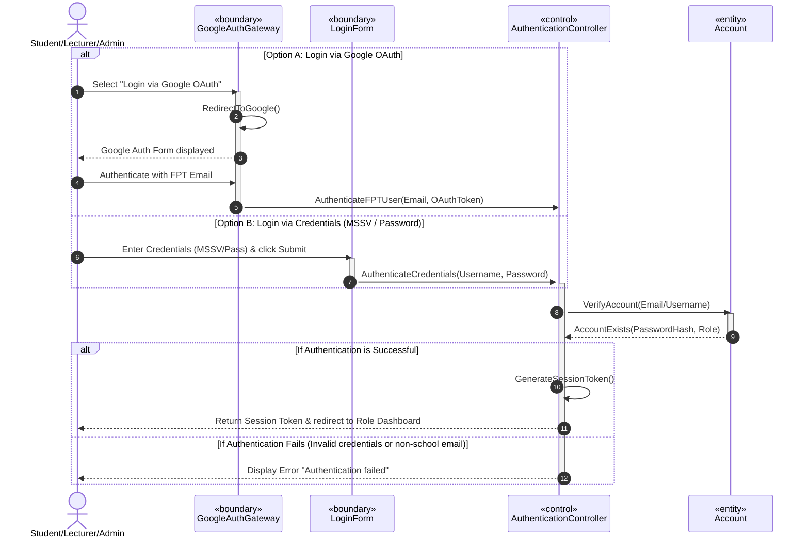
```mermaid
sequenceDiagram
    autonumber
    actor User as Student/Lecturer/Admin
    participant LGG as «boundary»<br>GoogleAuthGateway
    participant LAF as «boundary»<br>LoginForm
    participant AC as «control»<br>AuthenticationController
    participant ACC as «entity»<br>Account

    alt Option A: Login via Google OAuth
        User->>LGG: Select "Login via Google OAuth"
        activate LGG
        LGG->>LGG: RedirectToGoogle()
        LGG-->>User: Google Auth Form displayed
        User->>LGG: Authenticate with FPT Email
        LGG->>AC: AuthenticateFPTUser(Email, OAuthToken)
        deactivate LGG
        activate AC
    else Option B: Login via Credentials (MSSV / Password)
        User->>LAF: Enter Credentials (MSSV/Pass) & click Submit
        activate LAF
        LAF->>AC: AuthenticateCredentials(Username, Password)
        deactivate LAF
        activate AC
    end

    AC->>ACC: VerifyAccount(Email/Username)
    activate ACC
    ACC-->>AC: AccountExists(PasswordHash, Role)
    deactivate ACC

    alt If Authentication is Successful
        AC->>AC: GenerateSessionToken()
        AC-->>User: Return Session Token & redirect to Role Dashboard
    else If Authentication Fails (Invalid credentials or non-school email)
        AC-->>User: Display Error "Authentication failed"
    end
    deactivate AC
```

#### **Figure II-1B: Communication Diagram for UC01 - Login**
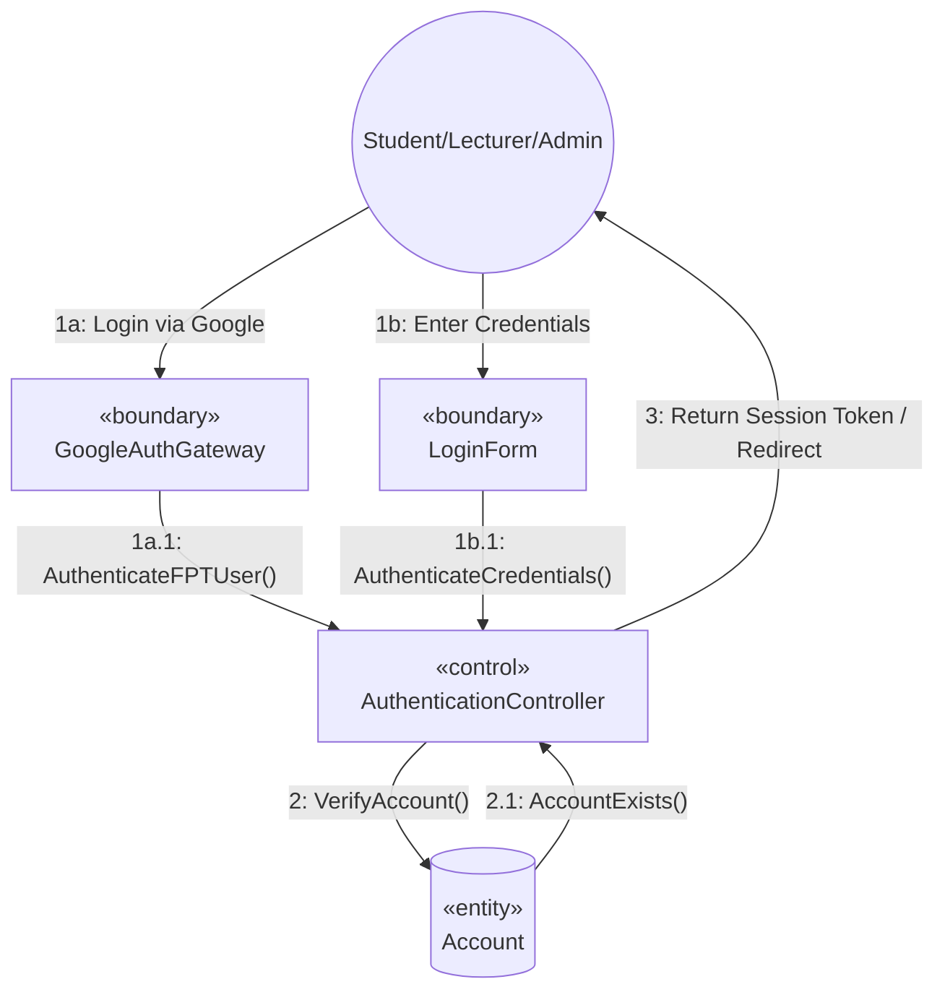
```mermaid
graph TD
    User((Student/Lecturer/Admin))
    LGG[«boundary»<br>GoogleAuthGateway]
    LAF[«boundary»<br>LoginForm]
    AC[«control»<br>AuthenticationController]
    ACC[(«entity»<br>Account)]

    %% Connections and Messages
    User -->|"1a: Login via Google"| LGG
    User -->|"1b: Enter Credentials"| LAF
    
    LGG -->|"1a.1: AuthenticateFPTUser()"| AC
    LAF -->|"1b.1: AuthenticateCredentials()"| AC
    
    AC -->|"2: VerifyAccount()"| ACC
    ACC -->|"2.1: AccountExists()"| AC
    AC -->|"3: Return Session Token / Redirect"| User
```

---

### **2. UC02: Register Device UUID**

#### **Figure II-2A: Sequence Diagram for UC02 - Register Device UUID**
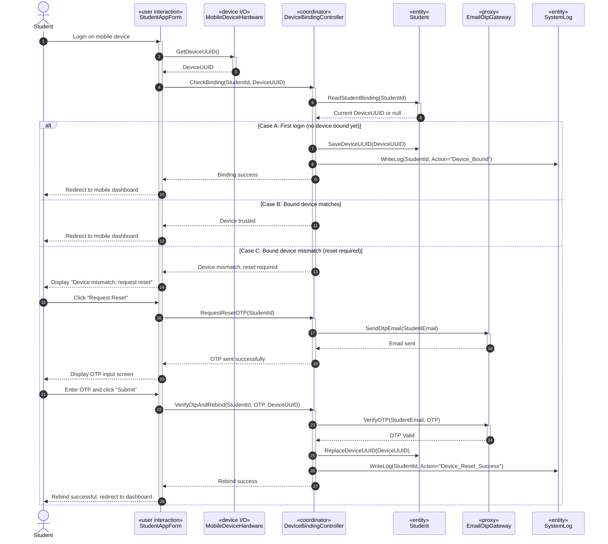
```mermaid
sequenceDiagram
    autonumber
    actor SV as Student
    participant SAF as «user interaction»<br>StudentAppForm
    participant MD as «device I/O»<br>MobileDeviceHardware
    participant DBC as «coordinator»<br>DeviceBindingController
    participant ST as «entity»<br>Student
    participant OTP as «proxy»<br>EmailOtpGateway
    participant SL as «entity»<br>SystemLog

    SV->>SAF: Login on mobile device
    activate SAF
    SAF->>MD: GetDeviceUUID()
    activate MD
    MD-->>SAF: DeviceUUID
    deactivate MD
    SAF->>DBC: CheckBinding(StudentId, DeviceUUID)
    activate DBC
    DBC->>ST: ReadStudentBinding(StudentId)
    activate ST
    ST-->>DBC: Current DeviceUUID or null
    deactivate ST

    alt Case A: First login (no device bound yet)
        DBC->>ST: SaveDeviceUUID(DeviceUUID)
        DBC->>SL: WriteLog(StudentId, Action="Device_Bound")
        DBC-->>SAF: Binding success
        SAF-->>SV: Redirect to mobile dashboard
    else Case B: Bound device matches
        DBC-->>SAF: Device trusted
        SAF-->>SV: Redirect to mobile dashboard
    else Case C: Bound device mismatch (reset required)
        DBC-->>SAF: Device mismatch, reset required
        deactivate DBC
        SAF-->>SV: Display "Device mismatch, request reset"
        SV->>SAF: Click "Request Reset"
        SAF->>DBC: RequestResetOTP(StudentId)
        activate DBC
        DBC->>OTP: SendOtpEmail(StudentEmail)
        activate OTP
        OTP-->>DBC: Email sent
        deactivate OTP
        DBC-->>SAF: OTP sent successfully
        deactivate DBC
        SAF-->>SV: Display OTP input screen
        SV->>SAF: Enter OTP and click "Submit"
        SAF->>DBC: VerifyOtpAndRebind(StudentId, OTP, DeviceUUID)
        activate DBC
        DBC->>OTP: VerifyOTP(StudentEmail, OTP)
        activate OTP
        OTP-->>DBC: OTP Valid
        deactivate OTP
        DBC->>ST: ReplaceDeviceUUID(DeviceUUID)
        DBC->>SL: WriteLog(StudentId, Action="Device_Reset_Success")
        DBC-->>SAF: Rebind success
        deactivate DBC
        SAF-->>SV: Rebind successful, redirect to dashboard
    end
    deactivate SAF
```

#### **Figure II-2B: Communication Diagram for UC02 - Register Device UUID**
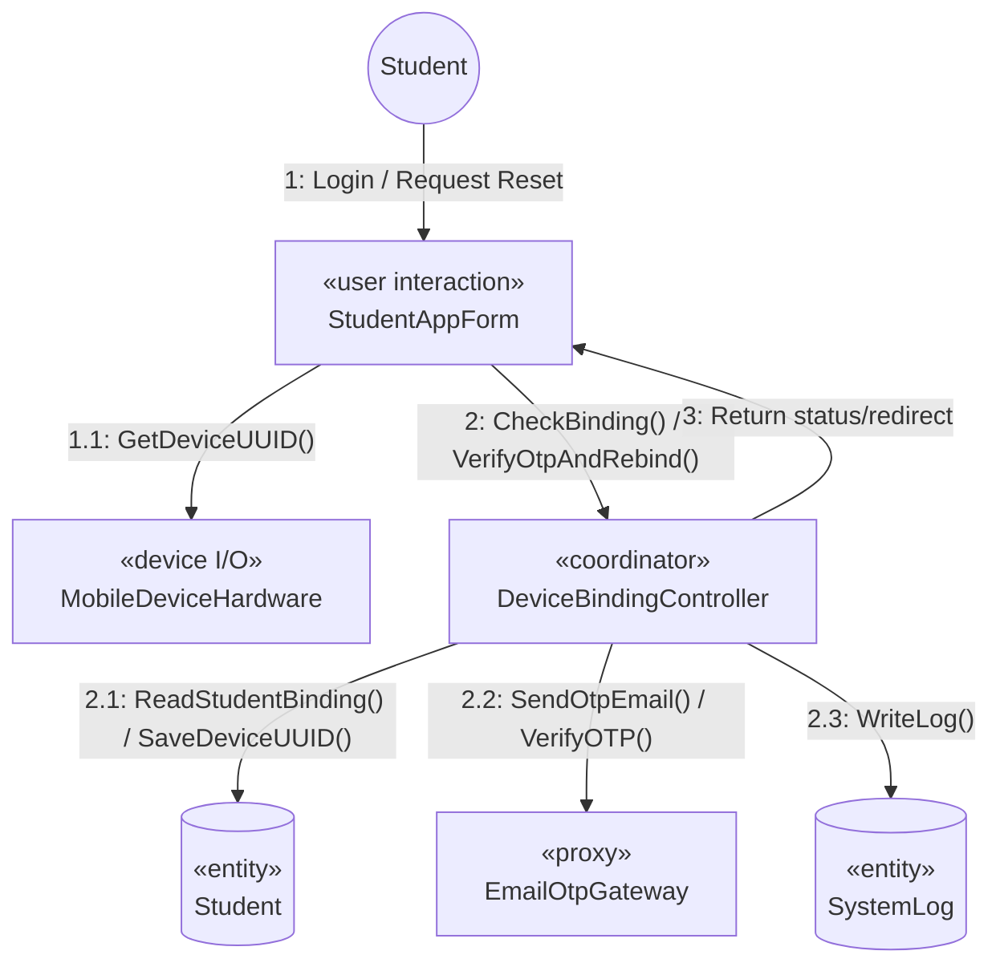
```mermaid
graph TD
    SV((Student))
    SAF["«user interaction»<br>StudentAppForm"]
    MD["«device I/O»<br>MobileDeviceHardware"]
    DBC["«coordinator»<br>DeviceBindingController"]
    ST[("«entity»<br>Student")]
    OTP["«proxy»<br>EmailOtpGateway"]
    SL[("«entity»<br>SystemLog")]

    %% Connections and Messages
    SV -->|"1: Login / Request Reset"| SAF
    SAF -->|"1.1: GetDeviceUUID()"| MD
    SAF -->|"2: CheckBinding() / VerifyOtpAndRebind()"| DBC
    DBC -->|"2.1: ReadStudentBinding() / SaveDeviceUUID()"| ST
    DBC -->|"2.2: SendOtpEmail() / VerifyOTP()"| OTP
    DBC -->|"2.3: WriteLog()"| SL
    DBC -->|"3: Return status/redirect"| SAF
```

---

### **3. UC03: Scan Dynamic QR Check-in**

#### **Figure II-3A: Sequence Diagram for UC03 - Scan Dynamic QR Check-in**
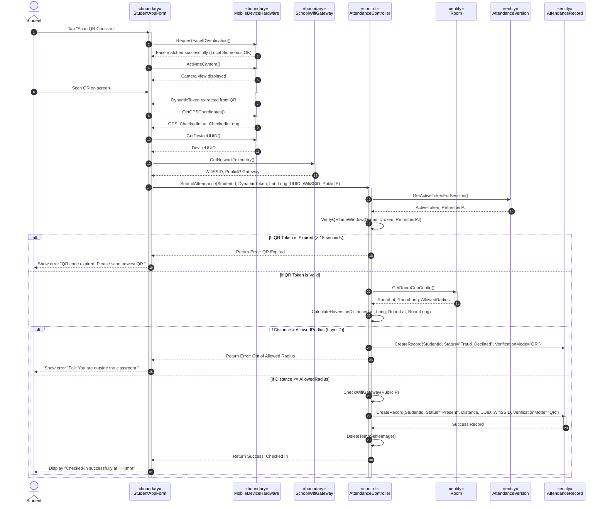
```mermaid
sequenceDiagram
    autonumber
    actor SV as Student
    participant SAF as «boundary»<br>StudentAppForm
    participant MD as «boundary»<br>MobileDeviceHardware
    participant WG as «boundary»<br>SchoolWifiGateway
    participant AC as «control»<br>AttendanceController
    participant R as «entity»<br>Room
    participant V as «entity»<br>AttendanceVersion
    participant AR as «entity»<br>AttendanceRecord

    SV->>SAF: Tap "Scan QR Check-in"
    activate SAF
    
    SAF->>MD: RequestFaceIDVerification()
    activate MD
    MD-->>SAF: Face matched successfully (Local Biometrics OK)
    deactivate MD
    
    SAF->>MD: ActivateCamera()
    activate MD
    MD-->>SAF: Camera view displayed
    deactivate MD
    
    SV->>SAF: Scan QR on screen
    activate MD
    MD->>SAF: DynamicToken extracted from QR
    deactivate MD
    
    SAF->>MD: GetGPSCoordinates()
    activate MD
    MD-->>SAF: GPS: CheckedInLat, CheckedInLong
    deactivate MD
    
    SAF->>MD: GetDeviceUUID()
    activate MD
    MD-->>SAF: DeviceUUID
    deactivate MD
    
    SAF->>WG: GetNetworkTelemetry()
    activate WG
    WG-->>SAF: WifiSSID, PublicIP Gateway
    deactivate WG
    
    SAF->>AC: SubmitAttendance(StudentId, DynamicToken, Lat, Long, UUID, WifiSSID, PublicIP)
    activate AC
    
    AC->>V: GetActiveTokenForSession()
    activate V
    V-->>AC: ActiveToken, RefreshedAt
    deactivate V
    AC->>AC: VerifyQRTimeWindow(DynamicToken, RefreshedAt)
    
    alt If QR Token is Expired (> 15 seconds)
        AC-->>SAF: Return Error: QR Expired
        SAF-->>SV: Show error "QR code expired. Please scan newest QR."
    else If QR Token is Valid
        AC->>R: GetRoomGeoConfig()
        activate R
        R-->>AC: RoomLat, RoomLong, AllowedRadius
        deactivate R
        AC->>AC: CalculateHaversineDistance(Lat, Long, RoomLat, RoomLong)
        
        alt If Distance > AllowedRadius (Layer 2)
            AC->>AR: CreateRecord(StudentId, Status="Fraud_Declined", VerificationMode="QR")
            AC-->>SAF: Return Error: Out of Allowed Radius
            SAF-->>SV: Show error "Fail: You are outside the classroom."
        else If Distance <= AllowedRadius
            AC->>AC: CheckWifiGateway(PublicIP)
            AC->>AR: CreateRecord(StudentId, Status="Present", Distance, UUID, WifiSSID, VerificationMode="QR")
            activate AR
            AR-->>AC: Success Record
            deactivate AR
            
            AC->>AC: DeleteTempSelfieImage()
            
            AC-->>SAF: Return Success: Checked In
            SAF-->>SV: Display "Checked-in successfully at HH:mm"
        end
    end
    deactivate AC
    deactivate SAF
```

#### **Figure II-3B: Communication Diagram for UC03 - Scan Dynamic QR Check-in**
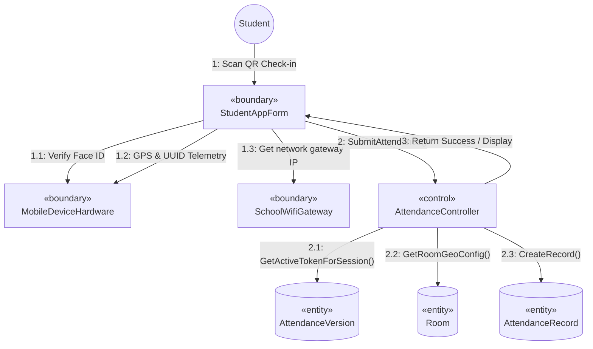
```mermaid
graph TD
    SV((Student))
    SAF[«boundary»<br>StudentAppForm]
    MD[«boundary»<br>MobileDeviceHardware]
    WG[«boundary»<br>SchoolWifiGateway]
    AC[«control»<br>AttendanceController]
    R[(«entity»<br>Room)]
    V[(«entity»<br>AttendanceVersion)]
    AR[(«entity»<br>AttendanceRecord)]

    SV -->|"1: Scan QR Check-in"| SAF
    SAF -->|"1.1: Verify Face ID"| MD
    SAF -->|"1.2: GPS & UUID Telemetry"| MD
    SAF -->|"1.3: Get network gateway IP"| WG
    
    SAF -->|"2: SubmitAttendance()"| AC
    AC -->|"2.1: GetActiveTokenForSession()"| V
    AC -->|"2.2: GetRoomGeoConfig()"| R
    AC -->|"2.3: CreateRecord()"| AR
    AC -->|"3: Return Success / Display"| SAF
```

---

### **4. UC04: View Attendance History**

#### **Figure II-4A: Sequence Diagram for UC04 - View Attendance History**
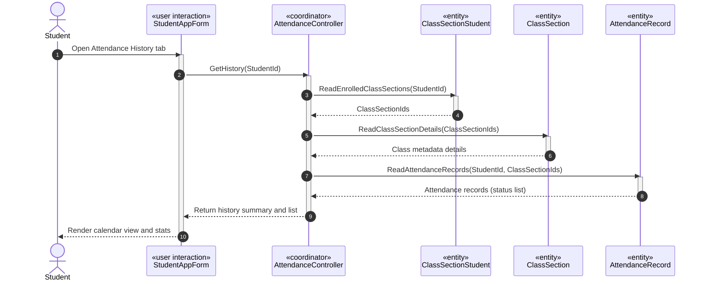
```mermaid
sequenceDiagram
    autonumber
    actor SV as Student
    participant SAF as «user interaction»<br>StudentAppForm
    participant AC as «coordinator»<br>AttendanceController
    participant CSS as «entity»<br>ClassSectionStudent
    participant CS as «entity»<br>ClassSection
    participant AR as «entity»<br>AttendanceRecord

    SV->>SAF: Open Attendance History tab
    activate SAF
    SAF->>AC: GetHistory(StudentId)
    activate AC
    AC->>CSS: ReadEnrolledClassSections(StudentId)
    activate CSS
    CSS-->>AC: ClassSectionIds
    deactivate CSS
    AC->>CS: ReadClassSectionDetails(ClassSectionIds)
    activate CS
    CS-->>AC: Class metadata details
    deactivate CS
    AC->>AR: ReadAttendanceRecords(StudentId, ClassSectionIds)
    activate AR
    AR-->>AC: Attendance records (status list)
    deactivate AR
    AC-->>SAF: Return history summary and list
    deactivate AC
    SAF-->>SV: Render calendar view and stats
    deactivate SAF
```

#### **Figure II-4B: Communication Diagram for UC04 - View Attendance History**
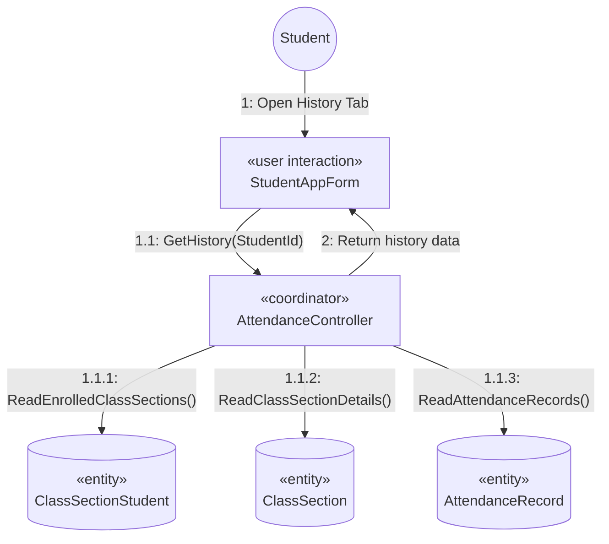
```mermaid
graph TD
    SV((Student))
    SAF["«user interaction»<br>StudentAppForm"]
    AC["«coordinator»<br>AttendanceController"]
    CSS[("«entity»<br>ClassSectionStudent")]
    CS[("«entity»<br>ClassSection")]
    AR[("«entity»<br>AttendanceRecord")]

    %% Connections and Messages
    SV -->|"1: Open History Tab"| SAF
    SAF -->|"1.1: GetHistory(StudentId)"| AC
    AC -->|"1.1.1: ReadEnrolledClassSections()"| CSS
    AC -->|"1.1.2: ReadClassSectionDetails()"| CS
    AC -->|"1.1.3: ReadAttendanceRecords()"| AR
    AC -->|"2: Return history data"| SAF
```

---

### **5. UC05: PIN Fallback Check-in**

#### **Figure II-5A: Sequence Diagram for UC05 - PIN Fallback Check-in**
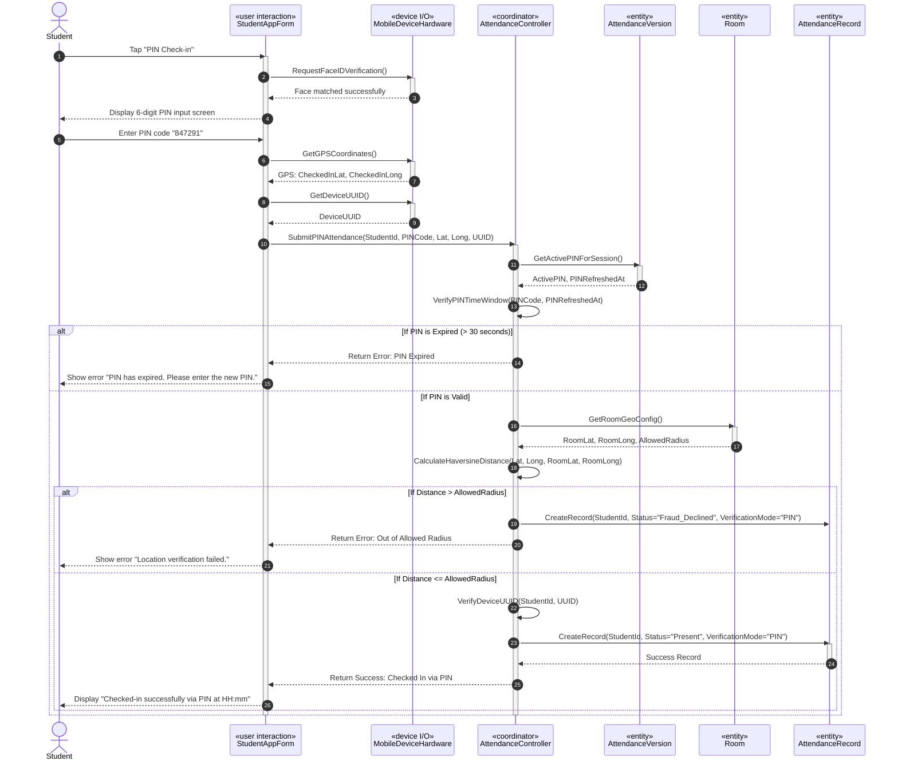
```mermaid
sequenceDiagram
    autonumber
    actor SV as Student
    participant SAF as «user interaction»<br>StudentAppForm
    participant MD as «device I/O»<br>MobileDeviceHardware
    participant AC as «coordinator»<br>AttendanceController
    participant V as «entity»<br>AttendanceVersion
    participant R as «entity»<br>Room
    participant AR as «entity»<br>AttendanceRecord

    SV->>SAF: Tap "PIN Check-in"
    activate SAF
    
    SAF->>MD: RequestFaceIDVerification()
    activate MD
    MD-->>SAF: Face matched successfully
    deactivate MD
    
    SAF-->>SV: Display 6-digit PIN input screen
    SV->>SAF: Enter PIN code "847291"
    
    SAF->>MD: GetGPSCoordinates()
    activate MD
    MD-->>SAF: GPS: CheckedInLat, CheckedInLong
    deactivate MD
    
    SAF->>MD: GetDeviceUUID()
    activate MD
    MD-->>SAF: DeviceUUID
    deactivate MD
    
    SAF->>AC: SubmitPINAttendance(StudentId, PINCode, Lat, Long, UUID)
    activate AC
    
    AC->>V: GetActivePINForSession()
    activate V
    V-->>AC: ActivePIN, PINRefreshedAt
    deactivate V
    AC->>AC: VerifyPINTimeWindow(PINCode, PINRefreshedAt)
    
    alt If PIN is Expired (> 30 seconds)
        AC-->>SAF: Return Error: PIN Expired
        SAF-->>SV: Show error "PIN has expired. Please enter the new PIN."
    else If PIN is Valid
        AC->>R: GetRoomGeoConfig()
        activate R
        R-->>AC: RoomLat, RoomLong, AllowedRadius
        deactivate R
        AC->>AC: CalculateHaversineDistance(Lat, Long, RoomLat, RoomLong)
        
        alt If Distance > AllowedRadius
            AC->>AR: CreateRecord(StudentId, Status="Fraud_Declined", VerificationMode="PIN")
            AC-->>SAF: Return Error: Out of Allowed Radius
            SAF-->>SV: Show error "Location verification failed."
        else If Distance <= AllowedRadius
            AC->>AC: VerifyDeviceUUID(StudentId, UUID)
            AC->>AR: CreateRecord(StudentId, Status="Present", VerificationMode="PIN")
            activate AR
            AR-->>AC: Success Record
            deactivate AR
            AC-->>SAF: Return Success: Checked In via PIN
            SAF-->>SV: Display "Checked-in successfully via PIN at HH:mm"
        end
    end
    deactivate AC
    deactivate SAF
```

#### **Figure II-5B: Communication Diagram for UC05 - PIN Fallback Check-in**
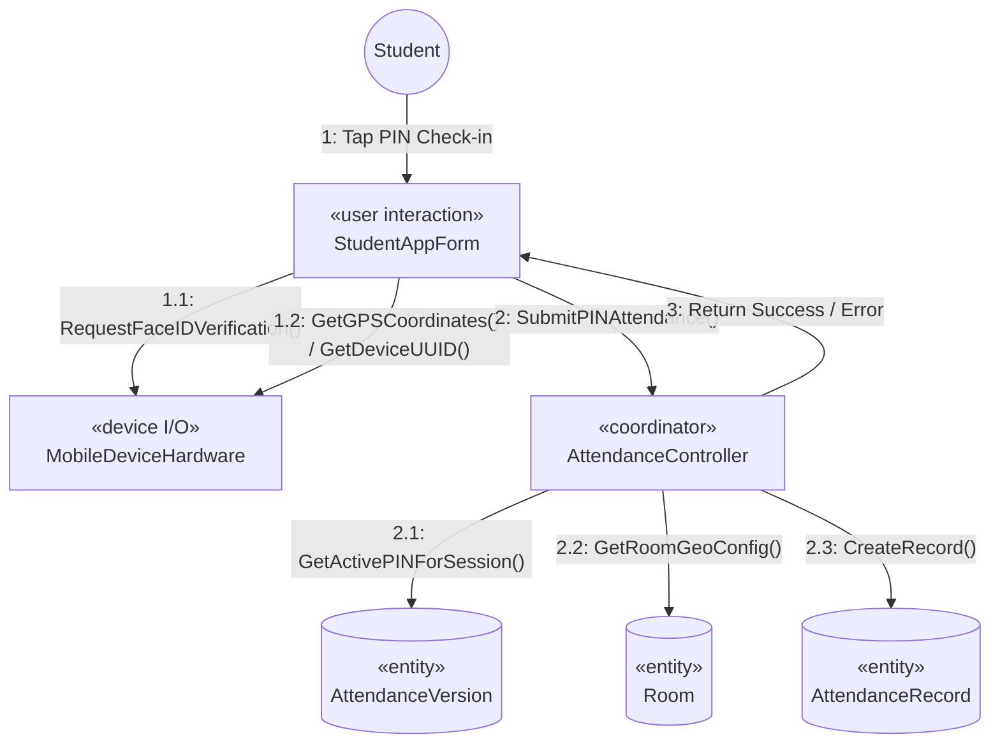
```mermaid
graph TD
    SV((Student))
    SAF["«user interaction»<br>StudentAppForm"]
    MD["«device I/O»<br>MobileDeviceHardware"]
    AC["«coordinator»<br>AttendanceController"]
    V[("«entity»<br>AttendanceVersion")]
    R[("«entity»<br>Room")]
    AR[("«entity»<br>AttendanceRecord")]

    SV -->|"1: Tap PIN Check-in"| SAF
    SAF -->|"1.1: RequestFaceIDVerification()"| MD
    SAF -->|"1.2: GetGPSCoordinates() / GetDeviceUUID()"| MD
    
    SAF -->|"2: SubmitPINAttendance()"| AC
    AC -->|"2.1: GetActivePINForSession()"| V
    AC -->|"2.2: GetRoomGeoConfig()"| R
    AC -->|"2.3: CreateRecord()"| AR
    AC -->|"3: Return Success / Error"| SAF
```

---

### **6. UC06: Activate Dynamic QR Session**

#### **Figure II-6A: Sequence Diagram for UC06 - Activate Dynamic QR Session**
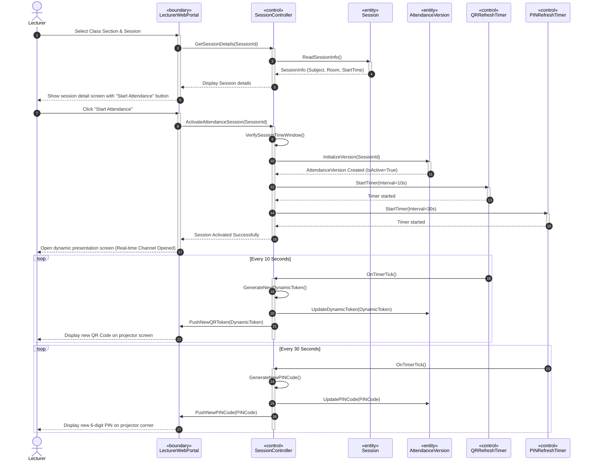
```mermaid
sequenceDiagram
    autonumber
    actor GV as Lecturer
    participant LWP as «boundary»<br>LecturerWebPortal
    participant SC as «control»<br>SessionController
    participant S as «entity»<br>Session
    participant V as «entity»<br>AttendanceVersion
    participant QT as «control»<br>QRRefreshTimer
    participant PT as «control»<br>PINRefreshTimer

    GV->>LWP: Select Class Section & Session
    activate LWP
    LWP->>SC: GetSessionDetails(SessionId)
    activate SC
    SC->>S: ReadSessionInfo()
    activate S
    S-->>SC: SessionInfo (Subject, Room, StartTime)
    deactivate S
    SC-->>LWP: Display Session details
    deactivate SC
    LWP-->>GV: Show session detail screen with "Start Attendance" button
    deactivate LWP

    GV->>LWP: Click "Start Attendance"
    activate LWP
    LWP->>SC: ActivateAttendanceSession(SessionId)
    activate SC
    
    SC->>SC: VerifySessionTimeWindow()
    
    SC->>V: InitializeVersion(SessionId)
    activate V
    V-->>SC: AttendanceVersion Created (IsActive=True)
    deactivate V
    
    SC->>QT: StartTimer(Interval=10s)
    activate QT
    QT-->>SC: Timer started
    deactivate QT
    
    SC->>PT: StartTimer(Interval=30s)
    activate PT
    PT-->>SC: Timer started
    deactivate PT
    
    SC-->>LWP: Session Activated Successfully
    deactivate SC
    LWP-->>GV: Open dynamic presentation screen (Real-time Channel Opened)
    deactivate LWP

    loop Every 10 Seconds
        QT->>SC: OnTimerTick()
        activate SC
        SC->>SC: GenerateNewDynamicToken()
        SC->>V: UpdateDynamicToken(DynamicToken)
        SC->>LWP: PushNewQRToken(DynamicToken)
        LWP-->>GV: Display new QR Code on projector screen
        deactivate SC
    end

    loop Every 30 Seconds
        PT->>SC: OnTimerTick()
        activate SC
        SC->>SC: GenerateNewPINCode()
        SC->>V: UpdatePINCode(PINCode)
        SC->>LWP: PushNewPINCode(PINCode)
        LWP-->>GV: Display new 6-digit PIN on projector corner
        deactivate SC
    end
```

#### **Figure II-6B: Communication Diagram for UC06 - Activate Dynamic QR Session**
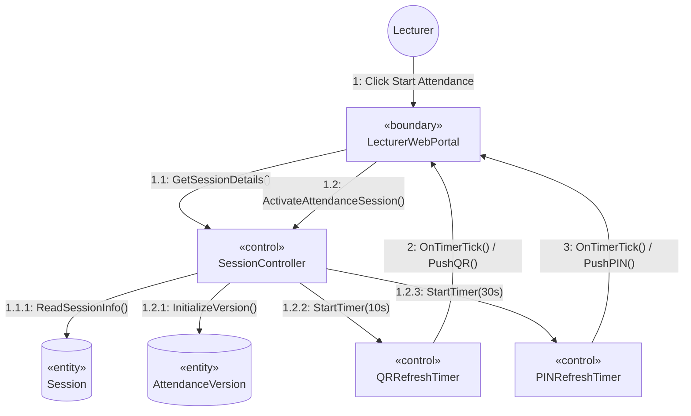
```mermaid
graph TD
    GV((Lecturer))
    LWP[«boundary»<br>LecturerWebPortal]
    SC[«control»<br>SessionController]
    S[(«entity»<br>Session)]
    V[(«entity»<br>AttendanceVersion)]
    QT[«control»<br>QRRefreshTimer]
    PT[«control»<br>PINRefreshTimer]

    GV -->|"1: Click Start Attendance"| LWP
    LWP -->|"1.1: GetSessionDetails()"| SC
    LWP -->|"1.2: ActivateAttendanceSession()"| SC
    
    SC -->|"1.1.1: ReadSessionInfo()"| S
    SC -->|"1.2.1: InitializeVersion()"| V
    SC -->|"1.2.2: StartTimer(10s)"| QT
    SC -->|"1.2.3: StartTimer(30s)"| PT
    
    QT -->|"2: OnTimerTick() / PushQR()"| LWP
    PT -->|"3: OnTimerTick() / PushPIN()"| LWP
```

---

### **7. UC07: Real-time Attendance Monitor**

#### **Figure II-7A: Sequence Diagram for UC07 - Real-time Attendance Monitor**
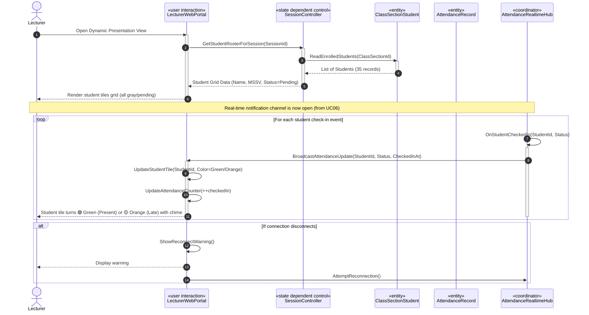
```mermaid
sequenceDiagram
    autonumber
    actor GV as Lecturer
    participant LWP as «user interaction»<br>LecturerWebPortal
    participant SC as «state dependent control»<br>SessionController
    participant CS as «entity»<br>ClassSectionStudent
    participant AR as «entity»<br>AttendanceRecord
    participant WSH as «coordinator»<br>AttendanceRealtimeHub

    GV->>LWP: Open Dynamic Presentation View
    activate LWP
    LWP->>SC: GetStudentRosterForSession(SessionId)
    activate SC
    SC->>CS: ReadEnrolledStudents(ClassSectionId)
    activate CS
    CS-->>SC: List of Students (35 records)
    deactivate CS
    SC-->>LWP: Student Grid Data (Name, MSSV, Status=Pending)
    deactivate SC
    LWP-->>GV: Render student tiles grid (all gray/pending)
    deactivate LWP

    Note over GV, WSH: Real-time notification channel is now open (from UC06)

    loop For each student check-in event
        WSH->>WSH: OnStudentCheckedIn(StudentId, Status)
        activate WSH
        WSH->>LWP: BroadcastAttendanceUpdate(StudentId, Status, CheckedInAt)
        activate LWP
        LWP->>LWP: UpdateStudentTile(StudentId, Color=Green/Orange)
        LWP->>LWP: UpdateAttendanceCounter(++checkedIn)
        LWP-->>GV: Student tile turns 🟢 Green (Present) or 🟡 Orange (Late) with chime
        deactivate LWP
        deactivate WSH
    end

    alt If connection disconnects
        LWP->>LWP: ShowReconnectWarning()
        LWP-->>GV: Display warning
        LWP->>WSH: AttemptReconnection()
    end
```

#### **Figure II-7B: Communication Diagram for UC07 - Real-time Attendance Monitor**
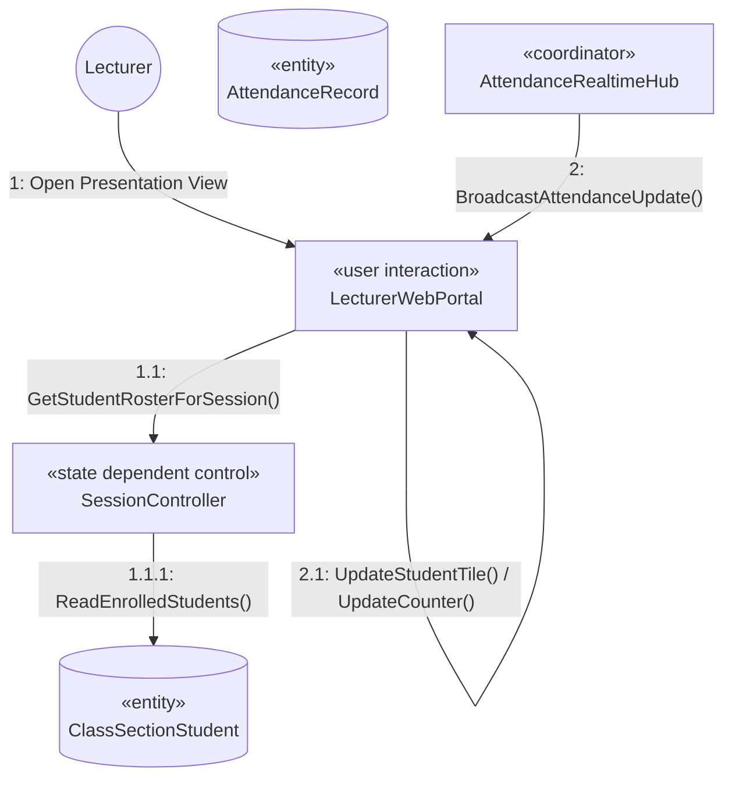
```mermaid
graph TD
    GV((Lecturer))
    LWP["«user interaction»<br>LecturerWebPortal"]
    SC["«state dependent control»<br>SessionController"]
    CS[("«entity»<br>ClassSectionStudent")]
    AR[("«entity»<br>AttendanceRecord")]
    WSH["«coordinator»<br>AttendanceRealtimeHub"]

    GV -->|"1: Open Presentation View"| LWP
    LWP -->|"1.1: GetStudentRosterForSession()"| SC
    SC -->|"1.1.1: ReadEnrolledStudents()"| CS
    
    WSH -->|"2: BroadcastAttendanceUpdate()"| LWP
    LWP -->|"2.1: UpdateStudentTile() / UpdateCounter()"| LWP
```

---

### **8. UC08: Manual Attendance Adjustment**

#### **Figure II-8A: Sequence Diagram for UC08 - Manual Attendance Adjustment**
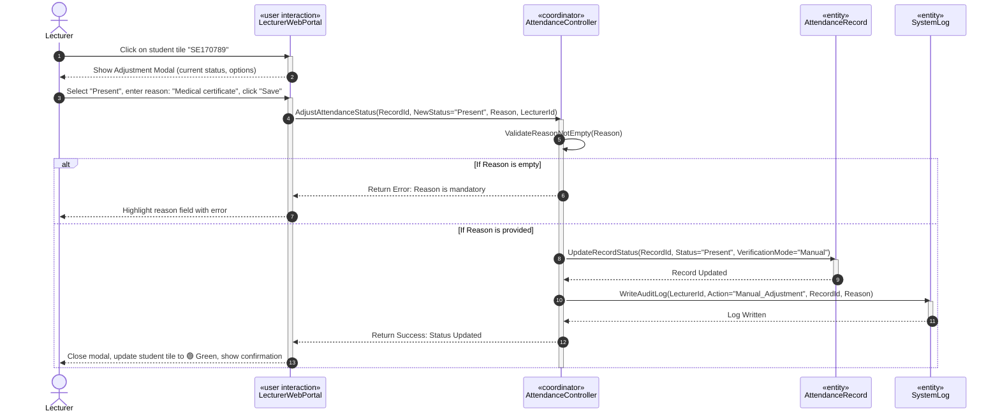
```mermaid
sequenceDiagram
    autonumber
    actor GV as Lecturer
    participant LWP as «user interaction»<br>LecturerWebPortal
    participant AC as «coordinator»<br>AttendanceController
    participant AR as «entity»<br>AttendanceRecord
    participant SL as «entity»<br>SystemLog

    GV->>LWP: Click on student tile "SE170789"
    activate LWP
    LWP-->>GV: Show Adjustment Modal (current status, options)
    deactivate LWP

    GV->>LWP: Select "Present", enter reason: "Medical certificate", click "Save"
    activate LWP
    LWP->>AC: AdjustAttendanceStatus(RecordId, NewStatus="Present", Reason, LecturerId)
    activate AC
    
    AC->>AC: ValidateReasonNotEmpty(Reason)
    
    alt If Reason is empty
        AC-->>LWP: Return Error: Reason is mandatory
        LWP-->>GV: Highlight reason field with error
    else If Reason is provided
        AC->>AR: UpdateRecordStatus(RecordId, Status="Present", VerificationMode="Manual")
        activate AR
        AR-->>AC: Record Updated
        deactivate AR
        
        AC->>SL: WriteAuditLog(LecturerId, Action="Manual_Adjustment", RecordId, Reason)
        activate SL
        SL-->>AC: Log Written
        deactivate SL
        
        AC-->>LWP: Return Success: Status Updated
        LWP-->>GV: Close modal, update student tile to 🟢 Green, show confirmation
    end
    deactivate AC
    deactivate LWP
```

#### **Figure II-8B: Communication Diagram for UC08 - Manual Attendance Adjustment**
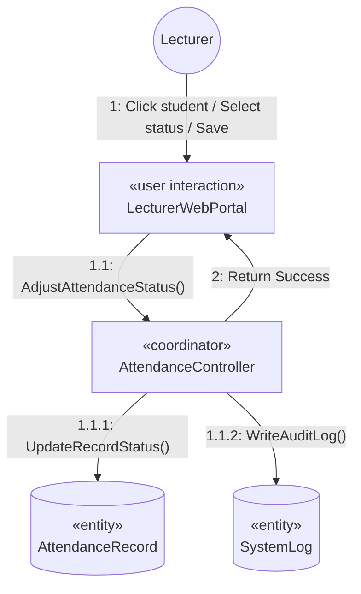
```mermaid
graph TD
    GV((Lecturer))
    LWP["«user interaction»<br>LecturerWebPortal"]
    AC["«coordinator»<br>AttendanceController"]
    AR[("«entity»<br>AttendanceRecord")]
    SL[("«entity»<br>SystemLog")]

    GV -->|"1: Click student / Select status / Save"| LWP
    LWP -->|"1.1: AdjustAttendanceStatus()"| AC
    AC -->|"1.1.1: UpdateRecordStatus()"| AR
    AC -->|"1.1.2: WriteAuditLog()"| SL
    AC -->|"2: Return Success"| LWP
```

---

### **9. UC09: Export Attendance Report**

#### **Figure II-9A: Sequence Diagram for UC09 - Export Attendance Report**
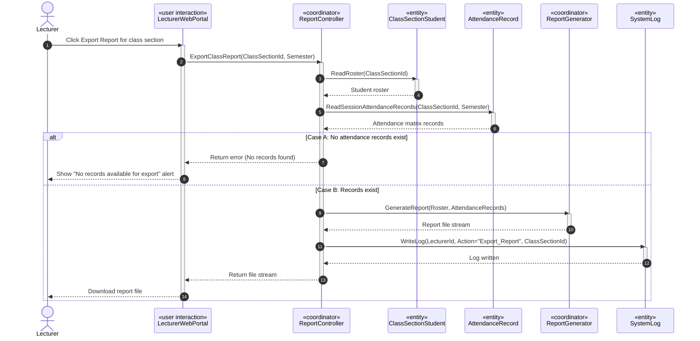
```mermaid
sequenceDiagram
    autonumber
    actor GV as Lecturer
    participant LWP as «user interaction»<br>LecturerWebPortal
    participant RC as «coordinator»<br>ReportController
    participant CSS as «entity»<br>ClassSectionStudent
    participant AR as «entity»<br>AttendanceRecord
    participant REP as «coordinator»<br>ReportGenerator
    participant SL as «entity»<br>SystemLog

    GV->>LWP: Click Export Report for class section
    activate LWP
    LWP->>RC: ExportClassReport(ClassSectionId, Semester)
    activate RC
    RC->>CSS: ReadRoster(ClassSectionId)
    activate CSS
    CSS-->>RC: Student roster
    deactivate CSS
    RC->>AR: ReadSessionAttendanceRecords(ClassSectionId, Semester)
    activate AR
    AR-->>RC: Attendance matrix records
    deactivate AR

    alt Case A: No attendance records exist
        RC-->>LWP: Return error (No records found)
        LWP-->>GV: Show "No records available for export" alert
    else Case B: Records exist
        RC->>REP: GenerateReport(Roster, AttendanceRecords)
        activate REP
        REP-->>RC: Report file stream
        deactivate REP
        RC->>SL: WriteLog(LecturerId, Action="Export_Report", ClassSectionId)
        activate SL
        SL-->>RC: Log written
        deactivate SL
        RC-->>LWP: Return file stream
        deactivate RC
        LWP-->>GV: Download report file
    end
    deactivate LWP
```

#### **Figure II-9B: Communication Diagram for UC09 - Export Attendance Report**
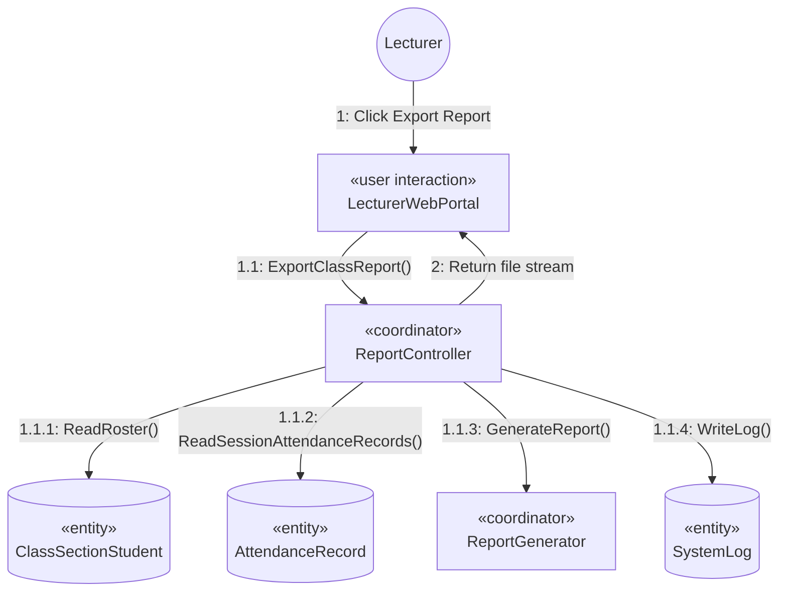
```mermaid
graph TD
    GV((Lecturer))
    LWP["«user interaction»<br>LecturerWebPortal"]
    RC["«coordinator»<br>ReportController"]
    CSS[("«entity»<br>ClassSectionStudent")]
    AR[("«entity»<br>AttendanceRecord")]
    REP["«coordinator»<br>ReportGenerator"]
    SL[("«entity»<br>SystemLog")]

    %% Connections and Messages
    GV -->|"1: Click Export Report"| LWP
    LWP -->|"1.1: ExportClassReport()"| RC
    RC -->|"1.1.1: ReadRoster()"| CSS
    RC -->|"1.1.2: ReadSessionAttendanceRecords()"| AR
    RC -->|"1.1.3: GenerateReport()"| REP
    RC -->|"1.1.4: WriteLog()"| SL
    RC -->|"2: Return file stream"| LWP
```

---

### **10. UC10: Manage System Catalog**

#### **Figure II-10A: Sequence Diagram for UC10 - Manage System Catalog**
```mermaid
sequenceDiagram
    autonumber
    actor AD as Admin
    participant AWP as «user interaction»<br>AdminWebPortal
    participant CC as «coordinator»<br>CatalogController
    participant ACC as «entity»<br>Account
    participant ST as «entity»<br>Student
    participant LT as «entity»<br>Lecturer
    participant SUB as «entity»<br>Subject
    participant CLS as «entity»<br>ClassSection
    participant SL as «entity»<br>SystemLog

    AD->>AWP: Open catalog screen (e.g. Students)
    activate AWP
    AWP->>CC: GetCatalog(catalogType)
    activate CC
    CC-->>AWP: Return list of rows
    deactivate CC
    AWP-->>AD: Render catalog table

    alt Case A: Add new record
        AD->>AWP: Input details and click "Save"
        AWP->>CC: SaveCatalogChange(catalogType, payload)
        activate CC
        CC->>CC: ValidatePayloadFields()
        alt Invalid fields
            CC-->>AWP: Return validation error
            AWP-->>AD: Display error highlighting fields
        else Valid fields
            alt Role = Student
                CC->>ACC: CreateAccount(payload)
                CC->>ST: CreateStudent(payload)
            else Role = Lecturer
                CC->>ACC: CreateAccount(payload)
                CC->>LT: CreateLecturer(payload)
            else Type = Subject
                CC->>SUB: CreateSubject(payload)
            else Type = ClassSection
                CC->>CLS: CreateClassSection(payload)
            end
            CC->>SL: WriteLog(AdminId, Action="Catalog_Change")
            activate SL
            SL-->>CC: Log written
            deactivate SL
            CC-->>AWP: Save successful
            deactivate CC
            AWP-->>AD: Refresh table with success message
        end
    end
    deactivate AWP
```

#### **Figure II-10B: Communication Diagram for UC10 - Manage System Catalog**
```mermaid
graph TD
    AD((Admin))
    AWP["«user interaction»<br>AdminWebPortal"]
    CC["«coordinator»<br>CatalogController"]
    ACC[("«entity»<br>Account")]
    ST[("«entity»<br>Student")]
    LT[("«entity»<br>Lecturer")]
    SUB[("«entity»<br>Subject")]
    CLS[("«entity»<br>ClassSection")]
    SL[("«entity»<br>SystemLog")]

    %% Connections and Messages
    AD -->|"1: Manage catalog"| AWP
    AWP -->|"1.1: GetCatalog() / SaveCatalogChange()"| CC
    CC -->|"1.1.1: CreateAccount() / CreateStudent()"| ST
    CC -->|"1.1.2: CreateLecturer()"| LT
    CC -->|"1.1.3: CreateSubject()"| SUB
    CC -->|"1.1.4: CreateClassSection()"| CLS
    CC -->|"1.1.5: WriteLog()"| SL
    CC -->|"2: Return success/refresh"| AWP
```

---

### **11. UC11: Configure Room Coordinates & Allowed Radius**

#### **Figure II-11A: Sequence Diagram for UC11 - Configure Room Coordinates**
```mermaid
sequenceDiagram
    autonumber
    actor AD as Admin
    participant AWP as «boundary»<br>AdminWebPortal
    participant RCC as «control»<br>RoomConfigurationController
    participant R as «entity»<br>Room
    participant SL as «entity»<br>SystemLog

    AD->>AWP: Click "Room Management"
    activate AWP
    AWP->>RCC: GetRoomsList()
    activate RCC
    RCC->>R: ReadAllRooms()
    activate R
    R-->>RCC: List of Rooms
    deactivate R
    RCC-->>AWP: Display room table
    deactivate RCC
    AWP-->>AD: Show room table with config buttons
    deactivate AWP

    AD->>AWP: Click "Edit Coordinates" for specific Room
    activate AWP
    AWP-->>AD: Open RoomConfigForm with integrated satellite map
    deactivate AWP

    alt Option A: Click on satellite map
        AD->>AWP: Click exact classroom location on map
        activate AWP
        AWP->>AWP: ExtractLatLongFromMapClick()
        AWP-->>AD: Automatically populate Lat & Long fields
        deactivate AWP
    else Option B: Get current GPS (Mobile device at site)
        AD->>AWP: Tap "Get Current GPS Location"
        activate AWP
        AWP->>AWP: RequestBrowserGeoLocationAPI()
        AWP-->>AD: Populate Lat & Long fields with hardware coordinates
        deactivate AWP
    end

    AD->>AWP: Enter "Allowed Radius" (e.g. 20m) & click "Save Config"
    activate AWP
    AWP->>RCC: SaveGeoConfiguration(RoomId, Latitude, Longitude, AllowedRadius)
    activate RCC
    
    RCC->>RCC: ValidateCoordinates(Latitude, Longitude)
    RCC->>RCC: ValidateRadius(AllowedRadius)
    
    alt If coordinates or radius are invalid
        RCC-->>AWP: Return Error: Invalid Geo-data
        AWP-->>AD: Highlight error fields & request correction
    else If configuration is valid
        RCC->>R: UpdateGeoConfig(Latitude, Longitude, AllowedRadius)
        activate R
        R-->>RCC: Update Success
        deactivate R
        
        RCC->>SL: WriteLog(AdminId, Action="Configure_Room", RoomId)
        
        RCC-->>AWP: Return Success: Configurations Saved
        AWP-->>AD: Show confirmation popup & return to room table
    end
    deactivate RCC
    deactivate AWP
```

#### **Figure II-11B: Communication Diagram for UC11 - Configure Room Coordinates**
```mermaid
graph TD
    AD((Admin))
    AWP[«boundary»<br>AdminWebPortal]
    RCC[«control»<br>RoomConfigurationController]
    R[(«entity»<br>Room)]
    SL[(«entity»<br>SystemLog)]

    %% Connections and Messages
    AD -->|"1: Edit Coordinates"| AWP
    AD -->|"2: Click Save Config"| AWP
    AWP -->|"1.1: GetRoomsList()"| RCC
    AWP -->|"2.1: SaveGeoConfiguration()"| RCC
    
    RCC -->|"2.1.1: UpdateGeoConfig()"| R
    RCC -->|"2.1.2: WriteLog()"| SL
    RCC -->|"3: Return Success popup"| AWP
```

---

## **II.2 State diagrams**

In the AFAS system, there are three primary objects whose behaviors and properties change based on their state: `AttendanceVersion` (the active check-in session), `AttendanceRecord` (the student's attendance result), and `Student` (specifically regarding Device Binding state).

---

### **1. Attendance Session State (AttendanceVersion)**
Describes the lifecycle of an attendance QR session started by a lecturer in the classroom.

#### **Figure II-9: State diagram for Attendance Session**
```mermaid
stateDiagram-v2
    [*] --> Inactive : Session created in schedule
    Inactive --> Active_QR : Lecturer clicks "Start Attendance"
    
    state Active_QR {
        [*] --> QR_Active : QR & PIN displayed
        QR_Active --> QR_Refreshed : Timer ticks (10s)
        QR_Refreshed --> QR_Active : Generate new dynamic token
        
        QR_Active --> PIN_Refreshed : Timer ticks (30s)
        PIN_Refreshed --> QR_Active : Generate new PIN code
    }
    
    Active_QR --> Suspended : Network outage detected (Timer Paused)
    Suspended --> Active_QR : Network restored / Lecturer clicks "Resume"
    
    Active_QR --> Active_PIN_Only : Lecturer closes QR scanner / opens PIN manually
    Active_PIN_Only --> Closed : Dynamic timer expires / Session close clicked
    
    Active_QR --> Closed : Lecturer clicks "Stop Attendance"
    Suspended --> Closed : Class scheduled time ends
    
    Closed --> [*] : Attendance finalized & Report exported
```

---

### **2. Attendance Record State (AttendanceRecord)**
Describes the lifecycle of a student's check-in telemetry audit process when submitted to the server.

#### **Figure II-10: State diagram for Attendance Record**
```mermaid
stateDiagram-v2
    [*] --> Submitted : Student sends check-in telemetry
    
    Submitted --> Verifying_Token : Server matches Dynamic QR Token (Layer 1)
    
    Verifying_Token --> Failed_Expired : Token older than 15s
    Failed_Expired --> [*] : Rejection logged
    
    Verifying_Token --> Verifying_Location : Token is valid
    
    Verifying_Location --> Verifying_Device : GPS Distance < AllowedRadius (Layer 2)
    Verifying_Location --> Failed_Location_Fraud : GPS Distance > AllowedRadius
    Failed_Location_Fraud --> [*] : Saved as "Fraud_Declined" in system
    
    Verifying_Device --> Verifying_Biometrics : DeviceUUID matches bound device (Layer 3)
    Verifying_Device --> Failed_Device_Mismatch : DeviceUUID belongs to another student
    Failed_Device_Mismatch --> [*] : Rejection logged
    
    Verifying_Biometrics --> Checked_In_Present : Face ID match score > 85%
    Verifying_Biometrics --> Failed_Face_Mismatch : Face ID matching fails
    Failed_Face_Mismatch --> [*] : Rejection logged
    
    Checked_In_Present --> Checked_In_Late : Checked-in time > Class start time
    
    Checked_In_Present --> [*] : Saved as "Present" / Selfie image deleted
    Checked_In_Late --> [*] : Saved as "Late" / Selfie image deleted
```

---

### **3. Student Device Binding State**
Describes the lifecycle of a student account's hardware physical binding constraint.

#### **Figure II-11: State diagram for Device Binding**
```mermaid
stateDiagram-v2
    [*] --> Unbound : Account created by Admin
    Unbound --> Bound : First login on App (UUID registered)
    
    Bound --> Reset_Requested : Student clicks "Reset Device" on new phone
    Reset_Requested --> Bound : OTP validation fails 3 times (Lockout 24h)
    
    Reset_Requested --> Unbound : OTP code verified successfully via school email
    Bound --> Admin_Released : Admin manually releases binding (special request)
    Admin_Released --> Unbound : Device UUID cleared from profile
```

---
