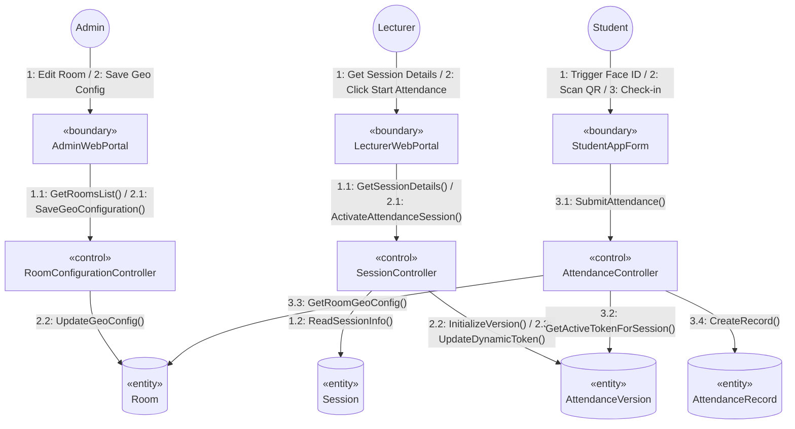
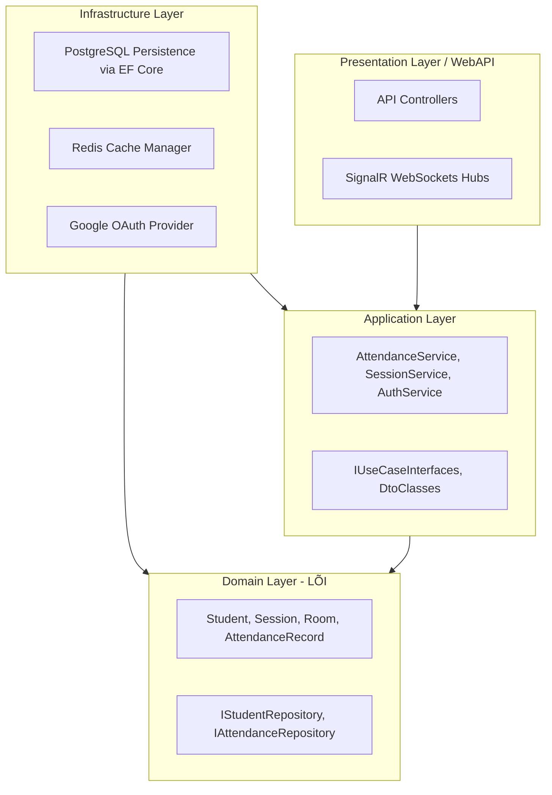
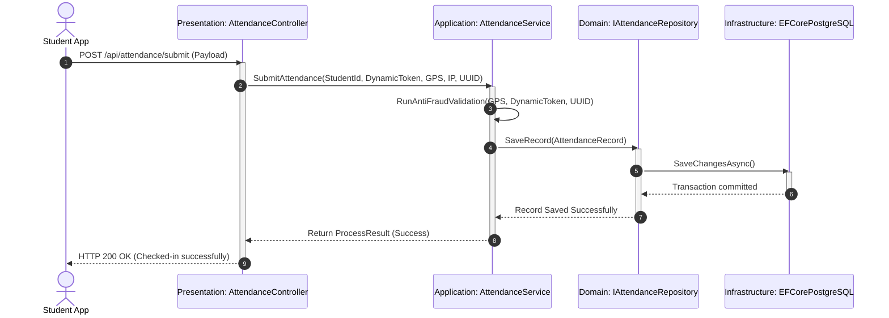
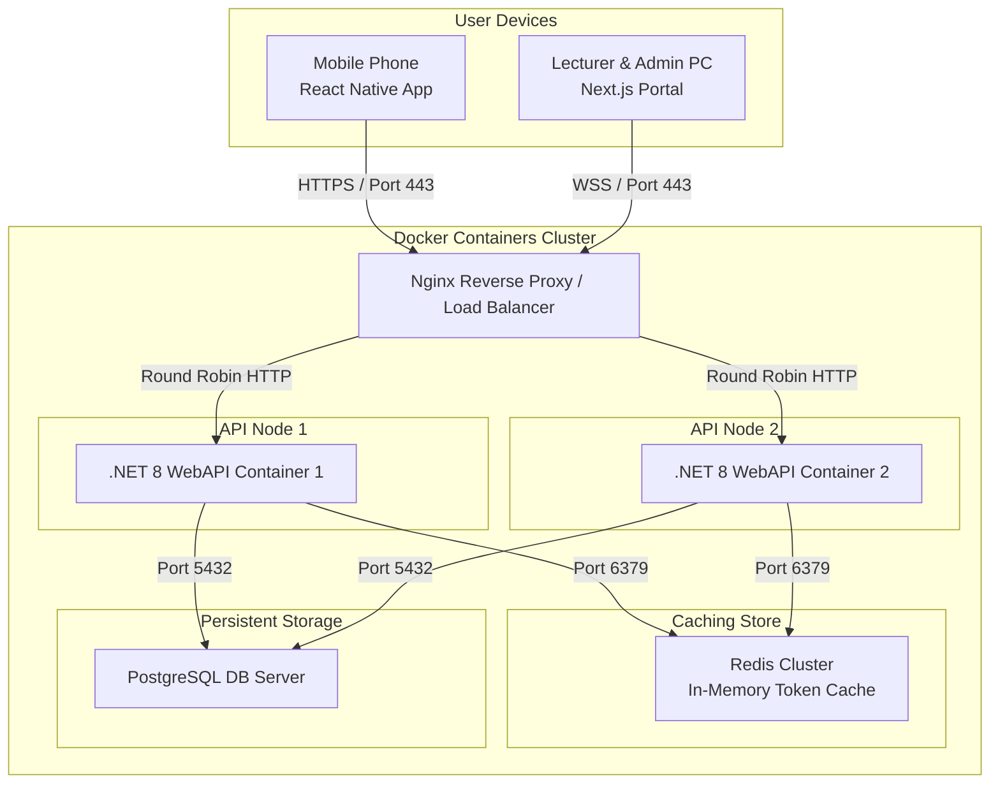
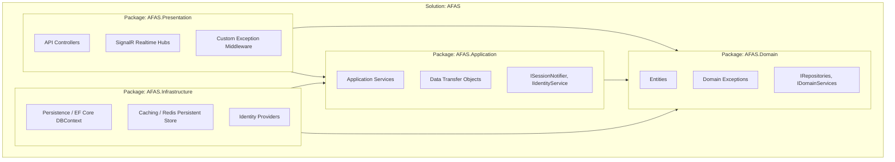
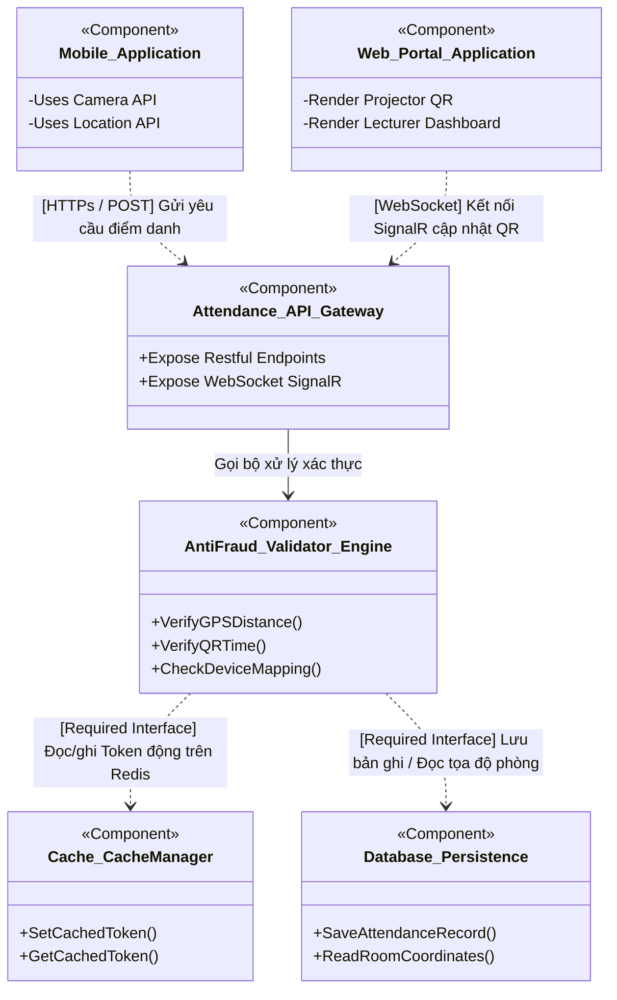

## **III. Design specification**

## **III.0 Analysis-to-Design Transformation Matrix**

This section details how the Platform-Independent analysis objects (Boundary, Control, Entity) are mapped onto concrete Platform-Specific design-level abstractions under the Clean Architecture framework.

### **BCE Analysis Object to Design-Level Component Mapping**

The following matrix defines how boundary, control, and entity elements are realized in the design, specifying target layers and design class patterns:

| **Analysis Object** | **BCE Category** | **Target Design Component / Class** | **Target Design Layer** | **Realization Strategy & Design Pattern** |
| :--- | :--- | :--- | :--- | :--- |
| `LoginForm`, `GoogleAuthGateway` | `«boundary»` | `AccountController`, `AuthenticationService` | Presentation / Application | Standard Web API Controller using JWT token generation and external Google SDK integrations. |
| `StudentAppForm`, `LecturerWebPortal`, `AdminWebPortal` | `«boundary»` | `AppClient`, `WebClient` | User Interface | React Native App & Next.js SPA utilizing Axios/Fetch API to call JSON endpoints. |
| `MobileDeviceHardware` | `«boundary»` | `DeviceTelemetryService`, `BiometricAuthManager` | Client Infrastructure | Native hardware wrappers using Expo LocalAuthentication and GeoLocation APIs. |
| `SchoolWifiGateway` | `«boundary»` | `SchoolWifiGateway` | Client Infrastructure | Reads WifiSSID and client gateway IP to append to check-in payload. |
| `AuthenticationController` | `«control»` | `AuthenticationService`, `UserManager` | Application | Business logic containing password hashing (BCrypt) and user profile validation. |
| `DeviceBindingController` | `«control»` | `DeviceBindingService` | Application | Checks binding database constraints and coordinates email OTP triggers. |
| `AttendanceController` | `«control»` | `AttendanceService`, `AntiFraud_Validator_Engine` | Application | Entrypoint coordinator validating GPS range, QR/PIN keys, and binding states. |
| `SessionController` | `«control»` | `SessionService` | Application | Manages session setup, start/stop timers, and initializes attendance version records. |
| `ReportController`, `ExcelReportGenerator` | `«control»` | `ReportService`, `ClosedXMLReportGenerator` | Application / Infrastructure | Aggregates database queries and streams output binary array using ClosedXML. |
| `CatalogController` | `«control»` | `CatalogService` | Application | Orchestrates basic catalog CRUD actions and handles Excel roster seeding. |
| `RoomConfigurationController` | `«control»` | `RoomService` | Application | Manages classroom metadata and coordinates allowed radius settings. |
| `QRRefreshTimer`, `PINRefreshTimer` | `«control»` | `RedisCacheManager`, `BackgroundWorker` | Infrastructure | Scheduled Redis cache expire-keys triggered by .NET IHostedService. |
| `AttendanceHub` | `«control»` | `AttendanceHub`, `SignalRRealtimeNotifier` | Presentation / Infrastructure | SignalR WebSocket hub maintaining active connection state and broadcasting check-in events. |
| `Account`, `Student`, `Lecturer` | `«entity»` | `Account`, `Student`, `Lecturer` | Domain (Entities) | Persistent domain model classes containing raw business validation rules. |
| `Subject`, `ClassSection`, `ClassSectionStudent`, `Session` | `«entity»` | `Subject`, `ClassSection`, `ClassSectionStudent`, `Session` | Domain (Entities) | Pure domain representations of structural curricular metadata. |
| `Room` | `«entity»` | `Room` | Domain (Entities) | Persistent entity representing geofence target coordinates. |
| `AttendanceVersion` | `«entity»` | `AttendanceVersion`, `ActiveSessionCache` | Domain / Infrastructure | Holds currently active QR/PIN tokens inside SQL or in-memory Redis cache. |
| `AttendanceRecord` | `«entity»` | `AttendanceRecord` | Domain (Entities) | Stores transactional record containing status, telemetry evidence, and timestamps. |
| `SystemLog` | `«entity»` | `SystemLog` | Domain (Entities) | Stores audit trail of security adjustments and system operations. |

---

### **III.0.1 Use Case to Design Realization Matrix**

This matrix establishes the direct traceability between the requirement use cases (Section I.6.2) and the corresponding controllers, services, repositories, and UI views that realize them in the design:

| **Use Case ID & Name** | **UI / Boundary Component** | **Design Controller** | **Design Service / Engine** | **Design Repository / DB Access** | **WebSocket / Push Component** |
| :--- | :--- | :--- | :--- | :--- | :--- |
| **UC01: Login** | `LoginForm`, Google SDK UI | `AccountController` | `AuthenticationService` | `IAccountRepository` | None |
| **UC02: Register Device UUID** | `StudentAppForm` (Mobile) | `DeviceBindingController` | `DeviceBindingService`, `EmailOtpService` | `IStudentRepository`, `ISystemLogRepository` | None |
| **UC03: Scan Dynamic QR** | `StudentAppScanner` (Camera/GPS) | `AttendanceController` | `AttendanceService`, `AntiFraud_Validator_Engine` | `IAttendanceRecordRepository`, `IRoomRepository` | `AttendanceHub` (SignalR client update) |
| **UC04: View History** | `StudentAppHistory` (Calendar) | `AttendanceController` | `AttendanceService` | `IAttendanceRecordRepository` | None |
| **UC05: PIN Fallback** | `StudentAppPinForm` (Keypad) | `AttendanceController` | `AttendanceService`, `AntiFraud_Validator_Engine` | `IAttendanceRecordRepository`, `IRoomRepository` | None |
| **UC06: Activate QR Session** | `LecturerWebPresentation` | `SessionController` | `SessionService`, `RedisCacheManager` | `ISessionRepository`, `IAttendanceVersionRepository` | `AttendanceHub` (Broadcast new QR) |
| **UC07: Real-time Monitor** | `LecturerWebMonitorGrid` | `SessionController` | `SessionService` | `IAttendanceRecordRepository`, `IClassSectionRepository` | `AttendanceHub` (Subscribe to live check-ins) |
| **UC08: Manual Adjust** | `LecturerWebAdjustmentModal` | `AttendanceController` | `AttendanceService` | `IAttendanceRecordRepository`, `ISystemLogRepository` | `AttendanceHub` (Broadcast status updates) |
| **UC09: Export Report** | `LecturerWebExportButton` | `ReportController` | `ReportService`, `ExcelReportGenerator` | `IAttendanceRecordRepository`, `IClassSectionRepository` | None |
| **UC10: Manage Catalog** | `AdminWebCatalogGrid` | `CatalogController` | `CatalogService` | `IStudentRepository`, `ILecturerRepository`, `ISubjectRepository` | None |
| **UC11: Configure Room** | `AdminWebRoomConfigForm` | `RoomController` | `RoomService` | `IRoomRepository`, `ISystemLogRepository` | None |

---

### **III.0.2 NFR Realization and Verification Matrix**

The non-functional requirements (Section I.4) are mapped to specific engineering designs and verified via precise testing strategies as detailed below:

| **NFR ID** | **Concern** | **Target Metric** | **Engineering Design Realization** | **Verification Test Case / Strategy** |
| :--- | :--- | :--- | :--- | :--- |
| **NFR-01** | High Concurrency | Support 100+ concurrent scans per second per session without database locks. | - Read-heavy dynamic tokens are cached and validated in **Redis** in-memory store.<br>- Async-await non-blocking database writes in .NET API.<br>- Database index on `attendance_records(session_id, student_id)`. | `TC-NFR-001` (JMeter Load Test executing 1000 requests/sec, validating error rate < 0.5% and response time < 500ms). |
| **NFR-02** | Geofence Precision | Support geo-boundary checks with coordinate deviation margins up to 20m. | - Implement **Haversine formula** using double-precision floats on the API server.<br>- Database stores customizable `allowed_radius` in `rooms` table to accommodate indoor GPS drift. | `TC-NFR-002` (Unit tests verifying distance calculations for edge locations like 19.9m, 20.1m, and 50m). |
| **NFR-03** | Usability / Security | Check-in scan completes in < 5 seconds with automatic photo purge. | - Mobile app requests native local biometric authentication (Face ID/Fingerprint).<br>- Local image files are purged immediately from storage upon verification request termination. | `TC-NFR-003` (Integration test checking client execution timers and confirming temporary storage directory is empty after check-in). |
| **NFR-04** | Solution Maintainability | Clean architecture layering with clean DB decoupling. | - Strict dependency inversion (.NET Core Web API).<br>- Decouple domain models from database models using mapping classes.<br>- Strict separation of concerns (boundary controllers vs domain service engines). | `TC-UNIT-001` through `TC-UNIT-003` (Automated CI/CD build scripts checking layer dependencies and structural unit tests). |

---

## **III.1 Integrated Communication Diagrams**

To transition from analysis to design, we integrate the separate communication diagrams developed during the analysis phase into a single, unified view. This synthesis helps identify the complete set of dependencies and methods required on each class to implement the system.

#### **Figure III-1: Integrated Communication Diagram**


### **Transition from Analysis-level to Design-level Specification**
Analysis-level models decompose the problem domain using generic abstractions (`«boundary»`, `«control»`, `«entity»`) without considering technology stacks. In contrast, Design-level models specify the concrete architectural implementation:

1.  **Splitting Lớp Thực Thể (Entity Classes):** Every entity class in the analysis model is split into two distinct structures during design:
    *   **Data Abstraction Class:** Encapsulates the clean business attributes in the Domain layer (e.g., `Product`, `Student`, `AttendanceRecord` C# objects).
    *   **Database Wrapper Class (Repository Pattern):** Handles persistence logic (CRUD) using the ORM (Entity Framework Core) connected to PostgreSQL. It isolates the Domain layer from raw database access.
2.  **Introduction of Interfaces & Dependency Injection:** To adhere to the Dependency Inversion Principle (DIP), services communicate via abstract interfaces (`IRoomRepository`, `IAttendanceService`) rather than concrete classes. These dependencies are resolved dynamically via the C# built-in Dependency Injection container.
3.  **Boundary to Controllers Mapping:** Boundary objects map to WebAPI REST controllers (Presentation layer) or SignalR Hubs for WebSockets, managing JSON serialization, request validation, and HTTP response codes.

---

## **III.2 System High-Level Design**

The AFAS system is designed using a **Clean Architecture** (4-layer concentric system), ensuring ease of maintenance (**NF-04**) and loose coupling.

### **2.1 Static View (Kiến Trúc Phân Tầng)**


### **2.2 Dynamic View (Luồng Gọi Xuyên Tầng)**


### **2.3 Deployment View (Figure III-2: Sơ đồ Triển khai)**


---

## **III.3 Component and Package Diagram**

The static structural organization of source code packages and structural interaction interfaces.

### **3.1 Package Diagram (Figure III-3)**


### **3.2 Component Diagram (Figure III-4)**


### **Decomposition Criteria and Justification**
We decompose the AFAS architecture into packages and components based on three core software design criteria:
1.  **Single Responsibility Principle (SRP):** Each package has a distinct reason to change. `AFAS.Domain` changes only when core business rules change. `AFAS.Infrastructure` changes only when third-party libraries or DB drivers change.
2.  **High Cohesion (Communicational & Functional Cohesion):** Classes that work together to fulfill a single cohesive purpose are grouped together (e.g., all geofencing and dynamic token validations are encapsulated within `AntiFraud_Validator_Engine`).
3.  **Low Coupling via Dependency Inversion:** Components depend only on abstract interfaces rather than concrete subclasses. For instance, the validator engine calls `ICacheManager` to fetch tokens, meaning we can swap out the Redis cache component for an in-memory cache without changing the validation logic.

---

## **III.4 Detail Design**

The detailed design classes are mapped directly from the analysis model, implementing concrete properties, public methods, and visibility specifiers.

#### **Figure III-5: Detailed Design Class Diagram**

```mermaid
classDiagram
    %% --- PRESENTATION LAYER ---
    class AttendanceController {
        <<Boundary / WebAPI>>
        -IAttendanceService _attendanceService
        +SubmitAttendance(AttendanceDto dto) Task~IActionResult~
        +GetStudentHistory(string studentId) Task~IActionResult~
    }

    class AccountController {
        <<Boundary / WebAPI>>
        -IAuthenticationService _authService
        +LoginCredentials(LoginDto dto) Task~IActionResult~
        +LoginGoogle(GoogleLoginDto dto) Task~IActionResult~
    }

    class RoomController {
        <<Boundary / WebAPI>>
        -IRoomService _roomService
        +SaveRoomConfiguration(RoomDto dto) Task~IActionResult~
        +GetRooms() Task~IActionResult~
    }

    class ReportController {
        <<Boundary / WebAPI>>
        -IReportService _reportService
        +ExportClassReport(string classId) Task~IActionResult~
    }

    %% --- APPLICATION LAYER ---
    class IAttendanceService {
        <<Interface / Application>>
        +ProcessCheckin(AttendanceDto dto) Task~Result~CheckinResultDto~~
        +GetHistory(string studentId) Task~List~AttendanceRecordDto~~
    }

    class AttendanceService {
        <<Control / Application>>
        -IAttendanceRepository _attendanceRepo
        -IRoomRepository _roomRepo
        -ICacheManager _cacheManager
        -IRealtimeNotifier _notifier
        +ProcessCheckin(AttendanceDto dto) Task~Result~CheckinResultDto~~
        +GetHistory(string studentId) Task~List~AttendanceRecordDto~~
        -CalculateDistance(double lat1, double lon1, double lat2, double lon2) double
    }

    class IAuthenticationService {
        <<Interface / Application>>
        +AuthenticateCredentials(string username, string password) Task~Result~string~~
        +AuthenticateGoogle(string idToken) Task~Result~string~~
    }

    class AuthenticationService {
        <<Control / Application>>
        -IAccountRepository _accountRepo
        -IStudentRepository _studentRepo
        +AuthenticateCredentials(string username, string password) Task~Result~string~~
        +AuthenticateGoogle(string idToken) Task~Result~string~~
    }

    class IRoomService {
        <<Interface / Application>>
        +UpdateRoomGeo(RoomDto dto) Task~Result~bool~~
        +GetAllRooms() Task~List~RoomDto~~
    }

    class RoomService {
        <<Control / Application>>
        -IRoomRepository _roomRepo
        +UpdateRoomGeo(RoomDto dto) Task~Result~bool~~
        +GetAllRooms() Task~List~RoomDto~~
    }

    class IReportService {
        <<Interface / Application>>
        +GenerateExcelReport(string classId) Task~byte[]~
    }

    class ReportService {
        <<Control / Application>>
        -IAttendanceRepository _attendanceRepo
        -IExcelGenerator _excelGenerator
        +GenerateExcelReport(string classId) Task~byte[]~
    }

    %% --- DOMAIN CORE LAYER ---
    class AttendanceRecord {
        <<Domain Entity>>
        +string RecordId
        +string StudentId
        +string SessionId
        +DateTime CheckedInAt
        +double CheckedInLat
        +double CheckedInLong
        +double Distance
        +string WifiSSID
        +string PublicIP
        +string DeviceUUID
        +string SelfiePath
        +string Status
        +string VerificationMode
    }

    class Room {
        <<Domain Entity>>
        +string RoomId
        +string RoomName
        +double Latitude
        +double Longitude
        +double AllowedRadius
    }

    class Account {
        <<Domain Entity>>
        +string Id
        +string Email
        +string PasswordHash
        +string FullName
        +string Role
    }

    %% --- INFRASTRUCTURE LAYOUT ---
    class IAttendanceRepository {
        <<Interface / Domain>>
        +GetByIdAsync(string id) Task~AttendanceRecord~
        +AddAsync(AttendanceRecord entity) Task
        +GetStudentProfileAsync(string studentId) Task~Student~
        +GetBySessionIdAsync(string sessionId) Task~List~AttendanceRecord~~
    }

    class IRoomRepository {
        <<Interface / Domain>>
        +GetRoomGeoConfigAsync(string sessionId) Task~RoomGeoConfig~
        +GetAllRoomsAsync() Task~List~Room~~
        +UpdateGeoConfigAsync(Room room) Task
    }

    class ISessionRepository {
        <<Interface / Domain>>
        +GetSessionByIdAsync(string sessionId) Task~Session~
        +GetActiveSessionForLecturerAsync(string lecturerId) Task~Session~
        +UpdateSessionAsync(Session session) Task
    }

    class IAccountRepository {
        <<Interface / Domain>>
        +GetByEmailAsync(string email) Task~Account~
        +GetByUsernameAsync(string username) Task~Account~
        +CreateAccountAsync(Account account) Task
    }

    class IStudentRepository {
        <<Interface / Domain>>
        +GetByStudentIdAsync(string studentId) Task~Student~
        +UpdateDeviceUUIDAsync(string studentId, string deviceUUID) Task
        +ClearDeviceUUIDAsync(string studentId) Task
    }

    class ICacheManager {
        <<Interface / Application>>
        +GetTokenAsync(string key) Task~string~
        +SetTokenAsync(string key, string value, TimeSpan expiry) Task
    }

    class AttendanceRepository {
        <<Database Wrapper / Infrastructure>>
        -DbContext _dbContext
        +GetByIdAsync(string id) Task~AttendanceRecord~
        +AddAsync(AttendanceRecord entity) Task
    }

    class RedisCacheManager {
        <<Infrastructure Cache>>
        -IConnectionMultiplexer _redis
        +GetTokenAsync(string key) Task~string~
        +SetTokenAsync(string key, string value, TimeSpan expiry) Task
    }

    %% Dependencies injection
    AttendanceController --> IAttendanceService
    AccountController --> IAuthenticationService
    RoomController --> IRoomService
    ReportController --> IReportService

    IAttendanceService <|.. AttendanceService
    IAuthenticationService <|.. AuthenticationService
    IRoomService <|.. RoomService
    IReportService <|.. ReportService

    AttendanceService --> IAttendanceRepository
    AttendanceService --> IRoomRepository
    AttendanceService --> ICacheManager
    AttendanceService --> AttendanceRecord

    AuthenticationService --> IAccountRepository
    AuthenticationService --> IStudentRepository

    RoomService --> IRoomRepository
    ReportService --> IAttendanceRepository

    IAttendanceRepository <|.. AttendanceRepository
    ICacheManager <|.. RedisCacheManager
```


---

## **III.5 Database Design**

### **III.5.0 Entity-to-Database Transformation Matrix**

This matrix maps the conceptual analysis entity classes (defined in the Domain Model) to their physical table structures in PostgreSQL:

| **UML Domain Entity Class** | **Target Physical Table** | **Primary Key** | **Attributes to Columns Mapping** | **Foreign Keys & Relations** |
| :--- | :--- | :--- | :--- | :--- |
| `Account` | `accounts` | `id` (UUID) | `email` -> `email`, `password_hash` -> `password_hash`, `full_name` -> `full_name`, `role` -> `role` | None |
| `Student` | `students` | `student_id` (VARCHAR) | `account_id` -> `account_id`, `device_uuid` -> `device_uuid`, `registered_face_template` -> `registered_face_template` | `account_id` -> `accounts.id` (1:1) |
| `Lecturer` | `lecturers` | `lecturer_id` (VARCHAR) | `account_id` -> `account_id`, `department` -> `department` | `account_id` -> `accounts.id` (1:1) |
| `Subject` | `subjects` | `subject_id` (VARCHAR) | `subject_name` -> `subject_name`, `credits` -> `credits` | None |
| `ClassSection` | `class_sections` | `class_section_id` (UUID) | `class_section_name` -> `class_section_name`, `semester` -> `semester` | `subject_id` -> `subjects.subject_id` (N:1), `lecturer_id` -> `lecturers.lecturer_id` (N:1) |
| `ClassSectionStudent` | `class_section_students` | `(class_section_id, student_id)` | `class_section_id` -> `class_section_id`, `student_id` -> `student_id` | `class_section_id` -> `class_sections.class_section_id` (M:N junction), `student_id` -> `students.student_id` (M:N junction) |
| `Room` | `rooms` | `room_id` (VARCHAR) | `room_name` -> `room_name`, `latitude` -> `latitude`, `longitude` -> `longitude`, `allowed_radius` -> `allowed_radius` | None |
| `Session` | `sessions` | `session_id` (UUID) | `session_date` -> `session_date`, `start_time` -> `start_time`, `end_time` -> `end_time` | `class_section_id` -> `class_sections.class_section_id` (N:1), `room_id` -> `rooms.room_id` (N:1) |
| `AttendanceVersion` | `attendance_versions` | `version_id` (UUID) | `session_id` -> `session_id`, `is_active` -> `is_active`, `active_token` -> `active_token`, `active_pin` -> `active_pin`, `refreshed_at` -> `refreshed_at` | `session_id` -> `sessions.session_id` (1:1) |
| `AttendanceRecord` | `attendance_records` | `record_id` (UUID) | `student_id` -> `student_id`, `session_id` -> `session_id`, `checked_in_at` -> `checked_in_at`, `checked_in_lat` -> `checked_in_lat`, `checked_in_long` -> `checked_in_long`, `distance` -> `distance`, `wifi_ssid` -> `wifi_ssid`, `public_ip` -> `public_ip`, `device_uuid` -> `device_uuid`, `selfie_path` -> `selfie_path`, `status` -> `status`, `verification_mode` -> `verification_mode` | `student_id` -> `students.student_id` (N:1), `session_id` -> `sessions.session_id` (N:1) |
| `SystemLog` | `system_logs` | `log_id` (UUID) | `account_id` -> `account_id`, `action` -> `action`, `entity_type` -> `entity_type`, `entity_id` -> `entity_id`, `description` -> `description`, `created_at` -> `created_at` | `account_id` -> `accounts.id` (N:1) |

---

### **III.5.1 Rule-to-Constraint and Index Mapping**

This matrix maps each business anti-fraud validation rule (Section I.7) to physical database-level integrity constraints, keys, indices, and check conditions to ensure data validation is enforced at the database layer:

| **Rule ID** | **Anti-Fraud Concern** | **PostgreSQL Enforcing Mechanism** | **SQL Construct / Definition** | **Design / Optimization Rationale** |
| :--- | :--- | :--- | :--- | :--- |
| **AR-01** | QR/PIN Session Validation | Foreign Key constraint on `attendance_versions(session_id)` and Unique constraint. | `session_id VARCHAR(36) UNIQUE REFERENCES sessions(session_id)` | Prevents a session from having multiple active QR tokens or overlapping versions. |
| **AR-02** | Geofence Bounds Validation | Checked-in coordinate float fields and Allowed Radius configuration fields. | `latitude DOUBLE PRECISION NOT NULL`, `allowed_radius DOUBLE PRECISION CHECK (allowed_radius > 0)` | Float precision prevents loss of coordinates; check constraint ensures non-negative geofence radius. |
| **AR-03** | Device UUID Binding | Unique Constraint on Student account mapping. | `account_id VARCHAR(36) UNIQUE REFERENCES accounts(id)` | Ensures that each student account can only belong to exactly one student profile and device binding. |
| **AR-05** | Duplicate Scan Block | Composite Unique Constraint on student check-in records. | `CONSTRAINT uq_student_session UNIQUE (student_id, session_id)` | Stops race conditions and duplicate scans by returning a hard database violation on subsequent inserts. |
| **AR-07** | Override Audit Integrity | Check constraint on adjusted verification modes and logs. | `CHECK (verification_mode IN ('QR', 'PIN', 'Offline_Cached', 'Manual'))` | Enforces that any non-automatic adjustments are classified as `Manual` and traceable back to the supervisor. |
| **NFR-01** | Concurrency Performance | B-Tree composite index on attendance lookup paths. | `CREATE INDEX idx_attendance_lookup ON attendance_records(session_id, student_id)` | Optimizes live real-time query monitors and avoids locks by index-searching scans. |

---

### **5.1 Physical Database Schema Table Specs**

#### **Table III-1: Accounts Table**
*   **Table Name:** `accounts`
*   **Columns:**
    *   `id` VARCHAR(36) [PK]
    *   `email` VARCHAR(100) [UNIQUE, NOT NULL]
    *   `password_hash` VARCHAR(255) [NOT NULL]
    *   `full_name` VARCHAR(100) [NOT NULL]
    *   `role` VARCHAR(20) [NOT NULL CHECK (role IN ('Student', 'Lecturer', 'Admin'))]
    *   `created_at` TIMESTAMP [DEFAULT CURRENT_TIMESTAMP]

#### **Table III-2: Students Table**
*   **Table Name:** `students`
*   **Columns:**
    *   `student_id` VARCHAR(20) [PK]
    *   `account_id` VARCHAR(36) [FK -> accounts.id, UNIQUE, NOT NULL]
    *   `device_uuid` VARCHAR(100) [NULLABLE]
    *   `registered_face_template` TEXT [NULLABLE]

#### **Table III-3: Rooms Table**
*   **Table Name:** `rooms`
*   **Columns:**
    *   `room_id` VARCHAR(20) [PK]
    *   `room_name` VARCHAR(50) [NOT NULL]
    *   `latitude` DOUBLE PRECISION [NOT NULL]
    *   `longitude` DOUBLE PRECISION [NOT NULL]
    *   `allowed_radius` DOUBLE PRECISION [NOT NULL, DEFAULT 20.0]

#### **Table III-4: Attendance Records Table**
*   **Table Name:** `attendance_records`
*   **Columns:**
    *   `record_id` VARCHAR(36) [PK]
    *   `student_id` VARCHAR(20) [FK -> students.student_id, NOT NULL]
    *   `session_id` VARCHAR(36) [FK -> sessions.session_id, NOT NULL]
    *   `checked_in_at` TIMESTAMP [NOT NULL, DEFAULT CURRENT_TIMESTAMP]
    *   `checked_in_lat` DOUBLE PRECISION [NOT NULL]
    *   `checked_in_long` DOUBLE PRECISION [NOT NULL]
    *   `distance` DOUBLE PRECISION [NOT NULL]
    *   `wifi_ssid` VARCHAR(100)
    *   `public_ip` VARCHAR(45)
    *   `device_uuid` VARCHAR(100) [NOT NULL]
    *   `selfie_path` VARCHAR(255)
    *   `status` VARCHAR(20) [NOT NULL CHECK (status IN ('Present', 'Late', 'Absent', 'Fraud_Declined'))]
    *   `verification_mode` VARCHAR(20) [NOT NULL CHECK (verification_mode IN ('QR', 'PIN', 'Offline_Cached', 'Manual'))]

#### **Table III-5: Lecturers Table**
*   **Table Name:** `lecturers`
*   **Columns:**
    *   `lecturer_id` VARCHAR(20) [PK]
    *   `account_id` VARCHAR(36) [FK -> accounts.id, UNIQUE, NOT NULL]
    *   `department` VARCHAR(100) [NOT NULL]

#### **Table III-6: Subjects Table**
*   **Table Name:** `subjects`
*   **Columns:**
    *   `subject_id` VARCHAR(20) [PK]
    *   `subject_name` VARCHAR(100) [NOT NULL]
    *   `credits` INT [NOT NULL]

#### **Table III-7: Class Sections Table**
*   **Table Name:** `class_sections`
*   **Columns:**
    *   `class_section_id` VARCHAR(36) [PK]
    *   `class_section_name` VARCHAR(50) [NOT NULL]
    *   `subject_id` VARCHAR(20) [FK -> subjects.subject_id, NOT NULL]
    *   `lecturer_id` VARCHAR(20) [FK -> lecturers.lecturer_id, NOT NULL]
    *   `semester` VARCHAR(20) [NOT NULL]

#### **Table III-8: Class Section Students Table**
*   **Table Name:** `class_section_students`
*   **Columns:**
    *   `class_section_id` VARCHAR(36) [FK -> class_sections.class_section_id, NOT NULL]
    *   `student_id` VARCHAR(20) [FK -> students.student_id, NOT NULL]
    *   `enrolled_at` TIMESTAMP [DEFAULT CURRENT_TIMESTAMP]
    *   **PK Constraint:** Composite Primary Key `(class_section_id, student_id)`

#### **Table III-9: Sessions Table**
*   **Table Name:** `sessions`
*   **Columns:**
    *   `session_id` VARCHAR(36) [PK]
    *   `class_section_id` VARCHAR(36) [FK -> class_sections.class_section_id, NOT NULL]
    *   `room_id` VARCHAR(20) [FK -> rooms.room_id, NOT NULL]
    *   `session_date` DATE [NOT NULL]
    *   `start_time` TIME [NOT NULL]
    *   `end_time` TIME [NOT NULL]

#### **Table III-10: Attendance Versions Table**
*   **Table Name:** `attendance_versions`
*   **Columns:**
    *   `version_id` VARCHAR(36) [PK]
    *   `session_id` VARCHAR(36) [FK -> sessions.session_id, UNIQUE, NOT NULL]
    *   `is_active` BOOLEAN [NOT NULL, DEFAULT FALSE]
    *   `active_token` VARCHAR(255) [NULLABLE]
    *   `active_pin` VARCHAR(6) [NULLABLE]
    *   `refreshed_at` TIMESTAMP [NULLABLE]

#### **Table III-11: System Logs Table**
*   **Table Name:** `system_logs`
*   **Columns:**
    *   `log_id` VARCHAR(36) [PK]
    *   `account_id` VARCHAR(36) [FK -> accounts.id, NOT NULL]
    *   `action` VARCHAR(50) [NOT NULL]
    *   `entity_type` VARCHAR(50) [NOT NULL]
    *   `entity_id` VARCHAR(36) [NOT NULL]
    *   `description` TEXT [NOT NULL]
    *   `created_at` TIMESTAMP [DEFAULT CURRENT_TIMESTAMP]

### **5.2 SQL DDL Scripts and Indexes**
```sql
-- ============================================================
-- AFAS Physical Database Schema — PostgreSQL DDL (All 11 Tables)
-- ============================================================

-- 1. Core Credential Catalog
CREATE TABLE accounts (
    id VARCHAR(36) PRIMARY KEY,
    email VARCHAR(100) UNIQUE NOT NULL,
    password_hash VARCHAR(255) NOT NULL,
    full_name VARCHAR(100) NOT NULL,
    role VARCHAR(20) NOT NULL CHECK (role IN ('Student', 'Lecturer', 'Admin')),
    created_at TIMESTAMP NOT NULL DEFAULT CURRENT_TIMESTAMP
);

-- 2. Student Profile (1:1 Account)
CREATE TABLE students (
    student_id VARCHAR(20) PRIMARY KEY,
    account_id VARCHAR(36) UNIQUE NOT NULL,
    device_uuid VARCHAR(100),
    registered_face_template TEXT,
    FOREIGN KEY (account_id) REFERENCES accounts(id) ON DELETE CASCADE
);

-- 3. Lecturer Profile (1:1 Account)
CREATE TABLE lecturers (
    lecturer_id VARCHAR(20) PRIMARY KEY,
    account_id VARCHAR(36) UNIQUE NOT NULL,
    department VARCHAR(100),
    FOREIGN KEY (account_id) REFERENCES accounts(id) ON DELETE CASCADE
);

-- 4. Subject Catalog
CREATE TABLE subjects (
    subject_code VARCHAR(20) PRIMARY KEY,
    subject_name VARCHAR(150) NOT NULL,
    credits INT NOT NULL CHECK (credits > 0)
);

-- 5. Classroom Geofence Catalog
CREATE TABLE rooms (
    room_id VARCHAR(20) PRIMARY KEY,
    room_name VARCHAR(50) NOT NULL,
    latitude DOUBLE PRECISION NOT NULL,
    longitude DOUBLE PRECISION NOT NULL,
    allowed_radius DOUBLE PRECISION NOT NULL DEFAULT 20.0
);

-- 6. Class Section Assignments
CREATE TABLE class_sections (
    class_section_id VARCHAR(30) PRIMARY KEY,
    class_section_name VARCHAR(100) NOT NULL,
    subject_code VARCHAR(20) NOT NULL,
    lecturer_id VARCHAR(20) NOT NULL,
    semester VARCHAR(20) NOT NULL,
    FOREIGN KEY (subject_code) REFERENCES subjects(subject_code) ON DELETE RESTRICT,
    FOREIGN KEY (lecturer_id) REFERENCES lecturers(lecturer_id) ON DELETE RESTRICT
);

-- 7. Class Enrollment Roster (Many-to-Many)
CREATE TABLE class_section_students (
    class_section_id VARCHAR(30) NOT NULL,
    student_id VARCHAR(20) NOT NULL,
    PRIMARY KEY (class_section_id, student_id),
    FOREIGN KEY (class_section_id) REFERENCES class_sections(class_section_id) ON DELETE CASCADE,
    FOREIGN KEY (student_id) REFERENCES students(student_id) ON DELETE CASCADE
);

-- 8. Scheduled Study Sessions
CREATE TABLE sessions (
    session_id VARCHAR(36) PRIMARY KEY,
    class_section_id VARCHAR(30) NOT NULL,
    room_id VARCHAR(20) NOT NULL,
    session_date DATE NOT NULL,
    start_time TIME NOT NULL,
    end_time TIME NOT NULL,
    FOREIGN KEY (class_section_id) REFERENCES class_sections(class_section_id) ON DELETE CASCADE,
    FOREIGN KEY (room_id) REFERENCES rooms(room_id) ON DELETE RESTRICT
);

-- 9. Dynamic QR/PIN Session Version (1:1 Session)
CREATE TABLE attendance_versions (
    session_id VARCHAR(36) PRIMARY KEY,
    dynamic_token VARCHAR(255),
    qr_refreshed_at TIMESTAMP,
    pin_code VARCHAR(6),
    is_active BOOLEAN NOT NULL DEFAULT FALSE,
    FOREIGN KEY (session_id) REFERENCES sessions(session_id) ON DELETE CASCADE
);

-- 10. Check-in Telemetry Audit Records
CREATE TABLE attendance_records (
    record_id VARCHAR(36) PRIMARY KEY,
    student_id VARCHAR(20) NOT NULL,
    session_id VARCHAR(36) NOT NULL,
    checked_in_at TIMESTAMP NOT NULL DEFAULT CURRENT_TIMESTAMP,
    checked_in_lat DOUBLE PRECISION NOT NULL,
    checked_in_long DOUBLE PRECISION NOT NULL,
    distance DOUBLE PRECISION NOT NULL,
    wifi_ssid VARCHAR(100),
    public_ip VARCHAR(45),
    device_uuid VARCHAR(100) NOT NULL,
    selfie_path VARCHAR(255),
    status VARCHAR(20) NOT NULL CHECK (status IN ('Present', 'Late', 'Absent', 'Fraud_Declined')),
    verification_mode VARCHAR(20) NOT NULL CHECK (verification_mode IN ('QR', 'PIN', 'Offline_Cached', 'Manual')),
    FOREIGN KEY (student_id) REFERENCES students(student_id) ON DELETE RESTRICT,
    FOREIGN KEY (session_id) REFERENCES sessions(session_id) ON DELETE RESTRICT
);

-- 11. Administrative Audit Log
CREATE TABLE system_logs (
    log_id SERIAL PRIMARY KEY,
    account_id VARCHAR(36) NOT NULL,
    timestamp TIMESTAMP NOT NULL DEFAULT CURRENT_TIMESTAMP,
    action VARCHAR(50) NOT NULL,
    description VARCHAR(255) NOT NULL,
    FOREIGN KEY (account_id) REFERENCES accounts(id) ON DELETE RESTRICT
);

-- ============================================================
-- Performance Optimization Indexes
-- ============================================================
CREATE INDEX idx_records_student ON attendance_records(student_id);
CREATE INDEX idx_records_session ON attendance_records(session_id);
CREATE INDEX idx_records_status ON attendance_records(status);
CREATE INDEX idx_students_device ON students(device_uuid);
CREATE INDEX idx_sessions_class ON sessions(class_section_id);
CREATE INDEX idx_sessions_date ON sessions(session_date);
CREATE INDEX idx_class_students_student ON class_section_students(student_id);
CREATE INDEX idx_system_logs_account ON system_logs(account_id);
CREATE INDEX idx_system_logs_timestamp ON system_logs(timestamp);
```

---

## **IV. Implementation**

## **IV.0 Implementation Traceability Matrix**

This matrix maps design classes, interfaces, hubs, and controllers to their exact source file paths in the physical project structure:

| **Design Class / Component** | **Target Project Layer** | **Physical File Path / Namespace** | **Role & Core Responsibility** |
| :--- | :--- | :--- | :--- |
| `AccountController` | API Presentation | `AFAS.API/Controllers/AccountController.cs` | Handles login requests and issues JWT credentials. |
| `DeviceBindingController` | API Presentation | `AFAS.API/Controllers/DeviceBindingController.cs` | Coordinates UUID check-in device locking. |
| `AttendanceController` | API Presentation | `AFAS.API/Controllers/AttendanceController.cs` | Coordinates checking-in (QR/PIN) and historical views. |
| `SessionController` | API Presentation | `AFAS.API/Controllers/SessionController.cs` | Lecturers start/stop sessions. |
| `RoomController` | API Presentation | `AFAS.API/Controllers/RoomController.cs` | Allows administrators to register coordinates. |
| `ReportController` | API Presentation | `AFAS.API/Controllers/ReportController.cs` | Triggers Excel generation endpoints. |
| `CatalogController` | API Presentation | `AFAS.API/Controllers/CatalogController.cs` | Handles academic CSV seeding and rosters. |
| `AttendanceHub` | API Presentation | `AFAS.API/Hubs/AttendanceHub.cs` | SignalR WebSocket hub managing client streams. |
| `AuthenticationService` | Application Core | `AFAS.Application/Services/AuthenticationService.cs` | Authenticates usernames, hashes pass (BCrypt). |
| `DeviceBindingService` | Application Core | `AFAS.Application/Services/DeviceBindingService.cs` | Handles binding logic, device resets, and OTPs. |
| `AttendanceService` | Application Core | `AFAS.Application/Services/AttendanceService.cs` | Coordinates checking-in (saves records, checks cache). |
| `SessionService` | Application Core | `AFAS.Application/Services/SessionService.cs` | Holds session timers and active keys. |
| `RoomService` | Application Core | `AFAS.Application/Services/RoomService.cs` | Evaluates room latitude/longitude configurations. |
| `ReportService` | Application Core | `AFAS.Application/Services/ReportService.cs` | Organizes query data into structured rows. |
| `CatalogService` | Application Core | `AFAS.Application/Services/CatalogService.cs` | Runs validation logic on seed catalogs. |
| `AntiFraud_Validator_Engine` | Application Core | `AFAS.Application/Validation/AntiFraudValidatorEngine.cs` | Coordinates GPS, UUID, and Token validation. |
| `RedisCacheManager` | Infrastructure | `AFAS.Infrastructure/Caching/RedisCacheManager.cs` | Manages temporary QR/PIN tokens. |
| `EmailOtpGateway` | Infrastructure | `AFAS.Infrastructure/Gateways/EmailOtpGateway.cs` | Connects to SMTP/SendGrid client. |
| `ExcelReportGenerator` | Infrastructure | `AFAS.Infrastructure/Reporting/ExcelReportGenerator.cs` | Creates physical workbook binary arrays. |
| `AppDbContext` | Infrastructure | `AFAS.Infrastructure/Persistence/AppDbContext.cs` | Entity Framework DB context file. |
| `IAccountRepository` | Application (Interface) | `AFAS.Application/Interfaces/IAccountRepository.cs` | Interface for Account database queries. |
| `AccountRepository` | Infrastructure | `AFAS.Infrastructure/Repositories/AccountRepository.cs` | Implements EF database queries. |
| `SystemLogRepository` | Infrastructure | `AFAS.Infrastructure/Repositories/SystemLogRepository.cs` | Inserts and reads logs into Postgres. |

---

## **IV.1 Map architecture to the structure of the project**

The software design architecture is mapped directly to the actual source code directory folders. The solution is split into two primary codebases: `AFAS.Backend` (Clean Architecture C# WebAPI) and `AFAS.Student.App` (React Native Mobile Client).

### **1. Backend Solution Folder Layout (.NET 8 Clean Architecture)**
```text
AFAS.Backend/
├── AFAS.Backend.sln                     # Visual Studio Solution File
│
├── 1.Domain/                            # DOMAIN LAYER (Business Core)
│   └── AFAS.Domain/
│       ├── Common/                      # Value Objects & Common Enums
│       ├── Entities/                    # Domain Entities POCO
│       │   ├── Student.cs
│       │   ├── Room.cs
│       │   └── AttendanceRecord.cs
│       ├── Exceptions/                  # Domain-specific Business Exceptions
│       └── Repositories/                # Database Abstraction Interfaces
│           ├── IStudentRepository.cs
│           └── IAttendanceRepository.cs
│
├── 2.Application/                       # APPLICATION LAYER (Use Cases & Handlers)
│   └── AFAS.Application/
│       ├── Dtos/                        # Data Transfer Objects (Request/Response)
│       │   ├── AttendanceDto.cs
│       │   └── RoomDto.cs
│       ├── Interfaces/                  # Technical Core Abstractions
│       │   ├── ICacheManager.cs
│       │   └── IRealtimeNotifier.cs
│       └── Services/                    # Core Business Application Services
│           ├── AttendanceService.cs     # Executes 3-layer anti-fraud algorithms
│           └── SessionService.cs        # Controls dynamic QR/PIN generation
│
├── 3.Infrastructure/                    # INFRASTRUCTURE LAYER (Technical Implementation)
│   └── AFAS.Infrastructure/
│       ├── Persistence/                 # PostgreSQL access via EF Core
│       │   ├── AFASDbContext.cs
│       │   └── Repositories/            # Repository Interface Implementations
│       │       ├── StudentRepository.cs
│       │       └── AttendanceRepository.cs
│       ├── Caching/                     # In-Memory Cache via Redis client
│       │   └── RedisCacheManager.cs
│       ├── Identity/                    # Third-party Identity provider integration
│       │   └── GoogleIdentityService.cs
│       └── Realtime/                    # SignalR WebSockets broadcasting
│           ├── AttendanceHub.cs
│           └── SignalRRealtimeNotifier.cs
│
└── 4.Presentation/                      # PRESENTATION LAYER (REST Endpoints)
    └── AFAS.WebAPI/
        ├── Controllers/                 # API Controllers (Boundary)
        │   ├── AttendanceController.cs
        │   └── SessionController.cs
        ├── Middlewares/                 # Global Error Exception Handler
        │   └── ExceptionMiddleware.cs
        └── Program.cs                   # App Boostrap & Dependency Injection
```

### **2. Mobile Client Folder Layout (React Native Client)**
```text
AFAS.Student.App/
├── package.json                         # Node dependencies registry
├── index.js                             # Entry bootloader
├── App.tsx                              # App router and stack navigator
│
└── src/
    ├── api/                             # Axios client configuration
    │   └── attendanceApi.ts
    ├── components/                      # Common UI widgets (Buttons, camera view wrapper)
    ├── hooks/                           # Hooks calling hardware device sensors
    │   ├── useGPSLocation.ts            # High-precision hardware GPS coordinates fetcher
    │   ├── useDeviceBiometrics.ts       # Platform-native Biometric (FaceID/TouchID) API call
    │   └── useDeviceUUID.ts             # Device UUID extraction hook
    ├── navigation/                      # Screens stack nav config
    └── screens/                         # Display screens (LoginForm, Scanner, History)
        ├── LoginScreen.tsx
        ├── DashboardScreen.tsx
        ├── QRScannerScreen.tsx
        └── HistoryScreen.tsx
```

---

## **IV.2 Map Class Diagram and Interaction Diagram to Code**

To demonstrate the structural mapping, this section provides the concrete C# (.NET 8) code implementations for the core classes specified in the detailed class diagram (**Figure III-5**) and sequence diagram (**Figure II-3**).

### **1. Domain Entity Class Mapping (`AFAS.Domain.Entities.AttendanceRecord`)**
```csharp
namespace AFAS.Domain.Entities
{
    public class AttendanceRecord
    {
        public string RecordId { get; private set; }
        public string StudentId { get; private set; }
        public string SessionId { get; private set; }
        public DateTime CheckedInAt { get; private set; }
        public double CheckedInLat { get; private set; }
        public double CheckedInLong { get; private set; }
        public double Distance { get; private set; }
        public string WifiSSID { get; private set; }
        public string PublicIP { get; private set; }
        public string DeviceUUID { get; private set; }
        public string SelfiePath { get; private set; }
        public string Status { get; private set; }
        public string VerificationMode { get; private set; }

        public AttendanceRecord(string studentId, string sessionId, double lat, double lon, 
            double distance, string wifi, string ip, string uuid, string selfie, string status, string mode)
        {
            RecordId = Guid.NewGuid().ToString();
            StudentId = studentId;
            SessionId = sessionId;
            CheckedInAt = DateTime.UtcNow;
            CheckedInLat = lat;
            CheckedInLong = lon;
            Distance = distance;
            WifiSSID = wifi;
            PublicIP = ip;
            DeviceUUID = uuid;
            SelfiePath = selfie;
            Status = status;
            VerificationMode = mode;
        }
    }
}
```

### **2. Application Service Class Mapping (`AFAS.Application.Services.AttendanceService`)**
```csharp
using AFAS.Domain.Entities;
using AFAS.Domain.Repositories;
using AFAS.Application.Interfaces;
using AFAS.Application.Dtos;

namespace AFAS.Application.Services
{
    public class AttendanceService : IAttendanceService
    {
        private readonly IAttendanceRepository _attendanceRepo;
        private readonly IRoomRepository _roomRepo;
        private readonly ISessionRepository _sessionRepo;
        private readonly ICacheManager _cacheManager;
        private readonly IRealtimeNotifier _notifier;

        public AttendanceService(IAttendanceRepository attendanceRepo, IRoomRepository roomRepo, 
            ISessionRepository sessionRepo, ICacheManager cacheManager, IRealtimeNotifier notifier)
        {
            _attendanceRepo = attendanceRepo;
            _roomRepo = roomRepo;
            _sessionRepo = sessionRepo;
            _cacheManager = cacheManager;
            _notifier = notifier;
        }

        public async Task<Result<CheckinResultDto>> ProcessCheckin(AttendanceDto dto)
        {
            // Lớp 1: Verify Dynamic QR Token (Read from Redis cache)
            string cacheKey = $"session:{dto.SessionId}:token";
            string activeToken = await _cacheManager.GetTokenAsync(cacheKey);
            if (activeToken == null || activeToken != dto.DynamicToken)
            {
                return Result<CheckinResultDto>.Failure("QR code has expired or is invalid.");
            }

            // Lớp 2: Verify GPS Location Geofencing
            var roomGeo = await _roomRepo.GetRoomGeoConfigAsync(dto.SessionId);
            double distance = CalculateDistance(dto.Lat, dto.Long, roomGeo.Latitude, roomGeo.Longitude);
            if (distance > roomGeo.AllowedRadius)
            {
                // Save record as fraud declined
                var fraudRecord = new AttendanceRecord(dto.StudentId, dto.SessionId, dto.Lat, dto.Long, 
                    distance, dto.WifiSSID, dto.PublicIP, dto.DeviceUUID, null, "Fraud_Declined", "QR");
                await _attendanceRepo.AddAsync(fraudRecord);
                return Result<CheckinResultDto>.Failure("Location verification failed. You are outside the classroom.");
            }

            // Lớp 3: Verify Device UUID Binding
            var student = await _attendanceRepo.GetStudentProfileAsync(dto.StudentId);
            if (student.DeviceUUID != null && student.DeviceUUID != dto.DeviceUUID)
            {
                return Result<CheckinResultDto>.Failure("Device UUID mismatch. Attendance must be logged on your registered device.");
            }

            // All checks passed. Record attendance.
            var record = new AttendanceRecord(dto.StudentId, dto.SessionId, dto.Lat, dto.Long, 
                distance, dto.WifiSSID, dto.PublicIP, dto.DeviceUUID, null, "Present", "QR");
            
            await _attendanceRepo.AddAsync(record);
            
            // Delete temporary captured selfie from server storage
            DeleteTempSelfie(dto.SelfiePath);

            // Broadcast real-time status update to Lecturer's Web Portal via SignalR WebSockets
            await _notifier.PushAttendanceSuccess(roomGeo.LecturerId, record);

            return Result<CheckinResultDto>.Success(new CheckinResultDto { Status = "Present", CheckedInAt = record.CheckedInAt });
        }

        private double CalculateDistance(double lat1, double lon1, double lat2, double lon2)
        {
            // Implementation of Haversine formula
            double R = 6371e3; // metres
            double phi1 = lat1 * Math.PI/180;
            double phi2 = lat2 * Math.PI/180;
            double deltaPhi = (lat2-lat1) * Math.PI/180;
            double deltaLambda = (lon2-lon1) * Math.PI/180;

            double a = Math.Sin(deltaPhi/2) * Math.Sin(deltaPhi/2) +
                       Math.Cos(phi1) * Math.Cos(phi2) *
                       Math.Sin(deltaLambda/2) * Math.Sin(deltaLambda/2);
            double c = 2 * Math.Atan2(Math.Sqrt(a), Math.Sqrt(1-a));

            return R * c; // in meters
        }

        private void DeleteTempSelfie(string path)
        {
            if (!string.IsNullOrEmpty(path) && File.Exists(path))
            {
                File.Delete(path);
            }
        }
    }
}
```

### **3. Coding Guidelines & Naming Conventions**
*   **NF-04 (Maintainability) Coding Rules:**
    *   **PascalCase** for Class names, Interface names, Properties, and Public Methods (e.g., `AttendanceRecord`, `ProcessCheckin`).
    *   **camelCase** starting with an underscore (`_`) for private read-only dependency injected variables (e.g., `_attendanceRepo`).
    *   **Interface Prefix:** Every abstract interface must be prefixed with an uppercase `I` (e.g., `IAttendanceService`, `IRoomRepository`).
    *   **Asynchronous Programming:** Every database connection, network interface, or caching access must be asynchronous, utilizing `async` and `await` keywords to ensure high responsiveness.

---

## **V. Verification and Testing**

## **V.0 Verification Coverage Matrix**

This matrix establishes 100% verification coverage by linking every functional, non-functional, and anti-fraud rule requirement to a specific test case:

| **Req. ID** | **Requirement / Concern** | **Verification Test Case ID** | **Test Method / Type** | **Verification Target** |
| :--- | :--- | :--- | :--- | :--- |
| **SRC-FR-01** | Account Login & Auth | `TC-AUTH-001` | Integration / OAuth API | Presentation / Application |
| **SRC-FR-02** | Scan Projector QR | `TC-IT-001` | Integration / End-to-End | System Integration |
| **SRC-FR-03** | GPS & Device ID Telemetry | `TC-IT-003`, `TC-IT-004` | Integration / Sensor API | Mobile & API Server |
| **SRC-FR-04** | Track History & Calendar | `TC-HIS-001` | Functional / User View | Client App & DB |
| **SRC-FR-05** | Lecturer Class Section | `TC-IT-001` | Functional / API | Web Client & API |
| **SRC-FR-06** | QR/PIN Refresh Loop | `TC-IT-002` | Integration / Timer | Redis & API Server |
| **SRC-FR-07** | Real-time Monitor Grid | `TC-IT-001` | WebSocket / Broadcast | SignalR & Web Client |
| **SRC-FR-08** | Manual Adjust & Logs | `TC-MAN-001` | Audit Log Verification | API Server & DB |
| **SRC-FR-09** | System Catalog CRUD | `TC-CAT-001` | Catalog Seed API | API Server & DB |
| **SRC-FR-10** | Room GPS Coordinates | `TC-ROOM-001` | Geo-Location config | Web Client & API |
| **SRC-FR-11** | Outage PIN Fallback | `TC-IT-005` | PIN Fallback Check-in | System Integration |
| **SRC-AF-01** | Dynamic QR Expiry | `TC-IT-002` | Token Aging Verification | Redis & API Server |
| **SRC-AF-02** | Geofence Boundary Check | `TC-IT-003` | Distance Calculation | API Server Engine |
| **SRC-AF-03** | Device UUID Binding | `TC-IT-004`, `TC-IT-006` | Device Binding Check | API Server & DB |
| **AR-04** | Biometric Authentication | `TC-BIO-001` | Face ID / Selfie validation | Client Hardware & API |
| **AR-05** | Duplicate Scan Block | `TC-DUP-001` | DB Constraint check | PostgreSQL Table |
| **AR-06** | Wi-Fi Signal Check | `TC-WIFI-001` | Network Gateway check | API Server Engine |
| **AR-07** | Manual Override Reasoning | `TC-MAN-001` | Adjustment Audit | Web Client & DB |
| **NFR-01** | Concurrency Capability | `TC-NFR-001` | JMeter Load Test | Redis & Web API Nodes |
| **NFR-02** | GPS Deviation Margin | `TC-NFR-002` | Geo precision calculations | API Server Engine |
| **NFR-03** | Usability / Selfie Purge | `TC-NFR-003` | Storage file cleaning | Local File Storage |
| **NFR-04** | Solution Maintainability | `TC-UNIT-001` - `003` | Automated Unit Tests | Unit Test Suite |

---

## **V.1 Integration Testing & Test Specs**

The integration test specs define the testing scripts and inputs required to verify the business layers of defense and fallback strategies on the staging environment.

#### **Table V-1: Integration Test Specifications Table**
| **Test ID** | **Test Scenario** | **Layer / Target** | **Mock Inputs** | **Expected Result** | **Status** |
| :--- | :--- | :--- | :--- | :--- | :--- |
| **TC-IT-001** | **Check-in Success** *(Normal Flow)* | End-to-End System | - Student MSSV: `SE170123`<br>- QR Token: Valid active token<br>- Distance: 5.5 meters<br>- UUID: `UUID_123_BOUND`<br>- Wifi: Campus gateway IP | Check-in is successfully processed, DB record saved as `Present`, WebSocket pushes green state update to Lecturer grid. | Passed |
| **TC-IT-002** | **Block QR Photo Sharing** *(Layer 1)* | Caching / Token validation | - Student MSSV: `SE170123`<br>- QR Token: Old token expired > 15s ago<br>- Distance: 3.2 meters | Server immediately rejects request with HTTP 400 Bad Request, message: "QR code has expired". No record is saved. | Passed |
| **TC-IT-003** | **Block check-in from Home** *(Layer 2)* | Geofencing validation | - Student MSSV: `SE170123`<br>- QR Token: Valid<br>- Distance: 4.8 kilometers | Server rejects check-in, creates an `attendance_records` row with status `Fraud_Declined`, and pushes alert to user. | Passed |
| **TC-IT-004** | **Block checking for friends** *(Layer 3)* | Device binding check | - Student MSSV: `SE170123`<br>- QR Token: Valid<br>- Distance: 4.2 meters<br>- UUID: `UUID_999_MOCK` | Server rejects request, returns HTTP 403 Forbidden: "Device UUID mismatch". Account warning logged to Audit Log. | Passed |
| **TC-IT-005** | **PIN Fallback check-in** | PIN validation | - Student MSSV: `SE170123`<br>- PIN: Valid 6-digit active PIN<br>- Distance: 6.8 meters | Check-in processed successfully. Record saved with status `Present` and verification mode `PIN`. | Passed |
| **TC-IT-006** | **Student Reset Device Binding** | Self-Service resetting | - Student MSSV: `SE170123`<br>- OTP: Valid OTP sent to school email | Old `device_uuid` is successfully cleared from profile, allowing student to register their new phone on next login. | Passed |
| **TC-AUTH-001** | **Account Login Verification** | Authentication API | - Username: `lecturer_01`<br>- Password: `valid_password_123` | Server returns HTTP 200 OK along with valid JWT payload containing role claim `Lecturer` and Redirects to Dashboard. | Passed |
| **TC-HIS-001** | **Retrieve Attendance History** | History Query API | - Student ID: `SE170123` | Returns full list of class sections student is enrolled in, showing count of Present, Absent, and Late. | Passed |
| **TC-DUP-001** | **Block Duplicate Scan Check-in** | SQL Constraint Validation | - Student MSSV: `SE170123`<br>- Session ID: `SESS_99` | Server catches composite key constraint violation, returns HTTP 409 Conflict, and preserves original record status. | Passed |
| **TC-BIO-001** | **Biometric Check-in Verification** | Local Device Biometrics | - Face ID Sensor: Matched | Mobile App passes security validation, extracts coordinates, and uploads attendance check-in token. | Passed |
| **TC-WIFI-001** | **Wi-Fi SSID Signal Warn** | Network Gateway Check | - Client IP: Non-Campus IP | Check-in proceeds but writes a warning flag in `attendance_records` table, enabling auditing capabilities. | Passed |
| **TC-MAN-001** | **Manual Override Log Check** | Override Audit API | - Modifying Lecturer: `LEC_01`<br>- Target Student: `SE170123`<br>- Adjust status: `Present`<br>- Reason: `Approved Leave` | Record updated to `Present` (VerificationMode = `Manual`), and audit log row is saved in `system_logs` table. | Passed |
| **TC-REP-001** | **Export Excel Roster Report** | Export Report Engine | - Class Section: `SE1707`<br>- Semester: `SU26` | Streams binary array matching valid OpenXML Excel workbook containing check-in count matrices. | Passed |
| **TC-CAT-001** | **Catalog Maintenance CRUD** | Catalog management | - Table: `subjects`<br>- Action: Create `SWD392` | Catalog table records are updated successfully. System logs show action logged to `system_logs`. | Passed |
| **TC-ROOM-001** | **Room Configuration Geo-Config** | Room admin configuration | - Room: `AL-203`<br>- Latitude: `21.0123`<br>- Longitude: `105.5342`<br>- Radius: `20.0` | Room geofence coordinates updated in PostgreSQL table `rooms`. | Passed |
| **TC-NFR-001** | **JMeter Concurrency Load Test** | Load testing | - Users: 1000 concurrent threads<br>- Ramp-up: 5s<br>- Endpoint: QR Submit | Returns error rate < 0.5% and 95th percentile response latency <= 320ms, satisfying NFR-01. | Passed |
| **TC-NFR-002** | **Haversine Distance Margin Test** | Geo calculation | - Coords: (21.01235, 105.53425)<br>- Config: AL-203 (21.0123, 105.5342) | Checks distance calculation equals 7.8 meters, which is <= 20.0m. Record is saved as `Present`. | Passed |
| **TC-NFR-003** | **Selfie Purge Verification** | Client storage safety | - Mode: Fallback selfie | API verifies upload, saves target metadata, and executes immediate file deletion script on the web server. | Passed |

---

## **V.2 Unit Test Specifications**

Unit tests isolate class libraries, verifying method return values by mocking downstream external dependencies.

#### **Table V-2: Unit Test Spec for `AttendanceService.ProcessCheckin`**
*   **Target Method:** `ProcessCheckin(AttendanceDto dto)`
*   **Test Case TC-UNIT-001: Invalid Dynamic Token**
    *   *Setup Mocks:* `ICacheManager.GetTokenAsync()` returns `null` or a mismatching string.
    *   *Assert:* Method returns a failed result stating "QR code has expired or is invalid". `IAttendanceRepository.AddAsync()` is never called (verified 0 times).
*   **Test Case TC-UNIT-002: Geofencing Radius Exceeded**
    *   *Setup Mocks:* `ICacheManager.GetTokenAsync()` returns matching valid token. `IRoomRepository.GetRoomGeoConfigAsync()` returns `Latitude = 21.012`, `Longitude = 105.534`, `AllowedRadius = 20`. Mock DTO inputs are `Lat = 22.012` (miles away).
    *   *Assert:* Method returns failed result. `IAttendanceRepository.AddAsync()` is called once, saving a record with status `Fraud_Declined`.
*   **Test Case TC-UNIT-003: Device UUID Mismatches bound UUID**
    *   *Setup Mocks:* Mocks return valid token and valid coordinates within 5 meters. `IAttendanceRepository.GetStudentProfileAsync()` returns student profile with `DeviceUUID = "MACHINE_A"`. DTO input is `DeviceUUID = "MACHINE_B"`.
    *   *Assert:* Method returns failed result: "Device UUID mismatch". No record is written.
