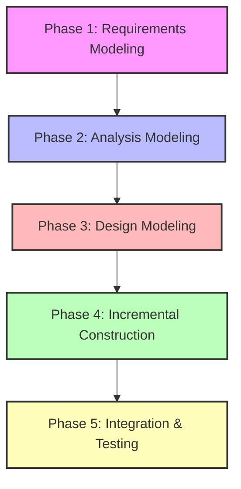

# QUY TRÌNH LÀM VIỆC THEO PHƯƠNG PHÁP COMET (CONCURRENT OBJECT MODELING AND ARCHITECTURAL DESIGN METHOD)

Phương pháp **COMET** (được phát triển bởi Giáo sư Hassan Gomaa) là một quy trình phát triển phần mềm lặp (iterative), hướng ca sử dụng (use-case driven) và hướng đối tượng (object-oriented). Phương pháp này đặc biệt mạnh mẽ trong việc thiết kế các hệ thống đồng thời (concurrent), phân tán (distributed) và thời gian thực (real-time), đồng thời cũng được áp dụng rộng rãi cho các dự án phát triển phần mềm doanh nghiệp chất lượng cao (như các môn học SWD392 tại FPTU).

Dưới đây là tài liệu quy trình chi tiết từng giai đoạn (Phase) theo phương pháp COMET, bao gồm **Đầu vào (Input)**, **Các bước thực hiện (Process)** và **Đầu ra (Output)** cụ thể cho từng giai đoạn.

---

## BẢN ĐỒ TỔNG QUAN QUY TRÌNH COMET

---

## CHI TIẾT TỪNG GIAI ĐOẠN (PHASES)

### 1. Requirements Modeling (Mô hình hóa Yêu cầu)
Giai đoạn này tập trung vào việc định nghĩa phạm vi hệ thống dưới góc nhìn "Black Box" (hộp đen), xác định những gì hệ thống phải làm mà chưa quan tâm đến cấu trúc bên trong.

*   **Input (Đầu vào):**
    *   Tài liệu mô tả bài toán thô (Problem Statement / Customer Request).
    *   Biên bản họp với khách hàng hoặc Stakeholders.
    *   Các quy định nghiệp vụ (Business Rules) thô.
    *   Các yêu cầu phi chức năng (Non-functional Requirements - NFRs) ban đầu (Hiệu năng, bảo mật, khả năng bảo trì...).
*   **Process (Quy trình thực hiện):**
    1.  **Xác định Actor và Hệ thống ngoài:** Xác định rõ ai/cái gì tương tác trực tiếp với hệ thống (người dùng cuối, thiết bị phần cứng, hệ thống thanh toán hoặc xác thực bên thứ ba).
    2.  **Vẽ Sơ đồ ngữ cảnh hệ thống (System Context Diagram):** Mô tả ranh giới hệ thống bằng Class Diagram mô tả mối quan hệ giữa Hệ thống và các Tác nhân ngoài (External Actors).
    3.  **Xây dựng Use Case Diagram:** Gom nhóm các chức năng thành các Use Case đại diện cho các tương tác mang lại giá trị cho Actor. Chia thành các phân hệ/site (ví dụ: Customer Site và Admin Site).
    4.  **Viết Đặc tả Use Case (Use Case Descriptions):** Viết chi tiết từng Use Case bao gồm: Actor chính, Tiền điều kiện (Preconditions), Hậu điều kiện (Postconditions), Luồng sự kiện chính (Normal Flow), Luồng thay thế (Alternative Flows), Luồng ngoại lệ (Exceptions).
    5.  **Xây dựng Mô hình dữ liệu thực thể (Entity Class Diagram):** Xác định các thực thể chính của bài toán nghiệp vụ và mối quan hệ giữa chúng (Aggregation, Composition, Association, Inheritance).
    6.  **Xây dựng Từ điển dữ liệu (Data Dictionary):** Mô tả chi tiết kiểu dữ liệu, độ dài và mục đích sử dụng của từng thuộc tính thuộc các Entity.
*   **Output (Đầu ra):**
    *   `System Context Diagram` (Sơ đồ ngữ cảnh hệ thống).
    *   `Use Case Diagrams` (Tổng quan và Chi tiết cho từng phân hệ).
    *   `Use Case Descriptions` (Bảng đặc tả chi tiết cho từng Use Case quan trọng).
    *   `Entity Class Diagram` (Sơ đồ lớp thực thể).
    *   `Data Dictionary` (Từ điển dữ liệu hoàn chỉnh).

---

### 2. Analysis Modeling (Mô hình hóa Phân tích)
Giai đoạn này đi sâu vào cấu trúc bên trong của hệ thống để hiểu rõ bài toán từ góc độ kỹ thuật nhưng độc lập với nền tảng công nghệ (Platform-Independent Model - PIM).

*   **Input (Đầu vào):**
    *   Toàn bộ Output của **Phase 1 (Requirements Modeling)**, đặc biệt là *Use Case Descriptions* và *Entity Class Diagram*.
*   **Process (Quy trình thực hiện):**
    1.  **Xác định các Đối tượng Phân tích (Analysis Objects):** Phân loại các lớp theo mẫu phân tích MVC (hoặc Stereotype của Gomaa):
        *   `«boundary»` (Lớp biên): Xử lý tương tác giữa Actor và hệ thống (Giao diện, API endpoint).
        *   `«control»` (Lớp điều khiển): Điều phối luồng xử lý, logic nghiệp vụ của Use Case.
        *   `«entity»` (Lớp thực thể): Lưu giữ thông tin dữ liệu dài hạn.
    2.  **Vẽ Sơ đồ Tương tác (Interaction Diagrams):** Hiện thực hóa từng Use Case bằng cách vẽ:
        *   **Sequence Diagram (Sơ đồ trình tự):** Chỉ ra trình tự thời gian các thông điệp (messages) được gửi giữa các đối tượng để hoàn thành một Use Case.
        *   **Communication Diagram (Sơ đồ truyền thông):** Nhấn mạnh mối liên kết cấu trúc giữa các đối tượng tham gia Use Case.
    3.  **Xây dựng Sơ đồ trạng thái (State Diagram):** Đối với các thực thể có vòng đời phức tạp và hành vi phụ thuộc vào trạng thái (ví dụ: `Order`, `News`, `Account`), vẽ sơ đồ máy trạng thái (Finite State Machine) để mô tả các sự kiện kích hoạt chuyển đổi trạng thái.
*   **Output (Đầu ra):**
    *   Các `Sequence Diagrams` (Sơ đồ trình tự) tương ứng với luồng chính và luồng ngoại lệ của từng Use Case.
    *   Các `Communication Diagrams` (Sơ đồ truyền thông) tương ứng.
    *   `State Diagrams` (Sơ đồ trạng thái) cho các đối tượng có sự thay đổi trạng thái phức tạp.

---

### 3. Design Modeling (Mô hình hóa Thiết kế)
Giai đoạn này chuyển đổi mô hình phân tích trừu tượng thành một kiến trúc phần mềm thực tế, có thể lập trình được, có tính đến các ràng buộc công nghệ (Platform-Specific Model - PSM).

*   **Input (Đầu vào):**
    *   Các sơ đồ tương tác và sơ đồ trạng thái từ **Phase 2 (Analysis Modeling)**.
    *   Tài liệu về các yêu cầu phi chức năng (NFRs) như hiệu năng, bảo mật và khả năng bảo trì.
*   **Process (Quy trình thực hiện):**
    1.  **Tích hợp các Sơ đồ Truyền thông (Integrated Communication Diagrams):** Hợp nhất các sơ đồ truyền thông của các Use Case liên quan để nhìn thấy toàn bộ các mối liên kết và phương thức cần có của hệ thống.
    2.  **Thiết kế Kiến trúc Hệ thống mức cao (System High-Level Design):**
        *   Xác định cấu trúc phân tầng (ví dụ: Clean Architecture, N-Tier, Microservices).
        *   Phân rã hệ thống thành các Subsystems độc lập.
        *   Vẽ `Deployment Diagram` (Sơ đồ triển khai phần cứng/môi trường).
    3.  **Thiết kế Thành phần và Gói (Component and Package Diagram):**
        *   Nhóm các Class liên quan vào các gói (`Package Diagram`) để quản lý phụ thuộc (Dependency Management).
        *   Thiết kế các Component giao tiếp qua Interface (`Component Diagram`).
    4.  **Thiết kế Lớp Chi tiết (Detailed Class Design):**
        *   Xác định chi tiết phương thức (methods) và thuộc tính (attributes) của từng Class dựa trên các Message từ Sequence Diagram.
        *   Áp dụng các Design Pattern để tối ưu hóa thiết kế.
        *   Phân tách Lớp thực thể thành: **Database Wrapper Class** (Lớp truy cập DB như Repository) và **Data Abstraction Class** (Lớp biểu diễn dữ liệu như Entity/DTO).
    5.  **Thiết kế Cơ sở dữ liệu (Database Design):** Ánh xạ `Entity Class Diagram` sang các bảng quan hệ (Relational Tables), xác định Khóa chính (PK), Khóa ngoại (FK) và chuẩn hóa dữ liệu (1NF, 2NF, 3NF).
*   **Output (Đầu ra):**
    *   `Integrated Communication Diagram` (Sơ đồ truyền thông tích hợp).
    *   `Deployment Diagram` (Sơ đồ triển khai kiến trúc vật lý).
    *   `Package Diagram` & `Component Diagram` (Sơ đồ cấu trúc dự án).
    *   `Detailed Design Class Diagram` (Sơ đồ lớp chi tiết có đầy đủ kiểu dữ liệu, phương thức và access modifier).
    *   `Physical Database Schema` (Thiết kế cơ sở dữ liệu vật lý bao gồm các bảng, kiểu dữ liệu cụ thể và ràng buộc).

---

### 4. Incremental Software Construction (Xây dựng phần mềm tăng trưởng / Coding)
Giai đoạn viết code thực tế dựa trên thiết kế chi tiết đã thống nhất. Quy trình COMET khuyến khích xây dựng phần mềm theo từng phân đoạn/tính năng tăng trưởng (incremental).

*   **Input (Đầu vào):**
    *   Tài liệu đặc tả kiến trúc, `Detailed Design Class Diagram` và `Database Schema` từ **Phase 3**.
    *   Coding Standards và Guidelines của dự án.
*   **Process (Quy trình thực hiện):**
    1.  **Thiết lập cấu trúc thư mục dự án (Project Structuring):** Ánh xạ cấu trúc gói từ `Package Diagram` thành cấu trúc thư mục code thực tế (ví dụ: thư mục `Core`, `Infrastructure`, `Presentation`).
    2.  **Khởi tạo Database:** Chạy các file Script SQL hoặc sử dụng ORM Migrations (EF Core, Prisma, v.v.) để tạo cơ sở dữ liệu vật lý.
    3.  **Lập trình theo Kiến trúc Đã Định:**
        *   Ánh xạ chính xác các Class, Interface, Methods và Thuộc tính từ Sơ đồ lớp chi tiết vào mã nguồn.
        *   Triển khai mã nguồn cho từng tầng: Tầng dữ liệu (Repositories/Database Wrappers), Tầng xử lý nghiệp vụ (Services/Controllers/Control Classes), Tầng giao diện/API (Boundary Classes).
    4.  **Viết Unit Test song song (nếu áp dụng TDD/Automation Test):** Viết các test case để kiểm nghiệm logic nghiệp vụ của các lớp Control và Entity độc lập.
*   **Output (Đầu ra):**
    *   Cấu trúc thư mục mã nguồn chuẩn hóa.
    *   Cơ sở dữ liệu hoạt động thực tế.
    *   Mã nguồn hoàn chỉnh của các phân hệ chức năng đã lập trình.
    *   Các bộ Unit Test cho các thành phần logic nghiệp vụ.

---

### 5. Incremental Software Integration and Testing (Tích hợp & Kiểm thử tăng trưởng)
Giai đoạn tích hợp các thành phần đơn lẻ lại với nhau và kiểm thử hệ thống để đảm bảo chất lượng, sự ổn định và đáp ứng đúng yêu cầu ban đầu.

*   **Input (Đầu vào):**
    *   Các thành phần mã nguồn đã hoàn thành từ **Phase 4**.
    *   Tài liệu Kịch bản kiểm thử (Test Cases / Test Scenarios).
    *   Môi trường Staging/Testing được chuẩn bị sẵn.
*   **Process (Quy trình thực hiện):**
    1.  **Tích hợp mã nguồn (Integration):** Ghép nối các lớp boundary, control và entity. Giải quyết các xung đột dữ liệu và luồng giao tiếp.
    2.  **Kiểm thử tích hợp (Integration Testing):** Đảm bảo các phân hệ tương tác với nhau đúng như mô tả trong các sơ đồ tương tác mức thiết kế.
    3.  **Kiểm thử hệ thống dựa trên Use Case (System/Use Case Testing):**
        *   Chạy các Test Scenario dựa trên từng kịch bản trong *Use Case Descriptions* ở Phase 1.
        *   Xác minh hệ thống xử lý đúng cả luồng bình thường (Normal Flow) lẫn luồng lỗi (Exceptions).
    4.  **Kiểm thử phi chức năng (Non-functional Testing):** Kiểm tra hiệu năng tải (Stress Test), khả năng đáp ứng trên các trình duyệt/thiết bị khác nhau (NF-02, NF-03) và tính bảo trì bảo mật.
    5.  **Sửa lỗi (Bug Fixing) và Đóng gói (Packaging):** Fix các lỗi phát sinh, tối ưu hóa code và chuẩn bị tài liệu bàn giao.
*   **Output (Đầu ra):**
    *   Hệ thống phần mềm hoàn thiện, sẵn sàng triển khai (Deployable Package).
    *   Báo cáo kết quả kiểm thử (Test Report) chỉ rõ tỷ lệ test case Pass/Fail.
    *   Tài liệu hướng dẫn vận hành và bảo trì.

---

## TỔNG KẾT QUAN HỆ TRUY VẾT (TRACEABILITY) TRONG COMET

Một ưu điểm vượt trội của phương pháp COMET là **khả năng truy vết (traceability)** hoàn hảo từ yêu cầu ban đầu đến dòng code thực tế:

$$\text{Use Case Spec (Phase 1)} \longrightarrow \text{Sequence/Comm Diagram (Phase 2)} \longrightarrow \text{Detailed Class (Phase 3)} \longrightarrow \text{Code Implementation (Phase 4)}$$

Mỗi tin nhắn (message) trên sơ đồ tương tác ở Phase 2 sẽ trở thành một phương thức (method) trong lớp thiết kế chi tiết ở Phase 3, và trực tiếp chuyển thành một hàm thực thi trong mã nguồn ở Phase 4. Điều này giúp dự án cực kỳ dễ bảo trì và mở rộng về sau.
