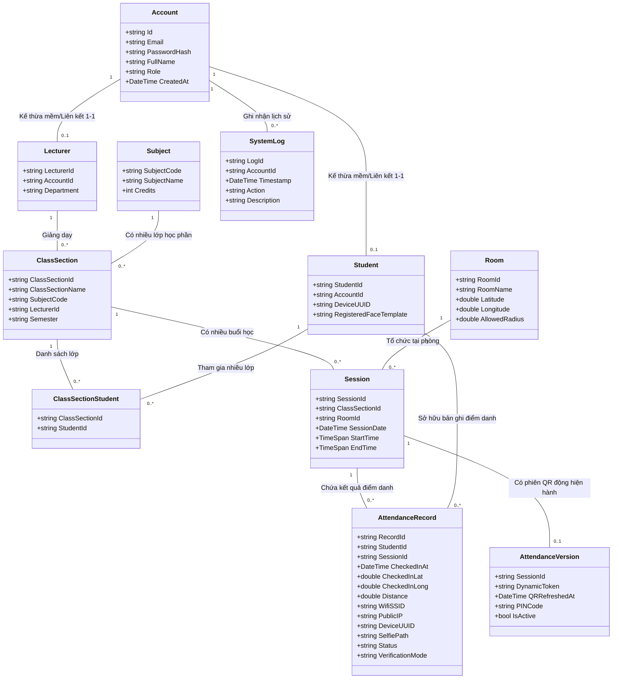

# SƠ ĐỒ LỚP THỰC THỂ (ENTITY CLASS DIAGRAM)

Sơ đồ lớp thực thể (Entity Class Diagram) biểu diễn cấu trúc dữ liệu tĩnh mức logic của hệ thống **AFAS**, mô tả các khái niệm nghiệp vụ cốt lõi và mối liên kết cấu trúc giữa chúng. Thiết kế này đóng vai trò làm nguồn chân lý duy nhất (Single Source of Truth) cho việc thiết kế CSDL quan hệ ở Phase 3.

---

## 📊 SƠ ĐỒ THỰC THỂ LÕI (MERMAID)

---

## 🔍 Ý NGHĨA CÁC QUAN HỆ TRỌNG TÂM

1.  **Account - Student/Lecturer (Mối quan hệ 1-1):** Một tài khoản trong hệ thống chỉ có thể đóng vai trò là một Sinh viên hoặc một Giảng viên. Admin sẽ quản lý thông tin bảo mật tại bảng `Account`, còn thông tin chuyên môn nghiệp vụ sẽ nằm ở các bảng con tương ứng.
2.  **ClassSection - Session (Mối quan hệ 1-nhiều):** Một Lớp học phần sẽ diễn ra trên nhiều buổi học (`Session`) tại các mốc thời gian khác nhau. Mỗi buổi học sẽ được gán với một phòng học cố định (`Room`) để lấy tọa độ làm chuẩn so khớp GPS.
3.  **Session - AttendanceVersion (Mối quan hệ 1-1):** Mỗi buổi học chỉ có một phiên điểm danh QR động hoạt động tại một thời điểm. Token động và mã PIN của phiên này sẽ được cập nhật liên tục để chặn chia sẻ ảnh từ xa.
4.  **Student - AttendanceRecord (Mối quan hệ 1-nhiều):** Một sinh viên tham gia buổi học sẽ sở hữu một bản ghi điểm danh (`AttendanceRecord`). Bản ghi này chứa toàn bộ minh chứng số như GPS lúc quét, khoảng cách, thông tin Wi-Fi, UUID thiết bị, ảnh selfie Face ID phục vụ việc đối khớp và kiểm tra gian lận trên Server.
