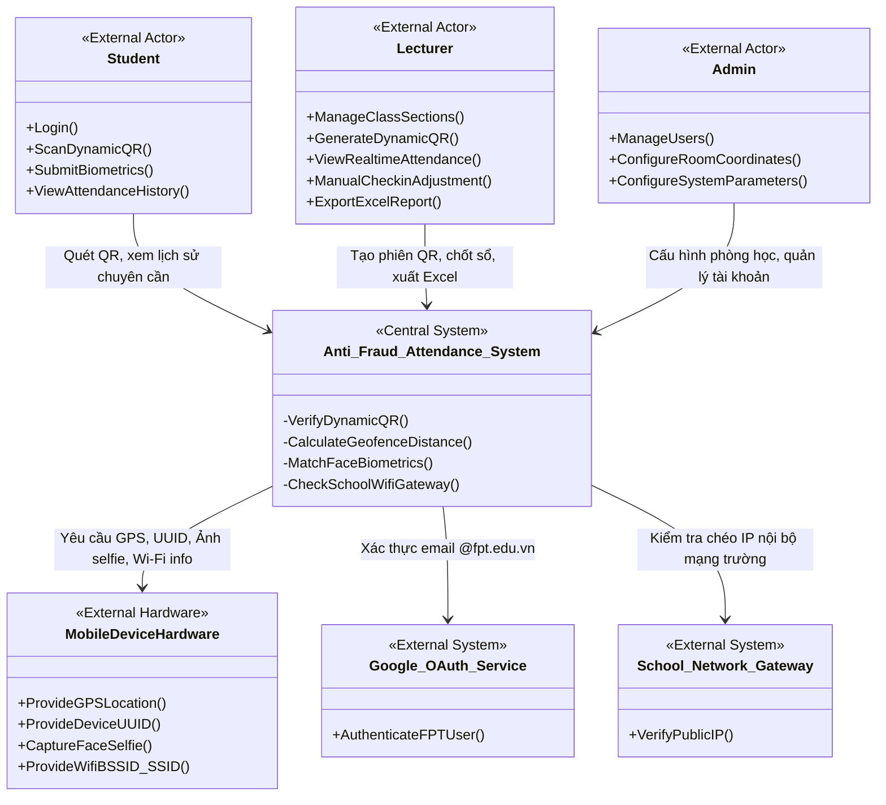

# SƠ ĐỒ NGỮ CẢNH HỆ THỐNG ĐIỂM DANH CHỐNG GIAN LẬN

Sơ đồ ngữ cảnh xác định ranh giới giữa hệ thống **Anti-Fraud Attendance System (AFAS)** và môi trường xung quanh nó, bao gồm các tác nhân người dùng cuối và các hệ thống/phần cứng ngoại vi phục vụ thuật toán xác thực chống gian lận.

---

## 📊 SƠ ĐỒ NGỮ CẢNH (MERMAID)

---

## 🔍 CHI TIẾT TÁC NHÂN VÀ HỆ THỐNG NGOẠI VI

| Tên Thực thể               | Loại                 | Vai trò / Chi tiết kết nối trong chống gian lận                                                                                                                                         |
| :---------------------------| :---------------------| :----------------------------------------------------------------------------------------------------------------------------------------------------------------------------------------|
| **Student**                | Con người            | Sử dụng Mobile App hoặc Web Mobile để thực hiện điểm danh bằng cách quét QR. Đóng vai trò là đối tượng cần xác thực chống gian lận.                                                     |
| **Lecturer**               | Con người            | Sử dụng Web Portal để tạo mã QR động hiển thị trên máy chiếu lớp học, theo dõi trực tiếp thời gian thực, điều chỉnh điểm danh thủ công và xuất báo cáo.                                 |
| **Admin**                  | Con người            | Cấu hình tọa độ GPS gốc và bán kính động của từng phòng học. Quản lý danh mục cơ sở dữ liệu.                                                                                            |
| **Mobile Device Hardware** | Phần cứng điện thoại | Cung cấp tọa độ GPS thực tế từ chip phần cứng di động, mã định danh thiết bị duy nhất (Device UUID) để chặn điểm danh 2 máy, camera chụp Face selfie và thông số mạng Wi-Fi BSSID/SSID. |
| **Google OAuth**           | Hệ thống ngoài       | Xác thực đăng nhập của Sinh viên/Giảng viên bằng tài khoản thư điện tử chính quy của trường (ví dụ đuôi `@fpt.edu.vn`).                                                                 |
| **School Network Gateway** | Hệ thống mạng trường | Cung cấp địa chỉ IP tĩnh công cộng của cổng mạng trường Wi-Fi để Server đối khớp chéo (chặn trường hợp Fake GPS nhưng đang kết nối mạng 4G ở nhà).                                      |
