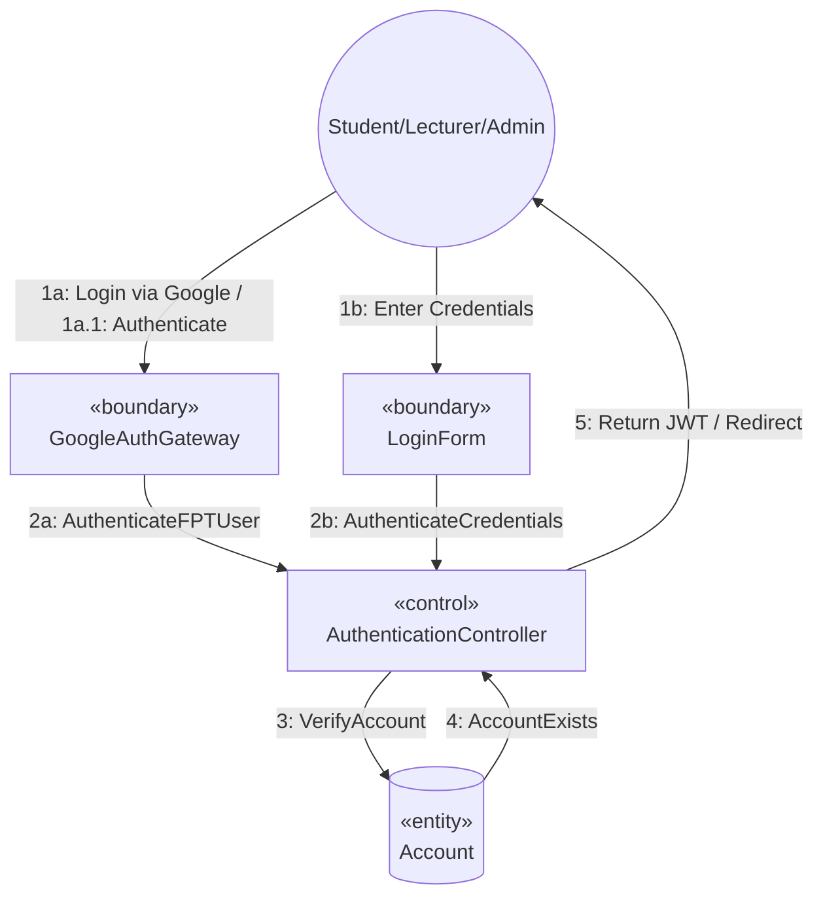

# SƠ ĐỒ TRUYỀN THÔNG CHI TIẾT: UC01 - ĐĂNG NHẬP (LOGIN)

Tài liệu này mô tả sơ đồ truyền thông (Communication Diagram) mức phân tích cho Use Case **UC01: Đăng nhập (Login)**.

---

## 📊 SƠ ĐỒ TRUYỀN THÔNG (MERMAID)

