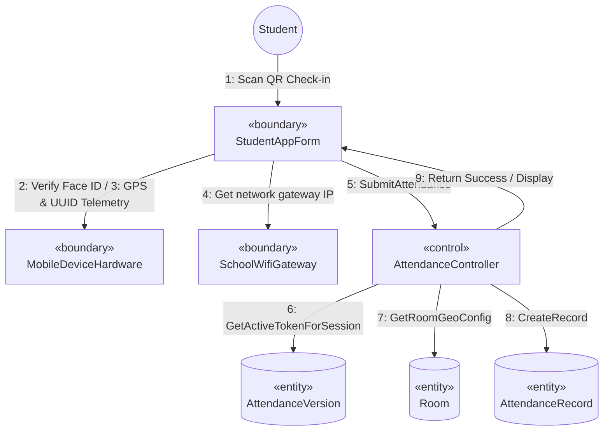

# SƠ ĐỒ TRUYỀN THÔNG CHI TIẾT: UC03 - ĐIỂM DANH BẰNG QUÉT QR ĐỘNG

Tài liệu này mô tả sơ đồ truyền thông (Communication Diagram) mức phân tích cho Use Case **UC03: Điểm danh bằng quét QR Động** có tích hợp 3 lớp phòng vệ chống gian lận.

---

## 📊 SƠ ĐỒ TRUYỀN THÔNG (MERMAID)

