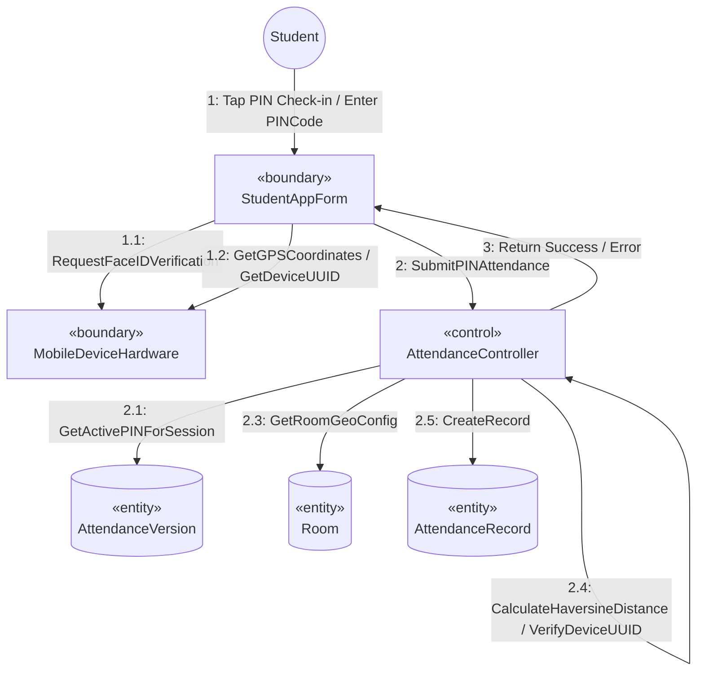

# SƠ ĐỒ TRUYỀN THÔNG CHI TIẾT: UC05 - ĐIỂM DANH BẰNG PIN DỰ PHÒNG

Tài liệu này mô tả sơ đồ truyền thông mức phân tích cho Use Case **UC05: PIN Fallback Check-in**.

---

## 📊 SƠ ĐỒ TRUYỀN THÔNG (MERMAID)

