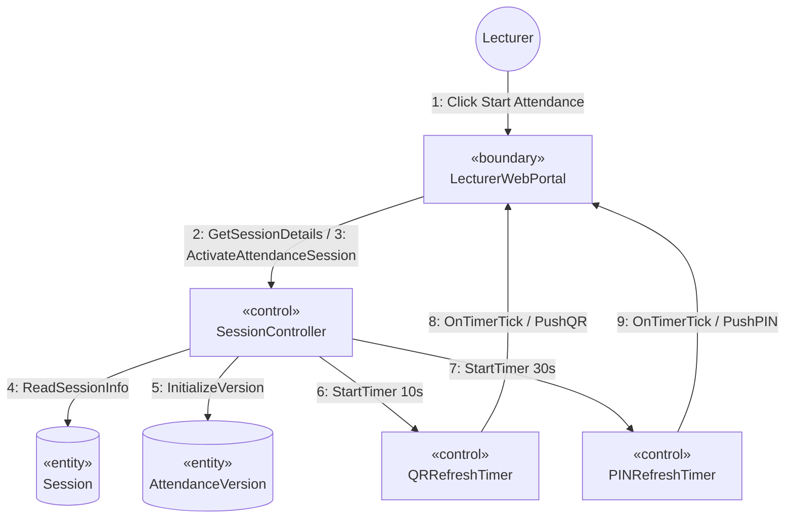

# SƠ ĐỒ TRUYỀN THÔNG CHI TIẾT: UC06 - KÍCH HOẠT PHIÊN ĐIỂM DANH QR ĐỘNG

Tài liệu này mô tả sơ đồ truyền thông (Communication Diagram) mức phân tích cho Use Case **UC06: Kích hoạt phiên điểm danh QR Động** của Giảng viên.

---

## 📊 SƠ ĐỒ TRUYỀN THÔNG (MERMAID)

