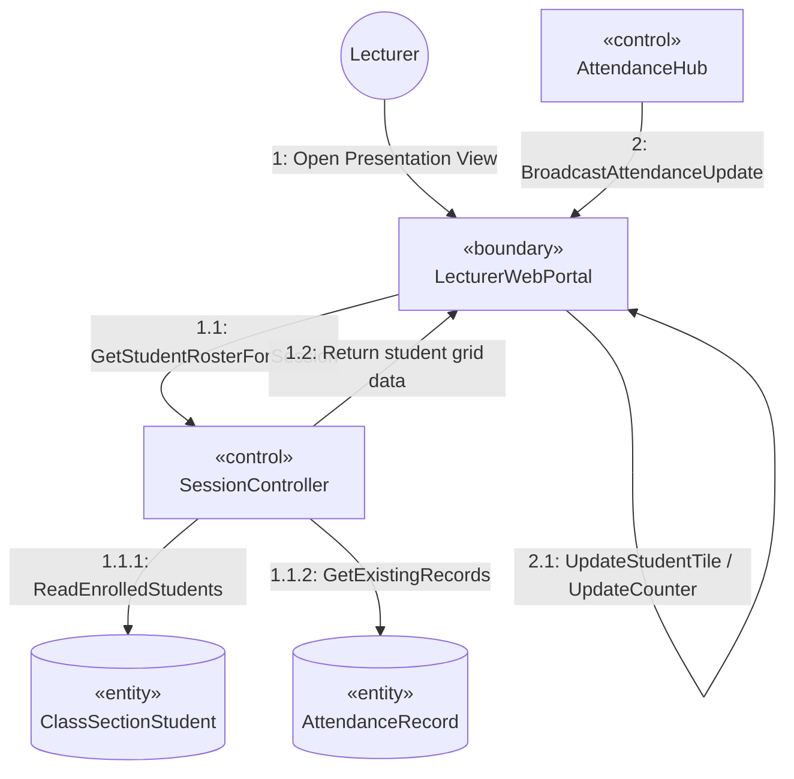

# SƠ ĐỒ TRUYỀN THÔNG CHI TIẾT: UC07 - GIÁM SÁT ĐIỂM DANH THỜI GIAN THỰC

Tài liệu này mô tả sơ đồ truyền thông mức phân tích cho Use Case **UC07: Real-time Attendance Monitor**.

---

## 📊 SƠ ĐỒ TRUYỀN THÔNG (MERMAID)

