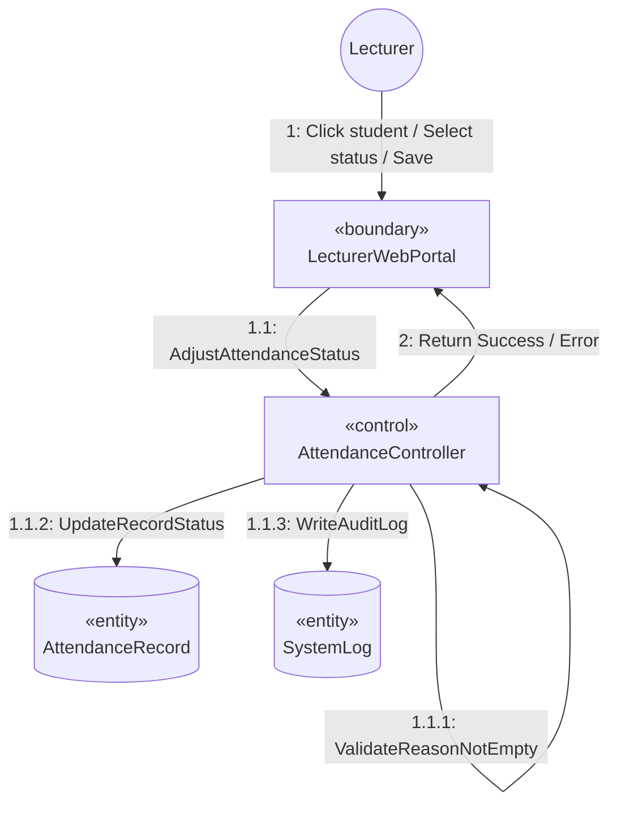

# SƠ ĐỒ TRUYỀN THÔNG CHI TIẾT: UC08 - ĐIỀU CHỈNH ĐIỂM DANH THỦ CÔNG

Tài liệu này mô tả sơ đồ truyền thông mức phân tích cho Use Case **UC08: Manual Attendance Adjustment**.

---

## 📊 SƠ ĐỒ TRUYỀN THÔNG (MERMAID)

