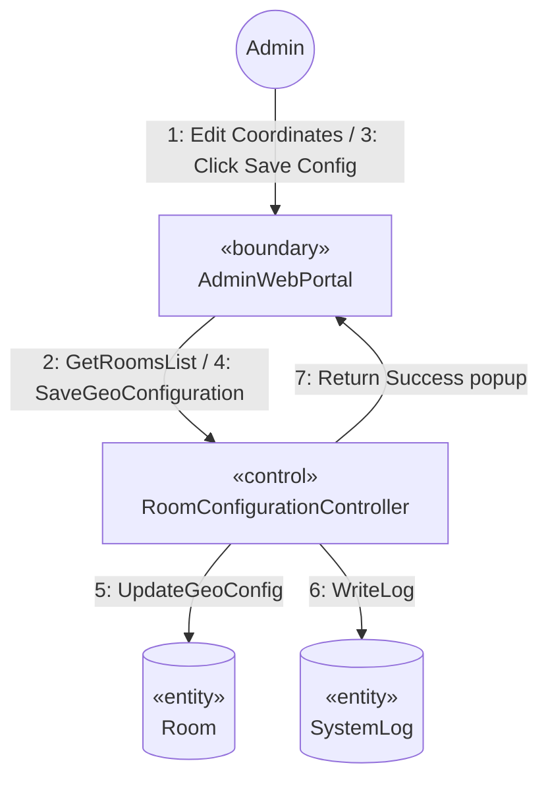

# SƠ ĐỒ TRUYỀN THÔNG CHI TIẾT: UC11 - CẤU HÌNH TỌA ĐỘ VÀ BÁN KÍNH PHÒNG HỌC

Tài liệu này mô tả sơ đồ truyền thông (Communication Diagram) mức phân tích cho Use Case **UC11: Cấu hình tọa độ và bán kính phòng học** của Admin.

---

## 📊 SƠ ĐỒ TRUYỀN THÔNG (MERMAID)

