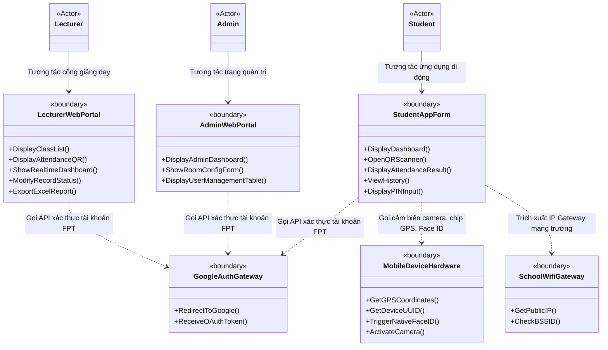

# SƠ ĐỒ LỚP BIÊN VÀ NGỮ CẢNH HỆ THỐNG (CONTEXTUAL BOUNDARY CLASS DIAGRAM)

Sơ đồ lớp biên và ngữ cảnh hệ thống (Contextual Boundary Class Diagram) biểu diễn mối liên kết trực tiếp giữa các Tác nhân ngoài (Actors) và các Lớp biên giao diện (`«boundary»`) tương ứng mà tác nhân đó trực tiếp tương tác để gửi/nhận dữ liệu từ hệ thống.

---

## 📊 SƠ ĐỒ LỚP BIÊN & NGỮ CẢNH (MERMAID)

---

## 🔍 MÔ TẢ PHƯƠNG THỨC GIAO TIẾP QUA LỚP BIÊN

1.  **StudentAppForm:** Cung cấp giao diện di động tối giản phù hợp yêu cầu phi chức năng **NF-03 (Usability)**. Trực tiếp gọi phần cứng di động (`MobileDeviceHardware`) thông qua React Native Bridge để lấy vị trí địa lý, gọi Face ID nội bộ, mở camera quét mã và hiển thị màn hình nhập PIN dự phòng.
2.  **LecturerWebPortal:** Cổng Web có màn hình trình chiếu QR lớn tích hợp WebSocket. Màn hình tự động cập nhật danh sách sinh viên đi học theo thời gian thực mà không bắt buộc giảng viên phải bấm tải lại trang (F5).
3.  **SchoolWifiGateway:** Đóng vai trò là lớp biên kết nối chéo với hạ tầng mạng. Nó gửi một request ẩn lên server mạng trường để lấy địa chỉ IP công cộng (Public IP) và đối chiếu xem sinh viên có thực sự sử dụng Wi-Fi nội bộ hay không.
