# PHÂN CẤP CẤU TRÚC ĐỐI TƯỢNG (OBJECT STRUCTURING CRITERIA)

Tài liệu này phân tích cấu trúc hệ thống **AFAS** dựa trên các tiêu chí tổ chức đối tượng (Object Structuring Criteria) của phương pháp COMET, phân loại các đối tượng thành các nhóm cấu trúc rõ ràng dựa trên vai trò xử lý, tính đồng thời (concurrency) và tính chất phân tán (distribution).

---

## 📊 SƠ ĐỒ CÂY PHÂN CẤP ĐỐI TƯỢNG (MERMAID)

```mermaid
graph TD
    Root[AFAS System Objects] --> Boundary[1. Boundary Objects]
    Root --> Control[2. Control Objects]
    Root --> Entity[3. Entity Objects]

    %% Phân cấp nhóm Boundary
    Boundary --> UI[1.1 User Interface Objects]
    Boundary --> Device[1.2 Device Interface Objects]
    Boundary --> Sys[1.3 System Interface Objects]
    
    UI --> StudentAppForm
    UI --> LecturerWebPortal
    UI --> AdminWebPortal
    
    Device --> GPSReceiver
    Device --> CameraScanner
    Device --> NativeBiometricReader
    
    Sys --> GoogleOAuthGateway
    Sys --> SchoolWifiGateway

    %% Phân cấp nhóm Control
    Control --> Coord[2.1 Coordinator Objects]
    Control --> StateDep[2.2 State-Dependent Objects]
    Control --> Timers[2.3 Timer Control Objects]
    
    Coord --> AttendanceController
    Coord --> DeviceBindingController
    Coord --> AuthenticationController
    
    StateDep --> SessionController
    StateDep --> RoomConfigurationController
    
    Timers --> QRRefreshTimer
    Timers --> PINRefreshTimer

    %% Phân cấp nhóm Entity
    Entity --> Data[3.1 Data Abstraction Objects]
    Entity --> DBWrap[3.2 Database Wrapper Objects]
    
    Data --> StudentEntity
    Data --> LecturerEntity
    Data --> RoomEntity
    Data --> SessionEntity
    Data --> AttendanceRecordEntity
    
    DBWrap --> StudentRepository
    DBWrap --> AttendanceRepository
    DBWrap --> RedisCacheManager
```

---

## 🔍 CHI TIẾT CÁC TIÊU CHÍ PHÂN CHIA (STRUCTURING CRITERIA)

### 1. Tiêu chí phân nhóm Boundary (Lớp biên)
*   **User Interface Objects:** Nhóm các đối tượng chịu trách nhiệm hiển thị màn hình đồ họa trực tiếp cho người dùng. (StudentAppForm, LecturerWebPortal, AdminWebPortal).
*   **Device Interface Objects:** Các đối tượng kết nối trực tiếp với cảm biến vật lý trên phần cứng điện thoại. Đây là lớp bảo vệ thu thập minh chứng số thực của GPS, Camera và Face ID.
*   **System Interface Objects:** Các cổng tích hợp API kết nối với các thực thể mạng và xác thực bên ngoài (Google OAuth, mạng nội bộ Gateway).

### 2. Tiêu chí phân nhóm Control (Lớp điều khiển)
*   **Coordinator Objects:** Điều phối và xử lý toàn bộ luồng sự kiện của Use Case nghiệp vụ chính. 
    *   *Ví dụ:* `AttendanceController` điều phối toàn bộ việc xác thực GPS, IP và Face ID trước khi ghi nhận trạng thái đi học.
*   **State-Dependent Objects:** Các đối tượng điều khiển có hành vi biến đổi phức tạp phụ thuộc vào trạng thái hiện thời của thực thể.
    *   *Ví dụ:* `SessionController` quản lý trạng thái của buổi học (`Active`, `Paused`, `Completed`).
*   **Timer Control Objects:** Các đối tượng đồng bộ chạy ngầm chịu trách nhiệm kích hoạt sự kiện theo chu kỳ thời gian. Đây là xương sống cho Lớp 1 chống gian lận.
    *   *Ví dụ:* `QRRefreshTimer` kích hoạt làm mới mã QR động mỗi 10 giây; `PINRefreshTimer` kích hoạt đổi mã PIN mỗi 30 giây.

### 3. Tiêu chí phân nhóm Entity (Lớp thực thể)
*   **Data Abstraction Objects:** Đối tượng biểu diễn cấu trúc dữ liệu thô trong bộ nhớ RAM, chứa các thuộc tính và phương thức thao tác dữ liệu cơ bản.
*   **Database Wrapper Objects:** Đối tượng chịu trách nhiệm bao bọc logic truy cập cơ sở dữ liệu vật lý (PostgreSQL) thông qua các repository như `StudentRepository`, `AttendanceRepository` và quản lý bộ nhớ đệm tốc độ cao (`RedisCacheManager`) phục vụ yêu cầu chịu tải đầu giờ **NF-01 (Concurrency)**.
