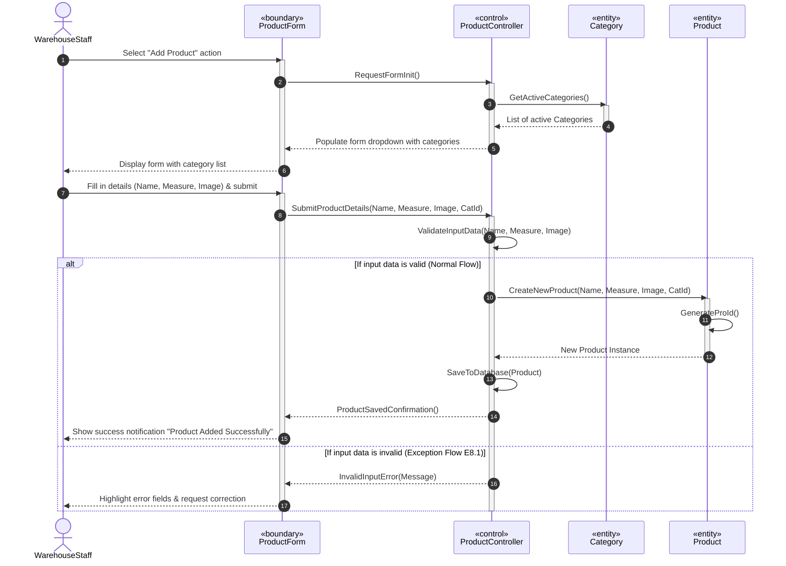

# SƠ ĐỒ TRÌNH TỰ (SEQUENCE DIAGRAM SPECIFICATION)

---

## 📄 [UC-02]: ADD PRODUCT (THÊM SẢN PHẨM MỚI)

Sơ đồ trình tự mô tả cách thức các đối tượng phân tích tham gia tương tác với nhau theo trình tự thời gian để hoàn thành luồng sự kiện chính của Use Case **Add Product**.

Theo mô hình phân tích đối tượng của COMET, các lớp tham gia được gán nhãn Stereotype như sau:
*   `Actor: WarehouseStaff` (Tác nhân ngoài)
*   `«boundary» ProductForm` (Giao diện thêm sản phẩm)
*   `«control» ProductController` (Bộ điều khiển nghiệp vụ)
*   `«entity» Product` (Lớp thực thể sản phẩm)
*   `«entity» Category` (Lớp thực thể danh mục loại)

---

## 📊 SƠ ĐỒ TRÌNH TỰ (MERMAID)

---

## 📝 MÔ TẢ CHI TIẾT CÁC THÔNG ĐIỆP (MESSAGES EXPLANATION)

| STT | Tên Thông điệp | Đối tượng Gửi | Đối tượng Nhận | Mô tả chức năng & Nghiệp vụ đi kèm |
| :--- | :--- | :--- | :--- | :--- |
| **1** | `Select "Add Product"` | WarehouseStaff | `«boundary» ProductForm` | Tác nhân kho bắt đầu kích hoạt hành động bằng cách chọn chức năng thêm sản phẩm. |
| **2** | `RequestFormInit()` | `«boundary» ProductForm` | `«control» ProductController` | Giao diện gửi yêu cầu khởi tạo dữ liệu cho Form, cần lấy danh mục để hiển thị. |
| **3** | `GetActiveCategories()` | `«control» ProductController` | `«entity» Category` | Lớp điều khiển gọi lớp thực thể danh mục để lấy danh sách các danh mục đang mở bán. |
| **8** | `SubmitProductDetails(...)`| `«boundary» ProductForm` | `«control» ProductController` | Biểu mẫu gửi toàn bộ thông tin người dùng đã nhập xuống tầng xử lý logic nghiệp vụ. |
| **9** | `ValidateInputData(...)` | `«control» ProductController` | *Self-Call (Chính nó)* | Controller tự gọi hàm xác thực định dạng dữ liệu, ảnh, tính hợp lệ của danh mục (BR-01, BR-02). |
| **10**| `CreateNewProduct(...)` | `«control» ProductController` | `«entity» Product` | Khởi tạo một đối tượng thực thể Product mới trong RAM nếu dữ liệu kiểm tra hợp lệ. |
| **12**| `SaveToDatabase(Product)` | `«control» ProductController` | *Self-Call (Chính nó)* | Bộ điều khiển thực hiện lưu trữ vĩnh viễn thực thể vào CSDL quan hệ. |
