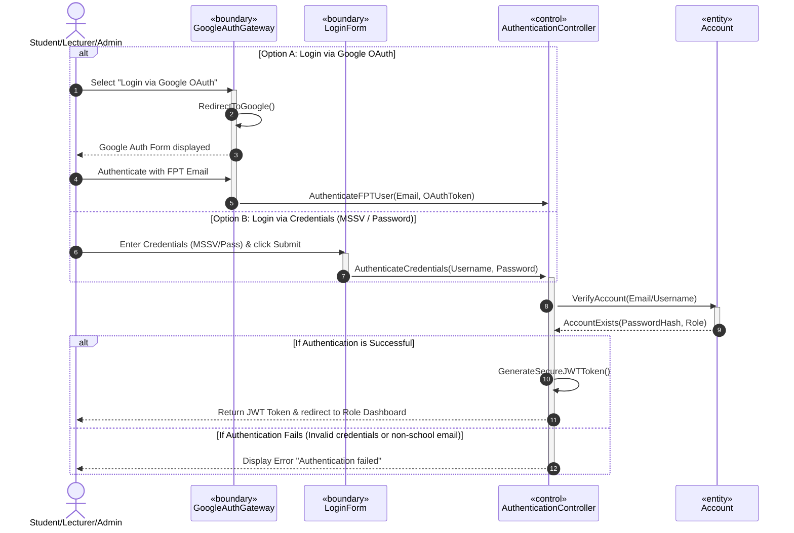

# SƠ ĐỒ TRÌNH TỰ CHI TIẾT: UC01 - ĐĂNG NHẬP (LOGIN)

Tài liệu này đặc tả sự tương tác động giữa các đối tượng phân tích tham gia Use Case **UC01: Đăng nhập (Login)** bằng mã số sinh viên/mật khẩu hoặc Google OAuth.

---

## 📊 SƠ ĐỒ TRÌNH TỰ (MERMAID)

