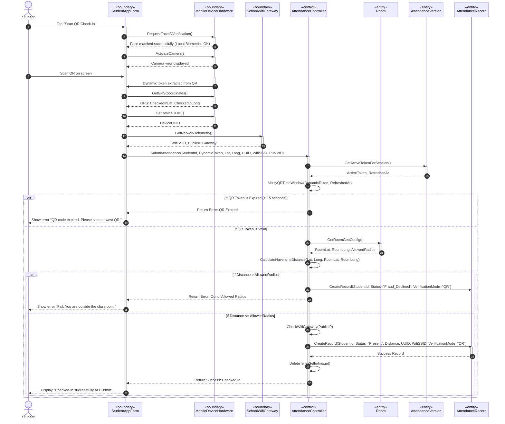

# SƠ ĐỒ TRÌNH TỰ CHI TIẾT: UC03 - ĐIỂM DANH BẰNG QUÉT QR ĐỘNG

Tài liệu này đặc tả sự tương tác động giữa các đối tượng phân tích tham gia Use Case **UC03: Điểm danh bằng quét QR Động** có tích hợp 3 lớp phòng vệ chống gian lận.

---

## 📊 SƠ ĐỒ TRÌNH TỰ (MERMAID)

---

## 🔍 QUY TRÌNH XÁC THỰC CỐT LÕI (STEPS)

1.  **Bước 2-3 (Face ID):** Bảo vệ lớp 3. Thiết bị di động xác thực khuôn mặt sinh viên tại chỗ bằng cảm biến phần cứng nhằm khóa cứng điện thoại đúng chủ sở hữu.
2.  **Bước 9-11 (Thu thập telemetry):** App tự động lấy định vị GPS, địa chỉ IP mạng Wi-Fi và mã số phần cứng di động để gửi lên Server làm bằng chứng số.
3.  **Bước 15-16 (Xác thực Lớp 1):** Server đối khớp token QR động. Nếu token quá hạn 15 giây (do chụp ảnh gửi cho bạn ở nhà quét), hệ thống từ chối lập tức.
4.  **Bước 19-21 (Xác thực Lớp 2):** Server lấy tọa độ gốc của phòng học, dùng **Công thức Haversine** đo khoảng cách. Vượt quá bán kính động cho phép sẽ bị ghi nhận trạng thái gian lận `Fraud_Declined`.
5.  **Bước 27 (Tối ưu hóa dữ liệu Face ID):** Sau khi xác thực hợp lệ, ảnh selfie tạm thời gửi kèm sẽ bị **xóa sạch ngay lập tức** ra khỏi máy chủ để tuân thủ quyết định thiết kế của người dùng, bảo vệ quyền riêng tư và tối ưu bộ nhớ.
