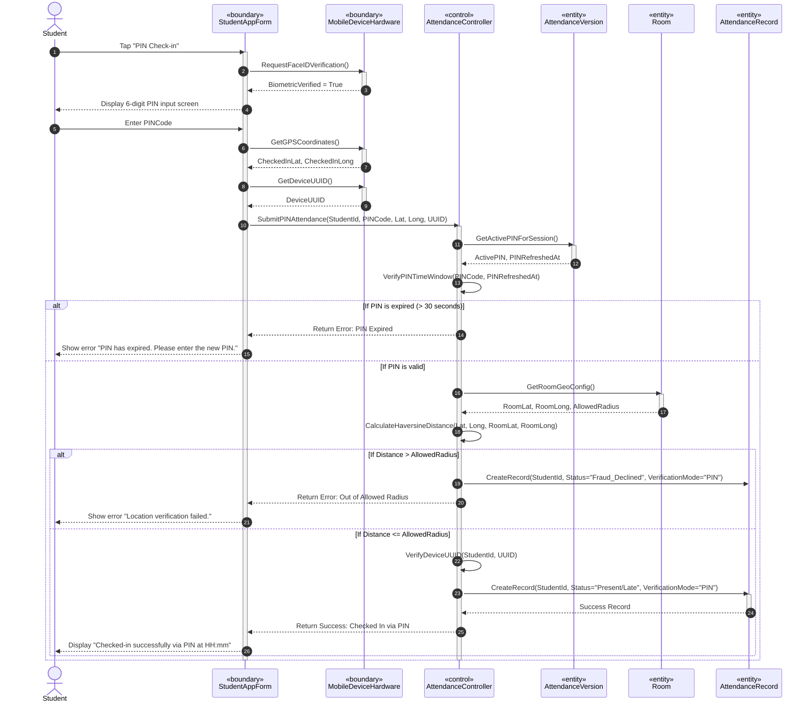

# SƠ ĐỒ TRÌNH TỰ CHI TIẾT: UC05 - ĐIỂM DANH BẰNG PIN DỰ PHÒNG

Tài liệu này đặc tả sự tương tác động giữa các đối tượng phân tích tham gia Use Case **UC05: PIN Fallback Check-in** khi sinh viên nhập mã PIN thay cho quét QR.

---

## 📊 SƠ ĐỒ TRÌNH TỰ (MERMAID)

