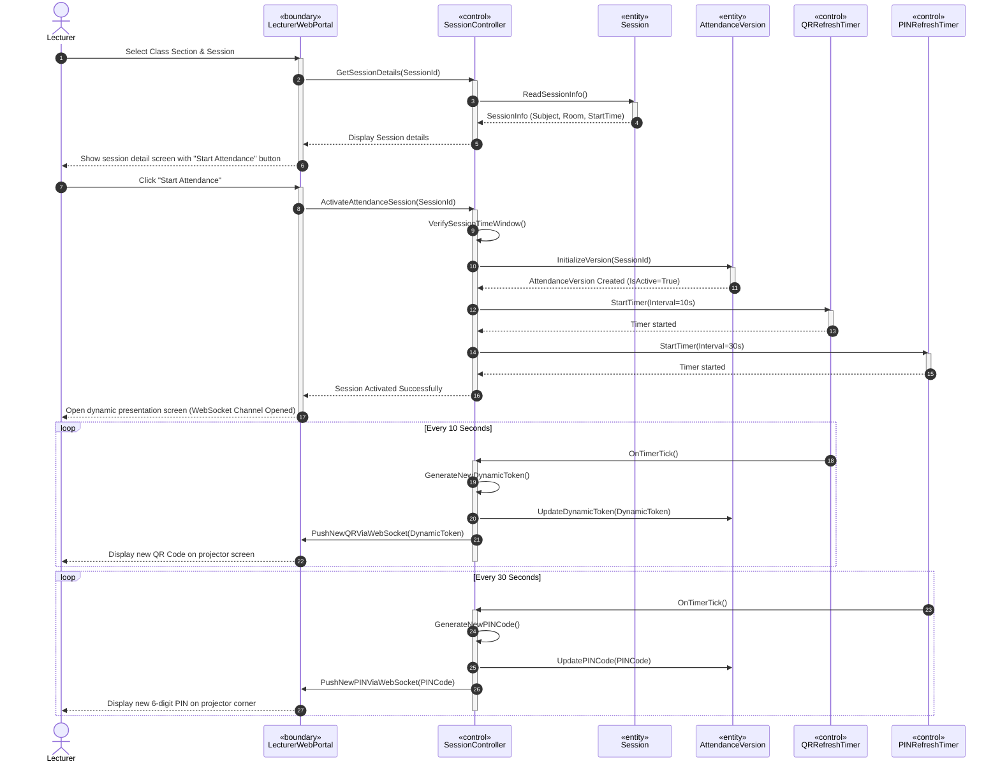

# SƠ ĐỒ TRÌNH TỰ CHI TIẾT: UC06 - KÍCH HOẠT PHIÊN ĐIỂM DANH QR ĐỘNG

Tài liệu này đặc tả sự tương tác động giữa các đối tượng phân tích tham gia Use Case **UC06: Kích hoạt phiên điểm danh QR Động** của Giảng viên.

---

## 📊 SƠ ĐỒ TRÌNH TỰ (MERMAID)

---

## 🔍 QUY TRÌNH KÍCH HOẠT & CẬP NHẬT MÃ

1.  **Bước 10 (Verify Time Window):** Kiểm tra ràng buộc nghiệp vụ chỉ cho phép kích hoạt phiên điểm danh trong đúng khung giờ học chính khóa được phân lịch để tránh kích hoạt bừa bãi.
2.  **Bước 13-16 (Timer Activation):** Hệ thống khởi chạy 2 thread đếm ngược chạy ngầm (`QRRefreshTimer` chu kỳ 10 giây và `PINRefreshTimer` chu kỳ 30 giây). Các timer này sẽ tự động kích hoạt tiến trình làm mới mã độc lập.
3.  **Vòng lặp WebSocket (Mã QR):** Cứ mỗi 10 giây, bộ đếm ngược QR phát sự kiện, bộ điều khiển sinh một token ngẫu nhiên mới lưu vào bảng thực thể `AttendanceVersion` và đẩy tức thời (Push) chuỗi này qua WebSocket xuống trang Web trình chiếu của Giảng viên mà không cần tải lại toàn bộ trang.
4.  **Vòng lặp WebSocket (Mã PIN):** Tương tự như mã QR, mã PIN 6 số dùng làm phương án dự phòng (Fallback 2) sẽ được làm mới sau mỗi 30 giây để hạn chế tối đa việc sinh viên đọc mã truyền miệng ra ngoài phòng học.
