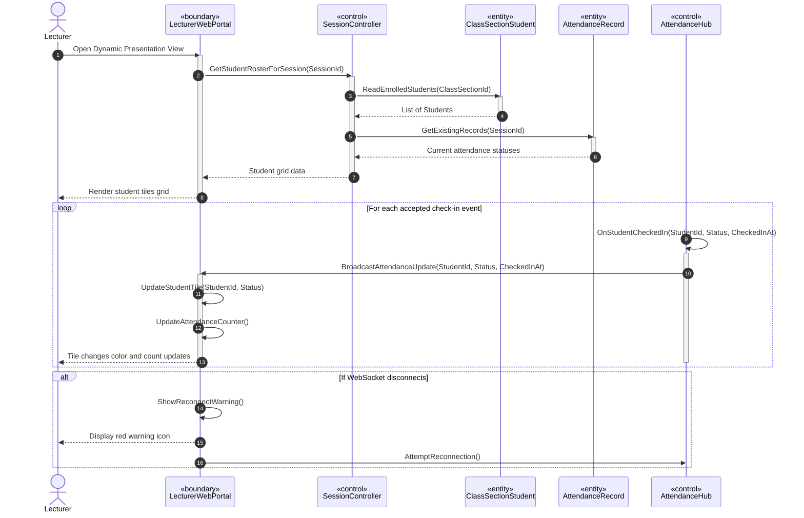

# SƠ ĐỒ TRÌNH TỰ CHI TIẾT: UC07 - GIÁM SÁT ĐIỂM DANH THỜI GIAN THỰC

Tài liệu này đặc tả sự tương tác động giữa các đối tượng phân tích tham gia Use Case **UC07: Real-time Attendance Monitor**.

---

## 📊 SƠ ĐỒ TRÌNH TỰ (MERMAID)

