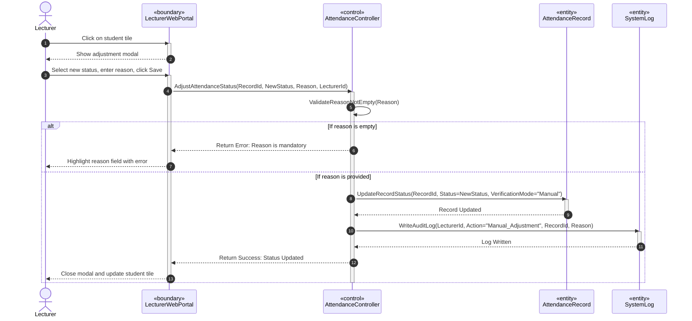

# SƠ ĐỒ TRÌNH TỰ CHI TIẾT: UC08 - ĐIỀU CHỈNH ĐIỂM DANH THỦ CÔNG

Tài liệu này đặc tả sự tương tác động giữa các đối tượng phân tích tham gia Use Case **UC08: Manual Attendance Adjustment**.

---

## 📊 SƠ ĐỒ TRÌNH TỰ (MERMAID)

