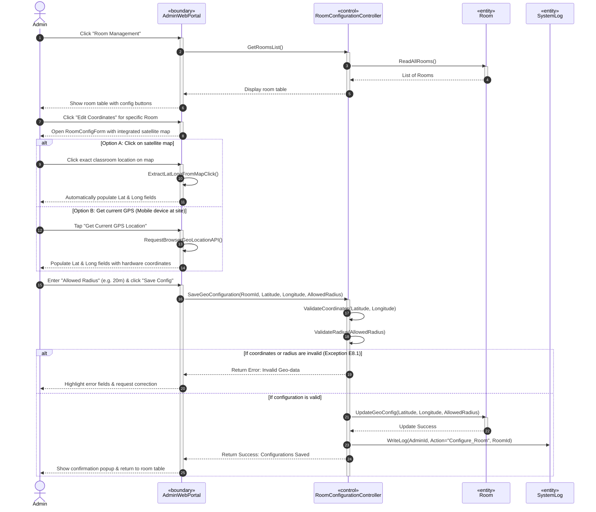

# SƠ ĐỒ TRÌNH TỰ CHI TIẾT: UC11 - CẤU HÌNH TỌA ĐỘ VÀ BÁN KÍNH PHÒNG HỌC

Tài liệu này đặc tả sự tương tác động giữa các đối tượng phân tích tham gia Use Case **UC11: Cấu hình tọa độ và bán kính phòng học** của Quản trị viên (Admin).

---

## 📊 SƠ ĐỒ TRÌNH TỰ (MERMAID)

---

## 🔍 QUY TRÌNH CẤU HÌNH & XÁC THỰC GPS PHÒNG

1.  **Cách 1 & 2 (Nạp tọa độ tự động):** Để tối ưu hóa trải nghiệm sử dụng (Usability), hệ thống hỗ trợ cả việc tích chọn trực tiếp trên bản đồ vệ tinh (Google Maps API) lẫn việc Admin cầm máy tính bảng đi trực tiếp đến phòng học vật lý và gọi cảm biến GPS phần cứng (`Get Current GPS Location`) để tự động nạp tọa độ chính xác cao mà không cần ghi nhớ số liệu.
2.  **Bước 18 (Validate GPS):** Bộ điều khiển `RoomConfigurationController` kiểm tra tọa độ GPS nhập vào xem có nằm đúng trong phạm vi khuôn viên địa giới của trường FPTU hay không (BR-02) để tránh các sai số nhập liệu quá lớn từ Admin.
3.  **Bước 25 (Write Log):** Mọi thao tác thay đổi cấu hình địa lý phòng học phục vụ chống gian lận bắt buộc phải được ghi nhật ký hệ thống (`SystemLog`) chi tiết để phục vụ việc kiểm toán bảo mật về sau.
