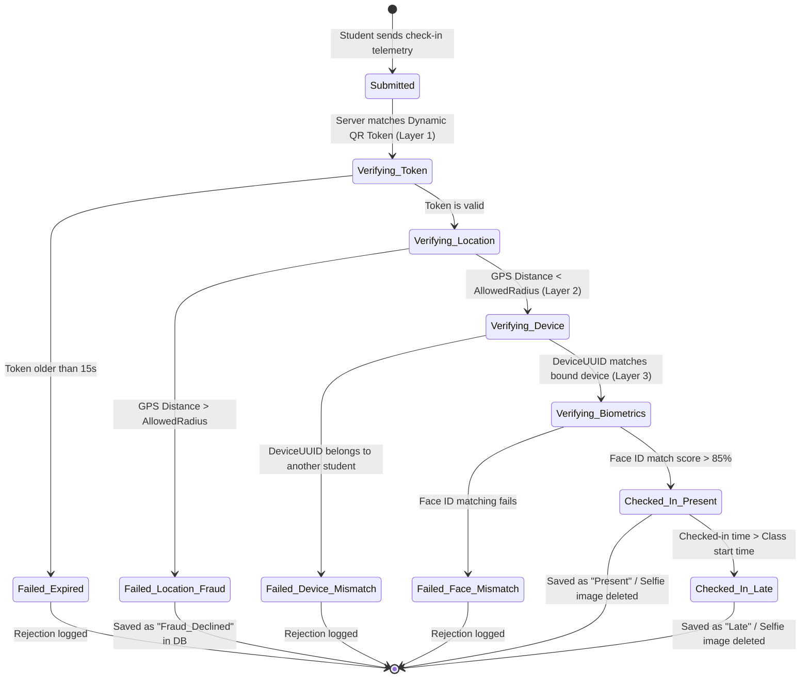

# SƠ ĐỒ TRẠNG THÁI CHI TIẾT: BẢN GHI ĐIỂM DANH (ATTENDANCE RECORD STATE DIAGRAM)

Tài liệu này mô tả sơ đồ máy trạng thái (State Diagram) cho thực thể **AttendanceRecord** (Bản ghi kết quả điểm danh) từ lúc sinh viên gửi dữ liệu cho đến khi được lưu trữ chính thức hoặc từ chối do phát hiện gian lận.

---

## 📊 SƠ ĐỒ TRẠNG THÁI (MERMAID)

