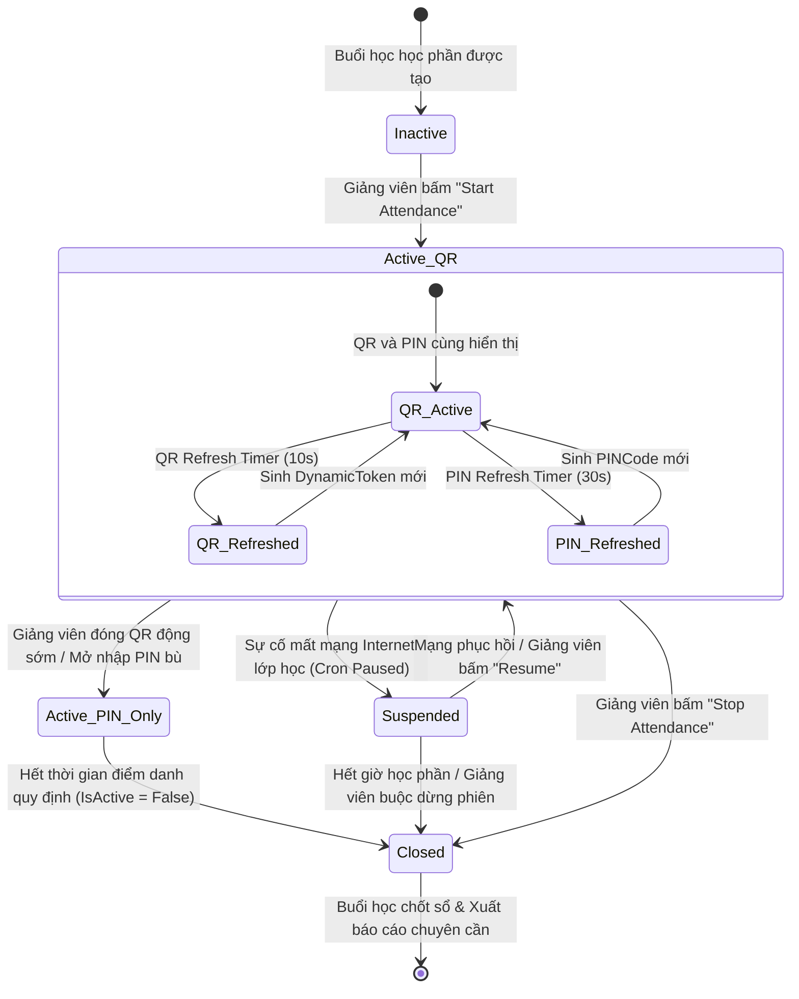

# SƠ ĐỒ TRẠNG THÁI: CHU KỲ PHIÊN ĐIỂM DANH (STATE DIAGRAM FOR ATTENDANCE SESSION)

Sơ đồ máy trạng thái (State Diagram) dưới đây mô tả chi tiết vòng đời, các trạng thái động và các sự kiện kích hoạt chuyển đổi trạng thái của một Phiên Điểm Danh (`AttendanceVersion` / `Session`) trong hệ thống **AFAS**.

---

## 📊 SƠ ĐỒ TRẠNG THÁI (MERMAID)

---

## 🔍 CHI TIẾT CÁC TRẠNG THÁI VÀ SỰ KIỆN CHUYỂN ĐỔI

1.  **Inactive (Chưa kích hoạt):** Trạng thái mặc định khi buổi học học phần (`Session`) được tạo sẵn trong hệ thống nhưng chưa đến giờ học hoặc Giảng viên chưa bấm nút kích hoạt điểm danh.
2.  **Active_QR (Kích hoạt QR động):** Trạng thái cốt lõi của phiên. Trong trạng thái này, hệ thống liên tục chạy 2 chu kỳ đếm ngược song song (`QR_Refreshed` chu kỳ 10s và `PIN_Refreshed` chu kỳ 30s) để sinh các mã bảo mật mới ngăn chặn chia sẻ ảnh từ xa.
3.  **Suspended (Tạm ngưng do sự cố):** Kích hoạt khi hệ thống phát hiện mất mạng Internet lớp học (không thể cập nhật WebSocket). Bộ điều khiển tạm ngưng bộ đếm thời gian làm mới mã để tránh sinh viên bị báo lỗi quá hạn liên tục.
4.  **Active_PIN_Only (Chỉ cho phép điểm danh bằng PIN):** Giảng viên có thể lựa chọn tắt trình chiếu mã QR động lớn nhưng vẫn giữ mã PIN tĩnh ở góc màn hình thêm 5 phút cho những sinh viên xếp hàng vào lớp muộn tự nhập mã PIN trên ứng dụng.
5.  **Closed (Đã đóng phiên):** Khi Giảng viên nhấn nút đóng điểm danh hoặc buổi học kết thúc. Thuộc tính `IsActive` chuyển thành `False`. Hệ thống khóa cứng, từ chối mọi yêu cầu điểm danh gửi lên sau thời điểm này. Giảng viên bắt đầu giai đoạn kiểm tra thủ công và xuất báo cáo.
