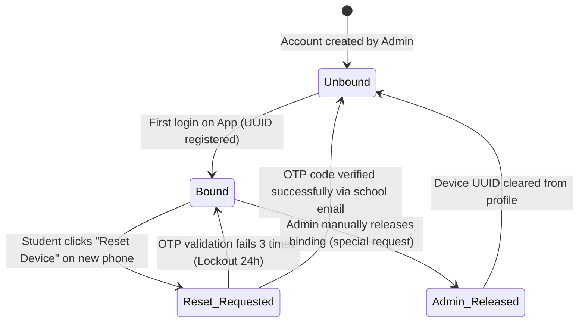

# SƠ ĐỒ TRẠNG THÁI CHI TIẾT: LIÊN KẾT THIẾT BỊ DI ĐỘNG (DEVICE BINDING STATE DIAGRAM)

Tài liệu này mô tả sơ đồ máy trạng thái (State Diagram) cho thực thể **Student Device Binding** (Khóa cứng thiết bị di động của sinh viên) giúp phòng chống điểm danh hộ trên nhiều điện thoại.

---

## 📊 SƠ ĐỒ TRẠNG THÁI (MERMAID)

