# SƠ ĐỒ LỚP THIẾT KẾ CHI TIẾT (DETAILED DESIGN CLASS DIAGRAM - ALL SERVICES)

Tài liệu này đặc tả sơ đồ lớp mức thiết kế chi tiết (Detailed Design Class Diagram) cho tất cả các dịch vụ cốt lõi: **Attendance Service, Authentication Service, Room Configuration Service, và Reporting Service** trong hệ thống **AFAS**.

---

## 📊 SƠ ĐỒ LỚP CHI TIẾT (MERMAID)

```mermaid
classDiagram
    %% --- PRESENTATION LAYER ---
    class AttendanceController {
        <<Boundary / WebAPI>>
        -IAttendanceService _attendanceService
        +SubmitAttendance(AttendanceDto dto) Task~IActionResult~
        +GetStudentHistory(string studentId) Task~IActionResult~
    }

    class AccountController {
        <<Boundary / WebAPI>>
        -IAuthenticationService _authService
        +LoginCredentials(LoginDto dto) Task~IActionResult~
        +LoginGoogle(GoogleLoginDto dto) Task~IActionResult~
    }

    class RoomController {
        <<Boundary / WebAPI>>
        -IRoomService _roomService
        +SaveRoomConfiguration(RoomDto dto) Task~IActionResult~
        +GetRooms() Task~IActionResult~
    }

    class ReportController {
        <<Boundary / WebAPI>>
        -IReportService _reportService
        +ExportClassReport(string classId) Task~IActionResult~
    }

    %% --- APPLICATION LAYER ---
    class IAttendanceService {
        <<Interface / Application>>
        +ProcessCheckin(AttendanceDto dto) Task~Result~CheckinResultDto~~
        +GetHistory(string studentId) Task~List~AttendanceRecordDto~~
    }

    class AttendanceService {
        <<Control / Application>>
        -IAttendanceRepository _attendanceRepo
        -IRoomRepository _roomRepo
        -ICacheManager _cacheManager
        -IRealtimeNotifier _notifier
        +ProcessCheckin(AttendanceDto dto) Task~Result~CheckinResultDto~~
        +GetHistory(string studentId) Task~List~AttendanceRecordDto~~
        -CalculateDistance(double lat1, double lon1, double lat2, double lon2) double
    }

    class IAuthenticationService {
        <<Interface / Application>>
        +AuthenticateCredentials(string username, string password) Task~Result~string~~
        +AuthenticateGoogle(string idToken) Task~Result~string~~
    }

    class AuthenticationService {
        <<Control / Application>>
        -IAccountRepository _accountRepo
        -IStudentRepository _studentRepo
        +AuthenticateCredentials(string username, string password) Task~Result~string~~
        +AuthenticateGoogle(string idToken) Task~Result~string~~
    }

    class IRoomService {
        <<Interface / Application>>
        +UpdateRoomGeo(RoomDto dto) Task~Result~bool~~
        +GetAllRooms() Task~List~RoomDto~~
    }

    class RoomService {
        <<Control / Application>>
        -IRoomRepository _roomRepo
        +UpdateRoomGeo(RoomDto dto) Task~Result~bool~~
        +GetAllRooms() Task~List~RoomDto~~
    }

    class IReportService {
        <<Interface / Application>>
        +GenerateExcelReport(string classId) Task~byte[]~
    }

    class ReportService {
        <<Control / Application>>
        -IAttendanceRepository _attendanceRepo
        -IExcelGenerator _excelGenerator
        +GenerateExcelReport(string classId) Task~byte[]~
    }

    %% --- DOMAIN CORE LAYER ---
    class AttendanceRecord {
        <<Domain Entity>>
        +string RecordId
        +string StudentId
        +string SessionId
        +DateTime CheckedInAt
        +double CheckedInLat
        +double CheckedInLong
        +double Distance
        +string WifiSSID
        +string PublicIP
        +string DeviceUUID
        +string SelfiePath
        +string Status
        +string VerificationMode
    }

    class Room {
        <<Domain Entity>>
        +string RoomId
        +string RoomName
        +double Latitude
        +double Longitude
        +double AllowedRadius
    }

    class Account {
        <<Domain Entity>>
        +string Id
        +string Email
        +string PasswordHash
        +string FullName
        +string Role
    }

    %% --- INFRASTRUCTURE LAYOUT ---
    class IAttendanceRepository {
        <<Interface / Domain>>
        +GetByIdAsync(string id) Task~AttendanceRecord~
        +AddAsync(AttendanceRecord entity) Task
    }

    class ICacheManager {
        <<Interface / Application>>
        +GetTokenAsync(string key) Task~string~
        +SetTokenAsync(string key, string value, TimeSpan expiry) Task
    }

    class AttendanceRepository {
        <<Database Wrapper / Infrastructure>>
        -DbContext _dbContext
        +GetByIdAsync(string id) Task~AttendanceRecord~
        +AddAsync(AttendanceRecord entity) Task
    }

    class RedisCacheManager {
        <<Infrastructure Cache>>
        -IConnectionMultiplexer _redis
        +GetTokenAsync(string key) Task~string~
        +SetTokenAsync(string key, string value, TimeSpan expiry) Task
    }

    %% Dependencies injection
    AttendanceController --> IAttendanceService
    AccountController --> IAuthenticationService
    RoomController --> IRoomService
    ReportController --> IReportService

    IAttendanceService <|.. AttendanceService
    IAuthenticationService <|.. AuthenticationService
    IRoomService <|.. RoomService
    IReportService <|.. ReportService

    AttendanceService --> IAttendanceRepository
    AttendanceService --> IRoomRepository
    AttendanceService --> ICacheManager
    AttendanceService --> AttendanceRecord

    AuthenticationService --> IAccountRepository
    AuthenticationService --> IStudentRepository

    RoomService --> IRoomRepository
    ReportService --> IAttendanceRepository

    IAttendanceRepository <|.. AttendanceRepository
    ICacheManager <|.. RedisCacheManager
```

