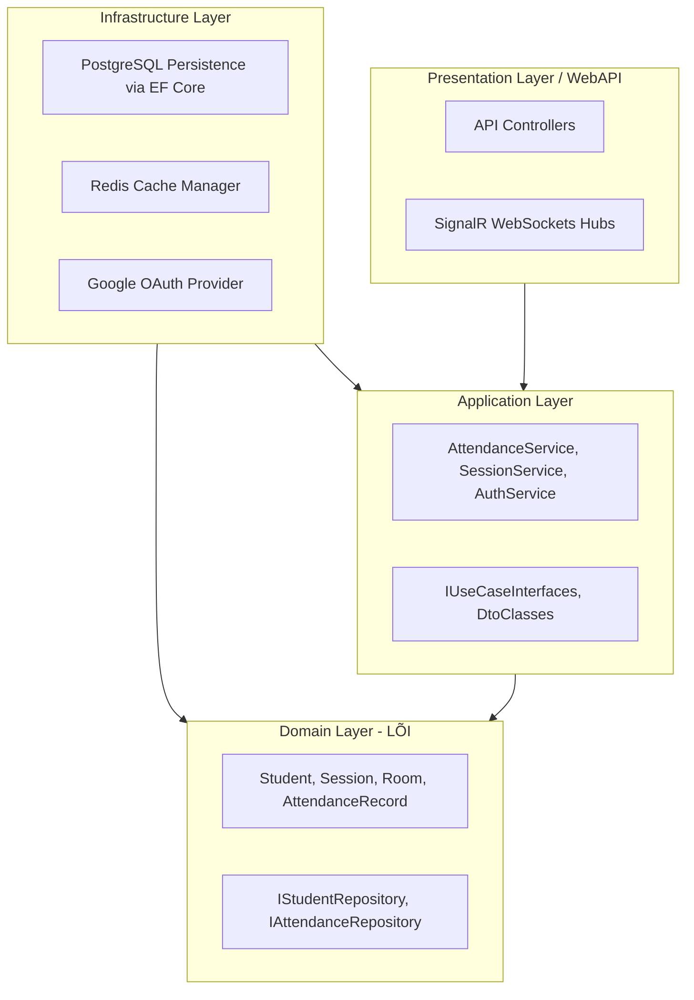
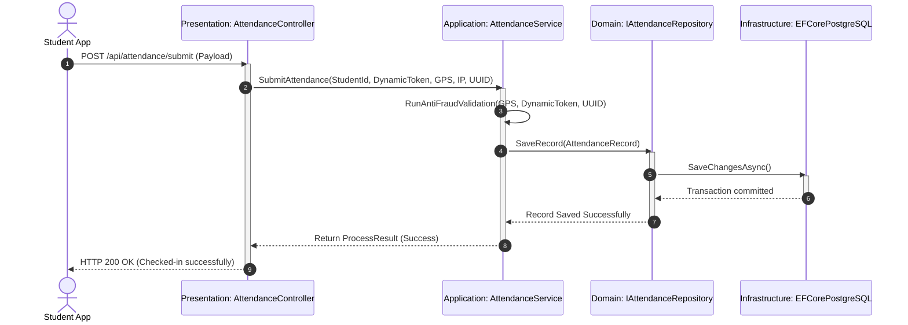
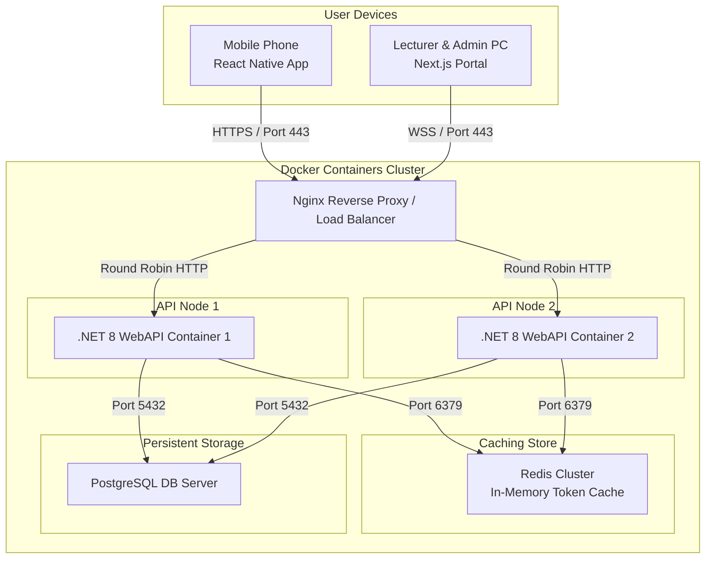

# THIẾT KẾ KIẾN TRÚC MỨC CAO (SYSTEM HIGH-LEVEL ARCHITECTURE - 3 VIEWS)

Tài liệu này đặc tả thiết kế kiến trúc mức cao của hệ thống **AFAS** thông qua 3 góc nhìn chuẩn hóa: **Static View** (Góc nhìn tĩnh), **Dynamic View** (Góc nhìn động) và **Deployment View** (Góc nhìn triển khai vật lý).

---

## 1. STATIC VIEW (GÓC NHÌN TĨNH - KIẾN TRÚC PHÂN TẦNG CLEAN ARCHITECTURE)

Hệ thống áp dụng kiến trúc **Clean Architecture** nhằm đảm bảo sự rạch ròi về mặt trách nhiệm giữa các lớp đối tượng, dễ dàng kiểm thử và thay đổi cấu hình kỹ thuật mà không đụng chạm đến logic nghiệp vụ cốt lõi.

---

## 2. DYNAMIC VIEW (GÓC NHÌN ĐỘNG - LUỒNG TƯƠNG TÁC XUYÊN TẦNG)

Góc nhìn động mô tả cách thức một thông điệp (Message) từ Mobile Client đi xuyên qua các tầng kiến trúc vật lý để thực hiện nghiệp vụ xác thực điểm danh.

---

## 3. DEPLOYMENT VIEW (GÓC NHÌN TRIỂN KHAI VẬT LÝ - FIX SƠ ĐỒ MERMAID)

Sơ đồ mô tả cấu trúc triển khai hạ tầng vật lý của hệ thống AFAS được thiết kế bằng mã Mermaid Flowchart chuẩn hóa 100% không lỗi render:

