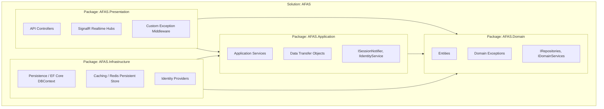
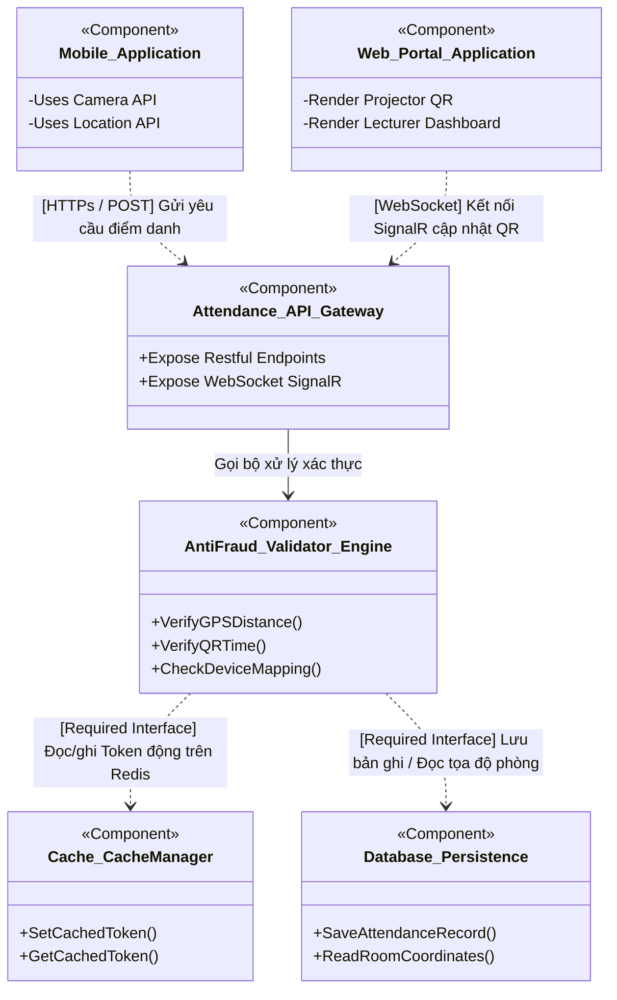

# SƠ ĐỒ GÓI VÀ THÀNH PHẦN (PACKAGE & COMPONENT DIAGRAM)

Tài liệu này mô tả sơ đồ gói (Package Diagram) định hình cấu trúc mã nguồn tĩnh và sơ đồ thành phần (Component Diagram) thể hiện các khối chức năng giao tiếp qua các cổng Interface của hệ thống **AFAS**, kèm theo lập luận về tiêu chí phân rã cấu trúc.

---

## 1. SƠ ĐỒ GÓI (PACKAGE DIAGRAM - CẤU TRÚC MÃ NGUỒN TĨNH)

Sơ đồ gói phân định cấu trúc các thư mục mã nguồn chính trong Solution của dự án, kiểm soát chặt chẽ luồng phụ thuộc để tránh phụ thuộc chéo vòng tròn.

---

## 2. SƠ ĐỒ THÀNH PHẦN (COMPONENT DIAGRAM - KIẾN TRÚC MÔ-ĐUN GIAO TIẾP VẬT LÝ)

Sơ đồ thành phần mô tả các thành phần phần mềm độc lập, tương tác với nhau thông qua các cổng giao tiếp (Ports) và giao diện lập trình (Provided/Required Interfaces) trong quá trình hoạt động thực tế.

---

## 3. TIÊU CHÍ PHÂN RÃ KIẾN TRÚC (DECOMPOSITION CRITERIA)

Việc phân rã Solution AFAS thành các gói (packages) và cấu phần (components) độc lập tuân thủ nghiêm ngặt 3 tiêu chí cốt lõi:

1.  **Single Responsibility Principle (SRP - Nguyên lý Đơn trách nhiệm):** Mỗi cấu phần chỉ giải quyết một tập trách nhiệm nghiệp vụ duy nhất.
    *   *Domain Package:* Chỉ chứa các luật nghiệp vụ thuần túy không lệ thuộc công nghệ.
    *   *Infrastructure Package:* Chỉ chịu trách nhiệm kết nối hạ tầng ngoài (PostgreSQL, Redis, Google).
2.  **High Cohesion (Độ liên kết cao):** Các lớp đối tượng có quan hệ mật thiết về mặt chức năng được gom nhóm chặt chẽ. Ví dụ, toàn bộ logic giải thuật đo Haversine, check IP Wi-Fi và check Token QR được đóng gói hoàn toàn bên trong mô-đun `AntiFraud_Validator_Engine`.
3.  **Low Coupling (Độ phụ thuộc thấp):** Các cấu phần chỉ giao tiếp qua các **Provided/Required Interfaces** (ví dụ: `ICacheManager`, `IAttendanceRepository`). Việc ghép nối lớp cụ thể sẽ do cơ chế Dependency Injection điều phối tự động giúp hệ thống cực kỳ linh hoạt và dễ kiểm thử Mocking.
