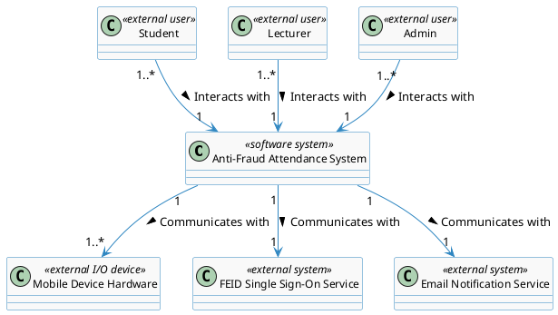
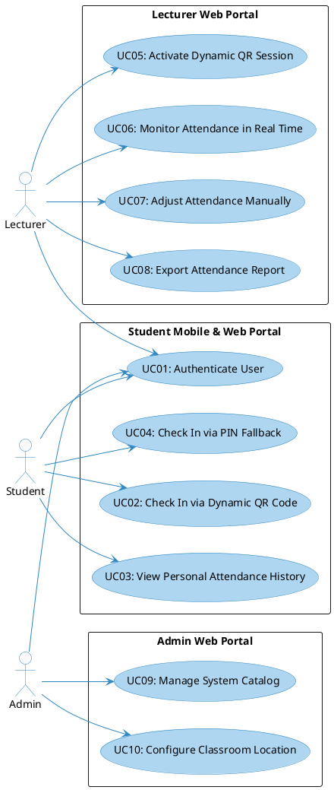
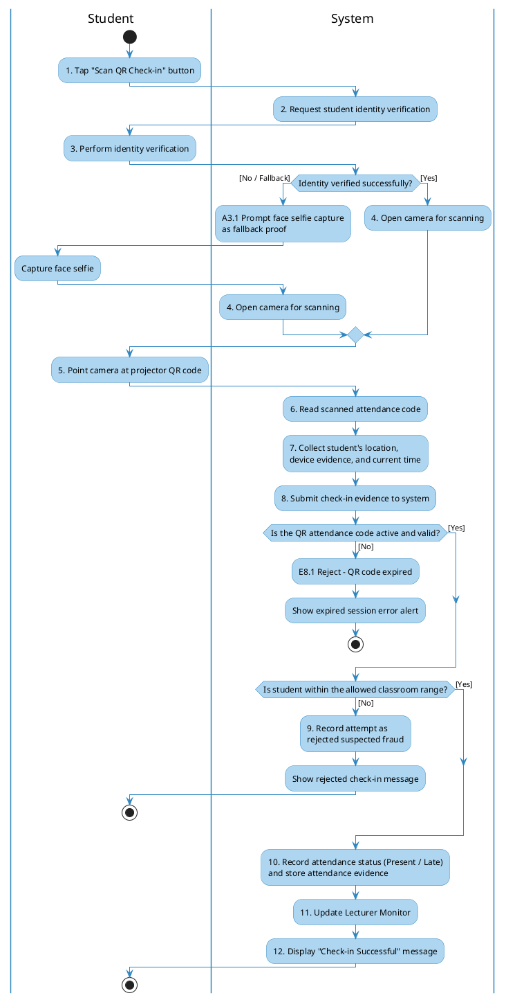
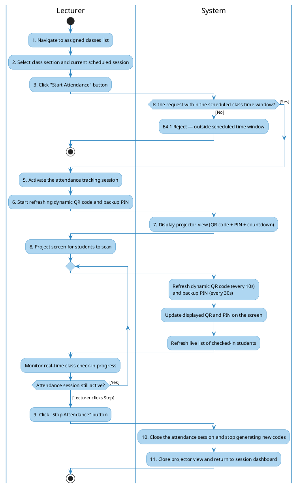
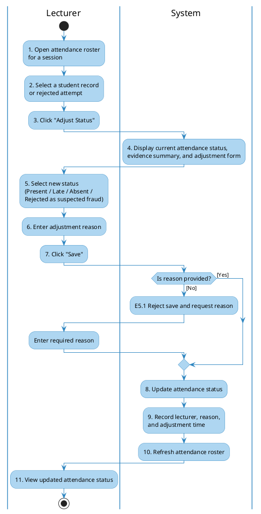
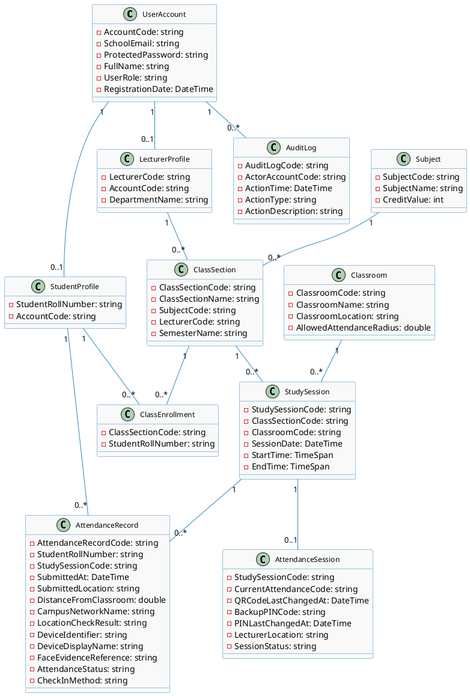

# **Requirement & Design Specification**

## **Anti-Fraud Attendance System (AFAS)**

**Subject: SWD392**

**Version: 1.0**

- Hanoi, May 2026 -

---

## **Record of Changes**

| **Version** | **Date** | **A/M/D*** | **In charge** | **Change Description** |
| :--- | :--- | :--- | :--- | :--- |
| V1.0 | 26/05/2026 | A | SWD392 Team | Initial release of Requirement Specification (Section I) for AFAS including Problem Description, Features, Context, NFRs, Use Cases, Activity Diagrams, and Data Dictionary. |
| V1.1 | 27/05/2026 | A | SWD392 Team | Added Analysis Models (Section II): Interaction Diagrams (Sequence & Communication) for UC01, UC03, UC05, UC06, UC07, UC08, UC11; State Diagrams for AttendanceVersion, AttendanceRecord, DeviceBinding; Static Analysis (Contextual Boundary Class Diagram, Object Structuring Criteria, UI Mockups). |
| V1.2 | 27/05/2026 | A | SWD392 Team | Added Design Specification (Section III): Integrated Communication Diagram, 3-View Architecture, Component/Package Diagrams, Detailed Class Design, Database Schema. Added Implementation Mapping (Section IV) and Verification/Testing (Section V). |
| V1.3 | 09/06/2026 | M | SWD392 Team | Added cross-phase traceability framework: source-to-feature matrix, business process model, anti-fraud rule catalog, missing dynamic analysis diagrams for UC02/UC04/UC09/UC10, analysis-to-design transformation matrices, NFR realization matrix, DB rule mappings, implementation traceability, and verification coverage matrix. |

*\*A - Added, M - Modified, D - Deleted*

---

### **Contents**

*   [I. Requirement Specification](#i-requirement-specification)
    *   [I.1 Problem description](#i1-problem-description)
    *   [I.2 Major Features](#i2-major-features)
    *   [I.3 System context](#i3-system-context)
    *   [I.4 Non-functional Requirements](#i4-non-functional-requirements)
    *   [I.5 Functional requirements](#i5-functional-requirements)
        *   [I.5.1 Use case diagrams](#i51-use-case-diagrams)
        *   [I.5.2 Use case descriptions](#i52-use-case-descriptions)
        *   [I.5.3 Activity diagrams](#i53-activity-diagrams)
    *   [I.6 Data Requirements](#i6-data-requirements)
*   [II. Analysis Models](#ii-analysis-models)
    *   [II.1 Interaction diagrams](#ii1-interaction-diagrams)
    *   [II.2 State diagrams](#ii2-state-diagram)
*   [III. Design Specification](#iii-design-specification)
    *   [III.1 Integrated Communication Diagrams](#iii1-integrated-communication-diagrams)
    *   [III.2 System High-Level Design](#iii2-system-high-level-design)
    *   [III.3 Component and Package Diagram](#iii3-component-and-package-diagram)
    *   [III.4 Detail Design](#iii4-detail-design)
    *   [III.5 Database Design](#iii5-database-design)
*   [IV. Implementation](#iv-implementation)
    *   [IV.1 Map architecture to the structure of the project](#iv1-map-architecture-to-the-structure-of-the-project)
    *   [IV.2 Map Class Diagram and Interaction Diagram to Code](#iv2-map-class-diagram-and-interaction-diagram-to-code)

---

## **I. Requirement Specification**

## **I.1 Problem description**

**Purpose:** Automate the classroom attendance process and implement robust defense layers to prevent common attendance fraud, such as proxy check-ins (friends checking in for absent students) and sharing classroom QR codes with absent students off-campus. The system simulates a university environment of approximately 8,000 students.

The core requirements are described as follows:

1.  **Authentication:** Students must log into the system using their personal student accounts (MSSV and assigned password) or the university FEID single sign-on account. All university staff and lecturers must also log in before performing any action.
2.  **Device Security Notification:** To detect account sharing, the student's application sends the device identifier upon login. If the account is logged in on a new or unfamiliar device, the system records the new device identifier and sends an automatic security notification to the student's registered address, while allowing the login to proceed.
3.  **Dynamic QR Code Attendance:** To prevent students from taking photos of the QR code and sharing it with absent peers, the lecturer initiates an attendance session which displays a large dynamic QR code on the projector screen. This QR code refreshes its attendance code every 10 seconds. The system only accepts check-ins matching the active attendance code within a strict 15-second grace window.
4.  **Geofencing (Location Evidence Logging):** To record evidence of student presence, the application automatically attaches the student's current location during the QR scan. The system compares the submitted location with the classroom's configured location. If the student is outside the configured radius for the classroom (e.g., > 20 meters), the system records the attempt as suspected fraud and rejects it as a valid attendance record. The lecturer can later perform a manual adjustment when there is a legitimate reason.
5.  **Campus Network Evidence Logging:** As a supporting audit signal, the application attaches the current campus network name when available. The system records this information alongside the check-in evidence to help lecturers verify whether the check-in occurred on the university's network.
6.  **Biometric Verification:** To prevent students from handing their phones to classmates to check in for them, the application requires local biometric verification as the primary check. If local biometric verification is unavailable or fails, the app falls back to capturing a face selfie as validation proof, and the system protects and removes this proof according to privacy rules.
7.  **Real-time Monitoring:** As students scan and successfully check in, the lecturer's Web Portal interface highlights the student's name immediately, enabling live visual auditing.
8.  **Doubtful/Manual Adjustments:** Lecturers can override attendance records manually on the web portal to mark a student present, late, absent, or review rejected suspected-fraud attempts if they have a legitimate excuse or if there is a network outage.
9.  **Reporting:** Lecturers can export the finalized attendance sheets to spreadsheet formats such as Excel at the end of a session.
10. **System Configurations:** Administrators manage system catalogs (users, subjects, class sections) and configure the exact GPS coordinates and allowed radius for each physical classroom on campus.
11. **Internet Fallback:** In the case of an internet outage at the lecture hall, the lecturer can suspend the dynamic session and reopen a short check-in session at the end of the class, or manually check in students.

---

## **I.2 Major Features**

The system comprises three main portals: Student Mobile App, Lecturer Web Portal, and Admin Web Portal.

### **Features for Students (Mobile & Web):**
*   **F01: Personal Authentication:** Login using MSSV/password or university FEID single sign-on, manage profile.
*   **F02: Device Security Notification:** Record the device identifier during login and send security alerts to school mail upon login on unfamiliar devices.
*   **F03: Scan QR Code:** Open camera, verify student identity, scan the dynamic QR code, and submit location and device evidence.
*   **F04: Check In via PIN Fallback:** Enter the 6-digit PIN code displayed on the lecturer screen if the camera is broken. Location and device evidence are still recorded.
*   **F05: View Attendance History:** Track attended, late, and absent sessions with visual statistics.

### **Features for Lecturers (Web Portal):**
*   **F06: Class Section Management:** View assigned classes, schedule, and student rosters.
*   **F07: Start Dynamic Attendance:** Generate dynamic QR (10s refresh) and PIN (30s refresh) displayed on the projector screen.
*   **F08: Real-time Attendance Monitor:** Track live check-in progress with color-coded student names.
*   **F09: Manual Adjustments:** Manually change student attendance status (Present, Late, Absent, Rejected as suspected fraud).
*   **F10: Export Attendance Report:** Export attendance history sheets to spreadsheet formats such as Excel.

### **Features for Administrators (Web Portal):**
*   **F11: System Catalog Management:** Manage accounts (Students, Lecturers), Subjects, and Class Sections.
*   **F12: Classroom Location Configuration:** Setup room location and custom allowed radius.

## **I.3 System context**

The system context diagram models the boundaries between the Anti-Fraud Attendance System (AFAS) and the external actors or systems it communicates with.

---

## **I.4 Non-functional Requirements**

*   **NF-01 Performance & Concurrency:**
    *   The attendance confirmation result must be shown within **< 2.0 seconds** for 95% of check-in attempts under a peak load of **500 - 1,000 concurrent students** within a 5-minute window.
    *   Dynamic QR attendance codes must refresh every **10.0 seconds** and PIN codes every **30.0 seconds**.
    *   Live attendance monitor updates must appear on the lecturer's screen within **< 1.0 second** after the check-in is accepted.

*   **NF-02 Location Accuracy:**
    *   The system must support classroom attendance validation with an acceptable location error tolerance of **15 - 20 meters**.
    *   The allowed attendance radius must be configurable for each classroom.

*   **NF-03 Usability:**
    *   Student check-in flow from app launch to confirmation screen must be completed in **< 5.0 seconds** for 95% of users.
    *   System interface must achieve a System Usability Scale (SUS) score of **>= 80** and comply with accessibility guidelines (WCAG 2.1 Level AA).

*   **NF-04 Security & Privacy:**
    *   Student authentication and attendance evidence must be protected from unauthorized access.
    *   Student face evidence captured during fallback checks must be protected and automatically removed after the semester ends.
    *   Audit logs must be generated for all administrative actions and lecturer manual adjustments.

*   **NF-05 Reliability & Availability:**
    *   The system must be available during active teaching hours (7:00 AM - 9:00 PM daily).
    *   If the attendance session cannot be continued due to network interruption, lecturers must be able to use manual adjustment or reopen a short check-in window at the end of the class.

*   **NF-06 Maintainability:**
    *   Attendance rules, classroom radius configuration, and manual adjustment rules must be documented clearly enough for future maintenance.
    *   The system must keep audit information for attendance changes so that later reviews can trace who changed what and why.

*   **NF-07 Scalability:**
    *   The system must support the project scale of approximately **8,000 students**.
    *   The system must support peak classroom check-in periods without degrading the performance metrics stated in NF-01.

## **I.5 Functional requirements**

### **I.5.1 Use case diagrams**

The functional requirements are mapped to three main use case diagrams representing the Student, Lecturer, and Admin subsystems.

#### **Overview Use Case Diagram**

---

### **I.5.2 Use case descriptions**

Below are the detailed descriptions for all **10 Use Cases** of the AFAS system:

#### **Table I-1: Use case description for UC01 - Authenticate User**
| **Field** | **Description** |
| :--- | :--- |
| **ID and Name:** | **UC01: Authenticate User** |
| **Created By:** | SWD392 Team |
| **Primary Actor:** | Student, Lecturer, Admin |
| **Secondary Actor:** | FEID Single Sign-On Service, Email Notification Service |
| **Description:** | Allows any system user to securely authenticate and access their respective portal using either MSSV/password or the university FEID single sign-on account. |
| **Trigger:** | The user opens the mobile application or visits the web portal. |
| **Preconditions:** | The user account must exist in the system. |
| **Postconditions:** | **POST-1 Success:** User is authenticated, access to the correct portal is granted, and the user is redirected to their dashboard.  **POST-2 Failure:** Authentication fails and access is denied. |
| **Normal Flow:** | 1. User selects login method: "MSSV/Password" or "FEID SSO". 2. **If MSSV/Password:** User inputs MSSV/username and password, then submits. (See A2.1) 3. **If FEID SSO:** User selects the FEID login option and confirms identity using the university single sign-on service. 4. System validates the user's identity and role. 5. System checks the submitted device identifier. If it is an unfamiliar device for this student, the system records the new device identifier and sends a security alert email to the student's email. 6. System redirects user to their corresponding homepage. |
| **Alternative Flows:** | **A2.1 User forgets password:** User selects "Forgot Password", inputs registered email, receives reset link, and updates password. |
| **Exceptions:** | **E4.1 Invalid credentials:** System returns an error message: "Invalid username or password". **E4.2 Invalid FEID account:** If the FEID sign-on account is not recognized as a valid university account, system denies login. |
| **Priority:** | High |
| **Business Rules:** | **BR-01:** User passwords must be protected according to secure authentication standards. **BR-02:** Email addresses used for linked authentication must belong to the university domain. |

---

#### **Table I-2: Use case description for UC02 - Check In via Dynamic QR Code**
| **Field** | **Description** |
| :--- | :--- |
| **ID and Name:** | **UC02: Check In via Dynamic QR Code** |
| **Created By:** | SWD392 Team |
| **Primary Actor:** | Student |
| **Description:** | Student scans the active dynamic QR code on the projector screen and submits required location, device, and identity evidence to record attendance. |
| **Trigger:** | The student selects "Scan QR" from the dashboard. |
| **Preconditions:** | - Student is logged in (UC01). - Dynamic QR session is active (UC05). |
| **Postconditions:** | **POST-1 Success:** A valid attendance record is created with status `Present` or `Late`, and the lecturer screen is updated in real-time. **POST-2 Failure:** The check-in attempt is rejected. If the submitted location is outside the allowed classroom range, the system records the attempt with status `Rejected as suspected fraud` for lecturer review, but it is not counted as valid attendance. |
| **Normal Flow:** | 1. Student taps "Scan QR Check-in" on the mobile app. 2. App prompts for student identity verification. 3. Student successfully completes identity verification. 4. App displays the camera view. 5. Student scans the active QR code on the screen. 6. App collects the student's current location, device identifier, device name, and campus network evidence when available. 7. App submits the check-in evidence to the system. 8. System verifies that the scanned attendance code is active and matches the current attendance session. (See E8.1) 9. System compares the student's submitted location with the classroom's allowed range. (See E9.2) 10. System records the student's device and location evidence for audit purposes. 11. System registers the attendance status (`Present` or `Late` based on the check-in time). 12. System updates the Lecturer portal immediately. |
| **Alternative Flows:** | **A3.1 Identity verification fail/not supported:** If local identity verification fails or is not supported by the device, the student is prompted to capture a face selfie. The system protects this proof and removes it according to privacy rules. |
| **Exceptions:** | **E8.1 Attendance code expired:** If the attendance code has expired, the system rejects the check-in and returns "QR expired". No valid attendance record is created. **E9.1 Location unavailable:** If the app cannot obtain the student's current location, the submission is blocked and the student is prompted to enable location services. **E9.2 Outside allowed classroom range:** If the submitted location is outside the classroom's allowed range, the system records the attempt as `Rejected as suspected fraud`, notifies the student that the check-in is not accepted, and keeps the record available for lecturer review. **E10.1 Duplicate Check-in:** If an attendance record already exists for this student and session, the system returns the existing result without creating a duplicate record. |
| **Priority:** | High |
| **Business Rules:** | **BR-01:** Student location information must be recorded and retained as attendance evidence. **BR-02:** Fallback face evidence must be protected and automatically removed after the semester ends. **BR-03:** A late attendance status is recorded for check-ins submitted after the first 15 minutes of class. **BR-04:** Each student can have only one valid attendance record for each class session. **BR-05:** Check-in attempts outside the classroom range are retained for fraud control but are not counted as valid attendance unless the lecturer manually adjusts them. |

---

#### **Table I-3: Use case description for UC03 - View Personal Attendance History**
| **Field** | **Description** |
| :--- | :--- |
| **ID and Name:** | **UC03: View Personal Attendance History** |
| **Created By:** | SWD392 Team |
| **Primary Actor:** | Student |
| **Description:** | Allows students to view a summary of their attendance record for all enrolled class sections, including total present, late, and absent days. |
| **Trigger:** | The student selects the "History" tab from the navigation bar. |
| **Preconditions:** | Student is authenticated (UC01). |
| **Postconditions:** | Student views their visual attendance stats. |
| **Normal Flow:** | 1. Student taps "History" tab. 2. App requests the attendance history from the system. 3. System retrieves all records linked to the student. 4. App displays a list of enrolled class sections. 5. Student selects a class section. 6. App renders a detailed calendar view showing days present (Green), late (Orange), and absent (Red). |
| **Alternative Flows:** | None. |
| **Exceptions:** | **E3.1 System unavailable:** App displays the most recently available historical data and shows a connection warning. |
| **Priority:** | Medium |
| **Business Rules:** | **BR-01:** Students can only view their own attendance history. |

---

#### **Table I-4: Use case description for UC04 - Check In via PIN Fallback**
| **Field** | **Description** |
| :--- | :--- |
| **ID and Name:** | **UC04: Check In via PIN Fallback** |
| **Created By:** | SWD392 Team |
| **Primary Actor:** | Student |
| **Description:** | Allows students to manually type a 6-digit dynamic PIN code displayed on the screen to check in if their device camera is broken or unable to scan, while still providing location and device evidence. |
| **Trigger:** | The student selects the "PIN Check-in" option on the App. |
| **Preconditions:** | - Student is logged in (UC01). - Dynamic QR/PIN session is active (UC05). |
| **Postconditions:** | **POST-1 Success:** Student is marked present or late, and the check-in evidence is recorded. **POST-2 Failure:** The PIN check-in attempt is rejected. If the submitted location is outside the allowed classroom range, the system records the attempt with status `Rejected as suspected fraud` for lecturer review. |
| **Normal Flow:** | 1. Student selects "PIN Check-in" on the App. 2. App prompts for student identity verification. 3. Student successfully completes identity verification. 4. App displays an input screen with 6 digit slots. 5. Student types the active 6-digit PIN displayed on the corner of the projector screen. 6. App collects the student's current location, device identifier, device name, and campus network evidence when available. 7. System verifies that the PIN code is active. 8. System compares the student's submitted location with the classroom's allowed range. (See E7.4) 9. System records the device and location evidence for audit purposes. 10. System records attendance with status `Present` or `Late` based on the check-in time. |
| **Alternative Flows:** | None. |
| **Exceptions:** | **E7.1 PIN Expired:** If the student enters a PIN that has expired, the system rejects it. No valid attendance record is created. **E7.2 Location unavailable:** If the app cannot obtain the student's current location, the submission is blocked and the student is prompted to enable location services. **E7.3 Duplicate Check-in:** If an attendance record already exists for this student and session, the system returns the existing result without creating a duplicate record. **E7.4 Outside allowed classroom range:** If the submitted location is outside the classroom's allowed range, the system records the attempt as `Rejected as suspected fraud`, notifies the student that the check-in is not accepted, and keeps the record available for lecturer review. |
| **Priority:** | High |
| **Business Rules:** | **BR-01:** PIN fallback is used only when QR scanning is unavailable or impractical. **BR-02:** PIN check-in must still satisfy location, device, and identity evidence rules. **BR-03:** Check-in attempts outside the classroom range are retained for fraud control but are not counted as valid attendance unless the lecturer manually adjusts them. |

---

#### **Table I-5: Use case description for UC05 - Activate Dynamic QR Session**
| **Field** | **Description** |
| :--- | :--- |
| **ID and Name:** | **UC05: Activate Dynamic QR Session** |
| **Created By:** | SWD392 Team |
| **Primary Actor:** | Lecturer |
| **Description:** | Lecturer starts the attendance session for a class, generating a dynamic QR and PIN displayed on the projector screen for students. |
| **Trigger:** | The lecturer selects a scheduled session and clicks "Start Attendance". |
| **Preconditions:** | Lecturer is logged in (UC01) and currently within the scheduled session time window. |
| **Postconditions:** | **POST-1 Success:** Attendance session tracking is activated, and dynamic QR begins refreshing. **POST-2 Failure:** Session is not started, and an error is displayed. |
| **Normal Flow:** | 1. Lecturer navigates to "My Scheduled Classes" on Web Portal. 2. System displays assigned classes and scheduled sessions. 3. Lecturer selects the current session and clicks "Start Attendance". 4. System validates that the current time is within the session's scheduled window. 5. System marks the session's attendance tracking as active. 6. System begins generating a unique QR attendance code every 10s and a PIN code every 30s. 7. Web Portal displays the projector view with the dynamic QR, PIN, and real-time attendance table. |
| **Alternative Flows:** | **A8.1 Lecturer stops session early:** Lecturer clicks "Stop Attendance" before class ends. System marks the session's attendance tracking as inactive and stops updates. |
| **Exceptions:** | **E4.1 Outside scheduled hours:** If lecturer tries to start session outside the class time slot, system denies activation. |
| **Priority:** | High |
| **Business Rules:** | **BR-01:** Each class session can have at most one active attendance session at a time. |

---

#### **Table I-6: Use case description for UC06 - Monitor Attendance in Real Time**
| **Field** | **Description** |
| :--- | :--- |
| **ID and Name:** | **UC06: Monitor Attendance in Real Time** |
| **Created By:** | SWD392 Team |
| **Primary Actor:** | Lecturer |
| **Description:** | Lecturer monitors the check-in progress on a live grid where student names turn green in real-time as they successfully scan the QR. |
| **Trigger:** | The lecturer opens the live attendance monitor for an active attendance session. |
| **Preconditions:** | Session must be active. |
| **Postconditions:** | Lecturer has real-time visualization of class attendance. |
| **Normal Flow:** | 1. Lecturer opens the dynamic presentation view on the projector screen. 2. System displays a grid representing all students enrolled in the class section. 3. As a student successfully submits their check-in (UC02), System processes and validates it. 4. System sends a real-time notification event containing the student's ID and status. 5. The lecturer's web interface receives the event and instantly changes the student's tile to green (Present) or orange (Late) with a chime sound. 6. Attendance count updates dynamically. |
| **Alternative Flows:** | None. |
| **Exceptions:** | **E5.1 Connection Interrupted:** If the connection drops, Web Portal displays a warning icon and attempts to reconnect. |
| **Priority:** | High |
| **Business Rules:** | **BR-01:** Student attendance progress must be synchronized immediately with the lecturer's monitoring screen. |

---

#### **Table I-7: Use case description for UC07 - Adjust Attendance Manually**
| **Field** | **Description** |
| :--- | :--- |
| **ID and Name:** | **UC07: Adjust Attendance Manually** |
| **Created By:** | SWD392 Team |
| **Primary Actor:** | Lecturer |
| **Description:** | Allows the lecturer to manually change a student's attendance status, including accepting a rejected suspected-fraud attempt when there is a legitimate reason. |
| **Trigger:** | Lecturer selects a student name from the list and clicks "Adjust Status". |
| **Preconditions:** | Lecturer is authenticated (UC01) and an attendance record or session roster exists for the target student and session. |
| **Postconditions:** | Student status is updated in the system and logged to the administrative audit log. |
| **Normal Flow:** | 1. Lecturer views the student roster for the active/past session. 2. Lecturer clicks on a specific student tile and selects "Adjust Status". 3. System displays a form with status options: `Present`, `Late`, `Absent`, `Rejected as suspected fraud`. 4. Lecturer selects the new status and enters a reason (e.g., "GPS device hardware error"). 5. Lecturer clicks "Save". 6. System updates the student's attendance status and notes the verification method as `Manual`. 7. System logs the lecturer's action in the administrative audit log. |
| **Alternative Flows:** | None. |
| **Exceptions:** | **E5.1 Missing reason:** If the lecturer changes status without inputting a mandatory reason, the system prompts them to write a reason before saving. |
| **Priority:** | High |
| **Business Rules:** | **BR-01:** Every manual attendance status change by a lecturer must include a specific reason and record the actor who performed it. |

---

#### **Table I-8: Use case description for UC08 - Export Attendance Report**
| **Field** | **Description** |
| :--- | :--- |
| **ID and Name:** | **UC08: Export Attendance Report** |
| **Created By:** | SWD392 Team |
| **Primary Actor:** | Lecturer |
| **Description:** | Exports the attendance statistics sheet for a specific class section or semester into spreadsheet formats such as Excel for grading and academic records. |
| **Trigger:** | The lecturer clicks the "Export Report" button on the class details screen. |
| **Preconditions:** | Lecturer is logged in (UC01). |
| **Postconditions:** | Attendance report file is downloaded to the lecturer's local computer. |
| **Normal Flow:** | 1. Lecturer navigates to class detail view. 2. Lecturer clicks "Export Report". 3. System compiles all session records of that class from the class rosters and student history. 4. System prepares report content containing student info, date of sessions, check-in mode, warnings, rejected attempts, and aggregate attendance percentage. 5. System generates the attendance report file. 6. Lecturer saves the report file locally. |
| **Alternative Flows:** | None. |
| **Exceptions:** | **E3.1 No records exist:** If no attendance sessions have been run for the class, system displays an empty-state message and disables the export button. |
| **Priority:** | Medium |
| **Business Rules:** | **BR-01:** Exported attendance reports must accurately reflect attendance history, including rejected suspected-fraud attempts and manual adjustments. |

---

#### **Table I-9: Use case description for UC09 - Manage System Catalog**
| **Field** | **Description** |
| :--- | :--- |
| **ID and Name:** | **UC09: Manage System Catalog** |
| **Created By:** | SWD392 Team |
| **Primary Actor:** | Admin |
| **Description:** | Allows administrative staff to create, update, or delete system raw catalog records: User accounts (Students/Lecturers), Subjects, and Class Sections. |
| **Trigger:** | Admin clicks on any catalog link in the Admin Portal menu. |
| **Preconditions:** | Admin is logged in (UC01). |
| **Postconditions:** | Catalog information is updated in the system. |
| **Normal Flow:** | 1. Admin logs into the Admin Portal. 2. Admin clicks on a catalog menu option (e.g., "Students", "Subjects"). 3. System displays a grid with search/add/edit/delete actions. 4. Admin inputs new student details (Student ID, Full Name, Email) and submits. 5. System validates the input and records the new student information and user profile. |
| **Alternative Flows:** | **A4.1 Batch Import:** Admin uploads a structured data file containing student/subject records. System parses the file, validates the data, and imports the new records into the system. |
| **Exceptions:** | **E5.1 Duplicate ID:** If Admin attempts to add a student ID that already exists, system displays a validation error: "ID already exists". |
| **Priority:** | High |
| **Business Rules:** | **BR-01:** Class section and student identifiers must be unique across the system. |

---

#### **Table I-10: Use case description for UC10 - Configure Classroom Location**
| **Field** | **Description** |
| :--- | :--- |
| **ID and Name:** | **UC10: Configure Classroom Location** |
| **Created By:** | SWD392 Team |
| **Primary Actor:** | Admin |
| **Description:** | Admin configures the exact classroom location and allowed attendance radius for classrooms on campus, which serves as the source for location-based attendance validation. |
| **Trigger:** | Admin clicks "Room Management" on the dashboard. |
| **Preconditions:** | Admin is logged in (UC01). |
| **Postconditions:** | Room location settings are updated in the room configurations. |
| **Normal Flow:** | 1. Admin navigates to "Room Management". 2. System displays all physical classrooms on campus. 3. Admin selects a room (e.g., `AL-L402`) and clicks "Configure Location". 4. System opens a configuration form for room location and allowed attendance radius. 5. Admin sets the exact classroom center point or manually inputs the classroom location values. 6. Admin enters the `Allowed Radius` parameter (e.g., 20 meters). 7. Admin clicks "Save Configuration". 8. System verifies that the location belongs to the university campus, updates the room configurations, and logs the administrative action in the audit log. |
| **Alternative Flows:** | **A5.1 On-site Mobile Calibration:** Admin visits the room physically on-site and selects "Capture Current Location". The current location is automatically populated. |
| **Exceptions:** | **E8.1 Out-of-bounds Location:** If Admin inputs a location that is not within the university's boundary, system prompts a warning to verify the number. |
| **Priority:** | High |
| **Business Rules:** | **BR-01:** Each classroom has a standard location and a default allowed radius of 20 meters unless configured otherwise to compensate for device location variance. |

---

### **I.5.3 Activity diagrams**

Below are the activity diagrams modeling the key event flows of the check-in, session activation, and manual adjustment use cases.

#### **Figure I-11: Activity diagram for UC02 - Check In via Dynamic QR Code**

---

#### **Figure I-12: Activity diagram for UC05 - Activate Dynamic QR Session**

---

#### **Figure I-13: Activity diagram for UC07 - Adjust Attendance Manually**

---

## **I.6 Data Requirements**

### **Figure I-14: Entity class diagram modeling data requirements**

---

The entity class diagram (Figure I-14) specifies the domain entities and their relationships, representing the system's data requirements. Table I-7 below serves as the data dictionary, describing each entity's attributes, data types, constraints, and purpose.

### **Table I-7: Data Description (Data dictionary)**

| **Name** | **Data Type** | **Description** |
| :--- | :--- | :--- |
| **UserAccount** | | **User credentials account data** |
| AccountCode | Text | Unique identifier for the account. |
| SchoolEmail | Text | Registered school email address. Must belong to the university email domain and be unique. |
| ProtectedPassword | Text | Protected password information used for account authentication when FEID SSO is not used. |
| FullName | Text | Full display name of the user. |
| UserRole | Text | System access role. Must be one of: `Student`, `Lecturer`, `Admin`. |
| RegistrationDate | Date/Time | The date and time when the account was first registered. |
| **StudentProfile** | | **Student profile data** |
| StudentRollNumber | Text | Unique student roll number (e.g. `SE170123`). |
| AccountCode | Text | Links the student profile to their user account. |
| **LecturerProfile** | | **Lecturer profile data** |
| LecturerCode | Text | Assigned school lecturer ID (e.g. `HueCTM`). |
| AccountCode | Text | Links the lecturer profile to their user account. |
| DepartmentName | Text | Faculty department name. |
| **Classroom** | | **Classroom location configurations** |
| ClassroomCode | Text | Physical classroom identifier (e.g., `AL-L402`). |
| ClassroomName | Text | Display name of the room. |
| ClassroomLocation | Text | Standard classroom location used for attendance validation. |
| AllowedAttendanceRadius | Decimal | Maximum allowed attendance radius in meters (defaults to 20m). |
| **Subject** | | **University subject course details** |
| SubjectCode | Text | Subject code identifier (e.g., `SWD392`). |
| SubjectName | Text | Detailed course name. |
| CreditValue | Number | Credit value of the course (must be greater than 0). |
| **ClassSection** | | **Assigned course class section** |
| ClassSectionCode | Text | Class section code (e.g., `SWD392_SU26_SE1701`). |
| ClassSectionName | Text | Friendly segment name of the class. |
| SubjectCode | Text | Reference subject code. |
| LecturerCode | Text | Reference lecturer teaching this class. |
| SemesterName | Text | Academic semester name. |
| **ClassEnrollment** | | **Class enrollment roster** |
| ClassSectionCode | Text | Reference class section code. |
| StudentRollNumber | Text | Enrolled student roll number. |
| **StudySession** | | **Scheduled study session date/time** |
| StudySessionCode | Text | Unique identifier of the class session. |
| ClassSectionCode | Text | Belongs to class section code. |
| ClassroomCode | Text | Physical classroom location of the session. |
| SessionDate | Date | Scheduled calendar date. |
| StartTime | Time | Scheduled class start hour. |
| EndTime | Time | Scheduled class end hour. |
| **AttendanceSession** | | **Dynamic QR/PIN attendance session** |
| StudySessionCode | Text | Ties the attendance session to a specific scheduled study session. |
| CurrentAttendanceCode | Text | Current active attendance code displayed in the QR for verification. |
| QRCodeLastChangedAt | Date/Time | Exact timestamp when the QR attendance code was last refreshed. |
| BackupPINCode | Text | 6-digit backup fallback attendance code. |
| PINLastChangedAt | Date/Time | Exact timestamp when the PIN code was last refreshed (valid for 30s). |
| LecturerLocation | Text | Lecturer's location evidence when session was activated, if available. |
| SessionStatus | Text | Indicates whether the attendance session is active, suspended, or closed. |
| **AttendanceRecord** | | **Check-in evidence and attendance result records** |
| AttendanceRecordCode | Text | Unique identifier for the attendance attempt or valid attendance result. |
| StudentRollNumber | Text | Referencing the checked student. |
| StudySessionCode | Text | Referencing the active study session. |
| SubmittedAt | Date/Time | Timestamp when the check-in evidence was submitted. |
| SubmittedLocation | Text | Location evidence submitted by the student's device. |
| DistanceFromClassroom | Decimal | Calculated distance from the configured classroom location. |
| CampusNetworkName | Text | Campus network name submitted during check-in when available. |
| LocationCheckResult | Text | Result of the location check: `Within allowed range` or `Outside allowed range`. |
| DeviceIdentifier | Text | Device identifier captured for audit evidence and login security alerts. |
| DeviceDisplayName | Text | Device display name used during check-in. |
| FaceEvidenceReference | Text | Reference to face verification proof when fallback identity verification is used. |
| AttendanceStatus | Text | Final attendance status: `Present`, `Late`, `Absent`, or `Rejected as suspected fraud`. |
| CheckInMethod | Text | Selected check-in method: `QR`, `PIN`, or `Manual`. |
| **AuditLog** | | **Administrative audit history log** |
| AuditLogCode | Text | Unique audit log entry identifier. |
| ActorAccountCode | Text | Account code of the user performing the action. |
| ActionTime | Date/Time | Precise timestamp of the action. |
| ActionType | Text | Category of action performed. |
| ActionDescription | Text | Detailed description of the logged action. |

---

