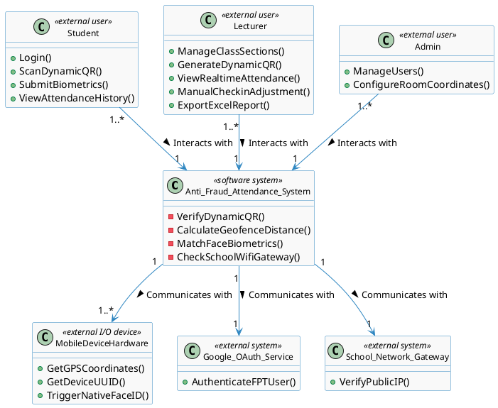
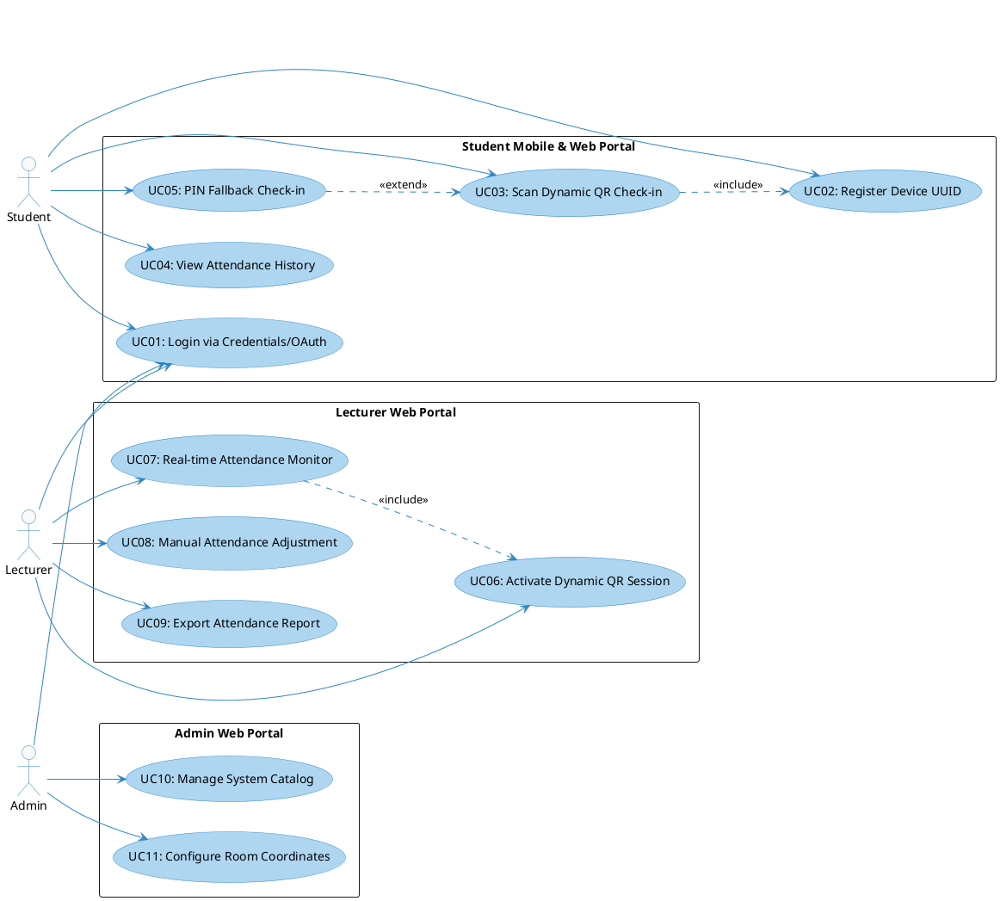
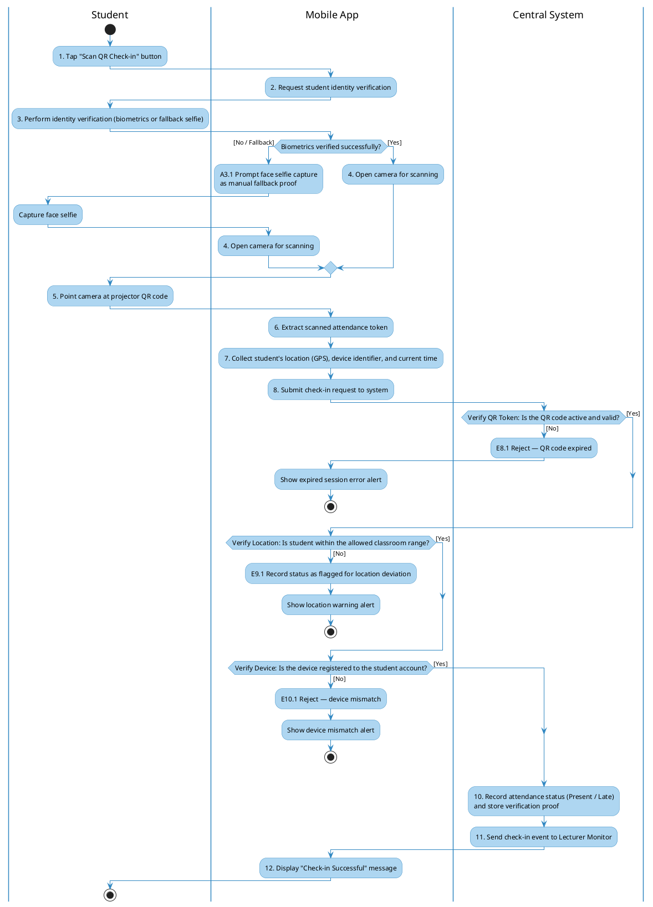
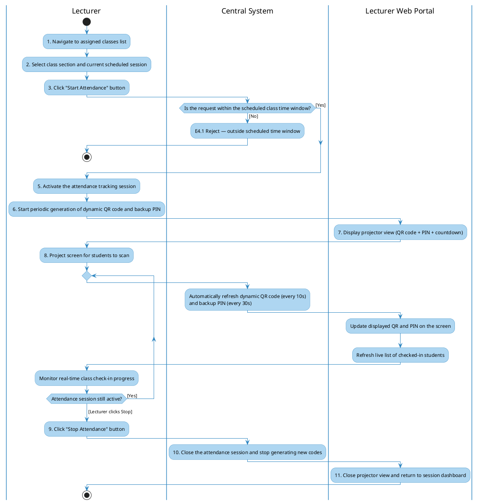
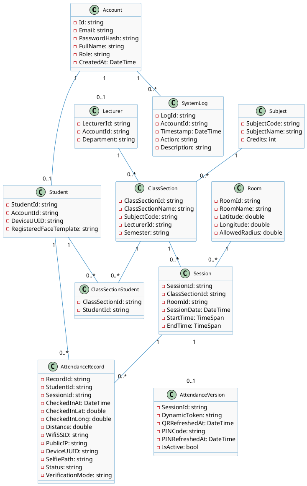

# **Requirement & Design Specification**

## **Anti-Fraud Attendance System (AFAS)**

**Subject: SWD392**

**Version: 1.0**

- Hanoi, May 2026 -

---

## **Record of Changes**

| **Version** | **Date** | **A/M/D*** | **In charge** | **Change Description** |
| :--- | :--- | :--- | :--- | :--- |
| V1.0 | 26/05/2026 | A | SWD392 Team | Initial release of Requirement Specification (Section I) for AFAS including Problem Description, Features, Context, NFRs, Use Cases, Activity Diagrams, and Data Dictionary. |
| V1.1 | 27/05/2026 | A | SWD392 Team | Added Analysis Models (Section II): Interaction Diagrams (Sequence & Communication) for UC01, UC03, UC05, UC06, UC07, UC08, UC11; State Diagrams for AttendanceVersion, AttendanceRecord, DeviceBinding; Static Analysis (Contextual Boundary Class Diagram, Object Structuring Criteria, UI Mockups). |
| V1.2 | 27/05/2026 | A | SWD392 Team | Added Design Specification (Section III): Integrated Communication Diagram, 3-View Architecture, Component/Package Diagrams, Detailed Class Design, Database Schema. Added Implementation Mapping (Section IV) and Verification/Testing (Section V). |
| V1.3 | 09/06/2026 | M | SWD392 Team | Added cross-phase traceability framework: source-to-feature matrix, business process model, anti-fraud rule catalog, missing dynamic analysis diagrams for UC02/UC04/UC09/UC10, analysis-to-design transformation matrices, NFR realization matrix, DB rule mappings, implementation traceability, and verification coverage matrix. |

*\*A - Added, M - Modified, D - Deleted*

---

## **Contents**

*   [0. Traceability Framework](#0-traceability-framework)
    *   [0.1 Source Baseline](#01-source-baseline)
    *   [0.2 Artifact ID Scheme](#02-artifact-id-scheme)
    *   [0.3 Master End-to-End Traceability Matrix](#03-master-end-to-end-traceability-matrix)
*   [I. Requirement Specification](#i-requirement-specification)
    *   [I.1 Problem description](#i1-problem-description)
    *   [I.2 Major Features](#i2-major-features)
        *   [I.2.1 Source-to-Feature Derivation Matrix](#i21-source-to-feature-derivation-matrix)
    *   [I.3 System context](#i3-system-context)
    *   [I.4 Non-functional Requirements](#i4-non-functional-requirements)
    *   [I.5 Business Process Model](#i5-business-process-model)
    *   [I.6 Functional requirements](#i6-functional-requirements)
        *   [I.6.1 Use case diagrams](#i61-use-case-diagrams)
        *   [I.6.2 Use case descriptions](#i62-use-case-descriptions)
        *   [I.6.3 Activity diagrams](#i63-activity-diagrams)
    *   [I.7 Anti-Fraud Rule Catalog](#i7-anti-fraud-rule-catalog)
    *   [I.8 Data Requirements](#i8-data-requirements)
*   [II. Analysis Models](#ii-analysis-models)
    *   [II.0 Static Analysis](#ii0-static-analysis)
        *   [II.0.1 Contextual Boundary Class Diagram](#ii01-contextual-boundary-class-diagram)
        *   [II.0.2 Object Structuring Criteria](#ii02-object-structuring-criteria)
        *   [II.0.3 UI Mockups](#ii03-ui-mockups)
    *   [II.1 Interaction diagrams](#ii1-interaction-diagrams)
    *   [II.2 State diagrams](#ii2-state-diagram)
*   [III. Design Specification](#iii-design-specification)
    *   [III.0 Analysis-to-Design Transformation Matrix](#iii0-analysis-to-design-transformation-matrix)
        *   [III.0.1 Use Case to Design Realization Matrix](#iii01-use-case-to-design-realization-matrix)
        *   [III.0.2 NFR Realization and Verification Matrix](#iii02-nfr-realization-and-verification-matrix)
    *   [III.1 Integrated Communication Diagrams](#iii1-integrated-communication-diagrams)
    *   [III.2 System High-Level Design](#iii2-system-high-level-design)
    *   [III.3 Component and Package Diagram](#iii3-component-and-package-diagram)
    *   [III.4 Detail Design](#iii4-detail-design)
    *   [III.5 Database Design](#iii5-database-design)
        *   [III.5.0 Entity-to-Database Transformation Matrix](#iii50-entity-to-database-transformation-matrix)
        *   [III.5.1 Rule-to-Constraint and Index Mapping](#iii51-rule-to-constraint-and-index-mapping)
*   [IV. Implementation](#iv-implementation)
    *   [IV.0 Implementation Traceability Matrix](#iv0-implementation-traceability-matrix)
    *   [IV.1 Map architecture to the structure of the project](#iv1-map-architecture-to-the-structure-of-the-project)
    *   [IV.2 Map Class Diagram and Interaction Diagram to Code](#iv2-map-class-diagram-and-interaction-diagram-to-code)
*   [V. Verification and Testing](#v-verification-and-testing)
    *   [V.0 Verification Coverage Matrix](#v0-verification-coverage-matrix)
    *   [V.1 Integration Testing & Test Specs](#v1-integration-testing--test-specs)
    *   [V.2 Unit Test Specifications](#v2-unit-test-specifications)

---

## **0. Traceability Framework**

This section establishes the framework for tracing requirements and concerns across all modeling, analysis, design, implementation, and verification phases of the AFAS project.

### **0.1 Source Baseline**

The system specifications are derived directly from the SWD392 software design assignment brief for the Anti-Fraud Attendance System. The engineering trace baseline ensures that the project progresses logically through:
1.  **Requirement Modeling:** Deriving system context, business processes, major features, use cases, and non-functional metrics.
2.  **Analysis Modeling:** Structuring boundary, control, and entity objects, mapping dynamic interactions (sequence/communication), and defining state transitions.
3.  **Design Modeling:** Transforming PIMs (Platform Independent Models) into Clean Architecture designs, database physical schemas, and module packages.
4.  **Implementation & Verification:** Mapping components directly to folder hierarchies, concrete code blocks, and integration/unit test scenarios.

### **0.2 Artifact ID Scheme**

To maintain consistency and rigorous linkage, the following prefix scheme is applied across all sections of this document:

| **Prefix** | **Meaning** | **Example** |
| :--- | :--- | :--- |
| `SRC-*` | Source requirement clause from project brief | `SRC-FR-02` |
| `F*` | Major feature in product scope | `F03` |
| `UC*` | Use case identifier | `UC03` |
| `BP-*` | Core business process | `BP-02` |
| `AR-*` | Business anti-fraud validation rule | `AR-02` |
| `NFR-*` | Non-functional performance requirement | `NFR-01` |
| `AN-*` | Analysis phase artifact (diagrams, mockups) | `AN-SD-03` |
| `DS-*` | Design phase structural/detailed class artifact | `DS-CMP-02` |
| `DB-*` | Database physical table schema artifact | `DB-T10` |
| `IM-*` | Implementation code file/module mapping | `IM-SVC-01` |
| `TC-*` | Verification test case (Integration/Unit/NFR) | `TC-IT-003` |

### **0.3 Master End-to-End Traceability Matrix**

The master matrix traces every single source requirement from the brief to its corresponding use cases, analysis objects, design components, database tables, code files, and testing specifications.

| **Source ID** | **Requirement / Concern** | **Req. Artifacts** | **Analysis Artifacts** | **Design Artifacts** | **DB Table(s)** | **Implementation** | **Verification Case** | **Status** |
| :--- | :--- | :--- | :--- | :--- | :--- | :--- | :--- | :--- |
| **SRC-FR-01** | Account Login | `F01`, `UC01` | `AN-SD-01`, `AN-CD-01`, `LoginForm`, `GoogleAuthGateway` | `AccountController`, `AuthenticationService` | `accounts`, `students`, `lecturers` | `IM-AUTH-01` | `TC-AUTH-001` | Covered |
| **SRC-FR-02** | Scan Dynamic QR | `F03`, `UC03` | `AN-AD-03`, `AN-SD-03`, `AN-CD-03`, `StudentAppForm` | `AttendanceController`, `AttendanceService` | `attendance_records`, `attendance_versions` | `IM-SVC-01` | `TC-IT-001`, `TC-IT-002` | Covered |
| **SRC-FR-03** | GPS & Device ID Telemetry | `F02`, `F03`, `UC02`, `UC03` | `AN-SD-02`, `AN-CD-02`, `AN-SD-03`, `MobileDeviceHardware` | `DeviceBindingController`, `AttendanceService` | `students`, `attendance_records` | `IM-DEV-01`, `IM-SVC-01` | `TC-IT-004`, `TC-IT-006` | Covered |
| **SRC-FR-04** | View Attendance History | `F05`, `UC04` | `AN-SD-04`, `AN-CD-04`, `StudentAppForm` | `AttendanceController`, `AttendanceService` | `attendance_records`, `class_section_students` | `IM-HIS-01` | `TC-HIS-001` | Covered |
| **SRC-FR-05** | Lecturer Class Section | `F06`, `UC06`, `UC07` | `AN-SD-06`, `AN-SD-07`, `LecturerWebPortal` | `SessionController`, `SessionService` | `class_sections`, `class_section_students` | `IM-SES-01` | `TC-IT-001` | Covered |
| **SRC-FR-06** | QR/PIN Active & Refresh Loop | `F07`, `UC06` | `AN-AD-06`, `AN-SD-06`, `QRRefreshTimer`, `PINRefreshTimer` | `SessionService`, `RedisCacheManager` | `attendance_versions`, `sessions` | `IM-CACHE-01`, `IM-SES-01` | `TC-IT-002` | Covered |
| **SRC-FR-07** | Real-time Monitor Grid | `F08`, `UC07` | `AN-SD-07`, `AN-CD-07`, `LecturerWebPortal` | `AttendanceHub`, `SignalRRealtimeNotifier` | `attendance_records` | `IM-RT-01` | `TC-IT-001` | Covered |
| **SRC-FR-08** | Manual Adjust & Report | `F09`, `F10`, `UC08`, `UC09` | `AN-SD-08`, `AN-CD-08`, `AN-SD-09`, `AN-CD-09` | `AttendanceController`, `ReportController`, `ExcelReportGenerator` | `attendance_records`, `system_logs` | `IM-REP-01` | `TC-REP-001`, `TC-MAN-001` | Covered |
| **SRC-FR-09** | System Catalog CRUD | `F11`, `UC10` | `AN-SD-10`, `AN-CD-10`, `AdminWebPortal` | `CatalogController`, `CatalogService` | `accounts`, `students`, `lecturers`, `subjects`, `class_sections` | `IM-CAT-01` | `TC-CAT-001` | Covered |
| **SRC-FR-10** | Room Coordinates Configuration | `F12`, `UC11` | `AN-SD-11`, `AN-CD-11`, `AdminWebPortal` | `RoomController`, `RoomService` | `rooms`, `system_logs` | `IM-ROOM-01` | `TC-ROOM-001` | Covered |
| **SRC-FR-11** | Internet Outage Fallbacks | `F04`, `F09` | `UC05`, `UC08` | `AN-SD-05`, `AN-CD-05` | `AttendanceController.SubmitPINAttendance`, `AttendanceService.ProcessPinCheckin` | `attendance_records` | `TC-IT-005` | Covered |
| **SRC-AF-01** | Prevent Remote QR Photo Sharing | `F03`, `F07` | `UC03`, `UC06` | `AN-AD-03`, `AN-AD-06`, `QRRefreshTimer` | `QRRefreshTimer`, `RedisCacheManager`, `AttendanceService.ProcessCheckin` | `attendance_versions` | `IM-CACHE-01` | `TC-IT-002` | Covered |
| **SRC-AF-02** | Prevent Off-campus Geofence Fraud | `F03`, `F12` | `UC03`, `UC11` | `AN-AD-03`, `AN-SD-03`, `AN-SD-05`, `AN-SD-11` | `RoomService`, `AttendanceService.CalculateDistance` | `rooms`, `attendance_records` | `IM-SVC-01`, `IM-ROOM-01` | `TC-IT-003`, `TC-NFR-002` | Covered |
| **SRC-AF-03** | Device Handoff Protection | `AR-03`, `AR-04`, `UC02`, `UC03`, `UC05` | `AN-SD-02`, `AN-SD-03`, `AN-SD-05`, `DeviceBindingState` | `DeviceBindingController`, `AttendanceService.ProcessCheckin` | `students`, `attendance_records` | `IM-DEV-01`, `IM-SVC-01` | `TC-IT-004`, `TC-IT-006`, `TC-BIO-001` | Covered |
| **SRC-NFR-01** | Performance & Concurrency | `NFR-01` | Object structuring, `RedisCacheManager` | `RedisCacheManager` on API nodes | indexes on `attendance_records` & `students` | `IM-CACHE-01` | `TC-NFR-001` | Covered |
| **SRC-NFR-02** | GPS Coordinate Deviation | `NFR-02` | GPS calculations in UC03/UC05/UC11 | `rooms.allowed_radius` custom configuration | `rooms`, `attendance_records` | `IM-SVC-01` | `TC-NFR-002` | Covered |
| **SRC-NFR-03** | UI Usability & Fast Response | `NFR-03` | Minimal app mockups, Face ID sensor | Local Face ID reader, immediate selfie purge | none direct | `IM-MOB-01`, `IM-SVC-01` | `TC-NFR-003` | Covered |
| **SRC-NFR-04** | Security & Anti-Fraud | `NFR-04` | Face ID, Device binding, Duplicate prevention | HTTPS, Device binding check, unique database indexes, manual logs | `accounts`, `students`, `attendance_records`, `system_logs` | `IM-AUTH-01`, `IM-DEV-01`, `IM-SVC-01` | `TC-NFR-004`, `TC-BIO-001`, `TC-DUP-001` | Covered |
| **SRC-NFR-05** | Reliability & Fault Tolerance | `NFR-05` | Transaction Isolation, local database sync | SQL transactions, offline caching database | `attendance_records` | `IM-MOB-01`, `IM-SVC-01` | `TC-NFR-005` | Covered |
| **SRC-NFR-06** | Uptime & Availability | `NFR-06` | Stateless Web API behind load balancer | Multiple API containers, failover configuration | none direct | `IM-ARCH-01` | `TC-NFR-006` | Covered |
| **SRC-NFR-07** | Solution Maintainability | `NFR-07` | BCE Object structuring | Clean Architecture 4 layers, DI, repositories, Swagger | repositories schema | `IM-ARCH-01` | `TC-NFR-007`, `TC-UNIT-001`-`003` | Covered |
| **SRC-NFR-08** | Future Scalability | `NFR-08` | Stateless containers, campus identifiers | Multi-campus partitioning, dockerized scaling | none direct | `IM-ARCH-01` | `TC-NFR-008` | Covered |

---

## **I. Requirement Specification**

## **I.1 Problem description**

**Purpose:** Automate the classroom attendance process and implement robust defense layers to prevent common attendance fraud, such as proxy check-ins (friends checking in for absent students) and sharing classroom QR codes with absent students off-campus. The system simulates a university environment of approximately 8,000 students.

The core requirements are described as follows:

1.  **Authentication:** Students must log into the system using their personal student accounts (MSSV and assigned password) or via Google OAuth using their official school email (`@fpt.edu.vn`). All university staff and lecturers must also log in before performing any action.
2.  **Device Binding:** To prevent students from checking in for their friends using multiple devices or accounts, each student account is bound to a single physical device. Upon first login, the student's device identifier (a UUID collected by the mobile app) is registered. If the student changes their device (e.g., purchasing a new phone), they can request a device reset through a secure self-service OTP verification sent to their school email.
3.  **Dynamic QR Code Attendance:** To prevent students from taking photos of the QR code and sharing it with absent peers, the lecturer initiates an attendance session which displays a large dynamic QR code on the projector screen. This QR code dynamically refreshes its encoded token every 10 seconds. The server only validates check-ins matching the currently active token within a strict 15-second grace window.
4.  **Geofencing (Location Verification):** To prevent off-campus check-ins, the mobile client automatically attaches the student's device GPS coordinates during the QR scan. The server calculates the straight-line distance to the classroom's coordinates using the Haversine formula. If the student is outside the configured radius for the classroom (e.g., > 20 meters), the check-in is rejected and flagged as fraud.
5.  **Campus Wi-Fi Network Matching:** As a supporting verification signal, the client attaches network telemetry (Public IP Gateway and Wi-Fi SSID). The server cross-references the public IP against the university's known IP range. A mismatch is flagged as a warning but does not alone reject a check-in; it is used alongside other verification layers.
6.  **Biometric Verification (Face ID):** To prevent students from handing their registered phones to classmates to check in for them, the application requires local biometric verification (Face ID / Fingerprint) as the primary check. If local biometric is unavailable or fails, the app falls back to capturing a temporary face selfie, which is transmitted to the server as a temporary proof, validated, and deleted immediately after verification to preserve privacy.
7.  **Real-time Monitoring:** As students scan and successfully check in, the lecturer's Web Portal interface dynamically highlights the student's name in green in real-time via WebSockets (SignalR), enabling immediate visual auditing.
8.  **Doubtful/Manual Adjustments:** Lecturers can override attendance records manually on the web portal to mark a student present, late, or absent if they have a legitimate excuse or if there is a network outage.
9.  **Reporting:** Lecturers can export the finalized attendance sheets to Excel formats at the end of a session.
10. **System Configurations:** Administrators manage system catalogs (users, subjects, class sections) and configure the exact GPS coordinates and allowed radius for each physical classroom on campus.
11. **Internet Fallback:** In the case of an internet outage at the lecture hall, the lecturer can suspend the dynamic session and reopen a short check-in session at the end of the class, or manually check in students.

---

## **I.2 Major Features**

The system comprises three main portals: Student Mobile App, Lecturer Web Portal, and Admin Web Portal.

### **Features for Students (Mobile & Web):**
*   **F01: Personal Authentication:** Login using MSSV/Password or Google OAuth, manage profile.
*   **F02: Device Binding:** Link device UUID upon first login, request self-service reset via email OTP.
*   **F03: Scan QR Code:** Open camera, verify local Face ID (with selfie fallback if biometric unavailable), scan dynamic QR, collect GPS and Wi-Fi network gateway telemetry.
*   **F04: PIN Fallback:** Enter the 6-digit PIN code displayed on the lecturer screen if the camera is broken. GPS geofencing and device UUID checks still apply.
*   **F05: View Attendance History:** Track attended, late, and absent sessions with visual statistics.

### **Features for Lecturers (Web Portal):**
*   **F06: Class Section Management:** View assigned classes, schedule, and student rosters.
*   **F07: Start Dynamic Attendance:** Generate dynamic QR (10s refresh) and PIN (30s refresh) displayed on the projector screen.
*   **F08: Real-time Attendance Monitor:** Track live check-in progress with color-coded student names via WebSocket.
*   **F09: Manual Adjustments:** Manually change student attendance status (Present, Late, Absent, Fraud_Declined).
*   **F10: Export Attendance Report:** Export attendance history sheets to Excel.

### **Features for Administrators (Web Portal):**
*   **F11: System Catalog Management:** Manage accounts (Students, Lecturers), Subjects, and Class Sections.
*   **F12: Classroom GPS Configuration:** Setup room location (Latitude, Longitude) and custom Allowed Radius.

### **I.2.1 Source-to-Feature Derivation Matrix**

The requirements from the assignment brief map directly to the system features (`F01`-`F12`) and their associated use cases as shown in the matrix below:

| **Source ID** | **Brief Requirement Description** | **Derived Feature(s)** | **Derived Use Case(s)** | **Architectural Derivation Reasoning** |
| :--- | :--- | :--- | :--- | :--- |
| **SRC-FR-01** | Personal Account & OAuth Login | `F01` | `UC01` | Role-based authentication is the entry gate for Students, Lecturers, and Admins to secure data. |
| **SRC-FR-02** | Scan Lecturer's Projector QR Code | `F03` | `UC03` | Provides the primary automatic mechanism for students to record attendance. |
| **SRC-FR-03** | GPS & Device ID Telemetry | `F02`, `F03` | `UC02`, `UC03` | Verifying identity/location requires mobile device binding and hardware sensor checks. |
| **SRC-FR-04** | Track History & Absence Stats | `F05` | `UC04` | Students check calendar and statistics for warning metrics. |
| **SRC-FR-05** | Lecturer Class Section View | `F06` | `UC06`, `UC07` | Lecturers view schedule and select sections before initializing check-in. |
| **SRC-FR-06** | Dynamic QR (10s) & PIN (30s) | `F07` | `UC06` | Lecturer screen triggers background refreshes for dynamic check-in keys. |
| **SRC-FR-07** | Real-time Attendance monitor grid | `F08` | `UC07` | Uses WebSocket communication for pushing live name updates. |
| **SRC-FR-08** | Manual Adjust & Excel Export | `F09`, `F10` | `UC08`, `UC09` | Lecturers audit rosters, modify records, and download academic sheets. |
| **SRC-FR-09** | CRUD Accounts, Subjects, Class Sections | `F11` | `UC10` | Admins perform catalog CRUD and database seed imports. |
| **SRC-FR-10** | Configure Classroom GPS Coordinates | `F12` | `UC11` | Classroom location configurations define physical geofence boundaries. |
| **SRC-FR-11** | Internet Outage Fallbacks | `F04`, `F09` | `UC05`, `UC08` | Provides PIN fallback and manual lecturer entry options during hardware/network drops. |
| **SRC-AF-01** | Prevent Remote QR Photo Sharing | `F03`, `F07` | `UC03`, `UC06` | Enforces the 10-second refresh and 15-second grace window to block off-site scans. |
| **SRC-AF-02** | Prevent Off-campus Geofence Fraud | `F03`, `F12` | `UC03`, `UC11` | Disallows check-ins where distance calculation exceeds room allowed radius. |
| **SRC-AF-03** | Prevent Device Handoff Fraud | `F02`, `F03` | `UC02`, `UC03` | Restricts accounts to 1 physical device binding plus local biometric validations. |

---

## **I.3 System context**

The system context diagram models the boundaries between the Anti-Fraud Attendance System (AFAS) and the external actors or systems it communicates with.

---

## **I.4 Non-functional Requirements**

| **ID** | **NFR Category** | **Technical Specification (Metric)** | **Practical Implementation Solution** |
| :--- | :--- | :--- | :--- |
| **NFR-01** | **Performance & Concurrency** | Handle **500 - 1,000 concurrent check-in requests** within a 5-minute peak window at the start of a class. API response times for check-ins must be **< 2 seconds** for 95% of requests. Dynamic QR codes must refresh in real-time every **10 seconds**, PIN codes every **30 seconds**. Lecturer real-time dashboard updates must occur with minimal delay (**< 1 second**). | Use a high-performance **Redis in-memory cache** to validate dynamic check-in tokens instantly, reducing direct database writes and lookups during peak hours. Implement asynchronous, non-blocking I/O in the .NET Web API. Use **SignalR WebSockets** for low-latency live updates to the lecturer dashboard. Create database indexes on `attendance_records(session_id, student_id)`. |
| **NFR-02** | **Location & Geofencing Accuracy** | Validate student presence within a geofence with a hardware-compensated coordinate tolerance threshold of **15 - 20 meters**. | Calculate straight-line distances from room coordinates using the double-precision **Haversine formula** on the server. Read the configured `AllowedRadius` from the `rooms` catalog table to handle GPS drift dynamically based on physical classroom sizes. |
| **NFR-03** | **Usability** | Allow students to complete attendance check-in quickly (total flow **< 5 seconds** from app launch to check-in completion). Display clear visual success, warning, and error messages. Minimize user error through a simplified mobile app interface. | Design a mobile client with a single-tap "Scan QR" button on the landing page. Use native device biometrics (Face ID/Fingerprint) for rapid authentication, with a temporary selfie fallback. Purge captured selfie proof from system storage immediately after verification. Render highly readable, color-coded status banners (Green for Success, Red for Location/Device mismatches). |
| **NFR-04** | **Security & Anti-Fraud** | Secure all client-server communications. Enforce strict identity verification through biometrics, bind student accounts to a single trusted physical device, prevent duplicate attendance submissions, restrict access to authorized users, and log all activities for auditing. | Force **HTTPS** for all communication using Nginx SSL/TLS termination. Bind the student's unique **Device UUID** on first login. Enforce native biometrics (Face ID/Fingerprint) or temporary selfie fallback. Apply composite database unique index `attendance_records(session_id, student_id)` to block duplicate entries. Write all administrative actions and manual lecturer adjustments (with reasons) to the `system_logs` audit table. |
| **NFR-05** | **Reliability & Fault Tolerance** | Prevent attendance data loss, maintain consistency under peak load, recover gracefully from network failures, and ensure records are stored successfully. | Wrap check-in procedures in database transactions. Implement **Offline mode** in the mobile client by caching check-in coordinates locally (encrypted SQLite/AsyncStorage) during network outages, and automatically synchronizing them with the server when connection is restored. Use database-level constraints to prevent duplicate records. |
| **NFR-06** | **Availability** | Ensure the system is accessible during all scheduled teaching sessions (99.5% uptime). Minimize service interruptions and tolerate minor component failures. | Deploy stateless API nodes in a multi-instance Docker cluster behind Nginx load balancers. Implement circuit breakers and graceful fallbacks (e.g., if the Redis cache is down, fall back to validating tokens in SQL). |
| **NFR-07** | **Maintainability** | Clean modular architecture with clear separation of responsibilities among authentication, attendance, anti-fraud, reporting, and admin modules. Technical documentation coverage: **100% of major modules**. New developers should understand the architecture within **2 working days**. New features must be implementable with minimal impact. | Structure the system using **Clean Architecture** (Domain, Application, Infrastructure, Presentation). Keep business rules decoupled from external technologies via interface abstractions (DIP). Automate API specification generation (Swagger/OpenAPI). Create comprehensive inline comments and a complete suite of unit tests. |
| **NFR-08** | **Scalability** | Support future growth in the student population (scaling up to **20,000 students**), multiple simultaneous class sessions (up to **500 concurrent sections**), and campus expansion. | Design stateless API controllers to facilitate easy horizontal scaling. Incorporate campus and room identifiers in database tables to support future partitioning or sharding. Keep components decoupled to enable future microservices migration if required. |

## **I.5 Business Process Model**

The following business processes define the end-to-end operational workflows of the AFAS system, aligning requirements to use cases and design components:

### **BP-01: Attendance Session Preparation**
*   **Goal:** Lecturer prepares a classroom for check-in.
*   **Actors:** Lecturer, Projector Screen.
*   **Workflow:**
    1.  Lecturer logs in and selects an assigned class section.
    2.  Lecturer clicks "Start Attendance" on the Web Portal.
    3.  System checks scheduled hour window.
    4.  System initializes a new attendance session configuration as active.
    5.  System starts periodic automatic refreshes of validation tokens (e.g., every 10 seconds for QR tokens and 30 seconds for PIN codes).
    6.  Projector screen establishes a real-time connection to receive and display the refreshing QR/PIN.

### **BP-02: Student Check-in and Anti-Fraud Verification**
*   **Goal:** Student registers presence and system verifies evidence.
*   **Actors:** Student, Mobile App, Anti-Fraud Server Engine.
*   **Workflow:**
    1.  Student opens app and passes local biometric check.
    2.  Student scans dynamic QR (or inputs PIN code).
    3.  Mobile app automatically extracts Device identifier, GPS coordinates, Wi-Fi SSID, and Public IP.
    4.  App submits attendance payload to Server.
    5.  Server performs **Verification Layer 1** (validates that the submitted token matches the currently active token within a specified age limit).
    6.  Server performs **Verification Layer 2** (calculates distance from student's location to room coordinates, ensuring it is within the allowed radius).
    7.  Server performs **Verification Layer 3** (verifies that the student's device identifier matches the registered identifier).
    8.  If any check fails, system records status as location-deviation flagged (for distance) or rejects submission.
    9.  If all checks pass, system records status as Present (or Late), deletes any temporary fallback selfie, and broadcasts an immediate update to the lecturer's monitor.

### **BP-03: Roster Audit and Attendance Adjustment**
*   **Goal:** Lecturer reviews attendance records, modifies statuses manually, and finalizes.
*   **Actors:** Lecturer, Web Portal.
*   **Workflow:**
    1.  Lecturer monitors live checking grid updates in real-time.
    2.  Lecturer audits absent/doubtful students physically.
    3.  Lecturer selects a student and adjusts their status (e.g., Present, Late, Absent, or Location Deviation Flagged) and enters a mandatory reason.
    4.  System saves adjustments, updates verification mode to indicate manual override, and records the action in the administrative audit log.
    5.  Lecturer finalizes roster and exports the attendance report spreadsheet.

### **BP-04: System Configuration and Catalog Maintenance**
*   **Goal:** Admin seeds database catalog records and sets up room coordinates.
*   **Actors:** System Admin.
*   **Workflow:**
    1.  Admin logs in and accesses Admin Web Portal dashboard.
    2.  Admin manages catalog records (accounts, students, lecturers, subjects, class sections) via forms or batch file uploads.
    3.  Admin configures GPS Latitude/Longitude and allowed geofence boundary radius for classroom halls.
    4.  System updates the central database catalog and writes an entry to the administrative audit log.

---

## **I.6 Functional requirements**

### **I.6.1 Use case diagrams**

The functional requirements are mapped to three main use case diagrams representing the Student, Lecturer, and Admin subsystems.

#### **Overview Use Case Diagram**

---

### **I.6.2 Use case descriptions**

Below are the detailed descriptions for all **11 Use Cases** of the AFAS system:

#### **Table I-1: Use case description for UC01 - Login**
| **Field** | **Description** |
| :--- | :--- |
| **ID and Name:** | **UC01: Login via Credentials or Google OAuth** |
| **Created By:** | SWD392 Team |
| **Primary Actor:** | Student, Lecturer, Admin |
| **Description:** | Allows any system user to securely authenticate and access their respective portal using either MSSV/Password or Google OAuth (FPT Mail). |
| **Trigger:** | The user opens the mobile application or visits the web portal. |
| **Preconditions:** | The user account must exist in the system. |
| **Postconditions:** | **POST-1 Success:** User is authenticated, a secure access session is created, and the user is redirected to their dashboard.  **POST-2 Failure:** Authentication fails, access is denied, and no session is created. |
| **Normal Flow:** | 1. User selects login method: "Standard Credentials" or "Google OAuth". 2. **If Credentials:** User inputs MSSV/Username and Password, then submits. (See A2.1) 3. **If Google OAuth:** User clicks Google Login, authenticates through Google Identity service, and returns their school email. 4. System validates credentials against registered account data or verifies the Google authentication token. 5. System generates a secure access session token containing the user's role. 6. System redirects user to their corresponding homepage. |
| **Alternative Flows:** | **A2.1 User forgets password:** User selects "Forgot Password", inputs registered email, receives reset link, and updates password. |
| **Exceptions:** | **E4.1 Invalid credentials:** System returns an error message: "Invalid username or password". **E4.2 Non-school email:** If Google OAuth returns a non-school email (not ending in `@fpt.edu.vn` or `@fe.edu.vn`), system denies login. |
| **Priority:** | High |
| **Business Rules:** | **BR-01:** Passwords must be securely hashed and encrypted on the server. **BR-02:** Email domain must end with `@fpt.edu.vn` or `@fe.edu.vn` for Google authentication. |
| **Trace:** | Source: `SRC-FR-01`; Feature: `F01`; Business Process: `BP-01`, `BP-02`, `BP-03`, `BP-04`; Anti-Fraud Rule: None; Analysis: `AN-SD-01`, `AN-CD-01`, `LoginForm`, `GoogleAuthGateway`; Design: `AccountController`, `AuthenticationService`; Verification: `TC-AUTH-001`. |

---

#### **Table I-2: Use case description for UC02 - Register Device UUID**
| **Field** | **Description** |
| :--- | :--- |
| **ID and Name:** | **UC02: Register Device UUID** |
| **Created By:** | SWD392 Team |
| **Primary Actor:** | Student |
| **Description:** | Binds a student's account to a single unique physical mobile device upon first login to prevent multiple students from using one phone to check in for others. |
| **Trigger:** | The student logs into the mobile application for the first time or on a new device. |
| **Preconditions:** | Student is authenticated (UC01) and does not have an active device binding or has requested a device reset. |
| **Postconditions:** | **POST-1 Success:** Student's unique device identifier is recorded, linking the account to the phone. **POST-2 Failure:** Device is not linked, and student cannot proceed to scan QR. |
| **Normal Flow:** | 1. Student logs into the AFAS App on a mobile device. 2. App checks if the student's profile has a registered device identifier. 3. Since it is missing, the App automatically extracts the unique hardware identifier of the phone. 4. App displays a message informing the student that this phone will be registered as their primary check-in device. 5. Student confirms the binding. 6. System saves the device identifier to the student's profile. |
| **Alternative Flows:** | **A3.1 Student requests device reset (Self-Service):** 1. Student logs in on a new device and is notified that a device is already bound. 2. Student clicks "Request Device Reset". 3. System sends an OTP code to the student's registered school email. 4. Student enters the correct OTP on the screen. 5. System clears the old device binding, extracts the new device's identifier, and saves it. |
| **Exceptions:** | **E4.1 Invalid OTP:** If the student enters an incorrect OTP 3 times during reset, the reset process is locked for 24 hours. |
| **Priority:** | High |
| **Business Rules:** | **BR-01:** One student account can only be linked to one device identifier at a time. |
| **Trace:** | Source: `SRC-FR-03`, `SRC-AF-03`; Feature: `F02`; Business Process: `BP-02`; Anti-Fraud Rule: `AR-03`; Analysis: `AN-SD-02`, `AN-CD-02`, `MobileDeviceHardware`, `DeviceBindingState`; Design: `DeviceBindingController`, `DeviceBindingService`; Verification: `TC-IT-006`. |

---

#### **Table I-3: Use case description for UC03 - Scan Dynamic QR Check-in**
| **Field** | **Description** |
| :--- | :--- |
| **ID and Name:** | **UC03: Scan Dynamic QR Check-in** |
| **Created By:** | SWD392 Team |
| **Primary Actor:** | Student |
| **Description:** | Student scans the active dynamic QR code on the projector screen, providing device GPS, Device identifier, Wi-Fi IP, and Face ID biometrics to log attendance. |
| **Trigger:** | The student selects "Scan QR" from the dashboard. |
| **Preconditions:** | - Student is logged in (UC01) and device is bound (UC02). - Dynamic QR session is active (UC06). |
| **Postconditions:** | **POST-1 Success:** An attendance record is created with status `Present` or `Late`, and the lecturer screen is updated in real-time. **POST-2 Failure:** Check-in is rejected. If geofence is violated, the record is saved as location-deviation flagged. For other failures (expired token, device mismatch, location unavailable), the submission is rejected with no attendance record created. |
| **Normal Flow:** | 1. Student taps "Scan QR Check-in". 2. App prompts for local biometric verification. 3. Student successfully authenticates using local biometrics. 4. App displays the camera view. 5. Student scans the active QR code on the screen, extracting the dynamic validation token. 6. App silently collects GPS coordinates, the device identifier, Wi-Fi SSID, and public IP gateway. 7. App packages the telemetry and submits the check-in request to the server. 8. Server verifies Layer 1 (validation token is active and matches the current active time window). (See E8.1) 9. Server verifies Layer 2 (calculates distance between student's GPS coordinates and classroom coordinates, ensuring it is within the allowed radius). (See E9.1) 10. Server verifies Layer 3 (matches the submitted device identifier with the registered one). (See E10.1) 11. Server records the Wi-Fi public IP gateway as a supporting validation signal. (See E11.1) 12. Server registers the attendance status as `Present` or `Late` in the system and deletes any temporary selfie data. 13. Server pushes a real-time update to the Lecturer portal. |
| **Alternative Flows:** | **A3.1 Biometrics fail/not supported:** If local biometrics fail or are not supported by the hardware, the student is prompted to capture a face selfie as a fallback proof. The selfie is transmitted to the server, validated, and deleted immediately after verification. |
| **Exceptions:** | **E8.1 Token Expired:** If the token has expired, the server rejects check-in and returns "QR expired". No attendance record is created. **E9.1 Out of Geofence:** If calculated distance exceeds the allowed radius, server saves the record as location-deviation flagged and alerts the user. **E10.1 Device Mismatch:** If the device identifier does not match the registered identifier, server rejects check-in and logs a security warning. No attendance record is created. **E11.1 Non-campus Wi-Fi:** If the public IP does not match the campus gateway range, server flags a network warning in the record but does not reject the check-in. **E12.1 GPS Unavailable:** If the app cannot obtain GPS coordinates (permission denied or hardware unavailable), the submission is blocked and the student is prompted to enable location services. **E13.1 Duplicate Check-in:** If an attendance record already exists for this student and session, the server returns the existing result without creating a duplicate record. |
| **Priority:** | High |
| **Business Rules:** | **BR-01:** Geofence formula must use a spherical geometric method (e.g. Haversine) on the server. **BR-02:** Face selfies captured during fallback check-in must be deleted immediately after verification. **BR-03:** A student is marked `Present` if check-in occurs within 15 minutes of the session start time; `Late` if after that threshold but before session end. **BR-04:** Only one attendance record per student per session is allowed. Duplicate submissions return the existing result. |
| **Trace:** | Source: `SRC-FR-02`, `SRC-FR-03`, `SRC-AF-01`, `SRC-AF-02`, `SRC-AF-03`; Feature: `F03`; Business Process: `BP-02`; Anti-Fraud Rule: `AR-01`, `AR-02`, `AR-03`, `AR-04`, `AR-05`, `AR-06`; Analysis: `AN-AD-03`, `AN-SD-03`, `AN-CD-03`, `StudentAppForm`; Design: `AttendanceController`, `AttendanceService`, `AntiFraud_Validator_Engine`; Verification: `TC-IT-001`, `TC-IT-002`, `TC-IT-003`, `TC-IT-004`, `TC-DUP-001`, `TC-BIO-001`, `TC-WIFI-001`. |

---

#### **Table I-4: Use case description for UC04 - View Attendance History**
| **Field** | **Description** |
| :--- | :--- |
| **ID and Name:** | **UC04: View Attendance History** |
| **Created By:** | SWD392 Team |
| **Primary Actor:** | Student |
| **Description:** | Allows students to view a summary of their attendance record for all enrolled class sections, including total present, late, and absent days. |
| **Trigger:** | The student selects the "History" tab from the navigation bar. |
| **Preconditions:** | Student is authenticated (UC01). |
| **Postconditions:** | Student views their visual attendance stats. |
| **Normal Flow:** | 1. Student taps "History" tab. 2. App requests the attendance history from the system. 3. System retrieves all records linked to the student. 4. App displays a list of enrolled class sections. 5. Student selects a class section. 6. App renders a detailed calendar view showing days present (Green), late (Orange), and absent (Red). |
| **Alternative Flows:** | None. |
| **Exceptions:** | **E3.1 Server offline:** App displays cached historical data from local storage and shows a connection warning. |
| **Priority:** | Medium |
| **Business Rules:** | None. |
| **Trace:** | Source: `SRC-FR-04`; Feature: `F05`; Business Process: `BP-03`; Anti-Fraud Rule: None; Analysis: `AN-SD-04`, `AN-CD-04`, `StudentAppForm`; Design: `AttendanceController.GetStudentHistory`, `AttendanceService.GetHistory`; Verification: `TC-HIS-001`. |

---

#### **Table I-5: Use case description for UC05 - PIN Fallback Check-in**
| **Field** | **Description** |
| :--- | :--- |
| **ID and Name:** | **UC05: PIN Fallback Check-in** |
| **Created By:** | SWD392 Team |
| **Primary Actor:** | Student |
| **Description:** | Allows students to manually type a 6-digit dynamic PIN code displayed on the screen to check in if their device camera is broken or unable to scan. |
| **Trigger:** | The student selects the "PIN Check-in" option on the App. |
| **Preconditions:** | - Student is logged in (UC01). - Dynamic QR/PIN session is active (UC06). |
| **Postconditions:** | Student is marked present, and a manual PIN check-in log is recorded. |
| **Normal Flow:** | 1. Student selects "PIN Check-in" on the App. 2. App prompts for local biometric verification. 3. Student successfully authenticates via local biometrics. 4. App displays an input screen with 6 digit slots. 5. Student types the active 6-digit PIN displayed on the corner of the projector screen. 6. App silently collects GPS coordinates, public IP, and the device identifier. 7. Server verifies that the PIN code is active (refreshed every 30s) and runs GPS geofencing and device matching. 8. Server records attendance with status `Present` and verification mode `PIN`. |
| **Alternative Flows:** | None. |
| **Exceptions:** | **E7.1 PIN Expired:** If the student enters a PIN that has expired, server rejects it. No attendance record is created. **E7.2 GPS out of range:** Geofencing checks still apply; if student enters PIN from outside the classroom radius, check-in is saved as location-deviation flagged. **E7.3 GPS Unavailable:** If the app cannot obtain GPS coordinates, the submission is blocked and the student is prompted to enable location services. **E7.4 Duplicate Check-in:** If an attendance record already exists for this student and session, the server returns the existing result without creating a duplicate. |
| **Priority:** | High |
| **Business Rules:** | **BR-01:** The PIN code must automatically expire and refresh every 30 seconds. |
| **Trace:** | Source: `SRC-FR-11`, `SRC-AF-02`, `SRC-AF-03`; Feature: `F04`; Business Process: `BP-02`; Anti-Fraud Rule: `AR-02`, `AR-03`, `AR-04`, `AR-05`; Analysis: `AN-SD-05`, `AN-CD-05`, `StudentAppForm`; Design: `AttendanceController.SubmitPINAttendance`, `AttendanceService.ProcessPinCheckin`; Verification: `TC-IT-005`. |

---

#### **Table I-6: Use case description for UC06 - Activate Dynamic QR Session**
| **Field** | **Description** |
| :--- | :--- |
| **ID and Name:** | **UC06: Activate Dynamic QR Session** |
| **Created By:** | SWD392 Team |
| **Primary Actor:** | Lecturer |
| **Description:** | Lecturer starts the attendance session for a class, generating a dynamic QR and PIN displayed on the projector screen for students. |
| **Trigger:** | The lecturer selects a scheduled session and clicks "Start Attendance". |
| **Preconditions:** | Lecturer is logged in (UC01) and currently within the scheduled session time window. |
| **Postconditions:** | **POST-1 Success:** Attendance session tracking is activated, and dynamic QR begins refreshing. **POST-2 Failure:** Session is not started, and an error is displayed. |
| **Normal Flow:** | 1. Lecturer navigates to "My Scheduled Classes" on Web Portal. 2. System displays assigned classes and scheduled sessions. 3. Lecturer selects the current session and clicks "Start Attendance". 4. System validates that the current time is within the session's scheduled window. 5. System marks the session's attendance tracking as active. 6. System begins generating a unique QR validation token every 10s and a PIN code every 30s. 7. Web Portal displays the projector view with the dynamic QR, PIN, and real-time attendance table, establishing a connection to receive updates. |
| **Alternative Flows:** | **A8.1 Lecturer stops session early:** Lecturer clicks "Stop Attendance" before class ends. System marks the session's attendance tracking as inactive and stops updates. |
| **Exceptions:** | **E4.1 Outside scheduled hours:** If lecturer tries to start session outside the class time slot, system denies activation. |
| **Priority:** | High |
| **Business Rules:** | **BR-01:** Only one attendance session configuration per class session can be active at any given moment. |
| **Trace:** | Source: `SRC-FR-05`, `SRC-FR-06`, `SRC-AF-01`; Feature: `F07`; Business Process: `BP-01`; Anti-Fraud Rule: `AR-01`; Analysis: `AN-AD-06`, `AN-SD-06`, `AN-CD-06`, `AttendanceVersionState`; Design: `SessionController`, `SessionService`, `QRRefreshTimer`, `PINRefreshTimer`, `RedisCacheManager`; Verification: `TC-IT-002`. |

---

#### **Table I-7: Use case description for UC07 - Real-time Attendance Monitor**
| **Field** | **Description** |
| :--- | :--- |
| **ID and Name:** | **UC07: Real-time Attendance Monitor** |
| **Created By:** | SWD392 Team |
| **Primary Actor:** | Lecturer |
| **Description:** | Lecturer monitors the check-in progress on a live grid where student names turn green in real-time as they successfully scan the QR. |
| **Trigger:** | The lecturer initiates a dynamic QR session (UC06). |
| **Preconditions:** | Session must be active. |
| **Postconditions:** | Lecturer has real-time visualization of class attendance. |
| **Normal Flow:** | 1. Lecturer opens the dynamic presentation view on the projector screen. 2. System displays a grid representing all students enrolled in the class section. 3. As a student successfully submits their check-in (UC03), System processes and validates it. 4. System sends a real-time notification event containing the student's ID and status. 5. The lecturer's web interface receives the event and instantly changes the student's tile to green (Present) or orange (Late) with a chime sound. 6. Attendance count updates dynamically. |
| **Alternative Flows:** | None. |
| **Exceptions:** | **E5.1 Connection Interrupted:** If the connection drops, Web Portal displays a warning icon and attempts to reconnect. |
| **Priority:** | High |
| **Business Rules:** | None. |
| **Trace:** | Source: `SRC-FR-09`; Feature: `F11`; Business Process: `BP-04`; Anti-Fraud Rule: None; Analysis: `AN-SD-10`, `AN-CD-10`, `AdminWebPortal`; Design: `CatalogController`, `CatalogService`; Verification: `TC-CAT-001`. |
| **Trace:** | Source: `SRC-FR-05`, `SRC-FR-07`; Feature: `F08`; Business Process: `BP-01`, `BP-03`; Anti-Fraud Rule: None; Analysis: `AN-SD-07`, `AN-CD-07`, `LecturerWebPortal`; Design: `AttendanceHub`, `SignalRRealtimeNotifier`; Verification: `TC-IT-001`. |

---

#### **Table I-8: Use case description for UC08 - Manual Attendance Adjustment**
| **Field** | **Description** |
| :--- | :--- |
| **ID and Name:** | **UC08: Manual Attendance Adjustment** |
| **Created By:** | SWD392 Team |
| **Primary Actor:** | Lecturer |
| **Description:** | Allows the lecturer to manually change a student's check-in status (e.g., overriding a fake GPS fraud flag if there is a hardware error, or marking an absent student manually). |
| **Trigger:** | Lecturer selects a student name from the list and clicks "Adjust Status". |
| **Preconditions:** | Lecturer is authenticated (UC01) and an attendance record or session roster exists for the target student and session. |
| **Postconditions:** | Student status is updated in the system and logged to the administrative audit log. |
| **Normal Flow:** | 1. Lecturer views the student roster for the active/past session. 2. Lecturer clicks on a specific student tile and selects "Adjust Status". 3. System displays a form with status options: `Present`, `Late`, `Absent`, `Fraud_Declined`. 4. Lecturer selects the new status and enters a reason (e.g., "GPS device hardware error"). 5. Lecturer clicks "Save". 6. System updates the student's attendance status and notes the verification method as `Manual`. 7. System logs the lecturer's action in the administrative audit log. |
| **Alternative Flows:** | None. |
| **Exceptions:** | **E5.1 Missing reason:** If the lecturer changes status without inputting a mandatory reason, the system prompts them to write a reason before saving. |
| **Priority:** | High |
| **Business Rules:** | **BR-01:** All manual overrides must record the modifier's ID and a mandatory explanation. |
| **Trace:** | Source: `SRC-FR-08`, `SRC-FR-11`; Feature: `F09`; Business Process: `BP-03`; Anti-Fraud Rule: `AR-07`; Analysis: `AN-SD-08`, `AN-CD-08`, `LecturerWebPortal`; Design: `AttendanceController.AdjustAttendanceStatus`, `SystemLog`; Verification: `TC-MAN-001`. |

---

#### **Table I-9: Use case description for UC09 - Export Attendance Report**
| **Field** | **Description** |
| :--- | :--- |
| **ID and Name:** | **UC09: Export Attendance Report** |
| **Created By:** | SWD392 Team |
| **Primary Actor:** | Lecturer |
| **Description:** | Exports the attendance statistics sheet for a specific class section or semester into a spreadsheet format for grading and academic records. |
| **Trigger:** | The lecturer clicks the "Export Report" button on the class details screen. |
| **Preconditions:** | Lecturer is logged in (UC01). |
| **Postconditions:** | Spreadsheet file is downloaded to the lecturer's local computer. |
| **Normal Flow:** | 1. Lecturer navigates to class detail view. 2. Lecturer clicks "Export Report". 3. System compiles all session records of that class from the class rosters and student history. 4. System formats the data into a grid containing student info, date of sessions, check-in mode, and aggregate attendance percentage. 5. System generates a spreadsheet download stream. 6. Lecturer saves the spreadsheet file locally. |
| **Alternative Flows:** | None. |
| **Exceptions:** | **E3.1 No records exist:** If no attendance sessions have been run for the class, system displays an empty-state message and disables the export button. |
| **Priority:** | Medium |
| **Business Rules:** | None. |
| **Trace:** | Source: `SRC-FR-08`; Feature: `F10`; Business Process: `BP-03`; Anti-Fraud Rule: None; Analysis: `AN-SD-09`, `AN-CD-09`, `LecturerWebPortal`; Design: `ReportController`, `ExcelReportGenerator`; Verification: `TC-REP-001`. |
| **Trace:** | Source: `SRC-FR-04`; Feature: `F05`; Business Process: `BP-03`; Anti-Fraud Rule: None; Analysis: `AN-SD-04`, `AN-CD-04`, `StudentAppForm`; Design: `AttendanceController.GetStudentHistory`, `AttendanceService.GetHistory`; Verification: `TC-HIS-001`. |

---

#### **Table I-10: Use case description for UC10 - Manage System Catalog**
| **Field** | **Description** |
| :--- | :--- |
| **ID and Name:** | **UC10: Manage System Catalog** |
| **Created By:** | SWD392 Team |
| **Primary Actor:** | Admin |
| **Description:** | Allows administrative staff to create, update, or delete system raw catalog records: User accounts (Students/Lecturers), Subjects, and Class Sections. |
| **Trigger:** | Admin clicks on any catalog link in the Admin Portal menu. |
| **Preconditions:** | Admin is logged in (UC01). |
| **Postconditions:** | Catalog data is updated in the central data store. |
| **Normal Flow:** | 1. Admin logs into the Admin Portal. 2. Admin clicks on a catalog menu option (e.g., "Students", "Subjects"). 3. System displays a grid with search/add/edit/delete actions. 4. Admin inputs new student details (Student ID, Full Name, Email) and submits. 5. System validates the input and records the new student information and user profile. |
| **Alternative Flows:** | **A4.1 Batch Import:** Admin uploads a structured data file (e.g. CSV) containing student/subject rows. System parses the file, runs validation, and performs batch writes to the system database. |
| **Exceptions:** | **E5.1 Duplicate ID:** If Admin attempts to add a student ID that already exists, system displays a validation error: "ID already exists". |
| **Priority:** | High |
| **Business Rules:** | None. |
| **Trace:** | Source: `SRC-FR-09`; Feature: `F11`; Business Process: `BP-04`; Anti-Fraud Rule: None; Analysis: `AN-SD-10`, `AN-CD-10`, `AdminWebPortal`; Design: `CatalogController`, `CatalogService`; Verification: `TC-CAT-001`. |
| **Trace:** | Source: `SRC-FR-05`, `SRC-FR-07`; Feature: `F08`; Business Process: `BP-01`, `BP-03`; Anti-Fraud Rule: None; Analysis: `AN-SD-07`, `AN-CD-07`, `LecturerWebPortal`; Design: `AttendanceHub`, `SignalRRealtimeNotifier`; Verification: `TC-IT-001`. |

---

#### **Table I-11: Use case description for UC11 - Configure Room Coordinates**
| **Field** | **Description** |
| :--- | :--- |
| **ID and Name:** | **UC11: Configure Room Coordinates & Allowed Radius** |
| **Created By:** | SWD392 Team |
| **Primary Actor:** | Admin |
| **Description:** | Admin configures the exact Latitude, Longitude, and allowed geofence radius for classrooms on campus, which serves as the coordinates source for geofencing. |
| **Trigger:** | Admin clicks "Room Management" on the dashboard. |
| **Preconditions:** | Admin is logged in (UC01). |
| **Postconditions:** | Room geo-coordinates are updated in the room configurations. |
| **Normal Flow:** | 1. Admin navigates to "Room Management". 2. System displays all physical classrooms on campus. 3. Admin selects a room (e.g., `AL-L402`) and clicks "Configure Geo". 4. System opens a configuration form with an integrated satellite map view. 5. Admin clicks on the exact classroom center point on the satellite map or manually inputs decimals into the `Latitude` and `Longitude` fields. 6. Admin enters the `Allowed Radius` parameter (e.g., 20 meters). 7. Admin clicks "Save Configuration". 8. System verifies coordinate boundaries, updates the room configurations, and logs the administrative action in the audit log. |
| **Alternative Flows:** | **A5.1 On-site Mobile Calibration:** Admin visits the room physically on-site, opens the Admin web view on a tablet, and clicks "Capture Current GPS". The tablet's coordinates are automatically populated. |
| **Exceptions:** | **E8.1 Out-of-bounds Coordinates:** If Admin inputs coordinates that are not within the university's bounding box, system prompts a warning to verify the number. |
| **Priority:** | High |
| **Business Rules:** | **BR-01:** The default `AllowedRadius` is 20 meters if no value is configured, compensating for normal indoor GPS hardware drift. |
| **Trace:** | Source: `SRC-FR-10`, `SRC-AF-02`; Feature: `F12`; Business Process: `BP-04`; Anti-Fraud Rule: `AR-02`; Analysis: `AN-SD-11`, `AN-CD-11`, `AdminWebPortal`; Design: `RoomController`, `RoomService`; Verification: `TC-ROOM-001`. |

---

### **I.6.3 Activity diagrams**

Below are the activity diagrams modeling the key event flows of the check-in and session activation use cases.

#### **Figure I-2: Activity diagram for UC03 - Scan Dynamic QR Check-in**

---

#### **Figure I-3: Activity diagram for UC06 - Activate Dynamic QR Session**

---

## **I.7 Anti-Fraud Rule Catalog**

This catalog centralizes all business anti-fraud checking rules implemented by the AFAS system to serve as a canonical design baseline:

| **Rule ID** | **Rule Name** | **Canonical Validation Logic** | **Affected UC(s)** | **Design/Code Artifact(s)** | **Verification Test Case** |
| :--- | :--- | :--- | :--- | :--- | :--- |
| **AR-01** | Dynamic QR Freshness | QR token scanned by client must match active Redis token generated for current session ID, with timestamp age <= 15s. | `UC03`, `UC06` | `SessionService`, `QRRefreshTimer`, `RedisCacheManager`, `AttendanceService.ProcessCheckin` | `TC-IT-002` |
| **AR-02** | Geofence Boundary Check | Submitted GPS coordinates are compared to classroom configured coords using Haversine formula; distance must be <= `rooms.allowed_radius` (default 20m), or else status is logged as `Fraud_Declined`. | `UC03`, `UC05`, `UC11` | `RoomService`, `AttendanceService.CalculateDistance`, `attendance_records.distance` | `TC-IT-003`, `TC-NFR-002` |
| **AR-03** | Device UUID Binding | A student account can check in only on their registered device. If the incoming request's `DeviceUUID` differs from `students.device_uuid`, submission is rejected. | `UC02`, `UC03`, `UC05` | `DeviceBindingController`, `AttendanceService.ProcessCheckin`, `students.device_uuid` | `TC-IT-004`, `TC-IT-006` |
| **AR-04** | Biometric Authentication | Client must verify local Face ID / fingerprint before submitting QR/PIN. If unavailable, fallback selfie is captured, uploaded, validated by server, and deleted immediately to ensure privacy. | `UC03`, `UC05` | `MobileDeviceHardware.TriggerNativeFaceID`, `AttendanceService.DeleteTempSelfie` | `TC-BIO-001` |
| **AR-05** | Duplicate Scan Block | A student can have at most one attendance record per scheduled session. Subsequent scans within the same session return the original result. | `UC03`, `UC05` | Database unique constraint on `(student_id, session_id)`, `AttendanceService` | `TC-DUP-001` |
| **AR-06** | Wi-Fi Signal Check | Campus public gateway IP is logged. If mismatching the university's known range, a warning flag is written to the record, but does not block check-in on its own. | `UC03` | `SchoolWifiGateway`, `AttendanceService.CheckWifiGateway` | `TC-WIFI-001` |
| **AR-07** | Manual Override Accountability | Any manual adjustment by a lecturer requires choosing a status (Present, Late, Absent, Fraud_Declined) and entering a mandatory reason, which is logged to `system_logs`. | `UC08` | `AttendanceController.AdjustAttendanceStatus`, `SystemLog` | `TC-MAN-001` |

---

## **I.8 Data Requirements**

### **Figure I-4: Entity class diagram modeling data requirements**

---

The entity class diagram (Figure I-4) specifies the domain entities and their relationships, representing the system's data requirements. Table I-12 below serves as the data dictionary, describing each entity's attributes, data types, constraints, and purpose.

### **Table I-12: Data Description (Data dictionary)**

| **Name (Attribute)** | **Logical Data Type** | **Validation Rules / Business Description** |
| :--- | :--- | :--- |
| **Account** | | **User credentials account data** |
| Id | Text | Unique identifier for the account (UUID format). |
| Email | Text | Registered school email address. Must end with `@fpt.edu.vn` or `@fe.edu.vn` and be unique. |
| PasswordHash | Text | Securely hashed credentials of the user for authentication. |
| FullName | Text | Full display name of the user. |
| Role | Text | System access role. Must be one of: `Student`, `Lecturer`, `Admin`. |
| CreatedAt | Date/Time | The date and time when the account was first registered. |
| **Student** | | **Student profile data** |
| StudentId | Text | Unique student roll number (e.g. `SE170123`). |
| AccountId | Text | Links the student profile to their credential account. |
| DeviceUUID | Text | Unique hardware device identifier bound to the student account (null if unbound). |
| RegisteredFaceTemplate | Biometric Vector | Encoded biometric face signature for local or fallback verification. |
| **Lecturer** | | **Lecturer profile data** |
| LecturerId | Text | Assigned school lecturer ID (e.g. `HueCTM`). |
| AccountId | Text | Links the lecturer profile to their credential account. |
| Department | Text | Faculty department name. |
| **Room** | | **Classroom geographic configurations** |
| RoomId | Text | Physical classroom identifier (e.g., `AL-L402`). |
| RoomName | Text | Display name of the room. |
| Latitude | Decimal | Room geographic latitude coordinate. |
| Longitude | Decimal | Room geographic longitude coordinate. |
| AllowedRadius | Decimal | Maximum allowed geofence boundary radius in meters (defaults to 20m). |
| **Subject** | | **University subject course details** |
| SubjectCode | Text | Subject code identifier (e.g., `SWD392`). |
| SubjectName | Text | Detailed course name. |
| Credits | Number | Credit value of the course (must be greater than 0). |
| **ClassSection** | | **Assigned course class section** |
| ClassSectionId | Text | Class section code (e.g., `SWD392_SU26_SE1701`). |
| ClassSectionName | Text | Friendly segment name of the class. |
| SubjectCode | Text | Reference subject code. |
| LecturerId | Text | Reference lecturer teaching this class. |
| Semester | Text | Academic semester name. |
| **ClassSectionStudent** | | **Class enrollment roster** |
| ClassSectionId | Text | Reference class section ID. |
| StudentId | Text | Enrolled student roll number. |
| **Session** | | **Scheduled study session date/time** |
| SessionId | Text | Unique identifier of the class session. |
| ClassSectionId | Text | Belongs to class section code. |
| RoomId | Text | Physical room location of the session. |
| SessionDate | Date | Scheduled calendar date. |
| StartTime | Time | Scheduled class start hour. |
| EndTime | Time | Scheduled class end hour. |
| **AttendanceVersion** | | **Dynamic QR/PIN session version** |
| SessionId | Text | Ties the version 1-to-1 to a specific class session. |
| DynamicToken | Text | Dynamic active token encoded inside QR for verification. |
| QRRefreshedAt | Date/Time | Exact timestamp the token was last refreshed. |
| PINCode | Text | 6-digit backup fallback verification PIN code. |
| PINRefreshedAt | Date/Time | Exact timestamp the PIN code was last refreshed (valid for 30s). |
| IsActive | Boolean | Indicates whether the attendance check session is currently active. |
| **AttendanceRecord** | | **Check-in telemetry audit records** |
| RecordId | Text | Unique identifier for the check-in record. |
| StudentId | Text | Referencing the checked student. |
| SessionId | Text | Referencing the active checking session. |
| CheckedInAt | Date/Time | Timestamp when the check-in request was submitted. |
| CheckedInLat | Decimal | Latitude coordinate telemetry submitted by the mobile device. |
| CheckedInLong | Decimal | Longitude coordinate telemetry submitted by the mobile device. |
| Distance | Decimal | Calculated distance from classroom coordinates. |
| WifiSSID | Text | Wi-Fi network SSID submitted during check-in. |
| PublicIP | Text | Public IP address gateway captured during check-in. |
| DeviceUUID | Text | Device identifier submitted during check-in. |
| SelfiePath | Text | Logical path to the temporary face verification selfie (deleted immediately after verification). |
| Status | Text | Final checked status: `Present`, `Late`, `Absent`, or `Fraud_Declined`. |
| VerificationMode | Text | Selected check-in method: `QR`, `PIN`, `Offline_Cached`, or `Manual`. |
| **SystemLog** | | **Administrative audit history log** |
| LogId | Text | Unique log entry identifier. |
| AccountId | Text | Account ID of the user performing the action. |
| Timestamp | Date/Time | Precise timestamp of the action. |
| Action | Text | Category of action performed. |
| Description | Text | Detailed description of the logged action. |

---

