## **II. Analysis models**

## **II.0 Static Analysis**

##### **II.0.1 Contextual Boundary Class Diagram**

The Contextual Boundary Class Diagram identifies the direct connections between external Actors and the `«boundary»` interface classes they interact with to send/receive data from the system. This diagram follows the COMET BCE (Boundary-Control-Entity) classification model.

#### **Figure II-0A: Contextual Boundary Class Diagram**
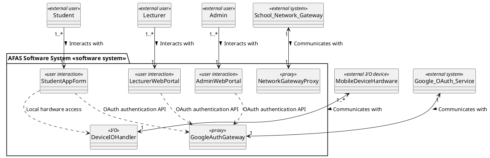

**Boundary Communication Description:**
1.  **StudentAppForm (`«user interaction»`):** Provides a mobile interface for students to check-in. It displays dashboards, opens the scanner, and shows results, delegating hardware operations to the `DeviceIOHandler`.
2.  **LecturerWebPortal (`«user interaction»`):** Web portal featuring a dashboard that displays check-in statistics and dynamic QR/PIN codes to students, updated in real-time.
3.  **AdminWebPortal (`«user interaction»`):** Web portal for administrators to seed academic databases and manage classroom GPS geofence targets.
4.  **GoogleAuthGateway (`«proxy»`):** Proxy boundary connecting to the external Google OAuth service for student, lecturer, and admin identity verification.
5.  **DeviceIOHandler (`«I/O»`):** Input/Output boundary class that communicates with the `MobileDeviceHardware` to query GPS coordinates, extract the device UUID, and trigger native Face ID/fingerprint authentication prompts.
6.  **NetworkGatewayProxy (`«proxy»`):** Proxy boundary class that interfaces with the `School_Network_Gateway` to verify the client's public IP address against FPT University's allowed IP ranges.

---

### **II.0.2 Object Structuring Criteria**

The Object Structuring Criteria classify all system objects into hierarchical groups based on their processing roles, following the COMET BCE (Boundary-Control-Entity) stereotyping method. This tree structure guides the transition from analysis to design.

#### **Figure II-0B: Object Structuring Criteria Tree**
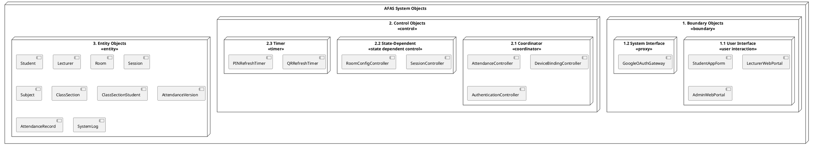

**Structuring Criteria Description:**

1.  **Boundary Objects — Structuring by Interface Type:**
    *   **User Interface Objects (`«user interaction»`):** Objects responsible for rendering graphical screens directly to end users (StudentAppForm, LecturerWebPortal, AdminWebPortal).
    *   **System Interface Objects (`«proxy»`):** Integration gateways connecting to external authentication services (Google OAuth).
    *   *Note on Hardware/Network Abstraction:* Platform-specific elements (GPS location, biometrics readers, local camera feeds, and campus IP gateways) are treated as internal aspects of the user interface boundary (`StudentAppForm`) during Analysis, to keep the model platform-independent.

2.  **Control Objects — Structuring by Coordination Complexity:**
    *   **Coordinator Objects (`«coordinator»`):** Orchestrate the complete event flow of primary use cases. Example: `AttendanceController` coordinates GPS verification, IP matching, and Face ID validation before recording attendance status.
    *   **State-Dependent Objects (`«state dependent control»`):** Objects whose behavior changes based on the current state of an associated entity. Example: `SessionController` manages session lifecycle (`Active`, `Paused`, `Completed`).
    *   **Timer Control Objects (`«timer»`):** Background-running synchronization objects responsible for triggering periodic events. These form the backbone of Anti-Fraud Layer 1. Example: `QRRefreshTimer` triggers a new dynamic QR token every 10 seconds; `PINRefreshTimer` refreshes the PIN every 30 seconds.

3.  **Entity Objects — Classifying Core Logical Data Entities:**
    *   Entity objects encapsulate long-term, persistent domain data and associated business rules. In this phase, they represent logical concepts of the problem domain (e.g., Student, Lecturer, Room, Subject, ClassSection, Session, AttendanceVersion, AttendanceRecord, SystemLog) without specifying data-access libraries, physical tables, or caching technologies.

---

### **II.0.3 UI Mockups**

The following mockups describe the key user interface screens for the three system portals: Student Mobile App, Lecturer Web Portal, and Admin Web Portal.

#### **Mockup WF-01: Student Mobile App — Login Screen**
```
┌─────────────────────────────┐
│         AFAS Login          │
│                             │
│  ┌───────────────────────┐  │
│  │ MSSV / Username       │  │
│  └───────────────────────┘  │
│  ┌───────────────────────┐  │
│  │ Password              │  │
│  └───────────────────────┘  │
│                             │
│  ┌───────────────────────┐  │
│  │    🔑 LOGIN           │  │
│  └───────────────────────┘  │
│                             │
│  ──── OR ────               │
│                             │
│  ┌───────────────────────┐  │
│  │  G  Login with Google │  │
│  │     (@fpt.edu.vn)     │  │
│  └───────────────────────┘  │
│                             │
│  Forgot Password?           │
└─────────────────────────────┘
```

#### **Mockup WF-02: Student Mobile App — Dashboard & QR Scanner**
```
┌─────────────────────────────┐
│ ☰  AFAS Dashboard     👤   │
├─────────────────────────────┤
│                             │
│  Welcome, Nguyen Van A      │
│  MSSV: SE170123             │
│  Device: ✅ Bound           │
│                             │
│  ┌───────────────────────┐  │
│  │                       │  │
│  │   📷 SCAN QR CODE     │  │
│  │   (Tap to check-in)   │  │
│  │                       │  │
│  └───────────────────────┘  │
│                             │
│  ┌───────────────────────┐  │
│  │   🔢 PIN CHECK-IN     │  │
│  └───────────────────────┘  │
│                             │
├──────┬──────┬──────┬────────┤
│ 🏠   │ 📷  │ 📋  │  👤    │
│ Home │ Scan │ Hist │ Profile│
└──────┴──────┴──────┴────────┘
```

#### **Mockup WF-03: Student Mobile App — QR Camera View**
```
┌─────────────────────────────┐
│  ← Back        QR Scanner   │
├─────────────────────────────┤
│                             │
│  Face ID: ✅ Verified       │
│                             │
│  ┌───────────────────────┐  │
│  │                       │  │
│  │    ┌─────────────┐    │  │
│  │    │             │    │  │
│  │    │  [QR CODE]  │    │  │
│  │    │   TARGET    │    │  │
│  │    │             │    │  │
│  │    └─────────────┘    │  │
│  │                       │  │
│  │   📍 Camera Viewfinder│  │
│  └───────────────────────┘  │
│                             │
│  GPS: 21.0128, 105.5246     │
│  Wi-Fi: FPT_University_5G  │
│  UUID: A1B2C3...            │
└─────────────────────────────┘
```

#### **Mockup WF-04: Student Mobile App — Attendance History**
```
┌─────────────────────────────┐
│  ← Back    Attendance History│
├─────────────────────────────┤
│                             │
│  SWD392 - Software Design   │
│  Semester: Summer 2026      │
│                             │
│  ┌──────────────────────┐   │
│  │ Present: 12 │ 🟢 80% │   │
│  │ Late:     2 │ 🟡 13% │   │
│  │ Absent:   1 │ 🔴  7% │   │
│  └──────────────────────┘   │
│                             │
│  ┌─ May 2026 Calendar ───┐  │
│  │ Mo Tu We Th Fr Sa Su  │  │
│  │        1🟢 2   3  4   │  │
│  │  5  6  7  8🟢 9 10 11 │  │
│  │ 12 13 14 15🟡16 17 18 │  │
│  │ 19 20 21 22🔴23 24 25 │  │
│  │ 26 27                 │  │
│  └───────────────────────┘  │
└─────────────────────────────┘
```

#### **Mockup WF-05: Lecturer Web Portal — Dynamic QR Projector View**
```
┌─────────────────────────────────────────────────────────────────┐
│  AFAS Lecturer Portal  │ SWD392 - SE1701 │ Session: 27/05/2026 │
├─────────────────────────────────────────────────────────────────┤
│                                                                 │
│    ┌──────────────────┐        ┌───────────────────────────┐    │
│    │                  │        │  Real-time Attendance Grid │    │
│    │                  │        ├───────────────────────────┤    │
│    │   ███████████    │        │ 🟢 SE170123 Nguyen Van A  │    │
│    │   █ QR CODE █    │        │ 🟢 SE170456 Tran Thi B    │    │
│    │   █ DYNAMIC █    │        │ ⬜ SE170789 Le Van C       │    │
│    │   ███████████    │        │ ⬜ SE170012 Pham Thi D     │    │
│    │                  │        │ 🟡 SE170345 Hoang Van E   │    │
│    │  Refreshes: 10s  │        │ ⬜ SE170678 Vo Thi F       │    │
│    └──────────────────┘        │ ...                        │    │
│                                └───────────────────────────┘    │
│    PIN: 847291                  Checked-in: 12 / 35 (34%)       │
│    PIN Refreshes: 30s           ⏱ Session active: 04:32         │
│                                                                 │
│    [ 🛑 Stop Attendance ]     [ 📊 Export Excel ]               │
└─────────────────────────────────────────────────────────────────┘
```

#### **Mockup WF-06: Lecturer Web Portal — Manual Adjustment Modal**
```
┌───────────────────────────────────────────┐
│  Adjust Attendance Status                 │
├───────────────────────────────────────────┤
│                                           │
│  Student: SE170789 - Le Van C             │
│  Session: SWD392 - 27/05/2026             │
│  Current Status: ⬜ Absent                │
│                                           │
│  New Status:                              │
│  ┌─────────────────────────────────────┐  │
│  │ ○ Present  ○ Late  ● Absent        │  │
│  │ ○ Fraud_Declined                   │  │
│  └─────────────────────────────────────┘  │
│                                           │
│  Reason (required):                       │
│  ┌─────────────────────────────────────┐  │
│  │ Student showed medical certificate  │  │
│  │ for being late. Verified by lectu.. │  │
│  └─────────────────────────────────────┘  │
│                                           │
│  [ Cancel ]              [ 💾 Save ]      │
└───────────────────────────────────────────┘
```

#### **Mockup WF-07: Admin Web Portal — Room GPS Configuration**
```
┌─────────────────────────────────────────────────────────────────┐
│  AFAS Admin Portal  │  Room Management                         │
├─────────────────────────────────────────────────────────────────┤
│                                                                 │
│  ┌───────────────────────────────────────────────────────────┐  │
│  │ Room ID │ Room Name    │ Latitude   │ Longitude  │ Radius │  │
│  ├─────────┼──────────────┼────────────┼────────────┼────────┤  │
│  │ AL-L301 │ Alpha 301    │ 21.01282   │ 105.52461  │ 20m    │  │
│  │ AL-L402 │ Alpha 402    │ 21.01305   │ 105.52489  │ 20m    │  │
│  │ BE-202  │ Beta 202     │ 21.01198   │ 105.52378  │ 25m    │  │
│  │ [+ Add New Room]                                          │  │
│  └───────────────────────────────────────────────────────────┘  │
│                                                                 │
│  ┌─ Configure Room: AL-L402 ─────────────────────────────────┐  │
│  │                                                           │  │
│  │  ┌──────────────────────────────┐  Latitude:              │  │
│  │  │                              │  ┌──────────────────┐   │  │
│  │  │     🗺️ SATELLITE MAP        │  │ 21.01305         │   │  │
│  │  │                              │  └──────────────────┘   │  │
│  │  │        📍 (click to set)     │  Longitude:             │  │
│  │  │                              │  ┌──────────────────┐   │  │
│  │  │                              │  │ 105.52489        │   │  │
│  │  └──────────────────────────────┘  └──────────────────┘   │  │
│  │                                    Allowed Radius (m):     │  │
│  │  [ 📡 Capture Current GPS ]       ┌──────────────────┐   │  │
│  │                                    │ 20               │   │  │
│  │                                    └──────────────────┘   │  │
│  │                                                           │  │
│  │              [ Cancel ]      [ 💾 Save Configuration ]    │  │
│  └───────────────────────────────────────────────────────────┘  │
└─────────────────────────────────────────────────────────────────┘
```

#### **Mockup WF-08: Student Mobile App — PIN Fallback Input**
```
┌─────────────────────────────┐
│  ← Back      PIN Check-in   │
├─────────────────────────────┤
│                             │
│  Face ID: ✅ Verified       │
│                             │
│  Enter the 6-digit PIN      │
│  displayed on the projector │
│                             │
│  ┌──┐ ┌──┐ ┌──┐ ┌──┐ ┌──┐ ┌──┐│
│  │8 │ │4 │ │7 │ │2 │ │9 │ │1 ││
│  └──┘ └──┘ └──┘ └──┘ └──┘ └──┘│
│                             │
│  GPS: 21.0128, 105.5246     │
│  UUID: A1B2C3...            │
│                             │
│  ┌───────────────────────┐  │
│  │    ✅ SUBMIT PIN       │  │
│  └───────────────────────┘  │
│                             │
│  PIN refreshes every 30s.   │
│  Make sure to enter the     │
│  current PIN on screen.     │
└─────────────────────────────┘
```

---

## **II.1 Interaction diagrams**

In this section, we analyze the objects and their interactions to realize the core use cases of the AFAS system based on Gomaa's MVC analysis pattern. For each key use case, we construct both a **Sequence Diagram** (representing time-sequence interactions) and a **Communication Diagram** (representing structural links and message sequence numbers).

---

### **1. UC01: Login via Credentials or Google OAuth**

#### **Figure II-1A: Sequence Diagram for UC01 - Login**
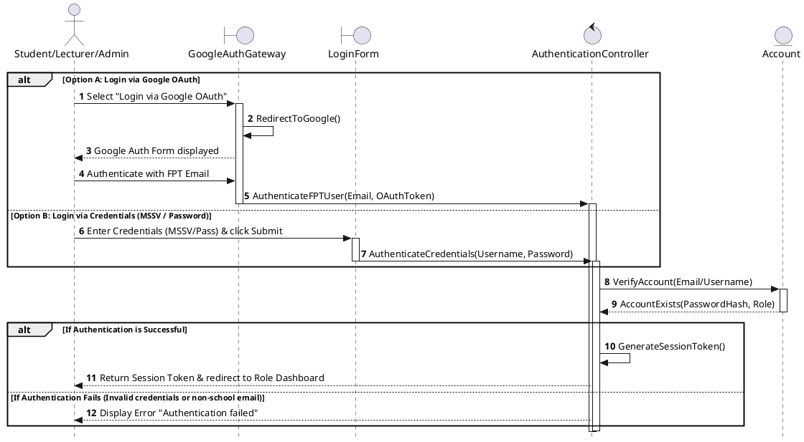

#### **Figure II-1B: Communication Diagram for UC01 - Login**
```plantuml
@startuml
class "Student/Lecturer/Admin" as User <<actor>>
class GoogleAuthGateway as LGG <<boundary>>
class LoginForm as LAF <<boundary>>
class AuthenticationController as AC <<control>>
class Account as ACC <<entity>>

User --> LGG : 1a: Login via Google
User --> LAF : 1b: Enter Credentials

LGG --> AC : 1a.1: AuthenticateFPTUser()
LAF --> AC : 1b.1: AuthenticateCredentials()

AC --> ACC : 2: VerifyAccount()
ACC --> AC : 2.1: AccountExists()
AC --> User : 3: Return Session Token / Redirect
@enduml
```


---

### **2. UC02: Register Device UUID**

#### **Figure II-2A: Sequence Diagram for UC02 - Register Device UUID**
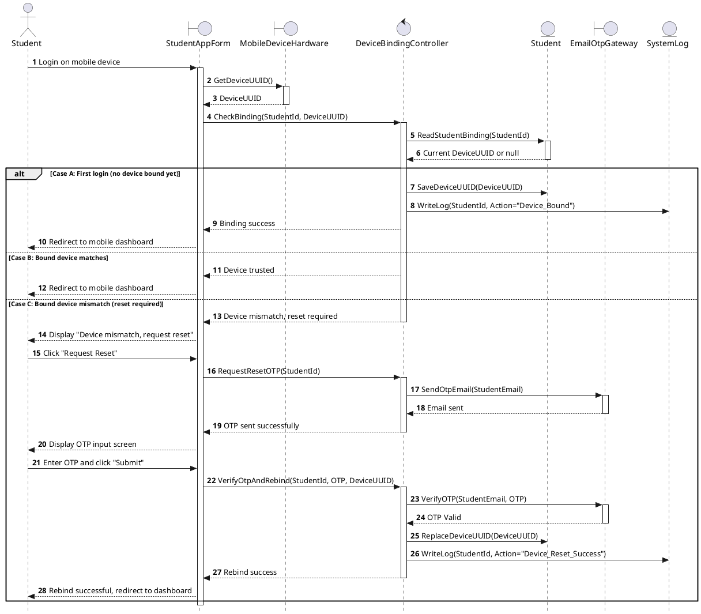

#### **Figure II-2B: Communication Diagram for UC02 - Register Device UUID**
```plantuml
@startuml
class Student as SV <<actor>>
class StudentAppForm as SAF <<boundary>>
class MobileDeviceHardware as MD <<boundary>>
class DeviceBindingController as DBC <<control>>
class Student as ST <<entity>>
class EmailOtpGateway as OTP <<boundary>>
class SystemLog as SL <<entity>>

SV --> SAF : 1: Login / Request Reset
SAF --> MD : 1.1: GetDeviceUUID()
SAF --> DBC : 2: CheckBinding() / VerifyOtpAndRebind()
DBC --> ST : 2.1: ReadStudentBinding() / SaveDeviceUUID()
DBC --> OTP : 2.2: SendOtpEmail() / VerifyOTP()
DBC --> SL : 2.3: WriteLog()
DBC --> SAF : 3: Return status/redirect
@enduml
```

---

### **3. UC03: Scan Dynamic QR Check-in**

To ensure clarity and handle complex anti-fraud logic without cluttering the diagrams, the interaction is split into one Happy Path scenario and three separate Exception Scenario diagrams.

#### **Figure II-3A1: Sequence Diagram for UC03 - Happy Path Scenario**
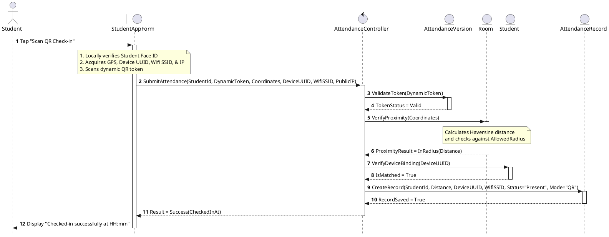

#### **Figure II-3A2: Sequence Diagram for UC03 - Exception Scenario: Token Expired**
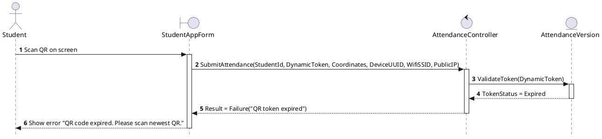

#### **Figure II-3A3: Sequence Diagram for UC03 - Exception Scenario: Location Fraud (Out of Geofence)**
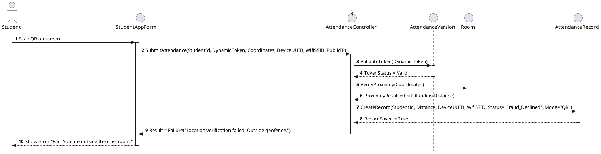

#### **Figure II-3A4: Sequence Diagram for UC03 - Exception Scenario: Device UUID Mismatch**
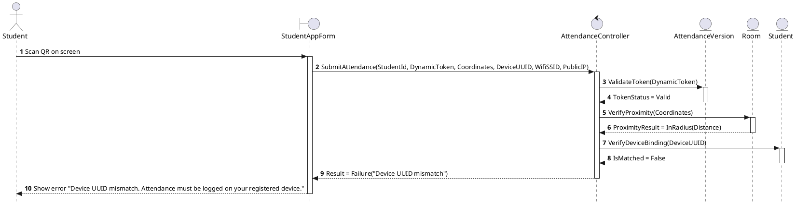

#### **Figure II-3B: Communication Diagram for UC03 - Scan Dynamic QR Check-in**
```plantuml
@startuml
class Student as Student <<actor>>
class StudentAppForm as SAF <<boundary>>
class AttendanceController as AC <<control>>
class AttendanceVersion as V <<entity>>
class Room as R <<entity>>
class Student as ST <<entity>>
class AttendanceRecord as AR <<entity>>

Student --> SAF : 1: Scan QR Check-in
SAF --> AC : 2: SubmitAttendance()
AC --> V : 2.1: ValidateToken()
AC --> R : 2.2: VerifyProximity()
AC --> ST : 2.3: VerifyDeviceBinding()
AC --> AR : 2.4: CreateRecord()
AC --> SAF : 3: Return Result
@enduml
```

---

### **4. UC04: View Attendance History**

#### **Figure II-4A: Sequence Diagram for UC04 - View Attendance History**
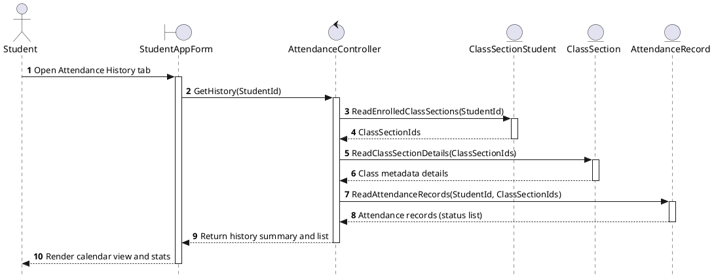

#### **Figure II-4B: Communication Diagram for UC04 - View Attendance History**
```plantuml
@startuml
class Student as SV <<actor>>
class StudentAppForm as SAF <<boundary>>
class AttendanceController as AC <<control>>
class ClassSectionStudent as CSS <<entity>>
class ClassSection as CS <<entity>>
class AttendanceRecord as AR <<entity>>

SV --> SAF : 1: Open History Tab
SAF --> AC : 1.1: GetHistory(StudentId)
AC --> CSS : 1.1.1: ReadEnrolledClassSections()
AC --> CS : 1.1.2: ReadClassSectionDetails()
AC --> AR : 1.1.3: ReadAttendanceRecords()
AC --> SAF : 2: Return history data
@enduml
```

---

### **5. UC05: PIN Fallback Check-in**

This use case provides a manual fallback when the projector QR scanner cannot be scanned. The student manually inputs the 6-digit PIN displayed on the classroom screen.

#### **Figure II-5A: Sequence Diagram for UC05 - PIN Fallback Check-in (Happy Path Scenario)**
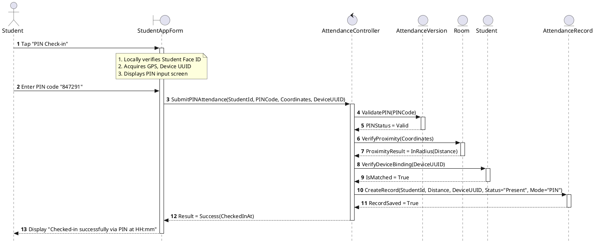

*Note: The alternative flow exception paths (PIN Expired, Location Out of Geofence, and Device Mismatch) follow the exact corresponding logic structures depicted in Figures II-3A2, II-3A3, and II-3A4, with the dynamic token verification replaced by the 6-digit PIN check.*

#### **Figure II-5B: Communication Diagram for UC05 - PIN Fallback Check-in**
```plantuml
@startuml
class Student as Student <<actor>>
class StudentAppForm as SAF <<boundary>>
class AttendanceController as AC <<control>>
class AttendanceVersion as V <<entity>>
class Room as R <<entity>>
class Student as ST <<entity>>
class AttendanceRecord as AR <<entity>>

Student --> SAF : 1: Tap PIN Check-in / Submit PIN
SAF --> AC : 2: SubmitPINAttendance()
AC --> V : 2.1: ValidatePIN()
AC --> R : 2.2: VerifyProximity()
AC --> ST : 2.3: VerifyDeviceBinding()
AC --> AR : 2.4: CreateRecord()
AC --> SAF : 3: Return Result
@enduml
```

---

### **6. UC06: Activate Dynamic QR Session**

#### **Figure II-6A: Sequence Diagram for UC06 - Activate Dynamic QR Session**
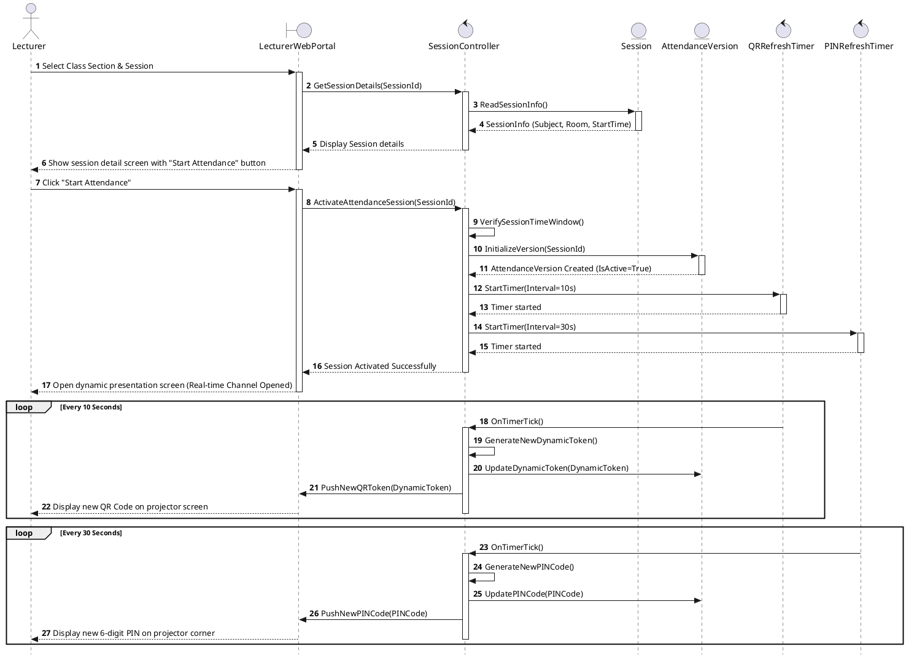

#### **Figure II-6B: Communication Diagram for UC06 - Activate Dynamic QR Session**
```plantuml
@startuml
class Lecturer as GV <<actor>>
class LecturerWebPortal as LWP <<boundary>>
class SessionController as SC <<control>>
class Session as S <<entity>>
class AttendanceVersion as V <<entity>>
class QRRefreshTimer as QT <<control>>
class PINRefreshTimer as PT <<control>>

GV --> LWP : 1: Click Start Attendance
LWP --> SC : 1.1: GetSessionDetails()
LWP --> SC : 1.2: ActivateAttendanceSession()

SC --> S : 1.1.1: ReadSessionInfo()
SC --> V : 1.2.1: InitializeVersion()
SC --> QT : 1.2.2: StartTimer(10s)
SC --> PT : 1.2.3: StartTimer(30s)

QT --> LWP : 2: OnTimerTick() / PushQR()
PT --> LWP : 3: OnTimerTick() / PushPIN()
@enduml
```

---

### **7. UC07: Real-time Attendance Monitor**

#### **Figure II-7A: Sequence Diagram for UC07 - Real-time Attendance Monitor**
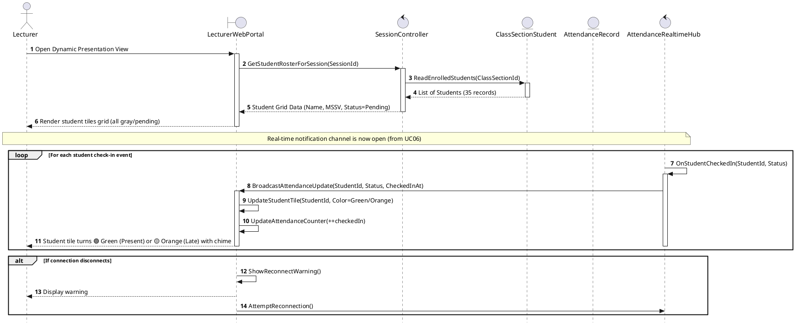

#### **Figure II-7B: Communication Diagram for UC07 - Real-time Attendance Monitor**
```plantuml
@startuml
class Lecturer as GV <<actor>>
class LecturerWebPortal as LWP <<boundary>>
class SessionController as SC <<control>>
class ClassSectionStudent as CS <<entity>>
class AttendanceRecord as AR <<entity>>
class AttendanceRealtimeHub as WSH <<control>>

GV --> LWP : 1: Open Presentation View
LWP --> SC : 1.1: GetStudentRosterForSession()
SC --> CS : 1.1.1: ReadEnrolledStudents()

WSH --> LWP : 2: BroadcastAttendanceUpdate()
LWP --> LWP : 2.1: UpdateStudentTile() / UpdateCounter()
@enduml
```

---

### **8. UC08: Manual Attendance Adjustment**

#### **Figure II-8A: Sequence Diagram for UC08 - Manual Attendance Adjustment**
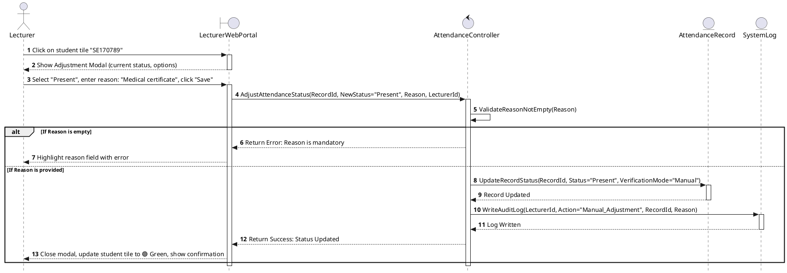

#### **Figure II-8B: Communication Diagram for UC08 - Manual Attendance Adjustment**
```plantuml
@startuml
class Lecturer as GV <<actor>>
class LecturerWebPortal as LWP <<boundary>>
class AttendanceController as AC <<control>>
class AttendanceRecord as AR <<entity>>
class SystemLog as SL <<entity>>

GV --> LWP : 1: Click student / Select status / Save
LWP --> AC : 1.1: AdjustAttendanceStatus()
AC --> AR : 1.1.1: UpdateRecordStatus()
AC --> SL : 1.1.2: WriteAuditLog()
AC --> LWP : 2: Return Success
@enduml
```

---

### **9. UC09: Export Attendance Report**

#### **Figure II-9A: Sequence Diagram for UC09 - Export Attendance Report**
```plantuml
@startuml
skinparam style strictuml
autonumber

actor GV as "Lecturer"
boundary LWP as "LecturerWebPortal"
control RC as "ReportController"
entity CSS as "ClassSectionStudent"
entity AR as "AttendanceRecord"
control REP as "ReportGenerator"
entity SL as "SystemLog"

GV -> LWP: Click Export Report for class section
activate LWP
LWP -> RC: ExportClassReport(ClassSectionId, Semester)
activate RC
RC -> CSS: ReadRoster(ClassSectionId)
activate CSS
CSS --> RC: Student roster
deactivate CSS
RC -> AR: ReadSessionAttendanceRecords(ClassSectionId, Semester)
activate AR
AR --> RC: Attendance matrix records
deactivate AR

alt Case A: No attendance records exist
    RC --> LWP: Return error (No records found)
    LWP --> GV: Show "No records available for export" alert
else Case B: Records exist
    RC -> REP: GenerateReport(Roster, AttendanceRecords)
    activate REP
    REP --> RC: Report file stream
    deactivate REP
    RC -> SL: WriteLog(LecturerId, Action="Export_Report", ClassSectionId)
    activate SL
    SL --> RC: Log written
    deactivate SL
    RC --> LWP: Return file stream
    deactivate RC
    LWP --> GV: Download report file
end
deactivate LWP
@enduml
```

#### **Figure II-9B: Communication Diagram for UC09 - Export Attendance Report**
```plantuml
@startuml
class Lecturer as GV <<actor>>
class LecturerWebPortal as LWP <<boundary>>
class ReportController as RC <<control>>
class ClassSectionStudent as CSS <<entity>>
class AttendanceRecord as AR <<entity>>
class ReportGenerator as REP <<control>>
class SystemLog as SL <<entity>>

GV --> LWP : 1: Click Export Report
LWP --> RC : 1.1: ExportClassReport()
RC --> CSS : 1.1.1: ReadRoster()
RC --> AR : 1.1.2: ReadSessionAttendanceRecords()
RC --> REP : 1.1.3: GenerateReport()
RC --> SL : 1.1.4: WriteLog()
RC --> LWP : 2: Return file stream
@enduml
```

---

### **10. UC10: Manage System Catalog**

#### **Figure II-10A: Sequence Diagram for UC10 - Manage System Catalog**
```plantuml
@startuml
skinparam style strictuml
autonumber
actor AD as "Admin"
boundary AWP as "AdminWebPortal"
control CC as "CatalogController"
entity ACC as "Account"
entity ST as "Student"
entity LT as "Lecturer"
entity SUB as "Subject"
entity CLS as "ClassSection"
entity SL as "SystemLog"

AD -> AWP : Open catalog screen (e.g. Students)
activate AWP
AWP -> CC : GetCatalog(catalogType)
activate CC
CC --> AWP : Return list of rows
deactivate CC
AWP --> AD : Render catalog table

alt Case A: Add new record
    AD -> AWP : Input details and click "Save"
    AWP -> CC : SaveCatalogChange(catalogType, payload)
    activate CC
    CC -> CC : ValidatePayloadFields()
    alt Invalid fields
        CC --> AWP : Return validation error
        AWP --> AD : Display error highlighting fields
    else Valid fields
        alt Role = Student
            CC -> ACC : CreateAccount(payload)
            CC -> ST : CreateStudent(payload)
        else Role = Lecturer
            CC -> ACC : CreateAccount(payload)
            CC -> LT : CreateLecturer(payload)
        else Type = Subject
            CC -> SUB : CreateSubject(payload)
        else Type = ClassSection
            CC -> CLS : CreateClassSection(payload)
        end
        CC -> SL : WriteLog(AdminId, Action="Catalog_Change")
        activate SL
        SL --> CC : Log written
        deactivate SL
        CC --> AWP : Save successful
        deactivate CC
        AWP --> AD : Refresh table with success message
    end
end
deactivate AWP
@enduml
```

#### **Figure II-10B: Communication Diagram for UC10 - Manage System Catalog**
```plantuml
@startuml
class Admin as AD <<actor>>
class AdminWebPortal as AWP <<boundary>>
class CatalogController as CC <<control>>
class Account as ACC <<entity>>
class Student as ST <<entity>>
class Lecturer as LT <<entity>>
class Subject as SUB <<entity>>
class ClassSection as CLS <<entity>>
class SystemLog as SL <<entity>>

AD --> AWP : 1: Manage catalog
AWP --> CC : 1.1: GetCatalog() / SaveCatalogChange()
CC --> ST : 1.1.1: CreateAccount() / CreateStudent()
CC --> LT : 1.1.2: CreateLecturer()
CC --> SUB : 1.1.3: CreateSubject()
CC --> CLS : 1.1.4: CreateClassSection()
CC --> SL : 1.1.5: WriteLog()
CC --> AWP : 2: Return success/refresh
@enduml
```

---

### **11. UC11: Configure Room Coordinates & Allowed Radius**

#### **Figure II-11A: Sequence Diagram for UC11 - Configure Room Coordinates**
```plantuml
@startuml UC11_Sequence_Diagram
skinparam style strictuml
autonumber

actor AD as "Admin"
boundary AWP as "AdminWebPortal"
control RCC as "RoomConfigurationController"
entity R as "Room"
entity SL as "SystemLog"

AD->AWP: Click "Room Management"
activate AWP
AWP->RCC: GetRoomsList()
activate RCC
RCC->R: ReadAllRooms()
activate R
R-->>RCC: List of Rooms
deactivate R
RCC-->>AWP: Display room table
deactivate RCC
AWP-->>AD: Show room table with config buttons
deactivate AWP

AD->AWP: Click "Edit Coordinates" for specific Room
activate AWP
AWP-->>AD: Open RoomConfigForm with integrated satellite map
deactivate AWP

alt Option A: Click on satellite map
    AD->AWP: Click exact classroom location on map
    activate AWP
    AWP->AWP: ExtractLatLongFromMapClick()
    AWP-->>AD: Automatically populate Lat & Long fields
    deactivate AWP
else Option B: Get current GPS (Mobile device at site)
    AD->AWP: Tap "Get Current GPS Location"
    activate AWP
    AWP->AWP: RequestBrowserGeoLocationAPI()
    AWP-->>AD: Populate Lat & Long fields with hardware coordinates
    deactivate AWP
end

AD->AWP: Enter "Allowed Radius" (e.g. 20m) & click "Save Config"
activate AWP
AWP->RCC: SaveGeoConfiguration(RoomId, Latitude, Longitude, AllowedRadius)
activate RCC

RCC->RCC: ValidateCoordinates(Latitude, Longitude)
RCC->RCC: ValidateRadius(AllowedRadius)

alt If coordinates or radius are invalid
    RCC-->>AWP: Return Error: Invalid Geo-data
    AWP-->>AD: Highlight error fields & request correction
else If configuration is valid
    RCC->R: UpdateGeoConfig(Latitude, Longitude, AllowedRadius)
    activate R
    R-->>RCC: Update Success
    deactivate R
    
    RCC->SL: WriteLog(AdminId, Action="Configure_Room", RoomId)
    
    RCC-->>AWP: Return Success: Configurations Saved
    AWP-->>AD: Show confirmation popup & return to room table
end
deactivate RCC
deactivate AWP
@enduml
```

#### **Figure II-11B: Communication Diagram for UC11 - Configure Room Coordinates**
```plantuml
@startuml
class Admin as AD <<actor>>
class AdminWebPortal as AWP <<boundary>>
class RoomConfigurationController as RCC <<control>>
class Room as R <<entity>>
class SystemLog as SL <<entity>>

AD --> AWP : 1: Edit Coordinates
AD --> AWP : 2: Click Save Config
AWP --> RCC : 1.1: GetRoomsList()
AWP --> RCC : 2.1: SaveGeoConfiguration()

RCC --> R : 2.1.1: UpdateGeoConfig()
RCC --> SL : 2.1.2: WriteLog()
AWP <-- RCC : 3: Return Success popup
@enduml
```

---

## **II.2 State diagrams**

In the AFAS system, there are four primary objects whose behaviors and properties change based on their state: `AttendanceVersion` (the active check-in session), `AttendanceRecord` (the student's attendance result), `Student` (specifically regarding Device Binding state), and `AttendanceController` (the coordinator controlling the check-in validation process).

---

### **1. Attendance Session State (AttendanceVersion)**
Describes the lifecycle of an attendance QR session started by a lecturer in the classroom.

#### **Figure II-9: State diagram for Attendance Session**
```plantuml
@startuml
[*] --> Inactive : Session created in schedule
Inactive --> Active_QR : Lecturer clicks "Start Attendance"

state Active_QR {
    [*] --> QR_Active : QR & PIN displayed
    QR_Active --> QR_Refreshed : Timer ticks (10s)
    QR_Refreshed --> QR_Active : Generate new dynamic token
    
    QR_Active --> PIN_Refreshed : Timer ticks (30s)
    PIN_Refreshed --> QR_Active : Generate new PIN code
}

Active_QR --> Suspended : Network outage detected (Timer Paused)
Suspended --> Active_QR : Network restored / Lecturer clicks "Resume"

Active_QR --> Active_PIN_Only : Lecturer closes QR scanner / opens PIN manually
Active_PIN_Only --> Closed : Dynamic timer expires / Session close clicked

Active_QR --> Closed : Lecturer clicks "Stop Attendance"
Suspended --> Closed : Class scheduled time ends

Closed --> [*] : Attendance finalized & Report exported
@enduml
```

---

### **2. Attendance Record State (AttendanceRecord)**
Describes the lifecycle of a student's check-in telemetry audit process when submitted to the server.

#### **Figure II-10: State diagram for Attendance Record**
```plantuml
@startuml
[*] --> Submitted : Student sends check-in telemetry

Submitted --> Verifying_Token : Server matches Dynamic QR Token (Layer 1)

Verifying_Token --> Failed_Expired : Token older than 15s
Failed_Expired --> [*] : Rejection logged

Verifying_Token --> Verifying_Location : Token is valid

Verifying_Location --> Verifying_Device : GPS Distance < AllowedRadius (Layer 2)
Verifying_Location --> Failed_Location_Fraud : GPS Distance > AllowedRadius
Failed_Location_Fraud --> [*] : Saved as "Fraud_Declined" in system

Verifying_Device --> Verifying_Biometrics : DeviceUUID matches bound device (Layer 3)
Verifying_Device --> Failed_Device_Mismatch : DeviceUUID belongs to another student
Failed_Device_Mismatch --> [*] : Rejection logged

Verifying_Biometrics --> Checked_In_Present : Face ID match score > 85%
Verifying_Biometrics --> Failed_Face_Mismatch : Face ID matching fails
Failed_Face_Mismatch --> [*] : Rejection logged

Checked_In_Present --> Checked_In_Late : Checked-in time > Class start time

Checked_In_Present --> [*] : Saved as "Present" / Selfie image deleted
Checked_In_Late --> [*] : Saved as "Late" / Selfie image deleted
@enduml
```

---

### **3. Student Device Binding State**
Describes the lifecycle of a student account's hardware physical binding constraint.

#### **Figure II-11: State diagram for Device Binding**
```plantuml
@startuml
[*] --> Unbound : Account created by Admin
Unbound --> Bound : First login on App (UUID registered)

Bound --> Reset_Requested : Student clicks "Reset Device" on new phone
Reset_Requested --> Bound : OTP validation fails 3 times (Lockout 24h)

Reset_Requested --> Unbound : OTP code verified successfully via school email
Bound --> Admin_Released : Admin manually releases binding (special request)
Admin_Released --> Unbound : Device UUID cleared from profile
@enduml
```

---

### **4. Attendance Coordinator Control State (AttendanceController)**
Describes the validation state transitions within the coordinator controller during a single student check-in request.

#### **Figure II-12: State diagram for AttendanceController**
```plantuml
@startuml
[*] --> Idle : System online

state Idle {
}

Idle --> Verifying_Token : submitAttendance()

state Verifying_Token {
    [*] --> CheckToken
    CheckToken --> Token_Expired : token invalid / expired
    CheckToken --> Token_Valid : token is active & valid
}

Verifying_Token --> Idle : tokenExpired [return Failure]

Verifying_Token --> Validating_Location : tokenValid

state Validating_Location {
    [*] --> CheckProximity
    CheckProximity --> Out_Of_Radius : distance > allowedRadius
    CheckProximity --> In_Radius : distance <= allowedRadius
}

Validating_Location --> Recording_Fraud : outOfRadius
Recording_Fraud --> Idle : recordSaved [return Failure]

Validating_Location --> Verifying_Device : inRadius

state Verifying_Device {
    [*] --> CheckUUID
    CheckUUID --> UUID_Mismatch : uuid != boundDeviceUuid
    CheckUUID --> UUID_Matched : uuid == boundDeviceUuid
}

Verifying_Device --> Idle : uuidMismatch [return Failure]

Verifying_Device --> Recording_Present : uuidMatched

state Recording_Present {
}

Recording_Present --> Idle : recordSaved [return Success]
@enduml
```
