## **II. Analysis models**

## **II.0 Static Analysis**

##### **II.0.1 Contextual Boundary Class Diagram**

The Contextual Boundary Class Diagram identifies the direct connections between external Actors and the `«boundary»` interface classes they interact with to send/receive data from the system. This diagram follows the COMET BCE (Boundary-Control-Entity) classification model.

#### **Figure II-0A: Contextual Boundary Class Diagram**
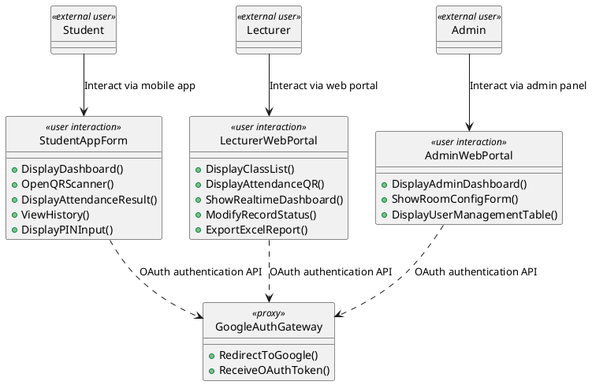

**Boundary Communication Description:**
1.  **StudentAppForm (`«user interaction»`):** Provides a mobile interface for students to check-in. It internally handles biometrics verification, QR camera scanning, GPS location tracking, and Wi-Fi connectivity parameters, keeping these hardware details encapsulated.
2.  **LecturerWebPortal (`«user interaction»`):** Web portal featuring a dashboard that displays check-in statistics and dynamic QR/PIN codes to students, updated in real-time.
3.  **AdminWebPortal (`«user interaction»`):** Web portal for administrators to seed academic databases and manage classroom GPS geofence targets.
4.  **GoogleAuthGateway (`«proxy»`):** Proxy boundary connecting to the external Google OAuth service for student, lecturer, and admin identity verification.

---

### **II.0.2 Object Structuring Criteria**

The Object Structuring Criteria classify all system objects into hierarchical groups based on their processing roles, following the COMET BCE (Boundary-Control-Entity) stereotyping method. This tree structure guides the transition from analysis to design.

#### **Figure II-0B: Object Structuring Criteria Tree**
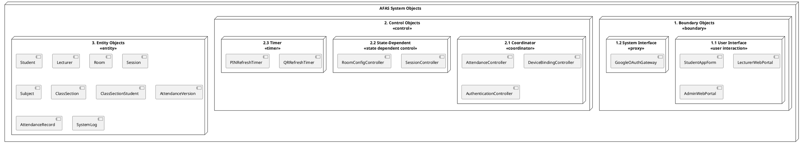

**Structuring Criteria Description:**

1.  **Boundary Objects — Structuring by Interface Type:**
    *   **User Interface Objects (`«user interaction»`):** Objects responsible for rendering graphical screens directly to end users (StudentAppForm, LecturerWebPortal, AdminWebPortal).
    *   **System Interface Objects (`«proxy»`):** Integration gateways connecting to external authentication services (Google OAuth).
    *   *Note on Hardware/Network Abstraction:* Platform-specific elements (GPS location, biometrics readers, local camera feeds, and campus IP gateways) are treated as internal aspects of the user interface boundary (`StudentAppForm`) during Analysis, to keep the model platform-independent.

2.  **Control Objects — Structuring by Coordination Complexity:**
    *   **Coordinator Objects (`«coordinator»`):** Orchestrate the complete event flow of primary use cases. Example: `AttendanceController` coordinates GPS verification, IP matching, and Face ID validation before recording attendance status.
    *   **State-Dependent Objects (`«state dependent control»`):** Objects whose behavior changes based on the current state of an associated entity. Example: `SessionController` manages session lifecycle (`Active`, `Paused`, `Completed`).
    *   **Timer Control Objects (`«timer»`):** Background-running synchronization objects responsible for triggering periodic events. These form the backbone of Anti-Fraud Layer 1. Example: `QRRefreshTimer` triggers a new dynamic QR token every 10 seconds; `PINRefreshTimer` refreshes the PIN every 30 seconds.

3.  **Entity Objects — Classifying Core Logical Data Entities:**
    *   Entity objects encapsulate long-term, persistent domain data and associated business rules. In this phase, they represent logical concepts of the problem domain (e.g., Student, Lecturer, Room, Subject, ClassSection, Session, AttendanceVersion, AttendanceRecord, SystemLog) without specifying data-access libraries, physical tables, or caching technologies.

---

### **II.0.3 UI Mockups**

The following mockups describe the key user interface screens for the three system portals: Student Mobile App, Lecturer Web Portal, and Admin Web Portal.

#### **Mockup WF-01: Student Mobile App — Login Screen**
```
┌─────────────────────────────┐
│         AFAS Login          │
│                             │
│  ┌───────────────────────┐  │
│  │ MSSV / Username       │  │
│  └───────────────────────┘  │
│  ┌───────────────────────┐  │
│  │ Password              │  │
│  └───────────────────────┘  │
│                             │
│  ┌───────────────────────┐  │
│  │    🔑 LOGIN           │  │
│  └───────────────────────┘  │
│                             │
│  ──── OR ────               │
│                             │
│  ┌───────────────────────┐  │
│  │  G  Login with Google │  │
│  │     (@fpt.edu.vn)     │  │
│  └───────────────────────┘  │
│                             │
│  Forgot Password?           │
└─────────────────────────────┘
```

#### **Mockup WF-02: Student Mobile App — Dashboard & QR Scanner**
```
┌─────────────────────────────┐
│ ☰  AFAS Dashboard     👤   │
├─────────────────────────────┤
│                             │
│  Welcome, Nguyen Van A      │
│  MSSV: SE170123             │
│  Device: ✅ Bound           │
│                             │
│  ┌───────────────────────┐  │
│  │                       │  │
│  │   📷 SCAN QR CODE     │  │
│  │   (Tap to check-in)   │  │
│  │                       │  │
│  └───────────────────────┘  │
│                             │
│  ┌───────────────────────┐  │
│  │   🔢 PIN CHECK-IN     │  │
│  └───────────────────────┘  │
│                             │
├──────┬──────┬──────┬────────┤
│ 🏠   │ 📷  │ 📋  │  👤    │
│ Home │ Scan │ Hist │ Profile│
└──────┴──────┴──────┴────────┘
```

#### **Mockup WF-03: Student Mobile App — QR Camera View**
```
┌─────────────────────────────┐
│  ← Back        QR Scanner   │
├─────────────────────────────┤
│                             │
│  Face ID: ✅ Verified       │
│                             │
│  ┌───────────────────────┐  │
│  │                       │  │
│  │    ┌─────────────┐    │  │
│  │    │             │    │  │
│  │    │  [QR CODE]  │    │  │
│  │    │   TARGET    │    │  │
│  │    │             │    │  │
│  │    └─────────────┘    │  │
│  │                       │  │
│  │   📍 Camera Viewfinder│  │
│  └───────────────────────┘  │
│                             │
│  GPS: 21.0128, 105.5246     │
│  Wi-Fi: FPT_University_5G  │
│  UUID: A1B2C3...            │
└─────────────────────────────┘
```

#### **Mockup WF-04: Student Mobile App — Attendance History**
```
┌─────────────────────────────┐
│  ← Back    Attendance History│
├─────────────────────────────┤
│                             │
│  SWD392 - Software Design   │
│  Semester: Summer 2026      │
│                             │
│  ┌──────────────────────┐   │
│  │ Present: 12 │ 🟢 80% │   │
│  │ Late:     2 │ 🟡 13% │   │
│  │ Absent:   1 │ 🔴  7% │   │
│  └──────────────────────┘   │
│                             │
│  ┌─ May 2026 Calendar ───┐  │
│  │ Mo Tu We Th Fr Sa Su  │  │
│  │        1🟢 2   3  4   │  │
│  │  5  6  7  8🟢 9 10 11 │  │
│  │ 12 13 14 15🟡16 17 18 │  │
│  │ 19 20 21 22🔴23 24 25 │  │
│  │ 26 27                 │  │
│  └───────────────────────┘  │
└─────────────────────────────┘
```

#### **Mockup WF-05: Lecturer Web Portal — Dynamic QR Projector View**
```
┌─────────────────────────────────────────────────────────────────┐
│  AFAS Lecturer Portal  │ SWD392 - SE1701 │ Session: 27/05/2026 │
├─────────────────────────────────────────────────────────────────┤
│                                                                 │
│    ┌──────────────────┐        ┌───────────────────────────┐    │
│    │                  │        │  Real-time Attendance Grid │    │
│    │                  │        ├───────────────────────────┤    │
│    │   ███████████    │        │ 🟢 SE170123 Nguyen Van A  │    │
│    │   █ QR CODE █    │        │ 🟢 SE170456 Tran Thi B    │    │
│    │   █ DYNAMIC █    │        │ ⬜ SE170789 Le Van C       │    │
│    │   ███████████    │        │ ⬜ SE170012 Pham Thi D     │    │
│    │                  │        │ 🟡 SE170345 Hoang Van E   │    │
│    │  Refreshes: 10s  │        │ ⬜ SE170678 Vo Thi F       │    │
│    └──────────────────┘        │ ...                        │    │
│                                └───────────────────────────┘    │
│    PIN: 847291                  Checked-in: 12 / 35 (34%)       │
│    PIN Refreshes: 30s           ⏱ Session active: 04:32         │
│                                                                 │
│    [ 🛑 Stop Attendance ]     [ 📊 Export Excel ]               │
└─────────────────────────────────────────────────────────────────┘
```

#### **Mockup WF-06: Lecturer Web Portal — Manual Adjustment Modal**
```
┌───────────────────────────────────────────┐
│  Adjust Attendance Status                 │
├───────────────────────────────────────────┤
│                                           │
│  Student: SE170789 - Le Van C             │
│  Session: SWD392 - 27/05/2026             │
│  Current Status: ⬜ Absent                │
│                                           │
│  New Status:                              │
│  ┌─────────────────────────────────────┐  │
│  │ ○ Present  ○ Late  ● Absent        │  │
│  │ ○ Fraud_Declined                   │  │
│  └─────────────────────────────────────┘  │
│                                           │
│  Reason (required):                       │
│  ┌─────────────────────────────────────┐  │
│  │ Student showed medical certificate  │  │
│  │ for being late. Verified by lectu.. │  │
│  └─────────────────────────────────────┘  │
│                                           │
│  [ Cancel ]              [ 💾 Save ]      │
└───────────────────────────────────────────┘
```

#### **Mockup WF-07: Admin Web Portal — Room GPS Configuration**
```
┌─────────────────────────────────────────────────────────────────┐
│  AFAS Admin Portal  │  Room Management                         │
├─────────────────────────────────────────────────────────────────┤
│                                                                 │
│  ┌───────────────────────────────────────────────────────────┐  │
│  │ Room ID │ Room Name    │ Latitude   │ Longitude  │ Radius │  │
│  ├─────────┼──────────────┼────────────┼────────────┼────────┤  │
│  │ AL-L301 │ Alpha 301    │ 21.01282   │ 105.52461  │ 20m    │  │
│  │ AL-L402 │ Alpha 402    │ 21.01305   │ 105.52489  │ 20m    │  │
│  │ BE-202  │ Beta 202     │ 21.01198   │ 105.52378  │ 25m    │  │
│  │ [+ Add New Room]                                          │  │
│  └───────────────────────────────────────────────────────────┘  │
│                                                                 │
│  ┌─ Configure Room: AL-L402 ─────────────────────────────────┐  │
│  │                                                           │  │
│  │  ┌──────────────────────────────┐  Latitude:              │  │
│  │  │                              │  ┌──────────────────┐   │  │
│  │  │     🗺️ SATELLITE MAP        │  │ 21.01305         │   │  │
│  │  │                              │  └──────────────────┘   │  │
│  │  │        📍 (click to set)     │  Longitude:             │  │
│  │  │                              │  ┌──────────────────┐   │  │
│  │  │                              │  │ 105.52489        │   │  │
│  │  └──────────────────────────────┘  └──────────────────┘   │  │
│  │                                    Allowed Radius (m):     │  │
│  │  [ 📡 Capture Current GPS ]       ┌──────────────────┐   │  │
│  │                                    │ 20               │   │  │
│  │                                    └──────────────────┘   │  │
│  │                                                           │  │
│  │              [ Cancel ]      [ 💾 Save Configuration ]    │  │
│  └───────────────────────────────────────────────────────────┘  │
└─────────────────────────────────────────────────────────────────┘
```

#### **Mockup WF-08: Student Mobile App — PIN Fallback Input**
```
┌─────────────────────────────┐
│  ← Back      PIN Check-in   │
├─────────────────────────────┤
│                             │
│  Face ID: ✅ Verified       │
│                             │
│  Enter the 6-digit PIN      │
│  displayed on the projector │
│                             │
│  ┌──┐ ┌──┐ ┌──┐ ┌──┐ ┌──┐ ┌──┐│
│  │8 │ │4 │ │7 │ │2 │ │9 │ │1 ││
│  └──┘ └──┘ └──┘ └──┘ └──┘ └──┘│
│                             │
│  GPS: 21.0128, 105.5246     │
│  UUID: A1B2C3...            │
│                             │
│  ┌───────────────────────┐  │
│  │    ✅ SUBMIT PIN       │  │
│  └───────────────────────┘  │
│                             │
│  PIN refreshes every 30s.   │
│  Make sure to enter the     │
│  current PIN on screen.     │
└─────────────────────────────┘
```

---

## **II.1 Interaction diagrams**

In this section, we analyze the objects and their interactions to realize the core use cases of the AFAS system based on Gomaa's MVC analysis pattern. For each key use case, we construct both a **Sequence Diagram** (representing time-sequence interactions) and a **Communication Diagram** (representing structural links and message sequence numbers).

---

### **1. UC01: Login via Credentials or Google OAuth**

#### **Figure II-1A: Sequence Diagram for UC01 - Login**
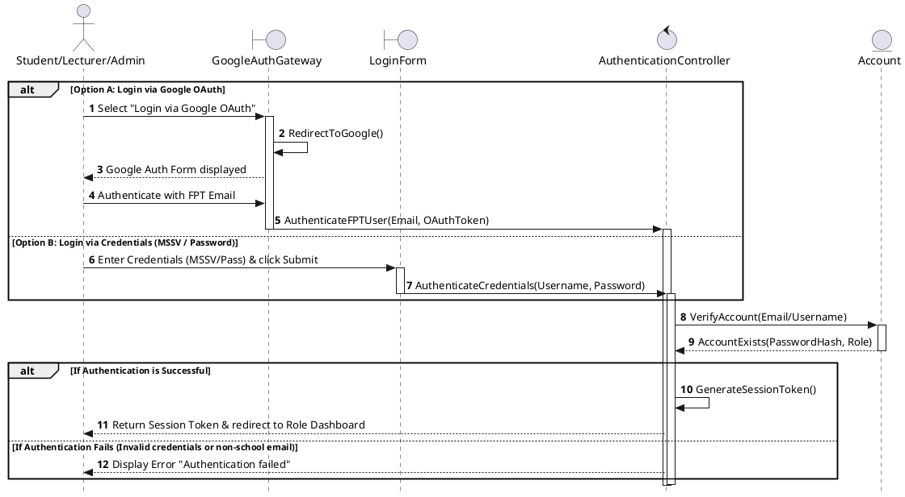

##### **Table II-1A: Message Description for UC01 - Login**

| Step (Seq) | Source Object | Target Object | Message Signature | Type | Description |
| :--- | :--- | :--- | :--- | :--- | :--- |
| **1 (Option A)** | `User` | `LGG: GoogleAuthGateway «boundary»` | `Select "Login via Google OAuth"` | Synchronous | User initiates the login process via Google OAuth. |
| **2** | `LGG: GoogleAuthGateway «boundary»` | `LGG: GoogleAuthGateway «boundary»` | `RedirectToGoogle()` | Self-message | Gateway redirects user browser to Google's sign-in page. |
| **3** | `LGG: GoogleAuthGateway «boundary»` | `User` | `Google Auth Form displayed` | Return | The Google login screen is presented to the user. |
| **4** | `User` | `LGG: GoogleAuthGateway «boundary»` | `Authenticate with FPT Email` | Synchronous | User chooses their FPT school email account and enters credentials. |
| **5** | `LGG: GoogleAuthGateway «boundary»` | `AC: AuthenticationController «control»` | `AuthenticateFPTUser(Email, OAuthToken)` | Synchronous | Google authentication token and email are forwarded to the internal controller. |
| **1 (Option B)** | `User` | `LAF: LoginForm «boundary»` | `Enter Credentials & Submit` | Synchronous | Alternatively, User enters MSSV and password in the credential fields and submits. |
| **2** | `LAF: LoginForm «boundary»` | `AC: AuthenticationController «control»` | `AuthenticateCredentials(Username, Password)` | Synchronous | Form inputs are validated on the client and transmitted securely to the controller. |
| **6** | `AC: AuthenticationController «control»` | `ACC: Account «entity»` | `VerifyAccount(Email/Username)` | Synchronous | Controller queries the Account entity using the provided unique identifier. |
| **7** | `ACC: Account «entity»` | `AC: AuthenticationController «control»` | `AccountExists(PasswordHash, Role)` | Return | Entity returns account metadata including password hash and user role. |
| **8** | `AC: AuthenticationController «control»` | `AC: AuthenticationController «control»` | `GenerateSessionToken()` | Self-message | Controller verifies the password hash or OAuth token validity and generates a JWT session token. |
| **9a** | `AC: AuthenticationController «control»` | `User` | `Return Session Token & Redirect` | Return | Successful Case: Controller returns the generated session token to the client and redirects to the appropriate role-based dashboard. |
| **9b** | `AC: AuthenticationController «control»` | `User` | `Display Error` | Return | Exception Case: If validation fails, an error message is returned and displayed to the user. |

#### **Figure II-1B: Communication Diagram for UC01 - Login**
```plantuml
@startuml
object User as "Student/Lecturer/Admin"
object LGG as "GoogleAuthGateway\n«boundary»"
object LAF as "LoginForm\n«boundary»"
object AC as "AuthenticationController\n«control»"
object ACC as "Account\n«entity»"

User --> LGG : 1a: Login via Google
User --> LAF : 1b: Enter Credentials

LGG --> AC : 1a.1: AuthenticateFPTUser()
LAF --> AC : 1b.1: AuthenticateCredentials()

AC --> ACC : 2: VerifyAccount()
ACC --> AC : 2.1: AccountExists()
AC --> User : 3: Return Session Token / Redirect
@enduml
```


---

### **2. UC02: Register Device UUID**

#### **Figure II-2A: Sequence Diagram for UC02 - Register Device UUID**
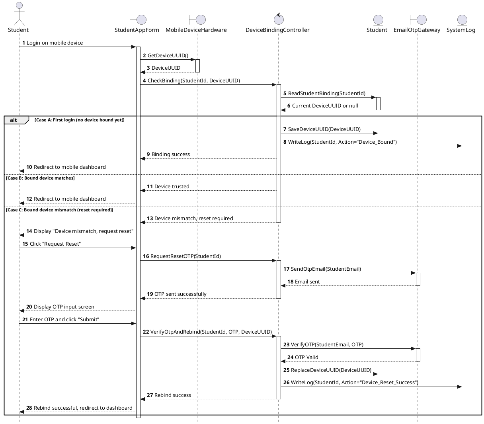

##### **Table II-2A: Message Description for UC02 - Register Device UUID**

| Step (Seq) | Source Object | Target Object | Message Signature | Type | Description |
| :--- | :--- | :--- | :--- | :--- | :--- |
| **1** | `SV: Student` | `SAF: StudentAppForm «boundary»` | `Login on mobile device` | Synchronous | Student opens mobile app and triggers login sequence. |
| **2** | `SAF: StudentAppForm «boundary»` | `MD: MobileDeviceHardware «boundary»` | `GetDeviceUUID()` | Synchronous | Student app form requests physical UUID from mobile device. |
| **3** | `MD: MobileDeviceHardware «boundary»` | `SAF: StudentAppForm «boundary»` | `DeviceUUID` | Return | Mobile hardware returns device-specific unique identifier. |
| **4** | `SAF: StudentAppForm «boundary»` | `DBC: DeviceBindingController «control»` | `CheckBinding(StudentId, DeviceUUID)` | Synchronous | App requests binding check from the backend coordinator. |
| **5** | `DBC: DeviceBindingController «control»` | `ST: Student «entity»` | `ReadStudentBinding(StudentId)` | Synchronous | Controller checks registered device identifier for student. |
| **6** | `ST: Student «entity»` | `DBC: DeviceBindingController «control»` | `Current DeviceUUID or null` | Return | Student entity returns existing UUID or null if not yet bound. |
| **[Case A] 7** | `DBC: DeviceBindingController «control»` | `ST: Student «entity»` | `SaveDeviceUUID(DeviceUUID)` | Synchronous | First login: Controller writes new UUID mapping to Student entity. |
| **[Case A] 8** | `DBC: DeviceBindingController «control»` | `SL: SystemLog «entity»` | `WriteLog(StudentId, Action="Device_Bound")` | Synchronous | Controller creates audit log entry for device binding. |
| **[Case A] 9** | `DBC: DeviceBindingController «control»` | `SAF: StudentAppForm «boundary»` | `Binding success` | Return | Controller notifies frontend application that binding succeeded. |
| **[Case A] 10** | `SAF: StudentAppForm «boundary»` | `SV: Student` | `Redirect to mobile dashboard` | Return | Mobile application redirects user to dashboard. |
| **[Case B] 7** | `DBC: DeviceBindingController «control»` | `SAF: StudentAppForm «boundary»` | `Device trusted` | Return | Known device: Controller trusts device and returns success status. |
| **[Case B] 8** | `SAF: StudentAppForm «boundary»` | `SV: Student` | `Redirect to mobile dashboard` | Return | Mobile application redirects user to dashboard. |
| **[Case C] 7** | `DBC: DeviceBindingController «control»` | `SAF: StudentAppForm «boundary»` | `Device mismatch, reset required` | Return | Different device: Controller returns mismatch exception. |
| **[Case C] 8** | `SAF: StudentAppForm «boundary»` | `SV: Student` | `Display "Device mismatch, request reset"` | Return | Frontend displays prompt to request device reset via email OTP. |
| **[Case C] 9** | `SV: Student` | `SAF: StudentAppForm «boundary»` | `Click "Request Reset"` | Synchronous | Student requests a resetting code. |
| **[Case C] 10** | `SAF: StudentAppForm «boundary»` | `DBC: DeviceBindingController «control»` | `RequestResetOTP(StudentId)` | Synchronous | Application requests OTP generation. |
| **[Case C] 11** | `DBC: DeviceBindingController «control»` | `OTP: EmailOtpGateway «boundary»` | `SendOtpEmail(StudentEmail)` | Synchronous | Controller commands OTP proxy to send a secure code via email. |
| **[Case C] 12** | `OTP: EmailOtpGateway «boundary»` | `DBC: DeviceBindingController «control»` | `Email sent` | Return | Proxy confirms email transmission. |
| **[Case C] 13** | `DBC: DeviceBindingController «control»` | `SAF: StudentAppForm «boundary»` | `OTP sent successfully` | Return | Controller notifies application that OTP has been dispatched. |
| **[Case C] 14** | `SAF: StudentAppForm «boundary»` | `SV: Student` | `Display OTP input screen` | Return | Frontend renders form for OTP verification. |
| **[Case C] 15** | `SV: Student` | `SAF: StudentAppForm «boundary»` | `Enter OTP and click "Submit"` | Synchronous | Student submits the OTP code. |
| **[Case C] 16** | `SAF: StudentAppForm «boundary»` | `DBC: DeviceBindingController «control»` | `VerifyOtpAndRebind(...)` | Synchronous | Application submits verification and registration request. |
| **[Case C] 17** | `DBC: DeviceBindingController «control»` | `OTP: EmailOtpGateway «boundary»` | `VerifyOTP(StudentEmail, OTP)` | Synchronous | Controller checks OTP token against active tokens in cache/proxy. |
| **[Case C] 18** | `OTP: EmailOtpGateway «boundary»` | `DBC: DeviceBindingController «control»` | `OTP Valid` | Return | Proxy validates correctness of OTP token. |
| **[Case C] 19** | `DBC: DeviceBindingController «control»` | `ST: Student «entity»` | `ReplaceDeviceUUID(DeviceUUID)` | Synchronous | Controller replaces student's bound device UUID with the new one. |
| **[Case C] 20** | `DBC: DeviceBindingController «control»` | `SL: SystemLog «entity»` | `WriteLog(StudentId, Action="Device_Reset_Success")` | Synchronous | Controller creates audit log entry for successful device reset. |
| **[Case C] 21** | `DBC: DeviceBindingController «control»` | `SAF: StudentAppForm «boundary»` | `Rebind success` | Return | Controller returns verification success to frontend. |
| **[Case C] 22** | `SAF: StudentAppForm «boundary»` | `SV: Student` | `Rebind successful, redirect to dashboard` | Return | Application confirms success and navigates student to dashboard. |


#### **Figure II-2B: Communication Diagram for UC02 - Register Device UUID**
```plantuml
@startuml
object SV as "Student"
object SAF as "StudentAppForm\n«user interaction»"
object MD as "MobileDeviceHardware\n«device I/O»"
object DBC as "DeviceBindingController\n«coordinator»"
object ST as "Student\n«entity»"
object OTP as "EmailOtpGateway\n«proxy»"
object SL as "SystemLog\n«entity»"

SV --> SAF : 1: Login / Request Reset
SAF --> MD : 1.1: GetDeviceUUID()
SAF --> DBC : 2: CheckBinding() / VerifyOtpAndRebind()
DBC --> ST : 2.1: ReadStudentBinding() / SaveDeviceUUID()
DBC --> OTP : 2.2: SendOtpEmail() / VerifyOTP()
DBC --> SL : 2.3: WriteLog()
DBC --> SAF : 3: Return status/redirect
@enduml
```

---

### **3. UC03: Scan Dynamic QR Check-in**

To ensure clarity and handle complex anti-fraud logic without cluttering the diagrams, the interaction is split into one Happy Path scenario and three separate Exception Scenario diagrams.

#### **Figure II-3A1: Sequence Diagram for UC03 - Happy Path Scenario**
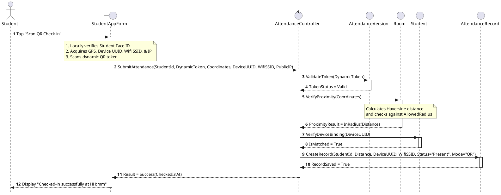

#### **Figure II-3A2: Sequence Diagram for UC03 - Exception Scenario: Token Expired**
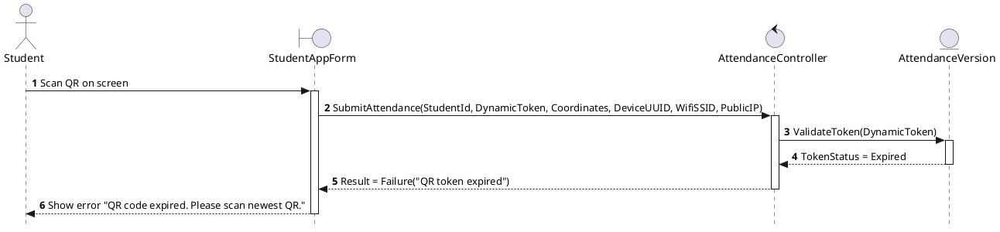

#### **Figure II-3A3: Sequence Diagram for UC03 - Exception Scenario: Location Fraud (Out of Geofence)**
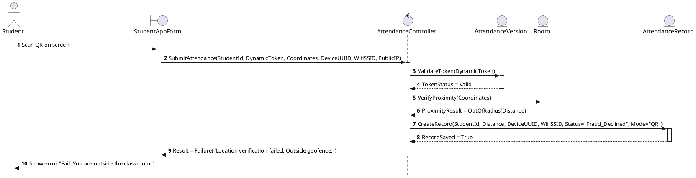

#### **Figure II-3A4: Sequence Diagram for UC03 - Exception Scenario: Device UUID Mismatch**
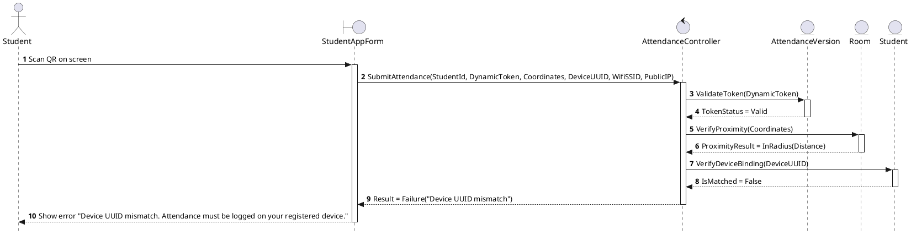

##### **Table II-3A: Message Description for UC03 - Scan Dynamic QR Check-in**

| Step (Seq) | Source Object | Target Object | Message Signature | Type | Description |
| :--- | :--- | :--- | :--- | :--- | :--- |
| **1** | `Student` | `SAF: StudentAppForm «boundary»` | `Tap "Scan QR Check-in"` | Synchronous | Student opens scanner view. App verifies Face ID, gets GPS, Wifi SSID, IP, and scans QR. |
| **2** | `SAF: StudentAppForm «boundary»` | `AC: AttendanceController «control»` | `SubmitAttendance(...)` | Synchronous | Form submits credentials, scanned QR token, GPS coordinates, Device UUID, SSID, and IP. |
| **3** | `AC: AttendanceController «control»` | `V: AttendanceVersion «entity»` | `ValidateToken(DynamicToken)` | Synchronous | Controller checks if the scanned dynamic token is valid and active. |
| **4** | `V: AttendanceVersion «entity»` | `AC: AttendanceController «control»` | `TokenStatus` | Return | Returns token status (`Valid` or `Expired`). |
| **[Exception A] 5** | `AC: AttendanceController «control»` | `SAF: StudentAppForm «boundary»` | `Result = Failure("QR token expired")` | Return | Exception Case (Token Expired): Controller aborts flow and returns failure result. |
| **[Exception A] 6** | `SAF: StudentAppForm «boundary»` | `Student` | `Show error "QR code expired..."` | Return | App displays code expiration error screen to the student. |
| **5 (Happy Flow)** | `AC: AttendanceController «control»` | `R: Room «entity»` | `VerifyProximity(Coordinates)` | Synchronous | Controller verifies student's GPS coordinates against Room's location boundary. |
| **6** | `R: Room «entity»` | `AC: AttendanceController «control»` | `ProximityResult` | Return | Returns proximity result (within or outside allowed radius). |
| **[Exception B] 7** | `AC: AttendanceController «control»` | `AR: AttendanceRecord «entity»` | `CreateRecord(..., Status="Fraud_Declined", Mode="QR")` | Synchronous | Exception Case (Location Fraud): Controller writes a declined record to database. |
| **[Exception B] 8** | `AC: AttendanceController «control»` | `SAF: StudentAppForm «boundary»` | `Result = Failure("Outside geofence")` | Return | Controller returns location failure result to application interface. |
| **[Exception B] 9** | `SAF: StudentAppForm «boundary»` | `Student` | `Show error "Fail: Outside classroom"` | Return | Frontend notifies student that they are outside the classroom boundary. |
| **7 (Happy Flow)** | `AC: AttendanceController «control»` | `ST: Student «entity»` | `VerifyDeviceBinding(DeviceUUID)` | Synchronous | Controller checks if the submitted UUID matches the student's bound device. |
| **8** | `ST: Student «entity»` | `AC: AttendanceController «control»` | `IsMatched` | Return | Returns device verification status (`True` or `False`). |
| **[Exception C] 9** | `AC: AttendanceController «control»` | `SAF: StudentAppForm «boundary»` | `Result = Failure("Device UUID mismatch")` | Return | Exception Case (Device Mismatch): Controller aborts flow and returns device mismatch failure. |
| **[Exception C] 10** | `SAF: StudentAppForm «boundary»` | `Student` | `Show error "Device UUID mismatch"` | Return | Frontend displays error that attendance must be logged on bound device. |
| **9 (Happy Flow)** | `AC: AttendanceController «control»` | `AR: AttendanceRecord «entity»` | `CreateRecord(..., Status="Present", Mode="QR")` | Synchronous | Happy Path: Controller creates and persists a successful attendance record. |
| **10** | `AR: AttendanceRecord «entity»` | `AC: AttendanceController «control»` | `RecordSaved = True` | Return | Database confirms record creation success. |
| **11** | `AC: AttendanceController «control»` | `SAF: StudentAppForm «boundary»` | `Result = Success(CheckedInAt)` | Return | Controller returns success payload with timestamp. |
| **12** | `SAF: StudentAppForm «boundary»` | `Student` | `Display "Checked-in successfully..."` | Return | Frontend shows check-in success confirmation. |

#### **Figure II-3B: Communication Diagram for UC03 - Scan Dynamic QR Check-in**
```plantuml
@startuml
object Student as "Student"
object SAF as "StudentAppForm\n«boundary»"
object AC as "AttendanceController\n«control»"
object V as "AttendanceVersion\n«entity»"
object R as "Room\n«entity»"
object ST as "Student\n«entity»"
object AR as "AttendanceRecord\n«entity»"

Student --> SAF : 1: Scan QR Check-in
SAF --> AC : 2: SubmitAttendance()
AC --> V : 2.1: ValidateToken()
AC --> R : 2.2: VerifyProximity()
AC --> ST : 2.3: VerifyDeviceBinding()
AC --> AR : 2.4: CreateRecord()
AC --> SAF : 3: Return Result
@enduml
```

---

### **4. UC04: View Attendance History**

#### **Figure II-4A: Sequence Diagram for UC04 - View Attendance History**
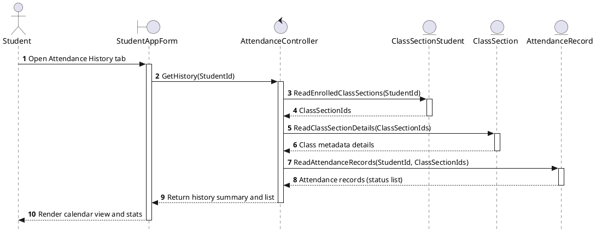

##### **Table II-4A: Message Description for UC04 - View Attendance History**

| Step (Seq) | Source Object | Target Object | Message Signature | Type | Description |
| :--- | :--- | :--- | :--- | :--- | :--- |
| **1** | `SV: Student` | `SAF: StudentAppForm «boundary»` | `Open Attendance History tab` | Synchronous | Student opens the attendance history tab on the mobile app. |
| **2** | `SAF: StudentAppForm «boundary»` | `AC: AttendanceController «control»` | `GetHistory(StudentId)` | Synchronous | Frontend requests attendance history details for student. |
| **3** | `AC: AttendanceController «control»` | `CSS: ClassSectionStudent «entity»` | `ReadEnrolledClassSections(StudentId)` | Synchronous | Controller checks academic enrollment records for the student. |
| **4** | `CSS: ClassSectionStudent «entity»` | `AC: AttendanceController «control»` | `ClassSectionIds` | Return | Returns list of class section identifiers student is enrolled in. |
| **5** | `AC: AttendanceController «control»` | `CS: ClassSection «entity»` | `ReadClassSectionDetails(ClassSectionIds)` | Synchronous | Controller retrieves course metadata (subject name, scheduler times) for classes. |
| **6** | `CS: ClassSection «entity»` | `AC: AttendanceController «control»` | `Class metadata details` | Return | Returns metadata details for all queried class sections. |
| **7** | `AC: AttendanceController «control»` | `AR: AttendanceRecord «entity»` | `ReadAttendanceRecords(StudentId, ClassSectionIds)` | Synchronous | Controller queries historical attendance statuses (Present, Late, Absent, Fraud) for student. |
| **8** | `AR: AttendanceRecord «entity»` | `AC: AttendanceController «control»` | `Attendance records (status list)` | Return | Database returns list of student's past check-in statuses. |
| **9** | `AC: AttendanceController «control»` | `SAF: StudentAppForm «boundary»` | `Return history summary and list` | Return | Controller aggregates information and returns a summary DTO to frontend. |
| **10** | `SAF: StudentAppForm «boundary»` | `SV: Student` | `Render calendar view and stats` | Return | Mobile app renders a clean calendar and summary statistics (e.g. 80% Present). |


#### **Figure II-4B: Communication Diagram for UC04 - View Attendance History**
```plantuml
@startuml
object SV as "Student"
object SAF as "StudentAppForm\n«user interaction»"
object AC as "AttendanceController\n«coordinator»"
object CSS as "ClassSectionStudent\n«entity»"
object CS as "ClassSection\n«entity»"
object AR as "AttendanceRecord\n«entity»"

SV --> SAF : 1: Open History Tab
SAF --> AC : 1.1: GetHistory(StudentId)
AC --> CSS : 1.1.1: ReadEnrolledClassSections()
AC --> CS : 1.1.2: ReadClassSectionDetails()
AC --> AR : 1.1.3: ReadAttendanceRecords()
AC --> SAF : 2: Return history data
@enduml
```

---

### **5. UC05: PIN Fallback Check-in**

This use case provides a manual fallback when the projector QR scanner cannot be scanned. The student manually inputs the 6-digit PIN displayed on the classroom screen.

#### **Figure II-5A: Sequence Diagram for UC05 - PIN Fallback Check-in (Happy Path Scenario)**
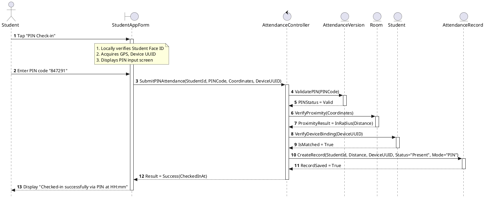

##### **Table II-5A: Message Description for UC05 - PIN Fallback Check-in (Happy Path Scenario)**

| Step (Seq) | Source Object | Target Object | Message Signature | Type | Description |
| :--- | :--- | :--- | :--- | :--- | :--- |
| **1** | `Student` | `SAF: StudentAppForm «boundary»` | `Tap "PIN Check-in"` | Synchronous | Student selects PIN fallback option. App verifies Face ID and queries GPS location/UUID. |
| **2** | `Student` | `SAF: StudentAppForm «boundary»` | `Enter PIN code "847291"` | Synchronous | Student inputs the 6-digit numeric PIN visible on the classroom projector screen. |
| **3** | `SAF: StudentAppForm «boundary»` | `AC: AttendanceController «control»` | `SubmitPINAttendance(...)` | Synchronous | Application submits the PIN payload along with device metrics for validation. |
| **4** | `AC: AttendanceController «control»` | `V: AttendanceVersion «entity»` | `ValidatePIN(PINCode)` | Synchronous | Controller checks database to verify that the entered PIN matches the active session PIN. |
| **5** | `V: AttendanceVersion «entity»` | `AC: AttendanceController «control»` | `PINStatus = Valid` | Return | Returns verification status of the PIN token as valid. |
| **6** | `AC: AttendanceController «control»` | `R: Room «entity»` | `VerifyProximity(Coordinates)` | Synchronous | Controller verifies student's GPS coordinate proximity bounds. |
| **7** | `R: Room «entity»` | `AC: AttendanceController «control»` | `ProximityResult = InRadius(Distance)` | Return | Room verifies coordinates are inside allowed circle. |
| **8** | `AC: AttendanceController «control»` | `ST: Student «entity»` | `VerifyDeviceBinding(DeviceUUID)` | Synchronous | Controller checks matching UUID against student registry. |
| **9** | `ST: Student «entity»` | `AC: AttendanceController «control»` | `IsMatched = True` | Return | Confirms device binding is authentic and matched. |
| **10** | `AC: AttendanceController «control»` | `AR: AttendanceRecord «entity»` | `CreateRecord(..., Status="Present", Mode="PIN")` | Synchronous | Controller stores attendance record marked as checked-in via PIN fallback. |
| **11** | `AR: AttendanceRecord «entity»` | `AC: AttendanceController «control»` | `RecordSaved = True` | Return | Confirms record has been written to persistence. |
| **12** | `AC: AttendanceController «control»` | `SAF: StudentAppForm «boundary»` | `Result = Success(CheckedInAt)` | Return | Controller sends successful check-in response. |
| **13** | `SAF: StudentAppForm «boundary»` | `Student` | `Display "Checked-in successfully..."` | Return | Frontend app notifies the student of check-in success. |


*Note: The alternative flow exception paths (PIN Expired, Location Out of Geofence, and Device Mismatch) follow the exact corresponding logic structures depicted in Figures II-3A2, II-3A3, and II-3A4, with the dynamic token verification replaced by the 6-digit PIN check.*

#### **Figure II-5B: Communication Diagram for UC05 - PIN Fallback Check-in**
```plantuml
@startuml
object Student as "Student"
object SAF as "StudentAppForm\n«boundary»"
object AC as "AttendanceController\n«control»"
object V as "AttendanceVersion\n«entity»"
object R as "Room\n«entity»"
object ST as "Student\n«entity»"
object AR as "AttendanceRecord\n«entity»"

Student --> SAF : 1: Tap PIN Check-in / Submit PIN
SAF --> AC : 2: SubmitPINAttendance()
AC --> V : 2.1: ValidatePIN()
AC --> R : 2.2: VerifyProximity()
AC --> ST : 2.3: VerifyDeviceBinding()
AC --> AR : 2.4: CreateRecord()
AC --> SAF : 3: Return Result
@enduml
```

---

### **6. UC06: Activate Dynamic QR Session**

#### **Figure II-6A: Sequence Diagram for UC06 - Activate Dynamic QR Session**
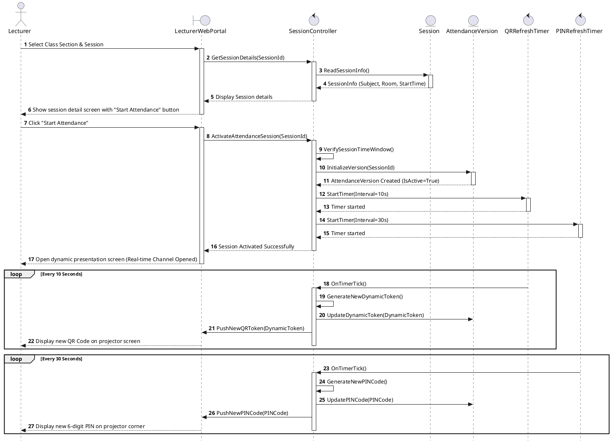

##### **Table II-6A: Message Description for UC06 - Activate Dynamic QR Session**

| Step (Seq) | Source Object | Target Object | Message Signature | Type | Description |
| :--- | :--- | :--- | :--- | :--- | :--- |
| **1** | `GV: Lecturer` | `LWP: LecturerWebPortal «boundary»` | `Select Class Section & Session` | Synchronous | Lecturer selects class details and class session on the web portal. |
| **2** | `LWP: LecturerWebPortal «boundary»` | `SC: SessionController «control»` | `GetSessionDetails(SessionId)` | Synchronous | Frontend requests session information from the controller. |
| **3** | `SC: SessionController «control»` | `S: Session «entity»` | `ReadSessionInfo()` | Synchronous | Controller reads metadata and schedule window for the session. |
| **4** | `S: Session «entity»` | `SC: SessionController «control»` | `SessionInfo` | Return | Returns details like subject code, room number, scheduled time. |
| **5** | `SC: SessionController «control»` | `LWP: LecturerWebPortal «boundary»` | `Display Session details` | Return | Controller sends details back, which are rendered on screen. |
| **6** | `LWP: LecturerWebPortal «boundary»` | `GV: Lecturer` | `Show session detail screen...` | Return | Lecturer is presented with the "Start Attendance" button. |
| **7** | `GV: Lecturer` | `LWP: LecturerWebPortal «boundary»` | `Click "Start Attendance"` | Synchronous | Lecturer clicks button to initiate attendance checking session. |
| **8** | `LWP: LecturerWebPortal «boundary»` | `SC: SessionController «control»` | `ActivateAttendanceSession(SessionId)` | Synchronous | Portal sends request to start active attendance checking. |
| **9** | `SC: SessionController «control»` | `SC: SessionController «control»` | `VerifySessionTimeWindow()` | Self-message | Controller validates that the current time falls within allowable range. |
| **10** | `SC: SessionController «control»` | `V: AttendanceVersion «entity»` | `InitializeVersion(SessionId)` | Synchronous | Controller initializes a new active attendance checking version instance. |
| **11** | `V: AttendanceVersion «entity»` | `SC: SessionController «control»` | `AttendanceVersion Created` | Return | Entity confirms creation and marks version status as active. |
| **12** | `SC: SessionController «control»` | `QT: QRRefreshTimer «control»` | `StartTimer(Interval=10s)` | Synchronous | Controller starts background timer for refreshing QR tokens. |
| **13** | `QT: QRRefreshTimer «control»` | `SC: SessionController «control»` | `Timer started` | Return | Timer confirms background cycle initiation. |
| **14** | `SC: SessionController «control»` | `PT: PINRefreshTimer «control»` | `StartTimer(Interval=30s)` | Synchronous | Controller starts background timer for refreshing PIN tokens. |
| **15** | `PT: PINRefreshTimer «control»` | `SC: SessionController «control»` | `Timer started` | Return | Timer confirms background cycle initiation. |
| **16** | `SC: SessionController «control»` | `LWP: LecturerWebPortal «boundary»` | `Session Activated Successfully` | Return | Controller returns success message to portal. |
| **17** | `LWP: LecturerWebPortal «boundary»` | `GV: Lecturer` | `Open dynamic presentation...` | Return | Lecturer's display redirects to check-in screen, opening WebSocket. |
| **[Loop QR] 18** | `QT: QRRefreshTimer «control»` | `SC: SessionController «control»` | `OnTimerTick()` | Synchronous | Every 10 seconds, QR timer triggers tick event on controller. |
| **[Loop QR] 19** | `SC: SessionController «control»` | `SC: SessionController «control»` | `GenerateNewDynamicToken()` | Self-message | Controller creates a new dynamic, cryptographically signed token. |
| **[Loop QR] 20** | `SC: SessionController «control»` | `V: AttendanceVersion «entity»` | `UpdateDynamicToken(...)` | Synchronous | Controller stores new active token in AttendanceVersion entity. |
| **[Loop QR] 21** | `SC: SessionController «control»` | `LWP: LecturerWebPortal «boundary»` | `PushNewQRToken(DynamicToken)` | Asynchronous | Controller pushes token over WebSocket channel to lecturer portal. |
| **[Loop QR] 22** | `LWP: LecturerWebPortal «boundary»` | `GV: Lecturer` | `Display new QR Code...` | Return | Portal updates screen to display new QR code for students to scan. |
| **[Loop PIN] 23** | `PT: PINRefreshTimer «control»` | `SC: SessionController «control»` | `OnTimerTick()` | Synchronous | Every 30 seconds, PIN timer triggers tick event on controller. |
| **[Loop PIN] 24** | `SC: SessionController «control»` | `SC: SessionController «control»` | `GenerateNewPINCode()` | Self-message | Controller creates a new 6-digit PIN string. |
| **[Loop PIN] 25** | `SC: SessionController «control»` | `V: AttendanceVersion «entity»` | `UpdatePINCode(PINCode)` | Synchronous | Controller stores new PIN code in AttendanceVersion entity. |
| **[Loop PIN] 26** | `SC: SessionController «control»` | `LWP: LecturerWebPortal «boundary»` | `PushNewPINCode(PINCode)` | Asynchronous | Controller pushes code over WebSocket channel to lecturer portal. |
| **[Loop PIN] 27** | `LWP: LecturerWebPortal «boundary»` | `GV: Lecturer` | `Display new 6-digit PIN...` | Return | Portal updates screen corner to display new PIN fallback code. |


#### **Figure II-6B: Communication Diagram for UC06 - Activate Dynamic QR Session**
```plantuml
@startuml
object GV as "Lecturer"
object LWP as "LecturerWebPortal\n«boundary»"
object SC as "SessionController\n«control»"
object S as "Session\n«entity»"
object V as "AttendanceVersion\n«entity»"
object QT as "QRRefreshTimer\n«control»"
object PT as "PINRefreshTimer\n«control»"

GV --> LWP : 1: Click Start Attendance
LWP --> SC : 1.1: GetSessionDetails()
LWP --> SC : 1.2: ActivateAttendanceSession()

SC --> S : 1.1.1: ReadSessionInfo()
SC --> V : 1.2.1: InitializeVersion()
SC --> QT : 1.2.2: StartTimer(10s)
SC --> PT : 1.2.3: StartTimer(30s)

QT --> LWP : 2: OnTimerTick() / PushQR()
PT --> LWP : 3: OnTimerTick() / PushPIN()
@enduml
```

---

### **7. UC07: Real-time Attendance Monitor**

#### **Figure II-7A: Sequence Diagram for UC07 - Real-time Attendance Monitor**
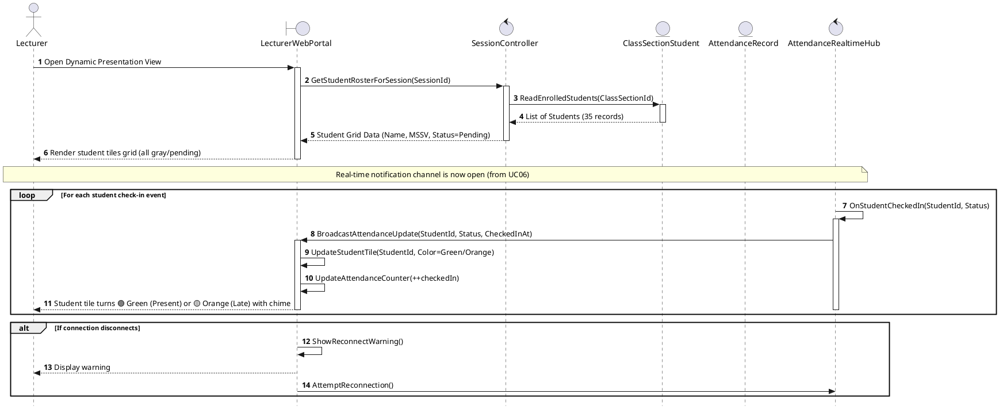

##### **Table II-7A: Message Description for UC07 - Real-time Attendance Monitor**

| Step (Seq) | Source Object | Target Object | Message Signature | Type | Description |
| :--- | :--- | :--- | :--- | :--- | :--- |
| **1** | `GV: Lecturer` | `LWP: LecturerWebPortal «boundary»` | `Open Dynamic Presentation View` | Synchronous | Lecturer opens the real-time presentation dashboard on the portal. |
| **2** | `LWP: LecturerWebPortal «boundary»` | `SC: SessionController «control»` | `GetStudentRosterForSession(SessionId)` | Synchronous | Portal requests student roster metadata for this session. |
| **3** | `SC: SessionController «control»` | `CS: ClassSectionStudent «entity»` | `ReadEnrolledStudents(ClassSectionId)` | Synchronous | Controller queries enrolled student records from the database. |
| **4** | `CS: ClassSectionStudent «entity»` | `SC: SessionController «control»` | `List of Students (35 records)` | Return | Database returns list of enrolled students. |
| **5** | `SC: SessionController «control»` | `LWP: LecturerWebPortal «boundary»` | `Student Grid Data` | Return | Controller sends grid DTO with status as Pending (all students initially absent). |
| **6** | `LWP: LecturerWebPortal «boundary»` | `GV: Lecturer` | `Render student tiles grid...` | Return | Portal renders grid tiles with default gray/pending states. |
| **[Loop Checkin] 7** | `WSH: AttendanceRealtimeHub «control»` | `WSH: AttendanceRealtimeHub «control»` | `OnStudentCheckedIn(StudentId, Status)` | Self-message | Hub receives WebSocket check-in notification from Student check-in process. |
| **[Loop Checkin] 8** | `WSH: AttendanceRealtimeHub «control»` | `LWP: LecturerWebPortal «boundary»` | `BroadcastAttendanceUpdate(...)` | Asynchronous | Hub broadcasts updated check-in status (Present/Late) to the lecturer portal. |
| **[Loop Checkin] 9** | `LWP: LecturerWebPortal «boundary»` | `LWP: LecturerWebPortal «boundary»` | `UpdateStudentTile(StudentId, Color)` | Self-message | Portal updates specific student grid tile color dynamically. |
| **[Loop Checkin] 10** | `LWP: LecturerWebPortal «boundary»` | `LWP: LecturerWebPortal «boundary»` | `UpdateAttendanceCounter(++checkedIn)` | Self-message | Portal increments checked-in count. |
| **[Loop Checkin] 11** | `LWP: LecturerWebPortal «boundary»` | `GV: Lecturer` | `Student tile turns 🟢 Green / 🟡 Orange` | Return | Lecturer sees tile color transition in real-time. |
| **[Disconnect] 12** | `LWP: LecturerWebPortal «boundary»` | `LWP: LecturerWebPortal «boundary»` | `ShowReconnectWarning()` | Self-message | If connection breaks, portal triggers a local reconnection alert. |
| **[Disconnect] 13** | `LWP: LecturerWebPortal «boundary»` | `GV: Lecturer` | `Display warning` | Return | Renders warning on UI. |
| **[Disconnect] 14** | `LWP: LecturerWebPortal «boundary»` | `WSH: AttendanceRealtimeHub «control»` | `AttemptReconnection()` | Synchronous | Portal attempts to re-establish WebSocket connection with the hub. |


#### **Figure II-7B: Communication Diagram for UC07 - Real-time Attendance Monitor**
```plantuml
@startuml
object GV as "Lecturer"
object LWP as "LecturerWebPortal\n«user interaction»"
object SC as "SessionController\n«state dependent control»"
object CS as "ClassSectionStudent\n«entity»"
object AR as "AttendanceRecord\n«entity»"
object WSH as "AttendanceRealtimeHub\n«coordinator»"

GV --> LWP : 1: Open Presentation View
LWP --> SC : 1.1: GetStudentRosterForSession()
SC --> CS : 1.1.1: ReadEnrolledStudents()

WSH --> LWP : 2: BroadcastAttendanceUpdate()
LWP --> LWP : 2.1: UpdateStudentTile() / UpdateCounter()
@enduml
```

---

### **8. UC08: Manual Attendance Adjustment**

#### **Figure II-8A: Sequence Diagram for UC08 - Manual Attendance Adjustment**
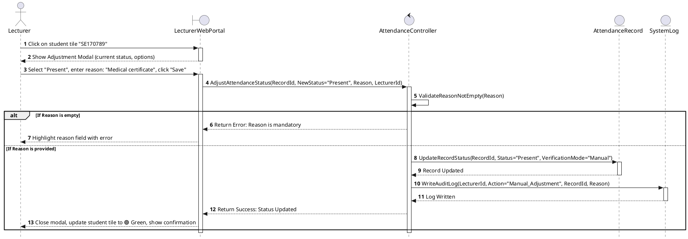

##### **Table II-8A: Message Description for UC08 - Manual Attendance Adjustment**

| Step (Seq) | Source Object | Target Object | Message Signature | Type | Description |
| :--- | :--- | :--- | :--- | :--- | :--- |
| **1** | `GV: Lecturer` | `LWP: LecturerWebPortal «boundary»` | `Click on student tile "SE170789"` | Synchronous | Lecturer clicks on a student cell in the grid to manually adjust status. |
| **2** | `LWP: LecturerWebPortal «boundary»` | `GV: Lecturer` | `Show Adjustment Modal` | Return | Portal displays adjustment options form (Present/Late/Absent) and mandatory Reason text box. |
| **3** | `GV: Lecturer` | `LWP: LecturerWebPortal «boundary»` | `Select Status, Enter Reason & Save` | Synchronous | Lecturer fills in new status, types reason, and submits form. |
| **4** | `LWP: LecturerWebPortal «boundary»` | `AC: AttendanceController «control»` | `AdjustAttendanceStatus(...)` | Synchronous | Frontend submits adjustment payload to controller. |
| **5** | `AC: AttendanceController «control»` | `AC: AttendanceController «control»` | `ValidateReasonNotEmpty(Reason)` | Self-message | Controller verifies that reason string is not empty. |
| **[Exception] 6** | `AC: AttendanceController «control»` | `LWP: LecturerWebPortal «boundary»` | `Return Error: Reason is mandatory` | Return | Exception Case (Empty Reason): Controller rejects adjustment request. |
| **[Exception] 7** | `LWP: LecturerWebPortal «boundary»` | `GV: Lecturer` | `Highlight reason field` | Return | Frontend validation highlights field. |
| **6 (Happy Flow)** | `AC: AttendanceController «control»` | `AR: AttendanceRecord «entity»` | `UpdateRecordStatus(...)` | Synchronous | Happy Path: Controller writes updated status to AttendanceRecord entity. |
| **7** | `AR: AttendanceRecord «entity»` | `AC: AttendanceController «control»` | `Record Updated` | Return | Entity confirms update success. |
| **8** | `AC: AttendanceController «control»` | `SL: SystemLog «entity»` | `WriteAuditLog(...)` | Synchronous | Controller registers manual action log in audit trails for accountability. |
| **9** | `SL: SystemLog «entity»` | `AC: AttendanceController «control»` | `Log Written` | Return | Confirm log written to persistence. |
| **10** | `AC: AttendanceController «control»` | `LWP: LecturerWebPortal «boundary»` | `Return Success: Status Updated` | Return | Controller returns success notification payload. |
| **11** | `LWP: LecturerWebPortal «boundary»` | `GV: Lecturer` | `Close modal & update student tile` | Return | Frontend closes modal, plays sound cue, and turns student tile color. |


#### **Figure II-8B: Communication Diagram for UC08 - Manual Attendance Adjustment**
```plantuml
@startuml
object GV as "Lecturer"
object LWP as "LecturerWebPortal\n«user interaction»"
object AC as "AttendanceController\n«coordinator»"
object AR as "AttendanceRecord\n«entity»"
object SL as "SystemLog\n«entity»"

GV --> LWP : 1: Click student / Select status / Save
LWP --> AC : 1.1: AdjustAttendanceStatus()
AC --> AR : 1.1.1: UpdateRecordStatus()
AC --> SL : 1.1.2: WriteAuditLog()
AC --> LWP : 2: Return Success
@enduml
```

---

### **9. UC09: Export Attendance Report**

#### **Figure II-9A: Sequence Diagram for UC09 - Export Attendance Report**
```plantuml
@startuml
skinparam style strictuml
autonumber

actor GV as "Lecturer"
boundary LWP as "LecturerWebPortal"
control RC as "ReportController"
entity CSS as "ClassSectionStudent"
entity AR as "AttendanceRecord"
control REP as "ReportGenerator"
entity SL as "SystemLog"

GV -> LWP: Click Export Report for class section
activate LWP
LWP -> RC: ExportClassReport(ClassSectionId, Semester)
activate RC
RC -> CSS: ReadRoster(ClassSectionId)
activate CSS
CSS --> RC: Student roster
deactivate CSS
RC -> AR: ReadSessionAttendanceRecords(ClassSectionId, Semester)
activate AR
AR --> RC: Attendance matrix records
deactivate AR

alt Case A: No attendance records exist
    RC --> LWP: Return error (No records found)
    LWP --> GV: Show "No records available for export" alert
else Case B: Records exist
    RC -> REP: GenerateReport(Roster, AttendanceRecords)
    activate REP
    REP --> RC: Report file stream
    deactivate REP
    RC -> SL: WriteLog(LecturerId, Action="Export_Report", ClassSectionId)
    activate SL
    SL --> RC: Log written
    deactivate SL
    RC --> LWP: Return file stream
    deactivate RC
    LWP --> GV: Download report file
end
deactivate LWP
@enduml
```

##### **Table II-9A: Message Description for UC09 - Export Attendance Report**

| Step (Seq) | Source Object | Target Object | Message Signature | Type | Description |
| :--- | :--- | :--- | :--- | :--- | :--- |
| **1** | `GV: Lecturer` | `LWP: LecturerWebPortal «boundary»` | `Click Export Report for class section` | Synchronous | Lecturer clicks export report button. |
| **2** | `LWP: LecturerWebPortal «boundary»` | `RC: ReportController «control»` | `ExportClassReport(ClassSectionId, Semester)` | Synchronous | Portal requests class attendance report generation from controller. |
| **3** | `RC: ReportController «control»` | `CSS: ClassSectionStudent «entity»` | `ReadRoster(ClassSectionId)` | Synchronous | Controller reads student roster for the target class section. |
| **4** | `CSS: ClassSectionStudent «entity»` | `RC: ReportController «control»` | `Student roster` | Return | Returns roster dataset. |
| **5** | `RC: ReportController «control»` | `AR: AttendanceRecord «entity»` | `ReadSessionAttendanceRecords(ClassSectionId, Semester)` | Synchronous | Controller retrieves past attendance records for all sessions in this course. |
| **6** | `AR: AttendanceRecord «entity»` | `RC: ReportController «control»` | `Attendance matrix records` | Return | Returns historical attendance matrix dataset. |
| **[Case A] 7** | `RC: ReportController «control»` | `LWP: LecturerWebPortal «boundary»` | `Return error (No records found)` | Return | Error Case: If no check-ins exist, controller returns empty error state. |
| **[Case A] 8** | `LWP: LecturerWebPortal «boundary»` | `GV: Lecturer` | `Show "No records available..." alert` | Return | Frontend alerts lecturer that there is no data to export. |
| **7 (Happy Flow)** | `RC: ReportController «control»` | `REP: ReportGenerator «control»` | `GenerateReport(Roster, AttendanceRecords)` | Synchronous | Happy Path: Controller requests report generation utility to format data. |
| **8** | `REP: ReportGenerator «control»` | `RC: ReportController «control»` | `Report file stream` | Return | Report generator creates and returns Excel file stream. |
| **9** | `RC: ReportController «control»` | `SL: SystemLog «entity»` | `WriteLog(LecturerId, Action="Export_Report", ...)` | Synchronous | Controller logs audit trail record of report export action. |
| **10** | `SL: SystemLog «entity»` | `RC: ReportController «control»` | `Log written` | Return | Confirms audit log written. |
| **11** | `RC: ReportController «control»` | `LWP: LecturerWebPortal «boundary»` | `Return file stream` | Return | Controller sends Excel file stream to browser. |
| **12** | `LWP: LecturerWebPortal «boundary»` | `GV: Lecturer` | `Download report file` | Return | Web browser initiates file download to lecturer device. |


#### **Figure II-9B: Communication Diagram for UC09 - Export Attendance Report**
```plantuml
@startuml
object GV as "Lecturer"
object LWP as "LecturerWebPortal\n«user interaction»"
object RC as "ReportController\n«coordinator»"
object CSS as "ClassSectionStudent\n«entity»"
object AR as "AttendanceRecord\n«entity»"
object REP as "ReportGenerator\n«coordinator»"
object SL as "SystemLog\n«entity»"

GV --> LWP : 1: Click Export Report
LWP --> RC : 1.1: ExportClassReport()
RC --> CSS : 1.1.1: ReadRoster()
RC --> AR : 1.1.2: ReadSessionAttendanceRecords()
RC --> REP : 1.1.3: GenerateReport()
RC --> SL : 1.1.4: WriteLog()
RC --> LWP : 2: Return file stream
@enduml
```

---

### **10. UC10: Manage System Catalog**

#### **Figure II-10A: Sequence Diagram for UC10 - Manage System Catalog**
```plantuml
@startuml
skinparam style strictuml
autonumber
actor AD as "Admin"
boundary AWP as "AdminWebPortal"
control CC as "CatalogController"
entity ACC as "Account"
entity ST as "Student"
entity LT as "Lecturer"
entity SUB as "Subject"
entity CLS as "ClassSection"
entity SL as "SystemLog"

AD -> AWP : Open catalog screen (e.g. Students)
activate AWP
AWP -> CC : GetCatalog(catalogType)
activate CC
CC --> AWP : Return list of rows
deactivate CC
AWP --> AD : Render catalog table

alt Case A: Add new record
    AD -> AWP : Input details and click "Save"
    AWP -> CC : SaveCatalogChange(catalogType, payload)
    activate CC
    CC -> CC : ValidatePayloadFields()
    alt Invalid fields
        CC --> AWP : Return validation error
        AWP --> AD : Display error highlighting fields
    else Valid fields
        alt Role = Student
            CC -> ACC : CreateAccount(payload)
            CC -> ST : CreateStudent(payload)
        else Role = Lecturer
            CC -> ACC : CreateAccount(payload)
            CC -> LT : CreateLecturer(payload)
        else Type = Subject
            CC -> SUB : CreateSubject(payload)
        else Type = ClassSection
            CC -> CLS : CreateClassSection(payload)
        end
        CC -> SL : WriteLog(AdminId, Action="Catalog_Change")
        activate SL
        SL --> CC : Log written
        deactivate SL
        CC --> AWP : Save successful
        deactivate CC
        AWP --> AD : Refresh table with success message
    end
end
deactivate AWP
@enduml
```

##### **Table II-10A: Message Description for UC10 - Manage System Catalog**

| Step (Seq) | Source Object | Target Object | Message Signature | Type | Description |
| :--- | :--- | :--- | :--- | :--- | :--- |
| **1** | `AD: Admin` | `AWP: AdminWebPortal «boundary»` | `Open catalog screen` | Synchronous | Admin opens the system catalog management screen. |
| **2** | `AWP: AdminWebPortal «boundary»` | `CC: CatalogController «control»` | `GetCatalog(catalogType)` | Synchronous | Portal requests system catalog rows based on category type (Students, Subjects, etc). |
| **3** | `CC: CatalogController «control»` | `AWP: AdminWebPortal «boundary»` | `Return list of rows` | Return | Controller returns records list. |
| **4** | `AWP: AdminWebPortal «boundary»` | `AD: Admin` | `Render catalog table` | Return | Portal displays records in a grid table. |
| **5 (Add Path)** | `AD: Admin` | `AWP: AdminWebPortal «boundary»` | `Input details and click "Save"` | Synchronous | Admin fills in catalog form details and clicks save. |
| **6** | `AWP: AdminWebPortal «boundary»` | `CC: CatalogController «control»` | `SaveCatalogChange(catalogType, payload)` | Synchronous | Portal sends catalog addition payload to controller. |
| **7** | `CC: CatalogController «control»` | `CC: CatalogController «control»` | `ValidatePayloadFields()` | Self-message | Controller validates fields (email structure, non-empty codes, etc.). |
| **[Exception] 8** | `CC: CatalogController «control»` | `AWP: AdminWebPortal «boundary»` | `Return validation error` | Return | Exception Case: Validation fails. |
| **[Exception] 9** | `AWP: AdminWebPortal «boundary»` | `AD: Admin` | `Display error highlighting fields` | Return | Frontend displays errors. |
| **8 (Happy Student)** | `CC: CatalogController «control»` | `ACC: Account «entity»` | `CreateAccount(payload)` | Synchronous | Happy Path: Creates base credentials account. |
| **9** | `CC: CatalogController «control»` | `ST: Student «entity»` | `CreateStudent(payload)` | Synchronous | Writes student-specific metadata (MSSV, class). |
| **8 (Happy Lecturer)** | `CC: CatalogController «control»` | `ACC: Account «entity»` | `CreateAccount(payload)` | Synchronous | Happy Path: Creates base credentials account. |
| **9** | `CC: CatalogController «control»` | `LT: Lecturer «entity»` | `CreateLecturer(payload)` | Synchronous | Writes lecturer-specific metadata (department). |
| **8 (Happy Subject)** | `CC: CatalogController «control»` | `SUB: Subject «entity»` | `CreateSubject(payload)` | Synchronous | Happy Path: Creates a new subject catalog entry. |
| **8 (Happy Section)** | `CC: CatalogController «control»` | `CLS: ClassSection «entity»` | `CreateClassSection(payload)` | Synchronous | Happy Path: Creates class section (associating teacher, class). |
| **10** | `CC: CatalogController «control»` | `SL: SystemLog «entity»` | `WriteLog(AdminId, Action="Catalog_Change")` | Synchronous | Controller logs audit trail of admin catalog management. |
| **11** | `SL: SystemLog «entity»` | `CC: CatalogController «control»` | `Log written` | Return | Confirms audit log saved. |
| **12** | `CC: CatalogController «control»` | `AWP: AdminWebPortal «boundary»` | `Save successful` | Return | Controller reports success to frontend portal. |
| **13** | `AWP: AdminWebPortal «boundary»` | `AD: Admin` | `Refresh table with success message` | Return | Portal displays confirmation alert and refreshes database table rows. |


#### **Figure II-10B: Communication Diagram for UC10 - Manage System Catalog**
```plantuml
@startuml
object AD as "Admin"
object AWP as "AdminWebPortal\n«user interaction»"
object CC as "CatalogController\n«coordinator»"
object ACC as "Account\n«entity»"
object ST as "Student\n«entity»"
object LT as "Lecturer\n«entity»"
object SUB as "Subject\n«entity»"
object CLS as "ClassSection\n«entity»"
object SL as "SystemLog\n«entity»"

AD --> AWP : 1: Manage catalog
AWP --> CC : 1.1: GetCatalog() / SaveCatalogChange()
CC --> ST : 1.1.1: CreateAccount() / CreateStudent()
CC --> LT : 1.1.2: CreateLecturer()
CC --> SUB : 1.1.3: CreateSubject()
CC --> CLS : 1.1.4: CreateClassSection()
CC --> SL : 1.1.5: WriteLog()
CC --> AWP : 2: Return success/refresh
@enduml
```

---

### **11. UC11: Configure Room Coordinates & Allowed Radius**

#### **Figure II-11A: Sequence Diagram for UC11 - Configure Room Coordinates**
```plantuml
@startuml UC11_Sequence_Diagram
skinparam style strictuml
autonumber

actor AD as "Admin"
boundary AWP as "AdminWebPortal"
control RCC as "RoomConfigurationController"
entity R as "Room"
entity SL as "SystemLog"

AD->AWP: Click "Room Management"
activate AWP
AWP->RCC: GetRoomsList()
activate RCC
RCC->R: ReadAllRooms()
activate R
R-->>RCC: List of Rooms
deactivate R
RCC-->>AWP: Display room table
deactivate RCC
AWP-->>AD: Show room table with config buttons
deactivate AWP

AD->AWP: Click "Edit Coordinates" for specific Room
activate AWP
AWP-->>AD: Open RoomConfigForm with integrated satellite map
deactivate AWP

alt Option A: Click on satellite map
    AD->AWP: Click exact classroom location on map
    activate AWP
    AWP->AWP: ExtractLatLongFromMapClick()
    AWP-->>AD: Automatically populate Lat & Long fields
    deactivate AWP
else Option B: Get current GPS (Mobile device at site)
    AD->AWP: Tap "Get Current GPS Location"
    activate AWP
    AWP->AWP: RequestBrowserGeoLocationAPI()
    AWP-->>AD: Populate Lat & Long fields with hardware coordinates
    deactivate AWP
end

AD->AWP: Enter "Allowed Radius" (e.g. 20m) & click "Save Config"
activate AWP
AWP->RCC: SaveGeoConfiguration(RoomId, Latitude, Longitude, AllowedRadius)
activate RCC

RCC->RCC: ValidateCoordinates(Latitude, Longitude)
RCC->RCC: ValidateRadius(AllowedRadius)

alt If coordinates or radius are invalid
    RCC-->>AWP: Return Error: Invalid Geo-data
    AWP-->>AD: Highlight error fields & request correction
else If configuration is valid
    RCC->R: UpdateGeoConfig(Latitude, Longitude, AllowedRadius)
    activate R
    R-->>RCC: Update Success
    deactivate R
    
    RCC->SL: WriteLog(AdminId, Action="Configure_Room", RoomId)
    
    RCC-->>AWP: Return Success: Configurations Saved
    AWP-->>AD: Show confirmation popup & return to room table
end
deactivate RCC
deactivate AWP
@enduml
```

##### **Table II-11A: Message Description for UC11 - Configure Room Coordinates & Allowed Radius**

| Step (Seq) | Source Object | Target Object | Message Signature | Type | Description |
| :--- | :--- | :--- | :--- | :--- | :--- |
| **1** | `AD: Admin` | `AWP: AdminWebPortal «boundary»` | `Click "Room Management"` | Synchronous | Admin clicks on the Room Management menu in the admin panel. |
| **2** | `AWP: AdminWebPortal «boundary»` | `RCC: RoomConfigurationController «control»` | `GetRoomsList()` | Synchronous | Portal requests current room coordinates and radius settings from controller. |
| **3** | `RCC: RoomConfigurationController «control»` | `R: Room «entity»` | `ReadAllRooms()` | Synchronous | Controller reads list of rooms with their latitude, longitude, and allowed checking radius. |
| **4** | `R: Room «entity»` | `RCC: RoomConfigurationController «control»` | `List of Rooms` | Return | Returns list of configured room entities. |
| **5** | `RCC: RoomConfigurationController «control»` | `AWP: AdminWebPortal «boundary»` | `Display room table` | Return | Controller returns room table data to portal. |
| **6** | `AWP: AdminWebPortal «boundary»` | `AD: Admin` | `Show room table...` | Return | Admin sees table showing rooms and their current coordinate configurations. |
| **7** | `AD: Admin` | `AWP: AdminWebPortal «boundary»` | `Click "Edit Coordinates" for specific Room` | Synchronous | Admin clicks edit button for a classroom room entry. |
| **8** | `AWP: AdminWebPortal «boundary»` | `AD: Admin` | `Open RoomConfigForm...` | Return | Portal displays form containing embedded satellite map centered on campus coordinates. |
| **[Option A] 9** | `AD: Admin` | `AWP: AdminWebPortal «boundary»` | `Click exact classroom location on map` | Synchronous | Admin visually identifies classroom on satellite imagery and clicks to pin it. |
| **[Option A] 10** | `AWP: AdminWebPortal «boundary»` | `AWP: AdminWebPortal «boundary»` | `ExtractLatLongFromMapClick()` | Self-message | Portal calculates coordinates from coordinates of the map click. |
| **[Option A] 11** | `AWP: AdminWebPortal «boundary»` | `AD: Admin` | `Automatically populate Lat & Long fields` | Return | Form fields are updated with extracted map coordinates. |
| **[Option B] 9** | `AD: Admin` | `AWP: AdminWebPortal «boundary»` | `Tap "Get Current GPS Location"` | Synchronous | Admin stands in classroom physically and taps button to grab telemetry. |
| **[Option B] 10** | `AWP: AdminWebPortal «boundary»` | `AWP: AdminWebPortal «boundary»` | `RequestBrowserGeoLocationAPI()` | Self-message | Portal accesses the browser HTML5 Geolocation API. |
| **[Option B] 11** | `AWP: AdminWebPortal «boundary»` | `AD: Admin` | `Populate Lat & Long fields` | Return | Coordinates from GPS hardware are written to form fields. |
| **12** | `AD: Admin` | `AWP: AdminWebPortal «boundary»` | `Enter "Allowed Radius" & click "Save Config"` | Synchronous | Admin updates allowed checking radius limit and clicks Save. |
| **13** | `AWP: AdminWebPortal «boundary»` | `RCC: RoomConfigurationController «control»` | `SaveGeoConfiguration(...)` | Synchronous | Form details (Latitude, Longitude, Radius) are posted to controller. |
| **14** | `RCC: RoomConfigurationController «control»` | `RCC: RoomConfigurationController «control»` | `ValidateCoordinates(...)` | Self-message | Controller ensures coordinates are mathematically valid numbers. |
| **15** | `RCC: RoomConfigurationController «control»` | `RCC: RoomConfigurationController «control»` | `ValidateRadius(AllowedRadius)` | Self-message | Controller ensures radius is within a reasonable range (10m - 100m). |
| **[Exception] 16** | `RCC: RoomConfigurationController «control»` | `AWP: AdminWebPortal «boundary»` | `Return Error: Invalid Geo-data` | Return | Exception Case: Validation fails due to bad radius or coordinates. |
| **[Exception] 17** | `AWP: AdminWebPortal «boundary»` | `AD: Admin` | `Highlight error fields...` | Return | Portal informs admin and highlights invalid fields. |
| **16 (Happy Flow)** | `RCC: RoomConfigurationController «control»` | `R: Room «entity»` | `UpdateGeoConfig(...)` | Synchronous | Happy Path: Controller writes new geo-fence parameters to Room entity. |
| **17** | `R: Room «entity»` | `RCC: RoomConfigurationController «control»` | `Update Success` | Return | Database confirms record update success. |
| **18** | `RCC: RoomConfigurationController «control»` | `SL: SystemLog «entity»` | `WriteLog(...)` | Synchronous | Controller logs admin geo-fence modification action. |
| **19** | `RCC: RoomConfigurationController «control»` | `AWP: AdminWebPortal «boundary»` | `Return Success: Configurations Saved` | Return | Controller notifies portal that settings have been saved. |
| **20** | `AWP: AdminWebPortal «boundary»` | `AD: Admin` | `Show confirmation popup...` | Return | Portal displays confirmation alert and redirects back to room table view. |


#### **Figure II-11B: Communication Diagram for UC11 - Configure Room Coordinates**
```plantuml
@startuml
object AD as "Admin"
object AWP as "AdminWebPortal\n«boundary»"
object RCC as "RoomConfigurationController\n«control»"
object R as "Room\n«entity»"
object SL as "SystemLog\n«entity»"

AD --> AWP : 1: Edit Coordinates
AD --> AWP : 2: Click Save Config
AWP --> RCC : 1.1: GetRoomsList()
AWP --> RCC : 2.1: SaveGeoConfiguration()

RCC --> R : 2.1.1: UpdateGeoConfig()
RCC --> SL : 2.1.2: WriteLog()
AWP <-- RCC : 3: Return Success popup
@enduml
```

---

## **II.2 State diagrams**

In the AFAS system, there are four primary objects whose behaviors and properties change based on their state: `AttendanceVersion` (the active check-in session), `AttendanceRecord` (the student's attendance result), `Student` (specifically regarding Device Binding state), and `AttendanceController` (the coordinator controlling the check-in validation process).

---

### **1. Attendance Session State (AttendanceVersion)**
Describes the lifecycle of an attendance QR session started by a lecturer in the classroom.

#### **Figure II-9: State diagram for Attendance Session**
```plantuml
@startuml
[*] --> Inactive : Session created in schedule
Inactive --> Active_QR : Lecturer clicks "Start Attendance"

state Active_QR {
    [*] --> QR_Active : QR & PIN displayed
    QR_Active --> QR_Refreshed : Timer ticks (10s)
    QR_Refreshed --> QR_Active : Generate new dynamic token
    
    QR_Active --> PIN_Refreshed : Timer ticks (30s)
    PIN_Refreshed --> QR_Active : Generate new PIN code
}

Active_QR --> Suspended : Network outage detected (Timer Paused)
Suspended --> Active_QR : Network restored / Lecturer clicks "Resume"

Active_QR --> Active_PIN_Only : Lecturer closes QR scanner / opens PIN manually
Active_PIN_Only --> Closed : Dynamic timer expires / Session close clicked

Active_QR --> Closed : Lecturer clicks "Stop Attendance"
Suspended --> Closed : Class scheduled time ends

Closed --> [*] : Attendance finalized & Report exported
@enduml
```

---

### **2. Attendance Record State (AttendanceRecord)**
Describes the lifecycle of a student's check-in telemetry audit process when submitted to the server.

#### **Figure II-10: State diagram for Attendance Record**
```plantuml
@startuml
[*] --> Submitted : Student sends check-in telemetry

Submitted --> Verifying_Token : Server matches Dynamic QR Token (Layer 1)

Verifying_Token --> Failed_Expired : Token older than 15s
Failed_Expired --> [*] : Rejection logged

Verifying_Token --> Verifying_Location : Token is valid

Verifying_Location --> Verifying_Device : GPS Distance < AllowedRadius (Layer 2)
Verifying_Location --> Failed_Location_Fraud : GPS Distance > AllowedRadius
Failed_Location_Fraud --> [*] : Saved as "Fraud_Declined" in system

Verifying_Device --> Verifying_Biometrics : DeviceUUID matches bound device (Layer 3)
Verifying_Device --> Failed_Device_Mismatch : DeviceUUID belongs to another student
Failed_Device_Mismatch --> [*] : Rejection logged

Verifying_Biometrics --> Checked_In_Present : Face ID match score > 85%
Verifying_Biometrics --> Failed_Face_Mismatch : Face ID matching fails
Failed_Face_Mismatch --> [*] : Rejection logged

Checked_In_Present --> Checked_In_Late : Checked-in time > Class start time

Checked_In_Present --> [*] : Saved as "Present" / Selfie image deleted
Checked_In_Late --> [*] : Saved as "Late" / Selfie image deleted
@enduml
```

---

### **3. Student Device Binding State**
Describes the lifecycle of a student account's hardware physical binding constraint.

#### **Figure II-11: State diagram for Device Binding**
```plantuml
@startuml
[*] --> Unbound : Account created by Admin
Unbound --> Bound : First login on App (UUID registered)

Bound --> Reset_Requested : Student clicks "Reset Device" on new phone
Reset_Requested --> Bound : OTP validation fails 3 times (Lockout 24h)

Reset_Requested --> Unbound : OTP code verified successfully via school email
Bound --> Admin_Released : Admin manually releases binding (special request)
Admin_Released --> Unbound : Device UUID cleared from profile
@enduml
```

---

### **4. Attendance Coordinator Control State (AttendanceController)**
Describes the validation state transitions within the coordinator controller during a single student check-in request.

#### **Figure II-12: State diagram for AttendanceController**
```plantuml
@startuml
[*] --> Idle : System online

state Idle {
}

Idle --> Verifying_Token : submitAttendance()

state Verifying_Token {
    [*] --> CheckToken
    CheckToken --> Token_Expired : token invalid / expired
    CheckToken --> Token_Valid : token is active & valid
}

Verifying_Token --> Idle : tokenExpired [return Failure]

Verifying_Token --> Validating_Location : tokenValid

state Validating_Location {
    [*] --> CheckProximity
    CheckProximity --> Out_Of_Radius : distance > allowedRadius
    CheckProximity --> In_Radius : distance <= allowedRadius
}

Validating_Location --> Recording_Fraud : outOfRadius
Recording_Fraud --> Idle : recordSaved [return Failure]

Validating_Location --> Verifying_Device : inRadius

state Verifying_Device {
    [*] --> CheckUUID
    CheckUUID --> UUID_Mismatch : uuid != boundDeviceUuid
    CheckUUID --> UUID_Matched : uuid == boundDeviceUuid
}

Verifying_Device --> Idle : uuidMismatch [return Failure]

Verifying_Device --> Recording_Present : uuidMatched

state Recording_Present {
}

Recording_Present --> Idle : recordSaved [return Success]
@enduml
```
