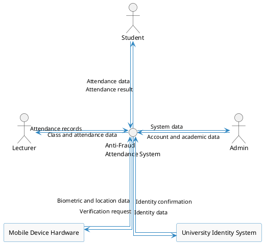
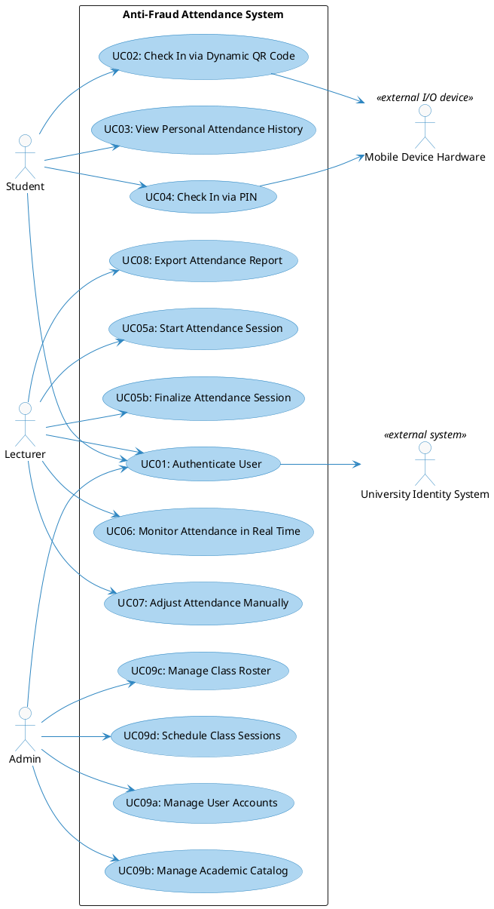
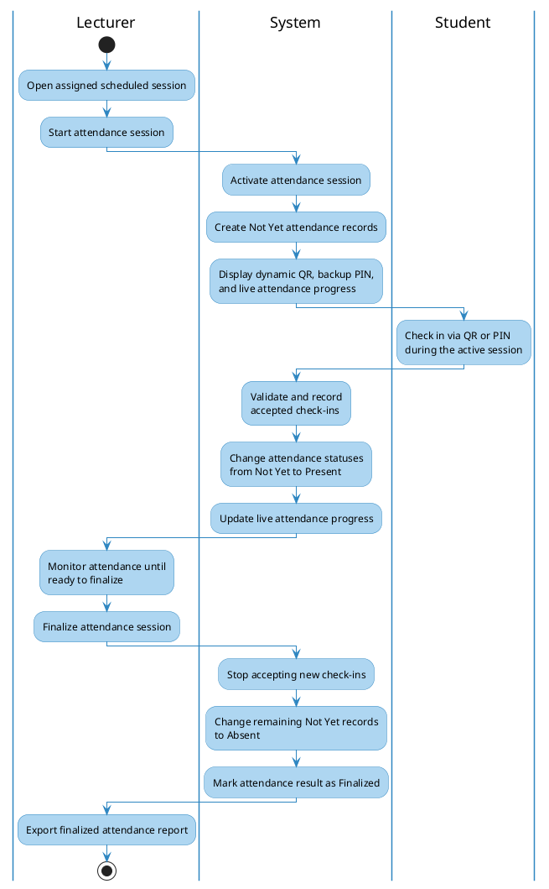

# **Requirement Specification**

## **Anti-Fraud Attendance System (AFAS)**

**Subject: SWD392**

**Version: 1.0**

- Hanoi, May 2026 -

---

## **Record of Changes**

| **Version** | **Date**   | **A/M/D*** | **In charge** | **Change Description**                                                                                                                                                                                                                                                                                                               |
| :---------- | :--------- | :--------- | :------------ | :----------------------------------------------------------------------------------------------------------------------------------------------------------------------------------------------------------------------------------------------------------------------------------------------------------------------------------- |
| V1.0        | 26/05/2026 | A          | SWD392 Team   | Initial release of Requirement Specification (Section I) for AFAS including Problem Description, Features, Context, NFRs, Use Cases, Activity Diagrams, and Data Dictionary.                                                                                                                                                         |
| V1.1        | 27/05/2026 | A          | SWD392 Team   | Added Analysis Models (Section II): Interaction Diagrams (Sequence & Communication) for UC01, UC03, UC05, UC06, UC07, UC08, UC11; State Diagrams for AttendanceVersion, AttendanceRecord, DeviceBinding; Static Analysis (Contextual Boundary Class Diagram, Object Structuring Criteria, UI Mockups).                               |
| V1.2        | 27/05/2026 | A          | SWD392 Team   | Added Design Specification (Section III): Integrated Communication Diagram, 3-View Architecture, Component/Package Diagrams, Detailed Class Design, Database Schema. Added Implementation Mapping (Section IV) and Verification/Testing (Section V).                                                                                 |
| V1.3        | 09/06/2026 | M          | SWD392 Team   | Added cross-phase traceability framework: source-to-feature matrix, business process model, anti-fraud rule catalog, missing dynamic analysis diagrams for UC02/UC04/UC09, analysis-to-design transformation matrices, NFR realization matrix, DB rule mappings, implementation traceability, and verification coverage matrix. |
| V1.4        | 13/07/2026 | M          | SWD392 Team   | Refined Requirement Modeling scope for SWD392: removed production-grade email/network evidence from MVP, simplified NFRs, renamed UC05 to Manage Attendance Session, added business rule catalog, requirement traceability matrix, and end-to-end activity diagram.                                                                  |
| V1.5        | 14/07/2026 | M          | SWD392 Team   | Added University Identity System as an external system for user authentication in Requirement Modeling.                                                                                                                                                                                                                              |

*\*A - Added, M - Modified, D - Deleted*

---

### **Contents**

*   [I. Requirement Specification](#i-requirement-specification)
    *   [I.1 Problem description](#i1-problem-description)
    *   [I.2 Major Features](#i2-major-features)
    *   [I.3 System context](#i3-system-context)
    *   [I.4 Non-functional Requirements](#i4-non-functional-requirements)
    *   [I.5 Functional requirements](#i5-functional-requirements)
        *   [I.5.1 Use case diagrams](#i51-use-case-diagrams)
        *   [I.5.2 Use case descriptions](#i52-use-case-descriptions)
        *   [I.5.3 Activity diagrams](#i53-activity-diagrams)
    *   [I.6 Business Rules](#i6-business-rules)
    *   [I.7 Requirement Traceability](#i7-requirement-traceability)

---

## **I. Requirement Specification**

## **I.1 Problem description**

**Purpose:** Automate the classroom attendance process and implement robust defense layers to prevent common attendance fraud, such as proxy check-ins (friends checking in for absent students) and sharing classroom QR codes with absent students off-campus. The system simulates a university environment of approximately 8,000 students.

The core requirements are described as follows:

1.  **Authentication:** Students, lecturers, and administrators must log into the system using their assigned university identity before performing role-specific actions. The identity is confirmed by the existing University Identity System.
2.  **Dynamic QR Code Attendance:** To prevent students from taking photos of the QR code and sharing it with absent peers, the lecturer starts an attendance session which displays a dynamic QR code on the projector screen. The QR attendance code refreshes every 10 seconds and is accepted only until the next refresh.
3.  **Location Capture (informational):** During check-in, the student's submitted location coordinates are captured and stored for lecturer review and reporting only. Location is never used to accept or reject a check-in, and a check-in still succeeds when location is unavailable.
4.  **Biometric Verification:** To reduce proxy check-ins, the student must complete biometric verification on the device before submitting attendance. If biometric verification is unavailable, the system allows a face selfie as attendance proof.
5.  **Device Evidence:** The student device identifier is recorded with each attendance attempt as supporting evidence. It is not used as a separate trusted-device or email-alert workflow in the MVP scope.
6.  **Attendance Session Management:** Lecturers can start a session and finalize the attendance result before reporting.
7.  **Real-time Monitoring:** As students successfully check in, the lecturer interface highlights their attendance status for live classroom monitoring.
8.  **Manual Adjustments:** On the scheduled session date, assigned lecturers can review attendance evidence and manually edit a student's official attendance status with a required reason.
9.  **Reporting:** Lecturers can export finalized attendance sheets to spreadsheet formats such as Excel.
10. **System Configurations:** Administrators manage users, subjects, and class sections.

---

## **I.2 Major Features**

The system comprises three main portals: Student Mobile App, Lecturer Web Portal, and Admin Web Portal.

### **Features for Students (Mobile & Web):**
*   **F01: Personal Authentication:** Login using the assigned university identity confirmed by the University Identity System.
*   **F02: Identity Verification:** Complete biometric verification, or capture a face selfie when biometric verification is unavailable.
*   **F03: Scan QR Code:** Open camera, verify student identity, scan the dynamic QR code, and submit device evidence together with location when available. Location is recorded for information only and is not required for the check-in to succeed.
*   **F04: Check In via PIN:** Enter the 6-digit PIN code displayed on the lecturer screen if the camera is broken. Device evidence and, when available, location are still recorded for information only.
*   **F05: View Attendance History:** Track present, late, and absent sessions with visual statistics.

### **Features for Lecturers (Web Portal):**
*   **F06: Class Section Management:** View assigned classes, schedule, and student rosters.
*   **F07: Manage Attendance Session:** Start the session, create initial `Not Yet` attendance records, display dynamic QR (10s refresh) and PIN (30s refresh), and finalize the result.
*   **F08: Real-time Attendance Monitor:** Track live check-in progress with color-coded student names.
*   **F09: Manual Adjustments:** Manually edit a student's official attendance status within the scheduled session date with a required reason.
*   **F10: Export Attendance Report:** Export attendance history sheets to spreadsheet formats such as Excel.

### **Features for Administrators (Web Portal):**
*   **F11: System Catalog Management:** Manage AFAS role profiles (Students, Lecturers), Subjects, and Class Sections.

## **I.3 System context**

The system context diagram shows the Anti-Fraud Attendance System (AFAS), its actors and external systems, and the data exchanged across the system boundary.

---

## **I.4 Non-functional Requirements**

*   **NF-01 Performance & Concurrency:**
    *   The attendance confirmation result must be shown within **< 2.0 seconds** for 95% of check-in attempts under a peak load of **500 - 1,000 concurrent students** within a 5-minute window.
    *   Live attendance monitor updates must appear on the lecturer's screen within **< 1.0 second** after the check-in is accepted.

*   **NF-02 Location Accuracy:**
    *   When location is available, the submitted coordinates and their accuracy estimate (typical location error **15 - 20 meters**) are stored for lecturer review only. Location is never used to accept or reject a check-in.

*   **NF-03 Usability:**
    *   System interfaces must be clear, readable, and usable on common mobile and desktop screens.

*   **NF-04 Security & Privacy:**
    *   Student authentication and attendance evidence must be protected from unauthorized access.
    *   Student face evidence captured during fallback checks must be protected and automatically removed after the semester ends.

*   **NF-05 Reliability & Availability:**
    *   If the attendance session cannot be continued due to network interruption, lecturers must be able to keep the session active until check-ins resume or perform manual adjustment with reason.

*   **NF-06 Maintainability:**
    *   QR refresh interval and PIN refresh interval must be configurable without changing source code.

*   **NF-07 Scalability:**
    *   The system must support approximately **8,000 students** while satisfying the peak classroom check-in metrics stated in NF-01.

## **I.5 Functional requirements**

### **I.5.1 Use case diagrams**

The functional requirements are summarized in one system-level use case diagram. All use cases are inside the AFAS system boundary.

#### **Overview Use Case Diagram**

**Note (V1.6):** UC05 (Manage Attendance Session) was split into **UC05a: Start Attendance Session** and **UC05b: Finalize Attendance Session** — the two lecturer-triggered actions had distinct triggers and postconditions, previously bundled under one lifecycle use case. UC09 (Manage System Catalog) was split into **UC09a: Manage User Accounts**, **UC09b: Manage Academic Catalog**, **UC09c: Manage Class Roster**, and **UC09d: Schedule Class Sessions** — the original UC09 description only covered accounts/subjects/class sections, but the Analysis Model had already grown to touch 7 entities (including class rosters and scheduled sessions) under one coordinator. UC09d also fills a pre-existing gap: the `Room` entity had data-dictionary fields but no owning use case.

---

### **I.5.2 Use case descriptions**

Below are the detailed descriptions for all **9 Use Cases** of the AFAS system:

#### **Table I-1: Use case description for UC01 - Authenticate User**
| **Field**              | **Description**                                                                                                                                                                                                                                                                                                                                                   |
| :--------------------- | :---------------------------------------------------------------------------------------------------------------------------------------------------------------------------------------------------------------------------------------------------------------------------------------------------------------------------------------------------------------- |
| **ID and Name:**       | **UC01: Authenticate User**                                                                                                                                                                                                                                                                                                                                       |
| **Created By:**        | SWD392 Team                                                                                                                                                                                                                                                                                                                                                       |
| **Primary Actor:**     | Student, Lecturer, Admin                                                                                                                                                                                                                                                                                                                                          |
| **Secondary Actor:**   | University Identity System                                                                                                                                                                                                                                                                                                                                        |
| **Description:**       | Allows any system user to authenticate and access the correct system area according to their role.                                                                                                                                                                                                                                                                |
| **Trigger:**           | The user opens the mobile application or visits the web portal.                                                                                                                                                                                                                                                                                                   |
| **Preconditions:**     | The user's university identity exists in the University Identity System, and the user's role profile exists in AFAS.                                                                                                                                                                                                                                              |
| **Postconditions:**    | **POST-1 Success:** User is authenticated, access to the correct portal is granted, and the user is redirected to their dashboard.  **POST-2 Failure:** Authentication fails and access is denied.                                                                                                                                                             |
| **Normal Flow:**       | 1. User selects login from the mobile application or web portal. 2. System asks the University Identity System to confirm the user's identity. 3. University Identity System confirms the user's identity. 4. System checks the user's AFAS role profile. 5. System grants access to the correct system area. 6. System shows the user's homepage. |
| **Alternative Flows:** | **A3.1 Identity support needed:** If the user cannot complete identity confirmation, the user follows the support instruction provided by the University Identity System.                                                                                                                                                                                         |
| **Exceptions:**        | **E3.1 Identity not confirmed:** If the University Identity System does not confirm the user identity, AFAS denies access. **E4.1 No AFAS role profile:** If the user's identity is confirmed but no matching AFAS role profile exists, AFAS denies access and informs the user that their role is not registered.                                             |
| **Priority:**          | High                                                                                                                                                                                                                                                                                                                                                              |
| **Business Rules:**    | BR-01                                                                                                                                                                                                                                                                                                                                                             |

---

#### **Table I-2: Use case description for UC02 - Check In via Dynamic QR Code**
| **Field**              | **Description**                                                                                                                                                                                                                                                                                                                                                                                                                                                                                                                                                                                                                                                                                                                                                                                                                                                                                                                                                                                                                                                                                                                                                                                                                                                   |
| :--------------------- | :------------------------------------------------------------------------------------------------------------------------------------------------------------------------------------------------------------------------------------------------------------------------------------------------------------------------------------------------------------------------------------------------------------------------------------------------------------------------------------------------------------------------------------------------------------------------------------------------------------------------------------------------------------------------------------------------------------------------------------------------------------------------------------------------------------------------------------------------------------------------------------------------------------------------------------------------------------------------------------------------------------------------------------------------------------------------------------------------------------------------------------------------------------------------------------------------------------------------------------------------ |
| **ID and Name:**       | **UC02: Check In via Dynamic QR Code**                                                                                                                                                                                                                                                                                                                                                                                                                                                                                                                                                                                                                                                                                                                                                                                                                                                                                                                                                                                                                                                                                                                                                                                                                            |
| **Created By:**        | SWD392 Team                                                                                                                                                                                                                                                                                                                                                                                                                                                                                                                                                                                                                                                                                                                                                                                                                                                                                                                                                                                                                                                                                                                                                                                                                                                       |
| **Primary Actor:**     | Student                                                                                                                                                                                                                                                                                                                                                                                                                                                                                                                                                                                                                                                                                                                                                                                                                                                                                                                                                                                                                                                                                                                                                                                                                                                           |
| **Secondary Actor:**   | Mobile Device Hardware                                                                                                                                                                                                                                                                                                                                                                                                                                                                                                                                                                                                                                                                                                                                                                                                                                                                                                                                                                                                                                                                                                                                                                                                                                            |
| **Description:**       | Student scans the active dynamic QR code on the projector screen and submits identity and device evidence, together with location when available, to record attendance. Location is captured for information only and is not required.                                                                                                                                                                                                                                                                                                                                                                                                                                                                                                                                                                                                                                                                                                                                                                                                                                                                                                                                                                                                                                                                                |
| **Trigger:**           | The student selects "Scan QR" from the dashboard.                                                                                                                                                                                                                                                                                                                                                                                                                                                                                                                                                                                                                                                                                                                                                                                                                                                                                                                                                                                                                                                                                                                                                                                                                 |
| **Preconditions:**     | - Student is logged in (UC01). - Dynamic QR session is active (UC05a).                                                                                                                                                                                                                                                                                                                                                                                                                                                                                                                                                                                                                                                                                                                                                                                                                                                                                                                                                                                                                                                                                                                               |
| **Postconditions:**    | **POST-1 Success:** The student's attendance record for the study session changes from `Not Yet` to `Present`, the accepted attempt and evidence are recorded, and the lecturer screen is updated in real time. **POST-2 Failure:** The rejected attempt and its reason are recorded for lecturer review, while the attendance status remains `Not Yet` unless another accepted check-in has already changed it.                                                                                                                                                                                                                                                                                                                                                                                                                                                                                                                                                                                                                                                                                                                                                                                                                                                                                                                                                    |
| **Normal Flow:**       | 1. Student selects "Scan QR Check-in". 2. App checks whether biometric verification is available on the device. 3. App requests biometric verification, and Student successfully completes it. 4. App opens the camera, and Student scans the displayed dynamic QR code. 5. App reads the attendance code and collects the device identifier and location, when available. 6. App submits the attendance code, biometric verification result, device identifier, and optional location to AFAS. 7. AFAS verifies that the attendance session is active, the QR code belongs to that session and has not expired, the student is enrolled in the session roster, and the attendance status is `Not Yet`. (See E7.1) 8. AFAS records the accepted attempt and submitted evidence, then atomically changes the attendance status from `Not Yet` to `Present`. 9. AFAS updates the Lecturer portal and returns a successful check-in result to the App. 10. App displays the successful check-in result. |
| **Alternative Flows:** | **A2.1 Biometric verification unavailable:** If biometric verification is not supported or unavailable on the device, App requests a face selfie. Student captures the selfie as fallback proof, then the flow continues at step 4. |
| **Exceptions:**        | **E3.1 Biometric verification failed or cancelled:** App displays the failure and stops the check-in. Selfie fallback is not used when an available biometric check fails or is cancelled. **E4.1 Selfie not captured:** In A2.1, if Student cannot or does not capture the required selfie, App stops the check-in. **E4.2 Camera or QR reading unavailable:** If the camera is unavailable, permission is denied, or the QR code cannot be read, App informs Student and offers PIN check-in through UC04. **E6.1 Submission failed:** If the request cannot reach AFAS, App reports the submission failure and does not show a successful check-in result. **E7.1 Check-in rejected:** If the attendance session is inactive or finalized, the QR code does not belong to the session or has expired, the student is not enrolled in the session roster, or attendance has already been recorded, AFAS records the rejected attempt and corresponding reason, returns that reason, and does not change the current attendance status. |
| **Priority:**          | High                                                                                                                                                                                                                                                                                                                                                                                                                                                                                                                                                                                                                                                                                                                                                                                                                                                                                                                                                                                                                                                                                                                                                                                                                                                              |
| **Business Rules:**    | BR-02, BR-03, BR-04, BR-05, BR-12                                                                                                                                                                                                                                                                                                                                                                                                                                                                                                                                                                                                                                                                                                                                                                                                                                                                                                                                                                                                                                                                                                                                                                                                            |

---

#### **Table I-3: Use case description for UC03 - View Personal Attendance History**
| **Field**              | **Description**                                                                                                                                                                                                                                                                                                                                            |
| :--------------------- | :--------------------------------------------------------------------------------------------------------------------------------------------------------------------------------------------------------------------------------------------------------------------------------------------------------------------------------------------------------- |
| **ID and Name:**       | **UC03: View Personal Attendance History**                                                                                                                                                                                                                                                                                                                 |
| **Created By:**        | SWD392 Team                                                                                                                                                                                                                                                                                                                                                |
| **Primary Actor:**     | Student                                                                                                                                                                                                                                                                                                                                                    |
| **Description:**       | Allows students to view a summary of their attendance record for all enrolled class sections, including total present, late, and absent days.                                                                                                                                                                                                              |
| **Trigger:**           | The student selects the "History" tab from the navigation bar.                                                                                                                                                                                                                                                                                             |
| **Preconditions:**     | Student is authenticated (UC01).                                                                                                                                                                                                                                                                                                                           |
| **Postconditions:**    | Student views their visual attendance stats.                                                                                                                                                                                                                                                                                                               |
| **Normal Flow:**       | 1. Student taps "History" tab. 2. App requests the attendance history from the system. 3. System retrieves all records linked to the student. 4. App displays a list of enrolled class sections. 5. Student selects a class section. 6. App renders a detailed calendar view showing days present (Green), late (Orange), and absent (Red). |
| **Alternative Flows:** | None.                                                                                                                                                                                                                                                                                                                                                      |
| **Exceptions:**        | **E3.1 System unavailable:** App informs the student that attendance history cannot be loaded and asks the student to try again later.                                                                                                                                                                                                                     |
| **Priority:**          | Medium                                                                                                                                                                                                                                                                                                                                                     |
| **Business Rules:**    | BR-01                                                                                                                                                                                                                                                                                                                                                      |

---

#### **Table I-4: Use case description for UC04 - Check In via PIN**
| **Field**              | **Description**                                                                                                                                                                                                                                                                                                                                                                                                                                                                                                                                                                                                                                                                                                                                                                                                                                                                                                                                                                                                                                                                                                                                                                                                           |
| :--------------------- | :------------------------------------------------------------------------------------------------------------------------------------------------------------------------------------------------------------------------------------------------------------------------------------------------------------------------------------------------------------------------------------------------------------------------------------------------------------------------------------------------------------------------------------------------------------------------------------------------------------------------------------------------------------------------------------------------------------------------------------------------------------------------------------------------------------------------------------------------------------------------------------------------------------------------------------------------------------------------------------------------------------------------------------------------------------------------------------------------------------------------------------------------------------------------------------------------------------------------ |
| **ID and Name:**       | **UC04: Check In via PIN**                                                                                                                                                                                                                                                                                                                                                                                                                                                                                                                                                                                                                                                                                                                                                                                                                                                                                                                                                                                                                                                                                                                                                                                                |
| **Created By:**        | SWD392 Team                                                                                                                                                                                                                                                                                                                                                                                                                                                                                                                                                                                                                                                                                                                                                                                                                                                                                                                                                                                                                                                                                                                                                                                                               |
| **Primary Actor:**     | Student                                                                                                                                                                                                                                                                                                                                                                                                                                                                                                                                                                                                                                                                                                                                                                                                                                                                                                                                                                                                                                                                                                                                                                                                                   |
| **Secondary Actor:**   | Mobile Device Hardware                                                                                                                                                                                                                                                                                                                                                                                                                                                                                                                                                                                                                                                                                                                                                                                                                                                                                                                                                                                                                                                                                                                                                                                                    |
| **Description:**       | Allows students to manually type a 6-digit dynamic PIN code displayed on the screen to check in if their device camera is broken or unable to scan, while still recording device evidence and location when available. Location is captured for information only and is not required.                                                                                                                                                                                                                                                                                                                                                                                                                                                                                                                                                                                                                                                                                                                                                                                                                                                                                                                                                                                                                   |
| **Trigger:**           | The student selects the "PIN Check-in" option on the App.                                                                                                                                                                                                                                                                                                                                                                                                                                                                                                                                                                                                                                                                                                                                                                                                                                                                                                                                                                                                                                                                                                                                                                 |
| **Preconditions:**     | - Student is logged in (UC01). - Dynamic QR/PIN session is active (UC05a).                                                                                                                                                                                                                                                                                                                                                                                                                                                                                                                                                                                                                                                                                                                                                                                                                                                                                                                                                                                                                                                                                                                   |
| **Postconditions:**    | **POST-1 Success:** The student's attendance record changes from `Not Yet` to `Present`, and the check-in evidence is recorded. **POST-2 Failure:** The PIN check-in is rejected and its reason is retained on the student's attendance record for lecturer review when relevant, while the attendance status remains `Not Yet` unless another accepted check-in has already changed it.                                                                                                                                                                                                                                                                                                                                                                                                                                                                                                                                                                                                                                                                                                                                                                                                                                                                                                                                                                                   |
| **Normal Flow:**       | 1. Student selects "PIN Check-in". 2. App requests biometric verification. 3. Student successfully completes biometric verification. 4. App displays the PIN input screen. 5. Student enters the displayed 6-digit PIN. 6. App collects the device identifier and location, when available. 7. App submits the PIN and check-in evidence to AFAS. 8. AFAS verifies the active attendance session, PIN validity, student eligibility, and current attendance status. (See E8.1) 9. AFAS records the accepted evidence and changes the attendance status from `Not Yet` to `Present`. 10. AFAS updates the Lecturer portal and returns a successful check-in result to the App. 11. App displays the successful check-in result. |
| **Alternative Flows:** | **A3.1 Biometric verification unavailable:** If biometric verification is not supported by the device, the student captures a face selfie as fallback proof, then the flow continues at step 4. |
| **Exceptions:**        | **E8.1 PIN check-in invalid:** If the attendance session is inactive, the PIN has expired, the student is not eligible for the session, or attendance has already been recorded, AFAS rejects the check-in and returns the corresponding reason. No new attendance result is created. |
| **Priority:**          | High                                                                                                                                                                                                                                                                                                                                                                                                                                                                                                                                                                                                                                                                                                                                                                                                                                                                                                                                                                                                                                                                                                                                                                                                                      |
| **Business Rules:**    | BR-02, BR-03, BR-04, BR-05, BR-07, BR-12                                                                                                                                                                                                                                                                                                                                                                                                                                                                                                                                                                                                                                                                                                                                                                                                                                                                                                                                                                                                                                                                                                                                                             |

---

#### **Table I-5a: Use case description for UC05a - Start Attendance Session**
| **Field**              | **Description**                                                                                                                                                                                                                                                                                                                                                                                                                                                                                                                                                                                                                                                                                                                                                                                                                                                                                                                                                                                                                                                                                                                                                                                            |
| :--------------------- | :--------------------------------------------------------------------------------------------------------------------------------------------------------------------------------------------------------------------------------------------------------------------------------------------------------------------------------------------------------------------------------------------------------------------------------------------------------------------------------------------------------------------------------------------------------------------------------------------------------------------------------------------------------------------------------------------------------------------------------------------------------------------------------------------------------------------------------------------------------------------------------------------------------------------------------------------------------------------------------------------------------------------------------------------------------------------------------------------------------------------------------------------------------------------------------------------------------- |
| **ID and Name:**       | **UC05a: Start Attendance Session**                                                                                                                                                                                                                                                                                                                                                                                                                                                                                                                                                                                                                                                                                                                                                                                                                                                                                                                                                                                                                                                                                                                                                                        |
| **Created By:**        | SWD392 Team                                                                                                                                                                                                                                                                                                                                                                                                                                                                                                                                                                                                                                                                                                                                                                                                                                                                                                                                                                                                                                                                                                                                                                                                |
| **Primary Actor:**     | Lecturer                                                                                                                                                                                                                                                                                                                                                                                                                                                                                                                                                                                                                                                                                                                                                                                                                                                                                                                                                                                                                                                                                                                                                                                                   |
| **Description:**       | Lecturer starts the attendance session for a scheduled class, activating the dynamic QR/PIN check-in codes for that session.                                                                                                                                                                                                                                                                                                                                                                                                                                                                                                                                                                                                                                                                                                                                                                                                                                                                                                                                                                                                                                   |
| **Trigger:**           | The lecturer selects a scheduled session and clicks "Start Attendance".                                                                                                                                                                                                                                                                                                                                                                                                                                                                                                                                                                                                                                                                                                                                                                                                                                                                                                                                                                                                                                                                                                                                    |
| **Preconditions:**     | Lecturer is logged in (UC01) and currently within the scheduled session time window.                                                                                                                                                                                                                                                                                                                                                                                                                                                                                                                                                                                                                                                                                                                                                                                                                                                                                                                                                                                                                                                                                                                       |
| **Postconditions:**    | **POST-1 Success:** The attendance session becomes `Active`, one `Not Yet` attendance record is created per enrolled student, and the dynamic QR/PIN codes begin refreshing. **POST-2 Failure:** The attendance session is not started, and an error is displayed.                                                                                                                                                                                                                                                                                                                                                                                                                                                                                                                                                                                                                                                                                                                                                                                                                                                                                                                                    |
| **Normal Flow:**       | 1. Lecturer navigates to "My Scheduled Classes" on Web Portal. 2. System displays assigned classes and scheduled sessions. 3. Lecturer selects the current session and clicks "Start Attendance". 4. System validates that the current time is within the session's scheduled window. 5. System marks the attendance session as active and creates one `Not Yet` attendance record for each enrolled student in the session roster. 6. System begins displaying a QR attendance code refreshed every 10 seconds and a PIN code refreshed every 30 seconds. 7. Web Portal displays the projector view with the dynamic QR code, PIN, and live attendance progress, ready to accept check-ins. |
| **Alternative Flows:** | None.                                                                                                                                                                                                                                                                                                                                                                                                                                                                                                                                                                                                                                                                                                                                                                                                                                                                                                                                                                                                                                                                                                                                                                                                       |
| **Exceptions:**        | **E4.1 Outside scheduled hours:** If lecturer tries to start session outside the class time slot, system denies activation. **E5.1 Session already active:** If the selected study session already has an active attendance session, system denies creating another active session.                                                                                                                                                                                                                                                                                                                                                                                                                                                                                                                                                                                                                                                                                                                                                                                                                                                                                                                     |
| **Priority:**          | High                                                                                                                                                                                                                                                                                                                                                                                                                                                                                                                                                                                                                                                                                                                                                                                                                                                                                                                                                                                                                                                                                                                                                                                                       |
| **Business Rules:**    | BR-02, BR-10, BR-12                                                                                                                                                                                                                                                                                                                                                                                                                                                                                                                                                                                                                                                                                                                                                                                                                                                                                                                                                                                                                                                                                                                                                                                        |

---

#### **Table I-5b: Use case description for UC05b - Finalize Attendance Session**
| **Field**              | **Description**                                                                                                                                                                                                                                                                                                                                                                                                                                                                                                                                                                                                                                                                                                                                                                                                                                                                                                                                                                                                                                                                                                                                                                                            |
| :--------------------- | :--------------------------------------------------------------------------------------------------------------------------------------------------------------------------------------------------------------------------------------------------------------------------------------------------------------------------------------------------------------------------------------------------------------------------------------------------------------------------------------------------------------------------------------------------------------------------------------------------------------------------------------------------------------------------------------------------------------------------------------------------------------------------------------------------------------------------------------------------------------------------------------------------------------------------------------------------------------------------------------------------------------------------------------------------------------------------------------------------------------------------------------------------------------------------------------------------------- |
| **ID and Name:**       | **UC05b: Finalize Attendance Session**                                                                                                                                                                                                                                                                                                                                                                                                                                                                                                                                                                                                                                                                                                                                                                                                                                                                                                                                                                                                                                                                                                                                                                     |
| **Created By:**        | SWD392 Team                                                                                                                                                                                                                                                                                                                                                                                                                                                                                                                                                                                                                                                                                                                                                                                                                                                                                                                                                                                                                                                                                                                                                                                                |
| **Primary Actor:**     | Lecturer                                                                                                                                                                                                                                                                                                                                                                                                                                                                                                                                                                                                                                                                                                                                                                                                                                                                                                                                                                                                                                                                                                                                                                                                   |
| **Description:**       | Lecturer ends the active attendance session, locking the official result and assigning `Absent` to any student who has not checked in.                                                                                                                                                                                                                                                                                                                                                                                                                                                                                                                                                                                                                                                                                                                                                                                                                                                                                                                                                                                                                         |
| **Trigger:**           | The lecturer clicks "Finalize Attendance" on an active attendance session.                                                                                                                                                                                                                                                                                                                                                                                                                                                                                                                                                                                                                                                                                                                                                                                                                                                                                                                                                                                                                                                                                                                                 |
| **Preconditions:**     | Lecturer is logged in (UC01), is assigned to the session, and the attendance session is currently `Active` (started via UC05a).                                                                                                                                                                                                                                                                                                                                                                                                                                                                                                                                                                                                                                                                                                                                                                                                                                                                                                                                                                                                                                                                           |
| **Postconditions:**    | **POST-1 Success:** Attendance result is finalized and ready for report export (UC08) or manual adjustment (UC07). **POST-2 Failure:** The finalize action is not completed, and an error is displayed.                                                                                                                                                                                                                                                                                                                                                                                                                                                                                                                                                                                                                                                                                                                                                                                                                                                                                                                                                                                                |
| **Normal Flow:**       | 1. Lecturer reviews the live attendance progress for the active session. 2. Students' accepted QR or PIN check-ins appear as `Present` while unchecked students remain `Not Yet`. 3. Lecturer clicks "Finalize Attendance". 4. System stops accepting new QR and PIN check-ins. 5. System changes all remaining `Not Yet` records to `Absent`. 6. System marks the attendance result as finalized and closes the projector view. |
| **Alternative Flows:** | None. Manual edits to individual attendance records are handled by UC07 and are limited to the scheduled session date, regardless of whether the session has been finalized.                                                                                                                                                                                                                                                                                                                                                                                                                                                                                                                                                                                                                                                                                                                                                                                                                                                                                                                                                                                                                                     |
| **Exceptions:**        | None.                                                                                                                                                                                                                                                                                                                                                                                                                                                                                                                                                                                                                                                                                                                                                                                                                                                                                                                                                                                                                                                                                                                                                                                                       |
| **Priority:**          | High                                                                                                                                                                                                                                                                                                                                                                                                                                                                                                                                                                                                                                                                                                                                                                                                                                                                                                                                                                                                                                                                                                                                                                                                       |
| **Business Rules:**    | BR-08, BR-10, BR-12                                                                                                                                                                                                                                                                                                                                                                                                                                                                                                                                                                                                                                                                                                                                                                                                                                                                                                                                                                                                                                                                                                                                                                                        |

---

#### **Table I-6: Use case description for UC06 - Monitor Attendance in Real Time**
| **Field**              | **Description**                                                                                                                                                                                                                                                                                                                                                                                                                                                                   |
| :--------------------- | :-------------------------------------------------------------------------------------------------------------------------------------------------------------------------------------------------------------------------------------------------------------------------------------------------------------------------------------------------------------------------------------------------------------------------------------------------------------------------------- |
| **ID and Name:**       | **UC06: Monitor Attendance in Real Time**                                                                                                                                                                                                                                                                                                                                                                                                                                         |
| **Created By:**        | SWD392 Team                                                                                                                                                                                                                                                                                                                                                                                                                                                                       |
| **Primary Actor:**     | Lecturer                                                                                                                                                                                                                                                                                                                                                                                                                                                                          |
| **Description:**       | Lecturer monitors the check-in progress on a live grid where student names turn green in real-time as they successfully scan the QR.                                                                                                                                                                                                                                                                                                                                              |
| **Trigger:**           | The lecturer opens the live attendance monitor for an active attendance session.                                                                                                                                                                                                                                                                                                                                                                                                  |
| **Preconditions:**     | Attendance session must be active.                                                                                                                                                                                                                                                                                                                                                                                                                                                |
| **Postconditions:**    | Lecturer has real-time visualization of class attendance.                                                                                                                                                                                                                                                                                                                                                                                                                         |
| **Normal Flow:**       | 1. Lecturer opens the attendance monitor for the active session. 2. System displays all enrolled students and their current attendance statuses. 3. System receives an accepted QR or PIN check-in. 4. System updates the student's displayed attendance status from `Not Yet` to `Present`. 5. Web Portal changes the student's tile to green (`Present`). 6. System updates the attendance count dynamically. |
| **Alternative Flows:** | None.                                                                                                                                                                                                                                                                                                                                                                                                                                                                             |
| **Exceptions:**        | **E5.1 Connection Interrupted:** If live updates are interrupted, Web Portal displays a warning and allows the lecturer to refresh the monitor.                                                                                                                                                                                                                                                                                                                                   |
| **Priority:**          | High                                                                                                                                                                                                                                                                                                                                                                                                                                                                              |
| **Business Rules:**    | None. See NF-01 for real-time update performance.                                                                                                                                                                                                                                                                                                                                                                                                                                 |

---

#### **Table I-7: Use case description for UC07 - Adjust Attendance Manually**
| **Field**              | **Description**                                                                                                                                                                                                                                                                                                                                                                                                                                                                                                                                                                                                                                                                                                    |
| :--------------------- | :----------------------------------------------------------------------------------------------------------------------------------------------------------------------------------------------------------------------------------------------------------------------------------------------------------------------------------------------------------------------------------------------------------------------------------------------------------------------------------------------------------------------------------------------------------------------------------------------------------------------------------------------------------------------------------------------------------------- |
| **ID and Name:**       | **UC07: Adjust Attendance Manually**                                                                                                                                                                                                                                                                                                                                                                                                                                                                                                                                                                                                                                                                               |
| **Created By:**        | SWD392 Team                                                                                                                                                                                                                                                                                                                                                                                                                                                                                                                                                                                                                                                                                                        |
| **Primary Actor:**     | Lecturer                                                                                                                                                                                                                                                                                                                                                                                                                                                                                                                                                                                                                                                                                                           |
| **Description:**       | Allows the assigned lecturer to manually edit a student's official attendance status on the scheduled session date when there is a legitimate reason.                                                                                                                                                                                                                                                                                                                                                                                                                                                                                                                                                                            |
| **Trigger:**           | Lecturer selects a student from the attendance roster and clicks "Edit Attendance".                                                                                                                                                                                                                                                                                                                                                                                                                                                                                                                                                                                                                                          |
| **Preconditions:**     | Lecturer is authenticated (UC01), the lecturer is assigned to the session, the current date is the scheduled session date, and the target student belongs to the session roster.                                                                                                                                                                                                                                                                                                                                                                                                                                                                                                                                                 |
| **Postconditions:**    | Student official attendance status is updated, and the adjustment reason is saved.                                                                                                                                                                                                                                                                                                                                                                                                                                                                                                                                                                                                                                                                           |
| **Normal Flow:**       | 1. Lecturer opens the attendance roster for the scheduled session. 2. Lecturer selects a student record and clicks "Edit Attendance". 3. System displays the current status, evidence summary, latest rejection reason if any, available status choices, and a required reason field. 4. Lecturer selects the corrected status and enters the adjustment reason. 5. Lecturer clicks "Save". 6. System updates the student's official attendance status and saves the reason. |
| **Alternative Flows:** | None.                                                                                                                                                                                                                                                                                                                                                                                                                                                                                                                                                                                                                                                                                                              |
| **Exceptions:**        | **E5.1 Missing reason:** If the lecturer saves without inputting a reason, the system prompts them to write a reason before saving. **E5.2 Outside session date:** If the current date is not the scheduled session date, the system rejects the manual edit. **E5.3 Unauthorized or invalid roster target:** If the lecturer is not assigned to the session or the selected student is not in the session roster, the system rejects the manual edit.                                                                                                                                                                                                                                                                                                                                                                         |
| **Priority:**          | High                                                                                                                                                                                                                                                                                                                                                                                                                                                                                                                                                                                                                                                                                                               |
| **Business Rules:**    | BR-10, BR-13                                                                                                                                                                                                                                                                                                                                                                                                                                                                                                                                                                                                                                                                                                              |

---

#### **Table I-8: Use case description for UC08 - Export Attendance Report**
| **Field**              | **Description**                                                                                                                                                                                                                                                                                                                                                                                                                                          |
| :--------------------- | :------------------------------------------------------------------------------------------------------------------------------------------------------------------------------------------------------------------------------------------------------------------------------------------------------------------------------------------------------------------------------------------------------------------------------------------------------- |
| **ID and Name:**       | **UC08: Export Attendance Report**                                                                                                                                                                                                                                                                                                                                                                                                                       |
| **Created By:**        | SWD392 Team                                                                                                                                                                                                                                                                                                                                                                                                                                              |
| **Primary Actor:**     | Lecturer                                                                                                                                                                                                                                                                                                                                                                                                                                                 |
| **Description:**       | Exports the attendance statistics sheet for a specific class section or semester into spreadsheet formats such as Excel for grading and academic records.                                                                                                                                                                                                                                                                                                |
| **Trigger:**           | The lecturer clicks the "Export Report" button on the class details screen.                                                                                                                                                                                                                                                                                                                                                                              |
| **Preconditions:**     | Lecturer is logged in (UC01), and attendance results to be exported are finalized.                                                                                                                                                                                                                                                                                                                                                                       |
| **Postconditions:**    | Attendance report file is downloaded to the lecturer's local computer.                                                                                                                                                                                                                                                                                                                                                                                   |
| **Normal Flow:**       | 1. Lecturer navigates to class detail view. 2. Lecturer clicks "Export Report". 3. System compiles all session records of that class from the class rosters and student history. 4. System prepares report content containing student info, date of sessions, check-in mode, warnings, rejection reasons, and aggregate attendance percentage. 5. System generates the attendance report file. 6. Lecturer saves the report file locally. |
| **Alternative Flows:** | None.                                                                                                                                                                                                                                                                                                                                                                                                                                                    |
| **Exceptions:**        | **E3.1 No records exist:** If no attendance sessions have been run for the class, system displays an empty-state message and disables the export button.                                                                                                                                                                                                                                                                                                 |
| **Priority:**          | Medium                                                                                                                                                                                                                                                                                                                                                                                                                                                   |
| **Business Rules:**    | BR-08                                                                                                                                                                                                                                                                                                                                                                                                                                                    |

---

#### **Table I-9a: Use case description for UC09a - Manage User Accounts**
| **Field**              | **Description**                                                                                                                                                                                                                                                  |
| :--------------------- | :--------------------------------------------------------------------------------------------------------------------------------------------------------------------------------------------------------------------------------------------------------------|
| **ID and Name:**       | **UC09a: Manage User Accounts**                                                                                                                                                                                                                                  |
| **Created By:**        | SWD392 Team                                                                                                                                                                                                                                                      |
| **Primary Actor:**     | Admin                                                                                                                                                                                                                                                            |
| **Description:**       | Allows administrative staff to create, update, or delete AFAS user account/role profiles for Students and Lecturers, individually or through batch import.                                                                                                     |
| **Trigger:**           | Admin clicks "Students" or "Lecturers" in the Admin Portal menu.                                                                                                                                                                                                 |
| **Preconditions:**     | Admin is logged in (UC01).                                                                                                                                                                                                                                      |
| **Postconditions:**    | Account, Student, or Lecturer records are updated in the system.                                                                                                                                                                                                |
| **Normal Flow:**       | 1. Admin opens the "Students" or "Lecturers" menu. 2. System displays a grid with search/add/edit/delete actions. 3. Admin inputs new account details (university identity code, full name, email, role) and submits. 4. System validates the input and records the new account and role profile. |
| **Alternative Flows:** | **A4.1 Batch Import:** Admin uploads a structured data file containing student/lecturer records. System parses the file, validates the data, and imports the new records into the system.                                                                       |
| **Exceptions:**        | **E5.1 Duplicate ID:** If Admin attempts to add an identifier that already exists, system displays a validation error: "ID already exists".                                                                                                                    |
| **Priority:**          | High                                                                                                                                                                                                                                                             |
| **Business Rules:**    | BR-01, BR-11                                                                                                                                                                                                                                                     |

---

#### **Table I-9b: Use case description for UC09b - Manage Academic Catalog**
| **Field**              | **Description**                                                                                                                                                                                                                                                  |
| :--------------------- | :--------------------------------------------------------------------------------------------------------------------------------------------------------------------------------------------------------------------------------------------------------------|
| **ID and Name:**       | **UC09b: Manage Academic Catalog**                                                                                                                                                                                                                                |
| **Created By:**        | SWD392 Team                                                                                                                                                                                                                                                      |
| **Primary Actor:**     | Admin                                                                                                                                                                                                                                                            |
| **Description:**       | Allows administrative staff to create, update, or delete Subject and Class Section catalog records. Each Class Section references an existing Subject and an assigned Lecturer.                                                                                |
| **Trigger:**           | Admin clicks "Subjects" or "Class Sections" in the Admin Portal menu.                                                                                                                                                                                            |
| **Preconditions:**     | Admin is logged in (UC01). For a Class Section, the referenced Subject and Lecturer must already exist (UC09a).                                                                                                                                                 |
| **Postconditions:**    | Subject or ClassSection records are updated in the system.                                                                                                                                                                                                      |
| **Normal Flow:**       | 1. Admin opens the "Subjects" or "Class Sections" menu. 2. System displays a grid with search/add/edit/delete actions. 3. Admin inputs catalog details (subject code/name/credits, or class section id/subject/lecturer/semester) and submits. 4. System validates the input and references, and records the change. |
| **Alternative Flows:** | **A4.1 Batch Import:** Admin uploads a structured data file containing subject/class section records. System parses the file, validates the data, and imports the new records into the system.                                                                 |
| **Exceptions:**        | **E5.1 Duplicate ID:** If Admin attempts to add an identifier that already exists, system displays a validation error: "ID already exists". **E5.2 Invalid reference:** If the referenced Subject or Lecturer does not exist, system rejects the change.    |
| **Priority:**          | High                                                                                                                                                                                                                                                             |
| **Business Rules:**    | BR-11                                                                                                                                                                                                                                                            |

---

#### **Table I-9c: Use case description for UC09c - Manage Class Roster**
| **Field**              | **Description**                                                                                                                                                                                                                                                  |
| :--------------------- | :--------------------------------------------------------------------------------------------------------------------------------------------------------------------------------------------------------------------------------------------------------------|
| **ID and Name:**       | **UC09c: Manage Class Roster**                                                                                                                                                                                                                                   |
| **Created By:**        | SWD392 Team                                                                                                                                                                                                                                                      |
| **Primary Actor:**     | Admin                                                                                                                                                                                                                                                            |
| **Description:**       | Allows administrative staff to enroll or remove students from a class section's roster, enabling the class section for attendance check-in, monitoring, and reporting.                                                                                        |
| **Trigger:**           | Admin opens the roster tab of a class section.                                                                                                                                                                                                                  |
| **Preconditions:**     | Admin is logged in (UC01). The class section (UC09b) and the target student (UC09a) already exist.                                                                                                                                                             |
| **Postconditions:**    | The class section roster is updated; enrolled students become eligible for UC02, UC03, UC04, UC05a, UC06, and UC08 within that class section.                                                                                                                   |
| **Normal Flow:**       | 1. Admin opens the roster tab for a class section. 2. System displays currently enrolled students with add/remove actions. 3. Admin selects a student to enroll and submits, or selects an enrolled student to remove. 4. System validates the student, class section, and enrollment status, then records the roster change. |
| **Alternative Flows:** | **A3.1 Batch Import:** Admin uploads a roster file listing student-to-class-section assignments. System parses the file, validates the entries, and imports the valid roster records.                                                                          |
| **Exceptions:**        | **E4.1 Invalid roster entry:** If the student or class section does not exist, or the student is already enrolled in the class section, System rejects the change and returns the corresponding reason. |
| **Priority:**          | Medium                                                                                                                                                                                                                                                           |
| **Business Rules:**    | BR-14 |

---

#### **Table I-9d: Use case description for UC09d - Schedule Class Sessions**
| **Field**              | **Description**                                                                                                                                                                                                                                                  |
| :--------------------- | :--------------------------------------------------------------------------------------------------------------------------------------------------------------------------------------------------------------------------------------------------------------|
| **ID and Name:**       | **UC09d: Schedule Class Sessions**                                                                                                                                                                                                                                |
| **Created By:**        | SWD392 Team                                                                                                                                                                                                                                                      |
| **Primary Actor:**     | Admin                                                                                                                                                                                                                                                            |
| **Description:**       | Allows administrative staff to create, update, or delete scheduled class meeting sessions (date, start/end time, room) for a class section, and to maintain the physical Room catalog (room code, display name, and reference geo-coordinates) used as the session location. |
| **Trigger:**           | Admin clicks "Sessions" or "Rooms" in the Admin Portal menu.                                                                                                                                                                                                     |
| **Preconditions:**     | Admin is logged in (UC01). For a Session, the referenced Class Section (UC09b) and Room must already exist.                                                                                                                                                     |
| **Postconditions:**    | Session or Room records are updated; scheduled sessions become available for UC05a (Start Attendance Session).                                                                                                                                                  |
| **Normal Flow:**       | 1. Admin opens the "Sessions" or "Rooms" menu. 2. System displays a grid with search/add/edit/delete actions. 3. Admin inputs session details (class section, room, date, start/end time) or room details (room code, name, latitude/longitude) and submits. 4. System validates the input, references, and session time range, then records the change. |
| **Alternative Flows:** | **A4.1 Batch Import:** Admin uploads a structured data file containing session or room records. System parses the file, validates the data, and imports the new records into the system.                                                                       |
| **Exceptions:**        | **E4.1 Invalid session:** If the referenced class section or room does not exist, or the start time is not earlier than the end time, System rejects the change and returns the corresponding reason. |
| **Priority:**          | Medium                                                                                                                                                                                                                                                           |
| **Business Rules:**    | BR-15 |

---

### **I.5.3 Activity diagrams**

The following activity diagram presents the happy-path, end-to-end attendance process across the related use cases. Detailed normal, alternative, and exception flows are specified in the corresponding use case descriptions.

#### **Figure I-11: Overall activity diagram for attendance process**

---

## **I.6 Business Rules**

The following business rules use stable IDs so that later Analysis, Design, and Test artifacts can reference the same rule without ambiguity.

| **ID**    | **Business Rule**                                                                                                                                                                                                      |
| :-------- | :--------------------------------------------------------------------------------------------------------------------------------------------------------------------------------------------------------------------- |
| **BR-01** | All users must have their identity confirmed by the University Identity System before accessing role-specific functions, and users can access only data/actions allowed by their AFAS role.                            |
| **BR-02** | QR attendance code changes every 10 seconds and is accepted only until the next refresh. The backup PIN changes every 30 seconds.                                                  |
| **BR-03** | The submitted location coordinates are captured and stored for lecturer review and reporting only; location never causes a rejection, and a check-in still succeeds when location is unavailable.                                                |
| **BR-04** | A student must complete biometric verification before submitting attendance; if unavailable, a face selfie can be used only as attendance proof, viewed only by authorized users, and removed after the semester ends. |
| **BR-05** | The student device identifier is recorded with each attendance attempt as supporting evidence.                                                                                                                         |
| **BR-07** | PIN check-in is only a fallback when QR scanning is unavailable or impractical, and it must still satisfy identity and device evidence rules. Location is captured for information only, the same as QR check-in.                                                               |
| **BR-08** | Attendance reports must be exported from finalized attendance results.                                                                                                                                                 |
| **BR-10** | Each study session can have at most one active attendance session, and only the assigned lecturer can manage it.                                                                                                       |
| **BR-11** | Catalog identifiers, including student identifiers and class section identifiers, must be unique across the system.                                                                                                    |
| **BR-12** | Time checks for QR validity and PIN validity use the official system time.                                                                                                                               |
| **BR-13** | Manual attendance edits are allowed only on the scheduled session date, only by the assigned lecturer, and require a lecturer-provided reason.                                                                                |
| **BR-14** | A class roster entry must reference an existing student and class section, and a student may be enrolled at most once in the same class section. |
| **BR-15** | A scheduled session must reference an existing class section and room, and its start time must be earlier than its end time. |

---

## **I.7 Requirement Traceability**

| **Source Requirement**             | **Feature(s)** | **Use Case(s)**  | **Business Rule(s)** |
| :--------------------------------- | :------------- | :--------------- | :------------------- |
| Dynamic QR attendance              | F03, F07       | UC02, UC05a      | BR-02, BR-12         |
| Same-day manual adjustment         | F09            | UC07             | BR-13                |
| Location reference capture         | F03, F04       | UC02, UC04       | BR-03                |
| Biometric or selfie verification   | F02, F03, F04  | UC02, UC04       | BR-04                |
| Device ID evidence                 | F03, F04       | UC02, UC04       | BR-05                |
| Real-time lecturer monitoring      | F08            | UC06             | NF-01                |
| Manual adjustment and finalization | F07, F09       | UC05b, UC07       | BR-08, BR-10         |
| Excel/spreadsheet export           | F10            | UC08             | BR-08                |
| System catalog management          | F11            | UC09a, UC09b     | BR-11                |
| Class roster management            | F11            | UC09c            | BR-14                |
| Class session scheduling           | F11            | UC09d            | BR-15                |
