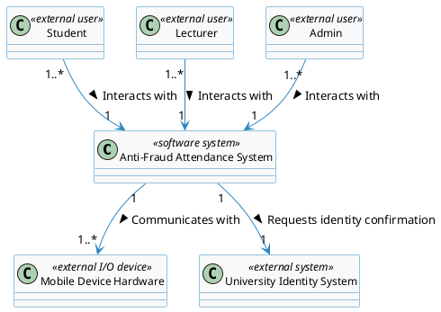
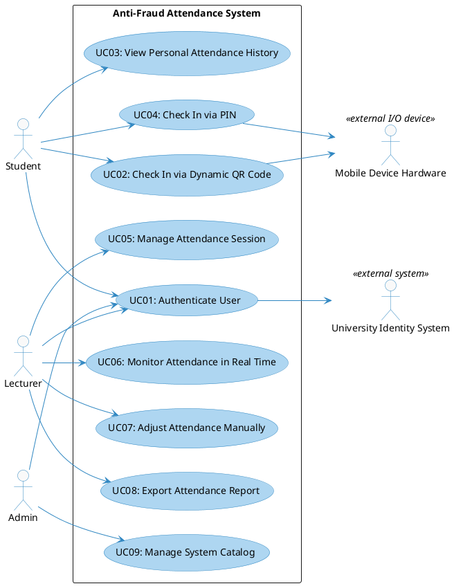
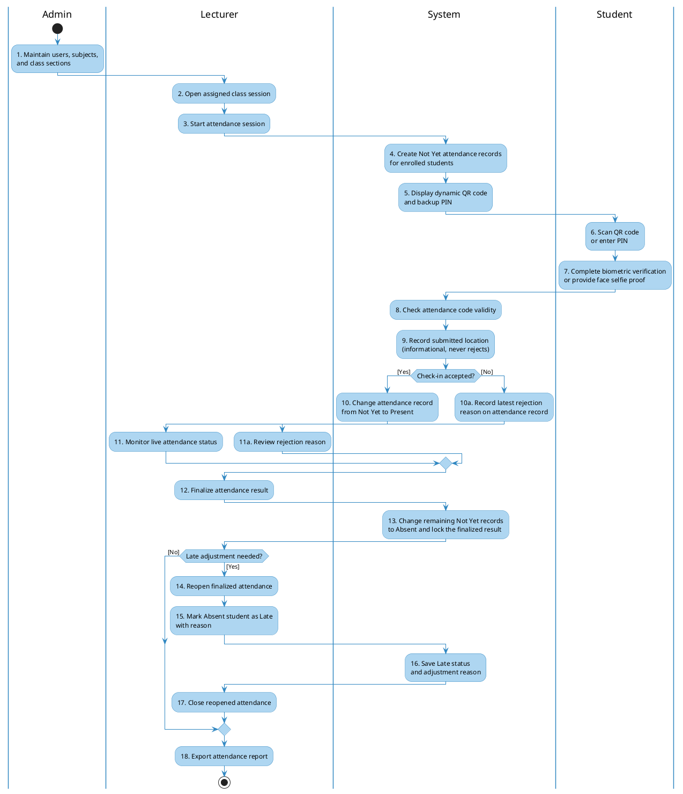
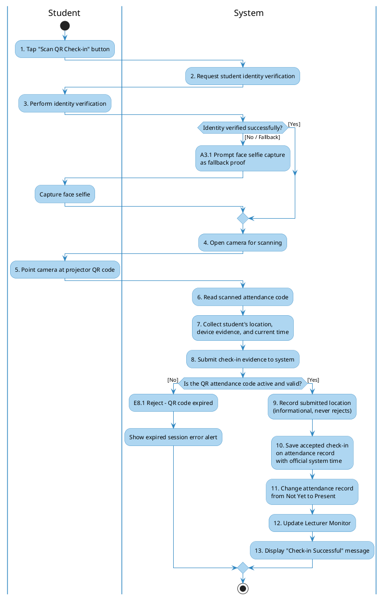
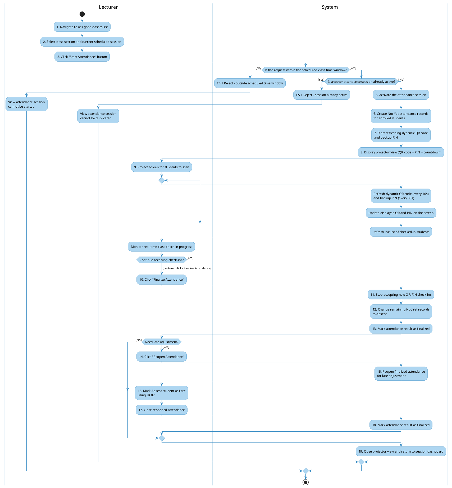
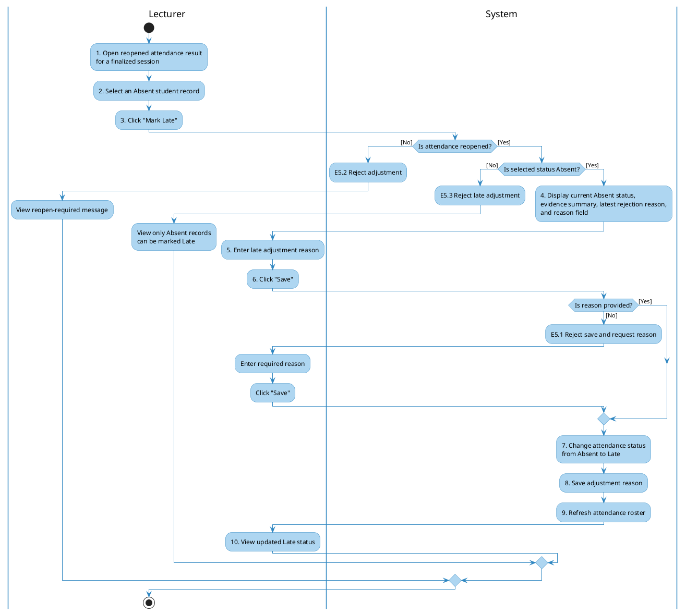

# **Requirement Specification**

## **Anti-Fraud Attendance System (AFAS)**

**Subject: SWD392**

**Version: 1.0**

- Hanoi, May 2026 -

---

## **Record of Changes**

| **Version** | **Date**   | **A/M/D*** | **In charge** | **Change Description**                                                                                                                                                                                                                                                                                                               |
| :---------- | :--------- | :--------- | :------------ | :----------------------------------------------------------------------------------------------------------------------------------------------------------------------------------------------------------------------------------------------------------------------------------------------------------------------------------- |
| V1.0        | 26/05/2026 | A          | SWD392 Team   | Initial release of Requirement Specification (Section I) for AFAS including Problem Description, Features, Context, NFRs, Use Cases, Activity Diagrams, and Data Dictionary.                                                                                                                                                         |
| V1.1        | 27/05/2026 | A          | SWD392 Team   | Added Analysis Models (Section II): Interaction Diagrams (Sequence & Communication) for UC01, UC03, UC05, UC06, UC07, UC08, UC11; State Diagrams for AttendanceVersion, AttendanceRecord, DeviceBinding; Static Analysis (Contextual Boundary Class Diagram, Object Structuring Criteria, UI Mockups).                               |
| V1.2        | 27/05/2026 | A          | SWD392 Team   | Added Design Specification (Section III): Integrated Communication Diagram, 3-View Architecture, Component/Package Diagrams, Detailed Class Design, Database Schema. Added Implementation Mapping (Section IV) and Verification/Testing (Section V).                                                                                 |
| V1.3        | 09/06/2026 | M          | SWD392 Team   | Added cross-phase traceability framework: source-to-feature matrix, business process model, anti-fraud rule catalog, missing dynamic analysis diagrams for UC02/UC04/UC09, analysis-to-design transformation matrices, NFR realization matrix, DB rule mappings, implementation traceability, and verification coverage matrix. |
| V1.4        | 13/07/2026 | M          | SWD392 Team   | Refined Requirement Modeling scope for SWD392: removed production-grade email/network evidence from MVP, simplified NFRs, renamed UC05 to Manage Attendance Session, added business rule catalog, requirement traceability matrix, and end-to-end activity diagram.                                                                  |
| V1.5        | 14/07/2026 | M          | SWD392 Team   | Added University Identity System as an external system for user authentication in Requirement Modeling.                                                                                                                                                                                                                              |

*\*A - Added, M - Modified, D - Deleted*

---

### **Contents**

*   [I. Requirement Specification](#i-requirement-specification)
    *   [I.1 Problem description](#i1-problem-description)
    *   [I.2 Major Features](#i2-major-features)
    *   [I.3 System context](#i3-system-context)
    *   [I.4 Non-functional Requirements](#i4-non-functional-requirements)
    *   [I.5 Functional requirements](#i5-functional-requirements)
        *   [I.5.1 Use case diagrams](#i51-use-case-diagrams)
        *   [I.5.2 Use case descriptions](#i52-use-case-descriptions)
        *   [I.5.3 Activity diagrams](#i53-activity-diagrams)
    *   [I.6 Business Rules](#i6-business-rules)
    *   [I.7 Requirement Traceability](#i7-requirement-traceability)
    *   [I.8 Data Requirements](#i8-data-requirements)

---

## **I. Requirement Specification**

## **I.1 Problem description**

**Purpose:** Automate the classroom attendance process and implement robust defense layers to prevent common attendance fraud, such as proxy check-ins (friends checking in for absent students) and sharing classroom QR codes with absent students off-campus. The system simulates a university environment of approximately 8,000 students.

The core requirements are described as follows:

1.  **Authentication:** Students, lecturers, and administrators must log into the system using their assigned university identity before performing role-specific actions. The identity is confirmed by the existing University Identity System.
2.  **Dynamic QR Code Attendance:** To prevent students from taking photos of the QR code and sharing it with absent peers, the lecturer starts an attendance session which displays a dynamic QR code on the projector screen. The QR attendance code refreshes every 10 seconds and is accepted only until the next refresh.
3.  **Location Capture (informational):** During check-in, the student's submitted location coordinates are captured and stored for lecturer review and reporting only. Location is never used to accept or reject a check-in, and a check-in still succeeds when location is unavailable.
4.  **Biometric Verification:** To reduce proxy check-ins, the student must complete biometric verification on the device before submitting attendance. If biometric verification is unavailable, the system allows a face selfie as attendance proof.
5.  **Device Evidence:** The student device identifier is recorded with each attendance attempt as supporting evidence. It is not used as a separate trusted-device or email-alert workflow in the MVP scope.
6.  **Attendance Session Management:** Lecturers can start a session and finalize the attendance result before reporting.
7.  **Real-time Monitoring:** As students successfully check in, the lecturer interface highlights their attendance status for live classroom monitoring.
8.  **Manual Adjustments:** After finalization, lecturers can reopen the attendance result, review evidence, and mark an absent student as late when there is a legitimate reason.
9.  **Reporting:** Lecturers can export finalized attendance sheets to spreadsheet formats such as Excel.
10. **System Configurations:** Administrators manage users, subjects, and class sections.

---

## **I.2 Major Features**

The system comprises three main portals: Student Mobile App, Lecturer Web Portal, and Admin Web Portal.

### **Features for Students (Mobile & Web):**
*   **F01: Personal Authentication:** Login using the assigned university identity confirmed by the University Identity System.
*   **F02: Identity Verification:** Complete biometric verification, or capture a face selfie when biometric verification is unavailable.
*   **F03: Scan QR Code:** Open camera, verify student identity, scan the dynamic QR code, and submit device evidence together with location when available. Location is recorded for information only and is not required for the check-in to succeed.
*   **F04: Check In via PIN:** Enter the 6-digit PIN code displayed on the lecturer screen if the camera is broken. Device evidence and, when available, location are still recorded for information only.
*   **F05: View Attendance History:** Track present, late, and absent sessions with visual statistics.

### **Features for Lecturers (Web Portal):**
*   **F06: Class Section Management:** View assigned classes, schedule, and student rosters.
*   **F07: Manage Attendance Session:** Start the session, create initial `Not Yet` attendance records, display dynamic QR (10s refresh) and PIN (30s refresh), finalize the result, and reopen finalized attendance for late adjustment when needed.
*   **F08: Real-time Attendance Monitor:** Track live check-in progress with color-coded student names.
*   **F09: Manual Adjustments:** After attendance is reopened, manually mark an `Absent` student as `Late` with a required reason.
*   **F10: Export Attendance Report:** Export attendance history sheets to spreadsheet formats such as Excel.

### **Features for Administrators (Web Portal):**
*   **F11: System Catalog Management:** Manage AFAS role profiles (Students, Lecturers), Subjects, and Class Sections.

## **I.3 System context**

The system context diagram models the boundary between the Anti-Fraud Attendance System (AFAS) and the external actors or devices involved in the attendance process.

---

## **I.4 Non-functional Requirements**

*   **NF-01 Performance & Concurrency:**
    *   The attendance confirmation result must be shown within **< 2.0 seconds** for 95% of check-in attempts under a peak load of **500 - 1,000 concurrent students** within a 5-minute window.
    *   Live attendance monitor updates must appear on the lecturer's screen within **< 1.0 second** after the check-in is accepted.

*   **NF-02 Location Accuracy:**
    *   When location is available, the submitted coordinates and their accuracy estimate (typical location error **15 - 20 meters**) are stored for lecturer review only. Location is never used to accept or reject a check-in.

*   **NF-03 Usability:**
    *   System interfaces must be clear, readable, and usable on common mobile and desktop screens.

*   **NF-04 Security & Privacy:**
    *   Student authentication and attendance evidence must be protected from unauthorized access.
    *   Student face evidence captured during fallback checks must be protected and automatically removed after the semester ends.

*   **NF-05 Reliability & Availability:**
    *   If the attendance session cannot be continued due to network interruption, lecturers must be able to keep the session active until check-ins resume or perform manual adjustment with reason.

*   **NF-06 Maintainability:**
    *   QR refresh interval and PIN refresh interval must be configurable without changing source code.

*   **NF-07 Scalability:**
    *   The system must support approximately **8,000 students** while satisfying the peak classroom check-in metrics stated in NF-01.

## **I.5 Functional requirements**

### **I.5.1 Use case diagrams**

The functional requirements are summarized in one system-level use case diagram. All use cases are inside the AFAS system boundary.

#### **Overview Use Case Diagram**

---

### **I.5.2 Use case descriptions**

Below are the detailed descriptions for all **9 Use Cases** of the AFAS system:

#### **Table I-1: Use case description for UC01 - Authenticate User**
| **Field**              | **Description**                                                                                                                                                                                                                                                                                                                                                   |
| :--------------------- | :---------------------------------------------------------------------------------------------------------------------------------------------------------------------------------------------------------------------------------------------------------------------------------------------------------------------------------------------------------------- |
| **ID and Name:**       | **UC01: Authenticate User**                                                                                                                                                                                                                                                                                                                                       |
| **Created By:**        | SWD392 Team                                                                                                                                                                                                                                                                                                                                                       |
| **Primary Actor:**     | Student, Lecturer, Admin                                                                                                                                                                                                                                                                                                                                          |
| **Secondary Actor:**   | University Identity System                                                                                                                                                                                                                                                                                                                                        |
| **Description:**       | Allows any system user to authenticate and access the correct system area according to their role.                                                                                                                                                                                                                                                                |
| **Trigger:**           | The user opens the mobile application or visits the web portal.                                                                                                                                                                                                                                                                                                   |
| **Preconditions:**     | The user's university identity exists in the University Identity System, and the user's role profile exists in AFAS.                                                                                                                                                                                                                                              |
| **Postconditions:**    | **POST-1 Success:** User is authenticated, access to the correct portal is granted, and the user is redirected to their dashboard.  **POST-2 Failure:** Authentication fails and access is denied.                                                                                                                                                             |
| **Normal Flow:**       | 1. User selects login from the mobile application or web portal. 2. System asks the University Identity System to confirm the user's identity. 3. University Identity System confirms the user's identity. 4. System checks the user's AFAS role profile. 5. System grants access to the correct system area. 6. System shows the user's homepage. |
| **Alternative Flows:** | **A3.1 Identity support needed:** If the user cannot complete identity confirmation, the user follows the support instruction provided by the University Identity System.                                                                                                                                                                                         |
| **Exceptions:**        | **E3.1 Identity not confirmed:** If the University Identity System does not confirm the user identity, AFAS denies access. **E4.1 No AFAS role profile:** If the user's identity is confirmed but no matching AFAS role profile exists, AFAS denies access and informs the user that their role is not registered.                                             |
| **Priority:**          | High                                                                                                                                                                                                                                                                                                                                                              |
| **Business Rules:**    | BR-01                                                                                                                                                                                                                                                                                                                                                             |

---

#### **Table I-2: Use case description for UC02 - Check In via Dynamic QR Code**
| **Field**              | **Description**                                                                                                                                                                                                                                                                                                                                                                                                                                                                                                                                                                                                                                                                                                                                                                                                                                                                                                                                                                                                                                                                                                                                                                                                                                                   |
| :--------------------- | :---------------------------------------------------------------------------------------------------------------------------------------------------------------------------------------------------------------------------------------------------------------------------------------------------------------------------------------------------------------------------------------------------------------------------------------------------------------------------------------------------------------------------------------------------------------------------------------------------------------------------------------------------------------------------------------------------------------------------------------------------------------------------------------------------------------------------------------------------------------------------------------------------------------------------------------------------------------------------------------------------------------------------------------------------------------------------------------------------------------------------------------------------------------------------------------------------------------------------------------------------------------- |
| **ID and Name:**       | **UC02: Check In via Dynamic QR Code**                                                                                                                                                                                                                                                                                                                                                                                                                                                                                                                                                                                                                                                                                                                                                                                                                                                                                                                                                                                                                                                                                                                                                                                                                            |
| **Created By:**        | SWD392 Team                                                                                                                                                                                                                                                                                                                                                                                                                                                                                                                                                                                                                                                                                                                                                                                                                                                                                                                                                                                                                                                                                                                                                                                                                                                       |
| **Primary Actor:**     | Student                                                                                                                                                                                                                                                                                                                                                                                                                                                                                                                                                                                                                                                                                                                                                                                                                                                                                                                                                                                                                                                                                                                                                                                                                                                           |
| **Secondary Actor:**   | Mobile Device Hardware                                                                                                                                                                                                                                                                                                                                                                                                                                                                                                                                                                                                                                                                                                                                                                                                                                                                                                                                                                                                                                                                                                                                                                                                                                            |
| **Description:**       | Student scans the active dynamic QR code on the projector screen and submits identity and device evidence, together with location when available, to record attendance. Location is captured for information only and is not required.                                                                                                                                                                                                                                                                                                                                                                                                                                                                                                                                                                                                                                                                                                                                                                                                                                                                                                                                                                                                                                                                                                               |
| **Trigger:**           | The student selects "Scan QR" from the dashboard.                                                                                                                                                                                                                                                                                                                                                                                                                                                                                                                                                                                                                                                                                                                                                                                                                                                                                                                                                                                                                                                                                                                                                                                                                 |
| **Preconditions:**     | - Student is logged in (UC01). - Dynamic QR session is active (UC05).                                                                                                                                                                                                                                                                                                                                                                                                                                                                                                                                                                                                                                                                                                                                                                                                                                                                                                                                                                                                                                                                                                                               |
| **Postconditions:**    | **POST-1 Success:** The student's attendance record for the study session changes from `Not Yet` to `Present`, and the lecturer screen is updated in real time. **POST-2 Failure:** The check-in is rejected and its reason is retained on the student's attendance record for lecturer review, while the attendance status remains `Not Yet` unless another accepted check-in has already changed it.                                                                                                                                                                                                                                                                                                                                                                                                                                                                                                                                                                                                                                                                                                                                                                                                                                                                                                                                                    |
| **Normal Flow:**       | 1. Student taps "Scan QR Check-in" on the mobile app. 2. App prompts for student identity verification. 3. Student successfully completes identity verification. 4. App displays the camera view. 5. Student scans the active QR code on the screen. 6. App collects the student's current location and device identifier. 7. App submits the check-in evidence to the system. 8. System verifies that the scanned attendance code is active and matches the current attendance session. (See E8.1) 9. System records the submitted location for information only; this step never blocks or rejects the check-in. 10. System saves the accepted check-in evidence on the student's attendance record. 11. System registers the official attendance result as `Present` for the student's initialized `Not Yet` attendance record. 12. System updates the Lecturer portal immediately.                                                                                                                                                                                                                               |
| **Alternative Flows:** | **A3.1 Identity verification unavailable:** If biometric verification is not supported by the device, the student captures a face selfie as fallback proof.                                                                                                                                                                                                                                                                                                                                                                                                                                                                                                                                                                                                                                                                                                                                                                                                                                                                                                                                                                                                                                                                                                       |
| **Exceptions:**        | **E8.1 Attendance code expired:** If the attendance code has expired, the system rejects the check-in and returns "QR expired". No valid attendance result is created. |
| **Priority:**          | High                                                                                                                                                                                                                                                                                                                                                                                                                                                                                                                                                                                                                                                                                                                                                                                                                                                                                                                                                                                                                                                                                                                                                                                                                                                              |
| **Business Rules:**    | BR-02, BR-03, BR-04, BR-05, BR-12                                                                                                                                                                                                                                                                                                                                                                                                                                                                                                                                                                                                                                                                                                                                                                                                                                                                                                                                                                                                                                                                                                                                                                                                            |

---

#### **Table I-3: Use case description for UC03 - View Personal Attendance History**
| **Field**              | **Description**                                                                                                                                                                                                                                                                                                                                            |
| :--------------------- | :--------------------------------------------------------------------------------------------------------------------------------------------------------------------------------------------------------------------------------------------------------------------------------------------------------------------------------------------------------- |
| **ID and Name:**       | **UC03: View Personal Attendance History**                                                                                                                                                                                                                                                                                                                 |
| **Created By:**        | SWD392 Team                                                                                                                                                                                                                                                                                                                                                |
| **Primary Actor:**     | Student                                                                                                                                                                                                                                                                                                                                                    |
| **Description:**       | Allows students to view a summary of their attendance record for all enrolled class sections, including total present, late, and absent days.                                                                                                                                                                                                              |
| **Trigger:**           | The student selects the "History" tab from the navigation bar.                                                                                                                                                                                                                                                                                             |
| **Preconditions:**     | Student is authenticated (UC01).                                                                                                                                                                                                                                                                                                                           |
| **Postconditions:**    | Student views their visual attendance stats.                                                                                                                                                                                                                                                                                                               |
| **Normal Flow:**       | 1. Student taps "History" tab. 2. App requests the attendance history from the system. 3. System retrieves all records linked to the student. 4. App displays a list of enrolled class sections. 5. Student selects a class section. 6. App renders a detailed calendar view showing days present (Green), late (Orange), and absent (Red). |
| **Alternative Flows:** | None.                                                                                                                                                                                                                                                                                                                                                      |
| **Exceptions:**        | **E3.1 System unavailable:** App informs the student that attendance history cannot be loaded and asks the student to try again later.                                                                                                                                                                                                                     |
| **Priority:**          | Medium                                                                                                                                                                                                                                                                                                                                                     |
| **Business Rules:**    | BR-01                                                                                                                                                                                                                                                                                                                                                      |

---

#### **Table I-4: Use case description for UC04 - Check In via PIN**
| **Field**              | **Description**                                                                                                                                                                                                                                                                                                                                                                                                                                                                                                                                                                                                                                                                                                                                                                                                                                                                                                                                                                                                                                                                                                                                                                                                           |
| :--------------------- | :------------------------------------------------------------------------------------------------------------------------------------------------------------------------------------------------------------------------------------------------------------------------------------------------------------------------------------------------------------------------------------------------------------------------------------------------------------------------------------------------------------------------------------------------------------------------------------------------------------------------------------------------------------------------------------------------------------------------------------------------------------------------------------------------------------------------------------------------------------------------------------------------------------------------------------------------------------------------------------------------------------------------------------------------------------------------------------------------------------------------------------------------------------------------------------------------------------------------ |
| **ID and Name:**       | **UC04: Check In via PIN**                                                                                                                                                                                                                                                                                                                                                                                                                                                                                                                                                                                                                                                                                                                                                                                                                                                                                                                                                                                                                                                                                                                                                                                                |
| **Created By:**        | SWD392 Team                                                                                                                                                                                                                                                                                                                                                                                                                                                                                                                                                                                                                                                                                                                                                                                                                                                                                                                                                                                                                                                                                                                                                                                                               |
| **Primary Actor:**     | Student                                                                                                                                                                                                                                                                                                                                                                                                                                                                                                                                                                                                                                                                                                                                                                                                                                                                                                                                                                                                                                                                                                                                                                                                                   |
| **Secondary Actor:**   | Mobile Device Hardware                                                                                                                                                                                                                                                                                                                                                                                                                                                                                                                                                                                                                                                                                                                                                                                                                                                                                                                                                                                                                                                                                                                                                                                                    |
| **Description:**       | Allows students to manually type a 6-digit dynamic PIN code displayed on the screen to check in if their device camera is broken or unable to scan, while still recording device evidence and location when available. Location is captured for information only and is not required.                                                                                                                                                                                                                                                                                                                                                                                                                                                                                                                                                                                                                                                                                                                                                                                                                                                                                                                                                                                                                   |
| **Trigger:**           | The student selects the "PIN Check-in" option on the App.                                                                                                                                                                                                                                                                                                                                                                                                                                                                                                                                                                                                                                                                                                                                                                                                                                                                                                                                                                                                                                                                                                                                                                 |
| **Preconditions:**     | - Student is logged in (UC01). - Dynamic QR/PIN session is active (UC05).                                                                                                                                                                                                                                                                                                                                                                                                                                                                                                                                                                                                                                                                                                                                                                                                                                                                                                                                                                                                                                                                                                                   |
| **Postconditions:**    | **POST-1 Success:** The student's attendance record changes from `Not Yet` to `Present`, and the check-in evidence is recorded. **POST-2 Failure:** The PIN check-in is rejected and its reason is retained on the student's attendance record for lecturer review when relevant, while the attendance status remains `Not Yet` unless another accepted check-in has already changed it.                                                                                                                                                                                                                                                                                                                                                                                                                                                                                                                                                                                                                                                                                                                                                                                                                                                                                                                                                                                   |
| **Normal Flow:**       | 1. Student selects "PIN Check-in" on the App. 2. App prompts for student identity verification. 3. Student successfully completes identity verification. 4. App displays an input screen with 6 digit slots. 5. Student types the active 6-digit PIN displayed on the projector screen. 6. App collects the student's current location and device identifier. 7. System verifies that the PIN code is active. (See E7.1) 8. System records the submitted location for information only; this step never blocks or rejects the check-in. 9. System saves the accepted check-in evidence on the student's attendance record. 10. System records the official attendance result as `Present` for the student's initialized `Not Yet` attendance record.                                                                                                                                                                                                                                                                                                                                           |
| **Alternative Flows:** | **A3.1 Identity verification unavailable:** If biometric verification is not supported by the device, the student captures a face selfie as fallback proof.                                                                                                                                                                                                                                                                                                                                                                                                                                                                                                                                                                                                                                                                                                                                                                                                                                                                                                                                                                                                                                                               |
| **Exceptions:**        | **E7.1 PIN Expired:** If the student enters a PIN that has expired, the system rejects it. No valid attendance result is created. |
| **Priority:**          | High                                                                                                                                                                                                                                                                                                                                                                                                                                                                                                                                                                                                                                                                                                                                                                                                                                                                                                                                                                                                                                                                                                                                                                                                                      |
| **Business Rules:**    | BR-02, BR-03, BR-04, BR-05, BR-07, BR-12                                                                                                                                                                                                                                                                                                                                                                                                                                                                                                                                                                                                                                                                                                                                                                                                                                                                                                                                                                                                                                                                                                                                                             |

---

#### **Table I-5: Use case description for UC05 - Manage Attendance Session**
| **Field**              | **Description**                                                                                                                                                                                                                                                                                                                                                                                                                                                                                                                                                                                                                                                                                                                                                                                                                                                                                                                                                                                                                                                                                                                                                                                            |
| :--------------------- | :--------------------------------------------------------------------------------------------------------------------------------------------------------------------------------------------------------------------------------------------------------------------------------------------------------------------------------------------------------------------------------------------------------------------------------------------------------------------------------------------------------------------------------------------------------------------------------------------------------------------------------------------------------------------------------------------------------------------------------------------------------------------------------------------------------------------------------------------------------------------------------------------------------------------------------------------------------------------------------------------------------------------------------------------------------------------------------------------------------------------------------------------------------------------------------------------------------- |
| **ID and Name:**       | **UC05: Manage Attendance Session**                                                                                                                                                                                                                                                                                                                                                                                                                                                                                                                                                                                                                                                                                                                                                                                                                                                                                                                                                                                                                                                                                                                                                                        |
| **Created By:**        | SWD392 Team                                                                                                                                                                                                                                                                                                                                                                                                                                                                                                                                                                                                                                                                                                                                                                                                                                                                                                                                                                                                                                                                                                                                                                                                |
| **Primary Actor:**     | Lecturer                                                                                                                                                                                                                                                                                                                                                                                                                                                                                                                                                                                                                                                                                                                                                                                                                                                                                                                                                                                                                                                                                                                                                                                                   |
| **Description:**       | Lecturer manages the attendance session lifecycle for a class, including starting the session and finalizing attendance.                                                                                                                                                                                                                                                                                                                                                                                                                                                                                                                                                                                                                                                                                                                                                                                                                                                                                                                                                                                                                                       |
| **Trigger:**           | The lecturer selects a scheduled session and clicks "Start Attendance".                                                                                                                                                                                                                                                                                                                                                                                                                                                                                                                                                                                                                                                                                                                                                                                                                                                                                                                                                                                                                                                                                                                                    |
| **Preconditions:**     | Lecturer is logged in (UC01) and currently within the scheduled session time window.                                                                                                                                                                                                                                                                                                                                                                                                                                                                                                                                                                                                                                                                                                                                                                                                                                                                                                                                                                                                                                                                                                                       |
| **Postconditions:**    | **POST-1 Success:** Attendance result is finalized and ready for report export; any reopened late adjustments are saved with reasons. **POST-2 Failure:** Requested session action is not completed, and an error is displayed.                                                                                                                                                                                                                                                                                                                                                                                                                                                                                                                                                                                                                                                                                                                                                                                                                                                                                                                                                                                                                               |
| **Normal Flow:**       | 1. Lecturer navigates to "My Scheduled Classes" on Web Portal. 2. System displays assigned classes and scheduled sessions. 3. Lecturer selects the current session and clicks "Start Attendance". 4. System validates that the current time is within the session's scheduled window. 5. System marks the attendance session as active and creates one `Not Yet` attendance record for each enrolled student in the session roster. 6. System begins displaying a QR attendance code refreshed every 10 seconds and a PIN code refreshed every 30 seconds. 7. Web Portal displays the projector view with the dynamic QR, PIN, and attendance progress. 8. Students submit check-ins through UC02 or UC04 while the session is active; accepted check-ins change the student's record from `Not Yet` to `Present`, and the lecturer may monitor progress (UC06). 9. Lecturer clicks "Finalize Attendance". 10. System stops accepting new QR/PIN check-ins, changes all remaining `Not Yet` records to `Absent`, and marks the attendance result as finalized. |
| **Alternative Flows:** | **A10.1 Reopen finalized attendance for late adjustment:** After finalization, the assigned lecturer reopens the attendance result, uses UC07 to change an `Absent` record to `Late` with a reason, and closes the reopened attendance result.                                                                                                                                                                                                                                                                                                                                                                                                                                                                                                                                                                                                                                                                                                                                                                                                                                                                                                                   |
| **Exceptions:**        | **E4.1 Outside scheduled hours:** If lecturer tries to start session outside the class time slot, system denies activation. **E5.1 Session already active:** If the selected study session already has an active attendance session, system denies creating another active session.                                                                                                                                                                                                                                                                                                                                                                                                                                                                                                                                                                                                                                                                                                                                                                                                                                                                                                                     |
| **Priority:**          | High                                                                                                                                                                                                                                                                                                                                                                                                                                                                                                                                                                                                                                                                                                                                                                                                                                                                                                                                                                                                                                                                                                                                                                                                       |
| **Business Rules:**    | BR-02, BR-08, BR-10, BR-12, BR-13                                                                                                                                                                                                                                                                                                                                                                                                                                                                                                                                                                                                                                                                                                                                                                                                                                                                                                                                                                                                                                                                                                                                                                          |

---

#### **Table I-6: Use case description for UC06 - Monitor Attendance in Real Time**
| **Field**              | **Description**                                                                                                                                                                                                                                                                                                                                                                                                                                                                   |
| :--------------------- | :-------------------------------------------------------------------------------------------------------------------------------------------------------------------------------------------------------------------------------------------------------------------------------------------------------------------------------------------------------------------------------------------------------------------------------------------------------------------------------- |
| **ID and Name:**       | **UC06: Monitor Attendance in Real Time**                                                                                                                                                                                                                                                                                                                                                                                                                                         |
| **Created By:**        | SWD392 Team                                                                                                                                                                                                                                                                                                                                                                                                                                                                       |
| **Primary Actor:**     | Lecturer                                                                                                                                                                                                                                                                                                                                                                                                                                                                          |
| **Description:**       | Lecturer monitors the check-in progress on a live grid where student names turn green in real-time as they successfully scan the QR.                                                                                                                                                                                                                                                                                                                                              |
| **Trigger:**           | The lecturer opens the live attendance monitor for an active attendance session.                                                                                                                                                                                                                                                                                                                                                                                                  |
| **Preconditions:**     | Attendance session must be active.                                                                                                                                                                                                                                                                                                                                                                                                                                                |
| **Postconditions:**    | Lecturer has real-time visualization of class attendance.                                                                                                                                                                                                                                                                                                                                                                                                                         |
| **Normal Flow:**       | 1. Lecturer opens the attendance monitor for the active session. 2. System displays a grid representing all students enrolled in the class section with `Not Yet` records. 3. As a student successfully submits a check-in through UC02 or UC04, System processes and validates it. 4. System updates the student's displayed attendance status from `Not Yet` to `Present`. 5. The lecturer's web interface changes the student's tile to green (`Present`). 6. Attendance count updates dynamically. |
| **Alternative Flows:** | None.                                                                                                                                                                                                                                                                                                                                                                                                                                                                             |
| **Exceptions:**        | **E5.1 Connection Interrupted:** If live updates are interrupted, Web Portal displays a warning and allows the lecturer to refresh the monitor.                                                                                                                                                                                                                                                                                                                                   |
| **Priority:**          | High                                                                                                                                                                                                                                                                                                                                                                                                                                                                              |
| **Business Rules:**    | None. See NF-01 for real-time update performance.                                                                                                                                                                                                                                                                                                                                                                                                                                 |

---

#### **Table I-7: Use case description for UC07 - Adjust Attendance Manually**
| **Field**              | **Description**                                                                                                                                                                                                                                                                                                                                                                                                                                                                                                                                                                                                                                                                                                    |
| :--------------------- | :----------------------------------------------------------------------------------------------------------------------------------------------------------------------------------------------------------------------------------------------------------------------------------------------------------------------------------------------------------------------------------------------------------------------------------------------------------------------------------------------------------------------------------------------------------------------------------------------------------------------------------------------------------------------------------------------------------------- |
| **ID and Name:**       | **UC07: Adjust Attendance Manually**                                                                                                                                                                                                                                                                                                                                                                                                                                                                                                                                                                                                                                                                               |
| **Created By:**        | SWD392 Team                                                                                                                                                                                                                                                                                                                                                                                                                                                                                                                                                                                                                                                                                                        |
| **Primary Actor:**     | Lecturer                                                                                                                                                                                                                                                                                                                                                                                                                                                                                                                                                                                                                                                                                                           |
| **Description:**       | Allows the assigned lecturer to mark an `Absent` student as `Late` after a finalized attendance result has been reopened, when there is a legitimate reason.                                                                                                                                                                                                                                                                                                                                                                                                                                                                                                              |
| **Trigger:**           | Lecturer selects an absent student from the reopened attendance list and clicks "Mark Late".                                                                                                                                                                                                                                                                                                                                                                                                                                                                                                                                                                                                                                          |
| **Preconditions:**     | Lecturer is authenticated (UC01), the lecturer is assigned to the session, the target session has been finalized and reopened for late adjustment, and the target student's attendance record currently has status `Absent`.                                                                                                                                                                                                                                                                                                                                                                                                                                                                                                                                                 |
| **Postconditions:**    | Student status is updated from `Absent` to `Late`, and the adjustment reason is saved.                                                                                                                                                                                                                                                                                                                                                                                                                                                                                                                                                                                                                                                                           |
| **Normal Flow:**       | 1. Lecturer opens the reopened attendance result for a finalized session. 2. Lecturer selects a student whose current status is `Absent` and clicks "Mark Late". 3. System displays the current status, evidence summary, latest rejection reason if any, and a required reason field. 4. Lecturer enters the late adjustment reason. 5. Lecturer clicks "Save". 6. System changes the student's official attendance status from `Absent` to `Late` and saves the reason. |
| **Alternative Flows:** | None.                                                                                                                                                                                                                                                                                                                                                                                                                                                                                                                                                                                                                                                                                                              |
| **Exceptions:**        | **E5.1 Missing reason:** If the lecturer saves without inputting a reason, the system prompts them to write a reason before saving. **E5.2 Attendance not reopened:** If the finalized attendance result has not been reopened for late adjustment, the system rejects the adjustment and informs the lecturer to reopen attendance first. **E5.3 Status not Absent:** If the selected student's current status is not `Absent`, the system rejects the late adjustment.                                                                                                                                                                                                                                                                                                                                                                         |
| **Priority:**          | High                                                                                                                                                                                                                                                                                                                                                                                                                                                                                                                                                                                                                                                                                                               |
| **Business Rules:**    | BR-10, BR-13                                                                                                                                                                                                                                                                                                                                                                                                                                                                                                                                                                                                                                                                                                              |

---

#### **Table I-8: Use case description for UC08 - Export Attendance Report**
| **Field**              | **Description**                                                                                                                                                                                                                                                                                                                                                                                                                                          |
| :--------------------- | :------------------------------------------------------------------------------------------------------------------------------------------------------------------------------------------------------------------------------------------------------------------------------------------------------------------------------------------------------------------------------------------------------------------------------------------------------- |
| **ID and Name:**       | **UC08: Export Attendance Report**                                                                                                                                                                                                                                                                                                                                                                                                                       |
| **Created By:**        | SWD392 Team                                                                                                                                                                                                                                                                                                                                                                                                                                              |
| **Primary Actor:**     | Lecturer                                                                                                                                                                                                                                                                                                                                                                                                                                                 |
| **Description:**       | Exports the attendance statistics sheet for a specific class section or semester into spreadsheet formats such as Excel for grading and academic records.                                                                                                                                                                                                                                                                                                |
| **Trigger:**           | The lecturer clicks the "Export Report" button on the class details screen.                                                                                                                                                                                                                                                                                                                                                                              |
| **Preconditions:**     | Lecturer is logged in (UC01), and attendance results to be exported are finalized.                                                                                                                                                                                                                                                                                                                                                                       |
| **Postconditions:**    | Attendance report file is downloaded to the lecturer's local computer.                                                                                                                                                                                                                                                                                                                                                                                   |
| **Normal Flow:**       | 1. Lecturer navigates to class detail view. 2. Lecturer clicks "Export Report". 3. System compiles all session records of that class from the class rosters and student history. 4. System prepares report content containing student info, date of sessions, check-in mode, warnings, rejection reasons, and aggregate attendance percentage. 5. System generates the attendance report file. 6. Lecturer saves the report file locally. |
| **Alternative Flows:** | None.                                                                                                                                                                                                                                                                                                                                                                                                                                                    |
| **Exceptions:**        | **E3.1 No records exist:** If no attendance sessions have been run for the class, system displays an empty-state message and disables the export button.                                                                                                                                                                                                                                                                                                 |
| **Priority:**          | Medium                                                                                                                                                                                                                                                                                                                                                                                                                                                   |
| **Business Rules:**    | BR-08                                                                                                                                                                                                                                                                                                                                                                                                                                                    |

---

#### **Table I-9: Use case description for UC09 - Manage System Catalog**
| **Field**              | **Description**                                                                                                                                                                                                                                                                                                                                                  |
| :--------------------- | :--------------------------------------------------------------------------------------------------------------------------------------------------------------------------------------------------------------------------------------------------------------------------------------------------------------------------------------------------------------- |
| **ID and Name:**       | **UC09: Manage System Catalog**                                                                                                                                                                                                                                                                                                                                  |
| **Created By:**        | SWD392 Team                                                                                                                                                                                                                                                                                                                                                      |
| **Primary Actor:**     | Admin                                                                                                                                                                                                                                                                                                                                                            |
| **Description:**       | Allows administrative staff to create, update, or delete system raw catalog records: User accounts (Students/Lecturers), Subjects, and Class Sections.                                                                                                                                                                                                           |
| **Trigger:**           | Admin clicks on any catalog link in the Admin Portal menu.                                                                                                                                                                                                                                                                                                       |
| **Preconditions:**     | Admin is logged in (UC01).                                                                                                                                                                                                                                                                                                                                       |
| **Postconditions:**    | Catalog information is updated in the system.                                                                                                                                                                                                                                                                                                                    |
| **Normal Flow:**       | 1. Admin logs into the Admin Portal. 2. Admin clicks on a catalog menu option (e.g., "Students", "Subjects"). 3. System displays a grid with search/add/edit/delete actions. 4. Admin inputs new student details (Student ID, Full Name, Email) and submits. 5. System validates the input and records the new student information and user profile. |
| **Alternative Flows:** | **A4.1 Batch Import:** Admin uploads a structured data file containing student/subject records. System parses the file, validates the data, and imports the new records into the system.                                                                                                                                                                         |
| **Exceptions:**        | **E5.1 Duplicate ID:** If Admin attempts to add a student ID that already exists, system displays a validation error: "ID already exists".                                                                                                                                                                                                                       |
| **Priority:**          | High                                                                                                                                                                                                                                                                                                                                                             |
| **Business Rules:**    | BR-11                                                                                                                                                                                                                                                                                                                                                            |

---

### **I.5.3 Activity diagrams**

Below are the activity diagrams modeling the end-to-end attendance process and the key event flows of check-in, session management, and manual adjustment.

#### **Figure I-11: Overall activity diagram for attendance process**

---

#### **Figure I-12: Activity diagram for UC02 - Check In via Dynamic QR Code**

---

#### **Figure I-13: Activity diagram for UC05 - Manage Attendance Session**

---

#### **Figure I-14: Activity diagram for UC07 - Adjust Attendance Manually**

---

## **I.6 Business Rules**

The following business rules use stable IDs so that later Analysis, Design, and Test artifacts can reference the same rule without ambiguity.

| **ID**    | **Business Rule**                                                                                                                                                                                                      |
| :-------- | :--------------------------------------------------------------------------------------------------------------------------------------------------------------------------------------------------------------------- |
| **BR-01** | All users must have their identity confirmed by the University Identity System before accessing role-specific functions, and users can access only data/actions allowed by their AFAS role.                            |
| **BR-02** | QR attendance code changes every 10 seconds and is accepted only until the next refresh. The backup PIN changes every 30 seconds.                                                  |
| **BR-03** | The submitted location coordinates are captured and stored for lecturer review and reporting only; location never causes a rejection, and a check-in still succeeds when location is unavailable.                                                |
| **BR-04** | A student must complete biometric verification before submitting attendance; if unavailable, a face selfie can be used only as attendance proof, viewed only by authorized users, and removed after the semester ends. |
| **BR-05** | The student device identifier is recorded with each attendance attempt as supporting evidence.                                                                                                                         |
| **BR-07** | PIN check-in is only a fallback when QR scanning is unavailable or impractical, and it must still satisfy identity and device evidence rules. Location is captured for information only, the same as QR check-in.                                                               |
| **BR-08** | Attendance reports must be exported from finalized attendance results.                                                                                                                                                 |
| **BR-10** | Each study session can have at most one active attendance session, and only the assigned lecturer can manage it.                                                                                                       |
| **BR-11** | Catalog identifiers, including student identifiers and class section identifiers, must be unique across the system.                                                                                                    |
| **BR-12** | Time checks for QR validity and PIN validity use the official system time.                                                                                                                               |
| **BR-13** | `Late` can be assigned only after a finalized attendance result is reopened, and only by changing an `Absent` record with a lecturer-provided reason.                                                                                |

---

## **I.7 Requirement Traceability**

| **Source Requirement**             | **Feature(s)** | **Use Case(s)**  | **Business Rule(s)** |
| :--------------------------------- | :------------- | :--------------- | :------------------- |
| Dynamic QR attendance              | F03, F07       | UC02, UC05       | BR-02, BR-12         |
| Reopened late adjustment           | F07, F09       | UC05, UC07       | BR-13                |
| Location reference capture         | F03, F04       | UC02, UC04       | BR-03                |
| Biometric or selfie verification   | F02, F03, F04  | UC02, UC04       | BR-04                |
| Device ID evidence                 | F03, F04       | UC02, UC04       | BR-05                |
| Real-time lecturer monitoring      | F08            | UC06             | NF-01                |
| Manual adjustment and finalization | F07, F09       | UC05, UC07       | BR-08, BR-10         |
| Excel/spreadsheet export           | F10            | UC08             | BR-08                |
| System catalog management          | F11            | UC09             | BR-11                |

---

## **I.8 Data Requirements**

This section keeps only the data dictionary needed for Requirement Modeling. Entity class diagrams and object relationships belong to Analysis Modeling.

### **Table I-10: Data Description (Data dictionary)**

| **Name**                    | **Data Type** | **Description**                                                                                                                                                      |
| :-------------------------- | :------------ | :------------------------------------------------------------------------------------------------------------------------------------------------------------------- |
| **Account**                 |               | **AFAS user role profile data**                                                                                                                                      |
| Id                          | Text          | Unique account identifier.                                                                                                                                           |
| UniversityIdentityCode      | Text          | Identifier of the user's identity in the University Identity System.                                                                                                 |
| Email                       | Text          | Registered FPT school email address received from or aligned with the university identity.                                                                           |
| FullName                    | Text          | Full display name of the user.                                                                                                                                       |
| Role                        | Text          | System access role. Must be one of: `Student`, `Lecturer`, `Admin`.                                                                                                  |
| RegistrationDate            | Date/Time     | Date and time the account was registered.                                                                                                                            |
| **Student**                 |               | **Student profile mapping**                                                                                                                                          |
| StudentId                   | Text          | Unique student roll number (e.g. `SE170123`).                                                                                                                        |
| AccountId                   | Text          | Links the student profile to their account.                                                                                                                          |
| **Lecturer**                |               | **Lecturer profile mapping**                                                                                                                                         |
| LecturerId                  | Text          | Assigned school lecturer ID (e.g. `HueCTM`).                                                                                                                         |
| AccountId                   | Text          | Links the lecturer profile to their account.                                                                                                                         |
| DepartmentName              | Text          | Faculty department name.                                                                                                                                             |
| **Room**                    |               | **Classroom geo catalog**                                                                                                                                            |
| RoomId                      | Text          | Physical classroom code (e.g., `AL-L402`).                                                                                                                           |
| RoomName                    | Text          | Easy-to-read room display name.                                                                                                                                      |
| Latitude                    | Decimal       | Classroom center point latitude, kept as reference location information.                                                                                             |
| Longitude                   | Decimal       | Classroom center point longitude, kept as reference location information.                                                                                            |
| **Subject**                 |               | **University subject catalog**                                                                                                                                       |
| SubjectCode                 | Text          | Subject code identifier (e.g., `SWD392`).                                                                                                                            |
| SubjectName                 | Text          | Detailed subject name.                                                                                                                                               |
| Credits                     | Number        | Credit value of the course (must be greater than 0).                                                                                                                 |
| **ClassSection**            |               | **Assigned course class section**                                                                                                                                    |
| ClassSectionId              | Text          | Class section code (e.g., `SWD392_SU26_SE1701`).                                                                                                                     |
| ClassSectionName            | Text          | Friendly class segment name.                                                                                                                                         |
| SubjectCode                 | Text          | Reference subject code.                                                                                                                                              |
| LecturerId                  | Text          | Lecturer assigned to teach.                                                                                                                                          |
| Semester                    | Text          | Academic semester name.                                                                                                                                              |
| **ClassSectionStudent**     |               | **Course class roster map**                                                                                                                                          |
| ClassSectionId              | Text          | Reference class section ID.                                                                                                                                          |
| StudentId                   | Text          | Enrolled student roll number.                                                                                                                                        |
| **Session**                 |               | **Scheduled study session date/time**                                                                                                                                |
| SessionId                   | Text          | Scheduled session unique ID.                                                                                                                                         |
| ClassSectionId              | Text          | Belongs to class section code.                                                                                                                                       |
| RoomId                      | Text          | Physical room location of the session.                                                                                                                               |
| SessionDate                 | Date          | Scheduled calendar date.                                                                                                                                             |
| StartTime                   | Time          | Scheduled class start hour.                                                                                                                                          |
| EndTime                     | Time          | Scheduled class end hour.                                                                                                                                            |
| **AttendanceSession**       |               | **Dynamic QR/PIN attendance session**                                                                                                                                |
| SessionId                   | Text          | Ties the attendance session to a specific scheduled study session.                                                                                                   |
| DynamicToken                | Text          | Current active attendance code represented in the QR for verification.                                                                                               |
| QRRefreshedAt               | Date/Time     | Exact timestamp when the QR attendance code was last refreshed.                                                                                                      |
| PINCode                     | Text          | 6-digit backup fallback attendance code.                                                                                                                             |
| PINRefreshedAt              | Date/Time     | Exact timestamp when the PIN code was last refreshed.                                                                                                                |
| SessionStatus               | Text          | Indicates whether the attendance session is not started, active, finalized, or reopened for late adjustment.                                                         |
| **AttendanceConfiguration** |               | **Configurable attendance parameters**                                                                                                                               |
| QRRefreshSeconds            | Number        | Number of seconds between QR code refreshes; also the validity window of each QR code.                                                                               |
| PINRefreshSeconds           | Number        | Number of seconds between backup PIN refreshes.                                                                                                                      |
| **AttendanceRecord**        |               | **Attendance result and check-in evidence for one student in one study session (one row per `{StudentId, SessionId}`)**                                               |
| AttendanceRecordId          | Text          | Unique identifier for the attendance record.                                                                                                                         |
| StudentId                   | Text          | Referencing the student.                                                                                                                                             |
| SessionId                   | Text          | Referencing the study session.                                                                                                                                       |
| CheckInMethod               | Text          | Student check-in method that produced the result: `QR` or `PIN` (nullable when the result comes from absent assignment or manual adjustment).                         |
| SubmittedAt                 | Date/Time     | Timestamp when the accepted check-in evidence was submitted (nullable when no check-in was accepted).                                                                 |
| SubmittedLatitude           | Decimal       | Latitude submitted by the student's device, when available (nullable; captured for information only).                                                                |
| SubmittedLongitude          | Decimal       | Longitude submitted by the student's device, when available (nullable; captured for information only).                                                               |
| LocationAccuracyMeters      | Decimal       | Accuracy estimate reported with the submitted location, when available (nullable).                                                                                   |
| DeviceIdentifier            | Text          | Device identifier captured as attendance evidence (nullable).                                                                                                        |
| DeviceDisplayName           | Text          | Device display name used during check-in (nullable).                                                                                                                 |
| FaceEvidenceReference       | Text          | Reference to face verification proof when fallback identity verification is used (nullable).                                                                          |
| AttendanceStatus            | Text          | Attendance record status: `Not Yet`, `Present`, `Absent`, or `Late`. New records are created as `Not Yet` when the attendance session starts.                        |
| ResultSource                | Text          | Source of the official attendance result: accepted `QR`/`PIN` check-in, `absent assignment`, or lecturer `manual adjustment`.                                         |
| RejectionReason             | Text          | Reason of the most recent rejected check-in for this student and study session, such as `ExpiredCode` (nullable; location is never a rejection reason). |
| FinalizedAt                 | Date/Time     | Timestamp when the result became part of the finalized attendance sheet.                                                                                             |

---
