## **II. Analysis models**

This section realizes the AFAS requirements from Section I through COMET analysis objects. The source requirements are the 9 use cases UC01-UC09 and business rules BR-01-BR-13 in [1_Requirement.md](1_Requirement.md). No solution-domain technical decisions are introduced in this phase.

---

## **II.1 Static analysis models**

### **II.1.1 Entity class diagram**

The following entity classes are derived from the Data Requirements in Section I.8 and the configurability requirement in NF-06, and are used by the interaction diagrams in Section II.2.

#### **Figure II-1 Entity class diagram for AFAS**

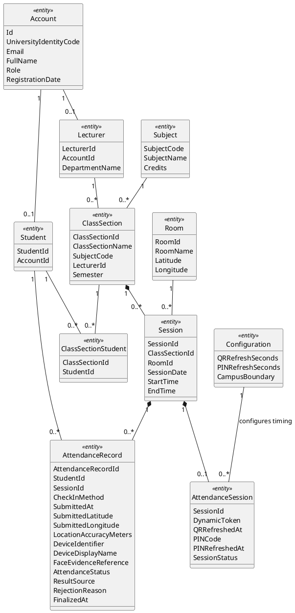

`AttendanceRecord` holds both the accepted check-in evidence and the official outcome for one student in one study session. `AttendanceStatus` represents the attendance record state: `NotYet`, `Present`, `Absent`, or `Late`. When an attendance session starts, each enrolled student receives one `AttendanceRecord` with `AttendanceStatus = NotYet`. Accepted student check-in changes that record to `Present`; finalization changes remaining `NotYet` records to `Absent`; a reopened finalized session allows the lecturer to change an `Absent` record to `Late` with an adjustment reason. `CheckInMethod` represents only student check-in methods: `QR` or `PIN`, and is empty when the result comes from absent assignment or manual adjustment (represented by `ResultSource`). `RejectionReason` retains the most recent rejected check-in reason; rejected submissions do not create separate rows.

Additional static constraints:

- `Account` is associated with either `Student` or `Lecturer` according to `Role`; administrative accounts have no student or lecturer mapping.

### **II.1.2 Contextual Boundary Diagram**

This view defines the boundary between the Anti-Fraud Attendance System (AFAS) and its external environment. AFAS is treated as a black box: the diagram shows only the system, external users, external systems, and external devices that interact with it. Internal analysis objects are intentionally excluded and are modeled in the object structuring and interaction diagrams.

#### **Figure II-2 Contextual Boundary Diagram for AFAS**

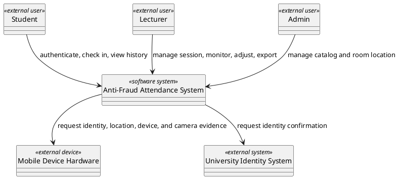

**Boundary Communication Description:**

| **External participant**                       | **Direction**                       | **Boundary communication**                                                                                                                                  | **Trace source**               |
| :--------------------------------------------- | :---------------------------------- | :---------------------------------------------------------------------------------------------------------------------------------------------------------- | :----------------------------- |
| Student `«external user»`                      | Student -> AFAS                     | Sends authentication requests, QR/PIN check-in evidence, and attendance history requests.                                                                   | UC01, UC02, UC03, UC04         |
| Student `«external user»`                      | AFAS -> Student                     | Returns access result, check-in acceptance or rejection, and personal attendance history.                                                                   | UC01, UC02, UC03, UC04         |
| Lecturer `«external user»`                     | Lecturer -> AFAS                    | Sends session management actions, live monitoring requests, manual adjustment decisions, and report export requests.                                        | UC01, UC05, UC06, UC07, UC08   |
| Lecturer `«external user»`                     | AFAS -> Lecturer                    | Returns assigned sessions, attendance session status, live attendance progress, adjustment result, and finalized report content.                            | UC05, UC06, UC07, UC08         |
| Admin `«external user»`                        | Admin -> AFAS                       | Sends catalog management actions.                                                                                                                           | UC01, UC09                     |
| Admin `«external user»`                        | AFAS -> Admin                       | Returns catalog validation results.                                                                                                                         | UC09                           |
| Mobile Device Hardware `«external device»`     | AFAS <-> Mobile Device Hardware     | Provides identity verification result, current location, device identifier, and camera evidence when requested by the user flow.                             | UC02, UC04, BR-04, BR-05       |
| University Identity System `«external system»` | AFAS <-> University Identity System | Confirms whether the requesting user has a valid university identity for AFAS access.                                                                       | UC01, BR-01                    |

### **II.1.3 Object Structure Criteria**

The object structure criteria below group analysis objects by COMET responsibilities and support traceability from the interaction diagrams. Objects are grouped by cohesive analysis responsibility rather than by one object per use case step, so the model avoids unnecessary fragmentation while preserving UC traceability.

The collaboration criteria for these objects are:

- `«user interface»`, `«device I/O»`, and `«proxy»` objects represent the system boundary. They receive or provide external events and send those events to a coordinator or application logic object; they do not access entity objects directly.
- `«coordinator»` and `«state dependent control»` objects own the use-case flow. They receive a boundary event, delegate business decisions to application logic objects, and choose the next flow branch from the returned business result. They should not pre-read entity data merely to pass extracted fields into business logic.
- `«business logic»` objects encapsulate business rules. When a rule needs retained domain facts, the business logic object retrieves or updates the relevant `«entity»` objects and returns an analysis-level business result to the coordinator.
- `«entity»` objects retain domain information and lifecycle state. They expose domain-level information or state changes needed by business logic, but they do not initiate use-case coordination.

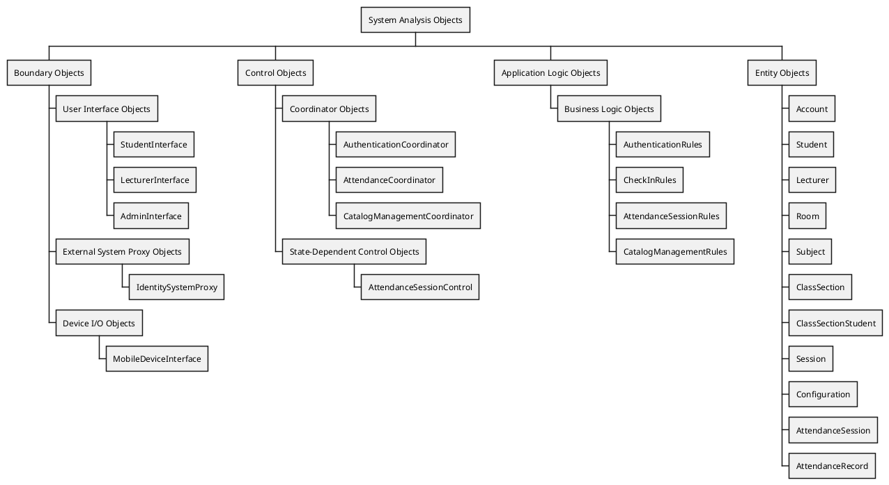

| **Object**                                                             | **Stereotype**              | **Responsibility**                                                                                                                                                                                                                                                                                                                                                                                                                 | **Trace source**                                          |
| :--------------------------------------------------------------------- | :-------------------------- | :--------------------------------------------------------------------------------------------------------------------------------------------------------------------------------------------------------------------------------------------------------------------------------------------------------------------------------------------------------------------------------------------------------------------------------- | :-------------------------------------------------------- |
| StudentInterface                                                     | `«user interface»`        | Receives student QR, PIN, and history actions after access is granted.                                                                                                                                                                                                                                                                                                                                                             | Student; UC02-UC04                                        |
| LecturerInterface                                                    | `«user interface»`        | Receives lecturer session, monitor, adjustment, and export actions after access is granted, and receives live accepted check-in result changes for classroom monitoring.                                                                                                                                                                                                                                                           | Lecturer; UC02, UC04-UC08                                 |
| AdminInterface                                                       | `«user interface»`        | Receives administrator catalog actions after access is granted.                                                                                                                                                                                                                                                                                                                                                                     | Admin; UC09                                               |
| MobileDeviceInterface                                                  | `«device I/O»`              | Interfaces with mobile device hardware to request biometric verification, read GPS coordinates, read device identifier, and access camera/selfie evidence.                                                                                                                                                                                                             | Mobile Device Hardware; UC02, UC04                        |
| IdentitySystemProxy                                                    | `«proxy»`                   | Represents the AFAS boundary used to ask the existing University Identity System to confirm user identity.                                                                                                                                                                                                                                                                                                                         | University Identity System; UC01, BR-01                   |
| AuthenticationCoordinator                                              | `«coordinator»`             | Coordinates the authentication use-case flow, delegates external identity confirmation and role-access evaluation, then returns the selected access outcome.                                                                                                                                                                                                                                                                       | UC01, BR-01                                               |
| AttendanceCoordinator                                                  | `«coordinator»`             | Coordinates regular attendance use-case flows and delegates attendance rule decisions for QR/PIN check-in, personal history retrieval, live monitoring, manual adjustment, and finalized report preparation.                                                                                                                                                                                                                       | UC02, UC03, UC04, UC06, UC07, UC08, BR-01, BR-10          |
| AttendanceSessionControl                                               | `«state dependent control»` | Coordinates attendance session lifecycle transitions: not started, active, finalized, reopened for late adjustment; delegates transition eligibility rules to attendance session policy logic.                                                                                                                                                                                                                                                             | UC05, BR-02, BR-08, BR-10, BR-12, BR-13                   |
| CatalogManagementCoordinator                                           | `«coordinator»`             | Coordinates administrator catalog management flows and delegates catalog evaluation to catalog validation logic.                                                                                                                                                                                                                                                       | UC09, BR-11                                               |
| AuthenticationRules                                                  | `«business logic»`          | Encapsulates role-access rules by locating the AFAS role profile for a confirmed university identity and checking whether the requested role is allowed.                                                                                                                                                                                                                                                                           | UC01, UC03, BR-01                                         |
| CheckInRules                                                         | `«business logic»`          | Encapsulates rules for a submitted student check-in by reading the required session, configuration, room, and attendance record facts, then checking QR/PIN validity, identity evidence, session match, and whether the student's record is still `NotYet` before changing it to `Present` using official system time. Submitted location coordinates are captured and stored for information only; they never affect acceptance and are not required.                                                                                | UC02, UC04, BR-02, BR-04, BR-12, NF-06      |
| AttendanceSessionRules                                               | `«business logic»`          | Encapsulates attendance history, attendance session lifecycle, and lecturer-operation policies by reading the required schedule, lecturer, session, roster, check-in, configuration, and official attendance facts, then checking scheduled time window, assigned lecturer, active session uniqueness, QR/PIN refresh policy, `NotYet` record initialization, absent assignment, finalization, report eligibility, reopen eligibility, and late adjustment reason requirements. | UC03, UC05, UC07, UC08, BR-02, BR-08, BR-10, BR-12, BR-13, NF-06 |
| CatalogManagementRules                                               | `«business logic»`          | Encapsulates catalog rules by reading the required catalog facts, then checking catalog field validity and identifier uniqueness.                                                                                                                                                                                                                                      | UC09, BR-11                                               |
| Account, Student, Lecturer                                             | `«entity»`                  | Store AFAS role profile information linked to university identity.                                                                                                                                                                                                                                                                                                                                                                 | UC01, UC09                                                |
| Room, Subject, ClassSection, ClassSectionStudent, Session | `«entity»`                  | Store academic catalog, roster, classroom coordinates, and scheduled session information.                                                                                                                                                                                                                                                                                                                         | UC02-UC09                                                 |
| Configuration                                                | `«entity»`                  | Stores configurable attendance parameters required by maintainability requirements, including refresh timing values and the campus boundary reference used for location evidence context.                                                                                                                                                                                                                                                                                                                  | UC02, UC04, UC05, NF-06                                   |
| AttendanceSession, AttendanceRecord                                    | `«entity»`                  | Store attendance session lifecycle, check-in evidence, and official result information.                                                                                                                                                                                                                                                                                                                                                             | UC02-UC08                                                 |

### **II.1.4 Interface wireframes**

The following analysis-level wireframes identify the user interface surfaces required by the use cases. They do not introduce implementation technology; they only show the business information and actions visible at the system boundary.

#### **StudentInterface wireframes**

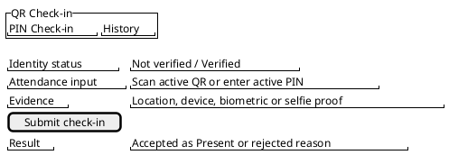

Trace: Student; UC02, UC03, UC04.

#### **LecturerInterface wireframes**

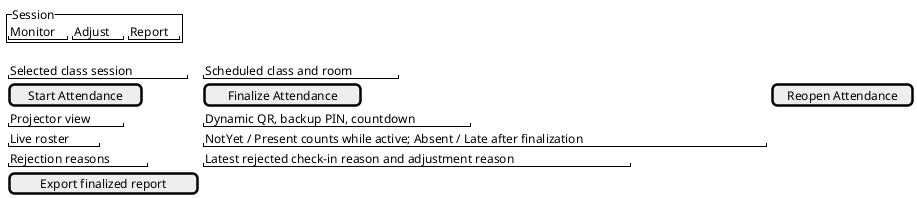

Trace: Lecturer; UC05, UC06, UC07, UC08.

#### **AdminInterface wireframes**

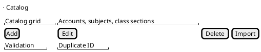

Trace: Admin; UC09.

---

## **II.2 Interaction diagrams**

The following sequence and communication diagrams realize each use case from Section I.5.2. Message wording follows the use case steps and business rules from Section I.6.

Sequence diagrams are kept to validate detailed main and alternative flows. Communication diagrams are also kept to match the SWD392 sample document style and to provide collaboration views that can be integrated in Design Modeling.

### **II.2.1 UC01 - Authenticate User**

#### **Figure II-3 Sequence diagram for UC01 - Authenticate User**

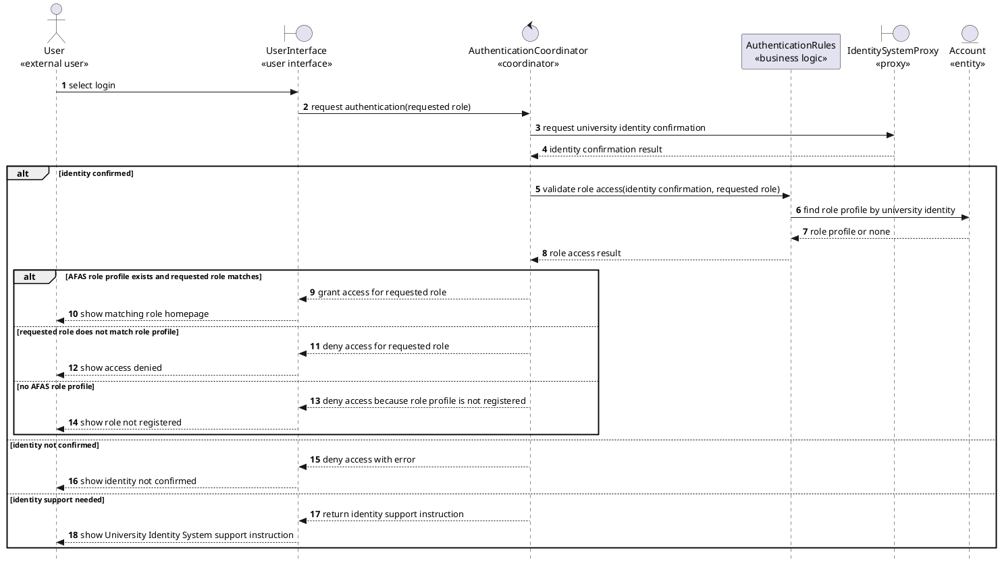
- Note: User Interface is general for all roles (Student, Lecturer, Admin).

#### **Figure II-4 Communication diagram for UC01 - Authenticate User**

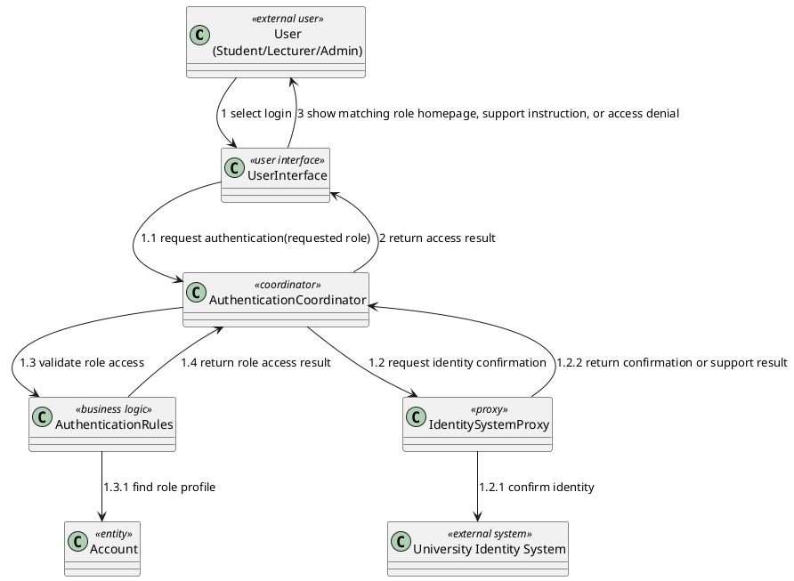

### **II.2.2 UC02 - Check In via Dynamic QR Code**

#### **Figure II-5 Sequence diagram for UC02 - Check In via Dynamic QR Code**

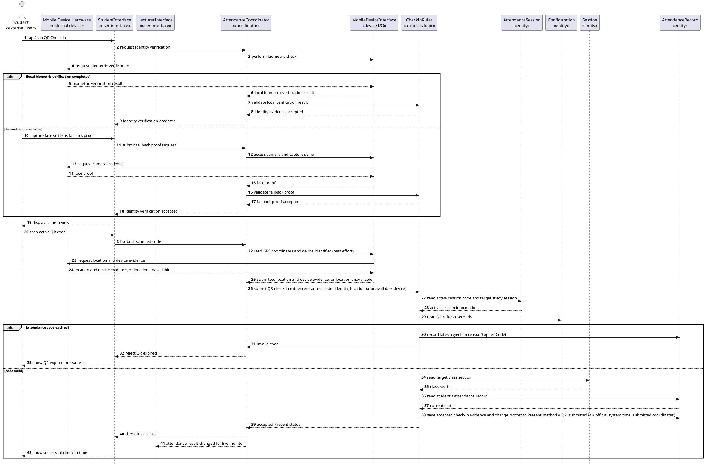

#### **Figure II-6 Communication diagram for UC02 - Check In via Dynamic QR Code**

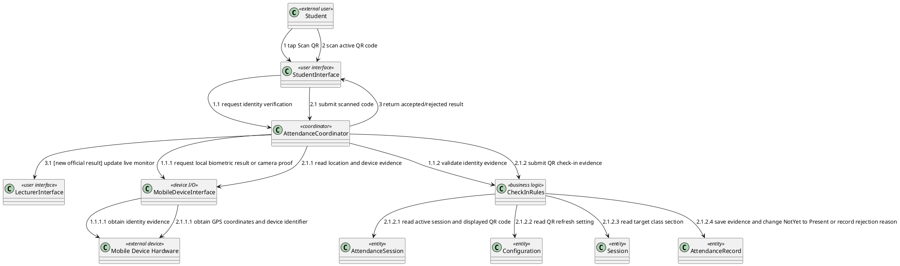

### **II.2.3 UC03 - View Personal Attendance History**

#### **Figure II-7 Sequence diagram for UC03 - View Personal Attendance History**

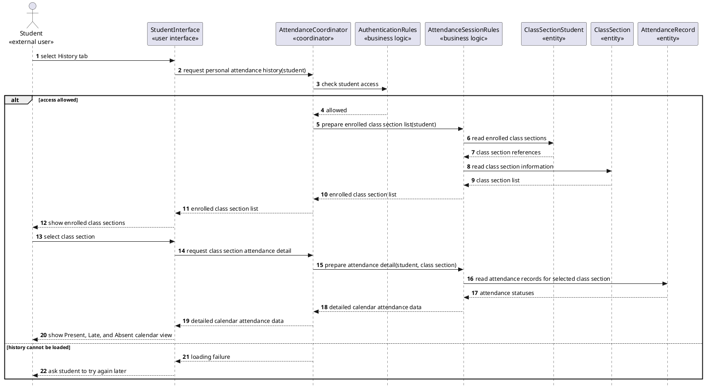

#### **Figure II-8 Communication diagram for UC03 - View Personal Attendance History**

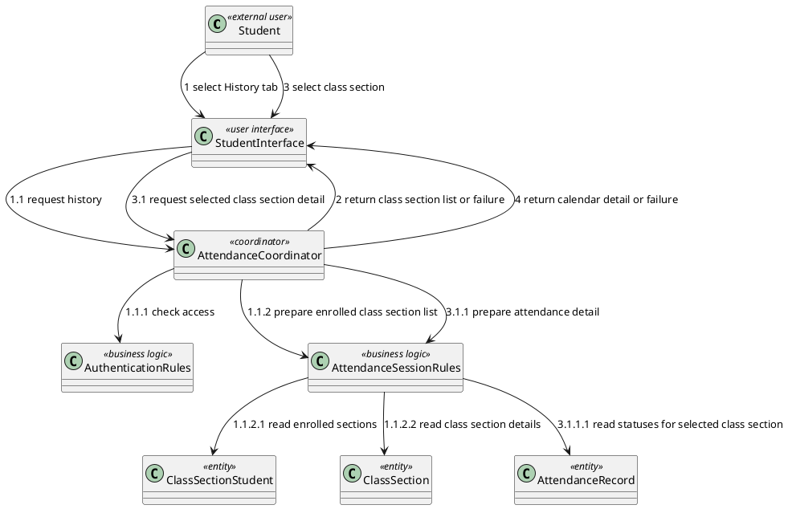

### **II.2.4 UC04 - Check In via PIN**

#### **Figure II-9 Sequence diagram for UC04 - Check In via PIN**

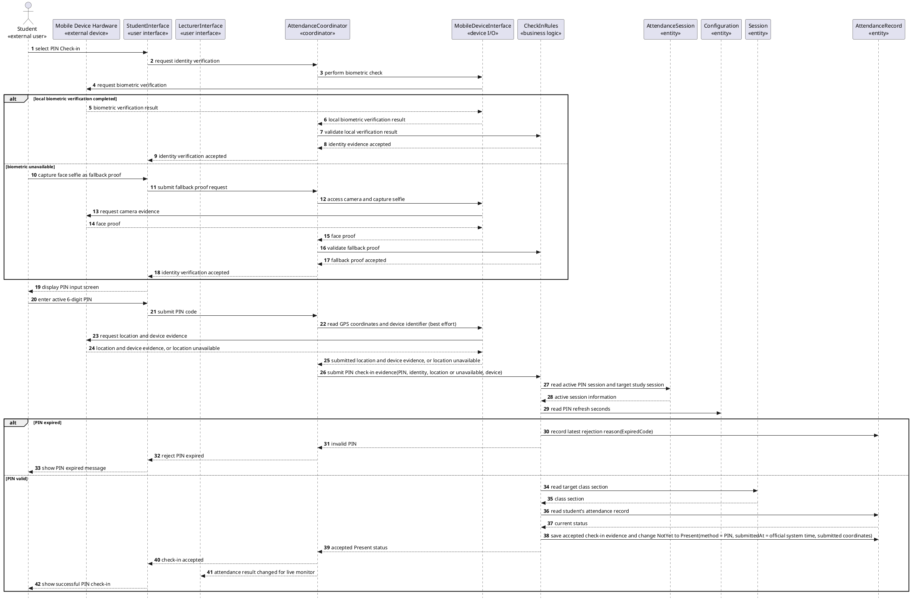

#### **Figure II-10 Communication diagram for UC04 - Check In via PIN**

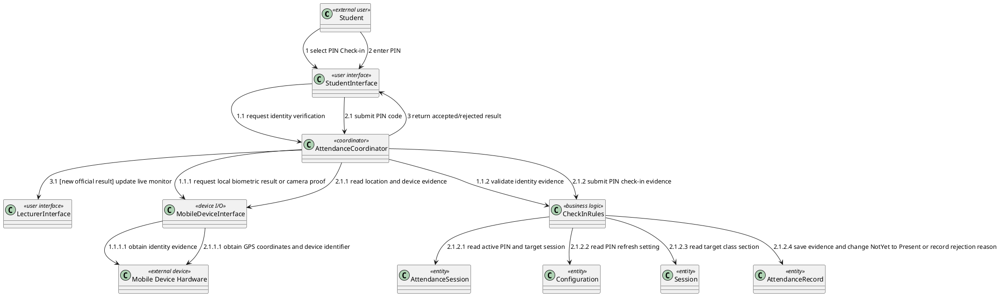

### **II.2.5 UC05 - Manage Attendance Session**

#### **Figure II-11 Sequence diagram for UC05 - Manage Attendance Session**

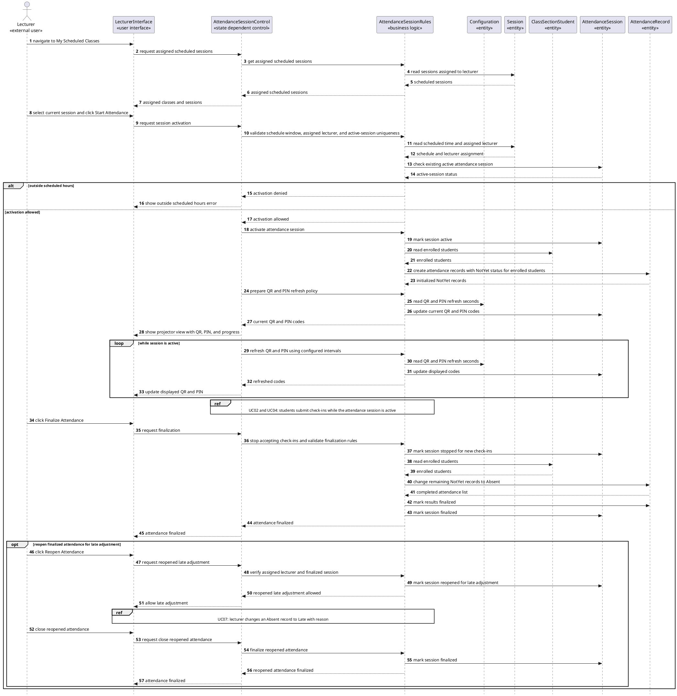

#### **Figure II-12 Communication diagram for UC05 - Manage Attendance Session**

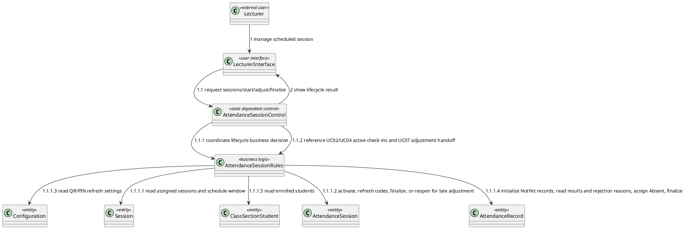

### **II.2.6 UC06 - Monitor Attendance in Real Time**

#### **Figure II-13 Sequence diagram for UC06 - Monitor Attendance in Real Time**

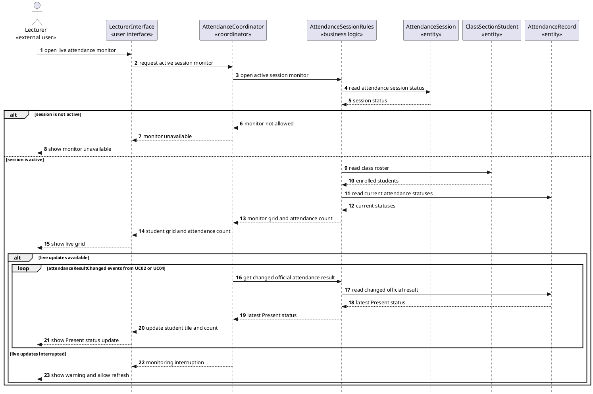

The monitor interaction is modeled at the business-event level only: accepted QR and PIN check-ins change a `NotYet` record to `Present`, and AttendanceCoordinator updates the lecturer view from that change. The concrete delivery mechanism is deferred to Design Modeling.

#### **Figure II-14 Communication diagram for UC06 - Monitor Attendance in Real Time**

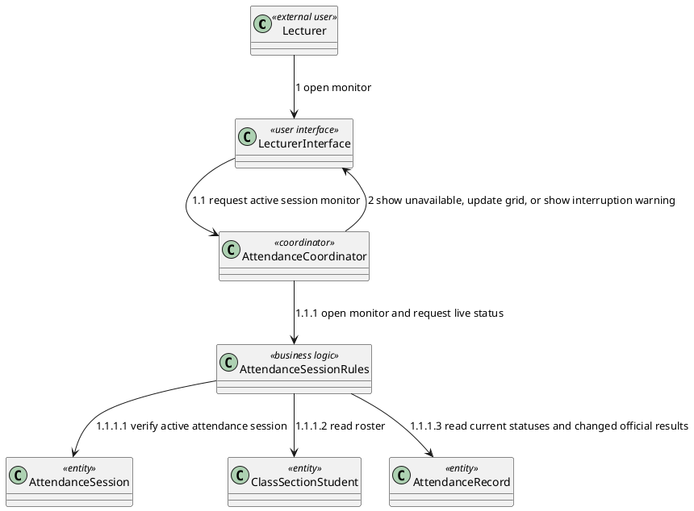

### **II.2.7 UC07 - Adjust Attendance Manually**

#### **Figure II-15 Sequence diagram for UC07 - Adjust Attendance Manually**

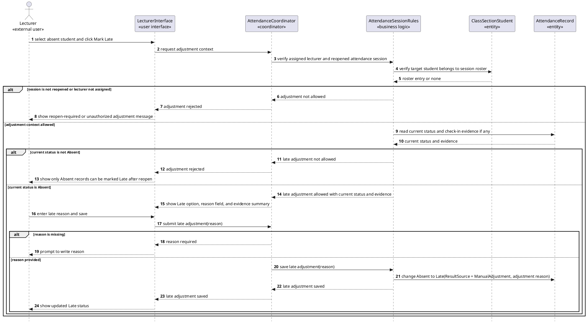

#### **Figure II-16 Communication diagram for UC07 - Adjust Attendance Manually**

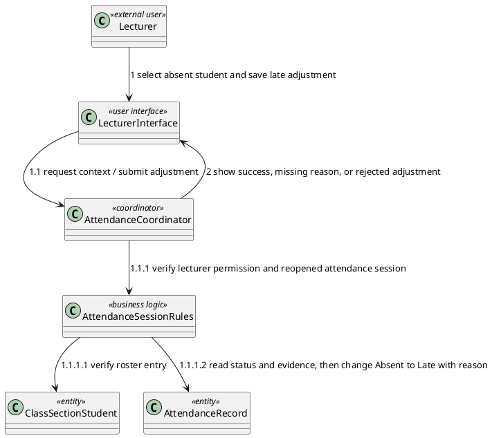

### **II.2.8 UC08 - Export Attendance Report**

#### **Figure II-17 Sequence diagram for UC08 - Export Attendance Report**

```plantuml
@startuml
skinparam style strictuml
autonumber
actor "Lecturer\n«external user»" as Lecturer
participant "LecturerInterface\n«user interface»" as LecturerUI
participant "AttendanceCoordinator\n«coordinator»" as ReportControl
participant "AttendanceSessionRules\n«business logic»" as ReportRules
participant "ClassSectionStudent\n«entity»" as ClassSectionStudent
participant "Session\n«entity»" as Session
participant "AttendanceRecord\n«entity»" as AttendanceRecord

Lecturer -> LecturerUI : click Export Report
LecturerUI -> ReportControl : request attendance report(class section, semester)
ReportControl -> ReportRules : verify export uses finalized attendance results
ReportRules -> Session : read class sessions
Session --> ReportRules : session dates or none
ReportRules -> AttendanceRecord : read finalized attendance result availability
AttendanceRecord --> ReportRules : finalized records or none

alt no finalized records or no sessions exist
  ReportRules --> ReportControl : export not available
  ReportControl --> LecturerUI : show empty-state message and disable export
  LecturerUI --> Lecturer : show no records available
else finalized records exist
  ReportRules -> ClassSectionStudent : read roster
  ClassSectionStudent --> ReportRules : student roster
  ReportRules -> AttendanceRecord : read finalized Present/Late/Absent statuses, check-in modes, and rejection reasons
  AttendanceRecord --> ReportRules : official attendance matrix with evidence summary
  ReportRules --> ReportControl : prepared report content
  ReportControl --> LecturerUI : prepared report content
  LecturerUI --> Lecturer : save attendance report file locally
end
@enduml
```

#### **Figure II-18 Communication diagram for UC08 - Export Attendance Report**

```plantuml
@startuml
class "Lecturer" as Lecturer <<external user>>
class "LecturerInterface" as LecturerUI <<user interface>>
class "AttendanceCoordinator" as ReportControl <<coordinator>>
class "AttendanceSessionRules" as ReportRules <<business logic>>
class "ClassSectionStudent" as ClassSectionStudent <<entity>>
class "Session" as Session <<entity>>
class "AttendanceRecord" as AttendanceRecord <<entity>>

Lecturer --> LecturerUI : 1 click Export Report
LecturerUI --> ReportControl : 1.1 request report
ReportControl --> ReportRules : 1.1.1 verify finalized results
ReportRules --> ClassSectionStudent : 1.1.1.1 read roster
ReportRules --> Session : 1.1.1.2 read sessions
ReportRules --> AttendanceRecord : 1.1.1.3 read finalized Present/Late/Absent statuses, modes, and rejection reasons
ReportControl --> LecturerUI : 2 return report content or empty state
@enduml
```

### **II.2.9 UC09 - Manage System Catalog**

#### **Figure II-19 Sequence diagram for UC09 - Manage System Catalog**

```plantuml
@startuml
skinparam style strictuml
autonumber
actor "Admin\n«external user»" as Admin
participant "AdminInterface\n«user interface»" as AdminUI
participant "CatalogManagementCoordinator\n«coordinator»" as CatalogControl
participant "CatalogManagementRules\n«business logic»" as CatalogRules
participant "Account\n«entity»" as Account
participant "Student\n«entity»" as Student
participant "Lecturer\n«entity»" as Lecturer
participant "Subject\n«entity»" as Subject
participant "ClassSection\n«entity»" as ClassSection
participant "ClassSectionStudent\n«entity»" as ClassSectionStudent
participant "Session\n«entity»" as Session

Admin -> AdminUI : click catalog menu option
AdminUI -> CatalogControl : request catalog view(catalog type)
CatalogControl -> CatalogRules : get catalog records(catalog type)
CatalogRules -> Account : read account records when applicable
CatalogRules -> Student : read student records when applicable
CatalogRules -> Lecturer : read lecturer records when applicable
CatalogRules -> Subject : read subject records when applicable
CatalogRules -> ClassSection : read class section records when applicable
CatalogRules -> ClassSectionStudent : read roster records when applicable
CatalogRules -> Session : read scheduled session records when applicable
CatalogRules --> CatalogControl : searchable catalog grid
CatalogControl --> AdminUI : searchable catalog grid
AdminUI --> Admin : show add, edit, and delete actions
Admin -> AdminUI : input catalog details and submit
AdminUI -> CatalogControl : submit catalog change
CatalogControl -> CatalogRules : validate fields and unique identifiers
CatalogRules -> Account : check account identifier uniqueness when applicable
CatalogRules -> Student : check student identifier uniqueness when applicable
CatalogRules -> ClassSection : check class section identifier uniqueness when applicable

alt batch import selected
  Admin -> AdminUI : upload structured catalog data
  AdminUI -> CatalogControl : submit batch catalog data
  CatalogControl -> CatalogRules : validate imported records
  CatalogRules -> Account : record valid imported accounts
  CatalogRules -> Student : record valid imported students
  CatalogRules -> Subject : record valid imported subjects
  CatalogRules -> ClassSection : record valid imported class sections
  CatalogRules -> ClassSectionStudent : record valid roster entries when included
  CatalogRules -> Session : record valid scheduled sessions when included
  CatalogRules --> CatalogControl : import validation result
  CatalogControl --> AdminUI : import result
  AdminUI --> Admin : show imported records and validation feedback
else
  CatalogRules -> Account : record user account change when applicable
  CatalogRules -> Student : record student change when applicable
  CatalogRules -> Lecturer : record lecturer change when applicable
  CatalogRules -> Subject : record subject change when applicable
  CatalogRules -> ClassSection : record class section change when applicable
  CatalogRules -> ClassSectionStudent : record roster change when applicable
  CatalogRules -> Session : record scheduled session change when applicable
  CatalogRules --> CatalogControl : valid change recorded
  CatalogControl --> AdminUI : catalog updated
  AdminUI --> Admin : refresh catalog grid
end
@enduml
```

#### **Figure II-20 Communication diagram for UC09 - Manage System Catalog**

```plantuml
@startuml
class "Admin" as Admin <<external user>>
class "AdminInterface" as AdminUI <<user interface>>
class "CatalogManagementCoordinator" as CatalogControl <<coordinator>>
class "CatalogManagementRules" as CatalogRules <<business logic>>
class "Account" as Account <<entity>>
class "Student" as Student <<entity>>
class "Lecturer" as Lecturer <<entity>>
class "Subject" as Subject <<entity>>
class "ClassSection" as ClassSection <<entity>>
class "ClassSectionStudent" as ClassSectionStudent <<entity>>
class "Session" as Session <<entity>>

Admin --> AdminUI : 1 manage catalog
AdminUI --> CatalogControl : 1.1 view/add/edit/delete/import records
CatalogControl --> CatalogRules : 1.1.1 retrieve, validate, and record catalog changes
CatalogRules --> Account : 1.1.1.1 read or record account change
CatalogRules --> Student : 1.1.1.2 read or record student change
CatalogRules --> Lecturer : 1.1.1.3 read or record lecturer change
CatalogRules --> Subject : 1.1.1.4 read or record subject change
CatalogRules --> ClassSection : 1.1.1.5 read or record class section change
CatalogRules --> ClassSectionStudent : 1.1.1.6 read or record roster change
CatalogRules --> Session : 1.1.1.7 read or record scheduled session change
CatalogControl --> AdminUI : 2 return updated grid or validation error
@enduml
```

## **II.3 State diagrams**

### **II.3.1 AttendanceSessionControl state**

`AttendanceSessionControl` is the `«state dependent control»` object for UC05 because it coordinates the lifecycle from scheduled session selection to active check-in, finalization, and reopened late adjustment. The `AttendanceSession` entity records the lifecycle state, but the state machine below belongs to the control object that governs the lifecycle.

#### **Figure II-23 State diagram for AttendanceSessionControl**

```plantuml
@startuml
skinparam style strictuml
[*] --> NotStarted
NotStarted --> Active : startAttendance [within scheduled window and no other active session]
NotStarted --> NotStarted : startAttendance [outside scheduled window or active session already exists]

Active --> Active : refreshQRCode / refreshPIN
Active --> Finalized : finalizeAttendance
Finalized --> Reopened : reopenAttendance [assigned lecturer and finalized session]
Reopened --> Reopened : adjustLateAttendance [UC07, Absent record and reason provided]
Reopened --> Finalized : closeReopenedAttendance
Finalized --> [*]
@enduml
```

### **II.3.2 AttendanceRecord state**

`AttendanceRecord` is state-dependent for the official attendance outcome of one student in one study session. It is created as `NotYet` when the attendance session starts. Accepted student check-in changes it to `Present`; finalization changes remaining `NotYet` records to `Absent`; a reopened finalized session allows a lecturer to change an `Absent` record to `Late` with a required adjustment reason. `ResultSource` records whether the value came from QR, PIN, absent assignment, or manual adjustment; `RejectionReason` retains the most recent rejected check-in reason.

#### **Figure II-24 State diagram for AttendanceRecord**

```plantuml
@startuml
skinparam style strictuml
[*] --> NotYet : initializeRecord [attendance session starts]
NotYet --> Present : acceptedCheckIn [valid QR/PIN and identity evidence]
NotYet --> Absent : finalizeAttendance [student has not checked in]
Absent --> Late : markLateAfterReopen [lecturer provides reason]
Present --> [*]
Absent --> [*]
Late --> [*]
@enduml
```

---

## **II.4 Analysis traceability matrix**

| **Requirement / UC**                     | **Actor**                                            | **Analysis objects**                                                                                                                                                                                                                       | **Dynamic diagrams**                                              | **Business rules covered**                                                  |
| :--------------------------------------- | :--------------------------------------------------- | :----------------------------------------------------------------------------------------------------------------------------------------------------------------------------------------------------------------------------------------- | :---------------------------------------------------------------- | :-------------------------------------------------------------------------- |
| UC01 Authenticate User                   | Student, Lecturer, Admin, University Identity System | UserInterface, IdentitySystemProxy, AuthenticationCoordinator, AuthenticationRules, Account                                                                                                                                            | Figure II-3, Figure II-4                                          | BR-01                                                                       |
| UC02 Check In via Dynamic QR Code        | Student, Mobile Device Hardware                      | StudentInterface, LecturerInterface, MobileDeviceInterface, AttendanceCoordinator, CheckInRules, Configuration, AttendanceSession, Session, AttendanceRecord | Figure II-5, Figure II-6, Figure II-24              | BR-02, BR-03, BR-04, BR-05, BR-12, NF-02, NF-06        |
| UC03 View Personal Attendance History    | Student                                              | StudentInterface, AttendanceCoordinator, AuthenticationRules, AttendanceSessionRules, ClassSectionStudent, ClassSection, AttendanceRecord                                                                                            | Figure II-7, Figure II-8                                          | BR-01                                                                       |
| UC04 Check In via PIN                    | Student, Mobile Device Hardware                      | StudentInterface, LecturerInterface, MobileDeviceInterface, AttendanceCoordinator, CheckInRules, Configuration, AttendanceSession, Session, AttendanceRecord | Figure II-9, Figure II-10, Figure II-24             | BR-02, BR-03, BR-04, BR-05, BR-07, BR-12, NF-02, NF-06 |
| UC05 Manage Attendance Session           | Lecturer                                             | LecturerInterface, AttendanceSessionControl, AttendanceSessionRules, Configuration, Session, ClassSectionStudent, AttendanceSession, AttendanceRecord                                                        | Figure II-11, Figure II-12, Figure II-23                          | BR-02, BR-08, BR-10, BR-12, BR-13, NF-06                             |
| UC06 Monitor Attendance in Real Time     | Lecturer                                             | LecturerInterface, AttendanceCoordinator, AttendanceSessionRules, AttendanceSession, ClassSectionStudent, AttendanceRecord                                                                                                             | Figure II-13, Figure II-14                                        | NF-01                                                                       |
| UC07 Adjust Attendance Manually          | Lecturer                                             | LecturerInterface, AttendanceCoordinator, AttendanceSessionRules, ClassSectionStudent, AttendanceRecord                                                                                                                | Figure II-15, Figure II-16, Figure II-24                          | BR-10, BR-13                                                               |
| UC08 Export Attendance Report            | Lecturer                                             | LecturerInterface, AttendanceCoordinator, AttendanceSessionRules, ClassSectionStudent, Session, AttendanceRecord                                                                                                       | Figure II-17, Figure II-18, Figure II-24                          | BR-08                                                                       |
| UC09 Manage System Catalog               | Admin                                                | AdminInterface, CatalogManagementCoordinator, CatalogManagementRules, Account, Student, Lecturer, Subject, ClassSection, ClassSectionStudent, Session                                                                                  | Figure II-19, Figure II-20                                        | BR-11                                                                       |
| NF-06 Configurable attendance parameters | Student, Lecturer                                    | Configuration, CheckInRules, AttendanceSessionRules                                                                                                                                                                           | Figure II-1, Figure II-5, Figure II-9, Figure II-11               | NF-06                                                                       |

---

## **II.5 Verification checklist against Section I**

| **Check item**                                                                                                                                            | **Status** | **Evidence in this section**                                                                                                                                                                                                  |
| :-------------------------------------------------------------------------------------------------------------------------------------------------------- | :--------- | :---------------------------------------------------------------------------------------------------------------------------------------------------------------------------------------------------------------------------- |
| UC list matches Requirement Section I.5.2                                                                                                                 | Pass       | UC01-UC09 only; Figures II-3 through II-20                                                                                                                                                                                    |
| UC names match Requirement Section I.5.2                                                                                                                  | Pass       | Headings II.2.1-II.2.9                                                                                                                                                                                                        |
| Analysis uses detailed COMET stereotypes                                                                                                                  | Pass       | Figures II-1 through II-20 use `«user interface»`, `«device I/O»`, `«coordinator»`, `«state dependent control»`, `«entity»`, and `«business logic»`                                                          |
| Contextual boundary diagram contains only external participants and the AFAS black box                                                                    | Pass       | Figure II-2 contains AFAS, external users, Mobile Device Hardware, and University Identity System only                                                                                                                        |
| Static data structure is isolated from behavior views                                                                                                     | Pass       | Figure II-1 contains only entity classes and relationships; Figure II-2 contains only the contextual boundary; Section II.2 provides use-case-specific behavior diagrams                                                      |
| Mobile device hardware is represented consistently across context and interaction views                                                                   | Pass       | Figure II-2 represents Mobile Device Hardware as an external device; Figure II-5, Figure II-6, Figure II-9, and Figure II-10 use MobileDeviceInterface as the internal device I/O boundary object |
| Entity relationships distinguish lifecycle ownership where appropriate                                                                                    | Pass       | Figure II-1 uses composition for study-session-owned attendance lifecycle data and association for room location membership                                                                                            |
| Interface wireframes are included for key actor workflows                                                                                                 | Pass       | Section II.1.4 covers Student, Lecturer, and Admin wireframes with UC trace notes                                                                                                                                             |
| NF-06 configurable attendance parameters are represented in Analysis                                                                                      | Pass       | Configuration appears in Figure II-1 and is used by CheckInRules and AttendanceSessionRules                                                                                                                     |
| QR/PIN check-in changes an initialized `NotYet` record to `Present` after identity and code checks; location is informational and never blocks check-in   | Pass       | Figures II-5, II-9, and II-24                                                                                                                                                                                                  |
| Attendance records are initialized as `NotYet` when the attendance session starts                                                                          | Pass       | Figure II-11 and Figure II-24                                                                                                                                                                                                  |
| Latest rejection reason is retained on the attendance record for lecturer review                                                                          | Pass       | Figures II-5, II-9, II-11, II-24                                                                                                                                                                                              |
| UC05 includes start, active check-in, finalize action that stops check-ins, changes remaining `NotYet` records to `Absent`, and reopen for late adjustment | Pass       | Figure II-11 and Figure II-23                                                                                                                                                                                                 |
| UC07 changes an `Absent` record to `Late` only after attendance is reopened and a reason is provided                                                       | Pass       | Figure II-15 and Figure II-24                                                                                                                                                                                                 |
| UC06 separates inactive sessions from interrupted live updates                                                                                            | Pass       | Figure II-13                                                                                                                                                                                                                  |
| UC08 exports only finalized attendance results                                                                                                            | Pass       | Figure II-17 and Figure II-24                                                                                                                                                                                                 |
| Official attendance results exclude Rejected status                                                                                                       | Pass       | Figure II-1, Figure II-24                                                                                                                                                                                                     |
| Location model supports submitted-coordinate and accuracy capture for information only (no distance computed; not used to accept or reject check-in)       | Pass       | Figure II-1, Figure II-5, Figure II-9                                                                                                                                                                                         |
| Removed untraced analysis objects and flows                                                                                                               | Pass       | Old external-login flow, lecturer location storage, untraced device lifecycle, network evidence details, and unsupported face-matching threshold are not modeled                                                              |
