## **II. Analysis models**

This section realizes the AFAS requirements from Section I through COMET analysis objects. The source requirements are the 13 use cases (UC01-UC04, UC05a-UC05b, UC06-UC08, UC09a-UC09d) and business rules BR-01-BR-13 in [1_Requirement.md](1_Requirement.md). No solution-domain technical decisions are introduced in this phase.

---

## **II.1 Static analysis models**

### **II.1.1 Entity class diagram**

The following entity classes are derived from the Data Dictionary in Section II.1.2 and the configurability requirement in NF-06, and are used by the interaction diagrams in Section II.2.

#### **Figure II-1 Entity class diagram for AFAS**

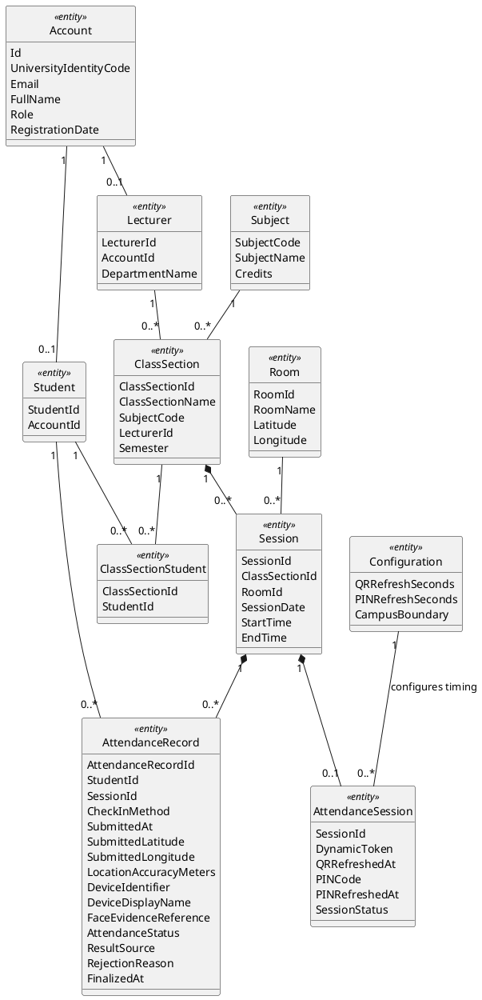

`AttendanceRecord` holds both the accepted check-in evidence and the official outcome for one student in one study session. `AttendanceStatus` represents the attendance record state: `NotYet`, `Present`, `Absent`, or `Late`. When an attendance session starts, each enrolled student receives one `AttendanceRecord` with `AttendanceStatus = NotYet`. Accepted student check-in changes that record to `Present`; finalization changes remaining `NotYet` records to `Absent`; same-day manual edit allows the assigned lecturer to correct an official status with an adjustment reason. `CheckInMethod` represents only student check-in methods: `QR` or `PIN`, and is empty when the result comes from absent assignment or manual adjustment (represented by `ResultSource`). `RejectionReason` retains the most recent rejected check-in reason; rejected submissions do not create separate rows.

Additional static constraints:

- `Account` is associated with either `Student` or `Lecturer` according to `Role`; administrative accounts have no student or lecturer mapping.

### **II.1.2 Data dictionary**

The data dictionary below details every entity class, attribute name, data type, and description derived from domain requirements.

#### **Table II-1: Data Description (Data dictionary)**

| **Name**                    | **Data Type** | **Description**                                                                                                                                                      |
| :-------------------------- | :------------ | :------------------------------------------------------------------------------------------------------------------------------------------------------------------- |
| **Account**                 |               | **AFAS user role profile data**                                                                                                                                      |
| Id                          | Text          | Unique account identifier.                                                                                                                                           |
| UniversityIdentityCode      | Text          | Identifier of the user's identity in the University Identity System.                                                                                                 |
| Email                       | Text          | Registered FPT school email address received from or aligned with the university identity.                                                                           |
| FullName                    | Text          | Full display name of the user.                                                                                                                                       |
| Role                        | Text          | System access role. Must be one of: `Student`, `Lecturer`, `Admin`.                                                                                                  |
| RegistrationDate            | Date/Time     | Date and time the account was registered.                                                                                                                            |
| **Student**                 |               | **Student profile mapping**                                                                                                                                          |
| StudentId                   | Text          | Unique student roll number (e.g. `SE170123`).                                                                                                                        |
| AccountId                   | Text          | Links the student profile to their account.                                                                                                                          |
| **Lecturer**                |               | **Lecturer profile mapping**                                                                                                                                         |
| LecturerId                  | Text          | Assigned school lecturer ID (e.g. `HueCTM`).                                                                                                                         |
| AccountId                   | Text          | Links the lecturer profile to their account.                                                                                                                         |
| DepartmentName              | Text          | Faculty department name.                                                                                                                                             |
| **Room**                    |               | **Classroom geo catalog**                                                                                                                                            |
| RoomId                      | Text          | Physical classroom code (e.g., `AL-L402`).                                                                                                                           |
| RoomName                    | Text          | Easy-to-read room display name.                                                                                                                                      |
| Latitude                    | Decimal       | Classroom center point latitude, kept as reference location information.                                                                                             |
| Longitude                   | Decimal       | Classroom center point longitude, kept as reference location information.                                                                                            |
| **Subject**                 |               | **University subject catalog**                                                                                                                                       |
| SubjectCode                 | Text          | Subject code identifier (e.g., `SWD392`).                                                                                                                            |
| SubjectName                 | Text          | Detailed subject name.                                                                                                                                               |
| Credits                     | Number        | Credit value of the course (must be greater than 0).                                                                                                                 |
| **ClassSection**            |               | **Assigned course class section**                                                                                                                                    |
| ClassSectionId              | Text          | Class section code (e.g., `SWD392_SU26_SE1701`).                                                                                                                     |
| ClassSectionName            | Text          | Friendly class segment name.                                                                                                                                         |
| SubjectCode                 | Text          | Reference subject code.                                                                                                                                              |
| LecturerId                  | Text          | Lecturer assigned to teach.                                                                                                                                          |
| Semester                    | Text          | Academic semester name.                                                                                                                                              |
| **ClassSectionStudent**     |               | **Course class roster map**                                                                                                                                          |
| ClassSectionId              | Text          | Reference class section ID.                                                                                                                                          |
| StudentId                   | Text          | Enrolled student roll number.                                                                                                                                        |
| **Session**                 |               | **Scheduled study session date/time**                                                                                                                                |
| SessionId                   | Text          | Scheduled session unique ID.                                                                                                                                         |
| ClassSectionId              | Text          | Belongs to class section code.                                                                                                                                       |
| RoomId                      | Text          | Physical room location of the session.                                                                                                                               |
| SessionDate                 | Date          | Scheduled calendar date.                                                                                                                                             |
| StartTime                   | Time          | Scheduled class start hour.                                                                                                                                          |
| EndTime                     | Time          | Scheduled class end hour.                                                                                                                                            |
| **AttendanceSession**       |               | **Dynamic QR/PIN attendance session**                                                                                                                                |
| SessionId                   | Text          | Ties the attendance session to a specific scheduled study session.                                                                                                   |
| DynamicToken                | Text          | Current active attendance code represented in the QR for verification.                                                                                               |
| QRRefreshedAt               | Date/Time     | Exact timestamp when the QR attendance code was last refreshed.                                                                                                      |
| PINCode                     | Text          | 6-digit backup fallback attendance code.                                                                                                                             |
| PINRefreshedAt              | Date/Time     | Exact timestamp when the PIN code was last refreshed.                                                                                                                |
| SessionStatus               | Text          | Indicates whether the attendance session is not started, active, or finalized.                                                         |
| **Configuration**           |               | **Configurable attendance parameters**                                                                                                                               |
| QRRefreshSeconds            | Number        | Number of seconds between QR code refreshes; also the validity window of each QR code.                                                                               |
| PINRefreshSeconds           | Number        | Number of seconds between backup PIN refreshes.                                                                                                                      |
| CampusBoundary              | Text          | Defined campus area boundary used as a reference for attendance location evidence.                                                                                   |
| **AttendanceRecord**        |               | **Attendance result and check-in evidence for one student in one study session (one row per `{StudentId, SessionId}`)**                                               |
| AttendanceRecordId          | Text          | Unique identifier for the attendance record.                                                                                                                         |
| StudentId                   | Text          | Referencing the student.                                                                                                                                             |
| SessionId                   | Text          | Referencing the study session.                                                                                                                                       |
| CheckInMethod               | Text          | Student check-in method that produced the result: `QR` or `PIN` (nullable when the result comes from absent assignment or manual adjustment).                         |
| SubmittedAt                 | Date/Time     | Timestamp when the accepted check-in evidence was submitted (nullable when no check-in was accepted).                                                                 |
| SubmittedLatitude           | Decimal       | Latitude submitted by the student's device, when available (nullable; captured for information only).                                                                |
| SubmittedLongitude          | Decimal       | Longitude submitted by the student's device, when available (nullable; captured for information only).                                                               |
| LocationAccuracyMeters      | Decimal       | Accuracy estimate reported with the submitted location, when available (nullable).                                                                                   |
| DeviceIdentifier            | Text          | Device identifier captured as attendance evidence (nullable).                                                                                                        |
| DeviceDisplayName           | Text          | Device display name used during check-in (nullable).                                                                                                                 |
| FaceEvidenceReference       | Text          | Reference to face verification proof when fallback identity verification is used (nullable).                                                                          |
| AttendanceStatus            | Text          | Attendance record status: `Not Yet`, `Present`, `Absent`, or `Late`. New records are created as `Not Yet` when the attendance session starts.                        |
| ResultSource                | Text          | Source of the official attendance result: accepted `QR`/`PIN` check-in, `absent assignment`, or lecturer `manual adjustment`.                                         |
| RejectionReason             | Text          | Reason of the most recent rejected check-in for this student and study session, such as `ExpiredCode` (nullable; location is never a rejection reason). |
| FinalizedAt                 | Date/Time     | Timestamp when the result became part of the finalized attendance sheet.                                                                                             |

### **II.1.3 Contextual Boundary Diagram**

This view defines the boundary between the Anti-Fraud Attendance System (AFAS) and its external environment. AFAS is treated as a black box: the diagram shows only the system, external users, external systems, and external devices that interact with it. Internal analysis objects are intentionally excluded and are modeled in the object structuring and interaction diagrams.

#### **Figure II-2 Contextual Boundary Diagram for AFAS**

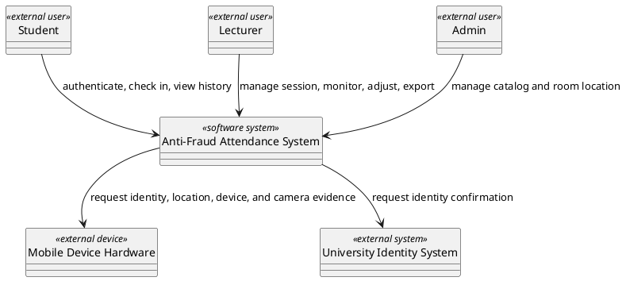

**Boundary Communication Description:**

| **External participant**                       | **Direction**                       | **Boundary communication**                                                                                                                                  | **Trace source**               |
| :--------------------------------------------- | :---------------------------------- | :---------------------------------------------------------------------------------------------------------------------------------------------------------- | :----------------------------- |
| Student `«external user»`                      | Student -> AFAS                     | Sends authentication requests, QR/PIN check-in evidence, and attendance history requests.                                                                   | UC01, UC02, UC03, UC04         |
| Student `«external user»`                      | AFAS -> Student                     | Returns access result, check-in acceptance or rejection, and personal attendance history.                                                                   | UC01, UC02, UC03, UC04         |
| Lecturer `«external user»`                     | Lecturer -> AFAS                    | Sends session management actions, live monitoring requests, manual adjustment decisions, and report export requests.                                        | UC01, UC05a, UC05b, UC06, UC07, UC08   |
| Lecturer `«external user»`                     | AFAS -> Lecturer                    | Returns assigned sessions, attendance session status, live attendance progress, adjustment result, and finalized report content.                            | UC05a, UC05b, UC06, UC07, UC08         |
| Admin `«external user»`                        | Admin -> AFAS                       | Sends catalog management actions.                                                                                                                           | UC01, UC09a, UC09b, UC09c, UC09d                     |
| Admin `«external user»`                        | AFAS -> Admin                       | Returns catalog validation results.                                                                                                                         | UC09a, UC09b, UC09c, UC09d                          |
| Mobile Device Hardware `«external device»`     | AFAS <-> Mobile Device Hardware     | Provides identity verification result, current location, device identifier, and camera evidence when requested by the user flow.                             | UC02, UC04, BR-04, BR-05       |
| University Identity System `«external system»` | AFAS <-> University Identity System | Confirms whether the requesting user has a valid university identity for AFAS access.                                                                       | UC01, BR-01                    |

### **II.1.4 Object Structure Criteria**

The object structure criteria below group analysis objects by COMET responsibilities and support traceability from the interaction diagrams. Objects are grouped by cohesive analysis responsibility rather than by one object per use case step, so the model avoids unnecessary fragmentation while preserving UC traceability.

The collaboration criteria for these objects are:

- `«user interface»`, `«device I/O»`, and `«proxy»` objects represent the system boundary. They receive or provide external events and send those events to a coordinator or application logic object; they do not access entity objects directly.
- `«coordinator»` and `«state dependent control»` objects own the use-case flow. They receive a boundary event, delegate business decisions to application logic objects, and choose the next flow branch from the returned business result. They should not pre-read entity data merely to pass extracted fields into business logic.
- `«business logic»` objects encapsulate business rules. When a rule needs retained domain facts, the business logic object retrieves or updates the relevant `«entity»` objects and returns an analysis-level business result to the coordinator.
- `«entity»` objects retain domain information and lifecycle state. They expose domain-level information or state changes needed by business logic, but they do not initiate use-case coordination.

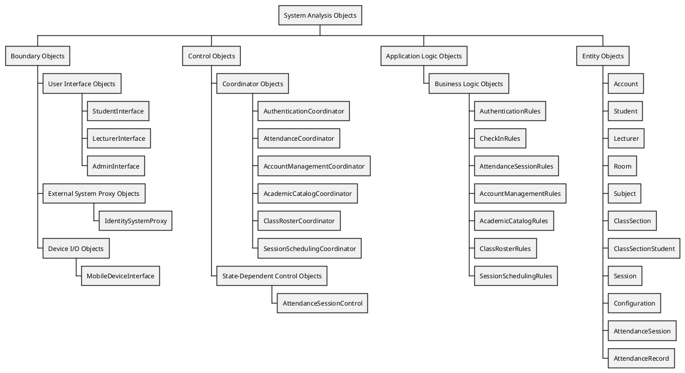

| **Object**                                                             | **Stereotype**              | **Responsibility**                                                                                                                                                                                                                                                                                                                                                                                                                 | **Trace source**                                          |
| :--------------------------------------------------------------------- | :-------------------------- | :--------------------------------------------------------------------------------------------------------------------------------------------------------------------------------------------------------------------------------------------------------------------------------------------------------------------------------------------------------------------------------------------------------------------------------- | :-------------------------------------------------------- |
| StudentInterface                                                     | `«user interface»`        | Receives student QR, PIN, and history actions after access is granted.                                                                                                                                                                                                                                                                                                                                                             | Student; UC02-UC04                                        |
| LecturerInterface                                                    | `«user interface»`        | Receives lecturer session, monitor, adjustment, and export actions after access is granted, and receives live accepted check-in result changes for classroom monitoring.                                                                                                                                                                                                                                                           | Lecturer; UC02, UC04, UC05a, UC05b, UC06, UC07, UC08                                 |
| AdminInterface                                                       | `«user interface»`        | Receives administrator catalog actions after access is granted.                                                                                                                                                                                                                                                                                                                                                                     | Admin; UC09a, UC09b, UC09c, UC09d                                              |
| MobileDeviceInterface                                                  | `«device I/O»`              | Interfaces with mobile device hardware to request biometric verification, read GPS coordinates, read device identifier, and access camera/selfie evidence.                                                                                                                                                                                                             | Mobile Device Hardware; UC02, UC04                        |
| IdentitySystemProxy                                                    | `«proxy»`                   | Represents the AFAS boundary used to ask the existing University Identity System to confirm user identity.                                                                                                                                                                                                                                                                                                                         | University Identity System; UC01, BR-01                   |
| AuthenticationCoordinator                                              | `«coordinator»`             | Coordinates the authentication use-case flow, delegates external identity confirmation and role-access evaluation, then returns the selected access outcome.                                                                                                                                                                                                                                                                       | UC01, BR-01                                               |
| AttendanceCoordinator                                                  | `«coordinator»`             | Coordinates regular attendance use-case flows and delegates attendance rule decisions for QR/PIN check-in, personal history retrieval, live monitoring, manual adjustment, and finalized report preparation.                                                                                                                                                                                                                       | UC02, UC03, UC04, UC06, UC07, UC08, BR-01, BR-10          |
| AttendanceSessionControl                                               | `«state dependent control»` | Coordinates attendance session lifecycle transitions: not started, active, and finalized; delegates transition eligibility rules to attendance session policy logic.                                                                                                                                                                                                                                                             | UC05a, UC05b, BR-02, BR-08, BR-10, BR-12                   |
| AccountManagementCoordinator                                           | `«coordinator»`             | Coordinates administrator account management flows (Student/Lecturer profiles, incl. batch import) and delegates evaluation to account validation logic.                                                                                                                                                                                                                                                                          | UC09a, BR-01, BR-11                                       |
| AcademicCatalogCoordinator                                             | `«coordinator»`             | Coordinates administrator academic catalog flows (Subject, Class Section) and delegates evaluation to catalog validation logic.                                                                                                                                                                                                                                                                                                    | UC09b, BR-11                                              |
| ClassRosterCoordinator                                                 | `«coordinator»`             | Coordinates administrator class roster enrollment/removal flows and delegates evaluation to roster validation logic.                                                                                                                                                                                                                                                                                                               | UC09c                                                      |
| SessionSchedulingCoordinator                                           | `«coordinator»`             | Coordinates administrator scheduled-session and room catalog flows and delegates evaluation to scheduling validation logic.                                                                                                                                                                                                                                                                                                        | UC09d                                                      |
| AuthenticationRules                                                  | `«business logic»`          | Encapsulates role-access rules by locating the AFAS role profile for a confirmed university identity and checking whether the requested role is allowed.                                                                                                                                                                                                                                                                           | UC01, UC03, BR-01                                         |
| CheckInRules                                                         | `«business logic»`          | Encapsulates rules for a submitted student check-in by reading the required session, configuration, room, and attendance record facts, then checking QR/PIN validity, identity evidence, session match, and whether the student's record is still `NotYet` before changing it to `Present` using official system time. Submitted location coordinates are captured and stored for information only; they never affect acceptance and are not required.                                                                                | UC02, UC04, BR-02, BR-04, BR-12, NF-06      |
| AttendanceSessionRules                                               | `«business logic»`          | Encapsulates attendance history, attendance session lifecycle, and lecturer-operation policies by reading the required schedule, lecturer, session, roster, check-in, configuration, and official attendance facts, then checking scheduled time window, assigned lecturer, active session uniqueness, QR/PIN refresh policy, `NotYet` record initialization, absent assignment, finalization, report eligibility, same-day edit eligibility, and manual edit reason requirements. | UC03, UC05a, UC05b, UC07, UC08, BR-02, BR-08, BR-10, BR-12, BR-13, NF-06 |
| AccountManagementRules                                                 | `«business logic»`          | Encapsulates account rules by reading account/student/lecturer facts, then checking field validity and identifier uniqueness.                                                                                                                                                                                                                                                                                                      | UC09a, BR-01, BR-11                                       |
| AcademicCatalogRules                                                   | `«business logic»`          | Encapsulates catalog rules by reading subject/class-section facts, then checking field validity, identifier uniqueness, and subject/lecturer reference existence.                                                                                                                                                                                                                                                                  | UC09b, BR-11                                              |
| ClassRosterRules                                                       | `«business logic»`          | Encapsulates roster rules by reading class-section-student facts, then checking the student is not already enrolled in the class section.                                                                                                                                                                                                                                                                                         | UC09c                                                      |
| SessionSchedulingRules                                                 | `«business logic»`          | Encapsulates scheduling rules by reading session/room facts, then checking field validity and class-section/room reference existence.                                                                                                                                                                                                                                                                                              | UC09d                                                      |
| Account, Student, Lecturer                                             | `«entity»`                  | Store AFAS role profile information linked to university identity.                                                                                                                                                                                                                                                                                                                                                                 | UC01 (read); UC09a (write)                                |
| Subject, ClassSection                                                  | `«entity»`                  | Store academic catalog information (subjects and class sections).                                                                                                                                                                                                                                                                                                                                                                  | UC09b (write); read by UC03, UC05a, UC06, UC08            |
| ClassSectionStudent                                                    | `«entity»`                  | Stores class section roster enrollment.                                                                                                                                                                                                                                                                                                                                                                                            | UC09c (write); read by UC03, UC05a, UC06, UC08            |
| Room, Session                                                          | `«entity»`                  | Store classroom coordinates and scheduled session information.                                                                                                                                                                                                                                                                                                                                                                     | UC09d (write); read by UC05a                              |
| Configuration                                                | `«entity»`                  | Stores configurable attendance parameters required by maintainability requirements, including refresh timing values and the campus boundary reference used for location evidence context.                                                                                                                                                                                                                                                                                                                  | UC02, UC04, UC05a, NF-06                                   |
| AttendanceSession, AttendanceRecord                                    | `«entity»`                  | Store attendance session lifecycle, check-in evidence, and official result information.                                                                                                                                                                                                                                                                                                                                                             | UC02, UC03, UC04, UC05a, UC05b, UC06, UC07, UC08                                                 |

### **II.1.5 Interface wireframes**

The following analysis-level wireframes identify the user interface surfaces required by the use cases. They do not introduce implementation technology; they only show the business information and actions visible at the system boundary.

#### **StudentInterface wireframes**

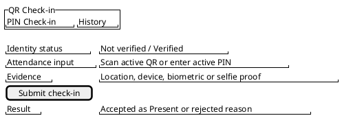

Trace: Student; UC02, UC03, UC04.

#### **LecturerInterface wireframes**

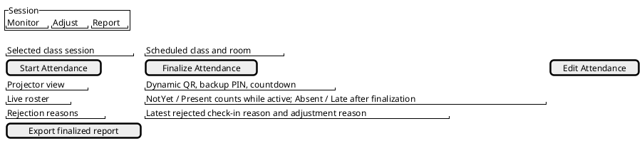

Trace: Lecturer; UC05a, UC05b, UC06, UC07, UC08.

#### **AdminInterface wireframes**

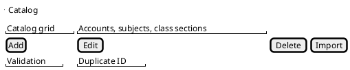

Trace: Admin; UC09a, UC09b, UC09c, UC09d.

---

## **II.2 Interaction diagrams**

The following sequence and communication diagrams realize each use case from Section I.5.2. Message wording follows the use case steps and business rules from Section I.6.

Sequence diagrams are kept to validate detailed main and alternative flows. Communication diagrams are also kept to match the SWD392 sample document style and to provide collaboration views that can be integrated in Design Modeling.

### **II.2.1 UC01 - Authenticate User**

#### **Figure II-3 Sequence diagram for UC01 - Authenticate User**

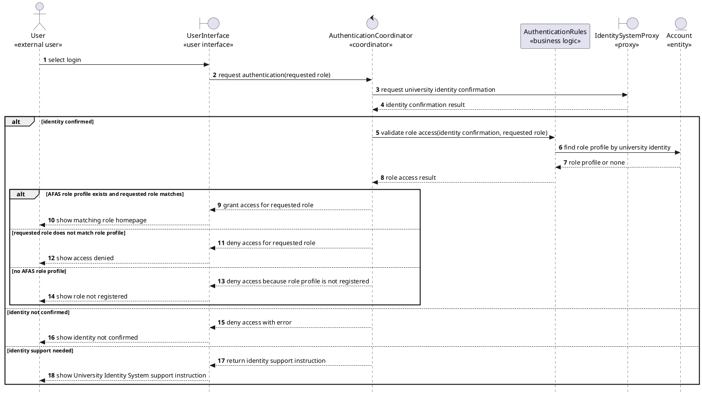
- Note: User Interface is general for all roles (Student, Lecturer, Admin).

#### **Figure II-4 Communication diagram for UC01 - Authenticate User**

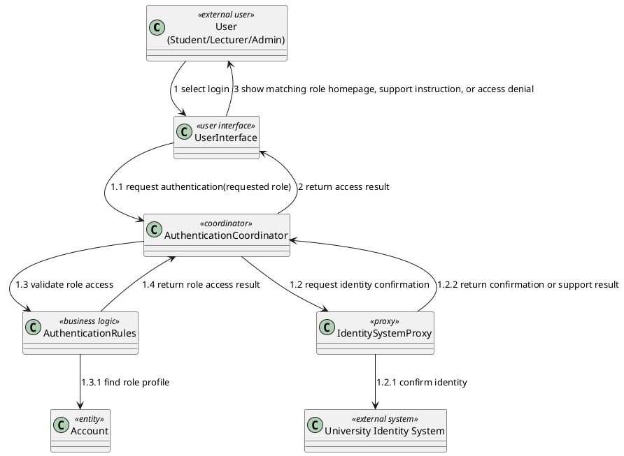

### **II.2.2 UC02 - Check In via Dynamic QR Code**

#### **Figure II-5 Sequence diagram for UC02 - Check In via Dynamic QR Code**

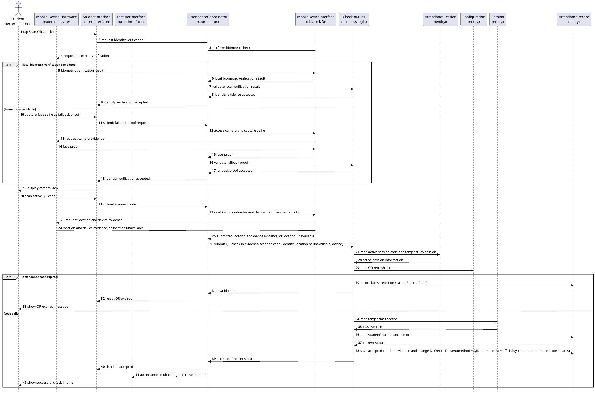

#### **Figure II-6 Communication diagram for UC02 - Check In via Dynamic QR Code**

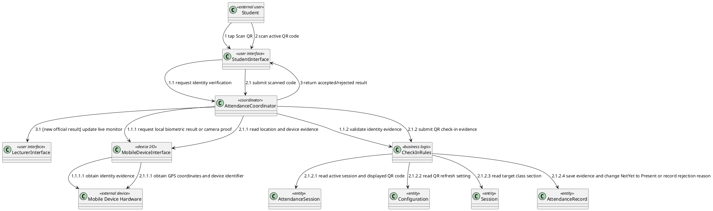

### **II.2.3 UC03 - View Personal Attendance History**

#### **Figure II-7 Sequence diagram for UC03 - View Personal Attendance History**

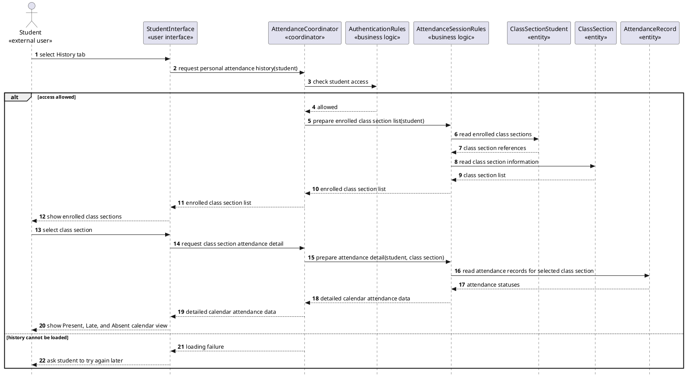

#### **Figure II-8 Communication diagram for UC03 - View Personal Attendance History**

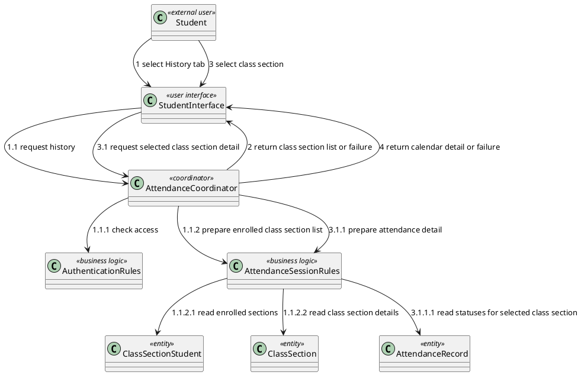

### **II.2.4 UC04 - Check In via PIN**

#### **Figure II-9 Sequence diagram for UC04 - Check In via PIN**

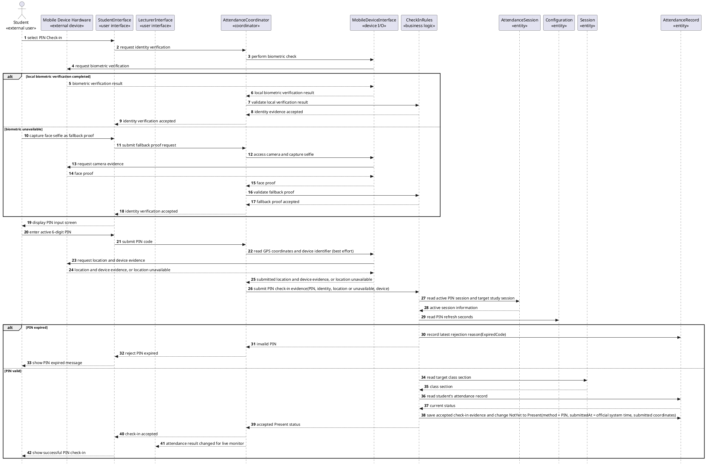

#### **Figure II-10 Communication diagram for UC04 - Check In via PIN**

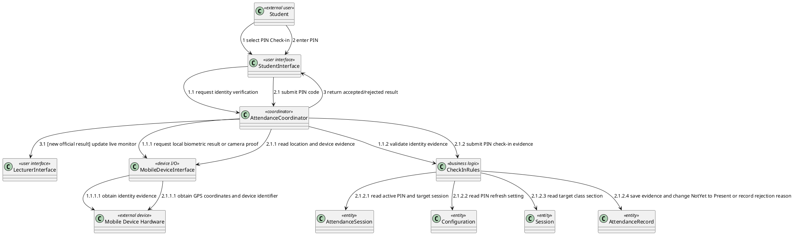

### **II.2.5a UC05a - Start Attendance Session**

#### **Figure II-11a Sequence diagram for UC05a - Start Attendance Session**

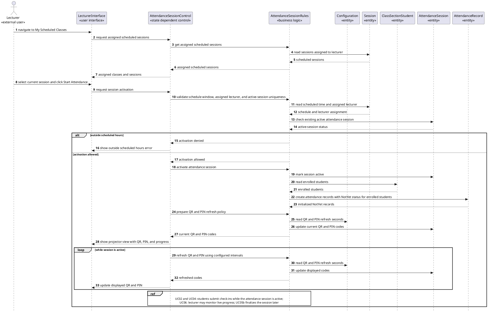

#### **Figure II-12a Communication diagram for UC05a - Start Attendance Session**

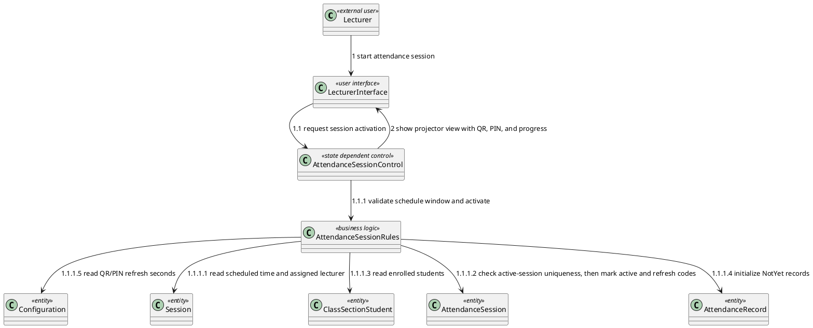

---

### **II.2.5b UC05b - Finalize Attendance Session**

#### **Figure II-11b Sequence diagram for UC05b - Finalize Attendance Session**

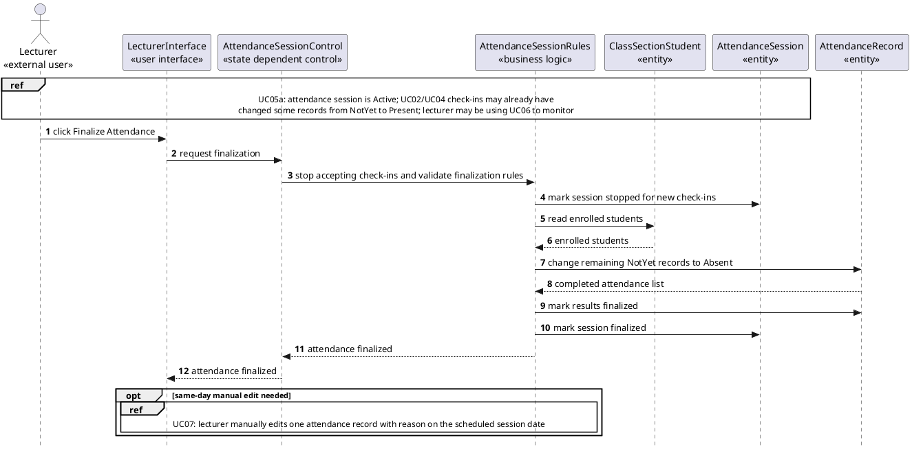

#### **Figure II-12b Communication diagram for UC05b - Finalize Attendance Session**

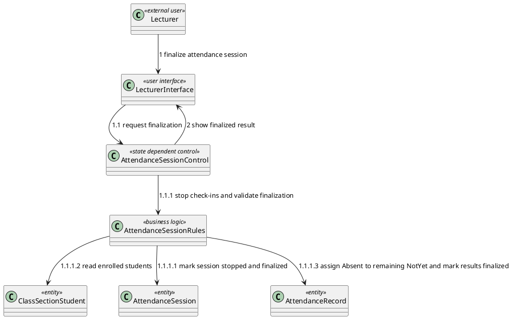

---
### **II.2.6 UC06 - Monitor Attendance in Real Time**

#### **Figure II-13 Sequence diagram for UC06 - Monitor Attendance in Real Time**

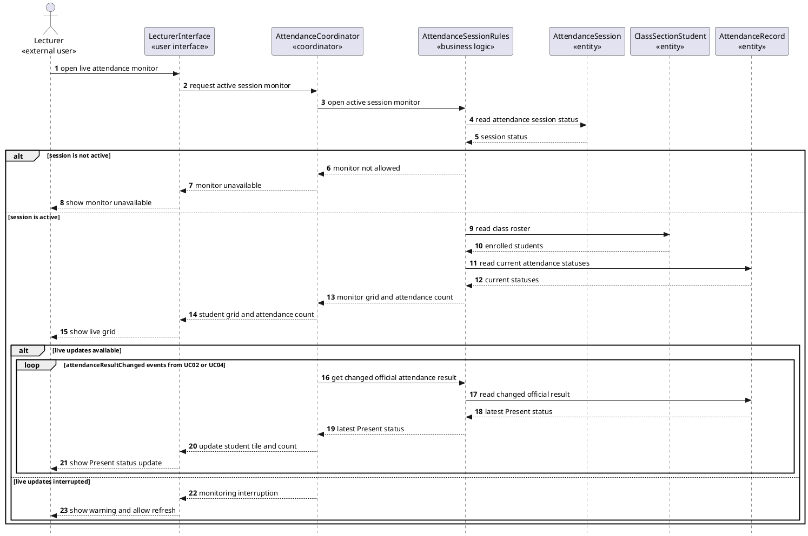

The monitor interaction is modeled at the business-event level only: accepted QR and PIN check-ins change a `NotYet` record to `Present`, and AttendanceCoordinator updates the lecturer view from that change. The concrete delivery mechanism is deferred to Design Modeling.

#### **Figure II-14 Communication diagram for UC06 - Monitor Attendance in Real Time**

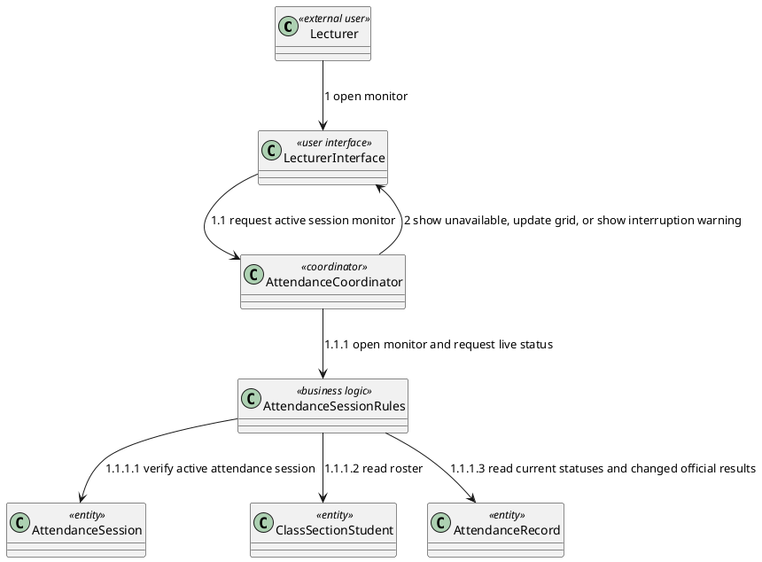

### **II.2.7 UC07 - Adjust Attendance Manually**

#### **Figure II-15 Sequence diagram for UC07 - Adjust Attendance Manually**

```plantuml
@startuml
skinparam style strictuml
autonumber
actor "Lecturer\n«external user»" as Lecturer
participant "LecturerInterface\n«user interface»" as LecturerUI
participant "AttendanceCoordinator\n«coordinator»" as AdjustmentControl
participant "AttendanceSessionRules\n«business logic»" as SessionRules
participant "Session\n«entity»" as Session
participant "ClassSectionStudent\n«entity»" as ClassSectionStudent
participant "AttendanceRecord\n«entity»" as AttendanceRecord

Lecturer -> LecturerUI : select student and click Edit Attendance
LecturerUI -> AdjustmentControl : request adjustment context
AdjustmentControl -> SessionRules : verify assigned lecturer, session date, and roster membership
SessionRules -> Session : read scheduled date and assigned lecturer
Session --> SessionRules : session date and lecturer assignment
SessionRules -> ClassSectionStudent : verify target student belongs to session roster
ClassSectionStudent --> SessionRules : roster entry or none

alt outside scheduled session date or unauthorized roster target
  SessionRules --> AdjustmentControl : adjustment not allowed
  AdjustmentControl --> LecturerUI : adjustment rejected
  LecturerUI --> Lecturer : show outside-session-date or unauthorized adjustment message
else adjustment context allowed
  SessionRules -> AttendanceRecord : read current status and check-in evidence if any
  AttendanceRecord --> SessionRules : current status and evidence
  SessionRules --> AdjustmentControl : manual edit allowed with current status and evidence
  AdjustmentControl --> LecturerUI : show status choices, reason field, and evidence summary
  Lecturer -> LecturerUI : select corrected status, enter reason, and save
  LecturerUI -> AdjustmentControl : submit manual edit(new status, reason)

  alt reason is missing
    AdjustmentControl --> LecturerUI : reason required
    LecturerUI --> Lecturer : prompt to write reason
  else reason provided
    AdjustmentControl -> SessionRules : save manual edit(new status, reason)
    SessionRules -> AttendanceRecord : update official status(ResultSource = ManualAdjustment, adjustment reason)
    SessionRules --> AdjustmentControl : manual edit saved
    AdjustmentControl --> LecturerUI : manual edit saved
    LecturerUI --> Lecturer : show updated status
  end
end
@enduml
```

#### **Figure II-16 Communication diagram for UC07 - Adjust Attendance Manually**

```plantuml
@startuml
class "Lecturer" as Lecturer <<external user>>
class "LecturerInterface" as LecturerUI <<user interface>>
class "AttendanceCoordinator" as AdjustmentControl <<coordinator>>
class "AttendanceSessionRules" as SessionRules <<business logic>>
class "Session" as Session <<entity>>
class "ClassSectionStudent" as ClassSectionStudent <<entity>>
class "AttendanceRecord" as AttendanceRecord <<entity>>

Lecturer --> LecturerUI : 1 select student and save manual edit
LecturerUI --> AdjustmentControl : 1.1 request context / submit adjustment
AdjustmentControl --> SessionRules : 1.1.1 verify lecturer permission, session date, and roster entry
SessionRules --> Session : 1.1.1.1 read scheduled date and assigned lecturer
SessionRules --> ClassSectionStudent : 1.1.1.2 verify roster entry
SessionRules --> AttendanceRecord : 1.1.1.3 read status and evidence, then update official status with reason
AdjustmentControl --> LecturerUI : 2 show success, missing reason, or rejected adjustment
@enduml
```

### **II.2.8 UC08 - Export Attendance Report**

#### **Figure II-17 Sequence diagram for UC08 - Export Attendance Report**

```plantuml
@startuml
skinparam style strictuml
autonumber
actor "Lecturer\n«external user»" as Lecturer
participant "LecturerInterface\n«user interface»" as LecturerUI
participant "AttendanceCoordinator\n«coordinator»" as ReportControl
participant "AttendanceSessionRules\n«business logic»" as ReportRules
participant "ClassSectionStudent\n«entity»" as ClassSectionStudent
participant "Session\n«entity»" as Session
participant "AttendanceRecord\n«entity»" as AttendanceRecord

Lecturer -> LecturerUI : click Export Report
LecturerUI -> ReportControl : request attendance report(class section, semester)
ReportControl -> ReportRules : verify export uses finalized attendance results
ReportRules -> Session : read class sessions
Session --> ReportRules : session dates or none
ReportRules -> AttendanceRecord : read finalized attendance result availability
AttendanceRecord --> ReportRules : finalized records or none

alt no finalized records or no sessions exist
  ReportRules --> ReportControl : export not available
  ReportControl --> LecturerUI : show empty-state message and disable export
  LecturerUI --> Lecturer : show no records available
else finalized records exist
  ReportRules -> ClassSectionStudent : read roster
  ClassSectionStudent --> ReportRules : student roster
  ReportRules -> AttendanceRecord : read finalized Present/Late/Absent statuses, check-in modes, and rejection reasons
  AttendanceRecord --> ReportRules : official attendance matrix with evidence summary
  ReportRules --> ReportControl : prepared report content
  ReportControl --> LecturerUI : prepared report content
  LecturerUI --> Lecturer : save attendance report file locally
end
@enduml
```

#### **Figure II-18 Communication diagram for UC08 - Export Attendance Report**

```plantuml
@startuml
class "Lecturer" as Lecturer <<external user>>
class "LecturerInterface" as LecturerUI <<user interface>>
class "AttendanceCoordinator" as ReportControl <<coordinator>>
class "AttendanceSessionRules" as ReportRules <<business logic>>
class "ClassSectionStudent" as ClassSectionStudent <<entity>>
class "Session" as Session <<entity>>
class "AttendanceRecord" as AttendanceRecord <<entity>>

Lecturer --> LecturerUI : 1 click Export Report
LecturerUI --> ReportControl : 1.1 request report
ReportControl --> ReportRules : 1.1.1 verify finalized results
ReportRules --> ClassSectionStudent : 1.1.1.1 read roster
ReportRules --> Session : 1.1.1.2 read sessions
ReportRules --> AttendanceRecord : 1.1.1.3 read finalized Present/Late/Absent statuses, modes, and rejection reasons
ReportControl --> LecturerUI : 2 return report content or empty state
@enduml
```

### **II.2.9a UC09a - Manage User Accounts**

#### **Figure II-19a Sequence diagram for UC09a - Manage User Accounts**

```plantuml
@startuml
skinparam style strictuml
autonumber
actor "Admin\n«external user»" as Admin
participant "AdminInterface\n«user interface»" as AdminUI
participant "AccountManagementCoordinator\n«coordinator»" as AccountControl
participant "AccountManagementRules\n«business logic»" as AccountRules
participant "Account\n«entity»" as Account
participant "Student\n«entity»" as Student
participant "Lecturer\n«entity»" as Lecturer

Admin -> AdminUI : click "Students" or "Lecturers" menu
AdminUI -> AccountControl : request account view
AccountControl -> AccountRules : get account records
AccountRules -> Account : read account records
AccountRules -> Student : read student records when applicable
AccountRules -> Lecturer : read lecturer records when applicable
AccountRules --> AccountControl : searchable account grid
AccountControl --> AdminUI : searchable account grid
AdminUI --> Admin : show add, edit, and delete actions
Admin -> AdminUI : input account details and submit
AdminUI -> AccountControl : submit account change
AccountControl -> AccountRules : validate fields and unique identifiers
AccountRules -> Account : check identifier uniqueness

alt batch import selected
  Admin -> AdminUI : upload structured account data
  AdminUI -> AccountControl : submit batch account data
  AccountControl -> AccountRules : validate imported records
  AccountRules -> Account : record valid imported accounts
  AccountRules -> Student : record valid imported students
  AccountRules -> Lecturer : record valid imported lecturers
  AccountRules --> AccountControl : import validation result
  AccountControl --> AdminUI : import result
  AdminUI --> Admin : show imported records and validation feedback
else
  AccountRules -> Account : record account change
  AccountRules -> Student : record student change when applicable
  AccountRules -> Lecturer : record lecturer change when applicable
  AccountRules --> AccountControl : valid change recorded
  AccountControl --> AdminUI : account updated
  AdminUI --> Admin : refresh account grid
end
@enduml
```

#### **Figure II-20a Communication diagram for UC09a - Manage User Accounts**

```plantuml
@startuml
class "Admin" as Admin <<external user>>
class "AdminInterface" as AdminUI <<user interface>>
class "AccountManagementCoordinator" as AccountControl <<coordinator>>
class "AccountManagementRules" as AccountRules <<business logic>>
class "Account" as Account <<entity>>
class "Student" as Student <<entity>>
class "Lecturer" as Lecturer <<entity>>

Admin --> AdminUI : 1 manage user accounts
AdminUI --> AccountControl : 1.1 view/add/edit/delete/import accounts
AccountControl --> AccountRules : 1.1.1 retrieve, validate, and record account changes
AccountRules --> Account : 1.1.1.1 read or record account change
AccountRules --> Student : 1.1.1.2 read or record student change
AccountRules --> Lecturer : 1.1.1.3 read or record lecturer change
AccountControl --> AdminUI : 2 return updated grid or validation error
@enduml
```

---

### **II.2.9b UC09b - Manage Academic Catalog**

#### **Figure II-19b Sequence diagram for UC09b - Manage Academic Catalog**

```plantuml
@startuml
skinparam style strictuml
autonumber
actor "Admin\n«external user»" as Admin
participant "AdminInterface\n«user interface»" as AdminUI
participant "AcademicCatalogCoordinator\n«coordinator»" as CatalogControl
participant "AcademicCatalogRules\n«business logic»" as CatalogRules
participant "Subject\n«entity»" as Subject
participant "ClassSection\n«entity»" as ClassSection
participant "Lecturer\n«entity»" as Lecturer

Admin -> AdminUI : click "Subjects" or "Class Sections" menu
AdminUI -> CatalogControl : request catalog view
CatalogControl -> CatalogRules : get catalog records
CatalogRules -> Subject : read subject records when applicable
CatalogRules -> ClassSection : read class section records when applicable
CatalogRules --> CatalogControl : searchable catalog grid
CatalogControl --> AdminUI : searchable catalog grid
AdminUI --> Admin : show add, edit, and delete actions
Admin -> AdminUI : input catalog details and submit
AdminUI -> CatalogControl : submit catalog change
CatalogControl -> CatalogRules : validate fields and unique identifiers
CatalogRules -> ClassSection : check identifier uniqueness
CatalogRules -> Lecturer : check referenced lecturer exists

alt batch import selected
  Admin -> AdminUI : upload structured catalog data
  AdminUI -> CatalogControl : submit batch catalog data
  CatalogControl -> CatalogRules : validate imported records
  CatalogRules -> Subject : record valid imported subjects
  CatalogRules -> ClassSection : record valid imported class sections
  CatalogRules --> CatalogControl : import validation result
  CatalogControl --> AdminUI : import result
  AdminUI --> Admin : show imported records and validation feedback
else
  CatalogRules -> Subject : record subject change when applicable
  CatalogRules -> ClassSection : record class section change when applicable
  CatalogRules --> CatalogControl : valid change recorded
  CatalogControl --> AdminUI : catalog updated
  AdminUI --> Admin : refresh catalog grid
end
@enduml
```

#### **Figure II-20b Communication diagram for UC09b - Manage Academic Catalog**

```plantuml
@startuml
class "Admin" as Admin <<external user>>
class "AdminInterface" as AdminUI <<user interface>>
class "AcademicCatalogCoordinator" as CatalogControl <<coordinator>>
class "AcademicCatalogRules" as CatalogRules <<business logic>>
class "Subject" as Subject <<entity>>
class "ClassSection" as ClassSection <<entity>>
class "Lecturer" as Lecturer <<entity>>

Admin --> AdminUI : 1 manage academic catalog
AdminUI --> CatalogControl : 1.1 view/add/edit/delete/import subjects and class sections
CatalogControl --> CatalogRules : 1.1.1 retrieve, validate, and record catalog changes
CatalogRules --> Subject : 1.1.1.1 read or record subject change
CatalogRules --> ClassSection : 1.1.1.2 read or record class section change
CatalogRules --> Lecturer : 1.1.1.3 verify referenced lecturer
CatalogControl --> AdminUI : 2 return updated grid or validation error
@enduml
```

---

### **II.2.9c UC09c - Manage Class Roster**

#### **Figure II-19c Sequence diagram for UC09c - Manage Class Roster**

```plantuml
@startuml
skinparam style strictuml
autonumber
actor "Admin\n«external user»" as Admin
participant "AdminInterface\n«user interface»" as AdminUI
participant "ClassRosterCoordinator\n«coordinator»" as RosterControl
participant "ClassRosterRules\n«business logic»" as RosterRules
participant "ClassSectionStudent\n«entity»" as ClassSectionStudent
participant "Student\n«entity»" as Student

Admin -> AdminUI : open roster tab for a class section
AdminUI -> RosterControl : request roster view
RosterControl -> RosterRules : get roster records
RosterRules -> ClassSectionStudent : read enrolled students
RosterRules --> RosterControl : roster grid
RosterControl --> AdminUI : roster grid
AdminUI --> Admin : show enroll and remove actions
Admin -> AdminUI : select student and submit enroll or remove
AdminUI -> RosterControl : submit roster change
RosterControl -> RosterRules : validate enrollment or removal
RosterRules -> ClassSectionStudent : check existing enrollment
RosterRules -> Student : check referenced student exists

alt batch import selected
  Admin -> AdminUI : upload roster file
  AdminUI -> RosterControl : submit batch roster data
  RosterControl -> RosterRules : validate imported roster entries
  RosterRules -> ClassSectionStudent : record valid roster entries
  RosterRules --> RosterControl : import validation result
  RosterControl --> AdminUI : import result
  AdminUI --> Admin : show imported records and validation feedback
else
  RosterRules -> ClassSectionStudent : record roster change
  RosterRules --> RosterControl : valid change recorded
  RosterControl --> AdminUI : roster updated
  AdminUI --> Admin : refresh roster grid
end
@enduml
```

#### **Figure II-20c Communication diagram for UC09c - Manage Class Roster**

```plantuml
@startuml
class "Admin" as Admin <<external user>>
class "AdminInterface" as AdminUI <<user interface>>
class "ClassRosterCoordinator" as RosterControl <<coordinator>>
class "ClassRosterRules" as RosterRules <<business logic>>
class "ClassSectionStudent" as ClassSectionStudent <<entity>>
class "Student" as Student <<entity>>

Admin --> AdminUI : 1 manage class roster
AdminUI --> RosterControl : 1.1 view/enroll/remove/import roster entries
RosterControl --> RosterRules : 1.1.1 retrieve, validate, and record roster changes
RosterRules --> ClassSectionStudent : 1.1.1.1 read or record roster change
RosterRules --> Student : 1.1.1.2 verify referenced student
RosterControl --> AdminUI : 2 return updated roster or validation error
@enduml
```

---

### **II.2.9d UC09d - Schedule Class Sessions**

#### **Figure II-19d Sequence diagram for UC09d - Schedule Class Sessions**

```plantuml
@startuml
skinparam style strictuml
autonumber
actor "Admin\n«external user»" as Admin
participant "AdminInterface\n«user interface»" as AdminUI
participant "SessionSchedulingCoordinator\n«coordinator»" as ScheduleControl
participant "SessionSchedulingRules\n«business logic»" as ScheduleRules
participant "Session\n«entity»" as Session
participant "Room\n«entity»" as Room
participant "ClassSection\n«entity»" as ClassSection

Admin -> AdminUI : click "Sessions" or "Rooms" menu
AdminUI -> ScheduleControl : request schedule view
ScheduleControl -> ScheduleRules : get schedule records
ScheduleRules -> Session : read session records when applicable
ScheduleRules -> Room : read room records when applicable
ScheduleRules --> ScheduleControl : searchable schedule grid
ScheduleControl --> AdminUI : searchable schedule grid
AdminUI --> Admin : show add, edit, and delete actions
Admin -> AdminUI : input session or room details and submit
AdminUI -> ScheduleControl : submit schedule change
ScheduleControl -> ScheduleRules : validate fields and references
ScheduleRules -> ClassSection : check referenced class section exists
ScheduleRules -> Room : check referenced room exists

alt batch import selected
  Admin -> AdminUI : upload structured schedule data
  AdminUI -> ScheduleControl : submit batch schedule data
  ScheduleControl -> ScheduleRules : validate imported records
  ScheduleRules -> Session : record valid scheduled sessions
  ScheduleRules -> Room : record valid rooms
  ScheduleRules --> ScheduleControl : import validation result
  ScheduleControl --> AdminUI : import result
  AdminUI --> Admin : show imported records and validation feedback
else
  ScheduleRules -> Session : record scheduled session change
  ScheduleRules -> Room : record room change when applicable
  ScheduleRules --> ScheduleControl : valid change recorded
  ScheduleControl --> AdminUI : schedule updated
  AdminUI --> Admin : refresh schedule grid
end
@enduml
```

#### **Figure II-20d Communication diagram for UC09d - Schedule Class Sessions**

```plantuml
@startuml
class "Admin" as Admin <<external user>>
class "AdminInterface" as AdminUI <<user interface>>
class "SessionSchedulingCoordinator" as ScheduleControl <<coordinator>>
class "SessionSchedulingRules" as ScheduleRules <<business logic>>
class "Session" as Session <<entity>>
class "Room" as Room <<entity>>
class "ClassSection" as ClassSection <<entity>>

Admin --> AdminUI : 1 schedule class sessions
AdminUI --> ScheduleControl : 1.1 view/add/edit/delete/import sessions and rooms
ScheduleControl --> ScheduleRules : 1.1.1 retrieve, validate, and record schedule changes
ScheduleRules --> Session : 1.1.1.1 read or record scheduled session change
ScheduleRules --> Room : 1.1.1.2 read or record room change
ScheduleRules --> ClassSection : 1.1.1.3 verify referenced class section
ScheduleControl --> AdminUI : 2 return updated grid or validation error
@enduml
```

## **II.3 State diagrams**

### **II.3.1 AttendanceSessionControl state**

`AttendanceSessionControl` is the `«state dependent control»` object for UC05a and UC05b because it coordinates the lifecycle from scheduled session selection to active check-in and finalization. The `AttendanceSession` entity records the lifecycle state, but the state machine below belongs to the control object that governs the lifecycle.

#### **Figure II-23 State diagram for AttendanceSessionControl**

```plantuml
@startuml
skinparam style strictuml
[*] --> NotStarted
NotStarted --> Active : startAttendance [within scheduled window and no other active session]
NotStarted --> NotStarted : startAttendance [outside scheduled window or active session already exists]

Active --> Active : refreshQRCode / refreshPIN
Active --> Finalized : finalizeAttendance
Finalized --> [*]
@enduml
```

### **II.3.2 AttendanceRecord state**

`AttendanceRecord` is state-dependent for the official attendance outcome of one student in one study session. It is created as `NotYet` when the attendance session starts. Accepted student check-in changes it to `Present`; finalization changes remaining `NotYet` records to `Absent`; same-day manual edit allows the assigned lecturer to correct the official status with a required adjustment reason. `ResultSource` records whether the value came from QR, PIN, absent assignment, or manual adjustment; `RejectionReason` retains the most recent rejected check-in reason.

#### **Figure II-24 State diagram for AttendanceRecord**

```plantuml
@startuml
skinparam style strictuml
[*] --> NotYet : initializeRecord [attendance session starts]
NotYet --> Present : acceptedCheckIn [valid QR/PIN and identity evidence]
NotYet --> Absent : finalizeAttendance [student has not checked in]
Absent --> Late : manualEdit [assigned lecturer, session date, reason]
Present --> Present : manualEdit [assigned lecturer, session date, reason]
Present --> Absent : manualEdit [assigned lecturer, session date, reason]
Present --> Late : manualEdit [assigned lecturer, session date, reason]
Absent --> Present : manualEdit [assigned lecturer, session date, reason]
Absent --> Absent : manualEdit [assigned lecturer, session date, reason]
Late --> Present : manualEdit [assigned lecturer, session date, reason]
Late --> Absent : manualEdit [assigned lecturer, session date, reason]
Late --> Late : manualEdit [assigned lecturer, session date, reason]
Present --> [*]
Absent --> [*]
Late --> [*]
@enduml
```

---

## **II.4 Analysis traceability matrix**

| **Requirement / UC**                     | **Actor**                                            | **Analysis objects**                                                                                                                                                                                                                       | **Dynamic diagrams**                                              | **Business rules covered**                                                  |
| :--------------------------------------- | :--------------------------------------------------- | :----------------------------------------------------------------------------------------------------------------------------------------------------------------------------------------------------------------------------------------- | :---------------------------------------------------------------- | :-------------------------------------------------------------------------- |
| UC01 Authenticate User                   | Student, Lecturer, Admin, University Identity System | UserInterface, IdentitySystemProxy, AuthenticationCoordinator, AuthenticationRules, Account                                                                                                                                            | Figure II-3, Figure II-4                                          | BR-01                                                                       |
| UC02 Check In via Dynamic QR Code        | Student, Mobile Device Hardware                      | StudentInterface, LecturerInterface, MobileDeviceInterface, AttendanceCoordinator, CheckInRules, Configuration, AttendanceSession, Session, AttendanceRecord | Figure II-5, Figure II-6, Figure II-24              | BR-02, BR-03, BR-04, BR-05, BR-12, NF-02, NF-06        |
| UC03 View Personal Attendance History    | Student                                              | StudentInterface, AttendanceCoordinator, AuthenticationRules, AttendanceSessionRules, ClassSectionStudent, ClassSection, AttendanceRecord                                                                                            | Figure II-7, Figure II-8                                          | BR-01                                                                       |
| UC04 Check In via PIN                    | Student, Mobile Device Hardware                      | StudentInterface, LecturerInterface, MobileDeviceInterface, AttendanceCoordinator, CheckInRules, Configuration, AttendanceSession, Session, AttendanceRecord | Figure II-9, Figure II-10, Figure II-24             | BR-02, BR-03, BR-04, BR-05, BR-07, BR-12, NF-02, NF-06 |
| UC05a Start Attendance Session           | Lecturer                                             | LecturerInterface, AttendanceSessionControl, AttendanceSessionRules, Configuration, Session, ClassSectionStudent, AttendanceSession, AttendanceRecord                                                        | Figure II-11a, Figure II-12a, Figure II-23                          | BR-02, BR-10, BR-12                             |
| UC05b Finalize Attendance Session        | Lecturer                                             | LecturerInterface, AttendanceSessionControl, AttendanceSessionRules, ClassSectionStudent, AttendanceSession, AttendanceRecord                                                        | Figure II-11b, Figure II-12b, Figure II-23                          | BR-08, BR-10, BR-12                             |
| UC06 Monitor Attendance in Real Time     | Lecturer                                             | LecturerInterface, AttendanceCoordinator, AttendanceSessionRules, AttendanceSession, ClassSectionStudent, AttendanceRecord                                                                                                             | Figure II-13, Figure II-14                                        | NF-01                                                                       |
| UC07 Adjust Attendance Manually          | Lecturer                                             | LecturerInterface, AttendanceCoordinator, AttendanceSessionRules, Session, ClassSectionStudent, AttendanceRecord                                                                                                                | Figure II-15, Figure II-16, Figure II-24                          | BR-10, BR-13                                                               |
| UC08 Export Attendance Report            | Lecturer                                             | LecturerInterface, AttendanceCoordinator, AttendanceSessionRules, ClassSectionStudent, Session, AttendanceRecord                                                                                                       | Figure II-17, Figure II-18, Figure II-24                          | BR-08                                                                       |
| UC09a Manage User Accounts               | Admin                                                | AdminInterface, AccountManagementCoordinator, AccountManagementRules, Account, Student, Lecturer                                                                                  | Figure II-19a, Figure II-20a                                        | BR-01, BR-11                                                                       |
| UC09b Manage Academic Catalog            | Admin                                                | AdminInterface, AcademicCatalogCoordinator, AcademicCatalogRules, Subject, ClassSection, Lecturer                                                                                  | Figure II-19b, Figure II-20b                                        | BR-11                                                                       |
| UC09c Manage Class Roster                | Admin                                                | AdminInterface, ClassRosterCoordinator, ClassRosterRules, ClassSectionStudent, Student                                                                                  | Figure II-19c, Figure II-20c                                        | None                                                                       |
| UC09d Schedule Class Sessions            | Admin                                                | AdminInterface, SessionSchedulingCoordinator, SessionSchedulingRules, Session, Room, ClassSection                                                                                  | Figure II-19d, Figure II-20d                                        | None                                                                       |
| NF-06 Configurable attendance parameters | Student, Lecturer                                    | Configuration, CheckInRules, AttendanceSessionRules                                                                                                                                                                           | Figure II-1, Figure II-5, Figure II-9, Figure II-11a              | NF-06                                                                       |

---

## **II.5 Verification checklist against Section I**

| **Check item**                                                                                                                                            | **Status** | **Evidence in this section**                                                                                                                                                                                                  |
| :-------------------------------------------------------------------------------------------------------------------------------------------------------- | :--------- | :---------------------------------------------------------------------------------------------------------------------------------------------------------------------------------------------------------------------------- |
| UC list matches Requirement Section I.5.2                                                                                                                 | Pass       | UC01-UC04, UC05a-UC05b, UC06-UC08, UC09a-UC09d; Figures II-3 through II-20d                                                                                                                                                                                    |
| UC names match Requirement Section I.5.2                                                                                                                  | Pass       | Headings II.2.1-II.2.4, II.2.5a-II.2.5b, II.2.6-II.2.8, II.2.9a-II.2.9d                                                                                                                                                                                                        |
| Analysis uses detailed COMET stereotypes                                                                                                                  | Pass       | Figures II-1 through II-20 use `«user interface»`, `«device I/O»`, `«coordinator»`, `«state dependent control»`, `«entity»`, and `«business logic»`                                                          |
| Contextual boundary diagram contains only external participants and the AFAS black box                                                                    | Pass       | Figure II-2 contains AFAS, external users, Mobile Device Hardware, and University Identity System only                                                                                                                        |
| Static data structure is isolated from behavior views                                                                                                     | Pass       | Figure II-1 contains only entity classes and relationships; Figure II-2 contains only the contextual boundary; Section II.2 provides use-case-specific behavior diagrams                                                      |
| Mobile device hardware is represented consistently across context and interaction views                                                                   | Pass       | Figure II-2 represents Mobile Device Hardware as an external device; Figure II-5, Figure II-6, Figure II-9, and Figure II-10 use MobileDeviceInterface as the internal device I/O boundary object |
| Entity relationships distinguish lifecycle ownership where appropriate                                                                                    | Pass       | Figure II-1 uses composition for study-session-owned attendance lifecycle data and association for room location membership                                                                                            |
| Interface wireframes are included for key actor workflows                                                                                                 | Pass       | Section II.1.5 covers Student, Lecturer, and Admin wireframes with UC trace notes                                                                                                                                             |
| NF-06 configurable attendance parameters are represented in Analysis                                                                                      | Pass       | Configuration appears in Figure II-1 and is used by CheckInRules and AttendanceSessionRules                                                                                                                     |
| QR/PIN check-in changes an initialized `NotYet` record to `Present` after identity and code checks; location is informational and never blocks check-in   | Pass       | Figures II-5, II-9, and II-24                                                                                                                                                                                                  |
| Attendance records are initialized as `NotYet` when the attendance session starts                                                                          | Pass       | Figure II-11a and Figure II-24                                                                                                                                                                                                  |
| Latest rejection reason is retained on the attendance record for lecturer review                                                                          | Pass       | Figures II-5, II-9, II-11, II-24                                                                                                                                                                                              |
| UC05a/UC05b together include start, active check-in, and finalize action that stops check-ins and changes remaining `NotYet` records to `Absent` | Pass       | Figure II-11a, Figure II-11b, and Figure II-23                                                                                                                                                                                                 |
| UC07 allows the assigned lecturer to manually edit an attendance status only on the scheduled session date with a reason                                    | Pass       | Figure II-15 and Figure II-24                                                                                                                                                                                                 |
| UC06 separates inactive sessions from interrupted live updates                                                                                            | Pass       | Figure II-13                                                                                                                                                                                                                  |
| UC08 exports only finalized attendance results                                                                                                            | Pass       | Figure II-17 and Figure II-24                                                                                                                                                                                                 |
| Official attendance results exclude Rejected status                                                                                                       | Pass       | Figure II-1, Figure II-24                                                                                                                                                                                                     |
| Location model supports submitted-coordinate and accuracy capture for information only (no distance computed; not used to accept or reject check-in)       | Pass       | Figure II-1, Figure II-5, Figure II-9                                                                                                                                                                                         |
| Removed untraced analysis objects and flows                                                                                                               | Pass       | Old external-login flow, lecturer location storage, untraced device lifecycle, network evidence details, and unsupported face-matching threshold are not modeled                                                              |
