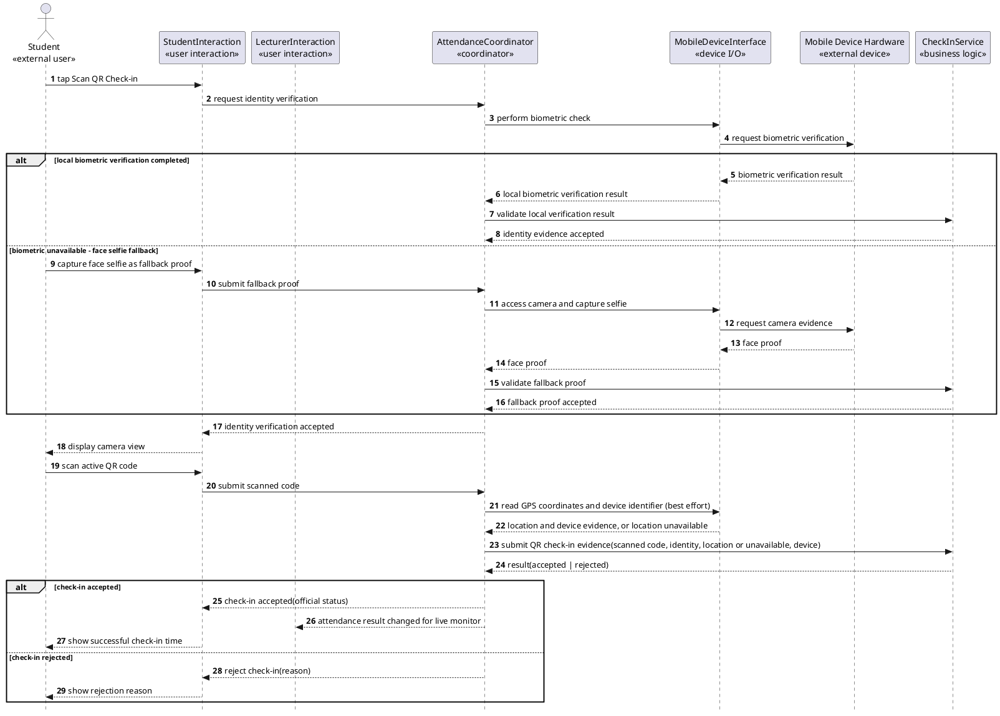
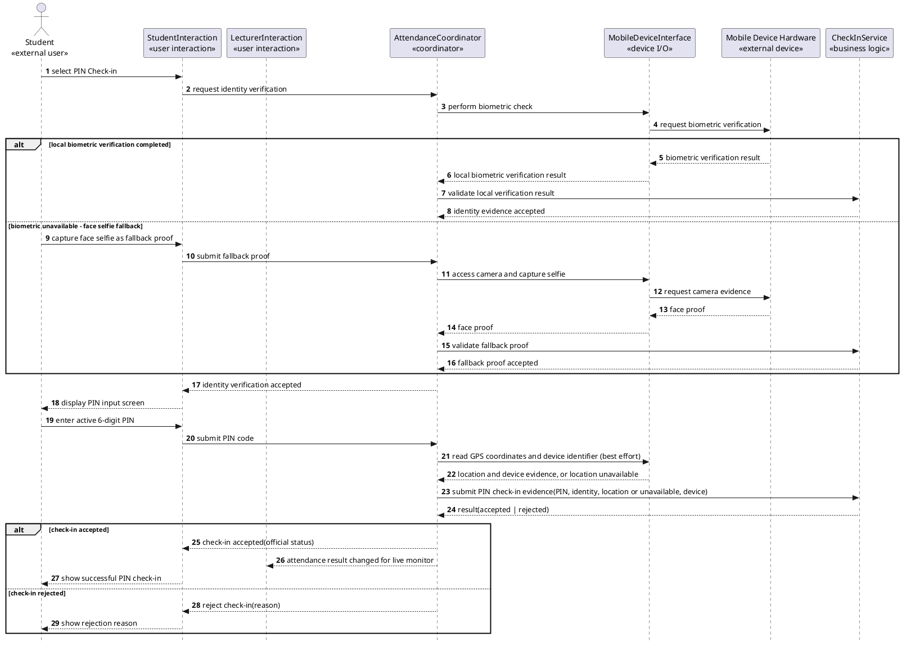
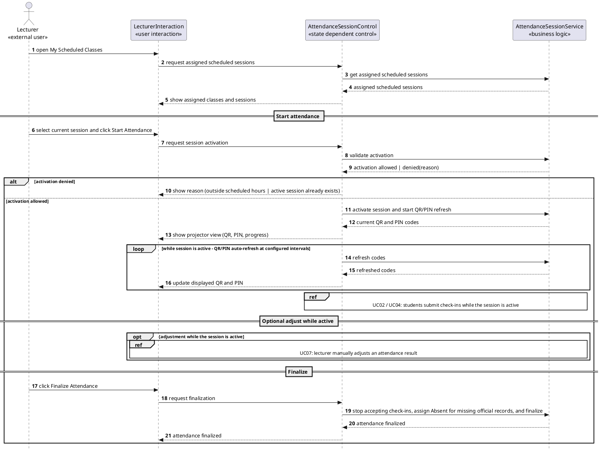

## **Sequence Diagrams (Simplified)**

This file holds simplified sequence diagrams factored out of [2_Analysis.md](2_Analysis.md). They preserve the main and key alternative flows of each use case while reducing entity-by-entity lifelines and deep `alt` nesting. The full detailed interaction diagrams (with every entity lifeline) and the communication diagrams remain in [2_Analysis.md](2_Analysis.md).

Simplification approach:

- Entity reads/writes are omitted from these diagrams instead of shown as separate entity lifelines. Full entity access is still traceable via the communication diagrams in Section II.2 of [2_Analysis.md](2_Analysis.md).
- Business rule checks are evaluated inside the `«business logic»` object, which returns a single business result. The coordinator then selects one flat outcome branch.

Scope of this file: UC02, UC04, UC05.

---

### **UC02 - Check In via Dynamic QR Code**

The rule checks (code validity and Present/Late classification) are evaluated inside `CheckInService`, which returns a single business result. The coordinator selects one flat outcome branch. Location is captured and stored for information only; it never causes a rejection and is not required. Rejection reasons are listed in the catalog below.

**Rejection reason catalog (UC02):** rules are checked in this order; the first failure sets `AttendanceRecord.RejectionReason`. Location is never a rejection reason.

| **Order** | **Reason**        | **Rule check**                                                                  | **Trace** |
| :-------- | :---------------- | :------------------------------------------------------------------------------ | :-------- |
| 1         | `ExpiredCode`     | Scanned QR is no longer valid (a newer QR has been generated at the refresh interval). | BR-02     |

---

### **UC04 - Check In via PIN**

Symmetric with UC02: identity is verified inline, then `CheckInService` evaluates all PIN rules and returns one business result, and the coordinator selects one flat outcome branch.

**Rejection reason catalog (UC04):** same order and reasons as UC02, with `ExpiredCode` meaning the entered PIN is no longer within PIN refresh seconds. Location is never a rejection reason.

| **Order** | **Reason**        | **Rule check**                                                                  | **Trace** |
| :-------- | :---------------- | :------------------------------------------------------------------------------ | :-------- |
| 1         | `ExpiredCode`     | Entered PIN is no longer within PIN refresh seconds.                            | BR-02     |

---

### **UC05 - Manage Attendance Session**

The session lifecycle (start, refresh, optional adjust handoff, and a single finalize that stops check-ins, assigns Absent, and finalizes) is coordinated by `AttendanceSessionControl`. Entity reads/writes are omitted from `AttendanceSessionService`; the repeated QR/PIN refresh is shown compactly.

