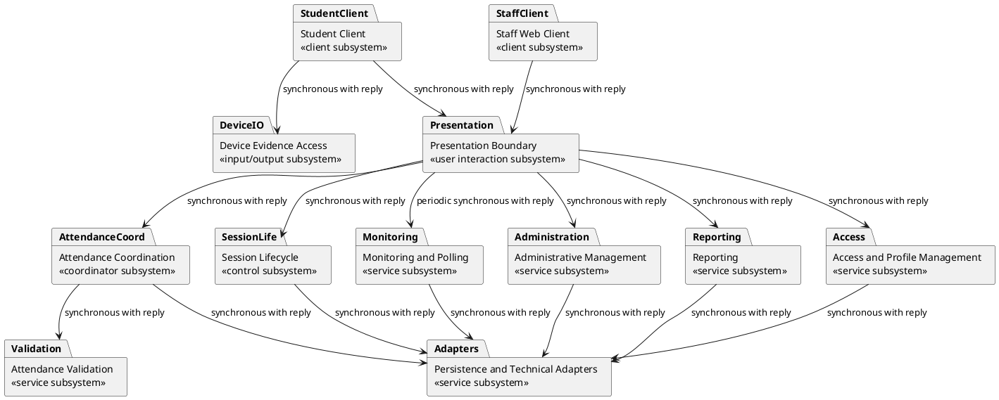
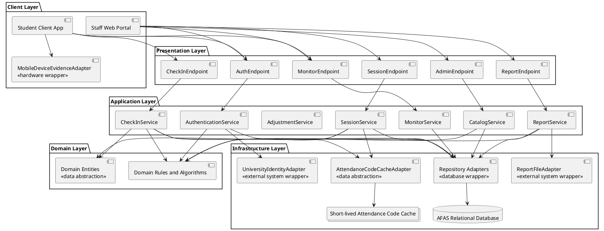
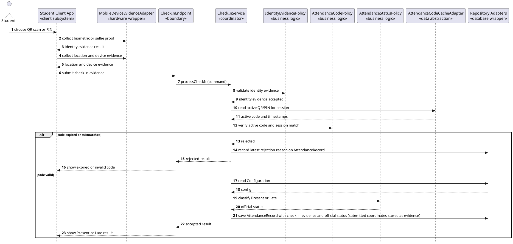
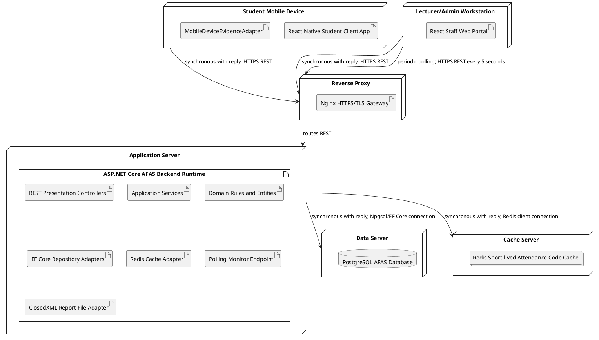
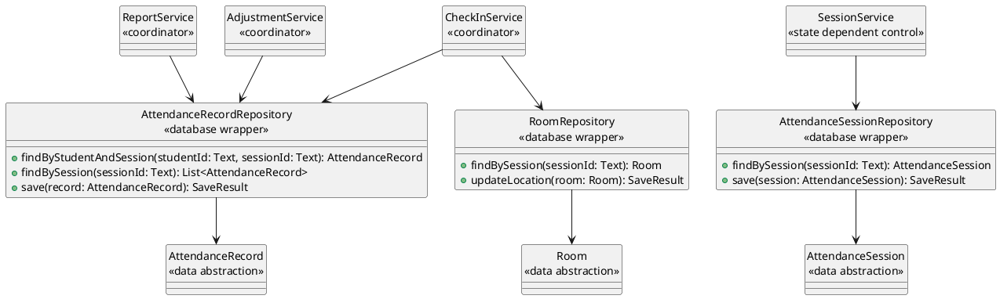

```plantuml
@startuml
skinparam style strictuml
skinparam componentStyle uml2

component "Student Client App" as StudentApp
component "Staff Web Portal" as StaffPortal
component "Device Evidence Adapter\n«hardware wrapper»" as DeviceAdapter
component "Presentation Boundary" as Presentation
component "Authentication Component" as AuthComponent
component "Attendance Component" as AttendanceComponent
component "Session Component" as SessionComponent
component "Monitoring Component" as MonitoringComponent
component "Administration Component" as AdminComponent
component "Reporting Component" as ReportingComponent
component "Persistence Component\n«database wrapper»" as Persistence
component "Attendance Code Cache\n«data abstraction»" as Cache
component "Report File Adapter\n«external system wrapper»" as ReportFile

interface "IDeviceEvidence" as IDeviceEvidence
interface "IAuthUseCases" as IAuthUseCases
interface "ICheckInUseCases" as ICheckInUseCases
interface "ISessionUseCases" as ISessionUseCases
interface "IMonitorUseCases" as IMonitorUseCases
interface "IAdminUseCases" as IAdminUseCases
interface "IReportUseCases" as IReportUseCases
interface "IRepositoryOperations" as IRepositoryOperations
interface "IAttendanceCodeStore" as IAttendanceCodeStore
interface "IReportFileWriter" as IReportFileWriter

StudentApp ..> IDeviceEvidence : requires; synchronous with reply
DeviceAdapter - IDeviceEvidence
StudentApp ..> IAuthUseCases : requires; synchronous with reply
StudentApp ..> ICheckInUseCases : requires; synchronous with reply
StudentApp ..> IMonitorUseCases : requires; synchronous with reply
StaffPortal ..> IAuthUseCases : requires; synchronous with reply
StaffPortal ..> ISessionUseCases : requires; synchronous with reply
StaffPortal ..> IMonitorUseCases : requires; periodic synchronous with reply
StaffPortal ..> IAdminUseCases : requires; synchronous with reply
StaffPortal ..> IReportUseCases : requires; synchronous with reply

Presentation - IAuthUseCases
Presentation - ICheckInUseCases
Presentation - ISessionUseCases
Presentation - IMonitorUseCases
Presentation - IAdminUseCases
Presentation - IReportUseCases

Presentation --> AuthComponent
Presentation --> AttendanceComponent
Presentation --> SessionComponent
Presentation --> MonitoringComponent
Presentation --> AdminComponent
Presentation --> ReportingComponent

AuthComponent ..> IRepositoryOperations : requires
AttendanceComponent ..> IRepositoryOperations : requires
AttendanceComponent ..> IAttendanceCodeStore : requires
SessionComponent ..> IRepositoryOperations : requires
SessionComponent ..> IAttendanceCodeStore : requires
MonitoringComponent ..> IRepositoryOperations : requires
AdminComponent ..> IRepositoryOperations : requires
ReportingComponent ..> IRepositoryOperations : requires
ReportingComponent ..> IReportFileWriter : requires

Persistence - IRepositoryOperations
Cache - IAttendanceCodeStore
ReportFile - IReportFileWriter
@enduml
```

## **III. Design Specification**

This section transforms the COMET analysis model in [2_Analysis.md](2_Analysis.md) into a solution-domain software design for AFAS. The design remains traceable to the 9 use cases UC01-UC09, business rules in Section I.6, and non-functional requirements NF-01-NF-07 in [1_Requirement.md](1_Requirement.md).

Design decisions are intentionally limited to what is required by the project statement: dynamic QR/PIN attendance, location capture for reference, identity evidence, real-time lecturer monitoring, manual adjustment, reporting, and catalog management.

---

## **III.1 Design Goals and Technology Decisions**

### **III.1.1 Quality Attribute Priorities**

| **Priority** | **Quality Attribute**       | **Requirement Source** | **Design Consequence**                                                                                                       |
| :----------- | :-------------------------- | :--------------------- | :--------------------------------------------------------------------------------------------------------------------------- |
| 1            | Performance and concurrency | NF-01, NF-07           | Keep attendance-code validation fast by caching active QR/PIN values; keep check-in path stateless at the application layer. |
| 2            | Accuracy                    | NF-02, BR-03           | Store captured location coordinates behind an explicit service; location is informational only and does not gate check-in (no distance is computed). |
| 3            | Security and privacy        | NF-04, BR-01, BR-04    | Enforce role-based access and protected attendance evidence storage.                                                         |
| 4            | Modifiability               | NF-06                  | Store QR refresh, PIN refresh, and Late threshold as configurable values.                                   |
| 5            | Usability                   | NF-03                  | Keep student check-in and lecturer session-monitoring flows short and event-driven.                                          |

### **III.1.2 Architecture Decision**

### **Decision: Modular Monolith with Client Applications, Cache, Polling Monitor, and Database Wrappers**

**Quality Attribute Priority:** Performance, modifiability, testability, and traceability.

**Chosen Option:** A modular monolith backend with separate client applications for students and staff, one owned relational persistence boundary, a cache wrapper for short-lived QR/PIN values, and a near-real-time polling endpoint for lecturer monitoring.

**Reason:** AFAS has clear internal modules but does not require independently deployable services. The peak classroom load in NF-01 justifies a cache wrapper for active attendance codes, and UC06 can be satisfied by a lightweight staff polling endpoint with a maximum 5-second refresh delay. Splitting the backend into separately deployed services or maintaining a persistent realtime channel would add deployment complexity beyond MVP needs.

**Trade-off:** The backend modules deploy together, so independent scaling by business module is limited. This is accepted because the project scope values maintainability and traceability over independent service operations.

**Traceability:** UC01-UC09; NF-01, NF-04, NF-06, NF-07; analysis controls from Section II.1.4.

### **III.1.3 Technology Mapping**

The AFAS design uses React Native for the student mobile app, React for the staff web app, and a .NET-based stack for the backend and supporting services.

| **Component**                   | **Specific Stack**                                   | **Reason**                                                                 |
| :------------------------------ | :--------------------------------------------------- | :------------------------------------------------------------------------- |
| Student mobile app              | React Native                                         | Supports cross-platform mobile UI with camera, biometric, GPS, and device evidence access. |
| Lecturer/Admin web portal       | React 18 + TypeScript                                | Supports reusable staff UI components and integrates cleanly with REST polling. |
| Backend API                     | ASP.NET Core 8 Web API                               | Provides HTTPS REST endpoints for mobile and web clients.                  |
| Application and domain services | .NET 8 modular monolith with dependency injection    | Keeps use case services and business rules separated without microservice complexity. |
| Identity integration            | ASP.NET Core OpenID Connect/JWT Bearer               | Uses a standard secure boundary for university identity confirmation.       |
| Database access                 | Entity Framework Core 8 + Npgsql                     | Maps domain entities to PostgreSQL with transactions and constraints.       |
| Relational database             | PostgreSQL 16                                        | Fits attendance, catalog, class, and enrollment relationships.              |
| Attendance code cache           | Redis 7 + StackExchange.Redis                        | Validates short-lived QR/PIN values quickly during check-in bursts.         |
| Near-real-time monitor          | ASP.NET Core REST short polling every 5 seconds      | Keeps lecturer screens current with bounded delay and simpler deployment than a persistent realtime channel. |
| Report export                   | ClosedXML                                            | Generates `.xlsx` attendance reports on the backend.                       |
| Deployment runtime              | Docker containers, Kestrel, Nginx reverse proxy      | Gives reproducible deployment and routes HTTPS REST traffic cleanly.        |

---

## **III.2 Integrated Communication Diagram**

The integrated communication diagram merges the communication diagrams from Phase 2 before subsystem partitioning. It keeps the analysis object names and stereotypes from Section II so that each design dependency can be traced back to a use case.

#### **Figure III-1 Integrated Communication Diagram for AFAS**

```plantuml
@startuml
skinparam style strictuml

object "Student\n«actor»" as Student
object "Lecturer\n«actor»" as Lecturer
object "Admin\n«actor»" as Admin
object "Mobile Device Hardware\n«actor»" as MobileHardware
object "University Identity System\n«external system»" as UIS

object "Student Mobile Interface\n«user interaction»" as StudentUI
object "Lecturer Web Interface\n«user interaction»" as LecturerUI
object "Admin Web Interface\n«user interaction»" as AdminUI
object "Mobile Device Sensor Interface\n«device I/O»" as MobileSensor
object "University Identity System Interface\n«external system interface»" as UISInterface

object "Authentication Control\n«coordinator»" as AuthControl
object "Check-in Control\n«coordinator»" as CheckInControl
object "Session Control\n«state dependent control»" as SessionControl
object "Attendance History Control\n«coordinator»" as HistoryControl
object "Monitor Control\n«coordinator»" as MonitorControl
object "Adjustment Control\n«coordinator»" as AdjustmentControl
object "Report Control\n«coordinator»" as ReportControl
object "Catalog Control\n«coordinator»" as CatalogControl

object "Authentication Rules\n«business logic»" as AuthRules
object "Attendance Code Rules\n«business logic»" as CodeRules
object "Identity Evidence Rules\n«business logic»" as IdentityRules
object "Session Rules\n«business logic»" as SessionRules
object "Attendance Status Calculation\n«business logic»" as StatusRules
object "Report Eligibility Rules\n«business logic»" as ReportRules
object "Catalog Uniqueness Rules\n«business logic»" as CatalogRules

object "Account\n«entity»" as Account
object "Student\n«entity»" as StudentEntity
object "Lecturer\n«entity»" as LecturerEntity
object "Subject\n«entity»" as Subject
object "ClassSection\n«entity»" as ClassSection
object "ClassSectionStudent\n«entity»" as ClassSectionStudent
object "Session\n«entity»" as Session
object "Room\n«entity»" as Room
object "Configuration\n«entity»" as Configuration
object "AttendanceSession\n«entity»" as AttendanceSession
object "AttendanceRecord\n«entity»" as AttendanceRecord
Student --> StudentUI : UC01, UC02, UC03, UC04
Lecturer --> LecturerUI : UC01, UC05, UC06, UC07, UC08
Admin --> AdminUI : UC01, UC09
MobileHardware --> MobileSensor : UC02, UC04
UIS --> UISInterface : UC01

StudentUI --> AuthControl : UC01 request authentication
LecturerUI --> AuthControl : UC01 request authentication
AdminUI --> AuthControl : UC01 request authentication
AuthControl --> UISInterface : UC01 confirm university identity
UISInterface --> UIS : UC01 request identity confirmation
AuthControl --> Account : UC01 read AFAS role profile
AuthControl --> AuthRules : UC01 validate role access

StudentUI --> CheckInControl : UC02/UC04 submit QR or PIN check-in
CheckInControl --> MobileSensor : UC02/UC04 collect identity, location, and device evidence
CheckInControl --> IdentityRules : UC02/UC04 validate local biometric result or selfie proof
CheckInControl --> AttendanceSession : UC02/UC04 read active attendance session
CheckInControl --> CodeRules : UC02/UC04 verify active code
CodeRules --> Configuration : UC02/UC04 read refresh parameters
CheckInControl --> Session : UC02/UC04 read class section and scheduled start time
CheckInControl --> StatusRules : UC02/UC04 classify Present or Late from official time
CheckInControl --> AttendanceRecord : UC02/UC04 save check-in evidence and set official result, or record rejection reason
CheckInControl --> MonitorControl : UC02/UC04 attendanceResultChanged

StudentUI --> HistoryControl : UC03 request attendance history
HistoryControl --> AuthRules : UC03 check access
HistoryControl --> ClassSectionStudent : UC03 read enrolled classes
HistoryControl --> AttendanceRecord : UC03 read official results

LecturerUI --> SessionControl : UC05 start, finalize session
SessionControl --> SessionRules : UC05 validate lifecycle
SessionControl --> Session : UC05 read scheduled session
SessionControl --> ClassSectionStudent : UC05 read roster
SessionControl --> AttendanceSession : UC05 update session status and active code
SessionControl --> Configuration : UC05 read refresh intervals
SessionControl --> AttendanceRecord : UC05 assign Absent and finalize

LecturerUI --> MonitorControl : UC06 view live progress
MonitorControl --> AttendanceSession : UC06 read session state
MonitorControl --> ClassSectionStudent : UC06 read roster
MonitorControl --> AttendanceRecord : UC06 read current official results

LecturerUI --> AdjustmentControl : UC07 adjust attendance status
AdjustmentControl --> SessionRules : UC07 check assigned lecturer and scheduled session date
AdjustmentControl --> AttendanceRecord : UC07 read evidence and update or create official result

LecturerUI --> ReportControl : UC08 export finalized report
ReportControl --> ReportRules : UC08 verify finalized results
ReportControl --> ClassSectionStudent : UC08 read roster
ReportControl --> Session : UC08 read sessions
ReportControl --> AttendanceRecord : UC08 read official result matrix with modes and rejection reasons

AdminUI --> CatalogControl : UC09 manage catalog
CatalogControl --> CatalogRules : UC09 validate uniqueness
CatalogControl --> Account : UC09 maintain accounts
CatalogControl --> StudentEntity : UC09 maintain students
CatalogControl --> LecturerEntity : UC09 maintain lecturers
CatalogControl --> Subject : UC09 maintain subjects
CatalogControl --> ClassSection : UC09 maintain class sections

@enduml
```

### **III.2.1 Analysis-to-Design Transformation**

| **Analysis Element**                                                        | **Design Element**                                                    | **Transformation Rule**                                                                                       | **Traceability** |
| :-------------------------------------------------------------------------- | :-------------------------------------------------------------------- | :------------------------------------------------------------------------------------------------------------ | :--------------- |
| `Student Mobile Interface`, `Lecturer Web Interface`, `Admin Web Interface` | Client UI components and Presentation endpoints                       | Analysis interface objects become client screens and server-side boundary endpoints.                          | UC01-UC09        |
| `University Identity System Interface`                                      | `UniversityIdentityAdapter` `«external system wrapper»`               | External identity confirmation is isolated from AFAS application and domain rules.                            | UC01, BR-01      |
| `Mobile Device Sensor Interface`                                            | `MobileDeviceEvidenceAdapter` `«hardware wrapper»` on the client side | Hardware access is isolated behind a wrapper for biometric, camera, location, and device evidence collection. | UC02, UC04       |
| `Authentication Control`, `Check-in Control`, `Session Control`, etc.       | Application use case services                                         | Coordinators become application services that orchestrate rules, entities, and wrappers.                      | UC01-UC09        |
| Business logic and algorithm objects                                        | Domain services and policy classes                                    | Rules become replaceable policy classes; captured location remains informational evidence and location comparison never gates attendance. | Section I.6      |
| `«entity»` classes                                                          | Domain data abstraction classes plus database wrapper repositories    | Each persistent analysis entity maps to a domain class and repository interface/implementation.               | Section II.1.1   |
| `Monitor Control`                                                           | Lecturer monitor polling endpoint and roster snapshot reader          | Lecturer screens poll the latest attendance snapshot every 5 seconds.                                      | UC06, NF-01      |

---

## **III.3 Subsystem Structuring**

Subsystem boundaries are derived from the integrated communication diagram using separation of concerns and interaction density. The backend remains one deployable system, but the internal subsystems are explicit.

#### **Figure III-2 Subsystem Diagram**

### **III.3.1 Subsystem Responsibilities**

| **Subsystem**                      | **Primary Stereotype**         | **Responsibility**                                                                                                        | **Traceability**                         |
| :--------------------------------- | :----------------------------- | :------------------------------------------------------------------------------------------------------------------------ | :--------------------------------------- |
| Student Client                     | `«client subsystem»`           | Student login, QR scan, PIN, history view, and evidence submission.                                                       | Student; UC01-UC04                       |
| Staff Web Client                   | `«client subsystem»`           | Lecturer and admin screens for session, monitor, adjustment, reports, and catalog.                                        | Lecturer, Admin; UC01, UC05-UC09         |
| Device Evidence Access             | `«input/output subsystem»`     | Access device biometric, camera/selfie, GPS, and device identifier.                                                       | Mobile Device Hardware; UC02, UC04       |
| Presentation Boundary              | `«user interaction subsystem»` | Receives client requests, validates request shape, maps to application services, returns results.                         | UC01-UC09                                |
| Access and Profile Management      | `«service subsystem»`          | University identity confirmation, role checks, and AFAS profile lookup.                                                   | UC01, BR-01                              |
| Attendance Coordination            | `«coordinator subsystem»`      | Orchestrates QR/PIN check-in, evidence validation, attendance record upsert, and official result creation. | UC02, UC04                               |
| Attendance Validation              | `«service subsystem»`          | Validates identity evidence and active QR/PIN code, and classifies Present/Late; captured location is stored as evidence only and never gates the result. | UC02, UC04, BR-02, BR-04, BR-05, BR-07, BR-12 |
| Session Lifecycle                  | `«control subsystem»`          | Governs not-started, active, and finalized attendance-session states.                                     | UC05, BR-08, BR-10                       |
| Monitoring and Polling             | `«service subsystem»`          | Serves near-real-time roster snapshots for staff polling every 5 seconds.                                                | UC06, NF-01                              |
| Administrative Management          | `«service subsystem»`          | Maintains catalog configuration.                                                                                          | UC09                                     |
| Reporting                          | `«service subsystem»`          | Generates finalized attendance reports.                                                                                   | UC08, BR-08                              |
| Persistence and Technical Adapters | `«service subsystem»`          | Implements database, cache, report file, and hardware wrappers.                                                          | All UC; NF-01, NF-04, NF-06              |

---

## **III.4 High-Level Design Views**

### **III.4.1 Static View**

The static view shows the layered modular monolith and the major components inside each layer. Domain entities and rules do not depend on technical adapters.

#### **Figure III-3 Static Architecture View**

### **III.4.2 Dynamic View**

The dynamic view maps the UC02/UC04 check-in flow to design elements. It includes the main success path and the primary rejection branches required by Phase 1 and Phase 2.

#### **Figure III-4 Dynamic Design View for QR/PIN Check-in**

### **III.4.3 Deployment View**

The deployment view keeps AFAS as one ASP.NET Core backend application runtime with separate React Native and React clients, a PostgreSQL database node, and a Redis cache node. Nginx terminates HTTPS/TLS and forwards REST traffic to the backend runtime.

#### **Figure III-5 Deployment View**

---

## **III.5 Component and Interface Design**

### **III.5.1 Component Diagram**

#### **Figure III-6 Component Diagram with Provided and Required Interfaces**

### **III.5.2 Communication Pattern Specification**

| **Connector**                                       | **COMET Communication Pattern**              | **Technology Mapping**                    | **Buffering**                                                                                                                                  | **Traceability**  |
| :-------------------------------------------------- | :------------------------------------------- | :---------------------------------------- | :--------------------------------------------------------------------------------------------------------------------------------------------- | :---------------- |
| Student Client -> Check-in use case                 | Synchronous message communication with reply | React Native client sends HTTPS REST request | No queue; client retries only after receiving an error.                                                                                        | UC02, UC04        |
| Staff Web Portal -> Session use case                | Synchronous message communication with reply | React client sends HTTPS REST request     | No queue; command is idempotent by session state check.                                                                                        | UC05              |
| Check-in Component -> Code Cache                    | Synchronous message communication with reply | StackExchange.Redis client call           | No durable buffer; cache miss falls back to stored attendance-session state.                                                                   | UC02, UC04, NF-01 |
| Staff Web Portal -> Monitor use case                | Periodic synchronous message with reply      | HTTPS REST short polling every 5 seconds  | No event buffer; each response returns the latest roster snapshot or changes since the last poll.                                             | UC06, NF-01       |
| Reporting Component -> Report File Adapter          | Synchronous message communication with reply | ClosedXML server-side `.xlsx` generation  | No queue in MVP; report generation returns success or failure to lecturer.                                                                     | UC08              |

### **III.5.3 Polling Specification for Near-Real-Time Attendance Monitor**

### **Polling Endpoint: AttendanceMonitorSnapshot**

**Producer:** Monitoring Component.

**Consumer:** Staff Web Portal.

**COMET Communication Pattern:** Periodic synchronous message with reply.

**Technology Mapping:** ASP.NET Core REST endpoint polled by the React staff web portal every 5 seconds.

**Delivery:** Staff Web Portal sends `GET /api/sessions/{sessionId}/attendance-monitor?since={lastSeenAt}` while the monitor screen is open.

**Buffering:** No server-side event buffer. The backend reads the latest persisted attendance records; if `since` is absent or stale, it returns the full current roster snapshot.

**Payload:**

- `sessionId: Text` - scheduled session receiving the update.
- `serverTime: DateTime` - backend timestamp used as the next `since` value.
- `refreshAfterSeconds: Number` - expected polling interval, default 5 seconds.
- `rosterItems: List<AttendanceMonitorItem>` - current or changed student attendance rows.
- `AttendanceMonitorItem.studentId: Text` - roster student.
- `AttendanceMonitorItem.attendanceStatus: Text` - `Present`, `Late`, `Absent`, or not yet set.
- `AttendanceMonitorItem.checkedInAt: DateTime` - official check-in timestamp when available.
- `AttendanceMonitorItem.checkInMethod: Text` - `QR`, `PIN`, `Manual`, or empty when not yet checked in.

**Freshness:** Lecturer monitor may be delayed by up to 5 seconds.

**Failure Handling:** If a poll fails, the lecturer UI keeps the last successful snapshot and retries on the next 5-second interval. Official attendance results remain saved independently of monitor refresh.

**Traceability:** UC02, UC04, UC06; Monitor Control; NF-01.

---

## **III.6 Concurrent Task Architecture**

### **III.6.1 Active and Passive Classification**

| **Task/Object**               | **Active or Passive** | **Activation**                              | **Communication Pattern**                            | **Traceability** |
| :---------------------------- | :-------------------- | :------------------------------------------ | :--------------------------------------------------- | :--------------- |
| Student Interaction Task      | Active                | Event-driven by student actions             | Synchronous with reply                               | UC01-UC04        |
| Staff Interaction Task        | Active                | Event-driven by lecturer/admin actions      | Synchronous with reply and periodic polling          | UC05-UC09        |
| Attendance Check-in Task      | Active                | Demand-driven by submitted check-in command | Synchronous with reply                               | UC02, UC04       |
| QR/PIN Refresh Task           | Active                | Periodic while attendance session is active | Writes active code to cache and session state        | UC05, BR-02      |
| Monitor Polling Task          | Active                | Periodic every 5 seconds while monitor is open | Synchronous request/reply                         | UC06, NF-01      |
| Report Generation Task        | Active                | Demand-driven by lecturer export request    | Synchronous with reply                               | UC08             |
| Domain entities and rules     | Passive               | Run on caller task                          | In-process calls                                     | All UC           |
| Repository and cache wrappers | Passive               | Run on caller task                          | Synchronous with reply                               | All UC           |

### **Task Interface Specification: Attendance Check-in Task**

**Task Type:** Active

**Activation:** Demand-driven

**Trigger:** Internal request from `CheckInEndpoint` after a student submits QR or PIN evidence.

**Provided Interface:** `processCheckIn(command: CheckInCommand): CheckInResult`

**Required Interface:** `IAttendanceCodeStore`, `IRepositoryOperations`

**Input Messages/Data:** `CheckInCommand` with student ID, session ID, submitted code or PIN, check-in method, identity evidence result, optional submitted location (informational; may be absent when GPS is unavailable), device identifier, device display name, and submission time.

**Output Messages/Data:** `CheckInResult` with accepted/rejected/blocked status, official attendance status when accepted, and user-visible reason when rejected.

**Communication Pattern:** Synchronous with reply to the student client. Lecturer monitor observes the saved result on the next polling interval.

**Technology Mapping:** HTTPS REST request/response.

**Buffering:** No command queue in MVP; monitor refresh uses persisted attendance state.

**Traceability:** UC02, UC04; Check-in Control.

### **Task Behavior Specification: Attendance Check-in Task**

**Initial State:** Waiting for a check-in command.

**Behavior:**

1. Validate command ownership and required evidence.
2. Validate biometric or selfie proof through `IdentityEvidencePolicy`.
3. Read active QR/PIN code from `IAttendanceCodeStore`.
4. Validate code and session match through `AttendanceCodePolicy`.
5. Read configuration through repositories.
6. Classify Present/Late when accepted; store submitted location coordinates as evidence only.
7. Upsert the `AttendanceRecord` for `(StudentId, SessionId)`: save check-in evidence and official status when accepted, or record the latest rejection reason when rejected.
8. Return check-in result to the student client.

**Exception Behavior:** Expired code records the latest rejection reason. Missing or out-of-range location never blocks or rejects the check-in; it is recorded as informational evidence.

**Termination:** Ends after result is returned.

### **Task Interface Specification: QR/PIN Refresh Task**

**Task Type:** Active

**Activation:** Periodic

**Trigger:** Active attendance session started by lecturer.

**Provided Interface:** `startRefresh(sessionId)`, `stopRefresh(sessionId)`

**Required Interface:** `IAttendanceCodeStore`, `IRepositoryOperations`

**Input Messages/Data:** Session ID, QR refresh seconds, PIN refresh seconds.

**Output Messages/Data:** Active QR token, backup PIN, refreshed timestamps, countdown update.

**Communication Pattern:** Periodic internal update; staff portal reads the latest QR/PIN display state through polling.

**Technology Mapping:** ASP.NET Core hosted background service plus Redis cache write and HTTPS REST polling.

**Buffering:** Keep only latest QR/PIN value per active attendance session; older values expire based on configuration.

**Traceability:** UC05, BR-02, BR-12, NF-06.

### **Task Behavior Specification: QR/PIN Refresh Task**

**Initial State:** Idle for the selected study session.

**Behavior:**

1. Start when `SessionService.startAttendance` marks an attendance session active.
2. Read timing values from `Configuration`.
3. Generate a new QR token every configured QR refresh interval.
4. Generate a new backup PIN every configured PIN refresh interval.
5. Save latest values to cache and attendance-session state.
6. Store latest display value and countdown state for the staff portal polling endpoint.
7. Stop when lecturer finalizes the session.

**Exception Behavior:** If cache write fails, persist latest active value in attendance-session state and allow check-in validation to read from persistent state until cache recovers.

**Termination:** Stops when the attendance session is finalized.

**Concurrency Notes:** At most one refresh task is active per study session, enforced by Session Rules and attendance-session state.

---

## **III.7 Detailed Class and Interface Specifications**

### **III.7.1 Core Interface Contracts**

### **AuthenticationService**

**Responsibility:** Confirm university identity and enforce role-specific access.

**Traceability:** UC01; Authentication Control; BR-01.

| Operation         | Parameters                                                                        | Return                 | Precondition                                     | Postcondition                                                                                        | Invariant                                                  |
| :---------------- | :-------------------------------------------------------------------------------- | :--------------------- | :----------------------------------------------- | :--------------------------------------------------------------------------------------------------- | :--------------------------------------------------------- |
| `authenticate`    | `identityConfirmationRequest: IdentityConfirmationRequest`, `requestedRole: Role` | `AuthenticationResult` | User starts login and requested role is present. | University identity is confirmed, AFAS role profile is loaded, and role access is granted or denied. | A user can access only actions allowed by their AFAS role. |
| `authorizeAction` | `accountId: Text`, `action: Text`, `targetResource: Text`                         | `AuthorizationResult`  | Account is authenticated.                        | Access is granted only if role and ownership rules permit it.                                        | Authorization checks do not modify domain data.            |

### **CheckInService**

**Responsibility:** Coordinate QR/PIN check-in from evidence submission to attendance record upsert and official result creation.

**Traceability:** UC02, UC04, UC06; Check-in Control; BR-02, BR-04, BR-05, BR-07, BR-12.

| Operation                   | Parameters                           | Return              | Precondition                                                                                                                          | Postcondition                                                                                                       | Invariant                                                                                                  |
| :-------------------------- | :----------------------------------- | :------------------ | :------------------------------------------------------------------------------------------------------------------------------------ | :------------------------------------------------------------------------------------------------------------------ | :--------------------------------------------------------------------------------------------------------- |
| `processCheckIn`            | `command: CheckInCommand`            | `CheckInResult`     | Student is authenticated; active attendance session is expected; identity, device, and submitted code evidence are present. Location is optional (informational) and may be absent. | Saves the attendance record for the student and study session: saves evidence and official status when accepted, or records the latest rejection reason when rejected. | Official result status is only `Present`, `Late`, or `Absent`; a rejection is kept as `AttendanceRecord.RejectionReason`. |

### **SessionService**

**Responsibility:** Control attendance-session lifecycle and QR/PIN refresh task.

**Traceability:** UC05; Session Control; BR-02, BR-08, BR-10, BR-12.

| Operation               | Parameters                            | Return                 | Precondition                                                                                                                                 | Postcondition                                                                                 | Invariant                                                    |
| :---------------------- | :------------------------------------ | :--------------------- | :------------------------------------------------------------------------------------------------------------------------------------------- | :-------------------------------------------------------------------------------------------- | :----------------------------------------------------------- |
| `startAttendance`       | `lecturerId: Text`, `sessionId: Text` | `SessionCommandResult` | Lecturer is assigned to the class section; session is within allowed time window; no active attendance session exists for the study session. | Attendance session is active and QR/PIN refresh task starts.                                  | One study session has at most one active attendance session. |
| `finalizeAttendance`    | `lecturerId: Text`, `sessionId: Text` | `SessionCommandResult` | Attendance session is active; lecturer is assigned.                                                                                    | New QR/PIN check-ins are no longer accepted; students without Present/Late official result are assigned Absent; session becomes finalized. | Finalized results are the source for reports.                |

### **AdjustmentService**

**Responsibility:** Apply manual lecturer adjustments to official attendance results.

**Traceability:** UC07; Adjustment Control; BR-10, BR-13.

| Operation               | Parameters                                                                                    | Return             | Precondition                                                                                     | Postcondition                                                    | Invariant                                                                     |
| :---------------------- | :-------------------------------------------------------------------------------------------- | :----------------- | :----------------------------------------------------------------------------------------------- | :--------------------------------------------------------------- | :---------------------------------------------------------------------------- |
| `adjustAttendance`      | `lecturerId: Text`, `sessionId: Text`, `studentId: Text`, `newStatus: AttendanceStatus`, `reason: Text` | `AdjustmentResult` | Lecturer is assigned; current date is the scheduled session date; reason is not empty; student is on the session roster. | Creates or updates the student's attendance record to the selected official status with `ResultSource = ManualAdjustment`. | Manual adjustment changes only the single attendance record for `(StudentId, SessionId)`. |

### **ReportService**

**Responsibility:** Prepare finalized attendance report content and delegate file generation.

**Traceability:** UC08; Report Control; BR-08.

| Operation                | Parameters                                                   | Return             | Precondition                                              | Postcondition                                         | Invariant                                    |
| :----------------------- | :----------------------------------------------------------- | :----------------- | :-------------------------------------------------------- | :---------------------------------------------------- | :------------------------------------------- |
| `exportAttendanceReport` | `lecturerId: Text`, `classSectionId: Text`, `semester: Text` | `ReportFileResult` | Lecturer is assigned; finalized attendance results exist. | Returns generated report file or empty-state failure. | Reports use finalized official results only. |

### **III.7.2 Repository and Wrapper Contracts**

### **IAttendanceCodeStore**

**Responsibility:** Store and retrieve short-lived active QR/PIN values.

**Traceability:** UC02, UC04, UC05; BR-02, BR-12; NF-01.

| Operation        | Parameters                                                                                                   | Return        | Precondition                                        | Postcondition                                                    | Invariant                                                                           |
| :--------------- | :----------------------------------------------------------------------------------------------------------- | :------------ | :-------------------------------------------------- | :--------------------------------------------------------------- | :---------------------------------------------------------------------------------- |
| `getActiveCode`  | `sessionId: Text`, `method: CheckInMethod`                                                                   | `ActiveCode?` | Session ID and method are present.                  | Returns current active code with refresh timestamp, or no value. | Store keeps only short-lived active values.                                         |
| `saveActiveCode` | `sessionId: Text`, `method: CheckInMethod`, `code: Text`, `refreshedAt: DateTime`, `validitySeconds: Number` | `SaveResult`  | Attendance session is active; validity is positive. | Latest active code is available until expiry.                    | Older active values must expire and must not be accepted after the validity window. |

### **IRepositoryOperations**

**Responsibility:** Provide database wrapper operations for domain entities.

**Traceability:** Section II.1.1; UC01-UC09.

| Operation                        | Parameters                 | Return       | Precondition                                                            | Postcondition                                                       | Invariant                                                                      |
| :------------------------------- | :------------------------- | :----------- | :---------------------------------------------------------------------- | :------------------------------------------------------------------ | :----------------------------------------------------------------------------- |
| `findAccount`                    | `identity: Text`           | `Account?`   | Identity is present.                                                    | Returns account or not found.                                       | Repository hides physical database details from domain and application layers. |
| `saveAttendanceRecord`           | `record: AttendanceRecord` | `SaveResult` | Record has student and study session; official status, evidence, or rejection reason are set as applicable. | The attendance record for the student and study session is inserted or updated. | Repository hides physical database details from domain and application layers. |

---

## **III.8 Design Patterns**

### **Pattern: Strategy**

**Context:** Attendance status (Present/Late) classification.

**Problem Solved:** Status threshold rules may change when Late threshold policies change.

**Design Elements:** `AttendanceStatusPolicy`, `Configuration`.

**Quality Attribute Impact:** Improves modifiability and testability for NF-06.

**Trade-off:** Adds small indirection around simple calculations.

**Traceability:** UC02, UC04; BR-12; NF-06.

### **Pattern: Adapter**

**Context:** Database, cache, monitor polling, report file generation, and mobile device evidence access.

**Problem Solved:** Technical dependencies should not leak into domain rules or application services.

**Design Elements:** Repository Adapters `«database wrapper»`, `AttendanceCodeCacheAdapter`, `MonitorEndpoint`, `ReportFileAdapter`, `MobileDeviceEvidenceAdapter`.

**Quality Attribute Impact:** Improves modifiability, testability, and replaceability of infrastructure.

**Trade-off:** Requires interface definitions and adapter implementations.

**Traceability:** UC02, UC04-UC08; NF-01, NF-04, NF-06.

### **Pattern: Polling**

**Context:** Lecturer near-real-time monitor after accepted check-ins.

**Problem Solved:** Attendance processing should not maintain a persistent connection to each open lecturer UI instance.

**Design Elements:** `AttendanceMonitorSnapshot`, `MonitorEndpoint`, `MonitorService`, Staff Web Portal polling client.

**Quality Attribute Impact:** Supports near-real-time visibility under NF-01 with simpler deployment.

**Trade-off:** Lecturer view may be delayed by up to 5 seconds and repeated polling adds predictable read traffic.

**Traceability:** UC06, NF-01.

### **Pattern: Facade**

**Context:** Presentation Boundary endpoints exposed to client applications.

**Problem Solved:** Clients need stable use-case entry points without knowing internal modules and wrappers.

**Design Elements:** `AuthEndpoint`, `CheckInEndpoint`, `SessionEndpoint`, `MonitorEndpoint`, `AdminEndpoint`, `ReportEndpoint`.

**Quality Attribute Impact:** Improves usability, maintainability, and client decoupling.

**Trade-off:** Adds a mapping layer between transport requests and application commands.

**Traceability:** UC01-UC09.

---

## **III.9 Persistence Design**

The persistence model maps the analysis entity class diagram in Figure II-1 to a relational schema. Design names preserve Phase 2 entity meaning while converting attributes to table columns and constraints.

### **III.9.1 Table Mapping**

| **Table**                   | **Primary Key**                  | **Important Columns**                                                                                                                                                                                                                                                                              | **Key Constraints / Traceability**                                                                                    |
| :-------------------------- | :------------------------------- | :------------------------------------------------------------------------------------------------------------------------------------------------------------------------------------------------------------------------------------------------------------------------------------------------- | :-------------------------------------------------------------------------------------------------------------------- |
| `accounts`                  | `id`                             | `university_identity_code`, `email`, `full_name`, `role`, `registration_date`                                                                                                                                                                                                                      | Unique `university_identity_code`; UC01, UC09, BR-01, BR-11                                                           |
| `students`                  | `student_id`                     | `account_id`                                                                                                                                                                                                                                                                                       | FK to `accounts`; UC01, UC03, UC09                                                                                    |
| `lecturers`                 | `lecturer_id`                    | `account_id`, `department_name`                                                                                                                                                                                                                                                                    | FK to `accounts`; UC01, UC05-UC09                                                                                     |
| `rooms`                     | `room_id`                        | `room_name`, `latitude`, `longitude`                                                                                                                                                                                                                                                               | UC02, UC04, BR-03                                                                                                    |
| `subjects`                  | `subject_code`                   | `subject_name`, `credits`                                                                                                                                                                                                                                                                          | `credits > 0`; UC09, BR-11                                                                                            |
| `class_sections`            | `class_section_id`               | `class_section_name`, `subject_code`, `lecturer_id`, `semester`                                                                                                                                                                                                                                    | FK to subject and lecturer; UC05-UC09                                                                                 |
| `class_section_students`    | `(class_section_id, student_id)` | none beyond keys                                                                                                                                                                                                                                                                                   | Composite PK prevents duplicate enrollment; UC03, UC05, UC06, UC08                                                    |
| `sessions`                  | `session_id`                     | `class_section_id`, `room_id`, `session_date`, `start_time`, `end_time`                                                                                                                                                                                                                            | FK to class section and room; UC05                                                                                    |
| `configurations` | `configuration_code`             | `qr_refresh_seconds`, `pin_refresh_seconds`, `late_threshold_minutes`, `campus_boundary`                                                                                                                                                                                                           | Attendance parameters are configurable; campus boundary is reference information for location evidence; NF-06          |
| `attendance_sessions`       | `session_id`                     | `dynamic_token`, `qr_refreshed_at`, `pin_code`, `pin_refreshed_at`, `session_status`                                                                                                                                                                                                               | One attendance session per scheduled session; UC05, BR-02, BR-10                                                      |
| `attendance_records`        | `attendance_record_id`           | `student_id`, `session_id`, `check_in_method` (nullable), `submitted_at` (nullable), `submitted_latitude` (nullable), `submitted_longitude` (nullable), `location_accuracy_meters` (nullable), `device_identifier` (nullable), `device_display_name` (nullable), `face_evidence_reference` (nullable), `attendance_status` (nullable until set), `result_source`, `rejection_reason` (nullable), `finalized_at` (nullable) | Location columns are nullable and informational only (no distance computed) and never drive the result; `attendance_status` limited to `Present`, `Late`, `Absent`; UC02, UC04, UC05, UC07, UC08 |

### **III.9.2 Database Wrapper Classes**

---

## **III.10 Quality Attribute Trade-offs**

| **Quality Attribute** | **Architectural Mechanism**                                                                               | **Design Evidence**                                                             | **Trade-off**                                              | **Traceability**               |
| :-------------------- | :-------------------------------------------------------------------------------------------------------- | :------------------------------------------------------------------------------ | :--------------------------------------------------------- | :----------------------------- |
| Performance           | Cache active QR/PIN values and keep backend application services stateless.                               | `AttendanceCodeCacheAdapter`, `IAttendanceCodeStore`, QR/PIN Refresh Task.      | Cache consistency and fallback handling must be designed.  | UC02, UC04, UC05; NF-01        |
| Scalability           | Modular monolith can scale by adding application server instances while keeping one persistence boundary. | Deployment view and stateless check-in service.                                 | Does not provide independent module deployment.            | NF-07                          |
| Accuracy              | Captured location coordinates are stored as reference only.             | `attendance_records.submitted_latitude/longitude`.                            | Location is informational only, so GPS error never affects the check-in result. | UC02, UC04; NF-02, BR-03       |
| Security and privacy  | Role authorization and protected evidence reference.                                                      | `AuthenticationService`, `AdjustmentService`, face evidence reference.          | More validation and storage policy rules are required.     | UC01, UC02, UC04, UC07; NF-04  |
| Modifiability         | Layered modules, adapter pattern, strategy pattern, configurable parameters.                              | Component diagram, interface contracts, `configurations`.            | More interfaces than a direct CRUD design.                 | NF-06                          |
| Testability           | Domain rules and wrappers are behind interfaces.                                                          | `IRepositoryOperations`, `IAttendanceCodeStore`, policies and strategies.       | Requires mocks or fakes in tests.                          | UC02-UC09                      |
| Traceability          | UC labels in integrated communication and tables.                                                         | Figure III-1 and traceability matrix.                                           | Documentation must be maintained when requirements change. | UC01-UC09                      |

---

## **III.11 Design Traceability Matrix**

| **Requirement / UC**                  | **Actor**                                            | **Analysis Objects**                                                                                                                                                                                                                                                                               | **Design Elements**                                                                                                                                | **Design Diagrams / Contracts**                                   |
| :------------------------------------ | :--------------------------------------------------- | :------------------------------------------------------------------------------------------------------------------------------------------------------------------------------------------------------------------------------------------------------------------------------------------------- | :------------------------------------------------------------------------------------------------------------------------------------------------- | :---------------------------------------------------------------- |
| UC01 Authenticate User                | Student, Lecturer, Admin, University Identity System | UserInterface, University Identity System Interface, Authentication Control, Authentication Rules, Account                                                                                                                                                                                       | Access and Profile Management, AuthenticationService, UniversityIdentityAdapter, AuthEndpoint, Account repository                                  | Figures III-1, III-3, III-6; AuthenticationService contract       |
| UC02 Check In via Dynamic QR Code     | Student                                              | Student Mobile Interface, Mobile Device Sensor Interface, Check-in Control, Identity Evidence Rules, Attendance Code Rules, Attendance Status Calculation, AttendanceSession, Session, ClassSectionStudent, AttendanceRecord, Monitor Control | Student Client, Device Evidence Adapter, Attendance Component, Validation policies, Code Cache, Repository Adapters, Monitor polling read model | Figures III-1, III-4, III-6; CheckInService, IAttendanceCodeStore |
| UC03 View Personal Attendance History | Student                                              | Student Mobile Interface, Attendance History Control, Authentication Rules, ClassSectionStudent, AttendanceRecord                                                                                                                                                                                  | Student Client, Presentation Boundary, repository read operations                                                                                  | Figures III-1, III-3, III-6                                       |
| UC04 Check In via PIN                 | Student                                              | Student Mobile Interface, Mobile Device Sensor Interface, Check-in Control, Identity Evidence Rules, Attendance Code Rules, Attendance Status Calculation, AttendanceSession, Session, ClassSectionStudent, AttendanceRecord, Monitor Control | Same as UC02 with `checkInMethod = PIN` and PIN refresh values                                                                                     | Figures III-1, III-4, III-6; CheckInService, QR/PIN Refresh Task  |
| UC05 Manage Attendance Session        | Lecturer                                             | Lecturer Web Interface, Session Control, Session Rules, Attendance Code Rules, Configuration, Session, ClassSectionStudent, AttendanceSession, AttendanceRecord                                                                                                                          | Staff Web Client, Session Lifecycle, SessionService, QR/PIN Refresh Task, Code Cache                                                               | Figures III-1, III-2, III-6; SessionService contract              |
| UC06 Monitor Attendance in Real Time  | Lecturer                                             | Lecturer Web Interface, Monitor Control, AttendanceSession, ClassSectionStudent, AttendanceRecord                                                                                                                                                                                                  | Monitoring and Polling subsystem, MonitorEndpoint, AttendanceMonitorSnapshot                                                                       | Figures III-1, III-6; polling specification                       |
| UC07 Adjust Attendance Manually       | Lecturer                                             | Lecturer Web Interface, Adjustment Control, Session Rules, Session, ClassSectionStudent, AttendanceRecord                                                                                                                                                                         | AdjustmentService, Repository Adapters                                                                                                             | Figures III-1, III-6; AdjustmentService contract                  |
| UC08 Export Attendance Report         | Lecturer                                             | Lecturer Web Interface, Report Control, Report Eligibility Rules, ClassSectionStudent, Session, AttendanceRecord                                                                                                                                                                   | Reporting subsystem, ReportService, ReportFileAdapter                                                                                              | Figures III-1, III-6; ReportService contract                      |
| UC09 Manage System Catalog            | Admin                                                | Admin Web Interface, Catalog Control, Catalog Uniqueness Rules, Account, Student, Lecturer, Subject, ClassSection                                                                                                                                                                                  | Administrative Management, CatalogService, Repository Adapters                                                                                     | Figures III-1, III-6; persistence mapping                         |
| NF-01 Performance and concurrency     | Student, Lecturer                                    | Attendance Code Rules, Monitor Control, AttendanceSession                                                                                                                                                                                                                                          | Attendance Code Cache, QR/PIN Refresh Task, Monitor polling endpoint                                                                               | Figures III-3, III-5, III-6; TIS/TBS                              |
| NF-06 Configurability                 | Student, Lecturer                                    | Configuration, Attendance Code Rules, Attendance Status Calculation                                                                                                                                                         | `configurations`, SessionService, policy classes                                                                                         | Figures III-1, III-3; persistence mapping                         |

---

## **III.12 Design Validation Checklist**

| **Check item**                                                                                | **Status** | **Evidence**                                                                                                                                                                                                            |
| :-------------------------------------------------------------------------------------------- | :--------- | :---------------------------------------------------------------------------------------------------------------------------------------------------------------------------------------------------------------------- |
| Integrated communication diagram is produced before subsystem partitioning.                   | Pass       | Section III.2 precedes Section III.3.                                                                                                                                                                                   |
| Design elements trace backward to analysis objects and use cases.                             | Pass       | Figure III-1, Section III.2.1, Section III.11.                                                                                                                                                                          |
| Subsystems use COMET subsystem stereotypes.                                                   | Pass       | Figure III-2.                                                                                                                                                                                                           |
| Architecture complexity is justified by NFRs.                                                 | Pass       | Section III.1 and Section III.10 justify cache and 5-second monitor polling using NF-01/NF-07.                                                                                                             |
| COMET communication patterns are selected before or with technology mapping.                  | Pass       | Section III.5.2 and deployment connectors.                                                                                                                                                                              |
| Active/passive tasks are explicit and active tasks include TIS/TBS.                           | Pass       | Section III.6.                                                                                                                                                                                                          |
| Near-real-time monitor polling defines refresh interval, payload, and failure handling.       | Pass       | Section III.5.3.                                                                                                                                                                                                        |
| Interfaces include operation, parameters, return, precondition, postcondition, and invariant. | Pass       | Section III.7.                                                                                                                                                                                                          |
| Database and technical dependencies are isolated through wrappers.                            | Pass       | Figures III-3, III-6, and III-9.2.                                                                                                                                                                                      |
| Persistence mapping preserves Phase 2 entity names and business meanings.                     | Pass       | Section III.9 maps all entity classes from Figure II-1.                                                                                                                                                                 |
| Official attendance result does not use rejected status.                                      | Pass       | CheckInService invariant and `attendance_records` constraints.                                                                                                                                                          |
| Unsupported older design items are removed.                                                   | Pass       | Authentication uses the existing University Identity System, attendance lifecycle uses Phase 2 `AttendanceSession`, device identifier is evidence only, and location coordinates are captured as evidence only with no distance computed (informational; it does not gate check-in). |
