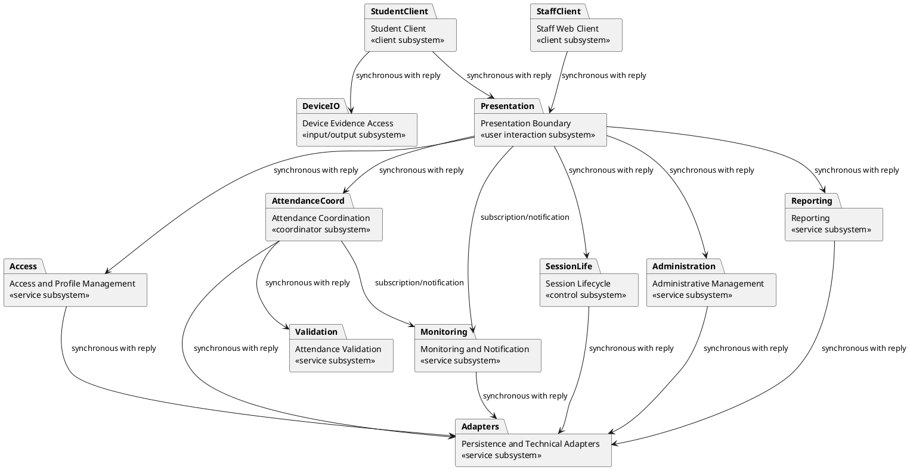
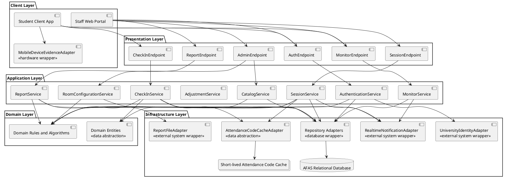
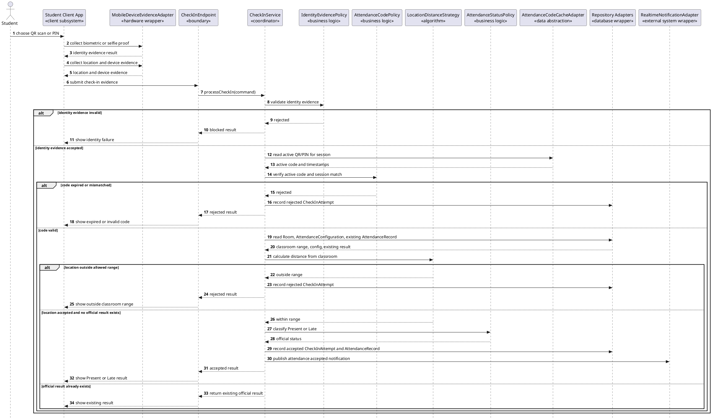
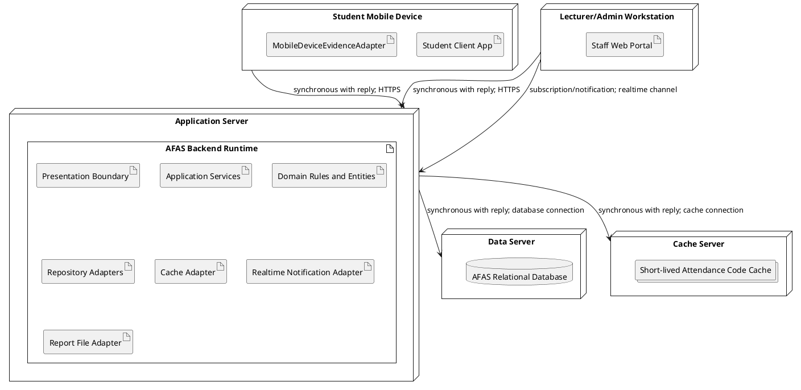
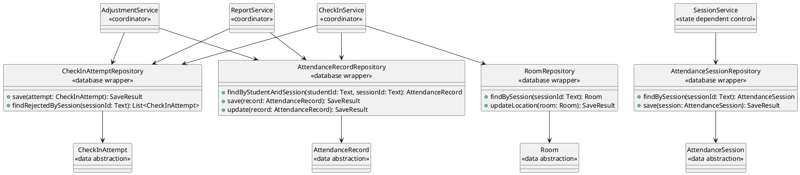

## **III. Design Specification**

This section transforms the COMET analysis model in [2_Analysis.md](2_Analysis.md) into a solution-domain software design for AFAS. The design remains traceable to the 10 use cases UC01-UC10, business rules in Section I.6, and non-functional requirements NF-01-NF-07 in [1_Requirement.md](1_Requirement.md).

Design decisions are intentionally limited to what is required by the project statement: dynamic QR/PIN attendance, location validation, identity evidence, real-time lecturer monitoring, manual adjustment, reporting, catalog management, and classroom configuration.

---

## **III.1 Design Goals and Technology Decisions**

### **III.1.1 Quality Attribute Priorities**

| **Priority** | **Quality Attribute**       | **Requirement Source** | **Design Consequence**                                                                                                       |
| :----------- | :-------------------------- | :--------------------- | :--------------------------------------------------------------------------------------------------------------------------- |
| 1            | Performance and concurrency | NF-01, NF-07           | Keep attendance-code validation fast by caching active QR/PIN values; keep check-in path stateless at the application layer. |
| 2            | Accuracy                    | NF-02, BR-03           | Isolate location-distance calculation and classroom radius configuration behind explicit validation services.                |
| 3            | Security and privacy        | NF-04, BR-01, BR-04    | Enforce role-based access and protected attendance evidence storage.                                                         |
| 4            | Modifiability               | NF-06                  | Store QR validity, PIN refresh, Late threshold, and default radius as configurable values.                                   |
| 5            | Usability                   | NF-03                  | Keep student check-in and lecturer session-monitoring flows short and event-driven.                                          |

### **III.1.2 Architecture Decision**

### **Decision: Modular Monolith with Client Applications, Cache, Realtime Notification, and Database Wrappers**

**Quality Attribute Priority:** Performance, modifiability, testability, and traceability.

**Chosen Option:** A modular monolith backend with separate client applications for students and staff, one owned relational persistence boundary, a cache wrapper for short-lived QR/PIN values, and a realtime notification adapter for lecturer monitoring.

**Reason:** AFAS has clear internal modules but does not require independently deployable services. The peak classroom load in NF-01 justifies a cache wrapper for active attendance codes, and UC06 justifies a realtime notification channel. Splitting the backend into separately deployed services would add deployment and consistency complexity without direct requirement support.

**Trade-off:** The backend modules deploy together, so independent scaling by business module is limited. This is accepted because the project scope values maintainability and traceability over independent service operations.

**Traceability:** UC01-UC10; NF-01, NF-04, NF-06, NF-07; analysis controls from Section II.1.3.

### **III.1.3 Technology Mapping**

| **Design Area**                   | **Selected Mechanism**                                                         | **Justification**                                                                                                    | **Traceability**          |
| :-------------------------------- | :----------------------------------------------------------------------------- | :------------------------------------------------------------------------------------------------------------------- | :------------------------ |
| Student client                    | Mobile-first client application                                                | Supports QR scanning, PIN, biometric/selfie proof, GPS, and device evidence collection.                              | UC02, UC03, UC04          |
| Staff client                      | Web portal                                                                     | Supports lecturer and administrator workflows on desktop screens.                                                    | UC05-UC10                 |
| Backend architecture              | Modular monolith with Presentation, Application, Domain, Infrastructure layers | Keeps COMET controls, rules, entities, and wrappers separated while avoiding unnecessary service distribution.       | All UC; NF-06             |
| University identity confirmation  | External identity-system wrapper                                               | AFAS relies on the existing University Identity System for identity confirmation and keeps only local role profiles. | UC01, BR-01               |
| Persistence                       | Relational database accessed through `«database wrapper»` repositories         | Entity relationships in Figure II-1 map naturally to tables and constraints.                                         | Section II.1.1; UC01-UC10 |
| Short-lived attendance code store | Cache wrapper for active QR/PIN values                                         | Reduces repeated database reads during peak check-in bursts.                                                         | UC02, UC04, UC05; NF-01   |
| Realtime lecturer monitor         | Subscription/notification channel                                              | Lecturer view must update after accepted check-ins.                                                                  | UC06; NF-01               |
| Report file generation            | Report generator adapter                                                       | Isolates spreadsheet file formatting from attendance rules.                                                          | UC08, BR-08               |

---

## **III.2 Integrated Communication Diagram**

The integrated communication diagram merges the communication diagrams from Phase 2 before subsystem partitioning. It keeps the analysis object names and stereotypes from Section II so that each design dependency can be traced back to a use case.

#### **Figure III-1 Integrated Communication Diagram for AFAS**

```plantuml
@startuml
skinparam style strictuml

object "Student\n«actor»" as Student
object "Lecturer\n«actor»" as Lecturer
object "Admin\n«actor»" as Admin
object "Mobile Device Hardware\n«actor»" as MobileHardware
object "University Identity System\n«external system»" as UIS

object "Student Mobile Interface\n«user interaction»" as StudentUI
object "Lecturer Web Interface\n«user interaction»" as LecturerUI
object "Admin Web Interface\n«user interaction»" as AdminUI
object "Mobile Device Sensor Interface\n«device I/O»" as MobileSensor
object "University Identity System Interface\n«external system interface»" as UISInterface

object "Authentication Control\n«coordinator»" as AuthControl
object "Check-in Control\n«coordinator»" as CheckInControl
object "Session Control\n«state dependent control»" as SessionControl
object "Attendance History Control\n«coordinator»" as HistoryControl
object "Monitor Control\n«coordinator»" as MonitorControl
object "Adjustment Control\n«coordinator»" as AdjustmentControl
object "Report Control\n«coordinator»" as ReportControl
object "Catalog Control\n«coordinator»" as CatalogControl
object "Room Configuration Control\n«coordinator»" as RoomControl

object "Authentication Rules\n«business logic»" as AuthRules
object "Attendance Code Rules\n«business logic»" as CodeRules
object "Identity Evidence Rules\n«business logic»" as IdentityRules
object "Session Rules\n«business logic»" as SessionRules
object "Attendance Status Calculation\n«business logic»" as StatusRules
object "Report Eligibility Rules\n«business logic»" as ReportRules
object "Catalog Uniqueness Rules\n«business logic»" as CatalogRules
object "Room Location Setting Rules\n«business logic»" as RoomRules
object "Location Distance Calculation\n«algorithm»" as DistanceCalc

object "Account\n«entity»" as Account
object "Student\n«entity»" as StudentEntity
object "Lecturer\n«entity»" as LecturerEntity
object "Subject\n«entity»" as Subject
object "ClassSection\n«entity»" as ClassSection
object "ClassSectionStudent\n«entity»" as ClassSectionStudent
object "Session\n«entity»" as Session
object "Room\n«entity»" as Room
object "CampusZone \n«entity»" as CampusZone 
object "AttendanceConfiguration\n«entity»" as AttendanceConfig
object "AttendanceSession\n«entity»" as AttendanceSession
object "CheckInAttempt\n«entity»" as CheckInAttempt
object "AttendanceRecord\n«entity»" as AttendanceRecord
Student --> StudentUI : UC01, UC02, UC03, UC04
Lecturer --> LecturerUI : UC01, UC05, UC06, UC07, UC08
Admin --> AdminUI : UC01, UC09, UC10
MobileHardware --> MobileSensor : UC02, UC04, UC10
UIS --> UISInterface : UC01

StudentUI --> AuthControl : UC01 request authentication
LecturerUI --> AuthControl : UC01 request authentication
AdminUI --> AuthControl : UC01 request authentication
AuthControl --> UISInterface : UC01 confirm university identity
UISInterface --> UIS : UC01 request identity confirmation
AuthControl --> Account : UC01 read AFAS role profile
AuthControl --> AuthRules : UC01 validate role access

StudentUI --> CheckInControl : UC02/UC04 submit QR or PIN check-in
CheckInControl --> MobileSensor : UC02/UC04 collect identity, location, and device evidence
CheckInControl --> IdentityRules : UC02/UC04 validate local biometric result or selfie proof
CheckInControl --> AttendanceSession : UC02/UC04 read active attendance session
CheckInControl --> CodeRules : UC02/UC04 verify active code
CodeRules --> AttendanceConfig : UC02/UC04 read validity parameters
CheckInControl --> Session : UC02/UC04 read class section and scheduled start time
CheckInControl --> ClassSectionStudent : UC02/UC04 verify enrollment
CheckInControl --> Room : UC02/UC04 read coordinates and allowed range
CheckInControl --> DistanceCalc : UC02/UC04 compare submitted coordinates
CheckInControl --> StatusRules : UC02/UC04 classify Present or Late from official time
CheckInControl --> CheckInAttempt : UC02/UC04 record accepted or rejected attempt
CheckInControl --> AttendanceRecord : UC02/UC04 create one official result when accepted
CheckInControl --> MonitorControl : UC02/UC04 attendanceResultChanged

StudentUI --> HistoryControl : UC03 request attendance history
HistoryControl --> AuthRules : UC03 check access
HistoryControl --> ClassSectionStudent : UC03 read enrolled classes
HistoryControl --> AttendanceRecord : UC03 read official results

LecturerUI --> SessionControl : UC05 start, stop, reopen, finalize session
SessionControl --> SessionRules : UC05 validate lifecycle
SessionControl --> Session : UC05 read scheduled session
SessionControl --> ClassSectionStudent : UC05 read roster
SessionControl --> AttendanceSession : UC05 update session status and active code
SessionControl --> AttendanceConfiguration : UC05 read refresh intervals
SessionControl --> AttendanceRecord : UC05 assign Absent and finalize

LecturerUI --> MonitorControl : UC06 view live progress
MonitorControl --> AttendanceSession : UC06 read session state
MonitorControl --> ClassSectionStudent : UC06 read roster
MonitorControl --> AttendanceRecord : UC06 read current official results

LecturerUI --> AdjustmentControl : UC07 adjust attendance status
AdjustmentControl --> SessionRules : UC07 check assigned lecturer and editable state
AdjustmentControl --> CheckInAttempt : UC07 read rejected attempt evidence
AdjustmentControl --> AttendanceRecord : UC07 update or create official result

LecturerUI --> ReportControl : UC08 export finalized report
ReportControl --> ReportRules : UC08 verify finalized results
ReportControl --> ClassSectionStudent : UC08 read roster
ReportControl --> Session : UC08 read sessions
ReportControl --> AttendanceRecord : UC08 read official result matrix
ReportControl --> CheckInAttempt : UC08 read modes and rejected-attempt summary

AdminUI --> CatalogControl : UC09 manage catalog
CatalogControl --> CatalogRules : UC09 validate uniqueness
CatalogControl --> Account : UC09 maintain accounts
CatalogControl --> StudentEntity : UC09 maintain students
CatalogControl --> LecturerEntity : UC09 maintain lecturers
CatalogControl --> Subject : UC09 maintain subjects
CatalogControl --> ClassSection : UC09 maintain class sections

AdminUI --> RoomControl : UC10 configure classroom location
RoomControl --> MobileSensor : UC10 capture current location when calibrated on site
RoomControl --> RoomRules : UC10 validate coordinate, campus boundary, and radius
RoomRules --> CampusZone  : UC10 check university boundary
RoomControl --> Room : UC10 update room location settings
RoomControl --> AttendanceConfiguration : UC10 read default radius
@enduml
```

### **III.2.1 Analysis-to-Design Transformation**

| **Analysis Element**                                                        | **Design Element**                                                    | **Transformation Rule**                                                                                       | **Traceability** |
| :-------------------------------------------------------------------------- | :-------------------------------------------------------------------- | :------------------------------------------------------------------------------------------------------------ | :--------------- |
| `Student Mobile Interface`, `Lecturer Web Interface`, `Admin Web Interface` | Client UI components and Presentation endpoints                       | Analysis interface objects become client screens and server-side boundary endpoints.                          | UC01-UC10        |
| `University Identity System Interface`                                      | `UniversityIdentityAdapter` `«external system wrapper»`               | External identity confirmation is isolated from AFAS application and domain rules.                            | UC01, BR-01      |
| `Mobile Device Sensor Interface`                                            | `MobileDeviceEvidenceAdapter` `«hardware wrapper»` on the client side | Hardware access is isolated behind a wrapper for biometric, camera, location, and device evidence collection. | UC02, UC04, UC10 |
| `Authentication Control`, `Check-in Control`, `Session Control`, etc.       | Application use case services                                         | Coordinators become application services that orchestrate rules, entities, and wrappers.                      | UC01-UC10        |
| Business logic and algorithm objects                                        | Domain services and strategy classes                                  | Rules become replaceable policy classes; the distance algorithm becomes a strategy.                           | Section I.6      |
| `«entity»` classes                                                          | Domain data abstraction classes plus database wrapper repositories    | Each persistent analysis entity maps to a domain class and repository interface/implementation.               | Section II.1.1   |
| `Monitor Control`                                                           | Notification publisher plus lecturer monitor subscriber               | Accepted check-ins are published to the lecturer monitor using subscription/notification.                     | UC06, NF-01      |

---

## **III.3 Subsystem Structuring**

Subsystem boundaries are derived from the integrated communication diagram using separation of concerns and interaction density. The backend remains one deployable system, but the internal subsystems are explicit.

#### **Figure III-2 Subsystem Diagram**

### **III.3.1 Subsystem Responsibilities**

| **Subsystem**                      | **Primary Stereotype**         | **Responsibility**                                                                                                        | **Traceability**                         |
| :--------------------------------- | :----------------------------- | :------------------------------------------------------------------------------------------------------------------------ | :--------------------------------------- |
| Student Client                     | `«client subsystem»`           | Student login, QR scan, PIN, history view, and evidence submission.                                                       | Student; UC01-UC04                       |
| Staff Web Client                   | `«client subsystem»`           | Lecturer and admin screens for session, monitor, adjustment, reports, catalog, and classroom configuration.               | Lecturer, Admin; UC01, UC05-UC10         |
| Device Evidence Access             | `«input/output subsystem»`     | Access device biometric, camera/selfie, GPS, and device identifier.                                                       | Mobile Device Hardware; UC02, UC04, UC10 |
| Presentation Boundary              | `«user interaction subsystem»` | Receives client requests, validates request shape, maps to application services, returns results.                         | UC01-UC10                                |
| Access and Profile Management      | `«service subsystem»`          | University identity confirmation, role checks, and AFAS profile lookup.                                                   | UC01, BR-01                              |
| Attendance Coordination            | `«coordinator subsystem»`      | Orchestrates QR/PIN check-in, evidence validation, attempt recording, official result creation, and monitor notification. | UC02, UC04                               |
| Attendance Validation              | `«service subsystem»`          | Validates identity evidence, active QR/PIN code, location range, and Present/Late classification.                         | UC02, UC04, BR-02-BR-07, BR-12, BR-13    |
| Session Lifecycle                  | `«control subsystem»`          | Governs active, stopped, reopened, reviewed, and finalized attendance-session states.                                     | UC05, BR-08, BR-10                       |
| Monitoring and Notification        | `«service subsystem»`          | Pushes accepted check-in status and retrieves live roster state.                                                          | UC06, NF-01                              |
| Administrative Management          | `«service subsystem»`          | Maintains catalog and classroom location configuration.                                                                   | UC09, UC10                               |
| Reporting                          | `«service subsystem»`          | Generates finalized attendance reports.                                                                                   | UC08, BR-08                              |
| Persistence and Technical Adapters | `«service subsystem»`          | Implements database, cache, realtime, report file, and hardware wrappers.                                                 | All UC; NF-01, NF-04, NF-06              |

---

## **III.4 High-Level Design Views**

### **III.4.1 Static View**

The static view shows the layered modular monolith and the major components inside each layer. Domain entities and rules do not depend on technical adapters.

#### **Figure III-3 Static Architecture View**

### **III.4.2 Dynamic View**

The dynamic view maps the UC02/UC04 check-in flow to design elements. It includes the main success path and the primary rejection branches required by Phase 1 and Phase 2.

#### **Figure III-4 Dynamic Design View for QR/PIN Check-in**

### **III.4.3 Deployment View**

The deployment view keeps AFAS as one backend application runtime with separate client devices, a database node, and a cache node. The realtime channel is hosted by the backend runtime.

#### **Figure III-5 Deployment View**

---

## **III.5 Component and Interface Design**

### **III.5.1 Component Diagram**

#### **Figure III-6 Component Diagram with Provided and Required Interfaces**

```plantuml
@startuml
skinparam style strictuml
skinparam componentStyle uml2

component "Student Client App" as StudentApp
component "Staff Web Portal" as StaffPortal
component "Device Evidence Adapter\n«hardware wrapper»" as DeviceAdapter
component "Presentation Boundary" as Presentation
component "Authentication Component" as AuthComponent
component "Attendance Component" as AttendanceComponent
component "Session Component" as SessionComponent
component "Monitoring Component" as MonitoringComponent
component "Administration Component" as AdminComponent
component "Reporting Component" as ReportingComponent
component "Persistence Component\n«database wrapper»" as Persistence
component "Attendance Code Cache\n«data abstraction»" as Cache
component "Realtime Notification Adapter\n«external system wrapper»" as Realtime
component "Report File Adapter\n«external system wrapper»" as ReportFile

interface "IDeviceEvidence" as IDeviceEvidence
interface "IAuthUseCases" as IAuthUseCases
interface "ICheckInUseCases" as ICheckInUseCases
interface "ISessionUseCases" as ISessionUseCases
interface "IMonitorUseCases" as IMonitorUseCases
interface "IAdminUseCases" as IAdminUseCases
interface "IReportUseCases" as IReportUseCases
interface "IRepositoryOperations" as IRepositoryOperations
interface "IAttendanceCodeStore" as IAttendanceCodeStore
interface "IAttendanceNotifications" as IAttendanceNotifications
interface "IReportFileWriter" as IReportFileWriter

StudentApp ..> IDeviceEvidence : requires; synchronous with reply
DeviceAdapter - IDeviceEvidence
StudentApp ..> IAuthUseCases : requires; synchronous with reply
StudentApp ..> ICheckInUseCases : requires; synchronous with reply
StudentApp ..> IMonitorUseCases : requires; synchronous with reply
StaffPortal ..> IAuthUseCases : requires; synchronous with reply
StaffPortal ..> ISessionUseCases : requires; synchronous with reply
StaffPortal ..> IMonitorUseCases : requires; subscription/notification
StaffPortal ..> IAdminUseCases : requires; synchronous with reply
StaffPortal ..> IReportUseCases : requires; synchronous with reply

Presentation - IAuthUseCases
Presentation - ICheckInUseCases
Presentation - ISessionUseCases
Presentation - IMonitorUseCases
Presentation - IAdminUseCases
Presentation - IReportUseCases

Presentation --> AuthComponent
Presentation --> AttendanceComponent
Presentation --> SessionComponent
Presentation --> MonitoringComponent
Presentation --> AdminComponent
Presentation --> ReportingComponent

AuthComponent ..> IRepositoryOperations : requires
AttendanceComponent ..> IRepositoryOperations : requires
AttendanceComponent ..> IAttendanceCodeStore : requires
AttendanceComponent ..> IAttendanceNotifications : requires
SessionComponent ..> IRepositoryOperations : requires
SessionComponent ..> IAttendanceCodeStore : requires
SessionComponent ..> IAttendanceNotifications : requires
MonitoringComponent ..> IRepositoryOperations : requires
MonitoringComponent ..> IAttendanceNotifications : requires
AdminComponent ..> IRepositoryOperations : requires
ReportingComponent ..> IRepositoryOperations : requires
ReportingComponent ..> IReportFileWriter : requires

Persistence - IRepositoryOperations
Cache - IAttendanceCodeStore
Realtime - IAttendanceNotifications
ReportFile - IReportFileWriter
@enduml
```

### **III.5.2 Communication Pattern Specification**

| **Connector**                                       | **COMET Communication Pattern**              | **Technology Mapping**      | **Buffering**                                                                                                                                  | **Traceability**  |
| :-------------------------------------------------- | :------------------------------------------- | :-------------------------- | :--------------------------------------------------------------------------------------------------------------------------------------------- | :---------------- |
| Student Client -> Check-in use case                 | Synchronous message communication with reply | HTTPS request/response      | No queue; client retries only after receiving an error.                                                                                        | UC02, UC04        |
| Staff Web Portal -> Session use case                | Synchronous message communication with reply | HTTPS request/response      | No queue; command is idempotent by session state check.                                                                                        | UC05              |
| Check-in Component -> Code Cache                    | Synchronous message communication with reply | Cache client call           | No durable buffer; cache miss falls back to stored attendance-session state.                                                                   | UC02, UC04, NF-01 |
| Check-in Component -> Realtime Notification Adapter | Subscription/notification                    | Realtime channel event      | In-memory bounded connection buffer per lecturer session; if full, drop stale monitor refresh event and let the next snapshot repair the view. | UC06, NF-01       |
| Reporting Component -> Report File Adapter          | Synchronous message communication with reply | Server-side file generation | No queue in MVP; report generation returns success or failure to lecturer.                                                                     | UC08              |

### **III.5.3 Message Specification for Realtime Attendance Notification**

### **Message: AttendanceAcceptedNotification**

**Producer:** Attendance Component.

**Consumer:** Monitoring Component and Staff Web Portal subscribers.

**COMET Communication Pattern:** Subscription/notification.

**Technology Mapping:** Realtime event channel hosted by the backend runtime.

**Delivery:** Multicast to lecturer sessions subscribed to the same study session.

**Buffering:** Bounded per-connection buffer. If the buffer overflows, stale row-level events may be dropped and the client must request the latest roster snapshot through `getLiveRoster`.

**Payload:**

- `sessionId: Text` - scheduled session receiving the update.
- `studentId: Text` - student whose official result changed.
- `attendanceStatus: Text` - `Present` or `Late`.
- `checkedInAt: DateTime` - official check-in timestamp.
- `checkInMethod: Text` - `QR` or `PIN`.

**Ordering:** Required per `sessionId` and `studentId`.

**Failure Handling:** If delivery fails, the official attendance result remains saved; lecturer UI recovers by fetching the latest roster snapshot.

**Traceability:** UC02, UC04, UC06; Monitor Control; NF-01.

---

## **III.6 Concurrent Task Architecture**

### **III.6.1 Active and Passive Classification**

| **Task/Object**               | **Active or Passive** | **Activation**                              | **Communication Pattern**                            | **Traceability** |
| :---------------------------- | :-------------------- | :------------------------------------------ | :--------------------------------------------------- | :--------------- |
| Student Interaction Task      | Active                | Event-driven by student actions             | Synchronous with reply                               | UC01-UC04        |
| Staff Interaction Task        | Active                | Event-driven by lecturer/admin actions      | Synchronous with reply and subscription/notification | UC05-UC10        |
| Attendance Check-in Task      | Active                | Demand-driven by submitted check-in command | Synchronous with reply; publishes notification       | UC02, UC04, UC06 |
| QR/PIN Refresh Task           | Active                | Periodic while attendance session is active | Writes active code to cache and session state        | UC05, BR-02      |
| Realtime Notification Task    | Active                | Event-driven by accepted attendance result  | Subscription/notification                            | UC06, NF-01      |
| Report Generation Task        | Active                | Demand-driven by lecturer export request    | Synchronous with reply                               | UC08             |
| Domain entities and rules     | Passive               | Run on caller task                          | In-process calls                                     | All UC           |
| Repository and cache wrappers | Passive               | Run on caller task                          | Synchronous with reply                               | All UC           |

### **Task Interface Specification: Attendance Check-in Task**

**Task Type:** Active

**Activation:** Demand-driven

**Trigger:** Internal request from `CheckInEndpoint` after a student submits QR or PIN evidence.

**Provided Interface:** `processCheckIn(command: CheckInCommand): CheckInResult`

**Required Interface:** `IAttendanceCodeStore`, `IRepositoryOperations`, `IAttendanceNotifications`

**Input Messages/Data:** `CheckInCommand` with student ID, session ID, submitted code or PIN, check-in method, identity evidence result, submitted location, device identifier, device display name, and submission time.

**Output Messages/Data:** `CheckInResult` with accepted/rejected/blocked status, official attendance status when accepted, and user-visible reason when rejected.

**Communication Pattern:** Synchronous with reply to the student client; subscription/notification to lecturer monitor after accepted result.

**Technology Mapping:** HTTPS request/response plus backend realtime event channel.

**Buffering:** No command queue in MVP; notification buffering follows `AttendanceAcceptedNotification`.

**Traceability:** UC02, UC04, UC06; Check-in Control; Monitor Control.

### **Task Behavior Specification: Attendance Check-in Task**

**Initial State:** Waiting for a check-in command.

**Behavior:**

1. Validate command ownership and required evidence.
2. Validate biometric or selfie proof through `IdentityEvidencePolicy`.
3. Read active QR/PIN code from `IAttendanceCodeStore`.
4. Validate code and session match through `AttendanceCodePolicy`.
5. Read classroom range, configuration, and existing official result through repositories.
6. Calculate distance and classify Present/Late when accepted.
7. Persist `CheckInAttempt`; persist `AttendanceRecord` only when an official result can be created.
8. Publish `AttendanceAcceptedNotification` for accepted official results.
9. Return check-in result to the student client.

**Exception Behavior:** Missing location blocks submission; expired code records rejected attempt; outside range records rejected attempt; duplicate official result returns existing official result.

**Termination:** Ends after result is returned.

**Concurrency Notes:** Official attendance creation is guarded by a uniqueness constraint on `(StudentId, SessionId)` to satisfy BR-06.

### **Task Interface Specification: QR/PIN Refresh Task**

**Task Type:** Active

**Activation:** Periodic

**Trigger:** Active attendance session started by lecturer.

**Provided Interface:** `startRefresh(sessionId)`, `stopRefresh(sessionId)`

**Required Interface:** `IAttendanceCodeStore`, `IRepositoryOperations`, `IAttendanceNotifications`

**Input Messages/Data:** Session ID, QR refresh seconds, QR validity seconds, PIN refresh seconds.

**Output Messages/Data:** Active QR token, backup PIN, refreshed timestamps, countdown update.

**Communication Pattern:** Periodic internal update and subscription/notification to staff portal projector view.

**Technology Mapping:** Backend timer plus cache write and realtime event channel.

**Buffering:** Keep only latest QR/PIN value per active attendance session; older values expire based on configuration.

**Traceability:** UC05, BR-02, BR-12, NF-06.

### **Task Behavior Specification: QR/PIN Refresh Task**

**Initial State:** Idle for the selected study session.

**Behavior:**

1. Start when `SessionService.startAttendance` marks an attendance session active.
2. Read timing values from `AttendanceConfiguration`.
3. Generate a new QR token every configured QR refresh interval.
4. Generate a new backup PIN every configured PIN refresh interval.
5. Save latest values to cache and attendance-session state.
6. Notify projector view subscribers of the latest display value and countdown.
7. Stop when lecturer stops receiving check-ins or finalizes the session.

**Exception Behavior:** If cache write fails, persist latest active value in attendance-session state and allow check-in validation to read from persistent state until cache recovers.

**Termination:** Stops when the attendance session is stopped or finalized.

**Concurrency Notes:** At most one refresh task is active per study session, enforced by Session Rules and attendance-session state.

---

## **III.7 Detailed Class and Interface Specifications**

### **III.7.1 Core Interface Contracts**

### **AuthenticationService**

**Responsibility:** Confirm university identity and enforce role-specific access.

**Traceability:** UC01; Authentication Control; BR-01.

| Operation         | Parameters                                                                        | Return                 | Precondition                                     | Postcondition                                                                                        | Invariant                                                  |
| :---------------- | :-------------------------------------------------------------------------------- | :--------------------- | :----------------------------------------------- | :--------------------------------------------------------------------------------------------------- | :--------------------------------------------------------- |
| `authenticate`    | `identityConfirmationRequest: IdentityConfirmationRequest`, `requestedRole: Role` | `AuthenticationResult` | User starts login and requested role is present. | University identity is confirmed, AFAS role profile is loaded, and role access is granted or denied. | A user can access only actions allowed by their AFAS role. |
| `authorizeAction` | `accountId: Text`, `action: Text`, `targetResource: Text`                         | `AuthorizationResult`  | Account is authenticated.                        | Access is granted only if role and ownership rules permit it.                                        | Authorization checks do not modify domain data.            |

### **CheckInService**

**Responsibility:** Coordinate QR/PIN check-in from evidence submission to attempt recording and official result creation.

**Traceability:** UC02, UC04, UC06; Check-in Control; BR-02-BR-07, BR-12, BR-13.

| Operation                   | Parameters                           | Return              | Precondition                                                                                                                          | Postcondition                                                                                                       | Invariant                                                                                                  |
| :-------------------------- | :----------------------------------- | :------------------ | :------------------------------------------------------------------------------------------------------------------------------------ | :------------------------------------------------------------------------------------------------------------------ | :--------------------------------------------------------------------------------------------------------- |
| `processCheckIn`            | `command: CheckInCommand`            | `CheckInResult`     | Student is authenticated; active attendance session is expected; identity, location, device, and submitted code evidence are present. | Records a blocked/rejected/accepted attempt; creates at most one official result for the student and study session. | Official result status is only `Present`, `Late`, or `Absent`; rejected state belongs to `CheckInAttempt`. |
| `getExistingOfficialResult` | `studentId: Text`, `sessionId: Text` | `AttendanceRecord?` | Student and study session identifiers are present.                                                                                    | Returns existing official result if one exists.                                                                     | Does not create or modify attendance data.                                                                 |

### **SessionService**

**Responsibility:** Control attendance-session lifecycle and QR/PIN refresh task.

**Traceability:** UC05; Session Control; BR-02, BR-08, BR-10, BR-12.

| Operation               | Parameters                            | Return                 | Precondition                                                                                                                                 | Postcondition                                                                                 | Invariant                                                    |
| :---------------------- | :------------------------------------ | :--------------------- | :------------------------------------------------------------------------------------------------------------------------------------------- | :-------------------------------------------------------------------------------------------- | :----------------------------------------------------------- |
| `startAttendance`       | `lecturerId: Text`, `sessionId: Text` | `SessionCommandResult` | Lecturer is assigned to the class section; session is within allowed time window; no active attendance session exists for the study session. | Attendance session is active and QR/PIN refresh task starts.                                  | One study session has at most one active attendance session. |
| `stopReceivingCheckIns` | `lecturerId: Text`, `sessionId: Text` | `SessionCommandResult` | Attendance session is active and lecturer is assigned.                                                                                       | New QR/PIN check-ins are no longer accepted.                                                  | Stopped sessions retain attempts and official results.       |
| `finalizeAttendance`    | `lecturerId: Text`, `sessionId: Text` | `SessionCommandResult` | Session is stopped or under review; lecturer is assigned.                                                                                    | Students without Present/Late official result are assigned Absent; session becomes finalized. | Finalized results are the source for reports.                |

### **AdjustmentService**

**Responsibility:** Apply manual lecturer adjustments to official attendance results.

**Traceability:** UC07; Adjustment Control; BR-10.

| Operation               | Parameters                                                                                    | Return             | Precondition                                                                                     | Postcondition                                                    | Invariant                                                                     |
| :---------------------- | :-------------------------------------------------------------------------------------------- | :----------------- | :----------------------------------------------------------------------------------------------- | :--------------------------------------------------------------- | :---------------------------------------------------------------------------- |
| `adjustAttendance`      | `lecturerId: Text`, `attendanceRecordId: Text`, `newStatus: AttendanceStatus`, `reason: Text` | `AdjustmentResult` | Lecturer is assigned; reason is not empty; session is not finalized.                             | Attendance status changes to the selected official status.       | Manual adjustment changes only the current official result.                   |
| `acceptRejectedAttempt` | `lecturerId: Text`, `checkInAttemptId: Text`, `newStatus: AttendanceStatus`, `reason: Text`   | `AdjustmentResult` | Rejected attempt exists, lecturer is assigned, session is not finalized, and reason is provided. | Official result is created or updated from the reviewed attempt. | Accepted reviewed attempt still preserves original rejected attempt evidence. |

### **ReportService**

**Responsibility:** Prepare finalized attendance report content and delegate file generation.

**Traceability:** UC08; Report Control; BR-08.

| Operation                | Parameters                                                   | Return             | Precondition                                              | Postcondition                                         | Invariant                                    |
| :----------------------- | :----------------------------------------------------------- | :----------------- | :-------------------------------------------------------- | :---------------------------------------------------- | :------------------------------------------- |
| `exportAttendanceReport` | `lecturerId: Text`, `classSectionId: Text`, `semester: Text` | `ReportFileResult` | Lecturer is assigned; finalized attendance results exist. | Returns generated report file or empty-state failure. | Reports use finalized official results only. |

### **RoomConfigurationService**

**Responsibility:** Configure classroom location and allowed attendance radius.

**Traceability:** UC10; Room Configuration Control; BR-03, NF-06.

| Operation              | Parameters                                               | Return                  | Precondition                                                           | Postcondition                                         | Invariant                                                                                        |
| :--------------------- | :------------------------------------------------------- | :---------------------- | :--------------------------------------------------------------------- | :---------------------------------------------------- | :----------------------------------------------------------------------------------------------- |
| `saveRoomCoordinates`  | `adminAccountId: Text`, `command: RoomCoordinateCommand` | `ConfigurationResult`   | Admin is authenticated; room exists; location and radius are provided. | Room coordinate settings are saved.                   | Allowed radius must be greater than zero and location must be inside configured campus boundary. |
| `getRoomConfiguration` | `roomId: Text`                                           | `RoomConfigurationView` | Room ID is present.                                                    | Returns current location, radius, and default values. | Read operation does not modify configuration.                                                    |

### **III.7.2 Repository and Wrapper Contracts**

### **IAttendanceCodeStore**

**Responsibility:** Store and retrieve short-lived active QR/PIN values.

**Traceability:** UC02, UC04, UC05; BR-02, BR-12; NF-01.

| Operation        | Parameters                                                                                                   | Return        | Precondition                                        | Postcondition                                                    | Invariant                                                                           |
| :--------------- | :----------------------------------------------------------------------------------------------------------- | :------------ | :-------------------------------------------------- | :--------------------------------------------------------------- | :---------------------------------------------------------------------------------- |
| `getActiveCode`  | `sessionId: Text`, `method: CheckInMethod`                                                                   | `ActiveCode?` | Session ID and method are present.                  | Returns current active code with refresh timestamp, or no value. | Store keeps only short-lived active values.                                         |
| `saveActiveCode` | `sessionId: Text`, `method: CheckInMethod`, `code: Text`, `refreshedAt: DateTime`, `validitySeconds: Number` | `SaveResult`  | Attendance session is active; validity is positive. | Latest active code is available until expiry.                    | Older active values must expire and must not be accepted after the validity window. |

### **IRepositoryOperations**

**Responsibility:** Provide database wrapper operations for domain entities.

**Traceability:** Section II.1.1; UC01-UC10.

| Operation                        | Parameters                 | Return       | Precondition                                                            | Postcondition                                                       | Invariant                                                                      |
| :------------------------------- | :------------------------- | :----------- | :---------------------------------------------------------------------- | :------------------------------------------------------------------ | :----------------------------------------------------------------------------- |
| `findAccount`                    | `identity: Text`           | `Account?`   | Identity is present.                                                    | Returns account or not found.                                       | Repository hides physical database details from domain and application layers. |
| `saveCheckInAttempt`             | `attempt: CheckInAttempt`  | `SaveResult` | Attempt has student, study session, submitted time, method, and status. | Attempt is persisted for lecturer review.                           | Accepted and rejected attempts are retained.                                   |
| `createOfficialAttendanceResult` | `record: AttendanceRecord` | `SaveResult` | Record has student, study session, official status, and result source.  | Official result is persisted if uniqueness constraint is satisfied. | `(StudentId, SessionId)` is unique for official results.                       |
| `updateAttendanceRecord`         | `record: AttendanceRecord` | `SaveResult` | Existing attendance record is loaded and change is authorized.          | Updated official result is persisted.                               | Manual changes update only the current official result.                        |

---

## **III.8 Design Patterns**

### **Pattern: Strategy**

**Context:** Location validation and attendance status classification.

**Problem Solved:** Location calculation and status threshold rules may change when classroom radius or Late threshold policies change.

**Design Elements:** `LocationDistanceStrategy`, `AttendanceStatusPolicy`, `AttendanceConfiguration`.

**Quality Attribute Impact:** Improves modifiability and testability for NF-02 and NF-06.

**Trade-off:** Adds small indirection around simple calculations.

**Traceability:** UC02, UC04; BR-03, BR-12, BR-13; NF-02, NF-06.

### **Pattern: Adapter**

**Context:** Database, cache, realtime notification, report file generation, and mobile device evidence access.

**Problem Solved:** Technical dependencies should not leak into domain rules or application services.

**Design Elements:** Repository Adapters `«database wrapper»`, `AttendanceCodeCacheAdapter`, `RealtimeNotificationAdapter`, `ReportFileAdapter`, `MobileDeviceEvidenceAdapter`.

**Quality Attribute Impact:** Improves modifiability, testability, and replaceability of infrastructure.

**Trade-off:** Requires interface definitions and adapter implementations.

**Traceability:** UC02, UC04-UC08, UC10; NF-01, NF-04, NF-06.

### **Pattern: Observer**

**Context:** Lecturer live monitor after accepted check-ins.

**Problem Solved:** Attendance processing should not directly depend on each open lecturer UI instance.

**Design Elements:** `AttendanceAcceptedNotification`, `RealtimeNotificationAdapter`, `MonitorService`, Staff Web Portal subscriber.

**Quality Attribute Impact:** Supports responsiveness under NF-01 and reduces coupling.

**Trade-off:** UI may temporarily miss row-level events, so it needs snapshot recovery.

**Traceability:** UC06, NF-01.

### **Pattern: Facade**

**Context:** Presentation Boundary endpoints exposed to client applications.

**Problem Solved:** Clients need stable use-case entry points without knowing internal modules and wrappers.

**Design Elements:** `AuthEndpoint`, `CheckInEndpoint`, `SessionEndpoint`, `MonitorEndpoint`, `AdminEndpoint`, `ReportEndpoint`.

**Quality Attribute Impact:** Improves usability, maintainability, and client decoupling.

**Trade-off:** Adds a mapping layer between transport requests and application commands.

**Traceability:** UC01-UC10.

---

## **III.9 Persistence Design**

The persistence model maps the analysis entity class diagram in Figure II-1 to a relational schema. Design names preserve Phase 2 entity meaning while converting attributes to table columns and constraints.

### **III.9.1 Table Mapping**

| **Table**                   | **Primary Key**                  | **Important Columns**                                                                                                                                                                                                                                                                              | **Key Constraints / Traceability**                                                                                    |
| :-------------------------- | :------------------------------- | :------------------------------------------------------------------------------------------------------------------------------------------------------------------------------------------------------------------------------------------------------------------------------------------------- | :-------------------------------------------------------------------------------------------------------------------- |
| `accounts`                  | `id`                             | `university_identity_code`, `email`, `full_name`, `role`, `registration_date`                                                                                                                                                                                                                      | Unique `university_identity_code`; UC01, UC09, BR-01, BR-11                                                           |
| `students`                  | `student_id`                     | `account_id`                                                                                                                                                                                                                                                                                       | FK to `accounts`; UC01, UC03, UC09                                                                                    |
| `lecturers`                 | `lecturer_id`                    | `account_id`, `department_name`                                                                                                                                                                                                                                                                    | FK to `accounts`; UC01, UC05-UC09                                                                                     |
| `campus_boundaries`         | `campus_boundary_code`           | `boundary_coordinates`                                                                                                                                                                                                                                                                             | Source for classroom location validation; UC10                                                                        |
| `rooms`                     | `room_id`                        | `campus_boundary_code`, `room_name`, `latitude`, `longitude`, `allowed_radius`                                                                                                                                                                                                                     | Radius > 0; UC02, UC04, UC10, BR-03                                                                                   |
| `subjects`                  | `subject_code`                   | `subject_name`, `credits`                                                                                                                                                                                                                                                                          | `credits > 0`; UC09, BR-11                                                                                            |
| `class_sections`            | `class_section_id`               | `class_section_name`, `subject_code`, `lecturer_id`, `semester`                                                                                                                                                                                                                                    | FK to subject and lecturer; UC05-UC09                                                                                 |
| `class_section_students`    | `(class_section_id, student_id)` | none beyond keys                                                                                                                                                                                                                                                                                   | Composite PK prevents duplicate enrollment; UC03, UC05, UC06, UC08                                                    |
| `sessions`                  | `session_id`                     | `class_section_id`, `room_id`, `session_date`, `start_time`, `end_time`                                                                                                                                                                                                                            | FK to class section and room; UC05                                                                                    |
| `attendance_configurations` | `configuration_code`             | `qr_refresh_seconds`, `qr_validity_seconds`, `pin_refresh_seconds`, `late_threshold_minutes`, `default_allowed_radius`                                                                                                                                                                             | Timing and radius values are configurable; NF-06                                                                      |
| `attendance_sessions`       | `session_id`                     | `dynamic_token`, `qr_refreshed_at`, `pin_code`, `pin_refreshed_at`, `session_status`                                                                                                                                                                                                               | One attendance session per scheduled session; UC05, BR-02, BR-10                                                      |
| `check_in_attempts`         | `check_in_attempt_id`            | `student_id`, `session_id`, `submitted_at`, `submitted_latitude`, `submitted_longitude`, `location_accuracy_meters`, `distance_from_room`, `location_check_result`, `device_identifier`, `device_display_name`, `face_evidence_reference`, `check_in_method`, `attempt_status`, `rejection_reason` | Attempts may be `Accepted` or `Rejected`; UC02, UC04, UC07                                                            |
| `attendance_records`        | `attendance_record_id`           | `student_id`, `session_id`, `attendance_status`, `result_source`, `source_check_in_attempt_id`, `finalized_at`                                                                                                                                                                                     | Unique `(student_id, session_id)`; status limited to `Present`, `Late`, `Absent`; UC02, UC04, UC05, UC07, UC08, BR-06 |

### **III.9.2 Database Wrapper Classes**

---

## **III.10 Quality Attribute Trade-offs**

| **Quality Attribute** | **Architectural Mechanism**                                                                               | **Design Evidence**                                                             | **Trade-off**                                              | **Traceability**               |
| :-------------------- | :-------------------------------------------------------------------------------------------------------- | :------------------------------------------------------------------------------ | :--------------------------------------------------------- | :----------------------------- |
| Performance           | Cache active QR/PIN values and keep backend application services stateless.                               | `AttendanceCodeCacheAdapter`, `IAttendanceCodeStore`, QR/PIN Refresh Task.      | Cache consistency and fallback handling must be designed.  | UC02, UC04, UC05; NF-01        |
| Scalability           | Modular monolith can scale by adding application server instances while keeping one persistence boundary. | Deployment view and stateless check-in service.                                 | Does not provide independent module deployment.            | NF-07                          |
| Accuracy              | Dedicated location distance strategy and configurable classroom radius.                                   | `LocationDistanceStrategy`, `RoomConfigurationService`, `rooms.allowed_radius`. | GPS error still requires business tolerance.               | UC02, UC04, UC10; NF-02, BR-03 |
| Security and privacy  | Role authorization and protected evidence reference.                                                      | `AuthenticationService`, `AdjustmentService`, face evidence reference.          | More validation and storage policy rules are required.     | UC01, UC02, UC04, UC07; NF-04  |
| Modifiability         | Layered modules, adapter pattern, strategy pattern, configurable parameters.                              | Component diagram, interface contracts, `attendance_configurations`.            | More interfaces than a direct CRUD design.                 | NF-06                          |
| Testability           | Domain rules and wrappers are behind interfaces.                                                          | `IRepositoryOperations`, `IAttendanceCodeStore`, policies and strategies.       | Requires mocks or fakes in tests.                          | UC02-UC10                      |
| Traceability          | UC labels in integrated communication and tables.                                                         | Figure III-1 and traceability matrix.                                           | Documentation must be maintained when requirements change. | UC01-UC10                      |

---

## **III.11 Design Traceability Matrix**

| **Requirement / UC**                  | **Actor**                                            | **Analysis Objects**                                                                                                                                                                                                                                                                               | **Design Elements**                                                                                                                                | **Design Diagrams / Contracts**                                   |
| :------------------------------------ | :--------------------------------------------------- | :------------------------------------------------------------------------------------------------------------------------------------------------------------------------------------------------------------------------------------------------------------------------------------------------- | :------------------------------------------------------------------------------------------------------------------------------------------------- | :---------------------------------------------------------------- |
| UC01 Authenticate User                | Student, Lecturer, Admin, University Identity System | UserInteraction, University Identity System Interface, Authentication Control, Authentication Rules, Account                                                                                                                                                                                       | Access and Profile Management, AuthenticationService, UniversityIdentityAdapter, AuthEndpoint, Account repository                                  | Figures III-1, III-3, III-6; AuthenticationService contract       |
| UC02 Check In via Dynamic QR Code     | Student                                              | Student Mobile Interface, Mobile Device Sensor Interface, Check-in Control, Identity Evidence Rules, Attendance Code Rules, Location Distance Calculation, Attendance Status Calculation, AttendanceSession, Session, ClassSectionStudent, Room, CheckInAttempt, AttendanceRecord, Monitor Control | Student Client, Device Evidence Adapter, Attendance Component, Validation policies, Code Cache, Repository Adapters, Realtime Notification Adapter | Figures III-1, III-4, III-6; CheckInService, IAttendanceCodeStore |
| UC03 View Personal Attendance History | Student                                              | Student Mobile Interface, Attendance History Control, Authentication Rules, ClassSectionStudent, AttendanceRecord                                                                                                                                                                                  | Student Client, Presentation Boundary, repository read operations                                                                                  | Figures III-1, III-3, III-6                                       |
| UC04 Check In via PIN                 | Student                                              | Student Mobile Interface, Mobile Device Sensor Interface, Check-in Control, Identity Evidence Rules, Attendance Code Rules, Location Distance Calculation, Attendance Status Calculation, AttendanceSession, Session, ClassSectionStudent, Room, CheckInAttempt, AttendanceRecord, Monitor Control | Same as UC02 with `checkInMethod = PIN` and PIN refresh values                                                                                     | Figures III-1, III-4, III-6; CheckInService, QR/PIN Refresh Task  |
| UC05 Manage Attendance Session        | Lecturer                                             | Lecturer Web Interface, Session Control, Session Rules, Attendance Code Rules, AttendanceConfiguration, Session, ClassSectionStudent, AttendanceSession, AttendanceRecord                                                                                                                          | Staff Web Client, Session Lifecycle, SessionService, QR/PIN Refresh Task, Code Cache                                                               | Figures III-1, III-2, III-6; SessionService contract              |
| UC06 Monitor Attendance in Real Time  | Lecturer                                             | Lecturer Web Interface, Monitor Control, AttendanceSession, ClassSectionStudent, AttendanceRecord                                                                                                                                                                                                  | Monitoring and Notification subsystem, Realtime Notification Adapter, AttendanceAcceptedNotification                                               | Figures III-1, III-6; message specification                       |
| UC07 Adjust Attendance Manually       | Lecturer                                             | Lecturer Web Interface, Adjustment Control, Session Rules, AttendanceRecord, CheckInAttempt                                                                                                                                                                                                        | AdjustmentService, Repository Adapters                                                                                                             | Figures III-1, III-6; AdjustmentService contract                  |
| UC08 Export Attendance Report         | Lecturer                                             | Lecturer Web Interface, Report Control, Report Eligibility Rules, ClassSectionStudent, Session, AttendanceRecord, CheckInAttempt                                                                                                                                                                   | Reporting subsystem, ReportService, ReportFileAdapter                                                                                              | Figures III-1, III-6; ReportService contract                      |
| UC09 Manage System Catalog            | Admin                                                | Admin Web Interface, Catalog Control, Catalog Uniqueness Rules, Account, Student, Lecturer, Subject, ClassSection                                                                                                                                                                                  | Administrative Management, CatalogService, Repository Adapters                                                                                     | Figures III-1, III-6; persistence mapping                         |
| UC10 Configure Classroom Location     | Admin                                                | Admin Web Interface, Mobile Device Sensor Interface, Room Configuration Control, Room Location Setting Rules, CampusZone , AttendanceConfiguration, Room                                                                                                                                           | RoomConfigurationService, Device Evidence Adapter for on-site calibration, Room repository                                                         | Figures III-1, III-6; RoomConfigurationService contract           |
| NF-01 Performance and concurrency     | Student, Lecturer                                    | Attendance Code Rules, Monitor Control, AttendanceSession                                                                                                                                                                                                                                          | Attendance Code Cache, QR/PIN Refresh Task, Realtime Notification Adapter                                                                          | Figures III-3, III-5, III-6; TIS/TBS                              |
| NF-06 Configurability                 | Lecturer, Admin                                      | AttendanceConfiguration, Attendance Code Rules, Attendance Status Calculation, Room Configuration Control                                                                                                                                                                                          | `attendance_configurations`, SessionService, RoomConfigurationService, policy classes                                                              | Figures III-1, III-3; persistence mapping                         |

---

## **III.12 Design Validation Checklist**

| **Check item**                                                                                | **Status** | **Evidence**                                                                                                                                                                                                            |
| :-------------------------------------------------------------------------------------------- | :--------- | :---------------------------------------------------------------------------------------------------------------------------------------------------------------------------------------------------------------------- |
| Integrated communication diagram is produced before subsystem partitioning.                   | Pass       | Section III.2 precedes Section III.3.                                                                                                                                                                                   |
| Design elements trace backward to analysis objects and use cases.                             | Pass       | Figure III-1, Section III.2.1, Section III.11.                                                                                                                                                                          |
| Subsystems use COMET subsystem stereotypes.                                                   | Pass       | Figure III-2.                                                                                                                                                                                                           |
| Architecture complexity is justified by NFRs.                                                 | Pass       | Section III.1 and Section III.10 justify cache and realtime notification using NF-01/NF-07.                                                                                                                             |
| COMET communication patterns are selected before or with technology mapping.                  | Pass       | Section III.5.2 and deployment connectors.                                                                                                                                                                              |
| Active/passive tasks are explicit and active tasks include TIS/TBS.                           | Pass       | Section III.6.                                                                                                                                                                                                          |
| Distributed asynchronous or notification communication defines message and buffering.         | Pass       | Section III.5.3.                                                                                                                                                                                                        |
| Interfaces include operation, parameters, return, precondition, postcondition, and invariant. | Pass       | Section III.7.                                                                                                                                                                                                          |
| Database and technical dependencies are isolated through wrappers.                            | Pass       | Figures III-3, III-6, and III-9.2.                                                                                                                                                                                      |
| Persistence mapping preserves Phase 2 entity names and business meanings.                     | Pass       | Section III.9 maps all entity classes from Figure II-1.                                                                                                                                                                 |
| Official attendance result does not use rejected status.                                      | Pass       | CheckInService invariant and `attendance_records` constraints.                                                                                                                                                          |
| Unsupported older design items are removed.                                                   | Pass       | Authentication uses the existing University Identity System, attendance lifecycle uses Phase 2 `AttendanceSession`, device identifier is evidence only, and location validation uses classroom configuration from UC10. |
