## **II. Analysis models**

This section realizes the AFAS requirements from Section I through COMET analysis objects. The source requirements are the 10 use cases UC01-UC10 and business rules BR-01-BR-13 in [1_Requirement.md](1_Requirement.md). No solution-domain technical decisions are introduced in this phase.

---

## **II.1 Static analysis models**

### **II.1.1 Entity class diagram**

The following entity classes are derived from the Data Requirements in Section I.8 and are used by the interaction diagrams in Section II.2.

#### **Figure II-1 Entity class diagram for AFAS**

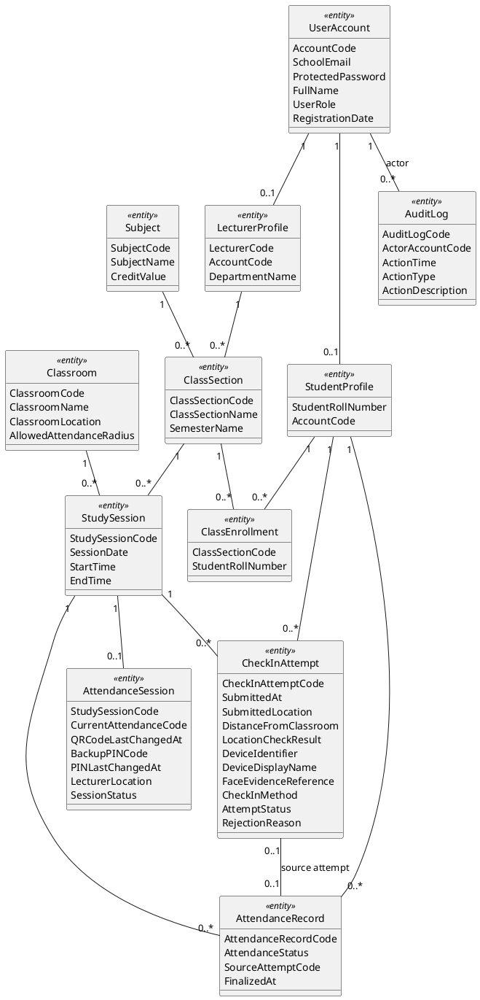

### **II.1.2 Contextual boundary and control class diagram**

This diagram shows how actors enter the system through boundary objects and how boundary objects delegate to control, business logic, algorithm, and entity objects. Boundary objects do not directly manipulate entity objects.

#### **Figure II-2 Contextual boundary class diagram for AFAS**

```plantuml
@startuml
skinparam style strictuml
hide circle

class "Student" as Student <<actor>>
class "Lecturer" as Lecturer <<actor>>
class "Admin" as Admin <<actor>>

class "Student Mobile Interface" as StudentUI <<boundary>>
class "Lecturer Web Interface" as LecturerUI <<boundary>>
class "Admin Web Interface" as AdminUI <<boundary>>
class "User Access Interface" as UserAccessUI <<boundary>>

class "Authentication Control" as AuthControl <<control>>
class "Check-in Control" as CheckInControl <<control>>
class "Session Control" as SessionControl <<state-machine>>
class "Attendance History Control" as HistoryControl <<control>>
class "Monitor Control" as MonitorControl <<control>>
class "Adjustment Control" as AdjustmentControl <<control>>
class "Report Control" as ReportControl <<control>>
class "Catalog Control" as CatalogControl <<control>>
class "Room Configuration Control" as RoomControl <<control>>

class "Authentication Rules" as AuthRules <<business logic>>
class "Attendance Code Rules" as CodeRules <<business logic>>
class "Identity Evidence Rules" as IdentityRules <<business logic>>
class "Session Rules" as SessionRules <<business logic>>
class "Report Eligibility Rules" as ReportRules <<business logic>>
class "Catalog Uniqueness Rules" as CatalogRules <<business logic>>
class "Campus Location Rules" as CampusRules <<business logic>>
class "Location Distance Calculation" as DistanceCalc <<algorithm>>
class "Attendance Status Calculation" as StatusRules <<business logic>>

class "Core Attendance Entities" as Entities <<entity>>

Student --> StudentUI
Lecturer --> LecturerUI
Admin --> AdminUI
Student --> UserAccessUI
Lecturer --> UserAccessUI
Admin --> UserAccessUI

UserAccessUI --> AuthControl
StudentUI --> AuthControl
StudentUI --> CheckInControl
StudentUI --> HistoryControl
LecturerUI --> AuthControl
LecturerUI --> SessionControl
LecturerUI --> MonitorControl
LecturerUI --> AdjustmentControl
LecturerUI --> ReportControl
AdminUI --> AuthControl
AdminUI --> CatalogControl
AdminUI --> RoomControl

AuthControl --> AuthRules
CheckInControl --> CodeRules
CheckInControl --> IdentityRules
CheckInControl --> DistanceCalc
CheckInControl --> StatusRules
SessionControl --> SessionRules
SessionControl --> CodeRules
HistoryControl --> AuthRules
AdjustmentControl --> SessionRules
ReportControl --> ReportRules
CatalogControl --> CatalogRules
RoomControl --> CampusRules
RoomControl --> DistanceCalc

AuthControl --> Entities
CheckInControl --> Entities
SessionControl --> Entities
HistoryControl --> Entities
MonitorControl --> Entities
AdjustmentControl --> Entities
ReportControl --> Entities
CatalogControl --> Entities
RoomControl --> Entities
@enduml
```

### **II.1.3 Object structuring criteria**

| **Object** | **Stereotype** | **Responsibility** | **Trace source** |
| :--- | :--- | :--- | :--- |
| Student Mobile Interface | `«boundary»` | Receives student authentication, QR, PIN, and history actions. | Student; UC01-UC04 |
| Lecturer Web Interface | `«boundary»` | Receives lecturer session, monitor, adjustment, and export actions. | Lecturer; UC01, UC05-UC08 |
| Admin Web Interface | `«boundary»` | Receives administrator catalog and classroom configuration actions. | Admin; UC01, UC09-UC10 |
| User Access Interface | `«boundary»` | Receives common authentication and reset-instruction actions from all user roles. | Student, Lecturer, Admin; UC01 |
| Authentication Control | `«control»` | Coordinates user authentication and role access. | UC01, BR-01 |
| Check-in Control | `«control»` | Coordinates QR/PIN evidence validation and attendance attempt handling. | UC02, UC04 |
| Session Control | `«state-machine»` | Coordinates attendance session lifecycle: active, stopped, reopened, finalized. | UC05, BR-02, BR-08, BR-10, BR-12 |
| Attendance History Control | `«control»` | Coordinates student attendance history retrieval and access checking. | UC03, BR-01 |
| Monitor Control | `«control»` | Coordinates live attendance status visualization. | UC06 |
| Adjustment Control | `«control»` | Coordinates manual attendance status adjustment and audit capture. | UC07, BR-09, BR-10 |
| Report Control | `«control»` | Coordinates finalized attendance report preparation. | UC08, BR-08 |
| Catalog Control | `«control»` | Coordinates catalog creation, update, deletion, and import validation. | UC09, BR-11 |
| Room Configuration Control | `«control»` | Coordinates classroom location and allowed radius configuration. | UC10, BR-03 |
| Attendance Code Rules | `«business logic»` | Checks QR/PIN activity, validity window, and session match. | UC02, UC04, UC05, BR-02, BR-12 |
| Identity Evidence Rules | `«business logic»` | Checks biometric completion or selfie fallback evidence. | UC02, UC04, BR-04 |
| Location Distance Calculation | `«algorithm»` | Calculates distance from submitted location to classroom range. | UC02, UC04, UC10, BR-03 |
| Attendance Status Calculation | `«business logic»` | Determines `Present` or `Late` from accepted check-in time using the 15-minute Late threshold. | UC02, UC04, BR-12, BR-13 |
| Session Rules | `«business logic»` | Checks scheduled time window, assigned lecturer, active session uniqueness, absent assignment, and finalization. | UC05, UC07, BR-08, BR-10 |
| Report Eligibility Rules | `«business logic»` | Ensures export uses finalized attendance results. | UC08, BR-08 |
| Catalog Uniqueness Rules | `«business logic»` | Ensures catalog identifiers are unique. | UC09, BR-11 |
| Campus Location Rules | `«business logic»` | Ensures classroom location settings belong to the university campus. | UC10, BR-03 |
| UserAccount, StudentProfile, LecturerProfile | `«entity»` | Store user and role profile information. | UC01, UC09 |
| Classroom, Subject, ClassSection, ClassEnrollment, StudySession | `«entity»` | Store academic catalog, roster, classroom, and scheduled session information. | UC03, UC05, UC06, UC08-UC10 |
| AttendanceSession, CheckInAttempt, AttendanceRecord, AuditLog | `«entity»` | Store attendance lifecycle, evidence, official result, and audit information. | UC02, UC04-UC08, UC10 |

---

## **II.2 Interaction diagrams**

The following sequence and communication diagrams realize each use case from Section I.5.2. Message wording follows the use case steps and business rules from Section I.6.

### **II.2.1 UC01 - Authenticate User**

#### **Figure II-3 Sequence diagram for UC01 - Authenticate User**

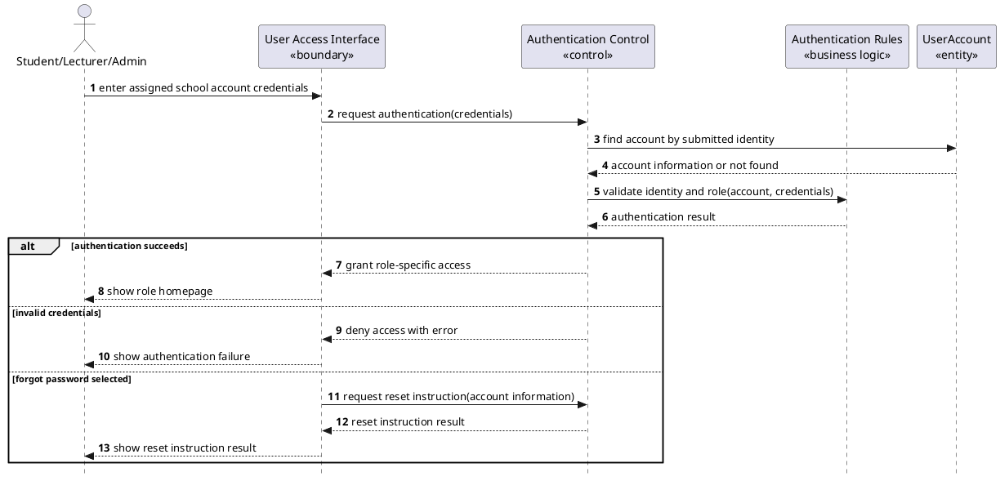

#### **Figure II-4 Communication diagram for UC01 - Authenticate User**

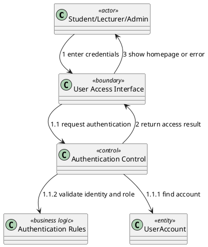

### **II.2.2 UC02 - Check In via Dynamic QR Code**

#### **Figure II-5 Sequence diagram for UC02 - Check In via Dynamic QR Code**

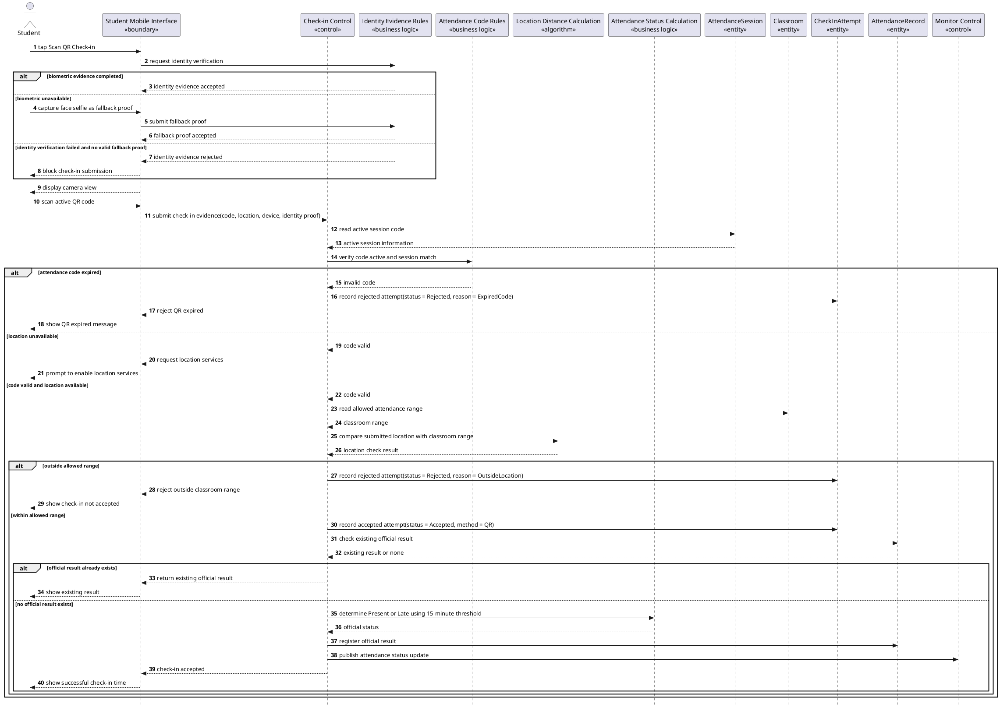

#### **Figure II-6 Communication diagram for UC02 - Check In via Dynamic QR Code**

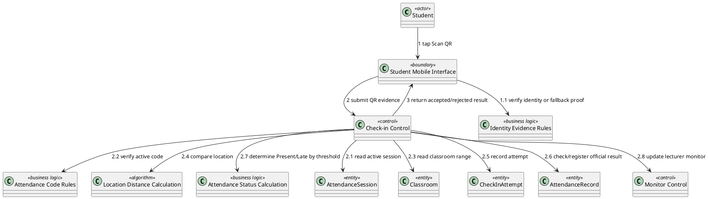

### **II.2.3 UC03 - View Personal Attendance History**

#### **Figure II-7 Sequence diagram for UC03 - View Personal Attendance History**

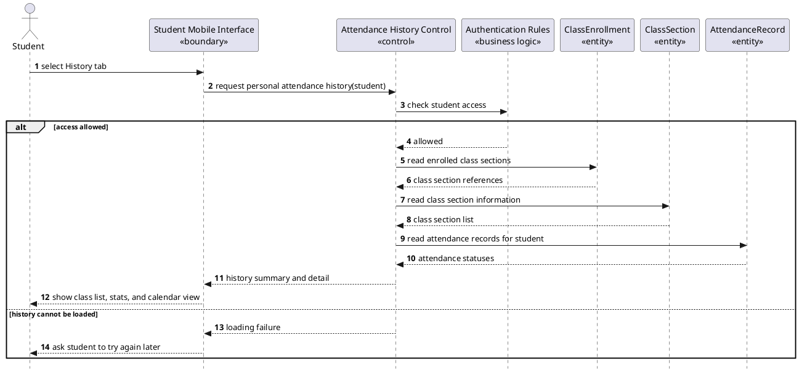

#### **Figure II-8 Communication diagram for UC03 - View Personal Attendance History**

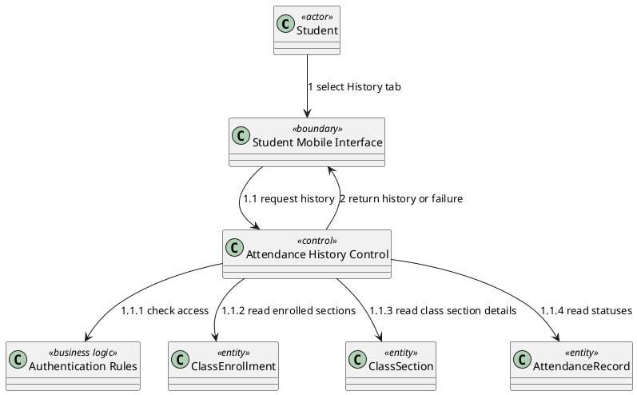

### **II.2.4 UC04 - Check In via PIN Fallback**

#### **Figure II-9 Sequence diagram for UC04 - Check In via PIN Fallback**

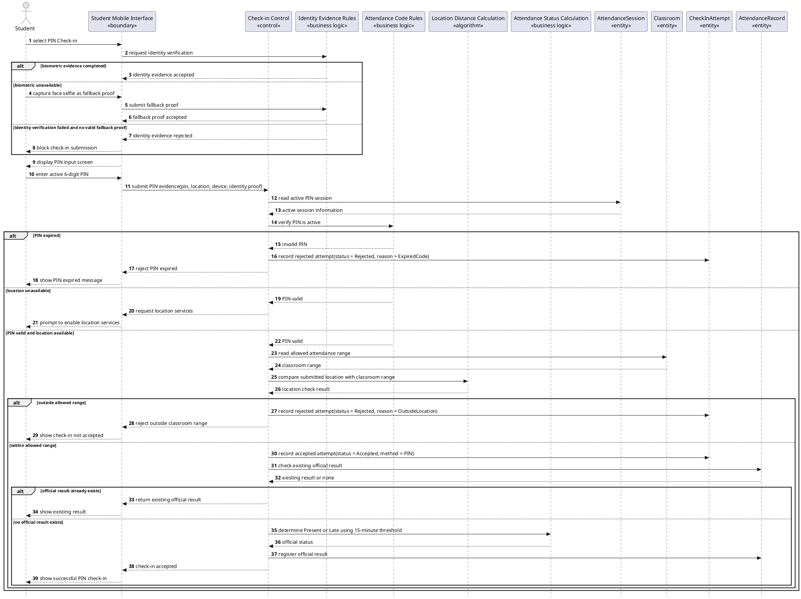

#### **Figure II-10 Communication diagram for UC04 - Check In via PIN Fallback**

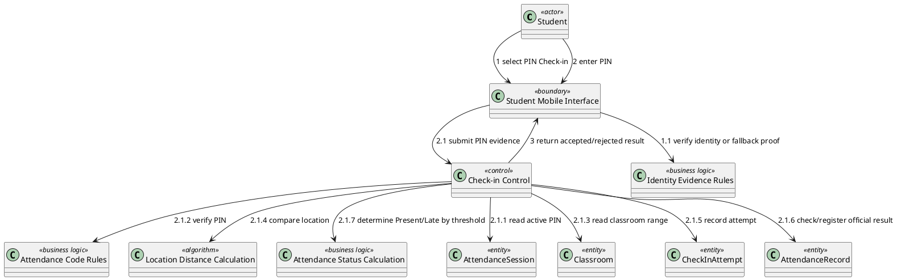

### **II.2.5 UC05 - Manage Attendance Session**

#### **Figure II-11 Sequence diagram for UC05 - Manage Attendance Session**

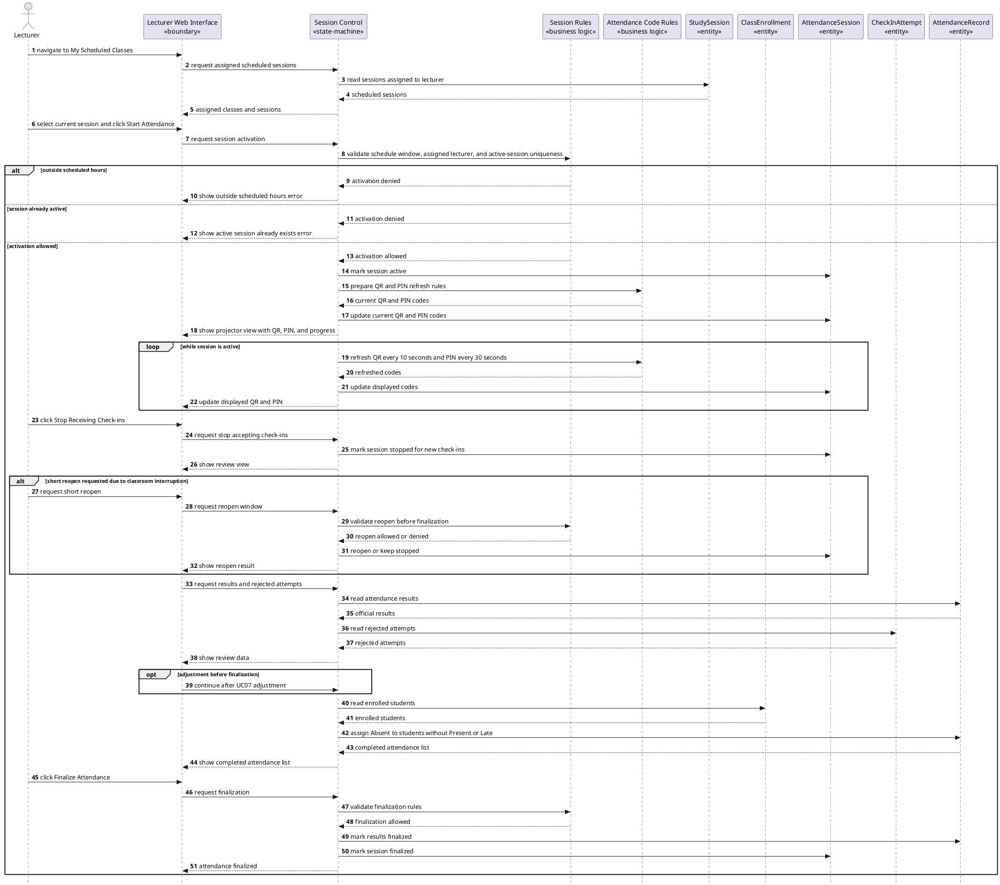

#### **Figure II-12 Communication diagram for UC05 - Manage Attendance Session**

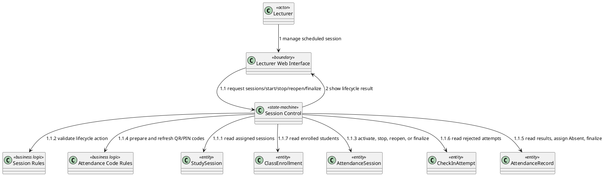

### **II.2.6 UC06 - Monitor Attendance in Real Time**

#### **Figure II-13 Sequence diagram for UC06 - Monitor Attendance in Real Time**

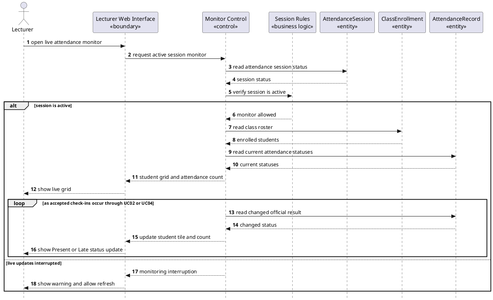

#### **Figure II-14 Communication diagram for UC06 - Monitor Attendance in Real Time**

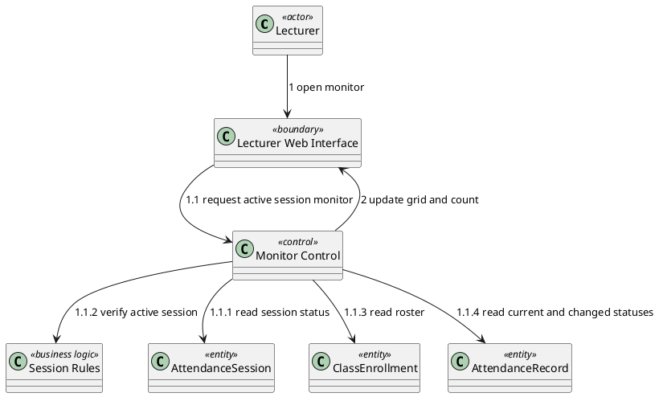

### **II.2.7 UC07 - Adjust Attendance Manually**

#### **Figure II-15 Sequence diagram for UC07 - Adjust Attendance Manually**

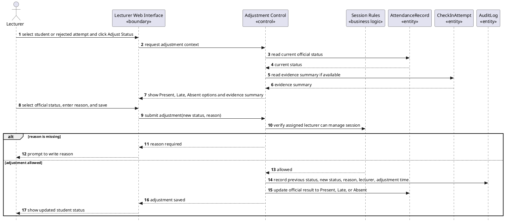

#### **Figure II-16 Communication diagram for UC07 - Adjust Attendance Manually**

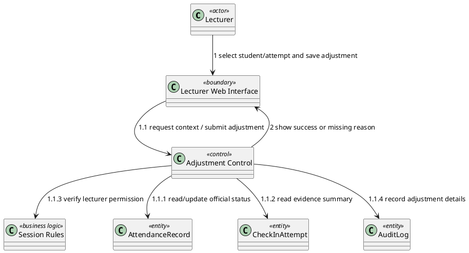

### **II.2.8 UC08 - Export Attendance Report**

#### **Figure II-17 Sequence diagram for UC08 - Export Attendance Report**

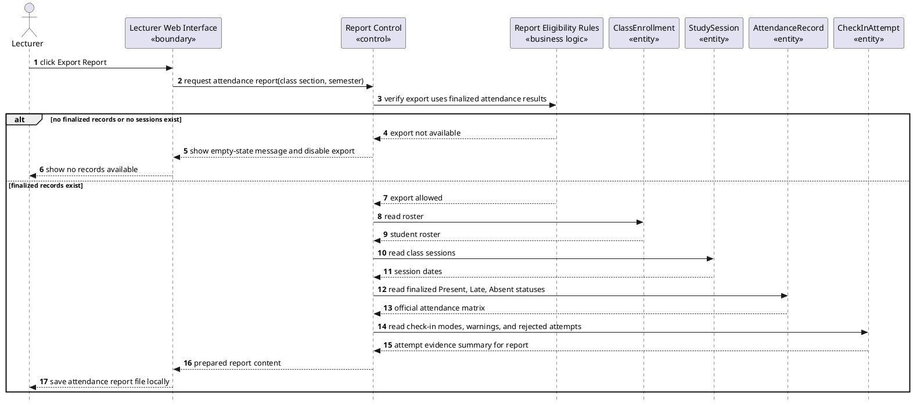

#### **Figure II-18 Communication diagram for UC08 - Export Attendance Report**

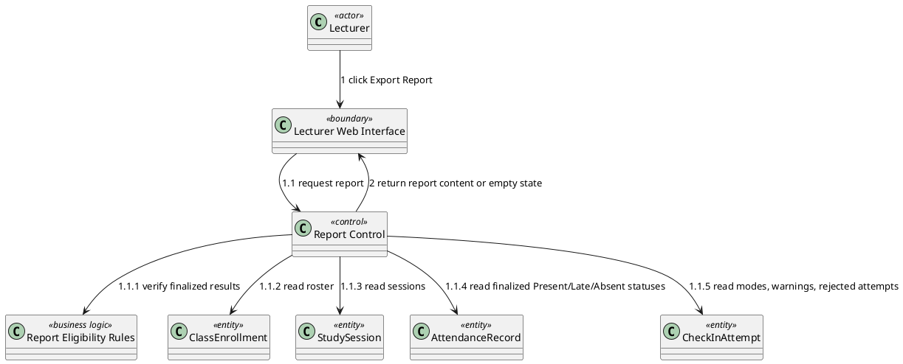

### **II.2.9 UC09 - Manage System Catalog**

#### **Figure II-19 Sequence diagram for UC09 - Manage System Catalog**

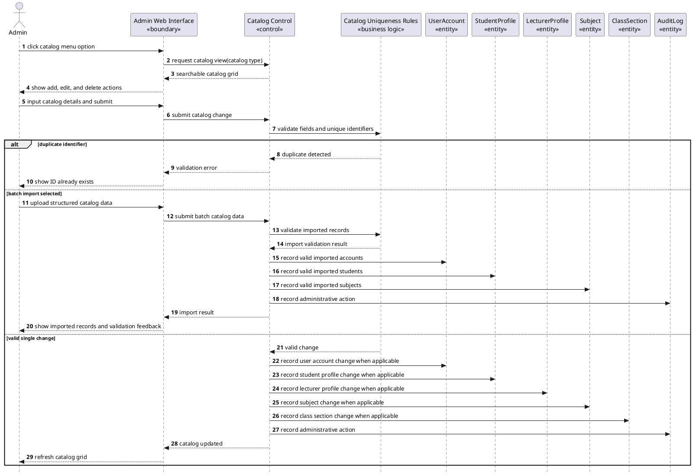

#### **Figure II-20 Communication diagram for UC09 - Manage System Catalog**

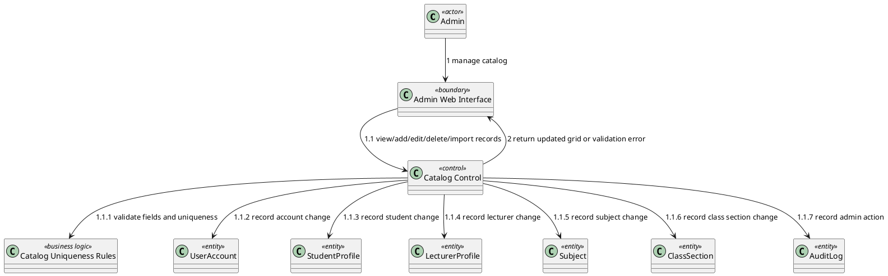

### **II.2.10 UC10 - Configure Classroom Location**

#### **Figure II-21 Sequence diagram for UC10 - Configure Classroom Location**

```plantuml
@startuml
skinparam style strictuml
autonumber
actor "Admin" as Admin
participant "Admin Web Interface\n«boundary»" as AdminUI
participant "Room Configuration Control\n«control»" as RoomControl
participant "Campus Location Rules\n«business logic»" as CampusRules
participant "Location Distance Calculation\n«algorithm»" as DistanceCalc
participant "Classroom\n«entity»" as Classroom
participant "AuditLog\n«entity»" as AuditLog

Admin -> AdminUI : click Room Management
AdminUI -> RoomControl : request classroom list
RoomControl -> Classroom : read physical classrooms
Classroom --> RoomControl : classroom list
RoomControl --> AdminUI : classroom list with configuration action
Admin -> AdminUI : select classroom and configure location
AdminUI --> Admin : show location and allowed radius form

alt on-site calibration
  Admin -> AdminUI : capture current location
  AdminUI --> Admin : populate captured location values
else manual entry
  Admin -> AdminUI : enter classroom center point
end

Admin -> AdminUI : enter allowed radius and save configuration
AdminUI -> RoomControl : submit location settings
RoomControl -> CampusRules : verify location belongs to university campus
RoomControl -> DistanceCalc : validate allowed radius consistency

alt out-of-bounds location
  CampusRules --> RoomControl : location outside campus boundary
  RoomControl --> AdminUI : warning to verify location values
  AdminUI --> Admin : show out-of-bounds warning
else location accepted
  CampusRules --> RoomControl : campus location accepted
  DistanceCalc --> RoomControl : radius accepted
  RoomControl -> Classroom : update room location settings
  RoomControl -> AuditLog : record administrative action
  RoomControl --> AdminUI : configuration saved
  AdminUI --> Admin : show saved configuration
end
@enduml
```

#### **Figure II-22 Communication diagram for UC10 - Configure Classroom Location**

```plantuml
@startuml
class "Admin" as Admin <<actor>>
class "Admin Web Interface" as AdminUI <<boundary>>
class "Room Configuration Control" as RoomControl <<control>>
class "Campus Location Rules" as CampusRules <<business logic>>
class "Location Distance Calculation" as DistanceCalc <<algorithm>>
class "Classroom" as Classroom <<entity>>
class "AuditLog" as AuditLog <<entity>>

Admin --> AdminUI : 1 configure classroom location
AdminUI --> RoomControl : 1.1 request rooms / submit settings
RoomControl --> Classroom : 1.1.1 read or update classroom settings
RoomControl --> CampusRules : 1.1.2 verify campus boundary
RoomControl --> DistanceCalc : 1.1.3 validate allowed radius
RoomControl --> AuditLog : 1.1.4 record admin action
RoomControl --> AdminUI : 2 return saved result or warning
@enduml
```

---

## **II.3 State diagrams**

### **II.3.1 AttendanceSession state**

`AttendanceSession` is state-dependent because UC05 requires a lifecycle from scheduled session selection to active check-in, stopped review, optional short reopen, and finalization.

#### **Figure II-23 State diagram for AttendanceSession**

```plantuml
@startuml
[*] --> NotStarted
NotStarted --> Active : startAttendance [within scheduled window and no active session]
NotStarted --> NotStarted : startAttendance [outside scheduled window or already active]

Active --> Active : refreshQRCode [every 10 seconds]
Active --> Active : refreshPIN [every 30 seconds]
Active --> Stopped : stopReceivingCheckIns

Stopped --> Active : shortReopen [interruption reason and before finalization]
Stopped --> UnderReview : reviewResultsAndRejectedAttempts
UnderReview --> UnderReview : adjustAttendance [UC07]
UnderReview --> Finalized : finalizeAttendance
Finalized --> [*]
@enduml
```

### **II.3.2 CheckInAttempt state**

`CheckInAttempt` is state-dependent because UC02 and UC04 require rejected attempts to be retained for lecturer review while accepted attempts may become the source for one official attendance result.

#### **Figure II-24 State diagram for CheckInAttempt**

```plantuml
@startuml
[*] --> Blocked : identityEvidenceFailedAndNoFallback
[*] --> Submitted : checkInEvidenceSubmitted
Submitted --> IdentityAccepted : identityEvidenceAccepted
IdentityAccepted --> CodeValid : QRorPINActive
IdentityAccepted --> Rejected : QRorPINExpired
CodeValid --> LocationAvailable : locationProvided
CodeValid --> Blocked : locationUnavailable
LocationAvailable --> Rejected : outsideAllowedRange
LocationAvailable --> Accepted : withinAllowedRange
Accepted --> LinkedToOfficialResult : officialResultCreated
Accepted --> DuplicateIgnored : officialResultAlreadyExists
Rejected --> RetainedForReview
Blocked --> [*]
LinkedToOfficialResult --> [*]
DuplicateIgnored --> [*]
RetainedForReview --> [*]
@enduml
```

### **II.3.3 AttendanceRecord state**

`AttendanceRecord` is state-dependent because UC02, UC04, UC05, UC07, and UC08 distinguish pending, official Present/Late/Absent, adjusted, finalized, and exportable attendance results. Rejected check-ins remain in `CheckInAttempt` and are not official attendance results.

#### **Figure II-25 State diagram for AttendanceRecord**

```plantuml
@startuml
[*] --> NotRecorded
NotRecorded --> OfficialPresent : acceptedCheckIn [within first 15 minutes]
NotRecorded --> OfficialLate : acceptedCheckIn [later than first 15 minutes]
NotRecorded --> OfficialAbsent : finalizePreparation [no official Present or Late]

OfficialPresent --> Adjusted : adjustStatus [reason provided]
OfficialLate --> Adjusted : adjustStatus [reason provided]
OfficialAbsent --> Adjusted : adjustStatus [reason provided]

Adjusted --> Finalized : finalizeAttendance
OfficialPresent --> Finalized : finalizeAttendance
OfficialLate --> Finalized : finalizeAttendance
OfficialAbsent --> Finalized : finalizeAttendance

Finalized --> Exportable : reportRequested
Exportable --> [*]
@enduml
```

---

## **II.4 Analysis traceability matrix**

| **Requirement / UC** | **Actor** | **Analysis objects** | **Dynamic diagrams** | **Business rules covered** |
| :--- | :--- | :--- | :--- | :--- |
| UC01 Authenticate User | Student, Lecturer, Admin | User Access Interface, Authentication Control, Authentication Rules, UserAccount | Figure II-3, Figure II-4 | BR-01 |
| UC02 Check In via Dynamic QR Code | Student | Student Mobile Interface, Check-in Control, Identity Evidence Rules, Attendance Code Rules, Location Distance Calculation, Attendance Status Calculation, AttendanceSession, Classroom, CheckInAttempt, AttendanceRecord, Monitor Control | Figure II-5, Figure II-6, Figure II-24, Figure II-25 | BR-02, BR-03, BR-04, BR-05, BR-06, BR-12, BR-13 |
| UC03 View Personal Attendance History | Student | Student Mobile Interface, Attendance History Control, Authentication Rules, ClassEnrollment, ClassSection, AttendanceRecord | Figure II-7, Figure II-8 | BR-01 |
| UC04 Check In via PIN Fallback | Student | Student Mobile Interface, Check-in Control, Identity Evidence Rules, Attendance Code Rules, Location Distance Calculation, Attendance Status Calculation, AttendanceSession, Classroom, CheckInAttempt, AttendanceRecord | Figure II-9, Figure II-10, Figure II-24, Figure II-25 | BR-03, BR-04, BR-05, BR-06, BR-07, BR-12, BR-13 |
| UC05 Manage Attendance Session | Lecturer | Lecturer Web Interface, Session Control, Session Rules, Attendance Code Rules, StudySession, ClassEnrollment, AttendanceSession, CheckInAttempt, AttendanceRecord | Figure II-11, Figure II-12, Figure II-23 | BR-02, BR-06, BR-08, BR-10, BR-12 |
| UC06 Monitor Attendance in Real Time | Lecturer | Lecturer Web Interface, Monitor Control, Session Rules, AttendanceSession, ClassEnrollment, AttendanceRecord | Figure II-13, Figure II-14 | NF-01 |
| UC07 Adjust Attendance Manually | Lecturer | Lecturer Web Interface, Adjustment Control, Session Rules, AttendanceRecord, CheckInAttempt, AuditLog | Figure II-15, Figure II-16, Figure II-25 | BR-09, BR-10 |
| UC08 Export Attendance Report | Lecturer | Lecturer Web Interface, Report Control, Report Eligibility Rules, ClassEnrollment, StudySession, AttendanceRecord, CheckInAttempt | Figure II-17, Figure II-18, Figure II-25 | BR-08 |
| UC09 Manage System Catalog | Admin | Admin Web Interface, Catalog Control, Catalog Uniqueness Rules, UserAccount, StudentProfile, LecturerProfile, Subject, ClassSection, AuditLog | Figure II-19, Figure II-20 | BR-11 |
| UC10 Configure Classroom Location | Admin | Admin Web Interface, Room Configuration Control, Campus Location Rules, Location Distance Calculation, Classroom, AuditLog | Figure II-21, Figure II-22 | BR-03 |

---

## **II.5 Verification checklist against Section I**

| **Check item** | **Result** | **Evidence in this section** |
| :--- | :--- | :--- |
| UC list matches Requirement Section I.5.2 | Pass | UC01-UC10 only; Figures II-3 through II-22 |
| UC names match Requirement Section I.5.2 | Pass | Headings II.2.1-II.2.10 |
| Analysis uses COMET stereotypes | Pass | Figures II-1 through II-22 use `«boundary»`, `«control»`, `«state-machine»`, `«entity»`, `«business logic»`, and `«algorithm»` |
| Boundary objects delegate through control or logic objects | Pass | Figure II-2 and all interaction diagrams |
| QR/PIN check-in records attempts before official results | Pass | Figures II-5, II-9, II-24 |
| BR-13 Late threshold is mapped to status calculation | Pass | Figures II-5, II-9, Figure II-25 |
| Rejected attempts are retained for lecturer review | Pass | Figures II-5, II-9, II-11, II-24 |
| UC05 includes start, stop, review, short reopen, adjustment handoff, Absent assignment, completed-list review, and finalization | Pass | Figure II-11 and Figure II-23 |
| UC07 records previous status, new status, reason, lecturer, and adjustment time | Pass | Figure II-15 |
| UC08 exports only finalized attendance results | Pass | Figure II-17 and Figure II-25 |
| Official attendance results exclude Rejected status | Pass | Figure II-1, Figure II-24, Figure II-25 |
| UC10 validates campus boundary and records audit action | Pass | Figure II-21 |
| Removed untraced analysis objects and flows | Pass | Old external-login flow, untraced device lifecycle, network evidence details, and unsupported face-matching threshold are not modeled |
